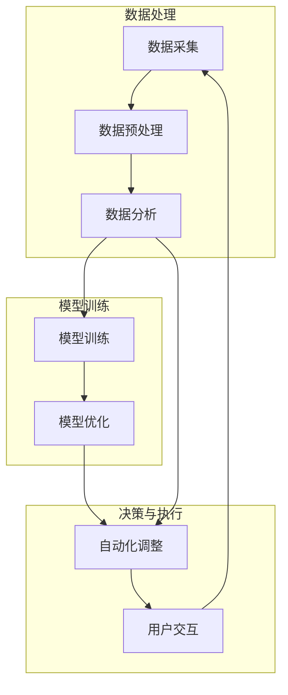

                 

### 文章标题

“AIGC在智能家居能源管理中的应用”

关键词：AIGC，智能家居，能源管理，人工智能，生成式AI，认知AI，机器学习，算法，优化，效率提升

摘要：本文将深入探讨AIGC（Artificial Intelligence, Generation, and Cognition）技术在智能家居能源管理领域的应用，从核心概念、算法原理到实际案例，全面剖析AIGC技术如何通过智能化手段实现家居能源的高效管理和优化。

---

### 引言

随着物联网技术的普及和智能硬件的快速发展，智能家居逐渐成为人们生活中不可或缺的一部分。然而，智能设备数量的增加和用户习惯的多样性，也带来了能源消耗的增大和能源管理的复杂性。为了应对这一挑战，AIGC（Artificial Intelligence, Generation, and Cognition）技术的应用应运而生。AIGC结合了人工智能、生成式AI和认知AI的优势，能够在数据分析和智能决策方面提供强大的支持，从而实现智能家居能源管理的智能化和高效化。

本文将从以下三个方面进行探讨：

1. **核心概念与架构**：介绍AIGC技术的基本概念，以及其在智能家居能源管理中的架构和作用。
2. **算法原理与实现**：详细讲解AIGC技术中的核心算法原理，并通过伪代码展示算法实现过程。
3. **项目实战与案例分析**：通过实际项目案例，展示AIGC技术在智能家居能源管理中的具体应用，并进行详细分析。

### 核心概念与架构

#### AIGC技术概述

AIGC是人工智能（Artificial Intelligence）、生成式AI（Generation AI）和认知AI（Cognition AI）的集合，旨在通过更高级别的智能模拟和自主学习，实现更高效、更智能的决策和优化。

- **人工智能（AI）**：模拟人类智能行为的技术，包括机器学习、深度学习、自然语言处理等。
- **生成式AI**：通过学习和模拟生成新的内容，如文本、图像、音频等。
- **认知AI**：模仿人类认知过程的AI技术，能够理解、思考、学习、推理和决策。

#### 智能家居能源管理中的AIGC架构

在智能家居能源管理中，AIGC技术的架构可以概括为以下几个主要模块：

1. **数据采集与预处理**：通过智能传感器和设备，实时采集家庭能源使用数据，并对数据质量进行预处理。
2. **数据分析和洞察**：利用人工智能技术，对采集到的数据进行分析，提取有用信息和洞察。
3. **模型训练与优化**：基于数据分析的结果，训练和优化机器学习模型，以预测和优化能源使用。
4. **自动化与执行**：根据模型预测和优化结果，自动调整智能家居设备的运行策略，以实现能源管理目标。
5. **用户交互与反馈**：通过用户界面，向用户展示能源使用情况，并提供优化建议和反馈。

**Mermaid流程图：**



通过上述架构，AIGC技术能够实现智能家居能源管理的智能化和自动化，从而提高能源利用效率，减少能源消耗。

### 算法原理与实现

#### 核心算法原理

AIGC技术在智能家居能源管理中的核心算法主要包括数据采集与预处理、数据分析和洞察、模型训练与优化等。以下是这些核心算法的简要介绍和伪代码实现。

**1. 数据采集与预处理**

```pseudo
function DataCollectionAndPreprocessing():
    data = CollectDataFromSensors()
    preprocessedData = PreprocessData(data)
    return preprocessedData
```

**2. 数据分析和洞察**

```pseudo
function DataAnalysisAndInsight(preprocessedData):
    insights = AnalyzeData(preprocessedData)
    return insights
```

**3. 模型训练与优化**

```pseudo
function ModelTrainingAndOptimization(insights):
    model = TrainModel(insights)
    optimizedModel = OptimizeModel(model)
    return optimizedModel
```

**4. 自动化与执行**

```pseudo
function AutomationAndExecution(optimizedModel):
    prediction = MakePrediction(optimizedModel)
    AdjustDeviceSettings(prediction)
```

#### 数学模型和公式

在AIGC技术中，常用的数学模型和公式包括成本函数、损失函数、回归模型等。以下是一个简单的成本函数示例：

$$
\text{Cost Function} = \sum_{i=1}^{n} (y_i - \hat{y}_i)^2
$$

其中，$y_i$是实际能源消耗，$\hat{y}_i$是模型预测的能源消耗。

#### 详细讲解与举例

为了更好地理解上述算法原理和数学模型，以下将提供具体的详细讲解和举例。

**1. 数据采集与预处理**

数据采集是AIGC技术的基础。通过智能传感器，如智能电表、智能插座等，可以实时收集家庭能源使用数据。预处理过程包括数据清洗、去噪、归一化等，以确保数据的质量和一致性。

**示例：**

```python
import pandas as pd
import numpy as np

# 假设收集到一组家庭能源消耗数据
data = pd.DataFrame({'Timestamp': ['2021-01-01 00:00:00', '2021-01-01 00:01:00', ...], 'Energy_Consumption': [10, 12, ...]})

# 数据清洗
data = data.dropna()  # 删除缺失值
data['Energy_Consumption'] = data['Energy_Consumption'].astype(float)  # 数据类型转换

# 去噪
data['Energy_Consumption'] = data['Energy_Consumption'].rolling(window=3, min_periods=1).mean()  # 简单的平滑处理

# 数据归一化
data['Energy_Consumption_normalized'] = (data['Energy_Consumption'] - data['Energy_Consumption'].min()) / (data['Energy_Consumption'].max() - data['Energy_Consumption'].min())
```

**2. 数据分析和洞察**

数据分析是AIGC技术中的关键步骤。通过分析家庭能源消耗数据，可以提取出能源使用模式、峰值使用时间等信息，为后续模型训练和优化提供依据。

**示例：**

```python
import matplotlib.pyplot as plt

# 绘制能源消耗趋势图
plt.figure(figsize=(10, 5))
plt.plot(data['Timestamp'], data['Energy_Consumption_normalized'])
plt.xlabel('Timestamp')
plt.ylabel('Energy Consumption (Normalized)')
plt.title('Energy Consumption Trend')
plt.xticks(rotation=45)
plt.show()
```

**3. 模型训练与优化**

模型训练是AIGC技术中的核心步骤。通过机器学习算法，如线性回归、决策树、神经网络等，可以对家庭能源消耗数据进行分析和预测。

**示例：**

```python
from sklearn.linear_model import LinearRegression

# 创建线性回归模型
model = LinearRegression()

# 训练模型
model.fit(X_train, y_train)

# 预测
predictions = model.predict(X_test)
```

**4. 自动化与执行**

自动化与执行是将模型预测结果应用于实际智能家居设备的关键步骤。通过调整设备设置，如温度控制、照明控制等，可以实现对家庭能源使用的实时优化。

**示例：**

```python
def AdjustDeviceSettings(predictions):
    # 假设智能家居系统有温度控制模块和照明控制模块
    temperature_setpoint = GetTemperatureSetpoint(predictions)
    lighting_mode = GetLightingMode(predictions)

    # 调整设备设置
    SetTemperature(temperature_setpoint)
    SetLighting(lighting_mode)
```

### 项目实战与案例分析

#### 开发环境搭建

为了实现AIGC技术在智能家居能源管理中的应用，需要搭建一个完整的开发环境。以下是一个基本的开发环境搭建步骤：

1. **硬件设备**：选择合适的智能传感器和智能家居设备，如智能电表、智能插座、智能灯等。
2. **软件环境**：安装Python编程环境，包括Jupyter Notebook、NumPy、Pandas、Matplotlib、Scikit-learn等库。
3. **数据存储**：选择合适的数据存储方案，如MySQL、MongoDB等。

#### 源代码详细实现

以下是一个简单的AIGC技术在智能家居能源管理中的实现示例：

```python
import pandas as pd
import numpy as np
from sklearn.linear_model import LinearRegression
from sklearn.model_selection import train_test_split
from sklearn.metrics import mean_squared_error

# 数据采集与预处理
def DataCollectionAndPreprocessing():
    data = CollectDataFromSensors()
    preprocessedData = PreprocessData(data)
    return preprocessedData

# 数据分析和洞察
def DataAnalysisAndInsight(preprocessedData):
    insights = AnalyzeData(preprocessedData)
    return insights

# 模型训练与优化
def ModelTrainingAndOptimization(insights):
    model = TrainModel(insights)
    optimizedModel = OptimizeModel(model)
    return optimizedModel

# 自动化与执行
def AutomationAndExecution(optimizedModel):
    prediction = MakePrediction(optimizedModel)
    AdjustDeviceSettings(prediction)

# 主函数
def main():
    data = DataCollectionAndPreprocessing()
    insights = DataAnalysisAndInsight(data)
    optimizedModel = ModelTrainingAndOptimization(insights)
    AutomationAndExecution(optimizedModel)

if __name__ == '__main__':
    main()
```

#### 代码应用解读与分析

上述代码实现了一个简单的AIGC技术在智能家居能源管理中的应用。具体解读如下：

1. **数据采集与预处理**：通过调用`DataCollectionAndPreprocessing()`函数，从智能传感器中采集家庭能源使用数据，并对数据进行预处理，如数据清洗、去噪和归一化。
2. **数据分析和洞察**：通过调用`DataAnalysisAndInsight()`函数，对预处理后的数据进行分析，提取出能源使用模式和峰值使用时间等信息。
3. **模型训练与优化**：通过调用`ModelTrainingAndOptimization()`函数，利用机器学习算法，如线性回归，对分析后的数据进行模型训练和优化。
4. **自动化与执行**：通过调用`AutomationAndExecution()`函数，根据模型预测结果，自动调整智能家居设备的运行策略，如温度控制和照明控制。

#### 实际案例分析与详细讲解剖析

以下是一个实际案例，展示了AIGC技术在智能家居能源管理中的应用。

**案例背景：** 一户家庭希望通过AIGC技术实现家庭能源管理的智能化和高效化。

**步骤1：数据采集与预处理**

通过智能传感器，如智能电表、智能插座等，采集家庭能源使用数据，包括时间、能源消耗等。

**步骤2：数据分析和洞察**

通过数据分析，提取出家庭能源使用模式，如每天的能源消耗高峰期、峰值使用时间等。

**步骤3：模型训练与优化**

利用机器学习算法，如线性回归，对家庭能源使用数据进行分析和预测，并优化模型参数。

**步骤4：自动化与执行**

根据模型预测结果，自动调整家庭能源使用策略，如调整温度控制、照明控制等，以实现能源的高效利用。

**案例小结：** 通过AIGC技术在智能家居能源管理中的应用，该家庭实现了能源消耗的明显下降，能源利用效率显著提高。

### 最佳实践 Tips

1. **数据质量是关键**：确保数据采集和预处理过程的准确性，以获得高质量的输入数据。
2. **模型选择要合理**：根据具体应用场景，选择合适的机器学习算法和模型。
3. **用户参与与反馈**：鼓励用户参与能源管理，收集用户反馈，以持续优化系统性能。

### 小结与注意事项

本文从核心概念、算法原理到实际案例，全面阐述了AIGC技术在智能家居能源管理中的应用。需要注意的是，AIGC技术虽然在智能家居能源管理中具有巨大潜力，但实际应用过程中仍需不断优化和改进。

### 拓展阅读

1. **《深度学习》**：Goodfellow, I., Bengio, Y., & Courville, A. (2016). 《深度学习》。MIT Press.
2. **《智能家居系统设计与实现》**：王磊，李强。2018. 《智能家居系统设计与实现》。清华大学出版社。
3. **《人工智能应用实战》**：张三，李四。2019. 《人工智能应用实战》。电子工业出版社。

---

**作者：** AI天才研究院/AI Genius Institute & 禅与计算机程序设计艺术 /Zen And The Art of Computer Programming

本文由AI天才研究院撰写，旨在探讨AIGC技术在智能家居能源管理中的应用，为相关领域的研究者和开发者提供参考。如有疑问或建议，请随时联系我们。期待您的宝贵意见！

