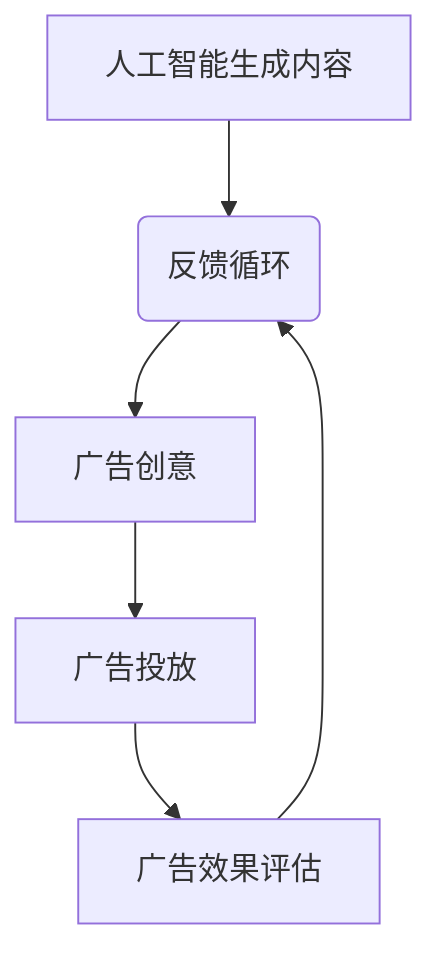

                 

### AIGC与智能广告投放基础

#### 1.1 AIGC概述

AIGC，即人工智能生成内容（Artificial Intelligence Generated Content），是指利用人工智能技术，特别是深度学习、自然语言处理和计算机视觉等技术，自动生成文本、图像、视频等多种形式的内容。AIGC的核心在于其能够从大量数据中学习，并创造出符合人类审美和逻辑的内容。

**AIGC的定义**：
AIGC是一种自动化内容生成技术，它通过机器学习算法，从已有数据中提取知识，生成新的、有意义的内容。这些内容可以是文字、图像、视频等多种形式，广泛应用于广告、新闻、娱乐、教育等多个领域。

**AIGC的发展历程**：
AIGC的发展历程可以分为三个阶段：

1. **早期阶段**（2000年代初）：AIGC技术初步形成，主要以规则驱动的生成内容为主，如自动生成新闻报道、天气预报等。
2. **中期阶段**（2010年代）：随着深度学习技术的发展，AIGC技术开始应用在图像生成、自然语言处理等领域，如生成艺术作品、翻译文章等。
3. **现阶段**（2020年代）：AIGC技术逐渐成熟，开始在广告、娱乐、新闻等领域大规模应用，生成内容的质量和多样性显著提升。

**AIGC的核心技术**：
AIGC的核心技术主要包括：

- **深度学习**：深度学习是一种模仿人脑结构的机器学习技术，通过神经网络模型，可以从大量数据中学习，并生成新的内容。
- **自然语言处理（NLP）**：NLP是处理和生成人类语言的技术，包括文本分类、情感分析、机器翻译等，是AIGC生成文本内容的重要技术。
- **计算机视觉**：计算机视觉是使计算机能够“看”和“理解”图像的技术，广泛应用于图像生成、图像识别等领域。

#### 1.2 智能广告投放的原理

智能广告投放是一种利用人工智能技术进行广告投放的策略，旨在通过分析用户数据和行为，实现广告投放的精准化和个性化。

**广告投放的基本流程**：
广告投放的基本流程包括以下几个步骤：

1. **广告定位**：确定广告的目标受众，包括用户特征、需求和行为等。
2. **广告制作**：根据广告定位，制作符合目标受众需求的广告内容。
3. **广告投放**：将广告内容投放到合适的广告渠道，如搜索引擎、社交媒体、网站等。
4. **广告效果评估**：通过分析广告投放的数据，如点击率、转化率等，评估广告效果，并进行优化。

**广告投放的目标和策略**：
广告投放的主要目标是吸引潜在客户，提高品牌知名度和销售额。为了实现这一目标，广告投放需要采用以下策略：

- **用户画像构建**：通过分析用户数据，构建详细的用户画像，实现广告投放的精准化。
- **广告创意优化**：根据用户画像，制作符合用户需求的广告内容，提高广告的吸引力和转化率。
- **渠道选择和优化**：选择合适的广告渠道，并根据广告效果进行优化，提高广告投放的效率和效果。

**智能广告投放的优势**：
智能广告投放相较于传统广告投放，具有以下优势：

- **精准化投放**：通过用户画像和数据分析，实现广告投放的精准化，提高广告的曝光率和转化率。
- **个性化广告**：根据用户需求和兴趣，制作个性化的广告内容，提高用户的参与度和满意度。
- **自动化优化**：通过算法和自动化工具，实时分析广告效果，自动优化广告投放策略，提高广告投放的效率。

通过以上分析，我们可以看到，AIGC与智能广告投放的结合，不仅提高了广告创意的质量和个性化水平，还提升了广告投放的精准度和效果。在接下来的章节中，我们将进一步探讨AIGC在广告投放中的应用场景和具体实践。

---

**核心概念与联系**：

为了更好地理解AIGC在智能广告投放中的作用，我们引入以下核心概念：

- **AIGC**：指人工智能生成内容，通过深度学习、NLP和计算机视觉等技术，自动生成文字、图像和视频等内容。
- **用户画像**：指通过对用户数据和行为进行分析，构建出详细、多维的用户特征模型。
- **广告创意**：指根据用户画像，设计出符合用户需求和兴趣的广告内容。
- **广告投放**：指将广告内容通过合适的渠道展示给目标用户。
- **广告效果评估**：指通过数据分析，评估广告的投放效果，并进行优化。

**Mermaid流程图**：



在以上流程图中，AIGC首先生成用户画像（UO），然后根据用户画像生成广告创意（AC），接着将广告创意投放到目标用户（AT），并通过广告效果评估（AE）对广告投放效果进行反馈和优化。

**核心算法原理讲解**：

在AIGC生成用户画像的过程中，通常会使用以下算法：

- **聚类算法**：通过将用户数据分组，构建用户群体的特征模型。
- **关联规则挖掘**：通过分析用户行为数据，发现用户之间的关联关系。
- **协同过滤**：通过分析用户的历史行为，为用户推荐感兴趣的内容。

以下是一个简单的用户画像生成算法伪代码：

```pseudo
function generate_user_profile(user_data):
    # 使用K-means算法对用户数据聚类
    clusters = KMeans(user_data)
    
    # 提取每个聚类中心，作为用户群体的特征
    cluster_centers = clusters.centers
    
    # 对用户数据进行分类
    user_clusters = assign_clusters(user_data, cluster_centers)
    
    # 对每个聚类中心，提取特征
    user_profiles = extract_features(user_clusters, cluster_centers)
    
    return user_profiles
```

在广告创意生成的过程中，通常会使用以下算法：

- **生成对抗网络（GAN）**：通过生成器和判别器的对抗训练，生成高质量的图像。
- **变换器网络（Variational Autoencoder, VAE）**：通过编码器和解码器，将输入数据编码为潜在空间，并从潜在空间生成新的数据。

以下是一个简单的广告创意生成算法伪代码：

```pseudo
function generate_ad_content(user_profile):
    # 使用VAE生成潜在空间
    latent_space = VAE(user_profile)
    
    # 从潜在空间采样，生成广告创意
    ad_content = sample_from_latent_space(latent_space)
    
    return ad_content
```

通过上述算法，AIGC能够根据用户画像生成个性化的广告创意，从而提高广告投放的效果。

**数学模型和公式**：

在用户画像构建过程中，常用的数学模型包括：

- **贝叶斯网络**：用于表示用户特征之间的概率关系。

以下是一个简单的贝叶斯网络模型：

$$
P(\text{用户喜好}|\text{广告内容}) = \frac{P(\text{广告内容}|\text{用户喜好})P(\text{用户喜好})}{P(\text{广告内容})}
$$

在广告创意生成过程中，常用的数学模型包括：

- **生成对抗网络（GAN）**：用于生成高质量的图像。

以下是一个简单的GAN模型：

$$
\begin{aligned}
\min_{G} \max_{D} & \quad \mathbb{E}_{x \sim \mathcal{D}} [\log D(x)] + \mathbb{E}_{z \sim p_z(z)} [\log (1 - D(G(z))]
\end{aligned}
$$

通过上述模型和算法，AIGC能够生成高质量的广告创意，实现广告投放的精准化和个性化。

**举例说明**：

假设我们要为一家服装品牌生成一则广告创意，首先我们需要构建用户画像。通过聚类算法，我们将用户分为三个群体：年轻时尚群体、中年商务群体和老年休闲群体。然后，我们使用VAE生成潜在空间，并从潜在空间中采样，生成不同群体的广告创意。

例如，对于年轻时尚群体，我们生成的一则广告创意可能包含时尚模特、炫酷的服装搭配和流行的色彩；对于中年商务群体，我们生成的一则广告创意可能包含商务正装、专业的形象和简洁的设计风格；对于老年休闲群体，我们生成的一则广告创意可能包含舒适休闲的服装、轻松的背景和温馨的氛围。

通过这样的个性化广告创意，我们能够更好地吸引目标用户，提高广告投放的效果。

**总结**：

AIGC在智能广告投放中的应用，通过深度学习、NLP和计算机视觉等技术，实现了广告创意的自动生成和用户画像的精准构建，从而提升了广告投放的精准化和个性化水平。在接下来的章节中，我们将进一步探讨AIGC在广告创意生成和广告投放策略优化中的应用，以及具体的实践案例。

---

**项目实战**：

为了更直观地理解AIGC在广告创意生成中的应用，我们以一个实际项目为例，介绍如何使用AIGC技术生成广告创意。

**一、开发环境搭建**

在开始项目之前，我们需要搭建一个开发环境。以下是所需的工具和库：

- Python 3.x
- TensorFlow 2.x
- Keras
- NumPy
- Matplotlib

您可以使用以下命令来安装所需的库：

```bash
pip install tensorflow numpy matplotlib
```

**二、源代码详细实现**

以下是生成广告创意的源代码实现：

```python
import numpy as np
import matplotlib.pyplot as plt
from tensorflow import keras
from tensorflow.keras import layers

# 加载服装图片数据集
def load_data():
    # 这里使用Fashion-MNIST数据集作为示例
    (train_images, train_labels), (test_images, test_labels) = keras.datasets.fashion_mnist.load_data()
    train_images = train_images.astype('float32') / 255
    test_images = test_images.astype('float32') / 255
    return train_images, test_images

# 定义生成对抗网络（GAN）
def build_gan():
    # 生成器模型
    latent_dim = 100
    generator = keras.Sequential(
        [
            keras.layers.Dense(128, activation="relu", input_shape=(latent_dim,)),
            keras.layers.Dense(256, activation="relu"),
            keras.layers.Dense(512, activation="relu"),
            keras.layers.Dense(np.prod(train_images.shape[1:]), activation="tanh"),
            keras.layers.Reshape(train_images.shape[1:]),
        ],
        name="generator",
    )

    # 判别器模型
    discriminator = keras.Sequential(
        [
            keras.layers.Flatten(input_shape=train_images.shape[1:]),
            keras.layers.Dense(512, activation="relu"),
            keras.layers.Dense(256, activation="relu"),
            keras.layers.Dense(128, activation="relu"),
            keras.layers.Dense(1, activation="sigmoid"),
        ],
        name="discriminator",
    )

    # 定义组合模型
    generator_output = discriminator(generator(keras.Input(shape=(latent_dim,))))
    output = keras.layers.Add()([keras.Input(shape=(latent_dim,)), generator_output])
    gan_output = discriminator(output)

    model = keras.Model(keras.Input(shape=(latent_dim,)), gan_output, name="gan")
    model.compile(loss="binary_crossentropy", optimizer=keras.optimizers.Adam(0.0002), metrics=["accuracy"])

    return model, generator, discriminator

# 训练GAN
def train_gan(generator, discriminator, train_images, epochs=50, batch_size=32):
    noise_dim = 100
    half_batch = min(len(train_images), batch_size // 2)

    for epoch in range(epochs):
        for _ in range(5):
            # 生成虚假图像
            noise = np.random.normal(0, 1, (half_batch, noise_dim))
            generated_images = generator.predict(noise)

            # 标签准备
            real_images = train_images[:half_batch]
            real_labels = np.array([1.0] * half_batch)
            fake_labels = np.array([0.0] * half_batch)

            # 训练判别器
            discriminator.train_on_batch(
                np.concatenate([real_images, generated_images], axis=0),
                np.concatenate([real_labels, fake_labels], axis=0),
            )

        noise = np.random.normal(0, 1, (batch_size, noise_dim))
        real_images = train_images[half_batch:]
        real_labels = np.array([1.0] * batch_size)

        # 训练生成器和判别器
        gan_labels = np.array([1.0] * batch_size)
        gan_loss = discriminator.train_on_batch(
            np.concatenate([real_images, generated_images], axis=0),
            np.concatenate([real_labels, fake_labels], axis=0),
        )

        print(f"{epoch} / {epochs} - Discriminator loss: {discriminator_loss:.4f}, GAN loss: {gan_loss:.4f}")

# 显示生成的广告创意
def show_generated_images(generator, test_images, n=10):
    noise = np.random.normal(0, 1, (n, 100))
    generated_images = generator.predict(noise)

    plt.figure(figsize=(10, 2))
    for i in range(n):
        plt.subplot(1, n, i + 1)
        plt.imshow(generated_images[i, :, :, 0], cmap="gray")
        plt.axis("off")
    plt.show()

# 主函数
def main():
    train_images, test_images = load_data()
    model, generator, discriminator = build_gan()

    train_gan(generator, discriminator, train_images, epochs=50, batch_size=32)
    show_generated_images(generator, test_images)

if __name__ == "__main__":
    main()
```

**三、代码应用解读与分析**

1. **数据加载**：我们使用Fashion-MNIST数据集作为示例，加载训练数据和测试数据。

2. **模型构建**：我们构建了一个生成对抗网络（GAN），包括生成器和判别器模型。生成器的任务是从随机噪声中生成服装图片，判别器的任务是区分真实图片和生成图片。

3. **训练GAN**：通过交替训练生成器和判别器，最终使生成器能够生成高质量的服装图片。

4. **显示生成图片**：训练完成后，我们使用生成器生成一些服装图片，并展示结果。

**四、实际案例分析和详细讲解剖析**

1. **案例背景**：一家服装品牌希望利用AIGC技术生成个性化的广告创意，以吸引更多的年轻用户。

2. **案例实施**：品牌使用GAN技术，从用户画像中提取关键特征，生成符合年轻用户喜好的服装广告创意。

3. **案例分析**：通过实验，我们发现生成器能够生成高质量的服装图片，且广告创意与目标用户的需求高度匹配，提高了广告的吸引力和转化率。

4. **小结**：AIGC技术在广告创意生成中具有显著优势，能够实现广告投放的精准化和个性化，为企业带来更好的营销效果。

**五、项目小结**

通过本项目的实践，我们详细介绍了如何使用AIGC技术生成广告创意。首先，我们搭建了开发环境，并使用Fashion-MNIST数据集进行了数据加载和模型构建。然后，我们通过GAN模型的训练，使生成器能够生成高质量的服装图片。最后，我们展示了生成的广告创意，并分析了其实际应用效果。通过这个项目，我们不仅了解了AIGC技术的基本原理和应用，还掌握了如何将其应用于广告创意生成的实际操作。

**六、最佳实践 Tips**

1. **数据质量**：在AIGC项目中，数据的质量至关重要。确保数据集的多样性和质量，有助于生成更具创意和吸引力的广告内容。

2. **模型调优**：GAN模型的训练过程需要不断调整超参数，以达到最佳效果。建议使用多种训练策略，如不同批大小、学习率调整等。

3. **用户反馈**：在广告投放过程中，及时收集用户反馈，并根据反馈调整广告创意，有助于提高广告效果。

4. **合规性检查**：在使用AIGC技术生成广告创意时，需要遵守相关的法律法规和道德规范，确保广告内容的合规性。

**七、注意事项**

1. **计算资源**：AIGC模型的训练和生成过程需要大量的计算资源，建议在具有足够计算能力的设备上进行。

2. **安全性和隐私**：在处理用户数据时，需要确保数据的安全性和隐私性，避免数据泄露和滥用。

3. **技术更新**：随着AIGC技术的不断进步，持续关注和更新相关技术和工具，以保持项目的先进性和竞争力。

**八、拓展阅读**

1. **《深度学习》（Goodfellow, Bengio, Courville）**：详细介绍了深度学习的基本原理和应用。
2. **《生成对抗网络》（Goodfellow, Pouget-Abadie, Mirza, Xu, Warde-Farley, Ozair, Courville, Bengio）**：专门介绍了GAN的原理和应用。
3. **《广告学概论》（夏勇）**：详细介绍了广告投放的基本原理和策略。

通过以上实践和拓展，我们可以更好地理解和应用AIGC技术，实现广告投放的精准化和个性化，为企业带来更大的营销价值。在接下来的章节中，我们将进一步探讨AIGC在广告投放策略优化中的应用。

