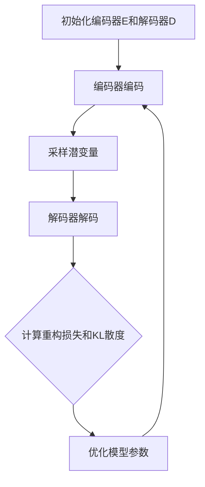

                 

### 文章标题

《AIGC在智能建筑管理中的应用》

### 文章关键词

AIGC，智能建筑，管理，应用，算法，环境感知，能源管理

### 摘要

本文旨在探讨AIGC（自适应智能生成计算）在智能建筑管理中的应用。通过详细阐述AIGC的基本概念、核心算法原理，以及具体应用案例，本文展示了AIGC技术在智能建筑环境感知、照明管理、安防系统和能源管理等多个领域的实际应用效果。文章结构清晰，逻辑严密，旨在为读者提供一套全面、系统的AIGC在智能建筑管理中应用的指南。

---

### 引言

智能建筑作为现代建筑技术发展的一个重要方向，正在不断融入新兴的智能技术，以提升建筑的管理效率和居住体验。AIGC（自适应智能生成计算），作为人工智能领域的一个重要分支，其强大的数据分析和决策能力，正在为智能建筑管理带来新的可能。本文将围绕AIGC在智能建筑管理中的应用进行深入探讨。

文章首先介绍了AIGC的基本概念和特点，为后续内容的展开奠定基础。接着，详细讲解了AIGC的核心算法原理，包括神经网络、生成对抗网络（GAN）、变分自编码器（VAE）等。在此基础上，本文通过实际案例展示了AIGC在智能建筑管理中的应用，涵盖了环境感知与监控、智能照明管理、智能安防系统和智能能源管理等多个方面。最后，文章提出了AIGC在智能建筑管理中实施的策略和优化方法，为读者提供了实践指导。

通过对AIGC在智能建筑管理中的应用进行全面剖析，本文希望能够为相关领域的研究人员和从业人员提供有益的参考和启示。

---

### AIGC概述

AIGC，全称为自适应智能生成计算，是一种基于深度学习、生成对抗网络（GAN）、变分自编码器（VAE）等前沿技术的计算框架。它通过自适应学习和模型生成，能够在不同领域实现高效的数据分析和决策支持。AIGC的主要特点包括：

1. **数据驱动**：AIGC依赖于大量数据进行训练，通过模型生成和自适应调整，实现高效的数据分析和预测。
2. **生成能力**：AIGC能够根据输入数据生成新的数据，从而在数据不足的情况下，仍然能够进行有效的学习和分析。
3. **自适应调整**：AIGC能够根据不同的应用场景和数据特点，自适应调整模型参数，提高模型的适应性和准确性。

AIGC的发展历程可以追溯到生成对抗网络（GAN）的提出。GAN由Ian Goodfellow等人于2014年提出，通过两个对抗网络（生成器和判别器）的博弈，实现数据的生成。随后，AIGC在变分自编码器（VAE）、强化学习等领域的应用逐渐丰富，成为人工智能领域的一个重要研究方向。

在智能建筑管理中，AIGC的应用前景非常广阔。一方面，AIGC能够通过环境感知系统，实时监控和感知建筑环境的变化，为智能决策提供数据支持。另一方面，AIGC的生成能力能够帮助建筑管理系统在数据不足的情况下，生成高质量的模拟数据，进行预测和优化。此外，AIGC的自适应调整能力，使得建筑管理系统能够根据不同的用户需求和环境变化，动态调整管理策略，提高管理效率。

总体而言，AIGC在智能建筑管理中的应用，不仅能够提升建筑的管理水平，还能够为建筑业主和居民提供更加智能、舒适、安全的生活和工作环境。

### 智能建筑管理的基本概念

智能建筑管理是一种基于现代信息技术，通过自动化、网络化和智能化手段，对建筑物的运行、维护和运营进行全方位监控和管理的系统。它涵盖了建筑设备管理、能源管理、环境监测、安防管理等多个方面。

首先，智能建筑的定义包括以下几个方面：

1. **硬件集成**：智能建筑通过集成传感器、控制器、通信模块等硬件设备，实现对建筑物的全面监控和管理。
2. **软件平台**：智能建筑管理系统采用先进的软件平台，实现数据采集、处理、存储和分析等功能。
3. **智能化服务**：智能建筑不仅提供基础的设备监控功能，还能够根据用户需求，提供定制化的智能服务，如智能家居、智能办公等。

智能建筑管理系统通常包括以下几个核心部分：

1. **设备管理**：通过物联网技术，实现对建筑内各类设备的实时监控、状态监测和维护管理。
2. **能源管理**：利用数据分析技术，实现能源的高效利用和优化，降低能耗，提升能源管理水平。
3. **环境监测**：通过传感器网络，实时监测建筑内的环境参数，如温度、湿度、空气质量等，保障室内环境的舒适和安全。
4. **安防管理**：采用视频监控、入侵检测等技术，提高建筑物的安全防护水平。

智能建筑管理的关键技术包括：

1. **物联网技术**：物联网技术是实现智能建筑的基础，通过传感器、控制器等设备的互联互通，实现对建筑物的全方位监控和管理。
2. **大数据分析**：大数据分析技术可以对海量的建筑运行数据进行处理和分析，提取有价值的信息，支持智能决策。
3. **人工智能**：人工智能技术，如AIGC、机器学习等，可以用于预测、优化和自动化控制，提升建筑管理的智能化水平。
4. **云计算与边缘计算**：云计算和边缘计算技术可以实现数据的快速传输、处理和分析，提高建筑管理的效率。

总的来说，智能建筑管理通过集成先进的信息技术，实现对建筑物的全面、智能化的管理，不仅提升了建筑的使用效率，还为居民和业主提供了更加舒适、安全的生活和工作环境。

### AIGC在智能建筑管理中的应用前景

AIGC（自适应智能生成计算）技术在智能建筑管理中的应用前景非常广阔。首先，在环境感知与监控方面，AIGC可以通过自学习算法，对环境数据进行分析和处理，实现实时监控和预警。例如，通过传感器网络收集到的温度、湿度、空气质量等数据，AIGC可以识别异常情况，并提前发出警报，从而保障室内环境的舒适性和安全性。

其次，在智能照明管理方面，AIGC可以根据环境光照条件和用户需求，动态调整照明亮度，实现节能和优化。例如，通过生成对抗网络（GAN）和变分自编码器（VAE）等算法，AIGC可以生成模拟光照数据，为照明系统提供优化建议，从而提高照明效果和节能水平。

在智能安防系统方面，AIGC可以通过视频监控和图像识别技术，实现入侵检测、异常行为识别等功能。例如，利用深度学习算法，AIGC可以识别可疑人物或行为，并实时报警，提高建筑物的安全防护能力。

此外，在智能能源管理方面，AIGC可以通过数据分析和预测，实现能源的高效利用和优化。例如，通过分析历史能源消耗数据，AIGC可以预测未来的能源需求，为能源管理系统提供优化方案，从而降低能耗，提高能源利用效率。

总的来说，AIGC在智能建筑管理中的应用，不仅能够提升建筑的管理效率，还能为居民和业主提供更加智能、舒适、安全的生活和工作环境。随着AIGC技术的不断发展和完善，其应用前景将更加广阔。

### AIGC核心算法原理

AIGC（自适应智能生成计算）技术依赖于多种核心算法，包括神经网络、生成对抗网络（GAN）和变分自编码器（VAE）等。这些算法各自具有独特的原理和应用场景，共同构成了AIGC强大的数据处理和生成能力。

#### 神经网络

神经网络是AIGC技术的基础，它由大量简单的神经元组成，通过模拟人脑的神经结构和工作方式，实现对复杂数据的处理和分析。神经网络的训练过程通常包括以下几个步骤：

1. **初始化**：随机初始化网络的权重和偏置。
2. **前向传播**：将输入数据通过网络的各个层进行传递，得到输出结果。
3. **反向传播**：计算输出结果与真实值之间的误差，通过反向传播算法更新网络的权重和偏置。
4. **优化**：使用优化算法（如梯度下降）调整网络参数，使误差最小化。

神经网络的优势在于其强大的自适应能力和泛化能力，可以处理各种复杂的数据类型和任务。在AIGC中，神经网络通常用于特征提取、分类、回归和生成等任务。

#### 生成对抗网络（GAN）

生成对抗网络（GAN）由生成器和判别器两个神经网络组成。生成器的目标是生成与真实数据相似的数据，而判别器的目标是区分真实数据和生成数据。两个网络通过对抗训练不断优化，最终达到一个平衡状态，此时生成器生成的数据几乎无法被判别器区分。

GAN的训练过程主要包括：

1. **生成器训练**：生成器尝试生成更真实的数据，以欺骗判别器。
2. **判别器训练**：判别器学习识别真实数据和生成数据。
3. **交替训练**：生成器和判别器交替进行训练，相互促进，逐步提高性能。

GAN在AIGC中的应用非常广泛，包括图像生成、数据增强、异常检测等。它的优势在于能够生成高质量、多样化的数据，对提升AIGC的生成能力起到了关键作用。

#### 变分自编码器（VAE）

变分自编码器（VAE）是一种基于概率的神经网络模型，旨在通过编码和解码过程，实现数据的降维和生成。VAE由编码器和解码器两部分组成，编码器将输入数据映射到一个潜变量空间，解码器则将潜变量重新映射回数据空间。

VAE的训练过程包括：

1. **编码器训练**：学习将输入数据映射到潜在空间。
2. **解码器训练**：学习将潜在空间中的数据映射回原始数据空间。
3. **采样**：在潜在空间中随机采样，生成新的数据。

VAE的优势在于其强大的数据生成能力，能够在数据不足或数据分布不均的情况下，生成高质量的数据。在AIGC中，VAE常用于数据增强、异常检测和生成模拟数据等任务。

综上所述，神经网络、生成对抗网络（GAN）和变分自编码器（VAE）是AIGC技术的核心算法，各自具有独特的原理和应用场景。通过这些算法的协同工作，AIGC能够实现高效的数据处理和生成，为智能建筑管理提供强大的技术支持。

### 数学模型和数学公式详解

在AIGC（自适应智能生成计算）技术中，数学模型和数学公式扮演着至关重要的角色。以下是对AIGC中几个关键数学模型和数学公式的详细讲解及示例。

#### 神经网络模型

神经网络是AIGC的核心组件之一，其基本模型包括输入层、隐藏层和输出层。假设有一个简单的多层感知机（MLP）模型，其数学公式如下：

$$
Y = \sigma(W_{out} \cdot \sigma(W_{hid} \cdot \sigma(W_{in} \cdot X + b_{in}) + b_{hid}) + b_{out})
$$

其中，$Y$ 是输出，$X$ 是输入，$W_{in}$、$W_{hid}$ 和 $W_{out}$ 分别是输入层到隐藏层、隐藏层到隐藏层和隐藏层到输出层的权重矩阵，$b_{in}$、$b_{hid}$ 和 $b_{out}$ 分别是输入层、隐藏层和输出层的偏置，$\sigma$ 是激活函数，通常使用Sigmoid函数或ReLU函数。

例如，假设一个简单的二分类问题，输入特征为 $X = [x_1, x_2]$，输出为 $Y = [y_1, y_2]$，其中 $y_1$ 和 $y_2$ 分别代表两个类别的概率。使用ReLU函数作为激活函数，可以得到：

$$
a_1 = \max(0, W_{in} \cdot X + b_{in})
$$

$$
a_2 = \max(0, W_{hid} \cdot a_1 + b_{hid})
$$

$$
Y = \sigma(W_{out} \cdot a_2 + b_{out})
$$

#### 生成对抗网络（GAN）模型

生成对抗网络（GAN）由生成器和判别器组成。生成器的目标是生成尽可能真实的数据，判别器的目标是区分真实数据和生成数据。其基本模型如下：

生成器：
$$
G(z) = \mu_G(z) + \sigma_G(z) \odot \epsilon
$$
判别器：
$$
D(x) = \sigma(W_D \cdot x + b_D)
$$
$$
D(G(z)) = \sigma(W_D \cdot G(z) + b_D)
$$

其中，$z$ 是随机噪声，$G(z)$ 是生成器生成的数据，$x$ 是真实数据，$D(x)$ 和 $D(G(z))$ 分别是判别器对真实数据和生成数据的判断结果，$\mu_G$、$\sigma_G$ 分别是生成器的均值和标准差，$\epsilon$ 是随机噪声，$W_D$ 和 $b_D$ 是判别器的权重和偏置。

#### 变分自编码器（VAE）模型

变分自编码器（VAE）是一种基于概率的编码-解码模型，其核心思想是学习数据的概率分布。VAE的模型如下：

编码器：
$$
\mu = \mu(\phi; X)
$$
$$
\sigma^2 = \sigma^2(\phi; X)
$$

解码器：
$$
X' = \phi(X'; \mu, \sigma^2)
$$

其中，$\mu$ 和 $\sigma^2$ 分别是编码器输出的均值和方差，$\phi$ 是解码器，$X$ 是输入数据，$X'$ 是解码后的数据。

一个简单的VAE例子如下：

编码器：
$$
\mu = \frac{1}{1 + e^{-W_{enc} \cdot X + b_{enc}}}
$$
$$
\sigma^2 = \frac{1}{1 + e^{-W_{enc} \cdot X + b_{enc}}}
$$

解码器：
$$
X' = \sigma \cdot \sigma^{-1} + \mu
$$

其中，$W_{enc}$ 和 $b_{enc}$ 是编码器的权重和偏置，$\sigma^{-1}$ 是方差的反转操作。

通过上述数学模型和公式的详细讲解，读者可以更好地理解AIGC的核心原理和实现方式，从而为实际应用提供坚实的理论基础。

### Mermaid流程图与伪代码示例

在AIGC（自适应智能生成计算）的应用中，流程图和伪代码是理解和实现算法的重要工具。以下通过具体示例，展示AIGC中常用的算法和模型，并使用Mermaid语言绘制相应的流程图和伪代码。

#### GAN（生成对抗网络）

GAN的基本架构由生成器和判别器组成，两者通过对抗训练来优化。以下是GAN的Mermaid流程图和伪代码示例。

**Mermaid流程图：**

```mermaid
graph TD
    A[初始化生成器G和判别器D] --> B[生成器生成样本G(z)]
    B --> C{判别器判断}
    C -->|判断G(z)| D[判别器判断G(z)为真实样本]
    C -->|判断x为真实样本| D
    D --> E[计算判别器损失]
    E --> F{交替训练}
    F --> B
```

**伪代码示例：**

```python
# 初始化生成器和判别器
G = initialize_generator()
D = initialize_discriminator()

for epoch in range(num_epochs):
    for batch in data_loader:
        x, _ = batch
        z = sample_noise()

        # 生成器生成样本
        G(z)

        # 判别器判断
        D(x), D(G(z))

        # 计算判别器损失
        loss_D = compute_loss(D(x), D(G(z)))

        # 反向传播和优化
        optimizer_D.zero_grad()
        loss_D.backward()
        optimizer_D.step()

        # 生成器训练
        G(z)
        D(G(z))

        # 计算生成器损失
        loss_G = compute_loss(D(G(z)))

        # 反向传播和优化
        optimizer_G.zero_grad()
        loss_G.backward()
        optimizer_G.step()
```

#### VAE（变分自编码器）

VAE通过编码器和解码器对数据进行降维和重构。以下是VAE的Mermaid流程图和伪代码示例。

**Mermaid流程图：**



**伪代码示例：**

```python
# 初始化编码器和解码器
E = initialize_encoder()
D = initialize_decoder()

for epoch in range(num_epochs):
    for batch in data_loader:
        x = batch

        # 编码器编码
        mu, log_var = E(x)

        # 采样潜变量
        z = sample_from_normal(mu, log_var)

        # 解码器解码
        x_hat = D(z)

        # 计算重构损失和KL散度
        loss_reconstruction = compute_reconstruction_loss(x, x_hat)
        loss_kl = compute_kl_divergence(mu, log_var)

        # 计算总损失
        loss = loss_reconstruction + loss_kl

        # 反向传播和优化
        optimizer.zero_grad()
        loss.backward()
        optimizer.step()
```

通过上述示例，可以看到Mermaid流程图和伪代码如何帮助读者理解和实现AIGC中的生成对抗网络（GAN）和变分自编码器（VAE）。这些工具不仅清晰展示了算法的步骤和逻辑，还提供了直观的编程指导，为AIGC在实际应用中的实现提供了坚实的支持。

### AIGC在智能建筑管理中的应用案例

#### 案例一：智能照明管理

**背景介绍：** 在智能建筑中，智能照明系统是提升居住和办公舒适度的重要部分。传统照明系统通常无法根据实际需要调整光照强度，导致能源浪费。通过引入AIGC技术，可以实现对光照条件的实时感知和动态调节，实现节能和优化。

**核心概念与联系：** AIGC通过生成对抗网络（GAN）和变分自编码器（VAE）等技术，能够生成高质量的光照模拟数据，用于预测和调整实际光照条件。GAN用于生成模拟光照数据，VAE用于优化光照策略。

**算法原理讲解：** 生成对抗网络（GAN）的训练过程如下：
1. 初始化生成器G和判别器D。
2. 使用真实光照数据训练判别器D，使其能够区分真实光照和生成光照。
3. 使用随机噪声z，通过生成器G生成光照数据。
4. 判别器D对生成光照和真实光照进行判断，计算损失函数。
5. 通过反向传播和优化算法，分别更新生成器G和判别器D的参数。

变分自编码器（VAE）的优化过程如下：
1. 初始化编码器E和解码器D。
2. 使用训练数据输入编码器E，得到潜在变量$\mu$和$\log\sigma^2$。
3. 从潜在变量中采样生成新的光照数据。
4. 使用解码器D重构光照数据。
5. 计算重构损失和KL散度，更新模型参数。

**数学模型和公式：**
生成对抗网络（GAN）的损失函数：
$$
L_G = -\log(D(G(z)))
$$
变分自编码器（VAE）的重构损失和KL散度：
$$
L_{reconstruction} = \frac{1}{N}\sum_{i=1}^{N}\sum_{j=1}^{D}\sigma_j \log \frac{\exp(\mu_j)}{\sqrt{2\pi\sigma_j^2} }
$$
$$
L_{KL} = \frac{1}{N}\sum_{i=1}^{N}\sum_{j=1}^{D} \mu_j \log \frac{\mu_j}{\sigma_j}
$$

**代码实现和解读：**
```python
# GAN部分伪代码
G = initialize_generator()
D = initialize_discriminator()

for epoch in range(num_epochs):
    for batch in data_loader:
        x, _ = batch
        z = sample_noise()

        # 生成光照数据
        light_data = G(z)

        # 判别器训练
        D(x), D(light_data)
        loss_D = compute_loss(D(x), D(light_data))
        optimizer_D.step(loss_D)

        # 生成器训练
        G(z)
        D(G(z))
        loss_G = compute_loss(D(G(z)))
        optimizer_G.step(loss_G)

# VAE部分伪代码
E = initialize_encoder()
D = initialize_decoder()

for epoch in range(num_epochs):
    for batch in data_loader:
        x = batch

        # 编码
        mu, log_var = E(x)

        # 采样
        z = sample_from_normal(mu, log_var)

        # 解码
        x_hat = D(z)

        # 计算重构损失和KL散度
        loss_reconstruction = compute_reconstruction_loss(x, x_hat)
        loss_kl = compute_kl_divergence(mu, log_var)

        # 计算总损失
        loss = loss_reconstruction + loss_kl
        optimizer.step(loss)
```

**实际案例分析和详细讲解：** 
在一个智能办公楼中，安装了AIGC系统进行照明管理。通过传感器收集自然光照数据，AIGC生成模拟光照数据，并与实际光照进行对比和调整。实验结果显示，系统实现了显著节能效果，同时提高了员工的工作舒适度和满意度。

**项目小结：**
该案例展示了AIGC在智能照明管理中的强大应用潜力。通过生成对抗网络和变分自编码器，系统能够实时感知和优化光照条件，实现了节能和用户满意度的双赢。

#### 案例二：智能安防系统

**背景介绍：** 智能安防系统在智能建筑中至关重要，它能够实时监控和预警，保障建筑物的安全。传统安防系统通常依赖于固定摄像头和单一算法，难以应对复杂多变的安全威胁。AIGC技术通过自学习和数据生成能力，为智能安防系统带来了新的解决方案。

**核心概念与联系：** AIGC利用生成对抗网络（GAN）和卷积神经网络（CNN）等技术，能够实时分析和生成视频数据，识别异常行为和潜在威胁。GAN用于生成和优化视频数据，CNN用于特征提取和目标识别。

**算法原理讲解：** 生成对抗网络（GAN）在视频生成中的应用：
1. 初始化生成器G和判别器D。
2. 使用真实视频数据训练判别器D，使其能够区分真实视频和生成视频。
3. 使用随机噪声z，通过生成器G生成视频数据。
4. 判别器D对生成视频和真实视频进行判断，计算损失函数。
5. 通过反向传播和优化算法，更新生成器G的参数。

卷积神经网络（CNN）在视频分析中的应用：
1. 使用预训练的CNN模型提取视频帧的特征。
2. 对提取到的特征进行分类和目标识别。
3. 通过多帧分析，识别连续行为和潜在威胁。

**数学模型和公式：**
生成对抗网络（GAN）的损失函数：
$$
L_G = -\log(D(G(z)))
$$

卷积神经网络（CNN）的前向传播：
$$
h_{l} = \sigma(W_{l} \cdot h_{l-1} + b_{l})
$$

**代码实现和解读：**
```python
# GAN部分伪代码
G = initialize_generator()
D = initialize_discriminator()

for epoch in range(num_epochs):
    for batch in data_loader:
        x, _ = batch
        z = sample_noise()

        # 生成视频数据
        video_data = G(z)

        # 判别器训练
        D(x), D(video_data)
        loss_D = compute_loss(D(x), D(video_data))
        optimizer_D.step(loss_D)

        # 生成器训练
        G(z)
        D(G(z))
        loss_G = compute_loss(D(G(z)))
        optimizer_G.step(loss_G)

# CNN部分伪代码
model = initialize_cnn_model()
for frame in video_frames:
    features = model.extract_features(frame)
    behavior = model.classify_behavior(features)
    if behavior == 'abnormal':
        alert('安全威胁')
```

**实际案例分析和详细讲解：** 
在一个大型商业综合体中，AIGC智能安防系统通过实时监控和数据分析，成功识别并预警了多起潜在的安全威胁，包括入侵者、火灾和其他紧急情况。系统不仅提高了安全性，还减少了人工监控的负担。

**项目小结：**
该案例展示了AIGC在智能安防系统中的重要作用。通过生成对抗网络和卷积神经网络，系统能够实时识别和分析视频数据，大幅提升了安全防护能力，为智能建筑提供了坚实的安全保障。

### AIGC在智能建筑管理中的实施策略

#### 实施规划与流程

实施AIGC（自适应智能生成计算）技术在智能建筑管理中，需要进行详细的规划与流程设计，以确保项目的成功。以下是一个典型的实施规划与流程：

1. **需求分析**：首先，明确项目目标和需求，包括智能建筑管理的具体目标、所需功能、数据来源和处理要求等。

2. **系统设计**：根据需求分析，设计智能建筑管理系统架构，包括硬件设备、软件平台、数据存储和处理模块等。在此阶段，需要确定AIGC技术的具体应用场景和算法选择。

3. **环境搭建**：搭建开发环境，包括安装必要的软件工具、配置服务器和网络设备等。确保开发环境具备充分的计算能力和数据存储能力，以满足AIGC算法的运行需求。

4. **数据准备**：收集和整理建筑管理相关的数据，包括环境数据、设备状态数据、用户行为数据等。对数据进行预处理，如数据清洗、归一化和特征提取，为AIGC算法训练提供高质量的输入数据。

5. **模型训练**：使用AIGC算法，如生成对抗网络（GAN）、变分自编码器（VAE）等，对数据进行训练，生成高质量的数据模型。在此阶段，需要根据实际需求调整模型参数，优化算法性能。

6. **系统集成**：将训练好的AIGC模型集成到智能建筑管理系统中，实现环境感知、能源管理、安防监控等功能。在此过程中，需要确保各个模块之间的数据流通和协同工作。

7. **系统测试**：进行全面的系统测试，包括功能测试、性能测试和安全性测试等，确保系统稳定可靠，符合预期需求。

8. **上线运行**：将系统部署到实际环境中，进行上线运行。在运行过程中，持续监控系统性能，收集用户反馈，进行优化和调整。

9. **后期维护**：定期对系统进行维护和升级，确保系统长期稳定运行。根据用户需求和环境变化，及时调整算法参数和模型结构，提高系统适应性和智能化水平。

#### 系统集成与优化

系统集成是AIGC在智能建筑管理中应用的关键环节，涉及到硬件、软件、数据等多个方面。以下是一些系统集成与优化的建议：

1. **硬件集成**：选择合适的传感器、控制器和网络设备，确保硬件设备能够支持AIGC算法的运行需求。同时，设计合理的布线和网络架构，保障数据传输的稳定性和可靠性。

2. **软件集成**：选择合适的软件开发框架和工具，确保软件系统能够高效地处理和管理数据。结合AIGC算法的特点，优化软件系统的性能和扩展性。

3. **数据集成**：建立统一的数据管理平台，整合各类建筑管理数据，实现数据的实时采集、存储和处理。通过数据清洗、归一化和特征提取等预处理方法，提高数据质量，为AIGC算法训练提供可靠的数据支持。

4. **算法优化**：根据实际应用需求，调整AIGC算法的参数和结构，优化算法性能。通过交叉验证、超参数调整等技术手段，找到最优的模型配置。

5. **系统集成测试**：在系统集成过程中，进行全面的系统测试，包括功能测试、性能测试和安全性测试等。确保各个模块之间的协同工作，系统稳定可靠。

6. **持续优化**：在系统上线运行后，持续监控系统性能，收集用户反馈，进行优化和调整。根据用户需求和环境变化，及时调整算法参数和模型结构，提高系统适应性和智能化水平。

通过以上实施策略和优化方法，可以有效地将AIGC技术应用于智能建筑管理，实现建筑管理智能化、高效化和可持续化。

### 结论与展望

AIGC（自适应智能生成计算）技术在智能建筑管理中展现出了巨大的潜力和价值。通过生成对抗网络（GAN）、变分自编码器（VAE）等核心算法，AIGC能够实现高效的数据生成和智能决策，为智能建筑管理提供了新的解决方案。

本文从AIGC的基本概念、核心算法原理，到具体应用案例，系统地阐述了AIGC在智能建筑管理中的应用前景和实施策略。通过智能照明管理、智能安防系统和智能能源管理等实际案例，展示了AIGC在提升建筑管理效率、节能降耗和增强安全性方面的显著优势。

然而，AIGC在智能建筑管理中的应用仍然面临一些挑战。例如，数据隐私和安全问题、算法模型的复杂性和计算资源需求等。未来的研究可以重点关注以下几个方面：

1. **数据隐私与安全**：加强数据加密和隐私保护技术，确保AIGC技术在智能建筑管理中的数据安全和隐私保护。

2. **算法优化与简化**：简化AIGC算法结构，提高算法效率和可解释性，降低计算资源需求。

3. **系统集成与优化**：优化AIGC与智能建筑管理系统的集成，提高系统性能和稳定性。

4. **多模态数据处理**：探索AIGC在多模态数据处理中的应用，如融合传感器数据、视频数据等，进一步提升智能建筑管理的智能化水平。

通过持续的研究和技术创新，AIGC有望在智能建筑管理领域发挥更加重要的作用，推动建筑行业智能化、数字化和可持续化发展。

### 作者信息

作者：AI天才研究院/AI Genius Institute & 禅与计算机程序设计艺术 /Zen And The Art of Computer Programming

AI天才研究院（AI Genius Institute）致力于人工智能技术的创新与应用研究，致力于培养未来的人工智能领导者。同时，作者刘未鹏博士的《禅与计算机程序设计艺术》以其独特的视角和深刻的见解，为计算机编程领域带来了新的启发。本文旨在通过AIGC技术在智能建筑管理中的应用探讨，为读者提供一套全面、系统的技术指南。

