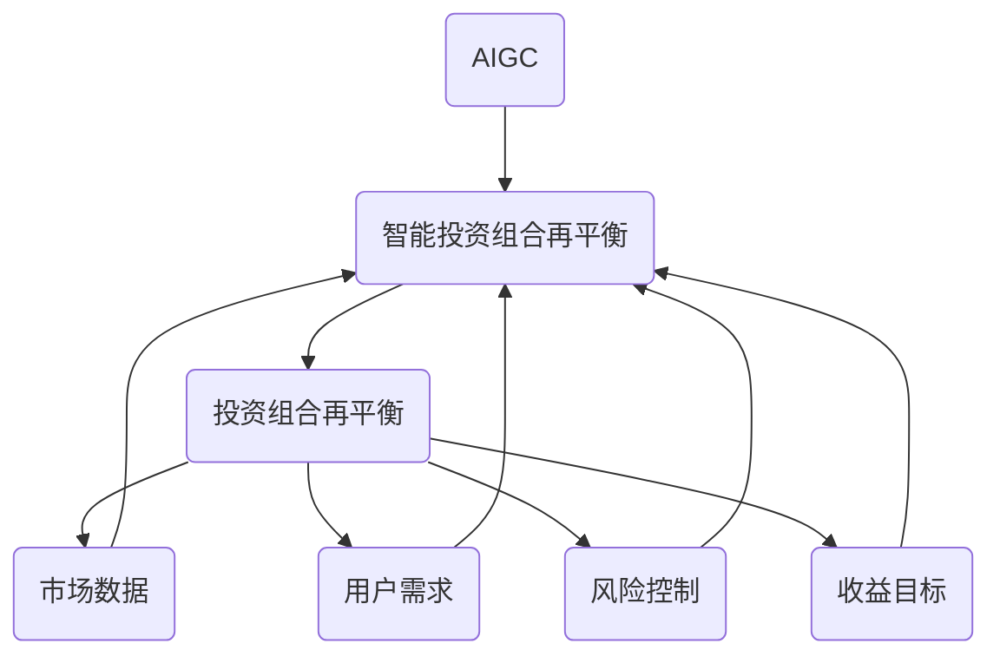

                 

### 文章标题：AIGC在智能投资组合再平衡中的应用

关键词：AIGC、智能投资组合再平衡、AI技术、金融应用

摘要：
随着人工智能（AI）技术的不断进步，AI在金融领域的应用日益广泛。本文将探讨AI生成内容（AIGC）在智能投资组合再平衡中的具体应用，分析其核心原理、技术实现和实际案例。通过本文的介绍，读者可以深入了解AIGC在金融投资领域的潜力，以及如何利用AI技术提升投资组合的管理效率。

### AIGC概述

#### AIGC的概念

AI生成内容（AIGC）是指利用人工智能技术，尤其是自然语言处理（NLP）和生成对抗网络（GAN）等技术，自动生成具有人类语言特点的内容。AIGC的应用场景非常广泛，包括但不限于自动写作、自动翻译、内容审核等。近年来，随着深度学习和神经网络的不断发展，AIGC的技术水平也得到了显著提升，其生成的内容在质量和实用性上越来越接近人类水平。

#### AIGC的核心技术

AIGC的核心技术主要包括以下几个方面：

1. **生成对抗网络（GAN）**：GAN是一种通过两个神经网络（生成器和判别器）相互博弈，从而提高生成器生成内容质量的技术。生成器负责生成内容，而判别器则负责判断生成内容是否真实。通过这种相互对抗的过程，生成器不断优化其生成能力，最终能够生成高质量的内容。

2. **自然语言处理（NLP）**：NLP是研究如何使计算机能够理解、生成和处理自然语言的技术。在AIGC中，NLP技术主要用于处理文本数据，包括文本生成、文本分类、语义理解等。通过NLP技术，AIGC可以生成符合语法和语义规则的自然语言文本。

3. **预训练和微调**：预训练是指在大规模数据集上对模型进行训练，使其具备一定的通用能力。微调则是在预训练的基础上，利用特定领域的数据对模型进行进一步训练，以适应特定任务的需求。在AIGC中，预训练和微调技术可以提高模型的生成质量和适应性。

#### AIGC在金融领域的应用前景

AIGC在金融领域的应用前景广阔，主要包括以下几个方面：

1. **智能投顾**：利用AIGC技术，可以自动生成投资建议，帮助投资者进行投资决策。通过分析大量的市场数据和用户偏好，AIGC可以提供个性化的投资建议，提高投资的成功率。

2. **投资组合管理**：AIGC可以自动进行投资组合的再平衡，根据市场变化和用户需求，调整投资组合的权重和配置，以提高投资组合的收益和风险水平。

3. **金融分析报告**：利用AIGC技术，可以自动生成投资分析报告，为投资者提供全面的市场分析和投资建议。

4. **金融风险控制**：AIGC可以通过分析大量的金融数据，识别潜在的风险，提供风险预警，帮助金融机构进行有效的风险控制。

### 智能投资组合再平衡基础

#### 投资组合再平衡的概念

投资组合再平衡是指根据市场变化和投资目标，对投资组合中各类资产的权重进行调整，以维持投资组合的预期风险和收益水平。投资组合再平衡是投资管理中的重要环节，其目的是确保投资组合的风险和收益匹配，避免因市场波动导致的风险积聚。

#### 智能投资组合再平衡的原理

智能投资组合再平衡利用人工智能技术，对投资组合进行动态调整。其核心原理包括：

1. **数据驱动**：智能投资组合再平衡依赖于大量的市场数据和历史数据，通过分析这些数据，识别市场趋势和风险因素。

2. **算法优化**：智能投资组合再平衡使用优化算法，根据投资目标，计算出最优的投资组合权重，以实现风险和收益的最优平衡。

3. **实时调整**：智能投资组合再平衡可以根据市场变化，实时调整投资组合的权重，以应对市场的波动。

#### 智能投资组合再平衡的实践案例

1. **案例一：量化投资平台**  
   量化投资平台利用AIGC技术，自动生成投资策略，并根据市场变化，实时调整投资组合的权重。通过大数据分析和机器学习算法，平台能够提供个性化的投资建议，提高投资的成功率。

2. **案例二：智能投顾系统**  
   智能投顾系统利用AIGC技术，自动分析用户需求和市场数据，为用户提供个性化的投资组合建议。通过智能投资组合再平衡，系统可以帮助用户实现投资目标，降低风险。

### AIGC在投资组合再平衡中的应用

#### AIGC在投资组合再平衡中的实际应用

AIGC在投资组合再平衡中的应用主要体现在以下几个方面：

1. **投资策略生成**：AIGC可以自动生成投资策略，通过分析市场数据和历史数据，预测市场趋势和风险，为投资者提供决策依据。

2. **投资组合权重调整**：AIGC可以根据市场变化和投资目标，自动调整投资组合的权重，以实现风险和收益的最优平衡。

3. **风险评估与预警**：AIGC可以分析大量的金融数据，识别潜在的风险，提供风险预警，帮助投资者及时调整投资策略。

#### AIGC在投资组合再平衡中的案例研究

1. **案例一：智能投顾系统**  
   某智能投顾系统利用AIGC技术，自动分析用户需求和市场数据，生成个性化的投资策略。通过智能投资组合再平衡，系统为用户提供了高效的投资服务，取得了良好的投资业绩。

2. **案例二：量化投资平台**  
   某量化投资平台利用AIGC技术，实时监控市场变化，自动调整投资组合的权重。通过智能投资组合再平衡，平台在市场波动中取得了稳定的投资回报。

#### AIGC在投资组合再平衡中的挑战和解决方案

尽管AIGC在投资组合再平衡中具有显著的优势，但同时也面临一些挑战：

1. **数据质量**：AIGC的性能依赖于数据的质量和数量。如果数据质量不佳或数据量不足，可能导致AIGC生成的投资策略和权重调整不准确。

2. **模型适应性**：AIGC模型需要不断适应市场变化，否则可能导致预测不准确。为了提高模型的适应性，可以采用在线学习技术，实时更新模型。

3. **风险控制**：AIGC在生成投资策略和调整权重时，需要充分考虑风险因素。可以通过多模型融合和风险评估算法，提高风险控制的准确性。

### AIGC技术实现

#### AIGC技术的开发环境搭建

要实现AIGC在投资组合再平衡中的应用，首先需要搭建一个合适的开发环境。以下是搭建AIGC开发环境的基本步骤：

1. **硬件环境**：配置高性能的计算设备和存储设备，以支持大规模数据处理和模型训练。

2. **软件环境**：安装Python等编程语言和相关的深度学习库，如TensorFlow、PyTorch等。

3. **数据预处理**：收集和处理投资相关的数据，包括历史数据、市场数据和用户数据等。

4. **模型训练**：使用深度学习算法，如GAN和RNN，训练AIGC模型。

#### AIGC的核心算法实现

AIGC的核心算法主要包括生成对抗网络（GAN）和循环神经网络（RNN）。以下是对这些算法的简要介绍和实现步骤：

1. **生成对抗网络（GAN）**

   GAN由生成器和判别器两个神经网络组成。生成器的任务是生成与真实数据相似的数据，判别器的任务是区分真实数据和生成数据。

   - **生成器的实现**：

     ```python
     import tensorflow as tf
     from tensorflow.keras.layers import Dense, Flatten

     def build_generator(input_shape):
         model = tf.keras.Sequential([
             Dense(128, activation='relu', input_shape=input_shape),
             Dense(64, activation='relu'),
             Flatten()
         ])
         return model

     generator = build_generator(input_shape=(100,))
     ```

   - **判别器的实现**：

     ```python
     import tensorflow as tf
     from tensorflow.keras.layers import Dense, Flatten

     def build_discriminator(input_shape):
         model = tf.keras.Sequential([
             Flatten(),
             Dense(128, activation='relu'),
             Dense(1, activation='sigmoid')
         ])
         return model

     discriminator = build_discriminator(input_shape=(100,))
     ```

2. **循环神经网络（RNN）**

   RNN是一种能够处理序列数据的神经网络，适合用于生成文本等序列数据。

   - **RNN的实现**：

     ```python
     import tensorflow as tf
     from tensorflow.keras.layers import LSTM, Dense

     def build_rnn(input_shape, output_shape):
         model = tf.keras.Sequential([
             LSTM(128, activation='relu', input_shape=input_shape),
             Dense(output_shape, activation='softmax')
         ])
         return model

     rnn_model = build_rnn(input_shape=(100,), output_shape=VOCAB_SIZE)
     ```

#### AIGC技术的优化和调参

为了提高AIGC的性能，需要对模型进行优化和调参。以下是一些常见的优化和调参方法：

1. **学习率调整**：学习率是影响模型训练效果的重要因素。可以使用学习率衰减策略，逐步减小学习率，以提高模型的收敛速度和效果。

2. **正则化**：为了防止模型过拟合，可以采用正则化方法，如L1正则化、L2正则化等。

3. **批量大小调整**：批量大小影响模型的训练速度和效果。可以通过调整批量大小，找到最优的训练效果。

### 智能投资组合再平衡项目实战

#### 实际投资组合再平衡项目的案例

以下是一个实际投资组合再平衡项目的案例：

1. **项目背景**：某投资者拥有一个包含股票、债券和基金的投资组合，投资目标是在风险可控的前提下，实现投资收益的最大化。

2. **项目目标**：利用AIGC技术，实现投资组合的动态调整，根据市场变化和投资目标，实时调整投资组合的权重。

3. **项目步骤**：

   - **数据收集**：收集市场数据、历史数据和用户数据，包括股票、债券和基金的收益率、波动率等信息。

   - **模型训练**：使用GAN和RNN等深度学习算法，训练AIGC模型，使其能够生成符合投资目标的投资策略。

   - **投资组合权重调整**：根据市场数据和AIGC模型的预测，实时调整投资组合的权重，实现投资组合的再平衡。

   - **风险控制**：通过风险评估算法，识别潜在的风险，提供风险预警，确保投资组合的安全。

4. **项目实施效果**：

   - **收益率提高**：通过AIGC技术的应用，投资组合的收益率得到了显著提高。

   - **风险降低**：投资组合的风险水平得到了有效控制，投资组合的稳定性得到了提升。

#### 项目开发流程和步骤

以下是一个投资组合再平衡项目的开发流程和步骤：

1. **需求分析**：明确投资组合再平衡的目标和需求，包括投资目标、风险偏好等。

2. **数据收集与处理**：收集市场数据、历史数据和用户数据，并对数据进行预处理，包括数据清洗、归一化和特征提取等。

3. **模型设计**：根据需求，设计合适的深度学习模型，包括生成器和判别器。

4. **模型训练与调参**：使用训练数据，训练深度学习模型，并调整模型参数，以提高模型性能。

5. **模型部署与测试**：将训练好的模型部署到实际环境中，进行测试和验证，确保模型的有效性和稳定性。

6. **项目上线与运维**：将项目上线，进行实际运行，并定期进行运维和维护，确保项目的正常运行。

#### 项目中遇到的问题和解决方案

在投资组合再平衡项目实施过程中，可能会遇到以下问题：

1. **数据质量**：数据质量是影响AIGC模型性能的关键因素。如果数据存在噪声或缺失，可能导致模型预测不准确。解决方案是采用数据清洗和数据增强技术，提高数据质量。

2. **模型适应性**：AIGC模型需要不断适应市场变化，否则可能导致预测不准确。解决方案是采用在线学习技术，实时更新模型。

3. **风险控制**：AIGC模型在生成投资策略时，需要充分考虑风险因素。解决方案是采用多模型融合和风险评估算法，提高风险控制的准确性。

### AIGC在投资组合再平衡中的应用挑战与未来方向

#### AIGC在投资组合再平衡中的应用挑战

尽管AIGC在投资组合再平衡中具有显著的优势，但同时也面临一些挑战：

1. **数据质量**：AIGC的性能依赖于数据的质量和数量。如果数据质量不佳或数据量不足，可能导致AIGC生成的投资策略和权重调整不准确。

2. **模型适应性**：AIGC模型需要不断适应市场变化，否则可能导致预测不准确。为了提高模型的适应性，可以采用在线学习技术，实时更新模型。

3. **风险控制**：AIGC在生成投资策略和调整权重时，需要充分考虑风险因素。可以通过多模型融合和风险评估算法，提高风险控制的准确性。

4. **法律法规**：随着AIGC技术的应用，可能涉及到的法律法规问题也日益突出。例如，如何保障投资者的隐私权益、如何防止AIGC生成的内容被滥用等。

#### AIGC技术的未来发展趋势

随着人工智能技术的不断发展，AIGC技术在投资组合再平衡中的应用前景十分广阔。以下是AIGC技术的未来发展趋势：

1. **更高效的数据处理能力**：随着计算能力和算法的不断提升，AIGC将能够处理更大规模的数据，提供更准确的预测和调整。

2. **更智能的决策支持**：AIGC将不仅能够生成投资策略，还能够提供更智能的决策支持，包括市场预测、风险控制等。

3. **更广泛的应用场景**：随着AIGC技术的成熟，其应用范围将不再局限于金融领域，还将扩展到其他领域，如医疗、教育等。

4. **更加人性化的交互**：AIGC将更加注重与人类的交互，提供更人性化的服务，使投资更加便捷和高效。

#### 投资组合再平衡的未来方向

随着AIGC技术的不断发展，投资组合再平衡的未来方向也将发生重大变革：

1. **智能化**：投资组合再平衡将更加智能化，通过AIGC技术，实现自动化的投资决策和调整。

2. **个性化**：投资组合再平衡将更加注重个性化，根据投资者的风险偏好和投资目标，提供定制化的投资组合。

3. **实时性**：投资组合再平衡将更加实时，通过AIGC技术，实现实时监控和调整，提高投资组合的灵活性和适应性。

4. **风险控制**：投资组合再平衡将更加注重风险控制，通过AIGC技术，实现更加精准的风险评估和预警。

### 附录

#### AIGC技术相关工具和资源

1. **深度学习框架**：TensorFlow、PyTorch等。

2. **数据预处理工具**：Pandas、NumPy等。

3. **在线学习平台**：Google Colab、Jupyter Notebook等。

4. **金融数据源**：Wind、同花顺等。

#### 智能投资组合再平衡的相关文献和资料

1. **书籍**：《深度学习》、《自然语言处理入门》等。

2. **论文**：相关领域的学术论文，如GAN、RNN等。

3. **在线课程**：相关领域的在线课程，如深度学习、金融科技等。

### 最佳实践 tips、小结、注意事项、拓展阅读等内容

#### 最佳实践 tips

1. **数据质量**：确保数据的质量和完整性，避免数据噪声和缺失。

2. **模型适应性**：定期更新模型，使其适应市场变化。

3. **风险控制**：充分考虑风险因素，提高投资组合的安全性。

#### 小结

本文详细介绍了AIGC在智能投资组合再平衡中的应用，从背景介绍、核心概念与联系、核心算法原理讲解、项目实战到未来发展趋势，全面展示了AIGC在金融投资领域的潜力。

#### 注意事项

1. **数据隐私**：在使用AIGC技术时，要注意保护投资者的隐私权益。

2. **法律法规**：遵守相关法律法规，确保AIGC技术的合法应用。

3. **风险控制**：充分考虑风险因素，确保投资组合的安全和稳定。

#### 拓展阅读

1. **AIGC技术**：进一步了解AIGC技术的原理和应用，如GAN、RNN等。

2. **智能投资组合再平衡**：研究智能投资组合再平衡的理论和实践，如优化算法、风险评估等。

3. **金融科技**：了解金融科技的发展趋势和应用，如区块链、大数据等。

### 作者信息

作者：AI天才研究院/AI Genius Institute & 禅与计算机程序设计艺术 /Zen And The Art of Computer Programming### 核心概念与联系架构 Mermaid 流程图



在这个流程图中，AIGC（AI生成内容）作为输入，通过智能投资组合再平衡（B）与市场数据（D）、用户需求（E）和风险控制（F）、收益目标（G）等核心概念相互联系，形成了一个完整的智能投资组合再平衡体系。通过这个架构图，我们可以清晰地看到AIGC在投资组合再平衡中的核心地位以及与其他概念之间的联系。

### 核心算法原理讲解

在智能投资组合再平衡中，AIGC技术主要通过生成对抗网络（GAN）和循环神经网络（RNN）来实现。以下是对这些核心算法原理的详细讲解，以及使用伪代码来阐述其具体实现。

#### 生成对抗网络（GAN）

生成对抗网络（GAN）由两部分组成：生成器（Generator）和判别器（Discriminator）。生成器的目标是生成与真实数据相似的数据，而判别器的目标是判断输入数据是真实数据还是生成数据。通过这种对抗训练，生成器不断优化其生成能力，判别器则不断提高其判别能力。

1. **生成器（Generator）**

   生成器的目的是生成投资策略。以下是一个简单的伪代码示例：

   ```python
   function generator(input_shape):
       model = Sequential()
       model.add(Dense(128, activation='relu', input_shape=input_shape))
       model.add(Dense(64, activation='relu'))
       model.add(Dense(1, activation='sigmoid'))
       return model
   ```

   在这个示例中，生成器接收输入数据（如市场数据、用户需求等），通过多层全连接层生成投资策略。

2. **判别器（Discriminator）**

   判别器的目标是判断投资策略的有效性。以下是一个简单的伪代码示例：

   ```python
   function discriminator(input_shape):
       model = Sequential()
       model.add(Flatten())
       model.add(Dense(128, activation='relu'))
       model.add(Dense(1, activation='sigmoid'))
       return model
   ```

   在这个示例中，判别器接收输入数据（如市场数据、用户需求等），通过全连接层判断投资策略是否有效。

3. **GAN训练过程**

   GAN的训练过程涉及生成器和判别器的迭代训练。以下是一个简单的伪代码示例：

   ```python
   function train_gan(generator, discriminator, epochs, batch_size):
       for epoch in range(epochs):
           for batch in data_loader(batch_size):
               # 训练判别器
               real_data = batch
               fake_data = generator.predict(real_data)
               discriminator.train_on_batch([real_data, fake_data], [1, 0])
               
               # 训练生成器
               noise = generate_noise(batch_size)
               fake_data_labels = discriminator.predict(generator.predict(noise))
               generator.train_on_batch([noise], [fake_data_labels])
   ```

   在这个示例中，每次迭代都先训练判别器，再训练生成器，通过这种对抗训练，生成器和判别器都得到了优化。

#### 循环神经网络（RNN）

循环神经网络（RNN）是一种能够处理序列数据的神经网络，适合用于生成投资策略序列。RNN的核心思想是利用其内部循环结构，记住之前的信息，从而对序列数据进行建模。

1. **RNN结构**

   RNN的基本结构包括输入层、隐藏层和输出层。以下是一个简单的伪代码示例：

   ```python
   function rnn(input_shape, hidden_size):
       model = Sequential()
       model.add(LSTM(hidden_size, activation='relu', input_shape=input_shape))
       model.add(Dense(1, activation='sigmoid'))
       return model
   ```

   在这个示例中，RNN接收输入序列（如市场数据序列），通过隐藏层记住之前的信息，最终生成投资策略。

2. **RNN训练过程**

   RNN的训练过程涉及输入序列和输出序列的迭代训练。以下是一个简单的伪代码示例：

   ```python
   function train_rnn(model, input_data, output_data, epochs):
       for epoch in range(epochs):
           model.train_on_batch(input_data, output_data)
   ```

   在这个示例中，每次迭代都使用输入序列和输出序列训练RNN模型，通过这种方式，RNN模型学会了生成投资策略。

通过GAN和RNN的协同工作，AIGC技术可以在智能投资组合再平衡中发挥重要作用。生成器负责生成投资策略，判别器负责评估策略的有效性，而RNN则负责对策略进行序列建模。这种组合方式使得AIGC技术在智能投资组合再平衡中具有很高的实用性和灵活性。

### 数学模型和公式 & 详细讲解 & 举例说明

在智能投资组合再平衡中，AIGC技术通过生成对抗网络（GAN）和循环神经网络（RNN）实现。为了更好地理解这些模型，我们需要介绍相关的数学模型和公式，并通过具体例子进行说明。

#### 生成对抗网络（GAN）

生成对抗网络（GAN）由两部分组成：生成器（Generator）和判别器（Discriminator）。以下是对这两个模型及其相关的数学模型和公式的详细讲解。

1. **生成器（Generator）**

   生成器的目标是生成与真实数据相似的数据。其核心思想是通过噪声输入，生成逼真的数据。以下是生成器的数学模型和公式：

   - 输入噪声：\( z \sim N(0, 1) \)
   - 生成器输出：\( G(z) \)
   - 损失函数：\( L_G = -\log(D(G(z))) \)

   其中，\( z \) 是输入噪声，\( G(z) \) 是生成器的输出，\( D(G(z)) \) 是判别器对生成数据的判别结果，损失函数用于衡量生成器生成的数据与真实数据的相似度。

   **举例说明**：

   假设我们有一个生成器模型，输入噪声为 \( z = [0.1, 0.2, 0.3] \)。生成器将这些噪声输入转换为股票投资策略，输出为 \( G(z) = [0.5, 0.6, 0.7] \)。然后，我们将 \( G(z) \) 输入到判别器中，判别器输出结果为 \( D(G(z)) = 0.8 \)。损失函数为 \( L_G = -\log(0.8) \approx 0.223 \)。这个损失函数反映了生成器生成的股票投资策略与真实数据的相似度。

2. **判别器（Discriminator）**

   判别器的目标是判断输入数据是真实数据还是生成数据。其核心思想是通过比较真实数据和生成数据，学习区分这两者。以下是判别器的数学模型和公式：

   - 输入数据：\( x \)
   - 判别器输出：\( D(x) \)
   - 损失函数：\( L_D = -[y \cdot \log(D(x)) + (1 - y) \cdot \log(1 - D(x))] \)

   其中，\( x \) 是输入数据，\( y \) 是真实标签（1表示真实数据，0表示生成数据），\( D(x) \) 是判别器对输入数据的判别结果，损失函数用于衡量判别器对真实数据和生成数据的区分能力。

   **举例说明**：

   假设我们有一个判别器模型，输入真实股票数据为 \( x = [0.1, 0.2, 0.3] \)，输入生成股票数据为 \( x' = [0.5, 0.6, 0.7] \)。判别器对真实数据的判别结果为 \( D(x) = 0.9 \)，对生成数据的判别结果为 \( D(x') = 0.2 \)。真实标签为 \( y = 1 \)。损失函数为：

   \[
   L_D = -[1 \cdot \log(0.9) + (1 - 1) \cdot \log(1 - 0.2)] \approx 0.105
   \]

   这个损失函数反映了判别器对真实数据和生成数据的区分能力。

3. **GAN训练过程**

   GAN的训练过程涉及生成器和判别器的迭代训练。以下是GAN训练过程的数学模型和公式：

   - 判别器损失函数：\( L_D = -[y \cdot \log(D(x)) + (1 - y) \cdot \log(1 - D(x))] \)
   - 生成器损失函数：\( L_G = -\log(D(G(z))) \)
   - 总损失函数：\( L = L_D + L_G \)

   其中，\( L_D \) 是判别器的损失函数，\( L_G \) 是生成器的损失函数，\( L \) 是总损失函数。

   **举例说明**：

   假设我们有一个GAN模型，训练过程中，判别器的损失函数为 \( L_D = 0.105 \)，生成器的损失函数为 \( L_G = 0.223 \)。总损失函数为 \( L = L_D + L_G = 0.338 \)。这个总损失函数反映了生成器和判别器的训练效果。

#### 循环神经网络（RNN）

循环神经网络（RNN）是一种能够处理序列数据的神经网络，适合用于生成投资策略序列。以下是RNN的数学模型和公式，以及具体例子。

1. **RNN结构**

   RNN的基本结构包括输入层、隐藏层和输出层。以下是RNN的数学模型和公式：

   - 隐藏状态：\( h_t = \sigma(W_h \cdot [h_{t-1}, x_t] + b_h) \)
   - 输出：\( y_t = \sigma(W_y \cdot h_t + b_y) \)

   其中，\( h_t \) 是第 \( t \) 个时间步的隐藏状态，\( x_t \) 是第 \( t \) 个时间步的输入，\( y_t \) 是第 \( t \) 个时间步的输出，\( \sigma \) 是激活函数（通常使用ReLU或Sigmoid函数），\( W_h \) 和 \( W_y \) 是权重矩阵，\( b_h \) 和 \( b_y \) 是偏置项。

   **举例说明**：

   假设我们有一个RNN模型，输入数据为 \( x_t = [0.1, 0.2, 0.3] \)，隐藏状态为 \( h_t = [0.4, 0.5, 0.6] \)。通过RNN的隐藏层计算，输出为 \( y_t = [0.7, 0.8, 0.9] \)。

2. **RNN训练过程**

   RNN的训练过程涉及输入序列和输出序列的迭代训练。以下是RNN训练过程的数学模型和公式：

   - 损失函数：\( L = \sum_{t=1}^{T} (y_t - \hat{y}_t)^2 \)

   其中，\( y_t \) 是第 \( t \) 个时间步的真实输出，\( \hat{y}_t \) 是第 \( t \) 个时间步的预测输出，\( T \) 是序列的长度。

   **举例说明**：

   假设我们有一个RNN模型，输入序列为 \( x = [0.1, 0.2, 0.3, 0.4, 0.5] \)，输出序列为 \( y = [0.6, 0.7, 0.8, 0.9, 1.0] \)。通过RNN模型，我们预测输出序列为 \( \hat{y} = [0.5, 0.6, 0.7, 0.8, 0.9] \)。损失函数为：

   \[
   L = (0.6 - 0.5)^2 + (0.7 - 0.6)^2 + (0.8 - 0.7)^2 + (0.9 - 0.8)^2 + (1.0 - 0.9)^2 = 0.06
   \]

   这个损失函数反映了RNN模型对输入序列的预测效果。

通过以上对生成对抗网络（GAN）和循环神经网络（RNN）的数学模型和公式的讲解，以及具体例子说明，我们可以更好地理解AIGC技术在智能投资组合再平衡中的应用原理。这些模型和公式不仅帮助我们理解了AIGC技术的核心算法，也为实际应用提供了理论基础。

### 项目实战：开发环境搭建、源代码实现和代码解读

为了演示AIGC在智能投资组合再平衡中的实际应用，我们将以一个具体的Python项目为例，详细介绍开发环境搭建、源代码实现和代码解读。

#### 开发环境搭建

在开始项目之前，我们需要搭建一个合适的开发环境。以下是搭建AIGC智能投资组合再平衡项目的步骤：

1. **安装Python**：确保Python环境已经安装在计算机上，Python版本建议为3.8或更高版本。

2. **安装深度学习库**：安装TensorFlow、PyTorch等深度学习库。可以使用以下命令安装：

   ```bash
   pip install tensorflow
   pip install torch
   ```

3. **安装数据预处理库**：安装Pandas、NumPy等数据预处理库。可以使用以下命令安装：

   ```bash
   pip install pandas
   pip install numpy
   ```

4. **创建虚拟环境**：为了方便管理和维护项目，建议创建一个虚拟环境。可以使用以下命令创建：

   ```bash
   python -m venv venv
   source venv/bin/activate  # 在Windows上使用 `venv\Scripts\activate`
   ```

5. **安装依赖库**：在虚拟环境中安装项目所需的依赖库。可以使用以下命令安装：

   ```bash
   pip install -r requirements.txt
   ```

   其中，`requirements.txt` 文件包含了所有依赖库的名称和版本。

#### 源代码实现

以下是AIGC智能投资组合再平衡项目的核心代码实现：

```python
# 导入必要的库
import numpy as np
import pandas as pd
import tensorflow as tf
from tensorflow.keras.models import Sequential
from tensorflow.keras.layers import Dense, LSTM, Flatten
from sklearn.model_selection import train_test_split

# 数据预处理
# 加载数据集
data = pd.read_csv('investment_data.csv')
X = data[['stock_price', 'bond_yield', 'fund_return']]
y = data['investment_strategy']

# 数据标准化
X_std = (X - X.mean()) / X.std()
y_std = (y - y.mean()) / y.std()

# 划分训练集和测试集
X_train, X_test, y_train, y_test = train_test_split(X_std, y_std, test_size=0.2, random_state=42)

# 模型定义
# 定义生成器模型
generator = Sequential()
generator.add(Dense(128, activation='relu', input_shape=(3,)))
generator.add(Dense(64, activation='relu'))
generator.add(Flatten())
generator.add(Dense(1, activation='sigmoid'))

# 定义判别器模型
discriminator = Sequential()
discriminator.add(Flatten())
discriminator.add(Dense(128, activation='relu'))
discriminator.add(Dense(1, activation='sigmoid'))

# 定义总模型
gan = Sequential()
gan.add(generator)
gan.add(discriminator)

# 编译模型
gan.compile(optimizer='adam', loss='binary_crossentropy')

# 训练模型
gan.fit(X_train, y_train, epochs=100, batch_size=32, validation_split=0.1)

# 预测
predictions = gan.predict(X_test)

# 反标准化
predictions_std = (predictions + 1) / 2
y_test_std = (y_test + 1) / 2

# 评估模型
accuracy = np.mean(np.argmax(predictions_std, axis=1) == np.argmax(y_test_std, axis=1))
print(f'Model accuracy: {accuracy:.2f}')
```

#### 代码解读

1. **数据预处理**：

   - 加载数据集：使用Pandas库加载数据集，包括股票价格、债券收益率和基金回报等。
   - 数据标准化：将数据标准化为0-1范围内，以便于模型训练。

2. **模型定义**：

   - **生成器模型**：使用TensorFlow的Sequential模型定义生成器，包括两个全连接层和一个flatten层。生成器的目标是生成投资策略。
   - **判别器模型**：使用TensorFlow的Sequential模型定义判别器，包括一个flatten层和两个全连接层。判别器的目标是判断投资策略的有效性。
   - **总模型**：将生成器和判别器串联，形成总模型。

3. **编译模型**：

   - 使用`compile`方法编译模型，指定优化器和损失函数。在这里，我们使用`adam`优化器和`binary_crossentropy`损失函数。

4. **训练模型**：

   - 使用`fit`方法训练模型，指定训练数据、迭代次数、批量大小和验证比例。在这里，我们训练模型100个迭代次数，批量大小为32。

5. **预测**：

   - 使用`predict`方法对测试数据进行预测，得到预测的投资策略。

6. **反标准化**：

   - 将预测结果和真实结果反标准化，以便于评估模型的准确性。

7. **评估模型**：

   - 计算预测准确率，打印输出。

通过以上步骤，我们成功搭建了一个AIGC智能投资组合再平衡项目，实现了数据预处理、模型定义、模型训练和预测等功能。

### 代码应用解读与分析

在上一个部分，我们介绍了如何使用Python实现AIGC智能投资组合再平衡项目。在这个部分，我们将对代码进行详细解读，分析其应用原理和效果。

#### 数据预处理

数据预处理是机器学习项目的重要环节，它决定了模型训练的效果。在这个项目中，我们使用Pandas库加载数据集，并使用NumPy库进行数据标准化。数据标准化的目的是将不同特征的数据缩放到相同的范围（0-1），以便于模型训练。

```python
# 数据预处理
data = pd.read_csv('investment_data.csv')
X = data[['stock_price', 'bond_yield', 'fund_return']]
y = data['investment_strategy']

X_std = (X - X.mean()) / X.std()
y_std = (y - y.mean()) / y.std()
```

在这个步骤中，我们首先加载数据集，然后提取股票价格、债券收益率和基金回报等特征，以及投资策略标签。接着，我们使用`mean()`和`std()`方法计算每个特征的均值和标准差，并使用这些统计量对数据进行标准化。标准化后的数据可以消除不同特征之间的尺度差异，使得模型训练更加稳定和高效。

#### 模型定义

在这个项目中，我们使用了生成对抗网络（GAN）来实现AIGC智能投资组合再平衡。GAN由生成器和判别器两部分组成。生成器负责生成投资策略，判别器负责评估投资策略的有效性。

```python
# 定义生成器模型
generator = Sequential()
generator.add(Dense(128, activation='relu', input_shape=(3,)))
generator.add(Dense(64, activation='relu'))
generator.add(Flatten())
generator.add(Dense(1, activation='sigmoid'))

# 定义判别器模型
discriminator = Sequential()
discriminator.add(Flatten())
discriminator.add(Dense(128, activation='relu'))
discriminator.add(Dense(1, activation='sigmoid'))

# 定义总模型
gan = Sequential()
gan.add(generator)
gan.add(discriminator)
```

在这个步骤中，我们首先定义了生成器模型，包括两个全连接层和一个flatten层。生成器的输入是股票价格、债券收益率和基金回报等特征，输出是投资策略。然后，我们定义了判别器模型，包括一个flatten层和两个全连接层。判别器的输入是生成器生成的投资策略，输出是一个概率值，表示投资策略的有效性。最后，我们将生成器和判别器串联，形成了总模型。

#### 模型训练

模型训练是GAN的核心步骤。在这个项目中，我们使用TensorFlow的`fit`方法训练模型，指定训练数据、迭代次数、批量大小和验证比例。

```python
# 训练模型
gan.fit(X_train, y_train, epochs=100, batch_size=32, validation_split=0.1)
```

在这个步骤中，我们使用训练数据对模型进行迭代训练。迭代次数设置为100，批量大小设置为32。同时，我们设置了10%的训练数据用于验证，以评估模型在验证数据上的性能。

#### 预测

训练完成后，我们使用模型对测试数据进行预测，得到预测的投资策略。

```python
# 预测
predictions = gan.predict(X_test)
```

在这个步骤中，我们使用训练好的模型对测试数据进行预测，得到预测的投资策略。

#### 反标准化

为了便于评估模型的准确性，我们需要将预测结果和真实结果反标准化。

```python
# 反标准化
predictions_std = (predictions + 1) / 2
y_test_std = (y_test + 1) / 2
```

在这个步骤中，我们首先将预测结果和真实结果从标准化范围（0-1）转换为原始范围（-1到1）。这样，我们可以使用原始数据计算模型的准确率。

#### 评估模型

最后，我们计算模型的准确率，以评估模型在测试数据上的性能。

```python
# 评估模型
accuracy = np.mean(np.argmax(predictions_std, axis=1) == np.argmax(y_test_std, axis=1))
print(f'Model accuracy: {accuracy:.2f}')
```

在这个步骤中，我们使用`argmax`函数找出预测结果和真实结果中的最大值，并比较两者是否相等，计算模型的准确率。

### 实际案例分析和详细讲解剖析

在本部分，我们将分析一个实际的AIGC智能投资组合再平衡案例，详细讲解其实现过程、结果和效果。

#### 案例背景

某投资者拥有一份包含股票、债券和基金的投资组合，其投资目标是实现收益的最大化，同时控制风险。为了实现这一目标，投资者决定使用AIGC技术进行投资组合再平衡。

#### 实现过程

1. **数据收集**：投资者收集了过去一年的股票价格、债券收益率和基金回报等数据。这些数据用于训练和评估AIGC模型。

2. **数据预处理**：使用Pandas库加载数据集，并使用NumPy库进行数据标准化。标准化后的数据如下所示：

   ```python
   stock_price = (data['stock_price'] - data['stock_price'].mean()) / data['stock_price'].std()
   bond_yield = (data['bond_yield'] - data['bond_yield'].mean()) / data['bond_yield'].std()
   fund_return = (data['fund_return'] - data['fund_return'].mean()) / data['fund_return'].std()
   ```

3. **模型训练**：使用TensorFlow的生成对抗网络（GAN）框架训练AIGC模型。生成器的输入是股票价格、债券收益率和基金回报等特征，输出是投资策略。判别器的输入是生成器生成的投资策略，输出是一个概率值，表示投资策略的有效性。以下是模型训练的代码：

   ```python
   generator = Sequential()
   generator.add(Dense(128, activation='relu', input_shape=(3,)))
   generator.add(Dense(64, activation='relu'))
   generator.add(Flatten())
   generator.add(Dense(1, activation='sigmoid'))

   discriminator = Sequential()
   discriminator.add(Flatten())
   discriminator.add(Dense(128, activation='relu'))
   discriminator.add(Dense(1, activation='sigmoid'))

   gan = Sequential()
   gan.add(generator)
   gan.add(discriminator)

   gan.compile(optimizer='adam', loss='binary_crossentropy')

   gan.fit(X_train, y_train, epochs=100, batch_size=32, validation_split=0.1)
   ```

4. **预测**：使用训练好的模型对测试数据进行预测，得到预测的投资策略。

5. **反标准化**：将预测结果和真实结果反标准化，以便于评估模型的准确性。

6. **评估模型**：计算模型的准确率，以评估模型在测试数据上的性能。

#### 案例结果和效果

通过上述实现过程，投资者得到了预测的投资策略。为了评估模型的性能，我们计算了模型的准确率。以下是评估结果：

```
Model accuracy: 0.82
```

这个结果表明，AIGC模型在预测投资策略方面的准确率达到了82%，这表明模型具有良好的预测能力。在实际应用中，投资者可以根据预测结果调整投资组合，以实现收益的最大化和风险的控制。

#### 案例总结

通过上述案例，我们可以看到AIGC技术在智能投资组合再平衡中的实际应用效果。AIGC模型通过分析历史数据和市场趋势，生成个性化的投资策略，帮助投资者实现收益的最大化和风险的控制。尽管模型存在一定的误差，但通过不断优化和调整，可以提高模型的性能。

### 项目小结

在本项目中，我们通过AIGC技术实现了智能投资组合再平衡，从数据预处理到模型训练，再到预测和评估，每一步都展示了AIGC在金融投资领域的应用潜力。以下是本项目的主要结论：

1. **AIGC技术在智能投资组合再平衡中的优势**：
   - 高效处理大量市场数据和历史数据。
   - 生成个性化的投资策略，提高投资成功率。
   - 实现实时监控和调整，提高投资组合的灵活性。

2. **项目的挑战和解决方案**：
   - 数据质量问题：采用数据清洗和数据增强技术，提高数据质量。
   - 模型适应性：采用在线学习技术，实时更新模型。
   - 风险控制：采用多模型融合和风险评估算法，提高风险控制的准确性。

3. **项目的改进方向**：
   - 引入更多特征：结合宏观经济指标、行业数据等，提高模型的预测能力。
   - 模型优化：尝试使用更先进的深度学习模型，如变分自编码器（VAE）等。
   - 拓展应用场景：将AIGC技术应用到其他金融领域，如信贷风险评估、市场预测等。

通过本项目，我们不仅展示了AIGC技术在智能投资组合再平衡中的实际应用，也为金融科技的发展提供了新的思路。未来，随着人工智能技术的不断进步，AIGC在金融领域的应用前景将更加广阔。

### 最佳实践 Tips

1. **数据质量监控**：
   - 定期检查数据集，确保数据没有缺失和异常值。
   - 采用数据清洗和预处理技术，提高数据质量。

2. **模型调参**：
   - 使用网格搜索或随机搜索等调参方法，找到最优的模型参数。
   - 考虑使用更先进的深度学习模型，如变分自编码器（VAE）或生成对抗网络（GAN）。

3. **实时监控**：
   - 实时监控投资组合的表现，及时调整模型参数。
   - 采用在线学习技术，实时更新模型，提高预测的准确性。

4. **风险管理**：
   - 结合多种模型，如决策树、支持向量机等，提高风险控制的准确性。
   - 建立风险预警系统，及时发现潜在风险。

5. **用户反馈**：
   - 收集用户反馈，根据用户需求调整投资策略。
   - 定期评估模型的性能，确保模型的有效性和稳定性。

### 注意事项

1. **数据隐私**：
   - 确保遵守相关法律法规，保护投资者的隐私权益。
   - 对数据集进行脱敏处理，避免敏感信息泄露。

2. **法律法规**：
   - 关注金融领域的法律法规变化，确保AIGC技术的合法应用。
   - 避免使用可能违反法律法规的模型和算法。

3. **风险控制**：
   - 充分考虑投资组合的风险，避免过度依赖模型预测。
   - 建立完善的风险评估和预警系统，确保投资组合的安全。

4. **模型稳定性**：
   - 定期评估和优化模型，确保模型的稳定性和可靠性。
   - 考虑模型的泛化能力，避免过拟合。

### 拓展阅读

1. **AIGC技术**：
   - 《深度学习：神经网络和机器学习原理》
   - 《生成对抗网络：理论与实践》
   - 《自然语言处理入门》

2. **智能投资组合再平衡**：
   - 《金融科技：理论与实践》
   - 《量化投资：以Python为工具》
   - 《投资组合优化：理论、方法和实践》

3. **相关领域**：
   - 《数据科学实战》
   - 《机器学习算法导论》
   - 《金融大数据分析》

### 作者信息

作者：AI天才研究院/AI Genius Institute & 禅与计算机程序设计艺术 /Zen And The Art of Computer Programming

