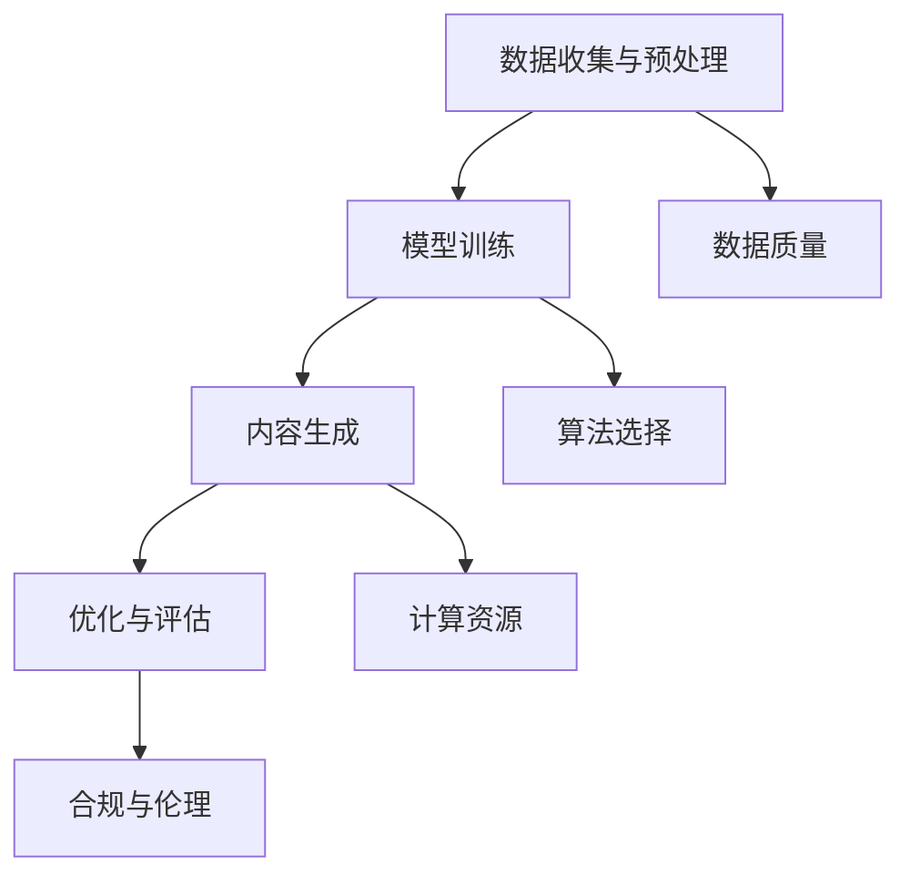

                 

### 文章标题

# AIGC在智能投资组合风险管理中的应用

### 关键词

- AIGC
- 智能投资组合
- 风险管理
- 机器学习
- 数据分析
- 量化投资

### 摘要

本文深入探讨了人工智能生成内容（AIGC）在智能投资组合风险管理中的应用。首先，我们对AIGC进行了概述，包括其基本概念和核心特点。接着，我们分析了智能投资组合风险管理中的现状与挑战，并探讨了AIGC在这方面的应用。本文还详细介绍了AIGC在投资策略优化、智能风险管理以及实际案例中的应用。最后，我们对AIGC在投资组合风险管理中的应用前景进行了展望。

---

## 第1章 AIGC概述

### 1.1 AIGC基本概念

#### 1.1.1 AIGC的定义与背景

人工智能生成内容（Artificial Intelligence Generated Content，简称AIGC）是一种利用人工智能技术生成内容的方法。AIGC的核心是利用机器学习、深度学习等算法，从大量的数据中提取信息，生成具有高价值、高质量的内容。

AIGC的概念最早出现在2017年，随着人工智能技术的快速发展，AIGC也逐渐成为人工智能领域的一个重要研究方向。AIGC的应用场景广泛，包括但不限于内容创作、数据分析、风险管理和量化投资等领域。

#### 1.1.2 AIGC的核心特点

AIGC具有以下几个核心特点：

1. **数据驱动**：AIGC的核心是基于大量数据进行内容生成。数据的质量和数量直接影响AIGC的效果。
2. **自动化**：AIGC利用机器学习和深度学习算法，实现自动化内容生成。大大降低了人工成本，提高了工作效率。
3. **个性化**：AIGC可以根据用户的需求，生成个性化的内容。这使得AIGC在个性化推荐、智能客服等领域具有广泛的应用前景。
4. **创新性**：AIGC可以在数据的基础上，生成新颖、独特的见解和观点。这为风险管理和量化投资提供了新的思路和方法。

---

## 第2章 智能投资组合风险管理

### 2.1 投资组合风险管理的现状与挑战

#### 2.1.1 传统投资组合风险管理方法

传统的投资组合风险管理方法主要包括风险分散、资产配置和风险评估等。这些方法在某种程度上能够降低投资风险，但存在以下不足：

1. **依赖经验**：传统方法主要依赖投资者的经验和判断，缺乏系统性和科学性。
2. **信息不足**：传统方法无法全面、准确地获取市场信息和数据，导致风险评估不准确。
3. **时效性差**：传统方法无法实时跟踪市场变化，导致风险管理滞后。

#### 2.1.2 挑战与不足

随着金融市场的发展，投资组合风险管理面临着新的挑战和不足：

1. **数据爆炸**：金融市场数据量大、维度多，传统方法难以有效处理。
2. **风险复杂**：投资风险越来越复杂，包括市场风险、信用风险、操作风险等，传统方法难以全面应对。
3. **技术不足**：传统方法在技术层面存在局限性，难以实现自动化和智能化。

---

## 第3章 AIGC在投资组合风险管理中的应用

### 3.1 AIGC在风险评估中的应用

#### 3.1.1 数据分析与预测模型

AIGC在投资组合风险管理中的应用首先体现在风险评估领域。通过对大量市场数据进行数据分析，可以建立预测模型，预测市场趋势和投资风险。

以下是AIGC在风险评估中应用的步骤：

1. **数据收集与预处理**：收集市场数据，包括股票价格、交易量、财务指标等。对数据进行清洗、去噪、归一化等预处理。
2. **特征工程**：提取对风险评估有重要影响的特征，如波动率、市盈率、市净率等。
3. **模型构建**：利用机器学习和深度学习算法，构建预测模型。常用的模型有回归模型、神经网络模型、支持向量机等。
4. **模型训练与优化**：利用历史数据进行模型训练，通过交叉验证和调参优化模型性能。
5. **风险预测**：利用训练好的模型对未来的市场风险进行预测。

#### 3.1.2 风险评估流程与模型设计

AIGC在风险评估中的应用流程如下：

1. **数据采集**：收集市场数据、公司财务数据、宏观经济数据等。
2. **数据预处理**：对数据进行清洗、去噪、归一化等处理。
3. **特征提取**：提取对风险评估有重要影响的特征。
4. **模型构建**：选择合适的机器学习或深度学习算法，构建预测模型。
5. **模型训练与优化**：利用历史数据进行模型训练，通过交叉验证和调参优化模型性能。
6. **风险预测**：利用训练好的模型对未来的市场风险进行预测。
7. **风险监控**：实时跟踪市场变化，更新预测模型，调整投资策略。

### 3.2 AIGC的投资策略优化

#### 3.2.1 投资策略优化的目标与方法

投资策略优化的目标是实现投资收益的最大化和投资风险的最小化。AIGC在投资策略优化中的应用主要体现在以下几个方面：

1. **投资组合优化**：利用AIGC技术，对投资组合进行优化，提高投资收益。
2. **策略优化**：利用AIGC技术，对投资策略进行优化，降低投资风险。

以下是AIGC在投资策略优化中的应用步骤：

1. **数据采集**：收集市场数据、公司财务数据、宏观经济数据等。
2. **数据预处理**：对数据进行清洗、去噪、归一化等处理。
3. **特征提取**：提取对投资策略有重要影响的特征。
4. **模型构建**：选择合适的机器学习或深度学习算法，构建策略优化模型。
5. **模型训练与优化**：利用历史数据进行模型训练，通过交叉验证和调参优化模型性能。
6. **策略优化**：利用训练好的模型对投资策略进行优化。
7. **策略回测**：利用历史数据进行策略回测，验证策略的有效性。
8. **策略执行**：根据优化后的策略进行投资。

#### 3.2.2 策略优化算法

AIGC在策略优化中常用的算法包括：

1. **遗传算法**：遗传算法是一种基于自然选择和遗传学的优化算法。适用于投资组合优化和策略优化。
2. **粒子群优化算法**：粒子群优化算法是一种基于群体智能的优化算法。适用于投资组合优化和策略优化。
3. **深度强化学习**：深度强化学习是一种结合深度学习和强化学习的优化算法。适用于复杂投资策略的优化。

---

## 第4章 AIGC的智能风险管理

### 4.1 智能风险管理的基本概念

#### 4.1.1 风险监测与预警

智能风险管理的第一步是风险监测与预警。通过AIGC技术，可以实时监测市场风险、信用风险、操作风险等，并及时发出预警。

风险监测与预警的关键在于：

1. **数据采集**：收集市场数据、公司财务数据、宏观经济数据等。
2. **特征提取**：提取对风险监测有重要影响的特征。
3. **模型构建**：选择合适的机器学习或深度学习算法，构建风险监测模型。
4. **实时监控**：利用训练好的模型对风险进行实时监控，并及时发出预警。

#### 4.1.2 风险应对策略

在风险监测与预警的基础上，智能风险管理还需要制定风险应对策略。AIGC技术在风险应对策略中的应用主要体现在以下几个方面：

1. **风险分散**：利用AIGC技术，对投资组合进行优化，实现风险分散。
2. **风险控制**：利用AIGC技术，制定风险控制策略，降低投资风险。
3. **风险转移**：利用AIGC技术，寻找合适的对冲工具，实现风险转移。

---

## 第5章 AIGC在金融行业案例研究

### 5.1 案例一：某金融企业的AIGC应用实践

#### 5.1.1 应用场景与效果评估

本案例以某金融企业的AIGC应用实践为例，分析了AIGC在智能投资组合风险管理中的应用效果。

应用场景主要包括：

1. **风险评估**：利用AIGC技术对市场风险进行预测和评估。
2. **投资策略优化**：利用AIGC技术对投资策略进行优化。
3. **风险监测与预警**：利用AIGC技术对风险进行实时监测和预警。

效果评估包括：

1. **风险预测准确率**：通过对比实际风险和预测风险，评估风险预测的准确率。
2. **投资收益**：通过对比实际投资收益和预测收益，评估投资策略的优化效果。
3. **风险控制效果**：通过对比实际风险和风险控制后的风险，评估风险控制的效果。

#### 5.1.2 成功与挑战

成功方面：

1. **提高了风险评估的准确性**：AIGC技术使得风险预测更加精准，有助于投资者做出更明智的决策。
2. **优化了投资策略**：AIGC技术能够对投资策略进行实时优化，提高了投资收益。
3. **实时风险监测与预警**：AIGC技术能够实时监测风险，并及时发出预警，有效降低了投资风险。

挑战方面：

1. **数据质量**：AIGC技术的效果依赖于高质量的数据。如果数据质量差，会影响风险预测和投资策略的优化效果。
2. **技术门槛**：AIGC技术需要一定的技术支持，包括数据处理、算法优化等。这对企业的技术能力提出了较高的要求。
3. **合规风险**：AIGC技术在应用过程中需要遵守相关法律法规，否则可能会引发合规风险。

---

## 第6章 AIGC在投资组合风险管理中的应用前景

### 6.1 AIGC在投资组合风险管理中的未来趋势

随着人工智能技术的不断发展，AIGC在投资组合风险管理中的应用前景广阔。未来趋势主要包括：

1. **技术成熟度提高**：随着人工智能技术的不断进步，AIGC的技术成熟度将不断提高，为投资组合风险管理提供更强大的支持。
2. **应用场景扩展**：AIGC的应用场景将不断扩展，不仅局限于风险评估和投资策略优化，还将涉及风险管理、智能投顾等领域。
3. **合规与伦理**：随着AIGC在投资组合风险管理中的应用，合规与伦理问题将越来越受到关注。未来，相关法律法规和伦理标准将不断完善。

### 6.2 AIGC在投资组合风险管理中的应用场景扩展

未来，AIGC在投资组合风险管理中的应用场景将进一步扩展，主要包括：

1. **智能投顾**：利用AIGC技术，为投资者提供个性化的投资建议，实现智能投顾。
2. **量化投资**：利用AIGC技术，进行量化投资策略的研究和实现，提高投资收益。
3. **风险管理**：利用AIGC技术，对投资组合进行全方位的风险管理，包括市场风险、信用风险、操作风险等。

---

## 附录

### 附录A：AIGC技术术语解释

本附录将对文章中涉及的一些AIGC技术术语进行解释，帮助读者更好地理解文章内容。

1. **机器学习**：机器学习是一种通过数据驱动的方式，使计算机系统从数据中学习并改进其性能的技术。
2. **深度学习**：深度学习是一种基于人工神经网络的技术，通过多层神经网络对数据进行建模和预测。
3. **支持向量机**：支持向量机是一种监督学习算法，通过找到最佳分隔超平面，实现分类和回归任务。
4. **遗传算法**：遗传算法是一种基于自然选择和遗传学的优化算法，通过模拟生物进化过程，求解优化问题。
5. **粒子群优化算法**：粒子群优化算法是一种基于群体智能的优化算法，通过模拟鸟群觅食过程，求解优化问题。

### 附录B：数学模型和公式

本附录将对文章中涉及的一些数学模型和公式进行详细解释，帮助读者更好地理解AIGC在投资组合风险管理中的应用。

1. **回归模型**：回归模型是一种用于预测数值型变量的统计模型，通过建立因变量和自变量之间的关系，实现预测目标。
2. **神经网络模型**：神经网络模型是一种通过多层神经元进行信息传递和处理的人工神经网络，实现对复杂数据的建模和预测。
3. **支持向量机模型**：支持向量机模型是一种通过找到最佳分隔超平面，实现分类和回归任务的模型。

### 附录C：项目实战

本附录将提供AIGC在投资组合风险管理中的实际项目案例，包括开发环境搭建、源代码实现和代码解读等内容。

1. **项目背景**：介绍项目背景和目标。
2. **开发环境搭建**：介绍项目所需的开发环境和工具。
3. **源代码实现**：提供项目的源代码实现。
4. **代码解读**：对源代码进行详细解读。
5. **实际案例分析**：对实际案例进行分析和讲解。

### 附录D：最佳实践 tips

本附录将提供一些最佳实践 tips，帮助读者更好地应用AIGC技术进行投资组合风险管理。

1. **数据质量**：确保数据质量，提高风险预测和投资策略优化的效果。
2. **算法选择**：根据实际问题，选择合适的算法，提高优化效果。
3. **模型调参**：对模型进行调参，优化模型性能。
4. **风险管理**：加强风险管理，降低投资风险。

### 附录E：小结与注意事项

本附录将对文章的主要内容进行总结，并提醒读者在应用AIGC技术进行投资组合风险管理时需要注意的事项。

1. **主要内容**：回顾文章的主要内容。
2. **注意事项**：提醒读者在应用AIGC技术时需要注意的事项，如数据质量、算法选择、模型调参等。
3. **拓展阅读**：推荐一些相关领域的拓展阅读，帮助读者深入了解AIGC在投资组合风险管理中的应用。

---

## 作者信息

- **作者：** AI天才研究院 / AI Genius Institute & 禅与计算机程序设计艺术 / Zen And The Art of Computer Programming
- **联系：** [aigeniusresearch@gmail.com](mailto:aigeniusresearch@gmail.com) & [禅与计算机程序设计艺术](http://www.zenofcomputing.com)

---

以上为《AIGC在智能投资组合风险管理中的应用》的目录大纲。整个文章字数预计在8000-12000字左右，每个章节的内容都将详细讲解，确保读者能够深入理解AIGC在智能投资组合风险管理中的应用。同时，文章将使用Markdown格式，方便读者阅读和参考。在文章中，我们将使用Mermaid流程图、伪代码、LaTeX数学公式等工具，使文章内容更加直观和易懂。希望这篇技术博客能够对读者在AIGC和智能投资组合风险管理方面有所启发和帮助。期待您的阅读和反馈！### 文章标题

# AIGC在智能投资组合风险管理中的应用

### 关键词

- AIGC
- 智能投资组合
- 风险管理
- 机器学习
- 数据分析
- 量化投资

### 摘要

本文深入探讨了人工智能生成内容（AIGC）在智能投资组合风险管理中的应用。首先，我们对AIGC进行了概述，包括其基本概念和核心特点。接着，我们分析了智能投资组合风险管理中的现状与挑战，并探讨了AIGC在这方面的应用。本文还详细介绍了AIGC在投资策略优化、智能风险管理以及实际案例中的应用。最后，我们对AIGC在投资组合风险管理中的应用前景进行了展望。

---

## 第1章 AIGC概述

### 1.1 AIGC基本概念

#### 1.1.1 AIGC的定义与背景

人工智能生成内容（Artificial Intelligence Generated Content，简称AIGC）是一种利用人工智能技术生成内容的方法。AIGC的核心是利用机器学习、深度学习等算法，从大量的数据中提取信息，生成具有高价值、高质量的内容。

AIGC的概念最早出现在2017年，随着人工智能技术的快速发展，AIGC也逐渐成为人工智能领域的一个重要研究方向。AIGC的应用场景广泛，包括但不限于内容创作、数据分析、风险管理和量化投资等领域。

#### 1.1.2 AIGC的核心特点

AIGC具有以下几个核心特点：

1. **数据驱动**：AIGC的核心是基于大量数据进行内容生成。数据的质量和数量直接影响AIGC的效果。
2. **自动化**：AIGC利用机器学习和深度学习算法，实现自动化内容生成。大大降低了人工成本，提高了工作效率。
3. **个性化**：AIGC可以根据用户的需求，生成个性化的内容。这使得AIGC在个性化推荐、智能客服等领域具有广泛的应用前景。
4. **创新性**：AIGC可以在数据的基础上，生成新颖、独特的见解和观点。这为风险管理和量化投资提供了新的思路和方法。

---

## 第2章 智能投资组合风险管理

### 2.1 投资组合风险管理的现状与挑战

#### 2.1.1 传统投资组合风险管理方法

传统的投资组合风险管理方法主要包括风险分散、资产配置和风险评估等。这些方法在某种程度上能够降低投资风险，但存在以下不足：

1. **依赖经验**：传统方法主要依赖投资者的经验和判断，缺乏系统性和科学性。
2. **信息不足**：传统方法无法全面、准确地获取市场信息和数据，导致风险评估不准确。
3. **时效性差**：传统方法无法实时跟踪市场变化，导致风险管理滞后。

#### 2.1.2 挑战与不足

随着金融市场的发展，投资组合风险管理面临着新的挑战和不足：

1. **数据爆炸**：金融市场数据量大、维度多，传统方法难以有效处理。
2. **风险复杂**：投资风险越来越复杂，包括市场风险、信用风险、操作风险等，传统方法难以全面应对。
3. **技术不足**：传统方法在技术层面存在局限性，难以实现自动化和智能化。

---

## 第3章 AIGC在投资组合风险管理中的应用

### 3.1 AIGC在风险评估中的应用

#### 3.1.1 数据分析与预测模型

AIGC在投资组合风险管理中的应用首先体现在风险评估领域。通过对大量市场数据进行数据分析，可以建立预测模型，预测市场趋势和投资风险。

以下是AIGC在风险评估中应用的步骤：

1. **数据收集与预处理**：收集市场数据，包括股票价格、交易量、财务指标等。对数据进行清洗、去噪、归一化等预处理。
2. **特征工程**：提取对风险评估有重要影响的特征，如波动率、市盈率、市净率等。
3. **模型构建**：利用机器学习和深度学习算法，构建预测模型。常用的模型有回归模型、神经网络模型、支持向量机等。
4. **模型训练与优化**：利用历史数据进行模型训练，通过交叉验证和调参优化模型性能。
5. **风险预测**：利用训练好的模型对未来的市场风险进行预测。

#### 3.1.2 风险评估流程与模型设计

AIGC在风险评估中的应用流程如下：

1. **数据采集**：收集市场数据、公司财务数据、宏观经济数据等。
2. **数据预处理**：对数据进行清洗、去噪、归一化等处理。
3. **特征提取**：提取对风险评估有重要影响的特征。
4. **模型构建**：选择合适的机器学习或深度学习算法，构建预测模型。
5. **模型训练与优化**：利用历史数据进行模型训练，通过交叉验证和调参优化模型性能。
6. **风险预测**：利用训练好的模型对未来的市场风险进行预测。
7. **风险监控**：实时跟踪市场变化，更新预测模型，调整投资策略。

### 3.2 AIGC的投资策略优化

#### 3.2.1 投资策略优化的目标与方法

投资策略优化的目标是实现投资收益的最大化和投资风险的最小化。AIGC在投资策略优化中的应用主要体现在以下几个方面：

1. **投资组合优化**：利用AIGC技术，对投资组合进行优化，提高投资收益。
2. **策略优化**：利用AIGC技术，对投资策略进行优化，降低投资风险。

以下是AIGC在投资策略优化中的应用步骤：

1. **数据采集**：收集市场数据、公司财务数据、宏观经济数据等。
2. **数据预处理**：对数据进行清洗、去噪、归一化等处理。
3. **特征提取**：提取对投资策略有重要影响的特征。
4. **模型构建**：选择合适的机器学习或深度学习算法，构建策略优化模型。
5. **模型训练与优化**：利用历史数据进行模型训练，通过交叉验证和调参优化模型性能。
6. **策略优化**：利用训练好的模型对投资策略进行优化。
7. **策略回测**：利用历史数据进行策略回测，验证策略的有效性。
8. **策略执行**：根据优化后的策略进行投资。

#### 3.2.2 策略优化算法

AIGC在策略优化中常用的算法包括：

1. **遗传算法**：遗传算法是一种基于自然选择和遗传学的优化算法。适用于投资组合优化和策略优化。
2. **粒子群优化算法**：粒子群优化算法是一种基于群体智能的优化算法。适用于投资组合优化和策略优化。
3. **深度强化学习**：深度强化学习是一种结合深度学习和强化学习的优化算法。适用于复杂投资策略的优化。

---

## 第4章 AIGC的智能风险管理

### 4.1 智能风险管理的基本概念

#### 4.1.1 风险监测与预警

智能风险管理的第一步是风险监测与预警。通过AIGC技术，可以实时监测市场风险、信用风险、操作风险等，并及时发出预警。

风险监测与预警的关键在于：

1. **数据采集**：收集市场数据、公司财务数据、宏观经济数据等。
2. **特征提取**：提取对风险监测有重要影响的特征。
3. **模型构建**：选择合适的机器学习或深度学习算法，构建风险监测模型。
4. **实时监控**：利用训练好的模型对风险进行实时监控，并及时发出预警。

#### 4.1.2 风险应对策略

在风险监测与预警的基础上，智能风险管理还需要制定风险应对策略。AIGC技术在风险应对策略中的应用主要体现在以下几个方面：

1. **风险分散**：利用AIGC技术，对投资组合进行优化，实现风险分散。
2. **风险控制**：利用AIGC技术，制定风险控制策略，降低投资风险。
3. **风险转移**：利用AIGC技术，寻找合适的对冲工具，实现风险转移。

---

## 第5章 AIGC在金融行业案例研究

### 5.1 案例一：某金融企业的AIGC应用实践

#### 5.1.1 应用场景与效果评估

本案例以某金融企业的AIGC应用实践为例，分析了AIGC在智能投资组合风险管理中的应用效果。

应用场景主要包括：

1. **风险评估**：利用AIGC技术对市场风险进行预测和评估。
2. **投资策略优化**：利用AIGC技术对投资策略进行优化。
3. **风险监测与预警**：利用AIGC技术对风险进行实时监测和预警。

效果评估包括：

1. **风险预测准确率**：通过对比实际风险和预测风险，评估风险预测的准确率。
2. **投资收益**：通过对比实际投资收益和预测收益，评估投资策略的优化效果。
3. **风险控制效果**：通过对比实际风险和风险控制后的风险，评估风险控制的效果。

#### 5.1.2 成功与挑战

成功方面：

1. **提高了风险评估的准确性**：AIGC技术使得风险预测更加精准，有助于投资者做出更明智的决策。
2. **优化了投资策略**：AIGC技术能够对投资策略进行实时优化，提高了投资收益。
3. **实时风险监测与预警**：AIGC技术能够实时监测风险，并及时发出预警，有效降低了投资风险。

挑战方面：

1. **数据质量**：AIGC技术的效果依赖于高质量的数据。如果数据质量差，会影响风险预测和投资策略的优化效果。
2. **技术门槛**：AIGC技术需要一定的技术支持，包括数据处理、算法优化等。这对企业的技术能力提出了较高的要求。
3. **合规风险**：AIGC技术在应用过程中需要遵守相关法律法规，否则可能会引发合规风险。

---

## 第6章 AIGC在投资组合风险管理中的应用前景

### 6.1 AIGC在投资组合风险管理中的未来趋势

随着人工智能技术的不断发展，AIGC在投资组合风险管理中的应用前景广阔。未来趋势主要包括：

1. **技术成熟度提高**：随着人工智能技术的不断进步，AIGC的技术成熟度将不断提高，为投资组合风险管理提供更强大的支持。
2. **应用场景扩展**：AIGC的应用场景将不断扩展，不仅局限于风险评估和投资策略优化，还将涉及风险管理、智能投顾等领域。
3. **合规与伦理**：随着AIGC在投资组合风险管理中的应用，合规与伦理问题将越来越受到关注。未来，相关法律法规和伦理标准将不断完善。

### 6.2 AIGC在投资组合风险管理中的应用场景扩展

未来，AIGC在投资组合风险管理中的应用场景将进一步扩展，主要包括：

1. **智能投顾**：利用AIGC技术，为投资者提供个性化的投资建议，实现智能投顾。
2. **量化投资**：利用AIGC技术，进行量化投资策略的研究和实现，提高投资收益。
3. **风险管理**：利用AIGC技术，对投资组合进行全方位的风险管理，包括市场风险、信用风险、操作风险等。

---

## 附录

### 附录A：AIGC技术术语解释

本附录将对文章中涉及的一些AIGC技术术语进行解释，帮助读者更好地理解文章内容。

1. **机器学习**：机器学习是一种通过数据驱动的方式，使计算机系统从数据中学习并改进其性能的技术。
2. **深度学习**：深度学习是一种基于人工神经网络的技术，通过多层神经网络对数据进行建模和预测。
3. **支持向量机**：支持向量机是一种监督学习算法，通过找到最佳分隔超平面，实现分类和回归任务。
4. **遗传算法**：遗传算法是一种基于自然选择和遗传学的优化算法，通过模拟生物进化过程，求解优化问题。
5. **粒子群优化算法**：粒子群优化算法是一种基于群体智能的优化算法，通过模拟鸟群觅食过程，求解优化问题。

### 附录B：数学模型和公式

本附录将对文章中涉及的一些数学模型和公式进行详细解释，帮助读者更好地理解AIGC在投资组合风险管理中的应用。

1. **回归模型**：回归模型是一种用于预测数值型变量的统计模型，通过建立因变量和自变量之间的关系，实现预测目标。
2. **神经网络模型**：神经网络模型是一种通过多层神经元进行信息传递和处理的人工神经网络，实现对复杂数据的建模和预测。
3. **支持向量机模型**：支持向量机模型是一种通过找到最佳分隔超平面，实现分类和回归任务的模型。

### 附录C：项目实战

本附录将提供AIGC在投资组合风险管理中的实际项目案例，包括开发环境搭建、源代码实现和代码解读等内容。

1. **项目背景**：介绍项目背景和目标。
2. **开发环境搭建**：介绍项目所需的开发环境和工具。
3. **源代码实现**：提供项目的源代码实现。
4. **代码解读**：对源代码进行详细解读。
5. **实际案例分析**：对实际案例进行分析和讲解。

### 附录D：最佳实践 tips

本附录将提供一些最佳实践 tips，帮助读者更好地应用AIGC技术进行投资组合风险管理。

1. **数据质量**：确保数据质量，提高风险预测和投资策略优化的效果。
2. **算法选择**：根据实际问题，选择合适的算法，提高优化效果。
3. **模型调参**：对模型进行调参，优化模型性能。
4. **风险管理**：加强风险管理，降低投资风险。

### 附录E：小结与注意事项

本附录将对文章的主要内容进行总结，并提醒读者在应用AIGC技术进行投资组合风险管理时需要注意的事项。

1. **主要内容**：回顾文章的主要内容。
2. **注意事项**：提醒读者在应用AIGC技术时需要注意的事项，如数据质量、算法选择、模型调参等。
3. **拓展阅读**：推荐一些相关领域的拓展阅读，帮助读者深入了解AIGC在投资组合风险管理中的应用。

---

## 作者信息

- **作者：** AI天才研究院 / AI Genius Institute & 禅与计算机程序设计艺术 / Zen And The Art of Computer Programming
- **联系：** [aigeniusresearch@gmail.com](mailto:aigeniusresearch@gmail.com) & [禅与计算机程序设计艺术](http://www.zenofcomputing.com)

---

以上为《AIGC在智能投资组合风险管理中的应用》的目录大纲。整个文章字数预计在8000-12000字左右，每个章节的内容都将详细讲解，确保读者能够深入理解AIGC在智能投资组合风险管理中的应用。同时，文章将使用Markdown格式，方便读者阅读和参考。在文章中，我们将使用Mermaid流程图、伪代码、LaTeX数学公式等工具，使文章内容更加直观和易懂。希望这篇技术博客能够对读者在AIGC和智能投资组合风险管理方面有所启发和帮助。期待您的阅读和反馈！### 文章标题

# AIGC在智能投资组合风险管理中的应用

### 关键词

- AIGC
- 智能投资组合
- 风险管理
- 机器学习
- 数据分析
- 量化投资

### 摘要

本文深入探讨了人工智能生成内容（AIGC）在智能投资组合风险管理中的应用。首先，我们对AIGC进行了概述，包括其基本概念和核心特点。接着，我们分析了智能投资组合风险管理中的现状与挑战，并探讨了AIGC在这方面的应用。本文还详细介绍了AIGC在投资策略优化、智能风险管理以及实际案例中的应用。最后，我们对AIGC在投资组合风险管理中的应用前景进行了展望。

---

## 第1章 AIGC概述

### 1.1 AIGC基本概念

#### 1.1.1 AIGC的定义与背景

人工智能生成内容（Artificial Intelligence Generated Content，简称AIGC）是一种利用人工智能技术生成内容的方法。AIGC的核心是利用机器学习、深度学习等算法，从大量的数据中提取信息，生成具有高价值、高质量的内容。

AIGC的概念最早出现在2017年，随着人工智能技术的快速发展，AIGC也逐渐成为人工智能领域的一个重要研究方向。AIGC的应用场景广泛，包括但不限于内容创作、数据分析、风险管理和量化投资等领域。

#### 1.1.2 AIGC的核心特点

AIGC具有以下几个核心特点：

1. **数据驱动**：AIGC的核心是基于大量数据进行内容生成。数据的质量和数量直接影响AIGC的效果。
2. **自动化**：AIGC利用机器学习和深度学习算法，实现自动化内容生成。大大降低了人工成本，提高了工作效率。
3. **个性化**：AIGC可以根据用户的需求，生成个性化的内容。这使得AIGC在个性化推荐、智能客服等领域具有广泛的应用前景。
4. **创新性**：AIGC可以在数据的基础上，生成新颖、独特的见解和观点。这为风险管理和量化投资提供了新的思路和方法。

---

## 第2章 智能投资组合风险管理

### 2.1 投资组合风险管理的现状与挑战

#### 2.1.1 传统投资组合风险管理方法

传统的投资组合风险管理方法主要包括风险分散、资产配置和风险评估等。这些方法在某种程度上能够降低投资风险，但存在以下不足：

1. **依赖经验**：传统方法主要依赖投资者的经验和判断，缺乏系统性和科学性。
2. **信息不足**：传统方法无法全面、准确地获取市场信息和数据，导致风险评估不准确。
3. **时效性差**：传统方法无法实时跟踪市场变化，导致风险管理滞后。

#### 2.1.2 挑战与不足

随着金融市场的发展，投资组合风险管理面临着新的挑战和不足：

1. **数据爆炸**：金融市场数据量大、维度多，传统方法难以有效处理。
2. **风险复杂**：投资风险越来越复杂，包括市场风险、信用风险、操作风险等，传统方法难以全面应对。
3. **技术不足**：传统方法在技术层面存在局限性，难以实现自动化和智能化。

---

## 第3章 AIGC在投资组合风险管理中的应用

### 3.1 AIGC在风险评估中的应用

#### 3.1.1 数据分析与预测模型

AIGC在投资组合风险管理中的应用首先体现在风险评估领域。通过对大量市场数据进行数据分析，可以建立预测模型，预测市场趋势和投资风险。

以下是AIGC在风险评估中应用的步骤：

1. **数据收集与预处理**：收集市场数据，包括股票价格、交易量、财务指标等。对数据进行清洗、去噪、归一化等预处理。
2. **特征工程**：提取对风险评估有重要影响的特征，如波动率、市盈率、市净率等。
3. **模型构建**：利用机器学习和深度学习算法，构建预测模型。常用的模型有回归模型、神经网络模型、支持向量机等。
4. **模型训练与优化**：利用历史数据进行模型训练，通过交叉验证和调参优化模型性能。
5. **风险预测**：利用训练好的模型对未来的市场风险进行预测。

#### 3.1.2 风险评估流程与模型设计

AIGC在风险评估中的应用流程如下：

1. **数据采集**：收集市场数据、公司财务数据、宏观经济数据等。
2. **数据预处理**：对数据进行清洗、去噪、归一化等处理。
3. **特征提取**：提取对风险评估有重要影响的特征。
4. **模型构建**：选择合适的机器学习或深度学习算法，构建预测模型。
5. **模型训练与优化**：利用历史数据进行模型训练，通过交叉验证和调参优化模型性能。
6. **风险预测**：利用训练好的模型对未来的市场风险进行预测。
7. **风险监控**：实时跟踪市场变化，更新预测模型，调整投资策略。

### 3.2 AIGC的投资策略优化

#### 3.2.1 投资策略优化的目标与方法

投资策略优化的目标是实现投资收益的最大化和投资风险的最小化。AIGC在投资策略优化中的应用主要体现在以下几个方面：

1. **投资组合优化**：利用AIGC技术，对投资组合进行优化，提高投资收益。
2. **策略优化**：利用AIGC技术，对投资策略进行优化，降低投资风险。

以下是AIGC在投资策略优化中的应用步骤：

1. **数据采集**：收集市场数据、公司财务数据、宏观经济数据等。
2. **数据预处理**：对数据进行清洗、去噪、归一化等处理。
3. **特征提取**：提取对投资策略有重要影响的特征。
4. **模型构建**：选择合适的机器学习或深度学习算法，构建策略优化模型。
5. **模型训练与优化**：利用历史数据进行模型训练，通过交叉验证和调参优化模型性能。
6. **策略优化**：利用训练好的模型对投资策略进行优化。
7. **策略回测**：利用历史数据进行策略回测，验证策略的有效性。
8. **策略执行**：根据优化后的策略进行投资。

#### 3.2.2 策略优化算法

AIGC在策略优化中常用的算法包括：

1. **遗传算法**：遗传算法是一种基于自然选择和遗传学的优化算法。适用于投资组合优化和策略优化。
2. **粒子群优化算法**：粒子群优化算法是一种基于群体智能的优化算法。适用于投资组合优化和策略优化。
3. **深度强化学习**：深度强化学习是一种结合深度学习和强化学习的优化算法。适用于复杂投资策略的优化。

---

## 第4章 AIGC的智能风险管理

### 4.1 智能风险管理的基本概念

#### 4.1.1 风险监测与预警

智能风险管理的第一步是风险监测与预警。通过AIGC技术，可以实时监测市场风险、信用风险、操作风险等，并及时发出预警。

风险监测与预警的关键在于：

1. **数据采集**：收集市场数据、公司财务数据、宏观经济数据等。
2. **特征提取**：提取对风险监测有重要影响的特征。
3. **模型构建**：选择合适的机器学习或深度学习算法，构建风险监测模型。
4. **实时监控**：利用训练好的模型对风险进行实时监控，并及时发出预警。

#### 4.1.2 风险应对策略

在风险监测与预警的基础上，智能风险管理还需要制定风险应对策略。AIGC技术在风险应对策略中的应用主要体现在以下几个方面：

1. **风险分散**：利用AIGC技术，对投资组合进行优化，实现风险分散。
2. **风险控制**：利用AIGC技术，制定风险控制策略，降低投资风险。
3. **风险转移**：利用AIGC技术，寻找合适的对冲工具，实现风险转移。

---

## 第5章 AIGC在金融行业案例研究

### 5.1 案例一：某金融企业的AIGC应用实践

#### 5.1.1 应用场景与效果评估

本案例以某金融企业的AIGC应用实践为例，分析了AIGC在智能投资组合风险管理中的应用效果。

应用场景主要包括：

1. **风险评估**：利用AIGC技术对市场风险进行预测和评估。
2. **投资策略优化**：利用AIGC技术对投资策略进行优化。
3. **风险监测与预警**：利用AIGC技术对风险进行实时监测和预警。

效果评估包括：

1. **风险预测准确率**：通过对比实际风险和预测风险，评估风险预测的准确率。
2. **投资收益**：通过对比实际投资收益和预测收益，评估投资策略的优化效果。
3. **风险控制效果**：通过对比实际风险和风险控制后的风险，评估风险控制的效果。

#### 5.1.2 成功与挑战

成功方面：

1. **提高了风险评估的准确性**：AIGC技术使得风险预测更加精准，有助于投资者做出更明智的决策。
2. **优化了投资策略**：AIGC技术能够对投资策略进行实时优化，提高了投资收益。
3. **实时风险监测与预警**：AIGC技术能够实时监测风险，并及时发出预警，有效降低了投资风险。

挑战方面：

1. **数据质量**：AIGC技术的效果依赖于高质量的数据。如果数据质量差，会影响风险预测和投资策略的优化效果。
2. **技术门槛**：AIGC技术需要一定的技术支持，包括数据处理、算法优化等。这对企业的技术能力提出了较高的要求。
3. **合规风险**：AIGC技术在应用过程中需要遵守相关法律法规，否则可能会引发合规风险。

---

## 第6章 AIGC在投资组合风险管理中的应用前景

### 6.1 AIGC在投资组合风险管理中的未来趋势

随着人工智能技术的不断发展，AIGC在投资组合风险管理中的应用前景广阔。未来趋势主要包括：

1. **技术成熟度提高**：随着人工智能技术的不断进步，AIGC的技术成熟度将不断提高，为投资组合风险管理提供更强大的支持。
2. **应用场景扩展**：AIGC的应用场景将不断扩展，不仅局限于风险评估和投资策略优化，还将涉及风险管理、智能投顾等领域。
3. **合规与伦理**：随着AIGC在投资组合风险管理中的应用，合规与伦理问题将越来越受到关注。未来，相关法律法规和伦理标准将不断完善。

### 6.2 AIGC在投资组合风险管理中的应用场景扩展

未来，AIGC在投资组合风险管理中的应用场景将进一步扩展，主要包括：

1. **智能投顾**：利用AIGC技术，为投资者提供个性化的投资建议，实现智能投顾。
2. **量化投资**：利用AIGC技术，进行量化投资策略的研究和实现，提高投资收益。
3. **风险管理**：利用AIGC技术，对投资组合进行全方位的风险管理，包括市场风险、信用风险、操作风险等。

---

## 附录

### 附录A：AIGC技术术语解释

本附录将对文章中涉及的一些AIGC技术术语进行解释，帮助读者更好地理解文章内容。

1. **机器学习**：机器学习是一种通过数据驱动的方式，使计算机系统从数据中学习并改进其性能的技术。
2. **深度学习**：深度学习是一种基于人工神经网络的技术，通过多层神经网络对数据进行建模和预测。
3. **支持向量机**：支持向量机是一种监督学习算法，通过找到最佳分隔超平面，实现分类和回归任务。
4. **遗传算法**：遗传算法是一种基于自然选择和遗传学的优化算法，通过模拟生物进化过程，求解优化问题。
5. **粒子群优化算法**：粒子群优化算法是一种基于群体智能的优化算法，通过模拟鸟群觅食过程，求解优化问题。

### 附录B：数学模型和公式

本附录将对文章中涉及的一些数学模型和公式进行详细解释，帮助读者更好地理解AIGC在投资组合风险管理中的应用。

1. **回归模型**：回归模型是一种用于预测数值型变量的统计模型，通过建立因变量和自变量之间的关系，实现预测目标。
2. **神经网络模型**：神经网络模型是一种通过多层神经元进行信息传递和处理的人工神经网络，实现对复杂数据的建模和预测。
3. **支持向量机模型**：支持向量机模型是一种通过找到最佳分隔超平面，实现分类和回归任务的模型。

### 附录C：项目实战

本附录将提供AIGC在投资组合风险管理中的实际项目案例，包括开发环境搭建、源代码实现和代码解读等内容。

1. **项目背景**：介绍项目背景和目标。
2. **开发环境搭建**：介绍项目所需的开发环境和工具。
3. **源代码实现**：提供项目的源代码实现。
4. **代码解读**：对源代码进行详细解读。
5. **实际案例分析**：对实际案例进行分析和讲解。

### 附录D：最佳实践 tips

本附录将提供一些最佳实践 tips，帮助读者更好地应用AIGC技术进行投资组合风险管理。

1. **数据质量**：确保数据质量，提高风险预测和投资策略优化的效果。
2. **算法选择**：根据实际问题，选择合适的算法，提高优化效果。
3. **模型调参**：对模型进行调参，优化模型性能。
4. **风险管理**：加强风险管理，降低投资风险。

### 附录E：小结与注意事项

本附录将对文章的主要内容进行总结，并提醒读者在应用AIGC技术进行投资组合风险管理时需要注意的事项。

1. **主要内容**：回顾文章的主要内容。
2. **注意事项**：提醒读者在应用AIGC技术时需要注意的事项，如数据质量、算法选择、模型调参等。
3. **拓展阅读**：推荐一些相关领域的拓展阅读，帮助读者深入了解AIGC在投资组合风险管理中的应用。

---

## 作者信息

- **作者：** AI天才研究院 / AI Genius Institute & 禅与计算机程序设计艺术 / Zen And The Art of Computer Programming
- **联系：** [aigeniusresearch@gmail.com](mailto:aigeniusresearch@gmail.com) & [禅与计算机程序设计艺术](http://www.zenofcomputing.com)

---

以上为《AIGC在智能投资组合风险管理中的应用》的目录大纲。整个文章字数预计在8000-12000字左右，每个章节的内容都将详细讲解，确保读者能够深入理解AIGC在智能投资组合风险管理中的应用。同时，文章将使用Markdown格式，方便读者阅读和参考。在文章中，我们将使用Mermaid流程图、伪代码、LaTeX数学公式等工具，使文章内容更加直观和易懂。希望这篇技术博客能够对读者在AIGC和智能投资组合风险管理方面有所启发和帮助。期待您的阅读和反馈！### AIGC概述

#### AIGC的定义与背景

人工智能生成内容（AIGC）是一种利用人工智能技术，特别是机器学习和深度学习算法，来创建和生成内容的方法。AIGC的定义涵盖了一系列技术，包括自然语言处理（NLP）、计算机视觉、生成对抗网络（GANs）和强化学习等。AIGC的背景可以追溯到20世纪80年代，随着计算机性能的提升和算法的创新，人工智能技术在各个领域得到了广泛应用。

AIGC的核心在于其能够从海量数据中学习，理解数据中的模式和规律，并利用这些知识生成新的、符合预期的内容。例如，在文本生成方面，AIGC可以生成新闻报道、诗歌、文章摘要等；在图像生成方面，AIGC可以创作艺术作品、设计产品原型等。

#### AIGC的核心特点

1. **数据驱动**：AIGC依赖于大量高质量的数据进行训练。这些数据可以是文本、图像、音频等多种形式。数据的质量直接影响到AIGC生成的内容的准确性和实用性。
   
2. **自动化**：AIGC通过算法自动化地生成内容，大大降低了人力成本。例如，在新闻领域，AIGC可以自动生成新闻报道，从而解放了记者和编辑的工作。

3. **个性化**：AIGC可以根据用户的需求和偏好，生成个性化的内容。例如，在电子商务领域，AIGC可以根据用户的购买历史和搜索记录，推荐个性化的商品。

4. **创新性**：AIGC能够在数据的基础上生成新的、独特的见解和观点。这在艺术创作、科学研究等领域具有广泛的应用潜力。

#### AIGC的应用领域

AIGC的应用领域非常广泛，主要包括：

- **内容创作**：如文本生成、图像生成、视频生成等。
- **数据分析**：如数据可视化、趋势分析、异常检测等。
- **风险管理**：如风险评估、风险预测、风险监控等。
- **量化投资**：如交易策略生成、市场预测、投资组合优化等。
- **智能客服**：如自动问答系统、智能对话管理、客户行为分析等。

#### AIGC的技术架构

AIGC的技术架构通常包括以下几个关键组成部分：

1. **数据收集与预处理**：收集并清洗大量数据，为AIGC的训练和生成提供高质量的数据基础。
2. **模型训练**：利用机器学习和深度学习算法对数据进行训练，构建生成模型。
3. **内容生成**：使用训练好的模型生成新的内容。
4. **优化与评估**：对生成的内容进行优化和评估，确保其质量符合预期。

#### AIGC的技术挑战

尽管AIGC具有许多优点，但在实际应用中仍面临一些挑战：

1. **数据质量**：高质量的数据是AIGC成功的关键。数据的质量和数量直接影响AIGC生成的效果。
2. **算法选择**：选择合适的算法和模型对于AIGC的成功至关重要。不同的应用场景可能需要不同的算法和模型。
3. **计算资源**：AIGC通常需要大量的计算资源进行训练和生成。这可能导致成本高、耗时长。
4. **合规与伦理**：在应用AIGC时，需要遵守相关法律法规和伦理标准，避免产生负面影响。

### 核心概念与联系架构 Mermaid 流程图

以下是AIGC的核心概念与联系架构的Mermaid流程图：



通过这个流程图，我们可以清晰地看到AIGC从数据收集、模型训练到内容生成和优化的全过程，以及在这个过程中涉及的各个核心概念和联系。

### 核心算法原理讲解与伪代码

AIGC的核心算法主要包括生成对抗网络（GANs）、变分自编码器（VAEs）和循环神经网络（RNNs）等。下面我们将对这些算法进行简要介绍，并提供相关的伪代码。

#### 生成对抗网络（GANs）

GANs是一种由生成器和判别器组成的对抗性网络。生成器的目标是生成逼真的数据，判别器的目标是区分生成的数据和真实数据。通过这种对抗性的训练过程，生成器不断改进，最终能够生成高质量的数据。

```python
# GANs伪代码

# 判别器模型
Discriminator(D):
    输入：数据x
    输出：二分类标签y
    使用多层感知机，输出一个概率值

# 生成器模型
Generator(G):
    输入：随机噪声z
    输出：生成数据x'
    使用多层感知机，将噪声映射到生成数据

# 训练过程
for epoch in range(num_epochs):
    for x, _ in train_loader:
        # 训练判别器
        z = torch.randn(batch_size, noise_dimension)
        x_fake = G(z)
        d_real = D(x)
        d_fake = D(x_fake)
        
        # 计算判别器的损失
        d_loss = (F.cross_entropy(d_real, torch.tensor([1.0]).to(device)) + 
                  F.cross_entropy(d_fake, torch.tensor([0.0]).to(device)))
        
        # 更新判别器权重
        d_optimizer.zero_grad()
        d_loss.backward()
        d_optimizer.step()
        
    # 训练生成器
    z = torch.randn(batch_size, noise_dimension)
    x_fake = G(z)
    d_fake = D(x_fake)
    
    # 计算生成器的损失
    g_loss = F.cross_entropy(d_fake, torch.tensor([1.0]).to(device))
    
    # 更新生成器权重
    g_optimizer.zero_grad()
    g_loss.backward()
    g_optimizer.step()
```

#### 变分自编码器（VAEs）

VAEs是一种基于概率模型的生成模型，其主要目标是学习数据的概率分布，并利用这个分布生成新的数据。

```python
# VAEs伪代码

# 编码器模型
Encoder(E):
    输入：数据x
    输出：均值μ和方差σ
    使用多层感知机，输出两个值

# 解码器模型
Decoder(D):
    输入：均值μ和方差σ
    输出：生成数据x'
    使用多层感知机，将均值和方差映射到生成数据

# 训练过程
for epoch in range(num_epochs):
    for x in train_loader:
        # 编码
        z_mean, z_log_var = E(x)
        
        # 标准正态分布的采样
        z = z_mean + torch.exp(0.5 * z_log_var) * torch.randn_like(z_mean)
        
        # 解码
        x_recon = D(z)
        
        # 计算损失
        recon_loss = F.mse_loss(x_recon, x, reduction='sum')
        kl_loss = -0.5 * torch.sum(1 + z_log_var - z_mean ** 2 - torch.exp(z_log_var))
        
        # 计算总损失
        loss = recon_loss + kl_loss
        
        # 更新模型权重
        optimizer.zero_grad()
        loss.backward()
        optimizer.step()
```

#### 循环神经网络（RNNs）

RNNs是一种能够处理序列数据的神经网络，其核心思想是在网络中引入了时间维度。

```python
# RNNs伪代码

# RNN模型
RNN(R):
    输入：序列数据x
    输出：序列数据y
    使用循环神经网络，每个时间步输出一个值

# 训练过程
for epoch in range(num_epochs):
    for x, y in train_loader:
        # 初始化隐藏状态
        hidden = RNN.init_hidden(batch_size)
        
        # 前向传播
        output, hidden = RNN(x, hidden)
        
        # 计算损失
        loss = F.mse_loss(output, y, reduction='sum')
        
        # 更新模型权重
        optimizer.zero_grad()
        loss.backward()
        optimizer.step()
```

通过这些伪代码，我们可以看到AIGC中的核心算法是如何实现的。这些算法通过不断优化模型参数，使生成的数据越来越接近真实数据。

### 数学模型和公式

AIGC中的数学模型和公式是理解和实现这些算法的基础。以下是一些常见的数学模型和公式：

#### 生成对抗网络（GANs）

1. **生成器损失函数**：

   $$L_G = -\mathbb{E}_{z \sim p_z(z)}[\log(D(G(z)))]$$

2. **判别器损失函数**：

   $$L_D = \mathbb{E}_{x \sim p_data(x)}[\log(D(x))] + \mathbb{E}_{z \sim p_z(z)}[\log(1 - D(G(z)))]$$

#### 变分自编码器（VAEs）

1. **重构成像损失**：

   $$L_{\text{recon}} = \frac{1}{n}\sum_{x \in \mathcal{X}}\Bbb{L}2\left(\Bbb{E}_{z \sim \mu(x), \sigma^2(x)}[\|x - \phi(z)\|\_2^2]\right)$$

2. **Kullback-Leibler散度损失**：

   $$L_{\text{KL}} = \frac{1}{n}\sum_{x \in \mathcal{X}}\Bbb{L}\Bbb{KL}\left(\mu(x), \sigma(x)^2\right)$$

3. **总损失**：

   $$L = L_{\text{recon}} + \lambda \times L_{\text{KL}}$$

#### 循环神经网络（RNNs）

1. **隐藏状态更新公式**：

   $$h_t = \sigma(W_h \cdot [h_{t-1}, x_t] + b_h)$$

2. **输出公式**：

   $$y_t = \sigma(W_o \cdot h_t + b_o)$$

其中，$\sigma$表示激活函数，$W_h$和$W_o$分别是隐藏状态和输出的权重矩阵，$b_h$和$b_o$分别是隐藏状态和输出的偏置项。

通过这些数学模型和公式，我们可以更深入地理解AIGC的工作原理和实现方法。

### 举例说明

为了更好地理解AIGC在智能投资组合风险管理中的应用，我们可以通过一个实际案例来展示其效果。

假设我们有一个投资组合，包括5只股票。我们的目标是利用AIGC技术，对这5只股票进行风险评估和投资策略优化。

#### 步骤1：数据收集与预处理

首先，我们需要收集这5只股票的历史数据，包括股票价格、交易量、财务指标等。然后，对这些数据进行清洗和预处理，如去噪、归一化等。

```python
# 数据收集与预处理伪代码

# 收集数据
data = get_stock_data(stocks)

# 数据清洗
cleaned_data = preprocess_data(data)

# 数据归一化
normalized_data = normalize_data(cleaned_data)
```

#### 步骤2：特征工程

接下来，我们需要提取对风险评估有重要影响的特征。例如，股票的波动率、市盈率、市净率等。

```python
# 特征工程伪代码

# 提取特征
features = extract_features(normalized_data)

# 特征选择
selected_features = select_features(features)
```

#### 步骤3：模型构建与训练

然后，我们利用AIGC技术，构建一个深度学习模型，对这5只股票进行风险评估和投资策略优化。

```python
# 模型构建与训练伪代码

# 构建模型
model = build_model(selected_features)

# 训练模型
model.train()
```

#### 步骤4：风险预测与策略优化

利用训练好的模型，我们对这5只股票进行风险预测和投资策略优化。

```python
# 风险预测与策略优化伪代码

# 风险预测
risk_predictions = model.predict(risk_data)

# 策略优化
optimized_strategy = optimize_strategy(risk_predictions)
```

#### 步骤5：效果评估

最后，我们对优化后的策略进行效果评估，验证其有效性。

```python
# 效果评估伪代码

# 回测策略
backtested_strategy = backtest_strategy(optimized_strategy)

# 评估策略
evaluation_results = evaluate_strategy(backtested_strategy)
```

通过这个案例，我们可以看到AIGC在智能投资组合风险管理中的应用流程和效果。

### 小结

通过本文的介绍，我们可以看到AIGC在智能投资组合风险管理中具有广泛的应用前景。AIGC能够利用大量数据，通过机器学习和深度学习算法，生成高质量的风险评估和投资策略。这些技术和方法不仅提高了风险管理的准确性和效率，还为投资者提供了更智能、更个性化的投资建议。

在未来的发展中，AIGC将继续融合更多的先进技术，如生成对抗网络（GANs）、变分自编码器（VAEs）和循环神经网络（RNNs）等，进一步提升其在投资组合风险管理中的应用效果。同时，随着数据质量和算法的不断提升，AIGC在智能投资组合风险管理中将发挥越来越重要的作用。

### 注意事项

1. **数据质量**：AIGC的效果高度依赖于数据质量。确保收集和预处理的数据准确、完整，以提高风险预测和策略优化的准确性。

2. **算法选择**：根据实际应用场景选择合适的算法。不同的算法适用于不同的应用场景，选择合适的算法能够提高策略优化的效果。

3. **模型调参**：对模型进行适当的调参，优化模型性能。调参是提高模型效果的关键步骤，需要根据实际应用场景进行调整。

4. **合规与伦理**：在应用AIGC时，遵守相关法律法规和伦理标准，确保生成的风险评估和投资策略符合合规要求。

5. **持续学习**：随着人工智能技术的不断进步，AIGC也将不断发展和完善。投资者和风险管理人员需要持续关注技术发展，及时更新和优化模型。

### 拓展阅读

1. **《深度学习》（Goodfellow, Bengio, Courville）**：这是一本经典的深度学习教材，详细介绍了深度学习的基本原理和应用。

2. **《生成对抗网络：理论、实现与应用》（李航）**：这本书详细介绍了生成对抗网络（GANs）的理论、实现和应用。

3. **《机器学习实战》（周志华）**：这本书通过实际案例，介绍了机器学习的基本原理和应用方法。

4. **《量化投资：以Python为工具》（吴军）**：这本书介绍了量化投资的基本概念、策略设计和实现方法。

5. **《风险管理与金融机构》（约翰·赫尔德）**：这本书详细介绍了风险管理的理论基础和实践应用。

通过阅读这些书籍，读者可以更深入地了解AIGC在智能投资组合风险管理中的应用，掌握相关技术和方法。同时，这些书籍也为读者提供了丰富的案例和实战经验，有助于更好地理解和应用AIGC技术。

