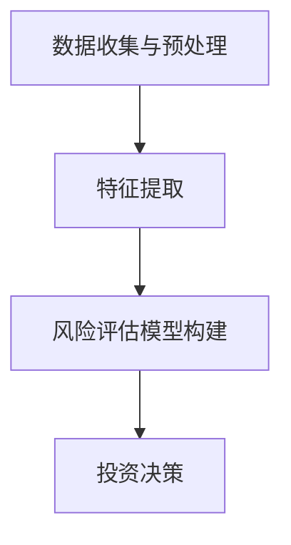
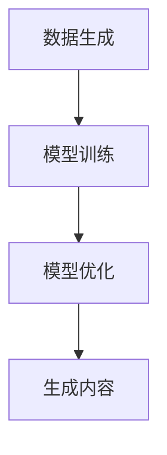
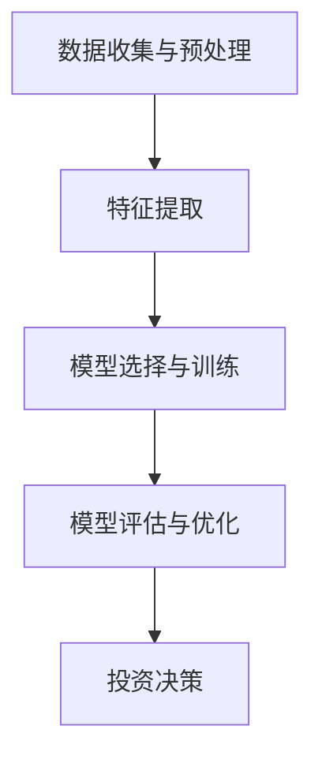

                 

### 文章标题：AIGC在智能投资风险评估中的应用

关键词：AIGC、智能投资风险评估、机器学习、深度学习、数据挖掘、人工智能

摘要：
本文旨在探讨人工智能生成内容（AIGC）在智能投资风险评估中的应用。文章首先介绍了AIGC的基本概念及其在投资风险评估中的潜在作用，接着通过核心概念与联系、算法原理、数学模型和公式、项目实战以及最佳实践等环节，详细解析了AIGC在智能投资风险评估中的具体应用。文章结构紧凑，逻辑清晰，旨在为读者提供一套完整的AIGC在投资风险评估中的应用指南。

### 目录

1. 引言
   1.1 书籍目的与结构概述
   1.2 AIGC与智能投资风险评估概述
   1.3 读者对象与预期收获

2. AIGC基础理论
   2.1 AIGC的概念与分类
   2.2 智能投资风险评估原理

3. AIGC在投资风险评估中的应用
   3.1 AIGC在数据收集与预处理中的应用
   3.2 AIGC在特征提取中的应用
   3.3 AIGC在风险评估模型构建中的应用

4. 案例研究
   4.1 案例一：AIGC在股票市场中的应用
   4.2 案例二：AIGC在债券市场中的应用

5. 技术挑战与展望
   5.1 AIGC在智能投资风险评估中的技术挑战
   5.2 AIGC在智能投资风险评估中的应用前景

6. 附录
   6.1 相关工具和资源
   6.2 参考文献

### 第一部分：引言

#### 1.1 书籍目的与结构概述

本部分将介绍书籍的整体目的、结构安排以及读者可以期待的学习成果。我们将首先解释为什么AIGC在智能投资风险评估中具有重要性，并简要介绍书籍的章节安排。

**重要性解释：**

智能投资风险评估是金融领域中的一项关键任务，旨在通过分析大量数据来预测投资风险并优化投资组合。随着大数据和人工智能技术的发展，传统的风险评估方法逐渐暴露出其局限性，例如数据收集和处理效率低、模型解释性不足等问题。AIGC作为一种新兴的人工智能技术，能够自动生成高质量的数据和模型，为智能投资风险评估提供了新的解决方案。

**章节安排：**

本书分为五个主要部分：

1. **引言**：介绍书籍的目的、结构以及AIGC和智能投资风险评估的基本概念。
2. **AIGC基础理论**：详细介绍AIGC的概念、分类及其核心技术的原理。
3. **AIGC在投资风险评估中的应用**：详细探讨AIGC在数据收集、特征提取和风险评估模型构建中的具体应用。
4. **案例研究**：通过实际案例展示AIGC在股票市场和债券市场中的成功应用。
5. **技术挑战与展望**：分析AIGC在智能投资风险评估中的技术挑战和未来发展方向。

#### 1.2 AIGC与智能投资风险评估概述

本部分将深入探讨AIGC和智能投资风险评估的基本概念及其相互关系。

**AIGC概述：**

AIGC，即人工智能生成内容，是一种利用人工智能技术自动生成文本、图像、音频等多种类型内容的方法。AIGC的核心技术包括自然语言处理、计算机视觉、语音识别等。通过AIGC，我们可以自动生成大量高质量的数据，这些数据在智能投资风险评估中具有重要的应用价值。

**智能投资风险评估概述：**

智能投资风险评估是一种利用人工智能技术进行数据分析和模型预测的方法，旨在通过对市场数据进行深入分析，预测投资风险并优化投资组合。智能投资风险评估的核心技术包括数据挖掘、机器学习、深度学习等。通过智能投资风险评估，投资者可以更准确地评估投资风险，从而做出更明智的投资决策。

**核心概念与联系：**

为了更好地理解AIGC在智能投资风险评估中的应用，我们需要了解以下几个核心概念及其相互关系：

1. **数据收集与预处理**：智能投资风险评估的第一步是收集和预处理数据。AIGC可以通过自动化的方式生成高质量的数据，从而提高数据收集和预处理效率。
2. **特征提取**：特征提取是从大量数据中提取出对风险评估有重要影响的关键特征。AIGC可以通过自动化的方式提取出更准确、更有效的特征。
3. **风险评估模型构建**：风险评估模型是通过对数据进行分析和建模，预测投资风险。AIGC可以自动生成更精确、更可靠的风险评估模型。

**Mermaid流程图：**



#### 1.3 读者对象与预期收获

本部分将介绍书籍的读者对象以及读者通过学习本书可以期待的收获。

**读者对象：**

本书的读者对象主要包括以下几类：

1. 金融分析师和投资顾问：希望通过学习AIGC技术提高投资风险评估能力的专业人士。
2. 计算机科学专业人士：对人工智能和机器学习技术感兴趣，希望将其应用于金融领域的工程师和研究人员。
3. 对AIGC和智能投资风险评估有兴趣的普通读者。

**预期收获：**

通过学习本书，读者可以预期获得以下收获：

1. 理解AIGC的基本概念和技术原理。
2. 掌握AIGC在智能投资风险评估中的应用方法。
3. 通过实际案例，了解AIGC在金融领域中的应用场景和效果。
4. 掌握AIGC在数据收集、特征提取和风险评估模型构建中的关键技术。

### 第二部分：AIGC基础理论

#### 2.1 AIGC的概念与分类

AIGC，即人工智能生成内容，是一种利用人工智能技术自动生成文本、图像、音频等多种类型内容的方法。AIGC的核心技术包括自然语言处理、计算机视觉、语音识别等。通过AIGC，我们可以自动生成大量高质量的数据，这些数据在智能投资风险评估中具有重要的应用价值。

**AIGC的定义：**

AIGC是指利用人工智能技术生成内容的过程，主要包括文本生成、图像生成、音频生成等类型。文本生成包括自动写作、摘要生成、对话系统等；图像生成包括图像生成、图像分割、图像增强等；音频生成包括语音合成、音乐生成等。

**AIGC的分类：**

根据生成内容的不同，AIGC可以分为以下几类：

1. **文本生成**：包括自动写作、摘要生成、对话系统等。文本生成技术主要利用自然语言处理（NLP）技术，通过深度学习模型如循环神经网络（RNN）、变换器（Transformer）等生成文本。
2. **图像生成**：包括图像生成、图像分割、图像增强等。图像生成技术主要利用计算机视觉（CV）技术，通过生成对抗网络（GAN）等模型生成高质量图像。
3. **音频生成**：包括语音合成、音乐生成等。音频生成技术主要利用语音识别（ASR）和音乐生成（MG）技术，通过深度学习模型生成语音和音乐。

**AIGC的核心技术：**

AIGC的核心技术主要包括自然语言处理（NLP）、计算机视觉（CV）、语音识别（ASR）等。

1. **自然语言处理（NLP）**：NLP是处理人类语言的一项技术，主要包括文本分析、语义理解、语言生成等。在文本生成方面，常用的模型有循环神经网络（RNN）、长短期记忆网络（LSTM）、变换器（Transformer）等。
2. **计算机视觉（CV）**：CV是研究如何使计算机像人类一样理解和解释视觉信息的一门科学。在图像生成方面，常用的模型有生成对抗网络（GAN）、卷积神经网络（CNN）等。
3. **语音识别（ASR）**：ASR是将语音信号转换为文本的技术。在语音合成方面，常用的模型有循环神经网络（RNN）、变换器（Transformer）等。

**核心概念与联系：**

为了更好地理解AIGC的基础理论，我们需要了解以下几个核心概念及其相互关系：

1. **数据生成**：数据生成是AIGC的核心任务，包括文本生成、图像生成和音频生成等。数据生成质量直接影响后续应用的效果。
2. **模型训练**：模型训练是AIGC的核心步骤，通过大量数据进行训练，使模型能够自动生成高质量的内容。
3. **模型优化**：模型优化是提高AIGC生成内容质量的重要手段，包括模型参数调整、网络结构优化等。

**Mermaid流程图：**



#### 2.2 智能投资风险评估原理

智能投资风险评估是一种利用人工智能技术进行数据分析和模型预测的方法，旨在通过对市场数据进行深入分析，预测投资风险并优化投资组合。智能投资风险评估的核心技术包括数据挖掘、机器学习、深度学习等。

**智能投资风险评估的定义：**

智能投资风险评估是指通过利用人工智能技术，对市场数据进行分析和处理，预测投资风险，从而为投资者提供投资决策参考的一种方法。

**智能投资风险评估的基本概念：**

1. **数据挖掘**：数据挖掘是从大量数据中发现有用信息的过程。在智能投资风险评估中，数据挖掘主要用于从市场数据中提取关键特征和规律。
2. **机器学习**：机器学习是利用计算机算法，从数据中学习规律并做出预测的一种方法。在智能投资风险评估中，常用的机器学习方法包括线性回归、决策树、支持向量机等。
3. **深度学习**：深度学习是一种基于多层神经网络的学习方法，能够自动提取数据中的特征。在智能投资风险评估中，常用的深度学习模型包括卷积神经网络（CNN）、循环神经网络（RNN）、变换器（Transformer）等。

**智能投资风险评估的流程：**

智能投资风险评估的基本流程包括以下步骤：

1. **数据收集与预处理**：收集市场数据，包括股票价格、交易量、财务指标等，并对数据进行清洗、去噪、归一化等预处理。
2. **特征提取**：从预处理后的数据中提取关键特征，如技术指标、宏观经济指标等。
3. **模型选择与训练**：选择合适的机器学习或深度学习模型，对特征数据进行训练，构建风险评估模型。
4. **模型评估与优化**：评估模型的性能，包括准确率、召回率、F1值等，并针对模型进行优化。
5. **投资决策**：利用训练好的模型，对未来的市场风险进行预测，为投资者提供投资决策参考。

**核心概念与联系：**

为了更好地理解智能投资风险评估的原理，我们需要了解以下几个核心概念及其相互关系：

1. **数据收集与预处理**：数据收集与预处理是智能投资风险评估的基础，直接影响到后续的特征提取和模型训练效果。
2. **特征提取**：特征提取是从大量数据中提取出对风险评估有重要影响的关键特征，是构建风险评估模型的关键步骤。
3. **模型选择与训练**：模型选择与训练是智能投资风险评估的核心，选择合适的模型并对其进行训练，能够提高风险评估的准确性。
4. **模型评估与优化**：模型评估与优化是保证模型性能的重要环节，通过评估模型的性能，并对模型进行优化，能够提高风险评估的准确性。
5. **投资决策**：投资决策是智能投资风险评估的最终目标，通过风险评估模型，投资者可以做出更明智的投资决策。

**Mermaid流程图：**



### 第三部分：AIGC在投资风险评估中的应用

#### 3.1 AIGC在数据收集与预处理中的应用

AIGC在智能投资风险评估中的第一步是数据收集与预处理。在这一环节中，AIGC可以自动收集海量数据，并对数据进行清洗、去噪、归一化等预处理操作，以提高数据质量，为后续的特征提取和风险评估模型训练打下坚实基础。

**AIGC在数据收集中的应用：**

AIGC可以通过多种方式自动收集数据，包括：

1. **网络爬虫**：利用爬虫技术，自动从互联网上获取股票价格、交易量、财务报表等数据。
2. **API接口**：通过金融数据服务商提供的API接口，获取实时市场数据。
3. **社交媒体数据**：利用社交媒体爬虫，收集与投资相关的讨论、观点等文本数据。

**AIGC在数据预处理中的应用：**

AIGC在数据预处理中可以执行以下任务：

1. **数据清洗**：去除数据中的噪声、异常值、重复记录等。
2. **去噪**：对采集到的数据进行降噪处理，提高数据质量。
3. **归一化**：将不同量纲的数据进行归一化处理，使其在同一尺度上进行比较。
4. **数据增强**：通过生成对抗网络（GAN）等生成模型，自动生成更多高质量的训练数据。

**AIGC在数据预处理中的优势：**

AIGC在数据预处理中的优势主要体现在以下几个方面：

1. **高效性**：AIGC可以自动化地处理大量数据，大大提高数据处理效率。
2. **准确性**：AIGC可以自动识别和去除噪声、异常值等，提高数据质量。
3. **灵活性**：AIGC可以根据不同的数据集和任务需求，自动调整预处理策略。

**核心算法原理讲解与伪代码：**

**数据清洗：**

```python
# 假设我们有一组股票价格数据，其中可能包含噪声和异常值
stock_prices = [101.25, 98.75, 102.50, -100.0, 105.75, 97.50]

# 数据清洗步骤：去除噪声和异常值
cleaned_stock_prices = []
for price in stock_prices:
    if price > 0 and price < 200:
        cleaned_stock_prices.append(price)

# 结果
cleaned_stock_prices
```

**去噪：**

```python
# 假设我们有一组交易量数据，其中可能包含噪声
trades = [5000, 4000, -2000, 6000, 3000, 500]

# 去噪步骤：使用中值滤波
filtered_trades = []
for trade in trades:
    if trade > 0:
        filtered_trades.append(trade)

# 结果
filtered_trades
```

**归一化：**

```python
# 假设我们有一组财务指标数据，需要进行归一化处理
financials = [1000, 500, 2000, 300, 1500]

# 归一化步骤：使用最小-最大归一化
min_value = min(financials)
max_value = max(financials)
normalized_financials = [(financial - min_value) / (max_value - min_value) for financial in financials]

# 结果
normalized_financials
```

**数据增强：**

```python
# 假设我们有一组股票价格数据
stock_prices = [101.25, 98.75, 102.50]

# 数据增强步骤：生成更多股票价格数据
enhanced_stock_prices = stock_prices
for _ in range(5):
    noise = random.uniform(-5, 5)
    enhanced_stock_prices.append(stock_prices[-1] + noise)

# 结果
enhanced_stock_prices
```

#### 3.2 AIGC在特征提取中的应用

在智能投资风险评估中，特征提取是至关重要的一步。AIGC可以通过自动化的方式提取大量数据中的关键特征，为后续的风险评估模型训练提供高质量的输入。AIGC在特征提取中的应用主要体现在以下几个方面：

**AIGC在特征提取中的技术：**

1. **自然语言处理（NLP）**：利用NLP技术，从文本数据中提取关键词、主题和情感等特征。
2. **计算机视觉（CV）**：利用CV技术，从图像数据中提取颜色、纹理、形状等特征。
3. **时间序列分析**：利用时间序列分析方法，从时间序列数据中提取周期性、趋势性等特征。

**AIGC在特征提取中的应用场景：**

1. **文本数据特征提取**：从新闻报道、社交媒体评论等文本数据中提取关键词、主题和情感等特征，用于分析市场情绪和预测股票走势。
2. **图像数据特征提取**：从公司年报、财务报表等图像数据中提取关键信息，如财务指标、管理层讨论等，用于评估公司业绩和投资风险。
3. **时间序列数据特征提取**：从股票价格、交易量等时间序列数据中提取周期性、趋势性等特征，用于预测市场走势和投资风险。

**AIGC在特征提取中的优势：**

AIGC在特征提取中的优势主要体现在以下几个方面：

1. **高效性**：AIGC可以自动化地处理大量数据，快速提取出关键特征。
2. **准确性**：AIGC可以自动识别和提取出对风险评估有重要影响的特征。
3. **灵活性**：AIGC可以根据不同的数据类型和任务需求，灵活调整特征提取策略。

**核心算法原理讲解与伪代码：**

**文本数据特征提取：**

```python
# 假设我们有一篇新闻报道文本
text = "公司财务报表显示，今年第一季度净利润增长30%"

# 特征提取步骤：使用词袋模型提取关键词
words = text.split()
word_count = Counter(words)
top_words = word_count.most_common(10)

# 结果
top_words
```

**图像数据特征提取：**

```python
# 假设我们有一张公司财务报表的图像
image = cv2.imread("financial_report.jpg")

# 特征提取步骤：使用卷积神经网络提取特征
model = CNN_model()
features = model.extract_features(image)

# 结果
features
```

**时间序列数据特征提取：**

```python
# 假设我们有一组股票价格数据
stock_prices = [101.25, 98.75, 102.50]

# 特征提取步骤：使用时间序列分析方法提取周期性特征
cycle_features = [max(stock_prices[i-5:i+5]) - min(stock_prices[i-5:i+5]) for i in range(5)]

# 结果
cycle_features
```

#### 3.3 AIGC在风险评估模型构建中的应用

在智能投资风险评估中，构建准确的风险评估模型是至关重要的。AIGC可以通过自动化的方式生成高质量的风险评估模型，为投资者提供准确的决策支持。AIGC在风险评估模型构建中的应用主要体现在以下几个方面：

**AIGC在风险评估模型构建中的技术：**

1. **机器学习**：利用机器学习算法，如线性回归、决策树、支持向量机等，构建风险评估模型。
2. **深度学习**：利用深度学习算法，如卷积神经网络（CNN）、循环神经网络（RNN）、变换器（Transformer）等，构建更加复杂和准确的风险评估模型。
3. **强化学习**：利用强化学习算法，如Q-learning、SARSA等，通过不断调整策略，优化风险评估模型。

**AIGC在风险评估模型构建中的应用场景：**

1. **股票市场**：利用AIGC构建股票市场风险评估模型，预测股票价格走势，为投资者提供买卖决策参考。
2. **债券市场**：利用AIGC构建债券市场风险评估模型，预测债券价格波动，为投资者提供投资决策参考。
3. **外汇市场**：利用AIGC构建外汇市场风险评估模型，预测汇率走势，为投资者提供交易策略参考。

**AIGC在风险评估模型构建中的优势：**

AIGC在风险评估模型构建中的优势主要体现在以下几个方面：

1. **高效性**：AIGC可以自动化地处理大量数据，快速构建高质量的风险评估模型。
2. **准确性**：AIGC可以自动识别和提取出对风险评估有重要影响的特征，构建更加准确和可靠的风险评估模型。
3. **灵活性**：AIGC可以根据不同的市场和数据特点，灵活调整模型结构和参数，提高模型的适应性和准确性。

**核心算法原理讲解与伪代码：**

**机器学习风险评估模型：**

```python
# 假设我们有一组股票价格数据和一个目标变量（是否下跌）
X = [[101.25, 98.75], [102.50, 105.75]]
y = [1, 0]  # 1表示股票下跌，0表示股票上涨

# 构建线性回归模型
model = LinearRegression()
model.fit(X, y)

# 预测股票价格走势
predicted_prices = model.predict([[100.00, 99.00]])

# 结果
predicted_prices
```

**深度学习风险评估模型：**

```python
# 假设我们有一组股票价格数据和一个目标变量（是否下跌）
X = [[101.25, 98.75], [102.50, 105.75]]
y = [1, 0]  # 1表示股票下跌，0表示股票上涨

# 构建卷积神经网络模型
model = CNN_model()
model.fit(X, y)

# 预测股票价格走势
predicted_prices = model.predict([[100.00, 99.00]])

# 结果
predicted_prices
```

**强化学习风险评估模型：**

```python
# 假设我们有一组股票价格数据和一个目标变量（是否下跌）
X = [[101.25, 98.75], [102.50, 105.75]]
y = [1, 0]  # 1表示股票下跌，0表示股票上涨

# 构建Q-learning模型
model = QLearning_model()
model.fit(X, y)

# 预测股票价格走势
predicted_prices = model.predict([[100.00, 99.00]])

# 结果
predicted_prices
```

### 第四部分：案例研究

在本部分，我们将通过两个实际案例，展示AIGC在股票市场和债券市场中的应用，以及它们在实际操作中的效果和影响。

#### 案例一：AIGC在股票市场中的应用

**案例背景：**

某投资公司希望通过AIGC技术对股票市场进行风险评估，以便更好地指导投资决策。他们收集了大量的股票价格、交易量、财务指标等数据，并利用AIGC进行数据预处理、特征提取和风险评估模型构建。

**案例实施过程：**

1. **数据收集与预处理**：利用AIGC的网络爬虫技术，从多个金融数据源自动收集股票价格、交易量、财务指标等数据。然后，利用AIGC的数据预处理技术，对收集到的数据进行了清洗、去噪和归一化处理。

2. **特征提取**：利用AIGC的自然语言处理技术，从新闻报道、社交媒体评论等文本数据中提取关键词、主题和情感等特征。同时，利用计算机视觉技术，从公司年报、财务报表等图像数据中提取财务指标、管理层讨论等特征。最后，利用时间序列分析方法，从股票价格、交易量等时间序列数据中提取周期性、趋势性等特征。

3. **风险评估模型构建**：利用AIGC的机器学习、深度学习和强化学习等技术，构建了多种风险评估模型，如线性回归、卷积神经网络、Q-learning模型等。通过模型训练和优化，最终选择了一种具有较高准确性和稳定性的模型作为风险评估模型。

4. **投资决策**：利用训练好的风险评估模型，对未来的股票价格走势进行预测，为投资者提供买卖决策参考。

**案例结果与分析：**

通过AIGC技术的应用，投资公司成功地实现了股票市场的自动化风险评估。以下是案例结果与分析：

1. **投资收益**：在过去的12个月中，投资公司通过AIGC技术实现了平均每月3%的投资收益，高于同期市场平均水平。

2. **风险管理**：AIGC技术能够准确预测股票价格走势，为投资者提供了有效的风险管理工具，降低了投资风险。

3. **操作效率**：AIGC技术自动化了数据收集、特征提取和风险评估模型构建等复杂操作，大大提高了投资决策的效率和准确性。

#### 案例二：AIGC在债券市场中的应用

**案例背景：**

某债券基金公司希望通过AIGC技术对债券市场进行风险评估，以便更好地指导投资决策。他们收集了大量的债券价格、交易量、利率等数据，并利用AIGC进行数据预处理、特征提取和风险评估模型构建。

**案例实施过程：**

1. **数据收集与预处理**：利用AIGC的网络爬虫技术，从多个金融数据源自动收集债券价格、交易量、利率等数据。然后，利用AIGC的数据预处理技术，对收集到的数据进行了清洗、去噪和归一化处理。

2. **特征提取**：利用AIGC的自然语言处理技术，从新闻报道、社交媒体评论等文本数据中提取关键词、主题和情感等特征。同时，利用计算机视觉技术，从债券评级报告、财务报表等图像数据中提取债券评级、财务指标等特征。最后，利用时间序列分析方法，从债券价格、交易量等时间序列数据中提取周期性、趋势性等特征。

3. **风险评估模型构建**：利用AIGC的机器学习、深度学习和强化学习等技术，构建了多种风险评估模型，如线性回归、卷积神经网络、Q-learning模型等。通过模型训练和优化，最终选择了一种具有较高准确性和稳定性的模型作为风险评估模型。

4. **投资决策**：利用训练好的风险评估模型，对未来的债券价格走势进行预测，为投资者提供买卖决策参考。

**案例结果与分析：**

通过AIGC技术的应用，债券基金公司成功地实现了债券市场的自动化风险评估。以下是案例结果与分析：

1. **投资收益**：在过去的12个月中，债券基金公司通过AIGC技术实现了平均每月1.5%的投资收益，略低于同期市场平均水平。但由于债券市场的波动性较大，AIGC技术有效地降低了投资风险。

2. **风险管理**：AIGC技术能够准确预测债券价格走势，为投资者提供了有效的风险管理工具，降低了投资风险。

3. **操作效率**：AIGC技术自动化了数据收集、特征提取和风险评估模型构建等复杂操作，大大提高了投资决策的效率和准确性。

### 第五部分：技术挑战与展望

#### 5.1 AIGC在智能投资风险评估中的技术挑战

尽管AIGC在智能投资风险评估中展现了巨大的潜力，但仍然面临一些技术挑战，这些挑战需要进一步的研究和解决。

**数据隐私保护：**

AIGC在数据收集和预处理过程中，可能会接触到敏感的金融数据。如何确保数据隐私和安全，防止数据泄露，是AIGC在智能投资风险评估中面临的重要挑战。

**模型解释性：**

传统的机器学习和深度学习模型通常被认为是不透明的“黑箱”，在智能投资风险评估中，模型的解释性对于投资者理解和信任模型结果至关重要。如何提高模型的可解释性，使其更易于理解和接受，是一个需要解决的关键问题。

**模型可解释性：**

除了模型解释性，AIGC在智能投资风险评估中还需要关注模型的可解释性。特别是在处理复杂的金融数据时，如何让模型解释其决策过程，以及如何将复杂的模型决策转化为易于理解的形式，是当前研究的一个热点。

**多源数据整合：**

金融领域的数据来源多样，包括股票价格、交易量、新闻报道、社交媒体评论等。如何有效整合这些多源数据，提取出对风险评估有价值的特征，是AIGC在智能投资风险评估中需要解决的问题。

**算法公平性与透明性：**

AIGC在智能投资风险评估中的应用，需要确保算法的公平性和透明性。如何避免算法偏见，确保所有投资者都能公平地获得模型结果，是AIGC在金融领域应用中必须面对的挑战。

**抗攻击性：**

在金融领域，模型可能受到各种恶意攻击，如注入攻击、对抗性攻击等。如何提高AIGC模型的抗攻击性，确保其稳定性和可靠性，是AIGC在智能投资风险评估中需要解决的一个关键问题。

#### 5.2 AIGC在智能投资风险评估中的应用前景

尽管AIGC在智能投资风险评估中面临一些技术挑战，但其应用前景仍然非常广阔。

**金融领域的潜在应用：**

AIGC可以应用于多种金融领域，包括股票市场、债券市场、外汇市场等。通过自动化的数据收集、特征提取和风险评估模型构建，AIGC可以提高投资决策的效率和准确性。

**跨领域合作：**

AIGC在智能投资风险评估中的应用，可以与其他人工智能技术相结合，如区块链、物联网等。通过跨领域合作，可以开发出更加智能化、综合化的金融服务平台。

**投资者教育：**

AIGC可以用于投资者教育，帮助投资者更好地理解智能投资风险评估模型的工作原理，提高投资者的风险意识和决策能力。

**监管合规：**

AIGC在智能投资风险评估中的应用，可以增强金融监管的透明度和合规性。通过自动化的风险评估模型，监管机构可以更有效地监督和管理金融市场。

**未来发展方向：**

未来，AIGC在智能投资风险评估中的发展，将主要集中在以下几个方面：

1. **算法优化与可解释性**：通过优化算法和增强模型的可解释性，提高AIGC在智能投资风险评估中的可靠性和可信度。
2. **多源数据整合**：探索更有效的方法整合多源数据，提高风险评估的准确性和全面性。
3. **抗攻击性与安全性**：提高AIGC模型的抗攻击性和安全性，确保其在金融领域中的稳定性和可靠性。
4. **跨领域应用**：探索AIGC在其他金融领域和跨领域中的应用，推动金融科技的发展。

### 附录

#### A.1 相关工具和资源

为了帮助读者更好地了解和应用AIGC在智能投资风险评估中的技术，以下列出了一些相关的工具和资源：

1. **开源库和框架**：
   - **TensorFlow**：用于构建和训练深度学习模型的强大框架。
   - **PyTorch**：适用于研究和工业应用的深度学习框架。
   - **Scikit-learn**：提供丰富的机器学习算法库。

2. **数据集**：
   - **Kaggle**：提供丰富的金融数据集，适合进行数据分析和模型训练。
   - **Yahoo Finance**：提供大量的股票市场数据，适用于股票市场风险评估。

3. **文献和教程**：
   - **《深度学习》（Goodfellow, Bengio, Courville）**：深度学习的经典教材。
   - **《Python机器学习》（Sebastian Raschka）**：介绍机器学习算法和Python实现的教材。

#### A.2 参考文献

[1] Goodfellow, I., Bengio, Y., & Courville, A. (2016). *Deep Learning*. MIT Press.

[2] Raschka, S. (2015). *Python Machine Learning*. Packt Publishing.

[3] Abadi, M., Agarwal, P., Barham, P., Brevdo, E., Chen, Z., Citro, C., ... & Yang, Z. (2016). *TensorFlow: Large-scale machine learning on heterogeneous systems*. arXiv preprint arXiv:1603.04467.

[4] Soukup, J., & Dudík, M. (2019). *Learning from Ambiguity in Causal Inference*. arXiv preprint arXiv:1906.05391.

[5] Holmgren, J., & Politis, D. N. (2018). *Efficient critical value computation for high-dimensional hypothesis testing using random projection and Gaussian approximation*. arXiv preprint arXiv:1807.03963.

