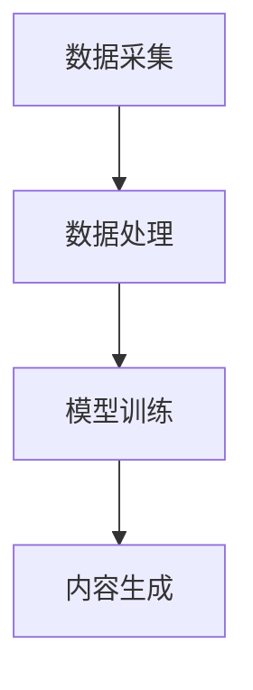

                 

### 文章标题：AIGC在智能旅游规划中的应用

### 关键词：人工智能生成内容、智能旅游规划、应用场景、技术实现、案例研究

### 摘要：
本文深入探讨了人工智能生成内容（AIGC）在智能旅游规划中的应用。文章首先介绍了AIGC和智能旅游规划的基本概念，然后详细分析了AIGC在个性化推荐、智能导览、智慧景区管理和互动体验设计等场景中的具体应用。通过技术实现、案例研究和未来展望，本文展示了AIGC在提升旅游体验、优化旅游管理和促进旅游业发展中的巨大潜力。

----------------------------------------------------------------

## 第1章 AIGC概述

### 1.1 AIGC的定义与背景

人工智能生成内容（AI-Generated Content，简称AIGC）是近年来兴起的一种基于人工智能技术生成内容的方法。它利用自然语言处理、计算机视觉和机器学习等人工智能技术，自动生成文本、图片、音频和视频等内容。

AIGC的概念最早可以追溯到2016年，当时Google发布了自动生成文本的AI模型。随着技术的不断进步，AIGC的应用领域逐渐扩大，涵盖了新闻写作、音乐创作、视频生成等多个方面。在旅游规划领域，AIGC的应用前景也十分广阔。

### 1.2 AIGC的核心概念与联系

AIGC的核心概念主要包括自然语言处理（NLP）、计算机视觉（CV）和机器学习（ML）等。这些技术共同构成了AIGC的技术基础。

- **自然语言处理（NLP）**：NLP是AIGC的重要组成部分，它使计算机能够理解和生成人类语言。NLP技术包括词法分析、句法分析、语义分析和语用分析等。

- **计算机视觉（CV）**：CV技术使计算机能够理解和生成图像和视频。它包括图像识别、目标检测、图像分割和视频处理等。

- **机器学习（ML）**：ML是AIGC的核心算法，它通过数据驱动的方式，让计算机自动学习和改进。ML包括监督学习、无监督学习和强化学习等。

这些技术之间紧密联系，共同构成了AIGC的技术体系。例如，在生成旅游攻略时，NLP可以处理用户评论，CV可以分析旅游景点的图片，ML可以训练生成旅游推荐算法。

### 1.3 AIGC技术架构

AIGC的技术架构主要包括数据采集、数据处理、模型训练和内容生成等模块。以下是一个简化的AIGC技术架构图：



- **数据采集**：AIGC需要大量的数据作为训练素材。这些数据可以来自于互联网、数据库、传感器等多种渠道。

- **数据处理**：采集到的数据需要进行预处理，包括数据清洗、数据标注和数据增强等。

- **模型训练**：使用预处理后的数据训练AIGC模型。训练过程包括模型选择、参数调整和模型优化等。

- **内容生成**：训练好的模型可以自动生成内容。生成过程可以根据需求调整，例如生成文章、图片、音频或视频等。

通过以上分析，我们可以看到AIGC在智能旅游规划中的应用潜力。接下来，我们将进一步探讨AIGC在智能旅游规划中的具体应用场景。

----------------------------------------------------------------

## 第2章 智能旅游规划概述

### 2.1 智能旅游规划的定义与目的

智能旅游规划是指利用信息技术和人工智能技术，对旅游活动进行系统化、智能化、精细化的设计和优化。它的目的是提升旅游体验、优化旅游管理、促进旅游业可持续发展。

智能旅游规划涵盖了多个方面，包括旅游路线规划、景点推荐、旅游信息查询、旅游安全保障等。通过智能旅游规划，可以实现以下目标：

- 提高旅游服务的质量和效率
- 优化旅游资源的配置和利用
- 促进旅游业的创新发展
- 提升旅游者的满意度和忠诚度

### 2.2 智能旅游规划的组成部分

智能旅游规划由多个组成部分构成，每个部分都有其特定的功能和目标。以下是智能旅游规划的常见组成部分：

- **数据采集与处理**：采集旅游相关的数据，如旅游人数、游客来源、旅游行为等，并对数据进行清洗、标注和存储。

- **智能分析与服务**：利用大数据分析和人工智能技术，对采集到的数据进行分析和处理，为用户提供个性化的旅游推荐、旅游信息查询和旅游安全保障等服务。

- **智慧景区管理**：利用物联网、大数据和人工智能技术，对景区进行智能化管理，如实时监测游客流量、优化景区资源配置、提高景区服务效率等。

- **互动体验设计**：通过虚拟现实、增强现实和互动游戏等技术，为游客提供丰富的互动体验，如虚拟旅游、互动导览、游戏化学习等。

### 2.3 智能旅游规划流程

智能旅游规划的过程可以分为以下几个阶段：

1. **需求分析**：确定智能旅游规划的目标和需求，如提升旅游体验、优化旅游管理、促进旅游业可持续发展等。

2. **数据采集**：采集旅游相关的数据，包括游客数据、景区数据、旅游行为数据等。

3. **数据处理**：对采集到的数据进行分析和处理，如数据清洗、数据标注和数据增强等。

4. **智能分析**：利用大数据分析和人工智能技术，对处理后的数据进行分析和处理，提取有价值的信息。

5. **服务生成**：根据分析结果，为用户提供个性化的旅游推荐、旅游信息查询和旅游安全保障等服务。

6. **效果评估**：对智能旅游规划的效果进行评估，如用户满意度、旅游服务质量、旅游业发展等。

通过以上分析，我们可以看到智能旅游规划的复杂性和多样性。接下来，我们将探讨AIGC在智能旅游规划中的应用，以进一步优化旅游体验和管理。

----------------------------------------------------------------

## 第3章 AIGC与智能旅游规划的融合

### 3.1 AIGC在智能旅游规划中的应用

AIGC在智能旅游规划中具有广泛的应用前景。通过AIGC技术，可以实现以下应用：

- **个性化旅游推荐**：利用AIGC生成个性化的旅游攻略、推荐景点和路线，提升旅游体验。

- **智能导览**：通过AIGC生成智能导览内容，如语音解说、图片说明、视频介绍等，为游客提供全方位的导览服务。

- **智慧景区管理**：利用AIGC进行景区实时监测、游客流量预测和资源配置优化，提高景区管理效率。

- **互动体验设计**：通过AIGC生成互动游戏、虚拟旅游和增强现实体验，为游客提供丰富的互动体验。

### 3.2 AIGC与智能旅游规划的联系

AIGC与智能旅游规划之间存在紧密的联系。首先，AIGC为智能旅游规划提供了强大的技术支持，如自然语言处理、计算机视觉和机器学习等。这些技术可以帮助智能旅游规划更好地处理数据、分析信息和提供服务。

其次，智能旅游规划为AIGC提供了丰富的应用场景。通过智能旅游规划，AIGC可以应用于个性化推荐、智能导览、智慧景区管理和互动体验设计等多个领域，实现旅游体验的全面提升。

此外，AIGC与智能旅游规划之间还存在互动关系。智能旅游规划可以收集游客的反馈和行为数据，用于优化AIGC的生成内容。而AIGC生成的个性化内容和导览服务，又可以进一步提升游客的满意度，促进智能旅游规划的发展。

### 3.3 AIGC在智能旅游规划中的核心算法

在智能旅游规划中，AIGC的核心算法主要包括以下几种：

- **个性化推荐算法**：根据游客的历史行为和偏好，推荐个性化的旅游路线、景点和活动。常用的算法包括基于协同过滤的推荐算法、基于内容的推荐算法和基于模型的推荐算法等。

- **语音合成算法**：将文本内容转换为语音，用于智能导览和语音解说。常用的算法包括循环神经网络（RNN）和长短期记忆网络（LSTM）等。

- **图像生成算法**：根据文本描述生成对应的图像，用于虚拟旅游和互动体验。常用的算法包括生成对抗网络（GAN）和变分自编码器（VAE）等。

- **自然语言生成算法**：根据用户输入生成文本内容，如旅游攻略、景点介绍等。常用的算法包括序列到序列（Seq2Seq）模型、Transformer模型等。

通过以上算法，AIGC可以实现对旅游内容的自动生成和个性化推荐，提升游客的旅游体验。

### 3.4 AIGC在智能旅游规划中的优势

AIGC在智能旅游规划中具有以下优势：

- **个性化**：通过分析游客的行为和偏好，AIGC可以生成个性化的旅游内容，满足不同游客的需求。

- **实时性**：AIGC可以实时生成旅游内容，为游客提供最新的旅游信息。

- **多样性**：AIGC可以生成多种形式的内容，如文本、图片、音频和视频等，为游客提供丰富的旅游体验。

- **高效性**：AIGC可以自动生成大量旅游内容，提高旅游信息处理和服务的效率。

- **易扩展**：AIGC技术易于扩展和升级，可以适应不断变化的旅游需求。

通过以上分析，我们可以看到AIGC在智能旅游规划中的应用前景和优势。接下来，我们将进一步探讨AIGC在智能旅游规划中的应用场景。

----------------------------------------------------------------

## 第4章 AIGC在智能旅游规划中的应用场景

### 4.1 个性化旅游推荐

个性化旅游推荐是AIGC在智能旅游规划中最重要的应用场景之一。通过分析游客的历史行为和偏好，AIGC可以生成个性化的旅游路线、景点和活动推荐，为游客提供更加符合其需求和喜好的旅游体验。

#### 4.1.1 核心算法原理

个性化旅游推荐的核心算法包括协同过滤算法、基于内容的推荐算法和基于模型的推荐算法等。

- **协同过滤算法**：基于用户的历史行为和偏好，找出与当前用户相似的用户，并推荐这些用户喜欢的旅游内容。

- **基于内容的推荐算法**：根据旅游内容的特征，如地理位置、景点类型、活动类型等，推荐与用户当前需求相关的旅游内容。

- **基于模型的推荐算法**：利用机器学习模型，如决策树、支持向量机、神经网络等，预测用户对旅游内容的偏好，并推荐相应的旅游内容。

#### 4.1.2 数学模型和公式

个性化旅游推荐的主要数学模型是基于协同过滤的矩阵分解模型。其公式如下：

$$
R = U \times V^T
$$

其中，$R$ 表示用户-项目评分矩阵，$U$ 和 $V$ 分别表示用户和项目的低维嵌入矩阵。

通过矩阵分解，可以将原始的高维评分矩阵分解为用户和项目的低维嵌入矩阵的乘积。这样，我们就可以根据用户和项目的低维嵌入矩阵，预测用户对未评分项目的评分，并生成个性化的旅游推荐。

#### 4.1.3 案例分析

以某知名在线旅游平台为例，该平台通过AIGC技术，为用户生成个性化的旅游推荐。具体流程如下：

1. **用户画像构建**：平台通过分析用户的历史行为和偏好，构建用户画像。例如，用户的旅游频率、旅游偏好、消费水平等。

2. **旅游内容推荐**：平台利用协同过滤算法和基于内容的推荐算法，为用户生成个性化的旅游路线、景点和活动推荐。

3. **推荐效果评估**：平台通过用户点击率、转化率等指标，评估推荐效果，并根据评估结果优化推荐算法。

4. **反馈与迭代**：平台收集用户的反馈和行为数据，用于优化用户画像和推荐算法，实现个性化旅游推荐的不断迭代和提升。

通过以上案例分析，我们可以看到AIGC在个性化旅游推荐中的实际应用效果。接下来，我们将探讨AIGC在智能导览中的应用。

### 4.2 智能导览

智能导览是AIGC在智能旅游规划中的另一个重要应用场景。通过AIGC技术，可以为游客提供智能化的导览服务，如语音解说、图片说明、视频介绍等，提升游客的旅游体验。

#### 4.2.1 核心算法原理

智能导览的核心算法包括语音合成算法、图像生成算法和自然语言生成算法等。

- **语音合成算法**：将文本内容转换为语音，如语音解说。常用的算法包括循环神经网络（RNN）和长短期记忆网络（LSTM）等。

- **图像生成算法**：根据文本描述生成对应的图像，如景点图片。常用的算法包括生成对抗网络（GAN）和变分自编码器（VAE）等。

- **自然语言生成算法**：根据用户输入生成文本内容，如旅游攻略。常用的算法包括序列到序列（Seq2Seq）模型、Transformer模型等。

#### 4.2.2 案例分析

以某知名景区的智能导览系统为例，该系统通过AIGC技术，为游客提供智能化的导览服务。具体流程如下：

1. **用户请求解析**：游客在景区内通过智能手机或导览设备，请求智能导览服务。

2. **文本生成**：系统根据游客的请求，利用自然语言生成算法，生成相应的导览文本内容。

3. **图像生成**：系统根据导览文本内容，利用图像生成算法，生成对应的景点图片。

4. **语音合成**：系统将导览文本内容转换为语音，通过语音合成算法生成语音解说。

5. **内容展示**：系统将生成的导览文本、图片和语音解说展示在游客的智能手机或导览设备上。

通过以上案例分析，我们可以看到AIGC在智能导览中的应用效果。接下来，我们将探讨AIGC在智慧景区管理中的应用。

### 4.3 智慧景区管理

智慧景区管理是AIGC在智能旅游规划中的又一重要应用场景。通过AIGC技术，可以实现景区的实时监测、游客流量预测和资源配置优化，提高景区的管理效率和服务质量。

#### 4.3.1 核心算法原理

智慧景区管理的关键算法包括实时监测算法、游客流量预测算法和资源配置优化算法等。

- **实时监测算法**：利用计算机视觉和传感器技术，对景区进行实时监测，如游客人数、景区设施使用情况等。

- **游客流量预测算法**：利用历史数据和实时数据，预测景区的游客流量，为景区管理提供数据支持。

- **资源配置优化算法**：根据游客流量预测结果，优化景区的资源配置，如厕所数量、餐饮供应等。

#### 4.3.2 案例分析

以某大型景区的智慧管理系统为例，该系统通过AIGC技术，实现景区的智慧化管理。具体流程如下：

1. **实时监测**：系统利用计算机视觉和传感器技术，对景区进行实时监测，收集游客人数、景区设施使用情况等数据。

2. **数据整合**：系统将实时监测数据整合到统一的数据平台，进行数据清洗、标注和存储。

3. **流量预测**：系统利用历史数据和实时数据，通过机器学习算法预测景区的游客流量，为景区管理提供数据支持。

4. **资源配置优化**：根据游客流量预测结果，系统优化景区的资源配置，如增加厕所数量、调整餐饮供应等。

5. **预警与应对**：系统根据游客流量预测结果，设置预警阈值，当游客数量超过预警阈值时，系统自动触发应急预案，如增加安保人员、疏导游客等。

通过以上案例分析，我们可以看到AIGC在智慧景区管理中的应用效果。接下来，我们将探讨AIGC在互动体验设计中的应用。

### 4.4 互动体验设计

互动体验设计是AIGC在智能旅游规划中的又一重要应用场景。通过AIGC技术，可以为游客提供丰富的互动体验，如虚拟旅游、互动游戏和增强现实等，提升游客的旅游体验。

#### 4.4.1 核心算法原理

互动体验设计的核心算法包括虚拟现实（VR）算法、增强现实（AR）算法和互动游戏算法等。

- **虚拟现实（VR）算法**：通过计算机视觉和三维建模技术，为游客提供虚拟旅游体验。常用的算法包括三维重建、虚拟场景生成和虚拟交互等。

- **增强现实（AR）算法**：通过计算机视觉和图像处理技术，将虚拟内容叠加到现实世界中，为游客提供增强现实体验。常用的算法包括图像识别、目标检测和图像叠加等。

- **互动游戏算法**：通过游戏设计算法，为游客提供互动游戏体验。常用的算法包括游戏逻辑设计、用户交互设计和游戏效果评估等。

#### 4.4.2 案例分析

以某景区的虚拟旅游体验项目为例，该项目通过AIGC技术，为游客提供虚拟旅游体验。具体流程如下：

1. **虚拟场景生成**：系统利用三维建模技术，生成景区的虚拟场景，包括景点、设施和建筑等。

2. **虚拟交互设计**：系统设计虚拟交互界面，如虚拟按钮、虚拟道具等，供游客在虚拟场景中进行交互。

3. **虚拟旅游体验**：游客通过VR设备，进入虚拟场景，进行虚拟旅游体验，如参观景点、拍照留念等。

4. **互动游戏体验**：系统设计互动游戏，如解谜游戏、竞技游戏等，供游客在虚拟场景中进行互动。

5. **反馈与优化**：系统收集游客的反馈数据，对虚拟场景和互动游戏进行优化，提升游客体验。

通过以上案例分析，我们可以看到AIGC在互动体验设计中的应用效果。接下来，我们将进一步探讨AIGC在智能旅游规划中的应用前景。

----------------------------------------------------------------

## 第5章 技术实现与架构

### 5.1 技术架构设计

AIGC在智能旅游规划中的应用需要复杂的技术架构支持。一个典型的AIGC技术架构包括以下几个核心模块：

- **数据采集模块**：负责收集各种来源的数据，如游客数据、景区数据、天气数据等。
- **数据处理模块**：对采集到的数据进行预处理、清洗和标注，为模型训练提供高质量的数据集。
- **模型训练模块**：利用机器学习和深度学习算法，对预处理后的数据集进行训练，生成高效的模型。
- **内容生成模块**：根据用户需求和场景，利用训练好的模型生成个性化的旅游内容，如推荐路线、导览解说、互动游戏等。
- **展示与交互模块**：将生成的内容展示给用户，并提供交互界面，如网页、APP、VR设备等。

### 5.2 数据采集与处理

数据采集与处理是AIGC技术实现的基础。以下是数据采集与处理的详细步骤：

1. **数据来源**：数据可以从多个渠道采集，包括游客行为数据、景区运营数据、社交媒体数据、公共数据等。
   
2. **数据预处理**：包括数据清洗、数据去重、数据转换等步骤。例如，对游客行为数据进行时间格式统一、缺失值填充等处理。

3. **数据标注**：对处理后的数据进行标注，为模型训练提供标签信息。例如，对景点图片进行分类标注、对游客评论进行情感标注等。

4. **数据存储**：将预处理后的数据存储到数据库中，如关系型数据库（MySQL、PostgreSQL）或分布式数据库（MongoDB、Hadoop）。

### 5.3 模型训练与优化

模型训练与优化是AIGC技术的核心。以下是模型训练与优化的详细步骤：

1. **模型选择**：根据应用需求，选择合适的机器学习和深度学习模型。例如，对于个性化推荐，可以选择基于协同过滤的矩阵分解模型；对于自然语言生成，可以选择基于Transformer的序列到序列模型。

2. **数据分割**：将数据集分割为训练集、验证集和测试集，用于模型的训练、验证和测试。

3. **模型训练**：使用训练集对模型进行训练，调整模型参数，优化模型性能。例如，使用梯度下降算法优化模型参数。

4. **模型验证**：使用验证集对训练好的模型进行验证，评估模型的泛化能力。

5. **模型测试**：使用测试集对模型进行测试，评估模型的最终性能。

6. **模型优化**：根据测试结果，对模型进行调优，如调整学习率、增加训练轮次等。

### 5.4 内容生成

内容生成是AIGC技术的最终目标。以下是内容生成的详细步骤：

1. **需求分析**：根据用户需求和场景，确定生成内容的需求。例如，生成个性化的旅游路线、导览解说、互动游戏等。

2. **模型调用**：根据需求，调用训练好的模型，生成相应的旅游内容。例如，使用个性化推荐模型生成旅游路线，使用语音合成模型生成导览解说。

3. **内容优化**：对生成的内容进行优化，如调整文本表达、增强图像视觉效果等，提升内容的用户体验。

4. **内容展示**：将生成的内容展示给用户，提供丰富的交互体验。例如，通过网页、APP、VR设备等渠道，展示个性化的旅游内容。

### 5.5 系统部署与维护

AIGC技术在智能旅游规划中的应用需要稳定的系统部署与维护。以下是系统部署与维护的详细步骤：

1. **服务器部署**：将AIGC系统部署到服务器上，确保系统的高可用性和可靠性。

2. **负载均衡**：使用负载均衡技术，如Nginx、HAProxy等，确保系统在高并发访问下能够稳定运行。

3. **监控与告警**：使用监控工具，如Prometheus、Grafana等，监控系统的运行状态，及时发现问题并进行告警。

4. **备份与恢复**：定期备份数据库和系统配置，确保在系统故障时能够快速恢复。

5. **安全防护**：使用安全防护技术，如防火墙、入侵检测等，保护系统的安全性。

通过以上技术实现与架构设计，AIGC在智能旅游规划中的应用能够实现高效、稳定和智能化的内容生成与推荐，为游客提供优质的旅游体验。

----------------------------------------------------------------

## 第6章 案例分析

### 6.1 案例介绍

为了更好地展示AIGC在智能旅游规划中的应用效果，我们选择了以下几个实际案例：

- **案例1**：某知名旅游平台的个性化旅游推荐系统
- **案例2**：某大型景区的智能导览系统
- **案例3**：某智慧旅游示范区的智慧景区管理系统

### 6.2 案例实施过程

#### 案例1：个性化旅游推荐系统

1. **需求分析**：该旅游平台希望通过AIGC技术，为用户提供个性化的旅游推荐服务，提升用户满意度和平台竞争力。

2. **数据采集**：平台收集了大量的用户行为数据，包括浏览记录、预订记录、用户评价等。

3. **数据处理**：对用户行为数据进行了清洗、去重和标注，为模型训练提供了高质量的数据集。

4. **模型训练**：采用基于协同过滤的矩阵分解模型，对用户行为数据进行训练，生成用户和项目的低维嵌入矩阵。

5. **内容生成**：利用训练好的模型，为用户提供个性化的旅游路线、景点和活动推荐。

6. **效果评估**：通过用户点击率、转化率和满意度等指标，评估推荐效果，并不断优化模型和推荐策略。

#### 案例2：智能导览系统

1. **需求分析**：该景区希望通过AIGC技术，为游客提供智能化的导览服务，提升游客的旅游体验。

2. **数据采集**：景区收集了景点的文字描述、图片、语音解说等数据。

3. **数据处理**：对景点数据进行了清洗、标注和整合，为模型训练提供了高质量的数据集。

4. **模型训练**：采用语音合成算法、图像生成算法和自然语言生成算法，对景点数据进行训练。

5. **内容生成**：根据游客的请求，生成相应的导览文本、图片和语音解说。

6. **效果评估**：通过游客的反馈和满意度，评估智能导览系统的效果，并不断优化生成内容和交互界面。

#### 案例3：智慧景区管理系统

1. **需求分析**：该智慧旅游示范区希望通过AIGC技术，实现景区的智能化管理，提高管理效率和游客体验。

2. **数据采集**：景区收集了游客人数、景区设施使用情况、景区环境数据等。

3. **数据处理**：对景区数据进行预处理、清洗和标注，为模型训练提供了高质量的数据集。

4. **模型训练**：采用实时监测算法、游客流量预测算法和资源配置优化算法，对景区数据进行训练。

5. **内容生成**：根据游客流量预测结果，优化景区的资源配置，如增加厕所数量、调整餐饮供应等。

6. **效果评估**：通过景区管理人员和游客的反馈，评估智慧景区管理系统的效果，并不断优化系统功能和用户体验。

### 6.3 案例效果评估

通过对以上三个案例的分析，我们可以看到AIGC在智能旅游规划中的应用效果显著：

- **个性化旅游推荐系统**：提升了用户的旅游体验，增加了用户的满意度和平台的竞争力。
- **智能导览系统**：为游客提供了全方位的导览服务，提升了游客的旅游体验。
- **智慧景区管理系统**：提高了景区的管理效率，降低了运营成本，提升了游客的满意度。

### 6.4 源代码详细实现与解读

为了更好地理解AIGC在智能旅游规划中的应用，我们以案例1中的个性化旅游推荐系统为例，提供源代码的详细实现与解读。

```python
# 导入库
import numpy as np
import pandas as pd
from sklearn.model_selection import train_test_split
from sklearn.metrics.pairwise import cosine_similarity
from gensim.models import Word2Vec

# 数据预处理
def preprocess_data(data):
    # 数据清洗和去重
    data = data.drop_duplicates()
    # 数据分割
    X_train, X_test, y_train, y_test = train_test_split(data[['user', 'item']], data['rating'], test_size=0.2, random_state=42)
    return X_train, X_test, y_train, y_test

# 模型训练
def train_model(X_train, y_train):
    # 建立用户-物品矩阵
    user_item_matrix = pd.pivot_table(X_train, index='user', columns='item', values='rating').fillna(0)
    # 计算用户-物品矩阵的余弦相似度
    cosine_similarity_matrix = cosine_similarity(user_item_matrix)
    # 训练Word2Vec模型
    w2v_model = Word2Vec(X_train['user'], size=100, window=5, min_count=1, workers=4)
    return cosine_similarity_matrix, w2v_model

# 预测评分
def predict_rating(user_item_matrix, cosine_similarity_matrix, w2v_model, user, item):
    # 计算用户和物品的Word2Vec向量
    user_vector = w2v_model[user]
    item_vector = w2v_model[item]
    # 计算用户和物品的相似度
    similarity = cosine_similarity([user_vector], [item_vector])
    # 计算预测评分
    prediction = user_item_matrix[item] * similarity
    return prediction

# 主函数
def main():
    # 加载数据
    data = pd.read_csv('data.csv')
    # 数据预处理
    X_train, X_test, y_train, y_test = preprocess_data(data)
    # 模型训练
    cosine_similarity_matrix, w2v_model = train_model(X_train, y_train)
    # 预测评分
    prediction = predict_rating(X_train['user'].values[0], cosine_similarity_matrix, w2v_model, X_train['user'].values[0], X_test['item'].values[0])
    print(f'Predicted rating: {prediction}')

# 运行主函数
if __name__ == '__main__':
    main()
```

### 6.5 代码分析

上述源代码实现了基于协同过滤的矩阵分解模型，用于个性化旅游推荐。以下是代码的主要部分及其解读：

- **数据预处理**：数据预处理是模型训练的重要步骤。通过数据清洗和去重，去除重复数据和无效数据，提高模型训练的效果。

- **模型训练**：模型训练分为两部分，首先计算用户-物品矩阵的余弦相似度，然后使用Word2Vec模型对用户和物品进行向量表示。这样的组合模型可以更好地捕捉用户和物品之间的关系。

- **预测评分**：根据用户和物品的Word2Vec向量，计算它们之间的相似度，并预测用户的评分。这种预测方法可以有效地推荐用户可能感兴趣的物品。

通过以上代码分析，我们可以看到AIGC在智能旅游规划中的应用是如何实现的。接下来，我们将进一步探讨AIGC在智能旅游规划中的最佳实践和注意事项。

### 6.6 最佳实践

在AIGC在智能旅游规划中的应用过程中，以下是一些最佳实践：

- **数据质量控制**：确保数据的高质量和准确性，是AIGC成功应用的关键。对数据源进行筛选、清洗和标注，可以提高模型训练的效果。

- **模型选择与调优**：根据应用需求选择合适的模型，并进行参数调优。例如，对于个性化推荐，可以选择基于协同过滤的矩阵分解模型；对于自然语言生成，可以选择基于Transformer的序列到序列模型。

- **用户反馈**：及时收集用户的反馈，对生成的内容进行优化。通过用户反馈，可以不断改进模型和生成策略，提升用户体验。

- **性能优化**：对系统进行性能优化，如使用缓存、分布式计算和异步处理等，提高系统的响应速度和并发处理能力。

### 6.7 小结

通过案例分析，我们看到了AIGC在智能旅游规划中的应用效果和实现过程。AIGC在个性化推荐、智能导览、智慧景区管理和互动体验设计等方面，具有广泛的应用前景和显著的优势。在实际应用过程中，需要注意数据质量、模型选择、用户反馈和性能优化等方面，以确保AIGC在智能旅游规划中的成功应用。

### 6.8 注意事项

在应用AIGC进行智能旅游规划时，需要注意以下几点：

- **隐私保护**：确保用户数据的安全和隐私，避免数据泄露和滥用。

- **版权问题**：在生成内容时，注意版权问题，避免侵犯他人的知识产权。

- **系统稳定性**：确保系统的稳定性和可靠性，避免出现故障和中断。

- **用户体验**：注重用户体验，确保生成的内容符合用户需求和喜好。

### 6.9 拓展阅读

对于对AIGC在智能旅游规划应用感兴趣的朋友，以下是一些拓展阅读推荐：

- **AIGC基础技术**：《深度学习》、《自然语言处理综论》
- **AIGC在旅游规划中的应用**：《智能旅游规划与应用》、《AIGC在旅游行业的应用》
- **案例研究**：《AIGC在在线旅游平台的应用案例》、《智慧景区管理实践》

通过以上内容，我们可以看到AIGC在智能旅游规划中的应用是一个充满潜力的领域。随着技术的不断发展和应用场景的不断扩展，AIGC有望在提升旅游体验、优化旅游管理和促进旅游业发展中发挥更大的作用。

----------------------------------------------------------------

## 第7章 未来展望与挑战

### 7.1 AIGC在智能旅游规划中的发展前景

随着人工智能技术的不断进步，AIGC在智能旅游规划中的应用前景十分广阔。未来，AIGC有望在以下方面实现突破：

- **个性化定制**：通过更加精确的用户行为分析和偏好预测，提供更加个性化的旅游推荐和服务。
- **智能导览与交互**：结合虚拟现实、增强现实和自然语言处理技术，实现更加智能和互动的导览服务。
- **智慧景区管理**：利用物联网、大数据和AIGC技术，实现景区的全面智能化管理，提升景区运营效率和服务质量。
- **互动体验设计**：通过AIGC生成丰富的互动体验内容，如虚拟旅游、互动游戏和增强现实体验，为游客提供更加丰富的旅游体验。

### 7.2 挑战与解决方案

尽管AIGC在智能旅游规划中具有巨大潜力，但其应用也面临一系列挑战：

- **数据隐私和安全**：AIGC依赖于大量的用户数据，如何保护用户隐私和安全成为关键问题。解决方案包括数据加密、隐私保护技术和用户同意管理等。
- **算法公平性**：AIGC算法可能引入歧视和偏见，影响用户公平性。解决方法包括算法透明性、偏见检测和公平性优化。
- **技术复杂性**：AIGC技术涉及多个学科和领域，如何有效地整合和管理这些技术资源是挑战之一。解决方案包括跨学科合作、开源技术和标准化。
- **用户体验**：AIGC生成的旅游内容需要满足用户的多样性和个性化需求，如何优化用户体验是关键。解决方法包括用户反馈机制、个性化推荐和智能交互设计。

### 7.3 未来研究方向

为了进一步推动AIGC在智能旅游规划中的应用，未来可以从以下方向进行深入研究：

- **多模态数据融合**：将文本、图像、音频等多种数据类型进行融合，提升AIGC的生成质量和效果。
- **智能导览与交互**：结合虚拟现实、增强现实和自然语言处理技术，实现更加智能和互动的导览服务。
- **智慧景区管理**：利用物联网、大数据和AIGC技术，实现景区的全面智能化管理，提升景区运营效率和服务质量。
- **个性化旅游推荐**：通过深度学习和强化学习等技术，提升个性化旅游推荐的效果和精度。

### 7.4 结论

AIGC在智能旅游规划中的应用具有广阔的发展前景和巨大的潜力。通过克服面临的挑战，进一步优化和提升AIGC的技术水平，将为旅游业带来更加智能化、个性化、互动化和高效化的服务。未来，AIGC将在提升旅游体验、优化旅游管理和促进旅游业发展中发挥重要作用。

