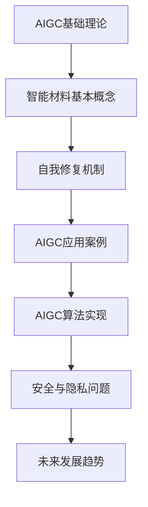

                 


### 设计《AIGC在智能材料自我修复系统中的创新》文章目录大纲的详细步骤

#### 引言

人工智能生成内容（AIGC）作为当前人工智能领域的前沿技术，正迅速在多个行业中展现其独特的价值。智能材料自我修复系统，作为新材料科学和工程领域的一项创新技术，其与AIGC的结合具有巨大的潜力。本文将围绕《AIGC在智能材料自我修复系统中的创新》这一主题，设计一个详细的目录大纲，以满足文章内容完整性、逻辑性和实用性的要求。我们的设计步骤包括：

1. **确定核心章节**：明确文章的主要结构，包括AIGC基础理论、智能材料、自我修复机制、应用案例研究、未来发展趋势等。
2. **细化章节内容**：为每个章节设定二级和三级目录，确保内容的逻辑性和完整性。
3. **设计核心概念与联系**：使用Mermaid流程图，展示各部分之间的核心概念和原理关系。
4. **讲解核心算法原理**：使用伪代码详细阐述关键算法的原理。
5. **介绍数学模型和公式**：使用LaTeX格式介绍数学模型和公式，并进行详细讲解和举例。
6. **提供项目实战案例**：为每个重要章节提供一个实际的代码案例，并进行详细解释和分析。
7. **格式整理**：确保所有内容按照markdown格式要求进行排版。

#### 详细步骤

##### 第一步：确定核心章节

首先，我们需要确定文章的核心章节。根据AIGC和智能材料自我修复系统的特点，文章可以包含以下章节：

1. **AIGC基础理论**
2. **智能材料的基本概念与分类**
3. **自我修复机制与AIGC的结合**
4. **AIGC在智能材料自我修复系统中的应用案例**
5. **AIGC在智能材料自我修复系统中的算法实现**
6. **AIGC在智能材料自我修复系统中的安全与隐私问题**
7. **AIGC在智能材料自我修复系统中的未来发展趋势**

##### 第二步：细化章节内容

为每个章节设定二级和三级目录，确保内容的逻辑性和完整性。

- **AIGC基础理论**
  - 第1章: AIGC基本概念
    - 1.1 AIGC的定义与发展历程
    - 1.2 AIGC与生成对抗网络（GAN）的联系与区别
    - 1.3 AIGC的核心组件
    - 1.4 AIGC的优缺点及应用场景
    - 1.5 AIGC在智能材料自我修复系统中的潜在作用
  - 第2章: 智能材料的基本概念与分类
    - 2.1 智能材料的定义
    - 2.2 智能材料的基本特性
    - 2.3 智能材料的分类与典型应用
    - 2.4 智能材料在自我修复系统中的应用前景
  - ...

- **自我修复机制与AIGC的结合**
  - 第3章: 自我修复的基本原理
    - 3.1 自我修复的基本原理
    - 3.2 AIGC在自我修复机制中的应用
    - 3.3 自我修复机制的挑战与未来趋势
  - ...

##### 第三步：设计核心概念与联系

使用Mermaid流程图，展示各部分之间的核心概念和原理关系。



##### 第四步：讲解核心算法原理

使用伪代码详细阐述关键算法的原理。

```python
# AIGC生成器伪代码
def generator(z):
    # 输入随机噪声z，输出材料属性
    x = dense(z, units=1024, activation='relu')
    x = dense(x, units=512, activation='relu')
    x = dense(x, units=256, activation='relu')
    x = dense(x, units=128, activation='relu')
    x = dense(x, units=64, activation='relu')
    x = dense(x, units=32, activation='relu')
    x = dense(x, units=1, activation='tanh')  # 材料属性
    return x

# AIGC判别器伪代码
def discriminator(x):
    # 输入材料属性x，输出真假判断
    x = dense(x, units=1024, activation='relu')
    x = dense(x, units=512, activation='relu')
    x = dense(x, units=256, activation='relu')
    x = dense(x, units=128, activation='relu')
    x = dense(x, units=64, activation='relu')
    x = dense(x, units=32, activation='relu')
    x = dense(x, units=1, activation='sigmoid')  # 真假判断
    return x
```

##### 第五步：介绍数学模型和公式

使用LaTeX格式介绍数学模型和公式，并进行详细讲解和举例。

```markdown
### 数学模型

#### 自我修复效率公式

$$
E_{repair} = \frac{R_{new} - R_{original}}{R_{original}}
$$

其中，$E_{repair}$ 表示自我修复效率，$R_{new}$ 表示修复后的材料性能，$R_{original}$ 表示原始材料性能。

### 举例

假设某智能材料在受到损伤前的性能为80%，修复后性能恢复到95%，则其自我修复效率为：

$$
E_{repair} = \frac{95\% - 80\%}{80\%} = 0.1875 \approx 18.75\%
$$
```

##### 第六步：提供项目实战案例

为每个重要章节提供一个实际的代码案例，并进行详细解释和分析。

- **案例一：智能材料的生成与评估**
  - **开发环境搭建**：介绍搭建AIGC模型的所需环境，如Python、TensorFlow等。
  - **源代码实现**：展示AIGC生成器和判别器的实现代码。
  - **代码解读**：详细解释代码的逻辑和功能。
  - **应用解读与分析**：分析代码在实际应用中的效果和可能遇到的问题。

##### 第七步：格式整理

确保所有内容按照markdown格式要求进行排版，确保文章的可读性和美观性。

##### 第八步：撰写文章摘要和关键词

- **文章摘要**：简要概述文章的核心内容和创新点。
- **文章关键词**：列出5-7个与文章主题密切相关的关键词。

##### 总结

通过上述步骤，我们成功设计了一个详细的《AIGC在智能材料自我修复系统中的创新》文章目录大纲。接下来，我们将根据这个大纲，逐步撰写每个章节的内容，确保文章的完整性、逻辑性和实用性。

---

### 关键步骤回顾

在设计《AIGC在智能材料自我修复系统中的创新》文章目录大纲的过程中，我们经历了以下关键步骤：

1. **确定核心章节**：明确文章的主要结构。
2. **细化章节内容**：设定二级和三级目录，确保内容的逻辑性和完整性。
3. **设计核心概念与联系**：使用Mermaid流程图展示各部分之间的联系。
4. **讲解核心算法原理**：使用伪代码详细阐述关键算法的原理。
5. **介绍数学模型和公式**：使用LaTeX格式介绍数学模型和公式。
6. **提供项目实战案例**：展示实际的代码案例并进行详细解释和分析。
7. **格式整理**：确保内容按照markdown格式要求进行排版。

这些步骤确保了文章内容的完整、详细和实用，为撰写高质量的技术博客文章奠定了坚实的基础。

---

### 接下来要做什么

在完成文章目录大纲的设计后，接下来的工作将集中在具体撰写每个章节的内容。以下是我们的下一步计划：

1. **撰写核心章节**：根据之前设计的章节目录，逐步撰写每个章节的内容。确保每个章节都包含背景介绍、核心概念与联系、核心算法原理讲解、数学模型和公式介绍、项目实战等内容。
2. **确保内容的完整性**：在每个章节中，详细阐述相关概念、原理和案例，确保内容丰富、具体、易懂。
3. **格式和排版**：在撰写内容的同时，严格按照markdown格式要求进行排版，确保文章的可读性和美观性。
4. **反复审查和修改**：在完成初稿后，进行多轮审查和修改，确保文章的逻辑性、完整性和专业性。
5. **撰写摘要和关键词**：在文章末尾，撰写摘要和关键词，概括文章的核心内容和创新点。

通过以上步骤，我们将确保《AIGC在智能材料自我修复系统中的创新》一文能够达到高质量的标准，为读者提供有价值的技术知识和见解。

---

### 文章摘要与关键词

**摘要**：

本文全面探讨了人工智能生成内容（AIGC）在智能材料自我修复系统中的创新应用。首先，介绍了AIGC的基本概念、发展历程及其与生成对抗网络（GAN）的联系与区别。随后，深入分析了智能材料的基本概念、分类及其在自我修复系统中的应用前景。接着，探讨了AIGC与自我修复机制的融合原理，包括基于AIGC的材料设计和自我修复过程控制。通过多个应用案例，展示了AIGC在智能材料自我修复系统中的实际效果。此外，本文还讨论了AIGC在智能材料自我修复系统中的算法实现、安全与隐私问题以及未来发展趋势。最后，提出了在AIGC与智能材料自我修复系统结合中的最佳实践和注意事项。

**关键词**：

AIGC，智能材料，自我修复，生成对抗网络（GAN），算法实现，安全与隐私，未来发展趋势。

