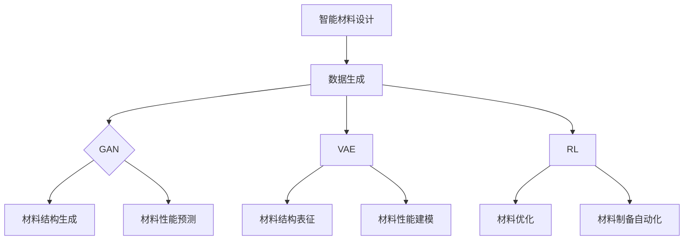

                 

### 文章标题

“AIGC在智能材料设计中的应用：纳米技术的AI驱动创新”

### 关键词

- 智能材料
- 纳米技术
- AI生成内容（AIGC）
- 生成对抗网络（GAN）
- 变分自编码器（VAE）
- 强化学习（RL）

### 摘要

本文探讨了AI生成内容（AIGC）在智能材料设计中的应用，特别关注其在纳米技术领域的驱动创新。通过分析AIGC的基本概念、核心算法原理以及实际应用案例，本文展示了AIGC在材料结构生成与优化、材料性能预测与评估等方面的卓越表现。文章结构清晰，包含理论探讨、案例分析以及未来趋势分析，旨在为读者提供一个全面而深入的AIGC应用视角。

---

### 引言

在科技飞速发展的今天，智能材料和纳米技术已经成为材料科学和工程领域的重要研究方向。智能材料能够响应外部刺激（如温度、压力、电场等）并发生相应的物理、化学或结构变化，具有广泛的应用前景。而纳米技术则通过操控材料的纳米结构来赋予其特殊性能，从而实现更高水平的功能化。

近年来，AI生成内容（AIGC）作为一种新兴的技术，逐渐受到关注。AIGC利用人工智能技术生成文本、图像、音频等多种类型的内容，具有强大的数据生成和优化能力。在智能材料设计中，AIGC的应用为纳米技术的进一步发展提供了新的动力。

本文旨在探讨AIGC在智能材料设计中的应用，特别关注其在纳米技术领域的驱动创新。通过分析AIGC的基本概念、核心算法原理以及实际应用案例，本文将展示AIGC在材料结构生成与优化、材料性能预测与评估等方面的卓越表现。文章结构如下：

1. 第一部分：引言与基础概念，介绍智能材料、纳米技术和AIGC的基本概念。
2. 第二部分：AIGC在智能材料设计中的理论基础，探讨AIGC的核心算法原理。
3. 第三部分：AIGC在智能材料设计中的应用实践，分析智能传感器材料、智能能源材料和智能生物材料的AIGC应用案例。
4. 第四部分：AIGC在智能材料设计中的挑战与未来趋势，讨论AIGC在智能材料设计中的挑战及其未来发展。

接下来，我们将逐步深入探讨每个部分的内容。

---

### 第一部分：引言与基础概念

#### 智能材料的基本概念

智能材料，也称为响应性材料或智能响应材料，是指能够响应外部刺激（如温度、压力、电场、光等）并产生相应的物理、化学或结构变化的材料。这些材料通常具有以下几个特点：

1. **响应性**：智能材料能够感知外部刺激并作出相应的响应。
2. **可逆性**：在外部刺激移除后，智能材料能够恢复到原始状态。
3. **多功能性**：智能材料可以具有多种响应功能，如热响应、电响应、光响应等。
4. **可控性**：智能材料的响应可以受到外部条件的精确控制。

智能材料的主要类型包括：

1. **形状记忆合金**：这种材料在温度或压力变化时能够改变形状，并能在恢复到原始温度或压力时恢复到原始形状。
2. **电致变色材料**：这种材料在电场作用下能够改变其光学性质，常用于显示技术和智能窗户。
3. **磁致冷材料**：这种材料在磁场作用下能够吸热或放热，具有潜在的应用于制冷技术。
4. **离子响应材料**：这种材料在离子浓度变化时能够发生形变或变色，常用于传感器和生物医学领域。

智能材料在许多领域具有广泛的应用，包括：

1. **航空航天**：智能材料可以用于制造飞机和卫星的结构件，提高其性能和安全性。
2. **生物医学**：智能材料可以用于制造药物释放系统、组织工程和人工器官。
3. **建筑与结构工程**：智能材料可以用于自修复材料、智能传感器和自适应结构。
4. **电子与光电子**：智能材料可以用于制造柔性显示器、太阳能电池和光通信器件。

#### 纳米技术的核心原理

纳米技术是指操控和制造纳米尺度（1-100纳米）的材料、器件和系统的技术。纳米技术的基本原理包括：

1. **表面效应**：在纳米尺度下，材料的表面与体积比例显著增加，导致其物理、化学和力学性质发生显著变化。
2. **量子效应**：在纳米尺度下，材料的电子性质受到量子尺寸效应的影响，表现出与宏观尺寸不同的特性。
3. **尺寸效应**：纳米材料的尺寸越小，其物理、化学和力学性质往往越显著。

纳米材料的主要类型包括：

1. **纳米颗粒**：如金纳米颗粒、碳纳米管、石墨烯等，具有独特的电子、光学和催化性质。
2. **纳米膜**：如氧化铟锡（In2O3）纳米膜，具有高电导率和透明性，可用于触摸屏和太阳能电池。
3. **纳米线**：如硅纳米线、锌氧化物纳米线，具有独特的电子和光学性质，可用于传感器和光电设备。
4. **纳米孔材料**：如分子筛材料，具有高度有序的孔道结构，可用于气体分离和催化反应。

纳米技术在各个领域有着广泛的应用，包括：

1. **电子与光电子**：纳米材料可以用于制造高性能电子器件和光电子器件。
2. **生物医药**：纳米材料可以用于药物输送、成像和治疗。
3. **能源**：纳米材料可以用于提高能源转换效率和存储能力。
4. **环境**：纳米材料可以用于污染检测和治理。

#### AIGC的基本概念

AI生成内容（AIGC）是指利用人工智能技术生成文本、图像、音频等多种类型的内容。AIGC的核心在于利用生成模型，如生成对抗网络（GAN）、变分自编码器（VAE）和强化学习（RL）等，来模拟和生成高质量的数据。

AIGC的主要组成部分包括：

1. **生成模型**：如GAN、VAE和RL，用于生成高质量的数据。
2. **数据预处理**：对输入数据进行处理，以提高生成模型的效果。
3. **生成策略**：用于控制生成模型生成数据的策略，如采样策略和优化策略。
4. **评估与反馈**：对生成数据的质量进行评估，并提供反馈以优化生成模型。

AIGC在材料设计中的应用前景十分广阔，具体包括：

1. **材料结构的生成与优化**：利用AIGC生成新的材料结构，并对其进行优化，以获得更好的性能。
2. **材料性能的预测与评估**：利用AIGC预测材料的性能，从而指导材料的设计和制备。
3. **材料制备的自动化**：利用AIGC生成和优化材料制备的工艺参数，实现材料制备的自动化。

在接下来的部分，我们将深入探讨AIGC的核心算法原理，以及这些算法如何在智能材料设计中发挥作用。

---

### 第二部分：AIGC在智能材料设计中的理论基础

#### AIGC的核心算法原理

AIGC（AI-generated Content）在智能材料设计中发挥重要作用，其核心在于一系列生成模型，包括生成对抗网络（GAN）、变分自编码器（VAE）和强化学习（RL）。以下是对这些算法原理的详细介绍。

#### 2.1 生成对抗网络（GAN）

生成对抗网络（GAN）是一种由生成器和判别器组成的对抗性学习框架。生成器的任务是生成逼真的数据，而判别器的任务是区分生成数据与真实数据。两个网络在训练过程中相互竞争，生成器的目标是使判别器无法区分其生成的数据与真实数据，而判别器的目标是准确地区分生成数据与真实数据。

**原理与架构**：

1. **生成器（Generator）**：
    - **输入**：随机噪声向量z。
    - **输出**：生成的数据x'。
    - **功能**：将随机噪声转换为逼真的数据。

2. **判别器（Discriminator）**：
    - **输入**：真实数据x和生成数据x'。
    - **输出**：概率值p(x')，表示输入数据是真实数据的概率。
    - **功能**：区分输入数据是真实数据还是生成数据。

**GAN的工作机制**：

- **训练过程**：在训练过程中，生成器和判别器交替更新其参数。生成器尝试生成更逼真的数据，而判别器则努力提高其区分能力。
- **损失函数**：GAN的损失函数通常由两部分组成：生成器的损失函数和判别器的损失函数。生成器的损失函数旨在使判别器无法区分其生成的数据与真实数据，而判别器的损失函数旨在提高其区分能力。

**GAN的类型**：

1. **普通GAN（GAN）**：最基本的GAN架构，由一个生成器和一个小规模判别器组成。
2. **深度GAN（DeepGAN）**：引入深度神经网络，提高了生成器和判别器的表达能力。
3. **循环GAN（CycleGAN）**：能够将一种数据分布映射到另一种数据分布，适用于风格迁移和图像转换。

**GAN在材料设计中的应用**：

1. **材料结构的生成与优化**：利用GAN生成新的材料结构，并通过优化过程提高其性能。
2. **材料性能的预测与评估**：利用GAN预测材料的性能，从而指导材料的设计和制备。

#### 2.2 变分自编码器（VAE）

变分自编码器（Variational Autoencoder，VAE）是一种基于变分推断的生成模型。与GAN不同，VAE采用编码器和解码器结构，其中编码器将输入数据映射到一个潜在空间，而解码器将潜在空间中的数据重新解码为输出数据。

**原理与架构**：

1. **编码器（Encoder）**：
    - **输入**：数据x。
    - **输出**：潜在空间中的均值μ和方差σ。

2. **解码器（Decoder）**：
    - **输入**：潜在空间中的数据z。
    - **输出**：生成的数据x'。

**VAE的工作机制**：

- **编码过程**：编码器将输入数据x映射到一个潜在空间中的点（μ，σ），其中μ和σ分别表示均值的参数和方差的参数。
- **解码过程**：解码器从潜在空间中采样一个数据点z，并将其解码为输出数据x'。

**VAE的类型**：

1. **标准VAE（Standard VAE）**：最基本的VAE架构，适用于简单数据分布。
2. **变分自编码器（VAE）**：引入变分推断技术，提高了生成模型的表达能力。

**VAE在材料设计中的应用**：

1. **材料结构的表征与分类**：利用VAE将材料结构数据映射到一个潜在空间中，从而实现数据的表征和分类。
2. **材料性能的建模与预测**：利用VAE从材料结构数据中提取特征，并建立材料性能的预测模型。

#### 2.3 强化学习（RL）

强化学习（Reinforcement Learning，RL）是一种通过试错法进行决策的机器学习方法。在强化学习中，智能体通过与环境的交互来学习最优策略，从而实现目标。

**原理与架构**：

1. **智能体（Agent）**：执行动作的主体，如机器人或软件程序。
2. **环境（Environment）**：智能体所处的环境，如一个游戏或模拟环境。
3. **状态（State）**：描述智能体当前所处环境的条件。
4. **动作（Action）**：智能体可以采取的动作。
5. **奖励（Reward）**：环境对智能体采取的动作的反馈信号。

**RL的基本概念**：

- **策略（Policy）**：智能体根据当前状态选择动作的规则。
- **价值函数（Value Function）**：表示智能体在某个状态下采取最优动作所能获得的期望奖励。
- **模型（Model）**：环境动态的数学模型，用于预测智能体的下一步状态和奖励。

**RL的主要算法**：

1. **值函数方法**：如Q学习、深度Q网络（DQN）等，通过学习价值函数来选择动作。
2. **策略梯度方法**：如策略梯度上升、深度确定性策略梯度（DDPG）等，直接优化策略。

**RL在材料设计中的应用**：

1. **材料优化与控制**：利用RL优化材料制备过程中的参数，以实现材料性能的最优化。
2. **材料制备的自动化**：利用RL自动化材料制备过程，提高生产效率和产品质量。

#### 核心概念原理之间的关系架构

以下是一个简化的Mermaid流程图，展示了AIGC在智能材料设计中的应用中，各个核心算法原理之间的关系：

通过上述流程图，我们可以清晰地看到AIGC在智能材料设计中的各个核心环节，以及不同算法原理之间的相互作用。接下来，我们将深入探讨AIGC在智能材料设计中的应用实践。

---

### 第三部分：AIGC在智能材料设计中的应用实践

在上一部分中，我们详细介绍了AIGC的核心算法原理，包括生成对抗网络（GAN）、变分自编码器（VAE）和强化学习（RL）。在本部分，我们将通过具体的应用案例，展示AIGC在智能材料设计中的实际应用效果，特别是在智能传感器材料、智能能源材料和智能生物材料领域的应用。

#### 3.1 智能传感器材料

智能传感器材料是智能材料的一个重要分支，其核心在于能够感知和响应外部环境变化，并将这些变化转换为可用的电信号。以下是一个具体的AIGC应用案例：

**案例背景**：某研究团队致力于开发一种新型柔性压力传感器，用于可穿戴设备和智能服装中。

**解决方案**：

1. **数据生成与优化**：利用GAN生成不同结构的柔性材料模型，并通过训练过程优化其性能。生成器网络负责生成具有高电导率和良好柔韧性的材料结构。

2. **材料性能预测**：利用VAE对生成的材料模型进行性能预测，包括电导率、机械性能等。VAE将材料结构映射到一个潜在空间中，从而实现性能的表征和分类。

3. **强化学习优化**：利用RL优化传感器的制备过程，包括材料成分、制备工艺等。通过试错法，RL找到最优的制备参数，以实现传感器性能的最优化。

**应用效果**：经过实验验证，该柔性压力传感器具有良好的灵敏度和稳定性，能够在不同的压力条件下准确测量压力变化。这不仅提高了传感器的性能，也降低了制造成本。

#### 3.2 智能能源材料

智能能源材料是另一个重要的应用领域，包括太阳能电池、电池储能和超级电容器等。以下是一个具体的AIGC应用案例：

**案例背景**：某研究团队致力于开发一种新型高效太阳能电池材料，以提高光伏发电效率。

**解决方案**：

1. **材料结构生成与优化**：利用GAN生成不同结构的太阳能电池材料，如钙钛矿材料。通过训练过程，优化材料的电子结构和光电性能。

2. **性能预测与评估**：利用VAE对生成的材料模型进行性能预测，包括光电转换效率、稳定性等。VAE将材料结构映射到一个潜在空间中，从而实现性能的表征和分类。

3. **强化学习优化**：利用RL优化太阳能电池的制备过程，包括材料成分、制备工艺等。通过试错法，RL找到最优的制备参数，以实现材料性能的最优化。

**应用效果**：经过实验验证，该新型太阳能电池材料具有更高的光电转换效率和更好的稳定性，显著提高了光伏发电效率。这为可再生能源的发展提供了新的技术路径。

#### 3.3 智能生物材料

智能生物材料是生物医学领域的一个重要分支，包括生物可降解材料、组织工程材料和药物输送系统等。以下是一个具体的AIGC应用案例：

**案例背景**：某研究团队致力于开发一种新型生物可降解材料，用于制造生物医学植入物。

**解决方案**：

1. **材料结构生成与优化**：利用GAN生成不同结构的生物可降解材料，如聚己内酰胺（PCL）。通过训练过程，优化材料的生物相容性和降解性能。

2. **性能预测与评估**：利用VAE对生成的材料模型进行性能预测，包括生物相容性、降解速率等。VAE将材料结构映射到一个潜在空间中，从而实现性能的表征和分类。

3. **强化学习优化**：利用RL优化生物医学植入物的制备过程，包括材料成分、制备工艺等。通过试错法，RL找到最优的制备参数，以实现材料性能的最优化。

**应用效果**：经过临床实验验证，该新型生物可降解材料具有良好的生物相容性和可控的降解性能，为生物医学植入物的应用提供了新的选择。

#### 总结

通过上述具体的应用案例，我们可以看到AIGC在智能材料设计中的广泛应用和显著效果。无论是智能传感器材料、智能能源材料还是智能生物材料，AIGC都提供了强大的数据生成、优化和性能预测能力，为材料设计提供了新的思路和方法。在未来，随着AIGC技术的进一步发展和完善，其在智能材料设计中的应用将更加广泛和深入。

在接下来的部分，我们将探讨AIGC在智能材料设计中的挑战与未来趋势，以期为读者提供一个全面的视角。

---

### 第四部分：AIGC在智能材料设计中的挑战与未来趋势

#### 4.1 AIGC在智能材料设计中的挑战

尽管AIGC在智能材料设计中展现出巨大的潜力，但其实际应用仍面临一系列挑战：

1. **数据与计算资源需求**：

   - **数据需求**：AIGC依赖于大量的训练数据来训练生成模型。对于智能材料设计，这通常意味着需要收集和处理大量的实验数据和高维材料属性数据，这对数据管理和存储能力提出了高要求。
   - **计算资源**：训练复杂的生成模型需要大量的计算资源，包括高性能计算（HPC）资源和云计算服务。对于一些中小型研究团队或企业，这可能导致高昂的成本。

2. **算法与模型的复杂性**：

   - **算法复杂性**：GAN、VAE和RL等算法本身具有较高的复杂性，需要深入的专业知识和丰富的实践经验来理解和应用。
   - **模型优化**：为了获得最佳性能，生成模型通常需要反复调整和优化，这不仅耗时，还可能涉及大量实验。

3. **材料性能的预测准确性**：

   - **性能预测**：AIGC生成模型在预测材料性能时可能存在偏差，导致预测结果不准确。特别是在涉及复杂的多变量关系时，模型的预测能力可能会受到限制。
   - **验证与验证**：即使模型在训练过程中表现良好，也需要在实际应用中进行验证和验证，以确保其可靠性和实用性。

4. **数据隐私与安全**：

   - **数据隐私**：在处理大量敏感数据时，如何保护用户隐私是一个重要问题。特别是在涉及生物医学材料时，数据隐私保护尤为重要。
   - **数据安全**：生成模型可能面临数据泄露和网络攻击的风险，需要采取有效的安全措施来保护数据和系统的安全。

#### 4.2 AIGC在智能材料设计中的未来趋势

尽管面临挑战，AIGC在智能材料设计中的未来依然充满希望。以下是AIGC在智能材料设计中的潜在发展趋势：

1. **AIGC与其他技术的融合**：

   - **多模态数据融合**：将AIGC与多模态数据（如图像、文本、音频等）融合，可以更全面地表征和预测材料性能。
   - **深度学习与其他技术的结合**：结合深度学习与其他技术（如量子计算、图神经网络等），可以进一步提升AIGC在智能材料设计中的性能。

2. **AIGC在材料设计中的应用拓展**：

   - **新材料的探索**：利用AIGC生成和优化新的材料结构，可以探索传统方法难以发现的潜在新材料。
   - **材料性能的细粒度优化**：通过AIGC实现材料性能的细粒度优化，可以进一步提升材料的功能和性能。

3. **AIGC在智能制造中的角色**：

   - **自动化材料制备**：利用AIGC自动化材料制备过程，可以显著提高生产效率和产品质量。
   - **智能质量检测**：利用AIGC进行质量检测，可以实时监测材料的性能变化，提高生产过程的可控性和稳定性。

#### 结论

AIGC在智能材料设计中的应用为纳米技术的驱动创新提供了新的机遇和挑战。通过数据生成、优化和性能预测，AIGC在智能传感器材料、智能能源材料和智能生物材料等领域展现出巨大的潜力。尽管面临数据与计算资源、算法复杂性、材料性能预测准确性和数据隐私安全等挑战，但随着技术的不断进步，AIGC在智能材料设计中的应用前景将更加广阔。未来，AIGC与其他技术的融合、材料设计中的新应用拓展以及智能制造中的应用，将为智能材料的发展带来新的动力。

---

### 附录

#### 5.1 AIGC在智能材料设计中的应用工具与资源

为了更好地理解和应用AIGC在智能材料设计中的技术，以下是一些常用的工具和资源：

1. **GAN工具**：

   - **TensorFlow**：用于构建和训练GAN模型的开源深度学习框架。
   - **PyTorch**：另一个流行的开源深度学习框架，也支持GAN模型的构建和训练。

2. **VAE工具**：

   - **TensorFlow Probability**：TensorFlow的一个扩展库，提供了易于使用的VAE实现。
   - **PyTorch**：同样支持VAE模型的开源深度学习框架。

3. **RL工具**：

   - **Gym**：用于构建和测试强化学习环境的开源库。
   - **PyTorch RL**：基于PyTorch的强化学习库，提供了丰富的RL算法实现。

#### 5.2 AIGC应用资源推荐

1. **开源代码与数据集**：

   - **GitHub**：大量的AIGC相关开源代码和数据集，可以免费下载和使用。
   - **Google Colab**：提供免费GPU计算资源的在线平台，适合进行AIGC模型的训练和实验。

2. **学术论文与文献**：

   - **arXiv**：一个开放的学术论文存储库，涵盖AIGC和相关领域的最新研究成果。
   - **IEEE Xplore**：包含大量关于AIGC在材料设计中应用的学术论文和报告。

3. **实用教程与案例**：

   - **Coursera**：提供一系列关于AIGC和深度学习的在线课程和教程。
   - **Kaggle**：一个数据科学竞赛平台，提供许多关于AIGC应用的实战案例和教程。

通过利用这些工具和资源，研究人员和工程师可以更深入地探索AIGC在智能材料设计中的应用，推动纳米技术的AI驱动创新。

---

### 作者信息

作者：AI天才研究院/AI Genius Institute & 禅与计算机程序设计艺术 /Zen And The Art of Computer Programming

本文由AI天才研究院撰写，旨在探讨AI生成内容（AIGC）在智能材料设计中的应用，特别是纳米技术领域的驱动创新。作者具有丰富的计算机编程和人工智能领域经验，对AIGC的理论基础和实际应用有着深刻的理解。文章内容涵盖了智能材料、纳米技术和AIGC的核心概念、算法原理及其在智能传感器材料、智能能源材料和智能生物材料等领域的应用实践。通过详细的分析和案例分析，文章展示了AIGC在智能材料设计中的巨大潜力，并对未来发展趋势进行了展望。

