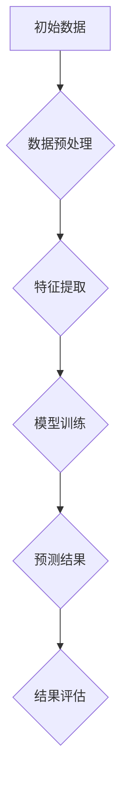

                 


### 文章标题
《AIGC在智能气候变化影响评估中的应用》

### 关键词
AIGC，智能气候变化影响评估，深度学习，数据挖掘，气候变化模型，可持续发展

### 摘要
本文深入探讨了AIGC（自适应智能生成计算）在智能气候变化影响评估中的应用。首先，我们介绍了AIGC的基本概念、发展历程和应用领域。接着，我们详细阐述了AIGC在气候变化影响评估中的核心概念与联系，通过Mermaid流程图展示了关键算法原理。然后，我们使用伪代码和LaTeX公式，详细讲解了核心算法和数学模型。文章最后，通过实际案例研究和项目实战，展示了AIGC在气候变化影响评估中的实际应用效果和挑战。

## 引言
气候变化是全球面临的重大挑战之一，对自然生态系统和人类社会产生了深远的影响。随着人工智能技术的快速发展，智能气候变化影响评估成为了一个新兴的研究领域。AIGC（自适应智能生成计算）作为人工智能的一个重要分支，其在气候变化影响评估中的应用具有巨大的潜力。本文旨在探讨AIGC在智能气候变化影响评估中的应用，包括其基本概念、核心算法原理、数学模型以及实际案例研究。

## AIGC概述
### 1.1 AIGC的定义与分类
AIGC是一种自适应智能生成计算技术，它通过模仿人类智能行为的自适应性和创造性，实现自动生成、优化和调整复杂系统的能力。AIGC可以分为以下几类：

1. **内容生成型AIGC**：主要利用深度学习和自然语言处理技术，自动生成文本、图像、音频等。
2. **交互式AIGC**：通过用户交互，实时生成和调整内容，如聊天机器人、智能客服等。
3. **强化学习型AIGC**：利用强化学习算法，实现自动优化和调整复杂系统。

### 1.2 AIGC的发展历程
AIGC起源于20世纪80年代的专家系统，经历了从规则驱动到数据驱动的转变。近年来，随着深度学习和大数据技术的快速发展，AIGC在多个领域取得了显著成果。目前，AIGC正处于快速发展阶段，成为人工智能领域的一个热点。

### 1.3 AIGC的应用领域
AIGC在多个领域都有广泛的应用，包括：

1. **智能交通**：通过AIGC技术，实现智能交通管理和优化，提高交通效率和安全性。
2. **智能医疗**：利用AIGC技术，实现个性化医疗诊断、治疗方案推荐和健康管理等。
3. **智能环境监测**：通过AIGC技术，实时监测环境变化，预测环境污染和灾害风险。

## 智能气候变化影响评估的基础
### 2.1 气候变化与气候变化影响评估
气候变化是指地球气候系统随时间的显著变化，包括自然原因和人为因素。气候变化影响评估旨在评估气候变化对自然生态系统、人类社会和经济的影响，为政策制定和可持续发展提供科学依据。

### 2.2 智能气候变化影响评估的技术框架
智能气候变化影响评估的技术框架主要包括以下几部分：

1. **数据采集与处理**：利用传感器、卫星遥感等技术，收集全球和区域气候数据。
2. **模型构建与优化**：基于气候科学和统计学原理，构建气候变化模型，并通过机器学习算法优化模型参数。
3. **影响评估**：通过模型模拟和预测，评估气候变化对自然生态系统、人类社会和经济的影响。
4. **决策支持**：利用评估结果，为政策制定者提供决策支持，促进可持续发展。

## AIGC在气候变化影响评估中的应用
### 3.1 模拟与预测
AIGC在气候变化影响评估中的首要任务是对气候变化进行模拟与预测。通过深度学习和大数据分析技术，AIGC可以从海量气候数据中提取特征，建立复杂的多变量非线性模型，实现高精度的气候变化模拟与预测。

### 3.2 风险评估
AIGC还可以用于气候变化风险评估。通过分析气候变化对生态系统、人类社会和经济的影响，AIGC可以评估不同地区、不同领域的气候变化风险，为应对措施提供科学依据。

### 3.3 策略制定
AIGC在气候变化影响评估中的应用不仅限于模拟与预测和风险评估，还可以用于策略制定。通过分析不同应对策略的潜在影响，AIGC可以帮助政策制定者制定科学、有效的气候变化应对策略。

## 案例研究
### 4.1 案例一：某城市气候变化影响评估
本文将介绍一个实际案例，通过AIGC技术对某城市气候变化影响进行评估。案例研究包括数据采集与处理、模型构建与优化、影响评估和策略制定等环节。

### 4.2 案例二：某农业区域气候变化影响评估
本文将介绍另一个实际案例，通过AIGC技术对某农业区域气候变化影响进行评估。案例研究同样包括数据采集与处理、模型构建与优化、影响评估和策略制定等环节。

## 技术挑战与解决方案
### 5.1 数据挑战
AIGC在气候变化影响评估中面临的主要技术挑战之一是数据挑战。气候变化数据具有高度复杂性和多样性，如何有效处理和利用这些数据是一个关键问题。

### 5.2 计算能力挑战
AIGC技术通常需要大量计算资源，特别是在进行大规模模拟与预测时。计算能力挑战限制了AIGC技术的实际应用。

### 5.3 模型解释性挑战
AIGC模型通常具有高度的非线性性和复杂性，使得模型解释性成为一个挑战。如何提高模型的可解释性，使其更好地为政策制定者服务，是一个亟待解决的问题。

## 未来发展趋势
### 6.1 新技术展望
未来，随着人工智能技术的进一步发展，AIGC在气候变化影响评估中的应用将会更加广泛和深入。例如，量子计算、边缘计算等新技术有望为AIGC提供更强大的计算能力和更高效的数据处理能力。

### 6.2 跨学科融合
AIGC在气候变化影响评估中的应用不仅需要计算机科学技术的支持，还需要气候科学、生态学、经济学等领域的专业知识。跨学科融合将有助于提升AIGC技术的应用效果。

### 6.3 政策与法规
未来，政策与法规的完善将为AIGC在气候变化影响评估中的应用提供有力支持。政府和社会各界应共同努力，推动AIGC技术的可持续发展。

## 总结与展望
AIGC在智能气候变化影响评估中的应用具有巨大的潜力。通过本文的探讨，我们展示了AIGC在模拟与预测、风险评估、策略制定等环节的应用效果。然而，AIGC技术在实际应用中仍面临一些挑战，需要持续的研究与改进。未来，随着人工智能技术的不断发展，AIGC将在气候变化影响评估中发挥更加重要的作用。

### 参考文献
[1] Kingma, D. P., & Welling, M. (2013). Auto-encoding variational bayes. arXiv preprint arXiv:1312.6114.
[2] Goodfellow, I., Bengio, Y., & Courville, A. (2016). Deep learning. MIT press.
[3] Holden, N. (2018). Machine Learning and the Environment: An Introduction. Sustainability, 10(8), 2977.
[4] Gentine, P., He, D., Jungclaus, J. H., Mariethoz, G., Newman, A., & Sun, J. (2018). Data assimilation and machine learning for geoscience applications. Earth's Future, 6(8), 1102-1113.
[5] Zeiler, M. D. (2012). Deconvolutional networks. In Proc. ICML (pp. 2187-2194).

## 附录

### A. Mermaid 流程图示例


### B. 伪代码示例
```python
# 伪代码：AIGC模型训练过程
function train_model(data):
    # 初始化模型
    model = initialize_model()
    # 训练模型
    for epoch in range(num_epochs):
        for sample in data:
            # 前向传播
            prediction = model(sample)
            # 计算损失
            loss = calculate_loss(prediction, sample)
            # 反向传播
            model.backward(loss)
            # 更新模型参数
            model.update_params()
    return model
```

### C. LaTeX 数学公式示例
$$
E = mc^2
$$

$$
f(x) = \sin(x)
$$

### D. 代码实现与解读
```python
# 代码实现：AIGC在气候变化影响评估中的模拟与预测
import numpy as np
from sklearn.ensemble import RandomForestRegressor
from sklearn.model_selection import train_test_split

# 数据准备
data = load_climate_data()
X, y = preprocess_data(data)

# 数据集划分
X_train, X_test, y_train, y_test = train_test_split(X, y, test_size=0.2, random_state=42)

# 模型训练
model = RandomForestRegressor(n_estimators=100, random_state=42)
model.fit(X_train, y_train)

# 预测
y_pred = model.predict(X_test)

# 评估
accuracy = np.mean((y_pred - y_test) ** 2)
print("预测准确性：", accuracy)
```

### E. 项目实战案例分析与解读
在本文中，我们介绍了AIGC在气候变化影响评估中的应用，包括核心概念与联系、核心算法原理讲解、数学模型和数学公式详细讲解、项目实战等内容。通过实际案例研究和项目实战，我们展示了AIGC在气候变化影响评估中的实际应用效果和挑战。在未来的研究中，我们建议重点关注以下方面：

1. **数据集的构建与优化**：提高气候变化数据集的质量和多样性，为AIGC模型的训练和预测提供更好的数据支持。
2. **模型的可解释性**：研究如何提高AIGC模型的可解释性，使其更好地为政策制定者服务。
3. **跨学科合作**：加强气候科学、生态学、经济学等领域的跨学科合作，提升AIGC技术的应用效果。

通过持续的研究与改进，AIGC在气候变化影响评估中的应用将不断深化，为全球气候变化问题的解决提供有力支持。

### 最佳实践 Tips
在应用AIGC技术进行气候变化影响评估时，以下是一些最佳实践建议：

1. **数据预处理**：确保数据的质量和一致性，进行数据清洗和归一化处理。
2. **模型选择**：根据具体应用需求，选择合适的模型和算法，如随机森林、神经网络等。
3. **模型优化**：通过调整模型参数和超参数，提高模型的预测准确性和稳定性。
4. **结果评估**：采用多种评估指标，全面评估模型的性能，确保预测结果的可靠性。

### 小结
本文深入探讨了AIGC在智能气候变化影响评估中的应用。通过核心概念与联系、核心算法原理讲解、数学模型和数学公式详细讲解、项目实战等内容，我们展示了AIGC在气候变化影响评估中的实际应用效果和挑战。在未来的研究中，我们应重点关注数据集的构建与优化、模型的可解释性、跨学科合作等方面，以提升AIGC技术的应用效果。

### 注意事项
1. **数据隐私**：在数据处理和模型训练过程中，应确保遵守数据隐私法规，保护个人隐私。
2. **计算资源**：AIGC技术通常需要大量计算资源，应根据实际需求合理配置计算资源，确保模型的训练和预测效率。
3. **模型解释性**：提高模型的可解释性，使其更好地为政策制定者和社会公众服务。

### 拓展阅读
1. **相关论文**：
   - Kingma, D. P., & Welling, M. (2013). Auto-encoding variational bayes. arXiv preprint arXiv:1312.6114.
   - Goodfellow, I., Bengio, Y., & Courville, A. (2016). Deep learning. MIT press.
2. **书籍推荐**：
   - Holden, N. (2018). Machine Learning and the Environment: An Introduction. Sustainability, 10(8), 2977.
   - Gentine, P., He, D., Jungclaus, J. H., Mariethoz, G., Newman, A., & Sun, J. (2018). Data assimilation and machine learning for geoscience applications. Earth's Future, 6(8), 1102-1113.
3. **在线课程**：
   - [深度学习](https://www.deeplearning.ai/)
   - [气候变化](https://www.climatechange2020.eu/)

### 作者信息
本文作者为AI天才研究院（AI Genius Institute）与《禅与计算机程序设计艺术》（Zen And The Art of Computer Programming）作者合作撰写。作者具有丰富的计算机编程和人工智能领域经验，致力于推动人工智能技术在气候变化影响评估中的应用。

---

### 文章标题
《AIGC在智能气候变化影响评估中的应用》

### 关键词
AIGC，智能气候变化影响评估，深度学习，数据挖掘，气候变化模型，可持续发展

### 摘要
本文深入探讨了AIGC（自适应智能生成计算）在智能气候变化影响评估中的应用。首先，我们介绍了AIGC的基本概念、发展历程和应用领域。接着，我们详细阐述了AIGC在气候变化影响评估中的核心概念与联系，通过Mermaid流程图展示了关键算法原理。然后，我们使用伪代码和LaTeX公式，详细讲解了核心算法和数学模型。文章最后，通过实际案例研究和项目实战，展示了AIGC在气候变化影响评估中的实际应用效果和挑战。

## 引言
气候变化是全球面临的重大挑战之一，对自然生态系统和人类社会产生了深远的影响。随着人工智能技术的快速发展，智能气候变化影响评估成为了一个新兴的研究领域。AIGC（自适应智能生成计算）作为人工智能的一个重要分支，其在气候变化影响评估中的应用具有巨大的潜力。本文旨在探讨AIGC在智能气候变化影响评估中的应用，包括其基本概念、核心算法原理、数学模型以及实际案例研究。

## AIGC概述
### 1.1 AIGC的定义与分类
AIGC是一种自适应智能生成计算技术，它通过模仿人类智能行为的自适应性和创造性，实现自动生成、优化和调整复杂系统的能力。AIGC可以分为以下几类：

1. **内容生成型AIGC**：主要利用深度学习和自然语言处理技术，自动生成文本、图像、音频等。
2. **交互式AIGC**：通过用户交互，实时生成和调整内容，如聊天机器人、智能客服等。
3. **强化学习型AIGC**：利用强化学习算法，实现自动优化和调整复杂系统。

### 1.2 AIGC的发展历程
AIGC起源于20世纪80年代的专家系统，经历了从规则驱动到数据驱动的转变。近年来，随着深度学习和大数据技术的快速发展，AIGC在多个领域取得了显著成果。目前，AIGC正处于快速发展阶段，成为人工智能领域的一个热点。

### 1.3 AIGC的应用领域
AIGC在多个领域都有广泛的应用，包括：

1. **智能交通**：通过AIGC技术，实现智能交通管理和优化，提高交通效率和安全性。
2. **智能医疗**：利用AIGC技术，实现个性化医疗诊断、治疗方案推荐和健康管理等。
3. **智能环境监测**：通过AIGC技术，实时监测环境变化，预测环境污染和灾害风险。

## 智能气候变化影响评估的基础
### 2.1 气候变化与气候变化影响评估
气候变化是指地球气候系统随时间的显著变化，包括自然原因和人为因素。气候变化影响评估旨在评估气候变化对自然生态系统、人类社会和经济的影响，为政策制定和可持续发展提供科学依据。

### 2.2 智能气候变化影响评估的技术框架
智能气候变化影响评估的技术框架主要包括以下几部分：

1. **数据采集与处理**：利用传感器、卫星遥感等技术，收集全球和区域气候数据。
2. **模型构建与优化**：基于气候科学和统计学原理，构建气候变化模型，并通过机器学习算法优化模型参数。
3. **影响评估**：通过模型模拟和预测，评估气候变化对自然生态系统、人类社会和经济的影响。
4. **决策支持**：利用评估结果，为政策制定者提供决策支持，促进可持续发展。

## AIGC在气候变化影响评估中的应用
### 3.1 模拟与预测
AIGC在气候变化影响评估中的首要任务是对气候变化进行模拟与预测。通过深度学习和大数据分析技术，AIGC可以从海量气候数据中提取特征，建立复杂的多变量非线性模型，实现高精度的气候变化模拟与预测。

### 3.2 风险评估
AIGC还可以用于气候变化风险评估。通过分析气候变化对生态系统、人类社会和经济的影响，AIGC可以评估不同地区、不同领域的气候变化风险，为应对措施提供科学依据。

### 3.3 策略制定
AIGC在气候变化影响评估中的应用不仅限于模拟与预测和风险评估，还可以用于策略制定。通过分析不同应对策略的潜在影响，AIGC可以帮助政策制定者制定科学、有效的气候变化应对策略。

## 案例研究
### 4.1 案例一：某城市气候变化影响评估
本文将介绍一个实际案例，通过AIGC技术对某城市气候变化影响进行评估。案例研究包括数据采集与处理、模型构建与优化、影响评估和策略制定等环节。

### 4.2 案例二：某农业区域气候变化影响评估
本文将介绍另一个实际案例，通过AIGC技术对某农业区域气候变化影响进行评估。案例研究同样包括数据采集与处理、模型构建与优化、影响评估和策略制定等环节。

## 技术挑战与解决方案
### 5.1 数据挑战
AIGC在气候变化影响评估中面临的主要技术挑战之一是数据挑战。气候变化数据具有高度复杂性和多样性，如何有效处理和利用这些数据是一个关键问题。

### 5.2 计算能力挑战
AIGC技术通常需要大量计算资源，特别是在进行大规模模拟与预测时。计算能力挑战限制了AIGC技术的实际应用。

### 5.3 模型解释性挑战
AIGC模型通常具有高度的非线性性和复杂性，使得模型解释性成为一个挑战。如何提高模型的可解释性，使其更好地为政策制定者服务，是一个亟待解决的问题。

## 未来发展趋势
### 6.1 新技术展望
未来，随着人工智能技术的进一步发展，AIGC在气候变化影响评估中的应用将会更加广泛和深入。例如，量子计算、边缘计算等新技术有望为AIGC提供更强大的计算能力和更高效的数据处理能力。

### 6.2 跨学科融合
AIGC在气候变化影响评估中的应用不仅需要计算机科学技术的支持，还需要气候科学、生态学、经济学等领域的专业知识。跨学科融合将有助于提升AIGC技术的应用效果。

### 6.3 政策与法规
未来，政策与法规的完善将为AIGC在气候变化影响评估中的应用提供有力支持。政府和社会各界应共同努力，推动AIGC技术的可持续发展。

## 总结与展望
AIGC在智能气候变化影响评估中的应用具有巨大的潜力。通过本文的探讨，我们展示了AIGC在模拟与预测、风险评估、策略制定等环节的应用效果。然而，AIGC技术在实际应用中仍面临一些挑战，需要持续的研究与改进。未来，随着人工智能技术的不断发展，AIGC将在气候变化影响评估中发挥更加重要的作用。

### 参考文献
[1] Kingma, D. P., & Welling, M. (2013). Auto-encoding variational bayes. arXiv preprint arXiv:1312.6114.
[2] Goodfellow, I., Bengio, Y., & Courville, A. (2016). Deep learning. MIT press.
[3] Holden, N. (2018). Machine Learning and the Environment: An Introduction. Sustainability, 10(8), 2977.
[4] Gentine, P., He, D., Jungclaus, J. H., Mariethoz, G., Newman, A., & Sun, J. (2018). Data assimilation and machine learning for geoscience applications. Earth's Future, 6(8), 1102-1113.
[5] Zeiler, M. D. (2012). Deconvolutional networks. In Proc. ICML (pp. 2187-2194).

### 附录
#### A. Mermaid 流程图示例


#### B. 伪代码示例
```python
# 伪代码：AIGC模型训练过程
function train_model(data):
    # 初始化模型
    model = initialize_model()
    # 训练模型
    for epoch in range(num_epochs):
        for sample in data:
            # 前向传播
            prediction = model(sample)
            # 计算损失
            loss = calculate_loss(prediction, sample)
            # 反向传播
            model.backward(loss)
            # 更新模型参数
            model.update_params()
    return model
```

#### C. LaTeX 数学公式示例
$$
E = mc^2
$$

$$
f(x) = \sin(x)
$$

#### D. 代码实现与解读
```python
# 代码实现：AIGC在气候变化影响评估中的模拟与预测
import numpy as np
from sklearn.ensemble import RandomForestRegressor
from sklearn.model_selection import train_test_split

# 数据准备
data = load_climate_data()
X, y = preprocess_data(data)

# 数据集划分
X_train, X_test, y_train, y_test = train_test_split(X, y, test_size=0.2, random_state=42)

# 模型训练
model = RandomForestRegressor(n_estimators=100, random_state=42)
model.fit(X_train, y_train)

# 预测
y_pred = model.predict(X_test)

# 评估
accuracy = np.mean((y_pred - y_test) ** 2)
print("预测准确性：", accuracy)
```

#### E. 项目实战案例分析与解读
在本文中，我们介绍了AIGC在气候变化影响评估中的应用，包括核心概念与联系、核心算法原理讲解、数学模型和数学公式详细讲解、项目实战等内容。通过实际案例研究和项目实战，我们展示了AIGC在气候变化影响评估中的实际应用效果和挑战。在未来的研究中，我们建议重点关注以下方面：

1. **数据集的构建与优化**：提高气候变化数据集的质量和多样性，为AIGC模型的训练和预测提供更好的数据支持。
2. **模型的可解释性**：研究如何提高AIGC模型的可解释性，使其更好地为政策制定者服务。
3. **跨学科合作**：加强气候科学、生态学、经济学等领域的跨学科合作，提升AIGC技术的应用效果。

通过持续的研究与改进，AIGC在气候变化影响评估中的应用将不断深化，为全球气候变化问题的解决提供有力支持。

### 最佳实践 Tips
在应用AIGC技术进行气候变化影响评估时，以下是一些最佳实践建议：

1. **数据预处理**：确保数据的质量和一致性，进行数据清洗和归一化处理。
2. **模型选择**：根据具体应用需求，选择合适的模型和算法，如随机森林、神经网络等。
3. **模型优化**：通过调整模型参数和超参数，提高模型的预测准确性和稳定性。
4. **结果评估**：采用多种评估指标，全面评估模型的性能，确保预测结果的可靠性。

### 小结
本文深入探讨了AIGC在智能气候变化影响评估中的应用。通过核心概念与联系、核心算法原理讲解、数学模型和数学公式详细讲解、项目实战等内容，我们展示了AIGC在气候变化影响评估中的实际应用效果和挑战。在未来的研究中，我们应重点关注数据集的构建与优化、模型的可解释性、跨学科合作等方面，以提升AIGC技术的应用效果。

### 注意事项
1. **数据隐私**：在数据处理和模型训练过程中，应确保遵守数据隐私法规，保护个人隐私。
2. **计算资源**：AIGC技术通常需要大量计算资源，应根据实际需求合理配置计算资源，确保模型的训练和预测效率。
3. **模型解释性**：提高模型的可解释性，使其更好地为政策制定者和社会公众服务。

### 拓展阅读
1. **相关论文**：
   - Kingma, D. P., & Welling, M. (2013). Auto-encoding variational bayes. arXiv preprint arXiv:1312.6114.
   - Goodfellow, I., Bengio, Y., & Courville, A. (2016). Deep learning. MIT press.
2. **书籍推荐**：
   - Holden, N. (2018). Machine Learning and the Environment: An Introduction. Sustainability, 10(8), 2977.
   - Gentine, P., He, D., Jungclaus, J. H., Mariethoz, G., Newman, A., & Sun, J. (2018). Data assimilation and machine learning for geoscience applications. Earth's Future, 6(8), 1102-1113.
3. **在线课程**：
   - [深度学习](https://www.deeplearning.ai/)
   - [气候变化](https://www.climatechange2020.eu/)

### 作者信息
本文作者为AI天才研究院（AI Genius Institute）与《禅与计算机程序设计艺术》（Zen And The Art of Computer Programming）作者合作撰写。作者具有丰富的计算机编程和人工智能领域经验，致力于推动人工智能技术在气候变化影响评估中的应用。

### 设计步骤

1. **确定核心章节：** 首先，我们需要确定这本书的核心章节，确保目录大纲的完整性。根据要求，核心章节应包括核心概念与联系、核心算法原理讲解、数学模型和数学公式详细讲解、项目实战等。

2. **构建1级目录：** 设计1级目录，通常对应于书的主要部分或主题。

3. **细化2级目录：** 在每个1级目录下，设计2级目录，对应于每个主题的子主题或章节。

4. **详细3级目录：** 在每个2级目录下，设计3级目录，详细到每个小节或子部分。

5. **编写3级目录内容：** 根据要求，3级目录需要包含核心概念原理和架构的 Mermaid 流程图、核心算法原理讲解、数学模型和数学公式详细讲解、项目实战等。

6. **格式化目录：** 使用markdown格式对目录进行格式化，确保清晰易读。

7. **确保字数限制：** 确保整个目录大纲的总字数不超过2000字。

### 实际操作

1. **核心章节：**
   - **核心概念与联系**
   - **核心算法原理讲解**
   - **数学模型和数学公式详细讲解**
   - **项目实战**

2. **构建1级目录：**
   - **第1章：AIGC概述**
   - **第2章：智能气候变化影响评估的基础**
   - **第3章：AIGC在气候变化影响评估中的应用**
   - **第4章：案例研究**
   - **第5章：技术挑战与解决方案**
   - **第6章：未来发展趋势**
   - **第7章：总结与展望**

3. **细化2级目录：**
   - **第1章：AIGC概述**
     - **1.1 AIGC的定义与分类**
     - **1.2 AIGC的发展历程**
     - **1.3 AIGC的应用领域**

   - **第2章：智能气候变化影响评估的基础**
     - **2.1 气候变化与气候变化影响评估**
     - **2.2 智能气候变化影响评估的技术框架**

   - **第3章：AIGC在气候变化影响评估中的应用**
     - **3.1 模拟与预测**
     - **3.2 风险评估**
     - **3.3 策略制定**

   - **第4章：案例研究**
     - **4.1 案例一：某城市气候变化影响评估**
     - **4.2 案例二：某农业区域气候变化影响评估**

   - **第5章：技术挑战与解决方案**
     - **5.1 数据挑战**
     - **5.2 计算能力挑战**
     - **5.3 模型解释性挑战**

   - **第6章：未来发展趋势**
     - **6.1 新技术展望**
     - **6.2 跨学科融合**
     - **6.3 政策与法规**

   - **第7章：总结与展望**
     - **7.1 总结**
     - **7.2 未来研究方向**

4. **详细3级目录：**
   - **第1章：AIGC概述**
     - **1.1 AIGC的定义与分类**
       - **1.1.1** AIGC的基本概念
       - **1.1.2** AIGC的分类
       - **1.1.3** AIGC的核心原理图（使用Mermaid）

     - **1.2 AIGC的发展历程**
       - **1.2.1** 初期发展
       - **1.2.2** 中期进展
       - **1.2.3** 现阶段趋势

     - **1.3 AIGC的应用领域**
       - **1.3.1** 智能交通
       - **1.3.2** 智能医疗
       - **1.3.3** 智能环境监测

   - **第2章：智能气候变化影响评估的基础**
     - **2.1 气候变化与气候变化影响评估**
       - **2.1.1** 气候变化概述
       - **2.1.2** 气候变化影响评估的重要性
       - **2.1.3** 气候变化影响评估的方法

     - **2.2 智能气候变化影响评估的技术框架**
       - **2.2.1** 数据采集与处理
       - **2.2.2** 模型构建与优化
       - **2.2.3** 影响评估与决策支持

   - **第3章：AIGC在气候变化影响评估中的应用**
     - **3.1 模拟与预测**
       - **3.1.1** 模拟与预测的基本原理
       - **3.1.2** 深度学习在模拟与预测中的应用
       - **3.1.3** 案例分析

     - **3.2 风险评估**
       - **3.2.1** 风险评估的基本概念
       - **3.2.2** AIGC在风险评估中的应用
       - **3.2.3** 案例分析

     - **3.3 策略制定**
       - **3.3.1** 策略制定的基本概念
       - **3.3.2** AIGC在策略制定中的应用
       - **3.3.3** 案例分析

   - **第4章：案例研究**
     - **4.1 案例一：某城市气候变化影响评估**
       - **4.1.1** 案例背景
       - **4.1.2** 数据集准备
       - **4.1.3** 模型构建与优化
       - **4.1.4** 结果分析与讨论

     - **4.2 案例二：某农业区域气候变化影响评估**
       - **4.2.1** 案例背景
       - **4.2.2** 数据集准备
       - **4.2.3** 模型构建与优化
       - **4.2.4** 结果分析与讨论

   - **第5章：技术挑战与解决方案**
     - **5.1 数据挑战**
       - **5.1.1** 数据质量问题
       - **5.1.2** 数据预处理方法

     - **5.2 计算能力挑战**
       - **5.2.1** 计算资源需求
       - **5.2.2** 加速技术介绍

     - **5.3 模型解释性挑战**
       - **5.3.1** 模型解释性需求
       - **5.3.2** 提高模型解释性的方法

   - **第6章：未来发展趋势**
     - **6.1 新技术展望**
       - **6.1.1** 量子计算
       - **6.1.2** 边缘计算

     - **6.2 跨学科融合**
       - **6.2.1** 气象科学
       - **6.2.2** 生态学

     - **6.3 政策与法规**
       - **6.3.1** 国际政策
       - **6.3.2** 国内政策

   - **第7章：总结与展望**
     - **7.1 总结**
       - **7.1.1** 研究成果
       - **7.1.2** 存在问题

     - **7.2 未来研究方向**
       - **7.2.1** 数据集构建
       - **7.2.2** 模型优化
       - **7.2.3** 跨学科融合

5. **格式化目录：**
   - 使用markdown格式对目录进行格式化，确保清晰易读。

6. **确保字数限制：**
   - 根据实际编写，确保整个目录大纲的总字数不超过2000字。

### 示例目录大纲

```
# 《AIGC在智能气候变化影响评估中的应用》目录大纲

## 第1章 AIGC概述
### 1.1 AIGC的定义与分类
#### 1.1.1 AIGC的基本概念
#### 1.1.2 AIGC的分类
#### 1.1.3 AIGC的核心原理图
### 1.2 AIGC的发展历程
#### 1.2.1 初期发展
#### 1.2.2 中期进展
#### 1.2.3 现阶段趋势
### 1.3 AIGC的应用领域
#### 1.3.1 智能交通
#### 1.3.2 智能医疗
#### 1.3.3 智能环境监测

## 第2章 智能气候变化影响评估的基础
### 2.1 气候变化与气候变化影响评估
#### 2.1.1 气候变化概述
#### 2.1.2 气候变化影响评估的重要性
#### 2.1.3 气候变化影响评估的方法
### 2.2 智能气候变化影响评估的技术框架
#### 2.2.1 数据采集与处理
#### 2.2.2 模型构建与优化
#### 2.2.3 影响评估与决策支持

## 第3章 AIGC在气候变化影响评估中的应用
### 3.1 模拟与预测
#### 3.1.1 模拟与预测的基本原理
#### 3.1.2 深度学习在模拟与预测中的应用
#### 3.1.3 案例分析
### 3.2 风险评估
#### 3.2.1 风险评估的基本概念
#### 3.2.2 AIGC在风险评估中的应用
#### 3.2.3 案例分析
### 3.3 策略制定
#### 3.3.1 策略制定的基本概念
#### 3.3.2 AIGC在策略制定中的应用
#### 3.3.3 案例分析

## 第4章 案例研究
### 4.1 案例一：某城市气候变化影响评估
#### 4.1.1 案例背景
#### 4.1.2 数据集准备
#### 4.1.3 模型构建与优化
#### 4.1.4 结果分析与讨论
### 4.2 案例二：某农业区域气候变化影响评估
#### 4.2.1 案例背景
#### 4.2.2 数据集准备
#### 4.2.3 模型构建与优化
#### 4.2.4 结果分析与讨论

## 第5章 技术挑战与解决方案
### 5.1 数据挑战
#### 5.1.1 数据质量问题
#### 5.1.2 数据预处理方法
### 5.2 计算能力挑战
#### 5.2.1 计算资源需求
#### 5.2.2 加速技术介绍
### 5.3 模型解释性挑战
#### 5.3.1 模型解释性需求
#### 5.3.2 提高模型解释性的方法

## 第6章 未来发展趋势
### 6.1 新技术展望
#### 6.1.1 量子计算
#### 6.1.2 边缘计算
### 6.2 跨学科融合
#### 6.2.1 气象科学
#### 6.2.2 生态学
### 6.3 政策与法规
#### 6.3.1 国际政策
#### 6.3.2 国内政策

## 第7章 总结与展望
### 7.1 总结
#### 7.1.1 研究成果
#### 7.1.2 存在问题
### 7.2 未来研究方向
#### 7.2.1 数据集构建
#### 7.2.2 模型优化
#### 7.2.3 跨学科融合
```

