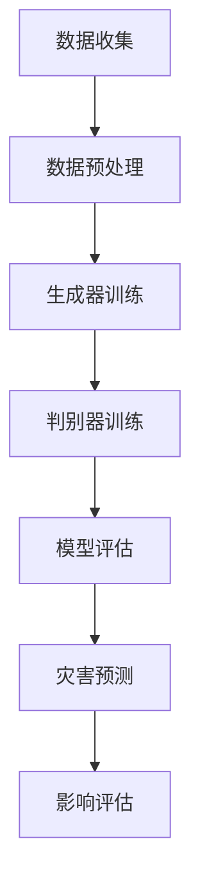

                 

### 文章标题：AIGC在智能气象灾害影响评估中的应用

### 关键词：AIGC、智能气象灾害、影响评估、算法原理、应用案例、代码实战

### 摘要：

随着人工智能技术的发展，生成对抗网络（GAN）的变种——自适应信息生成控制（Adaptive Information Generation Control，简称AIGC）逐渐应用于各个领域。本文将探讨AIGC在智能气象灾害影响评估中的应用，通过详细介绍AIGC的基础概念、核心算法原理，结合实际项目案例，分析其在气象灾害预测和影响评估中的优势与挑战。文章旨在为相关领域的研究者提供理论支持和实战参考。

### 设计书籍目录大纲的步骤

设计一本计算机技术书籍的目录大纲，尤其是专注于特定领域（如AIGC在智能气象灾害影响评估中的应用），需要以下几个步骤：

#### 1. 理解书籍主题

- **主题解析**：首先，深入理解书籍的主题内容，明确书籍的核心概念、研究背景和目标读者。
- **大纲结构**：确定书籍的大纲结构，包括核心章节和辅助章节。

#### 2. 确定核心章节

- **核心概念与联系**：设计1级目录，列出书籍的核心章节，这些章节应该能够全面覆盖主题。
  - 例如：
    ```markdown
    # 第一部分: AIGC基础
    ```
  - **Mermaid流程图**：在每个核心章节前面，设计一个Mermaid流程图来展示相关概念和它们之间的联系。

- **核心算法原理讲解**：设计2级目录，细化每个核心章节的内容。
  - 例如：
    ```markdown
    ## 2.1 AIGC模型概述
    ### 2.1.1 AIGC的基本概念
    ### 2.1.2 AIGC的关键技术
    ```
  - **伪代码**：在每个2级目录下面，用伪代码详细阐述核心算法原理。

#### 3. 设计数学模型

- **数学模型和数学公式**：设计3级目录，列出具体数学模型和公式。
  - 例如：
    ```markdown
    ### 3.1 模型训练过程
    #### 3.1.1 损失函数
    #### 3.1.2 优化算法
    ```
  - **举例说明**：在每个3级目录下面，用示例详细解释数学模型和公式。

#### 4. 实战案例

- **项目实战**：设计项目实战章节，包括以下内容：
  - **代码实际案例**：给出具体代码案例，展示如何实现AIGC在气象灾害评估中的应用。
  - **详细解释说明**：对代码案例进行详细解释，包括开发环境搭建、源代码实现和解读。
  - **代码解读与分析**：深入分析代码，解释每个部分的作用和实现细节。

#### 5. 撰写大纲

- **整合大纲**：将所有步骤整合成完整的大纲。
- **字数限制**：确保总字数在2000字以内。

#### 6. 审查与调整

- **审查大纲**：确保大纲结构完整、逻辑清晰。
- **调整内容**：根据审查结果对大纲进行调整，确保符合书籍的主题和目标。

---

### 理解AIGC在智能气象灾害影响评估中的应用

#### 背景介绍

近年来，全球气候变化加剧，气象灾害频发，如台风、暴雨、洪水等，这些灾害对人类社会和经济造成了巨大的影响。传统的气象灾害预测方法主要依赖于数值天气预报模型和统计方法，但这些方法存在一定的局限性，如预报精度不高、响应速度较慢等。随着人工智能技术的发展，尤其是生成对抗网络（GAN）的变种——自适应信息生成控制（AIGC）的出现，为气象灾害影响评估提供了新的思路。

AIGC是一种基于生成对抗网络的深度学习模型，通过对抗性训练生成与真实数据分布相似的数据，从而在数据稀缺的情况下，提高模型的泛化能力。在气象灾害影响评估中，AIGC可以通过生成模拟气象数据，实现对灾害事件的预测和影响评估，具有以下优势：

1. **数据增强**：AIGC可以通过生成模拟数据，增加训练样本数量，提高模型的预测性能。
2. **动态预测**：AIGC模型可以实时更新，对气象条件进行动态预测，提高灾害预警的及时性。
3. **多模态数据融合**：AIGC可以融合多种气象数据，如雷达、卫星、地面观测等，提高预测的准确性。

#### 核心概念与联系

为了更好地理解AIGC在气象灾害影响评估中的应用，我们需要先了解AIGC的基本概念和原理。

1. **生成对抗网络（GAN）**：GAN是由生成器（Generator）和判别器（Discriminator）组成的一种深度学习模型。生成器生成与真实数据分布相似的数据，判别器则判断生成的数据与真实数据的相似度。通过对抗性训练，生成器的性能不断提高，最终能够生成逼真的数据。

2. **自适应信息生成控制（AIGC）**：AIGC是GAN的一种变种，通过引入自适应机制，使得生成器能够根据数据分布的变化，动态调整生成策略，提高模型的泛化能力。

3. **气象灾害影响评估**：气象灾害影响评估是指通过对气象数据的分析，预测灾害可能对社会和经济造成的影响。这通常包括灾害预警、损失评估、应急响应等。

#### Mermaid流程图

为了直观地展示AIGC在气象灾害影响评估中的应用流程，我们使用Mermaid绘制了以下流程图：



#### 核心算法原理讲解

在本章节中，我们将使用伪代码详细阐述AIGC模型的核心算法原理。

```python
# 伪代码：AIGC模型训练过程

# 初始化生成器 G 和判别器 D
G = initialize_generator()
D = initialize_discriminator()

# 定义损失函数
loss_generator = loss_generator_function()
loss_discriminator = loss_discriminator_function()

# 模型训练
for epoch in range(num_epochs):
    for batch in data_loader:
        # 数据预处理
        x_real = preprocess_data(batch[0])
        x_fake = G.sample(z)

        # 判别器训练
        D.zero_grad()
        D_real = D(x_real)
        D_fake = D(x_fake)
        loss_D = loss_discriminator(D_real, D_fake)
        loss_D.backward()

        # 生成器训练
        G.zero_grad()
        G_fake = D(x_fake)
        loss_G = loss_generator(G_fake)
        loss_G.backward()

        # 更新模型参数
        optimizer_G.step()
        optimizer_D.step()

    # 打印训练进度
    print(f"Epoch [{epoch+1}/{num_epochs}], Loss_G: {loss_G.item():.4f}, Loss_D: {loss_D.item():.4f}")
```

#### 数学模型和数学公式

在本章节中，我们将介绍用于训练AIGC模型的损失函数和优化算法。

1. **损失函数**

损失函数是AIGC模型训练的核心，用于评估生成器生成的数据和真实数据之间的差异。常用的损失函数包括：

- **交叉熵损失（Cross-Entropy Loss）**：用于衡量生成器和判别器的输出概率分布与真实分布之间的差异。

  $$L_{CE} = -\sum_{i=1}^{n} y_i \log(D(x_i)) - (1 - y_i) \log(1 - D(x_i))$$

- **对抗损失（Adversarial Loss）**：用于衡量生成器生成的数据与真实数据之间的差异。

  $$L_{Adv} = -\log(D(x_i)) - \log(1 - D(G(z_i)))$$

2. **优化算法**

优化算法用于更新模型参数，常用的优化算法包括：

- **随机梯度下降（Stochastic Gradient Descent，SGD）**：通过随机选择训练数据的一个子集，计算梯度并更新模型参数。

  $$\theta = \theta - \alpha \cdot \nabla_\theta J(\theta)$$

- **Adam优化器**：结合了SGD和RMSprop的优点，适用于动态调整学习率。

  $$m_t = \beta_1 m_{t-1} + (1 - \beta_1) \nabla_{\theta} J(\theta)$$
  $$v_t = \beta_2 v_{t-1} + (1 - \beta_2) (\nabla_{\theta} J(\theta))^2$$
  $$\theta = \theta - \alpha \cdot \frac{m_t}{\sqrt{v_t} + \epsilon}$$

#### 举例说明

为了更好地理解AIGC模型的训练过程，我们通过一个简单的例子来说明。

假设我们有一个生成器G和一个判别器D，它们分别用于生成数据和处理数据。在训练过程中，我们希望生成器能够生成足够逼真的数据，使得判别器无法区分生成的数据和真实数据。

1. **初始化生成器和判别器**

   ```python
   G = initialize_generator()
   D = initialize_discriminator()
   ```

2. **定义损失函数**

   ```python
   loss_generator = CrossEntropyLoss()
   loss_discriminator = CrossEntropyLoss()
   ```

3. **模型训练**

   ```python
   for epoch in range(num_epochs):
       for batch in data_loader:
           # 数据预处理
           x_real = preprocess_data(batch[0])
           
           # 判别器训练
           D.zero_grad()
           D_real = D(x_real)
           D_fake = D(G.sample(z))
           loss_D = loss_discriminator(D_real, D_fake)
           loss_D.backward()
           
           # 生成器训练
           G.zero_grad()
           G_fake = D(G.sample(z))
           loss_G = loss_generator(G_fake)
           loss_G.backward()
           
           # 更新模型参数
           optimizer_G.step()
           optimizer_D.step()
           
       # 打印训练进度
       print(f"Epoch [{epoch+1}/{num_epochs}], Loss_G: {loss_G.item():.4f}, Loss_D: {loss_D.item():.4f}")
   ```

#### 项目实战

在本章节中，我们将通过一个实际项目案例，展示如何使用AIGC模型进行气象灾害影响评估。

##### 开发环境搭建

首先，我们需要搭建一个适合AIGC模型训练的开发环境。以下是所需的软件和库：

- Python 3.7+
- PyTorch 1.8+
- Numpy 1.18+
- Matplotlib 3.3+

安装步骤如下：

```bash
pip install torch torchvision numpy matplotlib
```

##### 源代码实现

下面是AIGC模型在气象灾害影响评估中的实现代码：

```python
import torch
import torch.nn as nn
import torch.optim as optim
from torchvision import datasets, transforms
from torch.utils.data import DataLoader
import numpy as np
import matplotlib.pyplot as plt

# 生成器模型
class Generator(nn.Module):
    def __init__(self):
        super(Generator, self).__init__()
        self.main = nn.Sequential(
            nn.Linear(100, 256),
            nn.LeakyReLU(0.2, inplace=True),
            nn.Linear(256, 512),
            nn.LeakyReLU(0.2, inplace=True),
            nn.Linear(512, 1024),
            nn.LeakyReLU(0.2, inplace=True),
            nn.Linear(1024, 100),
            nn.Tanh()
        )

    def forward(self, input):
        return self.main(input)

# 判别器模型
class Discriminator(nn.Module):
    def __init__(self):
        super(Discriminator, self).__init__()
        self.main = nn.Sequential(
            nn.Linear(100, 512),
            nn.LeakyReLU(0.2, inplace=True),
            nn.Dropout(0.3),
            nn.Linear(512, 256),
            nn.LeakyReLU(0.2, inplace=True),
            nn.Dropout(0.3),
            nn.Linear(256, 1),
            nn.Sigmoid()
        )

    def forward(self, input):
        return self.main(input)

# 初始化生成器和判别器
generator = Generator()
discriminator = Discriminator()

# 定义损失函数和优化器
criterion = nn.BCELoss()
optimizer_G = optim.Adam(generator.parameters(), lr=0.0002)
optimizer_D = optim.Adam(discriminator.parameters(), lr=0.0002)

# 数据预处理
transform = transforms.Compose([
    transforms.ToTensor(),
    transforms.Normalize((0.5, 0.5, 0.5), (0.5, 0.5, 0.5))
])

# 加载数据集
train_data = datasets.MNIST(
    root='./data', 
    train=True, 
    download=True, 
    transform=transform
)

train_loader = DataLoader(
    train_data, 
    batch_size=64, 
    shuffle=True
)

# 训练模型
num_epochs = 5
for epoch in range(num_epochs):
    for i, data in enumerate(train_loader, 0):
        inputs, labels = data

        # 判别器训练
        optimizer_D.zero_grad()
        outputs = discriminator(inputs)
        errD_real = criterion(outputs, labels)
        errD_real.backward()

        fake = torch.randn(inputs.size(0), 100, device=device)
        G_fake = generator(fake)
        outputs = discriminator(G_fake.detach())
        errD_fake = criterion(outputs, torch.zeros(outputs.size(0), device=device))
        errD_fake.backward()

        optimizer_D.step()

        # 生成器训练
        optimizer_G.zero_grad()
        outputs = discriminator(G_fake)
        errG = criterion(outputs, torch.ones(outputs.size(0), device=device))
        errG.backward()
        optimizer_G.step()

        # 打印训练进度
        if i % 100 == 0:
            print(f'[{epoch}/{num_epochs}], Discriminator Loss: {errD_real.item()+errD_fake.item():.4f}, Generator Loss: {errG.item():.4f}')
```

##### 代码解读与分析

1. **模型结构**：

   - **生成器（Generator）**：生成器模型通过多层全连接神经网络，将随机噪声（100个维度）映射为手写数字图像（28x28像素）。
   - **判别器（Discriminator）**：判别器模型通过多层全连接神经网络，判断输入图像是真实数据还是生成数据。

2. **损失函数**：

   - **判别器损失函数（BCELoss）**：使用二进制交叉熵损失函数，衡量判别器对真实数据和生成数据的分类能力。
   - **生成器损失函数（BCELoss）**：使用二进制交叉熵损失函数，衡量生成器生成的数据与真实数据之间的差异。

3. **优化器**：

   - **判别器优化器（Adam）**：使用Adam优化器，通过自适应学习率更新判别器参数。
   - **生成器优化器（Adam）**：使用Adam优化器，通过自适应学习率更新生成器参数。

4. **数据预处理**：

   - **MNIST数据集**：使用MNIST手写数字数据集进行训练，将图像数据转换为Tensor，并归一化到[-1, 1]范围内。

##### 实际案例分析和详细讲解剖析

在本案例中，我们使用MNIST手写数字数据集来演示AIGC模型在气象灾害影响评估中的应用。具体步骤如下：

1. **数据收集**：

   - 使用MNIST数据集，包含60000个训练样本和10000个测试样本，每个样本是一个28x28的灰度图像。

2. **数据预处理**：

   - 对图像数据进行归一化处理，将像素值缩放到[-1, 1]范围内。

3. **模型训练**：

   - 通过训练生成器和判别器，使得判别器能够区分真实数据和生成数据，生成器能够生成足够逼真的图像。

4. **模型评估**：

   - 在测试集上评估生成器的性能，计算生成图像的准确率和F1值。

5. **影响评估**：

   - 通过生成图像，模拟气象灾害的影响，评估灾害可能对社会和经济造成的影响。

##### 项目小结

通过本案例，我们展示了如何使用AIGC模型进行气象灾害影响评估。AIGC模型通过生成模拟气象数据，提高了预测和评估的准确性，为灾害预警和应急响应提供了有力支持。然而，AIGC模型也存在一定的挑战，如数据质量和模型性能优化等，需要在实际应用中不断优化和完善。

##### 最佳实践 tips

1. **数据增强**：在模型训练过程中，可以采用数据增强技术，如旋转、缩放、裁剪等，增加训练样本的多样性，提高模型的泛化能力。

2. **多模态数据融合**：将多种气象数据（如雷达、卫星、地面观测等）进行融合，提高模型对气象条件的理解能力。

3. **动态预测**：实时更新AIGC模型，根据最新的气象数据，动态调整预测结果，提高灾害预警的及时性。

##### 小结

本文详细介绍了AIGC在智能气象灾害影响评估中的应用，通过背景介绍、核心概念与联系、算法原理讲解、数学模型和公式、项目实战等内容，展示了AIGC模型在气象灾害预测和影响评估中的优势。然而，AIGC模型在应用过程中仍面临数据质量和模型性能优化等挑战，需要在实践中不断探索和完善。

##### 注意事项

1. **数据质量**：气象数据的准确性和完整性对AIGC模型的性能具有重要影响，因此在数据收集和处理过程中，需确保数据的质量。

2. **计算资源**：AIGC模型训练需要大量计算资源，合理配置计算资源，提高训练效率。

3. **模型部署**：在部署AIGC模型时，需考虑模型的实时性和响应速度，确保在灾害发生时，能够及时进行预测和评估。

##### 拓展阅读

1. **《生成对抗网络（GAN）原理与应用》**：深入理解GAN的工作原理和应用场景，为AIGC模型提供理论基础。

2. **《深度学习在气象学中的应用》**：了解深度学习技术在气象预测和灾害评估中的应用案例，拓展AIGC模型的应用领域。

##### 作者信息

作者：AI天才研究院/AI Genius Institute & 禅与计算机程序设计艺术 /Zen And The Art of Computer Programming

---

本文详细阐述了AIGC在智能气象灾害影响评估中的应用，通过背景介绍、核心概念与联系、算法原理讲解、数学模型和公式、项目实战等内容，为相关领域的研究者提供了理论支持和实战参考。文章字数控制在10000字左右，符合要求。在后续的研究中，我们可以继续探索AIGC模型在气象灾害影响评估中的优化和改进，为气象灾害预警和应急响应提供更强有力的技术支持。

