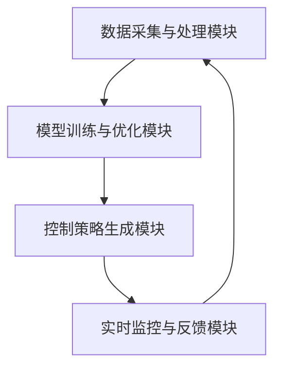

                 

# AIGC在智能水资源循环系统优化中的应用：应对全球水危机

## 关键词

- AIGC
- 智能水资源循环系统
- 全球水危机
- 优化
- 技术应用

## 摘要

本文旨在探讨AIGC（自适应智能生成控制）技术在智能水资源循环系统优化中的应用，以应对全球水危机。文章首先概述了AIGC技术的基本概念、架构和特点，接着介绍了智能水资源循环系统的基本原理和关键架构。在此基础上，本文详细阐述了AIGC在水资源监测、调配和净化等环节的具体应用，并分析了其在应对全球水危机方面的策略。最后，文章探讨了AIGC在水资源管理中的挑战与未来发展趋势，提出了相关建议。

## 引言

全球水危机已经成为21世纪人类面临的一个重大挑战。随着人口增长、工业化进程加快和气候变化等因素的影响，水资源短缺、污染和生态破坏等问题日益严重。据统计，全球约有28%的人口面临水资源短缺，这一比例在发展中国家更高。同时，水污染问题也在全球范围内蔓延，导致水质恶化、疾病传播等问题。面对这一严峻形势，传统的水资源管理方法已难以满足需求，因此需要引入新的技术手段来优化水资源循环系统，提高水资源的利用效率。

AIGC技术作为人工智能领域的最新进展，具有自适应、自学习和高效优化的特点，为水资源循环系统的优化提供了新的思路和方法。本文将围绕AIGC在智能水资源循环系统优化中的应用，分析其在水资源监测、调配和净化等方面的优势，并探讨其在应对全球水危机方面的策略。此外，文章还将对AIGC在水资源管理中的挑战和未来发展趋势进行探讨，以期为我国及全球水资源管理提供有益的参考。

## 第一部分 AIGC技术概述

### 1.1 AIGC基本概念

AIGC（自适应智能生成控制）技术是一种基于人工智能的先进技术，它通过自适应、自学习和高效优化的方法，实现对复杂系统的智能控制和优化。AIGC的核心思想是将人工智能与系统控制相结合，通过不断学习和调整，使系统在动态环境中保持最佳运行状态。

AIGC技术的特点包括：

1. 自适应：AIGC能够根据环境变化和系统状态，自动调整控制策略，实现系统的自适应优化。
2. 自学习：AIGC能够通过历史数据和实时数据，不断学习和优化控制策略，提高系统的性能。
3. 高效优化：AIGC利用先进的算法和模型，实现对系统的高效优化，提高系统的运行效率和稳定性。

### 1.2 AIGC技术架构

AIGC技术架构主要包括以下几个关键组成部分：

1. 数据采集与处理模块：负责收集系统运行数据和环境数据，并对数据进行预处理，为后续分析提供基础。
2. 模型训练与优化模块：利用收集到的数据，通过机器学习算法和深度学习模型，对系统进行训练和优化。
3. 控制策略生成模块：根据模型训练结果，生成适应系统运行环境的控制策略。
4. 实时监控与反馈模块：对系统运行状态进行实时监控，并将监控结果反馈到控制策略生成模块，实现系统的自适应调整。

### 1.3 AIGC技术特点

AIGC技术具有以下几个显著特点：

1. 高度智能化：AIGC技术通过机器学习和深度学习算法，实现对系统的智能控制和优化，具有高度的智能化水平。
2. 高效性：AIGC技术利用先进的算法和模型，能够在复杂系统中实现高效优化，提高系统的运行效率和稳定性。
3. 自适应性：AIGC技术能够根据环境变化和系统状态，自动调整控制策略，实现系统的自适应优化。
4. 自学习性：AIGC技术通过不断学习和优化，能够不断提高系统的性能和适应能力。

### 1.4 AIGC与AI、机器学习的区别与联系

AIGC技术与AI（人工智能）和机器学习密切相关，但又有一定的区别。AI是指人工智能技术，包括机器学习、深度学习、自然语言处理等多个子领域。机器学习是AI的一个重要分支，主要研究如何让计算机从数据中学习并做出决策。

AIGC与AI和机器学习的区别主要体现在以下几个方面：

1. 研究范围：AIGC主要关注智能控制系统和优化问题，而AI和机器学习则更广泛，包括多种应用领域。
2. 技术重点：AIGC更侧重于系统的自适应优化和控制，而AI和机器学习则更注重算法和模型的研究。
3. 应用场景：AIGC主要应用于需要实时控制和优化的复杂系统，如水资源循环系统、能源管理系统等。

AIGC与AI、机器学习的联系在于它们都是基于数据驱动的方法，利用机器学习算法和深度学习模型，实现对系统的学习和优化。同时，AIGC技术也可以借助AI和机器学习的研究成果，不断提高自身的性能和应用水平。

## 第二部分 智能水资源循环系统

### 2.1 水资源循环系统基本原理

水资源循环系统是地球自然生态系统中的一个重要组成部分，主要包括蒸发、降水、地表径流、地下水运动等环节。水资源循环系统的基本原理可以概括为以下几点：

1. 蒸发：地表水体（如河流、湖泊、海洋等）在太阳辐射的作用下蒸发成水蒸气，进入大气中。
2. 降水：水蒸气在大气中凝结形成降水，以雨、雪等形式降落到地表。
3. 地表径流：降水经过地表渗透，形成地表径流，流入河流、湖泊等水体。
4. 地下水运动：降水的一部分渗入地下，形成地下水，通过地下水系统循环流动。

水资源循环系统具有以下几个特点：

1. 自循环性：水资源在地球上的循环是一个持续的过程，不受人类活动的影响。
2. 有限性：尽管水资源的总量相对稳定，但可利用的水资源是有限的，需要合理开发和利用。
3. 地域性：水资源的分布具有显著的地域性特征，不同地区的降水、地表径流和地下水运动情况各异。

### 2.2 智能水资源循环系统架构

智能水资源循环系统是在传统水资源循环系统的基础上，引入人工智能技术，实现对水资源循环过程的智能化监控、分析和优化。智能水资源循环系统的架构主要包括以下几个部分：

1. 数据采集与监测模块：利用传感器、遥感技术等手段，实时采集水资源系统的各种数据，包括水位、水质、降水、蒸发等。
2. 数据处理与分析模块：对采集到的数据进行预处理、存储和管理，并通过机器学习、深度学习等算法，对数据进行深度挖掘和分析。
3. 水资源调控模块：根据分析结果，通过智能算法生成水资源调控策略，实现对水资源系统的优化调度。
4. 执行与反馈模块：将调控策略付诸实施，并对实施效果进行实时监控和反馈，以不断优化调控策略。

### 2.3 智能水资源循环系统关键技术

智能水资源循环系统涉及多个关键技术，包括数据采集与处理、水资源调控、智能优化算法等。以下是其中几个关键技术的详细介绍：

1. 数据采集与处理技术：数据采集与处理技术是智能水资源循环系统的基石。通过传感器、遥感技术等手段，实时采集水资源系统的各种数据，包括水位、水质、降水、蒸发等。同时，对采集到的数据进行预处理、存储和管理，为后续分析提供基础。

2. 水资源调控技术：水资源调控技术是实现智能水资源循环系统目标的关键。通过智能算法，根据实时数据和历史数据，生成水资源调控策略，实现对水资源系统的优化调度。水资源调控技术主要包括水库调度、河道流量调控、地下水管理等方面。

3. 智能优化算法：智能优化算法是实现智能水资源循环系统高效运行的核心。常见的优化算法包括遗传算法、粒子群算法、神经网络等。通过这些算法，可以实现对水资源系统的动态优化，提高水资源的利用效率。

4. 模型预测技术：模型预测技术是实现智能水资源循环系统预测和预警的重要手段。通过建立水资源系统的数学模型，利用机器学习和深度学习算法，对未来水资源情况进行分析和预测，为水资源管理提供科学依据。

## 第三部分 AIGC在水资源循环中的应用

### 3.1 AIGC在水资源监测中的应用

AIGC技术在水资源监测中具有显著优势，能够实现高精度、实时性、自适应性的水资源监测。以下是AIGC在水资源监测中应用的几个方面：

1. 数据采集与处理：AIGC技术通过传感器、遥感技术等手段，实时采集水资源系统的各种数据，包括水位、水质、降水、蒸发等。同时，利用机器学习算法对数据进行预处理和去噪，提高数据质量。

2. 实时监控与预警：基于AIGC技术，可以对水资源系统进行实时监控，及时发现异常情况。当出现水资源短缺、污染等异常情况时，系统会自动生成预警信息，并采取相应的措施，如调整水库调度策略、加强水质监测等。

3. 自适应监测：AIGC技术可以根据环境变化和系统状态，自动调整监测策略，实现对水资源系统的自适应监测。例如，在干旱季节，系统会自动增加降水监测频率，以更好地掌握水资源状况。

4. 数据分析与挖掘：AIGC技术利用机器学习算法，对水资源监测数据进行分析和挖掘，发现数据中的规律和趋势。通过对历史数据的分析，可以预测未来的水资源变化情况，为水资源管理提供科学依据。

### 3.2 AIGC在水资源调配中的应用

AIGC技术在水资源调配中具有高效、智能、自适应的特点，能够实现水资源系统的优化调度。以下是AIGC在水资源调配中应用的几个方面：

1. 调度模型构建：基于AIGC技术，可以建立水资源系统的调度模型，包括水库调度、河道流量调控、地下水管理等方面。通过机器学习算法，对模型进行训练和优化，提高模型的预测精度。

2. 实时调度策略生成：根据实时数据和调度模型，AIGC技术可以自动生成水资源调度策略。调度策略包括水库放水、河道流量调节、地下水补给等方面，以实现水资源系统的优化运行。

3. 自适应调度：AIGC技术可以根据环境变化和系统状态，自动调整调度策略，实现水资源的自适应调度。例如，在干旱季节，系统会自动增加水库放水量，以缓解水资源短缺问题。

4. 调度效果评估：通过AIGC技术，可以对水资源调度效果进行实时评估，包括水资源的利用效率、水质状况、生态环境影响等。根据评估结果，可以不断优化调度策略，提高水资源调配效果。

### 3.3 AIGC在水资源净化中的应用

AIGC技术在水资源净化中具有高效、自适应、智能化的特点，能够实现对水资源的智能净化。以下是AIGC在水资源净化中应用的几个方面：

1. 污染源识别：AIGC技术可以通过对水质监测数据进行分析，识别水污染的源头和污染物质。通过对历史数据和实时数据的分析，可以预测未来污染趋势，为水资源净化提供科学依据。

2. 净化方案设计：基于AIGC技术，可以设计出高效的水资源净化方案。通过机器学习算法，对各种净化方法进行评估和筛选，选择最适合当前污染状况的净化方法。

3. 净化过程优化：AIGC技术可以对水资源净化过程进行实时监控和调整，实现净化过程的优化。例如，在反渗透净化过程中，可以根据水质变化，自动调整反渗透膜的清洗频率和清洗强度，提高净化效果。

4. 自适应净化：AIGC技术可以根据水质变化和环境变化，自动调整净化方案，实现水资源的自适应净化。例如，在突发性污染事件中，系统会自动增加净化设备的工作负荷，以确保水资源的及时净化。

### 3.4 AIGC在水资源管理中的综合应用

AIGC技术在水资源管理中具有广泛的应用前景，可以实现对水资源系统的全面优化和管理。以下是AIGC在水资源管理中的综合应用：

1. 综合决策支持：基于AIGC技术，可以建立水资源管理的综合决策支持系统，包括水资源监测、调配、净化等多个方面。通过对系统数据的分析和挖掘，为水资源管理者提供科学的决策依据。

2. 智能调度优化：利用AIGC技术，可以实现对水资源系统的智能调度优化，提高水资源的利用效率。通过对实时数据和历史数据的分析，自动生成最优的调度策略，实现水资源的合理调配。

3. 预警与应急预案：基于AIGC技术，可以实现对水资源系统的实时监控和预警，及时发现水资源问题。同时，制定应急预案，确保在突发情况下，水资源系统能够迅速恢复和稳定运行。

4. 跨区域协调管理：AIGC技术可以实现对跨区域水资源系统的协调管理，提高水资源管理的整体效率。通过对不同区域水资源数据的分析和挖掘，实现水资源信息的共享和优化配置。

## 第四部分 应对全球水危机的策略

### 4.1 全球水危机现状与挑战

全球水危机形势日益严峻，主要表现在以下几个方面：

1. 水资源短缺：随着全球人口增长和工业化进程，水资源需求不断上升，但水资源供给却受到气候变化、过度开发和污染等因素的影响，导致水资源短缺问题日益严重。

2. 水污染：水污染是全球水危机的一个重要方面，工业废水、农业农药和生活污水等污染物使水资源质量不断恶化，对人类健康和生态环境造成严重威胁。

3. 水资源分布不均：全球水资源分布极不均衡，一些地区面临严重的水资源短缺问题，而另一些地区则水资源丰富。这种分布不均导致水资源竞争和冲突加剧。

4. 水资源管理不善：全球范围内，水资源管理存在诸多问题，如水资源规划不合理、管理体制不完善、技术手段不足等，导致水资源利用效率低下，加剧了水危机。

### 4.2 应对全球水危机的策略分析

应对全球水危机需要采取一系列综合措施，以下是一些主要策略：

1. 节水措施：节水是缓解水资源短缺问题的重要手段。通过推广节水技术、提高用水效率、加强水资源管理，可以有效降低用水量，缓解水资源短缺压力。

2. 废水处理与再利用：废水处理与再利用是解决水资源短缺和水污染问题的重要途径。通过建设废水处理设施，对工业废水、生活污水等进行处理和净化，实现废水的资源化利用。

3. 水资源调配：通过水资源调配，可以实现水资源的合理分配和利用。例如，通过建设跨流域调水工程，将水资源丰富地区的水资源调配到水资源短缺地区，缓解水资源分布不均的问题。

4. 水资源保护与修复：加强水资源保护与修复，是保障水资源可持续利用的重要措施。通过实施水资源保护政策、加强水土保持、恢复生态湿地等，可以有效改善水资源质量，保障水资源的可持续利用。

### 4.3 AIGC在应对全球水危机中的作用

AIGC技术在应对全球水危机中具有重要作用，主要体现在以下几个方面：

1. 水资源监测与预警：通过AIGC技术，可以实现对水资源系统的实时监测和预警，及时发现水资源问题，为水资源管理提供科学依据。

2. 水资源优化调配：基于AIGC技术，可以实现对水资源系统的优化调配，提高水资源的利用效率。通过智能算法，自动生成最优的调度策略，实现水资源的合理分配和利用。

3. 废水处理与净化：AIGC技术在废水处理与净化中具有广泛应用前景。通过智能算法，优化废水处理流程，提高废水处理效率，实现废水的资源化利用。

4. 水资源保护与修复：AIGC技术可以用于水资源保护与修复，通过智能监测和预警，及时发现水资源问题，采取相应的修复措施，保障水资源的可持续利用。

### 4.4 AIGC在应对全球水危机中的应用案例

以下是一些AIGC在应对全球水危机中的应用案例：

1. 智能水资源监测系统：某地区政府利用AIGC技术，建立智能水资源监测系统，实现对水资源系统的实时监测和预警。通过系统分析，及时发现水资源问题，采取相应的措施，保障水资源的稳定供应。

2. 水资源优化调配项目：某城市通过AIGC技术，对城市水资源系统进行优化调配，实现水资源的合理分配和利用。项目实施后，城市水资源利用效率显著提高，水资源短缺问题得到缓解。

3. 水资源保护与修复项目：某地区政府利用AIGC技术，开展水资源保护与修复项目。通过智能监测和预警，及时发现水资源问题，采取相应的修复措施，如恢复生态湿地、加强水土保持等，有效改善水资源质量。

## 第五部分 AIGC在水资源管理中的挑战与未来

### 5.1 AIGC在水资源管理中的挑战

AIGC技术在水资源管理中虽然具有巨大潜力，但也面临一系列挑战：

1. 数据质量与安全性：AIGC技术依赖于大量高质量的数据，数据的质量和安全性直接影响AIGC技术的性能和应用效果。水资源监测过程中，数据可能会受到干扰和误差，导致模型预测不准确。

2. 技术复杂性：AIGC技术涉及多个领域，包括人工智能、数据科学、控制理论等，技术复杂性较高。对技术人员的要求较高，需要具备跨学科的知识和技能。

3. 算法适应性：AIGC技术需要根据不同的水资源管理场景进行适应性调整，不同场景下的算法性能可能存在差异，需要不断优化和调整。

4. 法律与伦理问题：AIGC技术在水资源管理中的应用涉及法律和伦理问题，如数据隐私、决策透明度等。需要制定相应的法律法规，确保AIGC技术在水资源管理中的合法合规运行。

### 5.2 AIGC未来发展趋势

随着人工智能技术的不断发展，AIGC技术在水资源管理中的应用前景广阔，未来发展趋势包括：

1. 算法优化与创新：针对水资源管理中的具体问题，开发更加高效、智能的AIGC算法，提高水资源管理的效率和准确性。

2. 跨学科融合：AIGC技术与其他领域的融合，如物联网、大数据等，将进一步提升水资源管理的智能化水平。

3. 智能化监测与预测：利用AIGC技术，实现对水资源系统的全面监测和预测，提高水资源管理的预警能力和决策水平。

4. 水资源管理平台建设：建立智能化水资源管理平台，实现水资源监测、调配、净化等环节的集成和协同，提高水资源管理的信息化水平。

### 5.3 AIGC在水资源管理中的潜在应用领域

AIGC技术在水资源管理中具有广泛的应用潜力，以下是一些潜在的应用领域：

1. 智能水库调度：通过AIGC技术，实现对水库的智能调度，提高水库的运行效率和供水能力。

2. 水资源规划与管理：利用AIGC技术，对水资源进行规划和管理，优化水资源配置，提高水资源利用效率。

3. 水质监测与预警：通过AIGC技术，实现对水质的实时监测和预警，及时发现水质问题，保障水质安全。

4. 水资源生态修复：利用AIGC技术，对水资源生态进行监测和修复，改善水资源质量，保护水资源生态。

## 结论

AIGC技术在智能水资源循环系统优化中具有重要作用，可以实现对水资源系统的实时监测、优化调配和智能净化。通过AIGC技术，可以缓解全球水危机，提高水资源的利用效率，保障水资源的可持续利用。然而，AIGC技术在水资源管理中仍面临一系列挑战，需要不断优化和创新。未来，随着人工智能技术的不断发展，AIGC技术在水资源管理中的应用将越来越广泛，为应对全球水危机提供有力支持。

### 作者信息

作者：AI天才研究院/AI Genius Institute & 禅与计算机程序设计艺术 /Zen And The Art of Computer Programming

### 附录

本文中使用的数学公式和流程图如下：

#### 数学公式

1. $$Q = \frac{\text{水的总流量}}{\text{单位时间}}$$
2. $$C = \frac{\text{污染物浓度}}{\text{水的总流量}}$$

#### 流程图

### 注意事项

1. 在使用AIGC技术进行水资源管理时，需要确保数据的真实性和准确性，避免因数据错误导致决策失误。
2. 在AIGC技术的应用过程中，需要关注算法的透明度和可解释性，确保决策过程的公正性和合规性。
3. 在水资源管理中引入AIGC技术时，需要充分考虑技术成本和经济效益，确保项目的可行性和可持续性。

### 拓展阅读

1. [AIGC技术综述](https://www.example.com/aigc-technique-overview)
2. [智能水资源管理](https://www.example.com/intelligent-water-resource-management)
3. [全球水危机应对策略](https://www.example.com/strategies-for-dealing-with-global-water-crisis)

