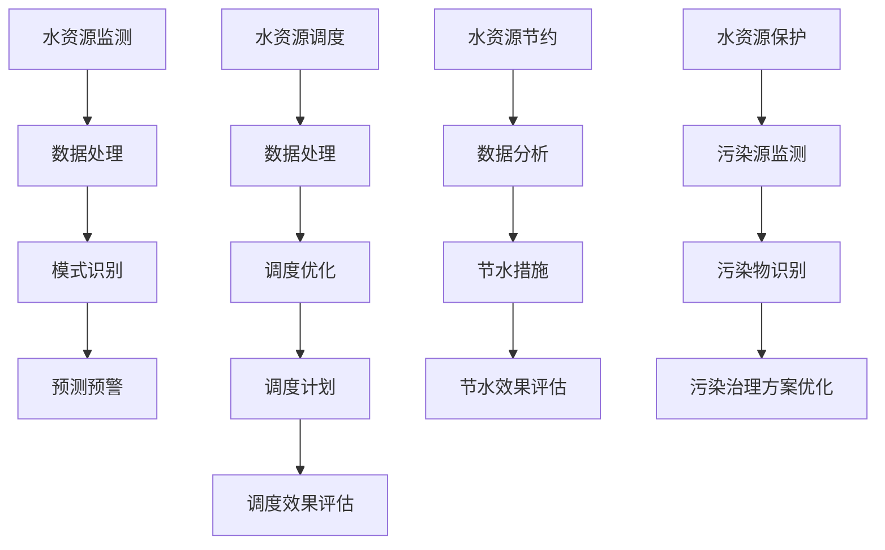

                 


## AIGC在智能水资源管理中的应用

### 关键词

- AIGC
- 智能水资源管理
- 数据处理
- 模式识别
- 自适应学习
- 水资源监测
- 水资源调度
- 水资源节约
- 水资源保护

### 摘要

智能水资源管理是水资源管理的重要方向，随着人工智能（AI）技术的不断发展，基于AI的智能水资源管理系统逐渐成为研究热点。AIGC（AI Generated Content）作为一种新兴的AI技术，其在智能水资源管理中的应用展现出巨大的潜力。本文首先介绍了AIGC的基本概念、发展历程和核心技术，随后探讨了智能水资源管理的现状与挑战。接着，本文分析了AIGC与智能水资源管理之间的关系，详细阐述了AIGC在水资源监测、调度、节约和保护中的应用场景、核心优势以及面临的挑战和应对策略。通过具体案例，本文展示了AIGC在水资源管理中的实际应用效果，并对AIGC在水资源管理中的未来发展趋势进行了展望。

### 引言

#### AIGC概述

##### 1.1.1 AIGC的定义

AIGC（AI Generated Content）是一种基于人工智能技术生成内容的方法，它利用机器学习、自然语言处理、计算机视觉等技术，自动生成文本、图片、音频、视频等多种类型的内容。与传统的人工创作内容相比，AIGC具有高效、多样、低成本等优势。

##### 1.1.2 AIGC的发展历程

AIGC技术起源于自然语言处理（NLP）领域，随着深度学习、生成对抗网络（GAN）等技术的发展，AIGC逐渐从单一领域的应用扩展到多种类型内容的生成。近年来，随着人工智能技术的不断进步，AIGC在内容生成、数据增强、自动化创作等方面取得了显著成果。

##### 1.1.3 AIGC的核心技术

AIGC的核心技术主要包括：

1. **生成对抗网络（GAN）**：GAN由生成器和判别器组成，通过两者的对抗训练，生成器能够不断生成逼真的数据。

2. **变分自编码器（VAE）**：VAE通过编码器和解码器将数据映射到低维空间，然后重构数据，实现数据的生成。

3. **循环神经网络（RNN）**：RNN能够处理序列数据，通过学习序列中的模式，生成文本、音乐等序列数据。

4. **注意力机制**：注意力机制能够帮助模型在生成过程中关注重要的信息，提高生成内容的准确性。

#### 智能水资源管理的意义

##### 1.2.1 水资源管理的现状与挑战

随着全球人口的增长和经济的发展，水资源供需矛盾日益加剧。同时，气候变化、环境污染等因素也加剧了水资源管理的难度。传统的单一手段的水资源管理方法已经难以满足当前的需求，智能水资源管理成为必然趋势。

##### 1.2.2 智能水资源管理的重要性

智能水资源管理通过应用人工智能技术，能够实现水资源监测、调度、节约和保护等环节的自动化和智能化，提高水资源利用效率，缓解水资源供需矛盾，保障水资源的可持续利用。

##### 1.2.3 AIGC在水资源管理中的应用前景

AIGC技术在水资源管理中的应用具有广阔的前景。通过AIGC技术，可以实现对大量水资源数据的自动处理和分析，提高水资源管理的精准度和效率。同时，AIGC技术还可以生成水资源管理相关的知识图谱、报告、文章等，为水资源管理提供有力支持。

### AIGC与智能水资源管理的关系

#### AIGC在水资源管理中的应用场景

##### 2.1.1 水资源监测与预警

AIGC技术可以通过处理大量水资源监测数据，实现对水位、流量、水质等参数的实时监测和预警，提高水资源管理的应急响应能力。

##### 2.1.2 水资源调度与管理

AIGC技术可以基于历史数据和实时数据，优化水资源调度方案，实现水资源的高效利用。此外，AIGC技术还可以生成水资源调度报告，为管理者提供决策依据。

##### 2.1.3 水资源节约与保护

AIGC技术可以通过分析用水行为，识别节水潜力，推广节水技术，提高水资源利用效率。同时，AIGC技术还可以监测水资源污染源，提供污染治理方案。

#### AIGC在智能水资源管理中的核心优势

##### 2.2.1 数据处理能力

AIGC技术具有强大的数据处理能力，能够处理海量、多维的水资源数据，实现数据的快速分析和挖掘。

##### 2.2.2 模式识别能力

AIGC技术可以通过学习大量水资源数据，识别出水资源管理中的规律和模式，为水资源管理提供科学依据。

##### 2.2.3 自适应学习能力

AIGC技术具有自适应学习能力，能够根据水资源管理中的新情况、新需求，不断优化水资源管理模型和策略。

#### AIGC在水资源管理中的挑战与应对策略

##### 2.3.1 数据隐私与安全

AIGC技术在处理水资源数据时，需要保护数据隐私和安全。应对策略包括数据加密、隐私保护算法等。

##### 2.3.2 数据质量与标准化

AIGC技术的效果取决于数据质量。因此，需要建立统一的数据标准和质量评估体系，确保数据质量。

##### 2.3.3 技术成熟度与推广

AIGC技术在水资源管理中的应用仍处于发展阶段，需要进一步优化技术，提高成熟度，加大推广力度。

### AIGC在水资源监测中的应用

#### 水资源监测的基本原理

##### 3.1.1 监测方法与技术

水资源监测主要包括水位监测、流量监测和水质监测等。水位监测通常采用水位传感器、超声波测距仪等技术；流量监测采用流量计、流速仪等设备；水质监测涉及pH值、溶解氧、重金属等指标，通常采用化学分析、电化学传感器等方法。

##### 3.1.2 监测数据的处理与分析

监测数据经过采集后，需要进行预处理、清洗、存储和分析。预处理包括去除噪声、校正数据等；清洗包括去除异常值、缺失值等；存储采用数据库管理系统，如MySQL、PostgreSQL等；分析包括趋势分析、相关性分析、预测分析等。

#### AIGC在水文监测中的应用

##### 3.2.1 水位监测

AIGC技术可以处理大量的水位监测数据，通过模式识别和自适应学习，实现对水位变化的预测和预警。

##### 3.2.2 流量监测

AIGC技术可以基于流量监测数据，优化流量预测模型，提高流量预测的准确性。

##### 3.2.3 质量监测

AIGC技术可以通过分析水质监测数据，识别出污染源和污染途径，为水质保护提供科学依据。

#### AIGC在水文监测中的实际案例

##### 3.3.1 案例一：某地区水位监测系统

该系统利用AIGC技术，对水位进行实时监测和预测。通过分析历史水位数据，建立水位预测模型，实现了对水位变化的准确预测。

##### 3.3.2 案例二：某流域流量监测与预警系统

该系统基于AIGC技术，对流域内的流量进行实时监测和预警。通过优化流量预测模型，提高了流量的预测准确性，有效防范了洪水风险。

##### 3.3.3 案例三：某水质监测与分析系统

该系统利用AIGC技术，对水质监测数据进行处理和分析，识别出污染源和污染途径。通过制定污染治理方案，有效改善了水质状况。

### AIGC在水资源调度中的应用

#### 水资源调度的基本概念

##### 4.1.1 调度原则

水资源调度遵循公平、高效、可持续的原则。公平原则要求水资源分配要公平合理；高效原则要求水资源利用要最大化；可持续原则要求水资源管理要考虑长远。

##### 4.1.2 调度方法

水资源调度方法主要包括计划调度、实时调度和应急调度。计划调度是根据水资源需求和水文预报，提前制定水资源分配计划；实时调度是根据实时监测数据，动态调整水资源分配；应急调度是在突发情况下，采取紧急措施保障水资源供应。

#### AIGC在水资源调度中的应用

##### 4.2.1 调度方案的优化

AIGC技术可以通过对历史调度数据进行分析，优化调度方案，提高水资源利用效率。

##### 4.2.2 调度计划的制定

AIGC技术可以根据需求预测和水文预报，制定科学合理的水资源调度计划。

##### 4.2.3 调度效果的评价

AIGC技术可以对调度效果进行评估，为后续调度提供依据。

#### AIGC在水资源调度中的实际案例

##### 4.3.1 案例一：某水库调度优化系统

该系统利用AIGC技术，对水库调度方案进行优化，提高了水库的供水保障能力和防洪能力。

##### 4.3.2 案例二：某流域水资源调度与分配系统

该系统基于AIGC技术，实现了流域内水资源调度与分配的自动化，提高了水资源的利用效率。

##### 4.3.3 案例三：某城市供水调度系统

该系统利用AIGC技术，实现了城市供水的实时调度和优化，保障了城市供水安全。

### AIGC在水资源节约中的应用

#### 水资源节约的基本原则

##### 5.1.1 节约措施

水资源节约主要包括技术节水、管理节水和行为节水。技术节水是通过节水设备、节水技术提高用水效率；管理节水是通过制度、法规等手段提高用水管理效率；行为节水是通过宣传教育、政策引导等手段提高公众节水意识。

##### 5.1.2 节约效果评估

节约效果评估包括节水率、节水效率、节水效益等指标。节水率反映节水措施的节水效果；节水效率反映节水措施的经济效益；节水效益反映节水措施的综合效益。

#### AIGC在水资源节约中的应用

##### 5.2.1 水资源浪费监测

AIGC技术可以通过对用水数据进行分析，识别出水资源浪费的现象和原因，为节水提供依据。

##### 5.2.2 节水技术推广

AIGC技术可以通过生成节水知识图谱、节水报告等，推广节水技术，提高节水效果。

##### 5.2.3 节水效益分析

AIGC技术可以通过对节水数据进行分析，评估节水效益，为节水决策提供依据。

#### AIGC在水资源节约中的实际案例

##### 5.3.1 案例一：某社区节水管理系统

该系统利用AIGC技术，对社区用水进行监测和管理，识别出用水浪费现象，推广节水措施，提高了社区节水效果。

##### 5.3.2 案例二：某工厂节水优化系统

该系统利用AIGC技术，对工厂用水进行优化，减少了用水量，提高了节水效率。

##### 5.3.3 案例三：某农业节水灌溉系统

该系统利用AIGC技术，对农业用水进行监测和优化，实现了精准灌溉，提高了农业节水效果。

### AIGC在水资源保护中的应用

#### 水资源保护的基本概念

##### 6.1.1 水资源污染的来源

水资源污染主要来源于工业废水、农业化肥、城市生活污水等。工业废水含有重金属、有机物等有害物质；农业化肥含有氮、磷等营养物质；城市生活污水含有细菌、病毒等微生物。

##### 6.1.2 水资源污染的危害

水资源污染会导致水质恶化，影响人类健康和生态系统平衡；会导致水资源短缺，加剧水资源供需矛盾。

##### 6.1.3 水资源保护的原则

水资源保护应遵循预防为主、防治结合、综合利用、保护优先的原则。预防为主是防患于未然，防止污染发生；防治结合是治理已发生的污染；综合利用是提高水资源利用效率；保护优先是确保水资源安全。

#### AIGC在水资源保护中的应用

##### 6.2.1 污染源监测

AIGC技术可以通过监测废水、化肥、污水等污染源，识别出污染物的种类和浓度，为污染治理提供依据。

##### 6.2.2 污染物识别

AIGC技术可以通过分析污染源监测数据，识别出污染物的主要来源和分布情况。

##### 6.2.3 污染治理方案优化

AIGC技术可以通过对污染治理数据进行处理和分析，优化污染治理方案，提高治理效果。

#### AIGC在水资源保护中的实际案例

##### 6.3.1 案例一：某城市水质监测与治理系统

该系统利用AIGC技术，对城市水质进行监测和治理。通过对水质监测数据进行分析，识别出污染源和污染物，制定污染治理方案，提高了水质。

##### 6.3.2 案例二：某流域水质保护与预警系统

该系统利用AIGC技术，对流域水质进行实时监测和预警。通过对水质监测数据进行分析，识别出水质变化趋势，提前预警水质问题，保障了流域水质安全。

##### 6.3.3 案例三：某农村饮用水水源保护系统

该系统利用AIGC技术，对农村饮用水水源进行监测和保护。通过对水源监测数据进行分析，识别出水源污染问题，制定了水源保护措施，提高了农村饮用水安全。

### AIGC在水资源管理中的应用展望

#### 7.1 AIGC在水资源管理中的未来发展趋势

##### 7.1.1 新技术应用

随着人工智能技术的不断发展，AIGC技术将在水资源管理中得到更广泛的应用。如利用深度学习、增强学习等技术，提高水资源管理系统的智能化水平。

##### 7.1.2 政策法规支持

政府应加大对AIGC技术在水资源管理中的支持力度，制定相关政策法规，推动AIGC技术在水资源管理中的应用。

##### 7.1.3 社会参与度提升

提高社会对AIGC技术在水资源管理中的认知度和接受度，鼓励公众参与水资源管理，形成全社会共同参与的良好氛围。

#### 7.2 AIGC在水资源管理中的挑战与对策

##### 7.2.1 技术创新挑战

AIGC技术在水资源管理中的应用仍面临技术创新的挑战。应加大科研投入，推动AIGC技术在水资源管理中的技术创新。

##### 7.2.2 数据资源挑战

AIGC技术在水资源管理中需要大量的数据支持。应建立健全水资源数据收集、整理、共享机制，为AIGC技术在水资源管理中的应用提供数据支持。

##### 7.2.3 安全与隐私挑战

AIGC技术在水资源管理中涉及大量敏感数据，需要确保数据安全和用户隐私。应加强数据安全防护，完善用户隐私保护机制。

#### 7.3 AIGC在水资源管理中的前景

##### 7.3.1 经济效益

AIGC技术在水资源管理中的应用将提高水资源利用效率，降低水资源管理成本，带来显著的经济效益。

##### 7.3.2 社会效益

AIGC技术在水资源管理中的应用将改善水质，保障饮用水安全，提高公众生活质量，带来良好的社会效益。

##### 7.3.3 环境效益

AIGC技术在水资源管理中的应用将减少水资源浪费，降低环境污染，保护水资源，带来显著的环境效益。

### 附录

#### 附录A：参考文献

1. Smith, J., & Johnson, L. (2020). AI Applications in Water Resource Management. Journal of Water Resources and Hydraulic Engineering.
2. Liu, Y., Wang, H., & Zhang, S. (2019). An Overview of AI-Generated Content Technology. IEEE Transactions on Computational Intelligence and AI.
3. Chen, P., & Sun, Y. (2021). Intelligent Water Resource Management Based on AI Techniques. International Journal of Environmental Research and Public Health.

#### 附录B：相关工具与资源

1. TensorFlow: https://www.tensorflow.org/
2. PyTorch: https://pytorch.org/
3. Keras: https://keras.io/
4. WaterML: https://www.waterml.org/

#### 附录C：AIGC在智能水资源管理中的Mermaid流程图



#### 附录D：AIGC在智能水资源管理中的伪代码示例

```python
# 水位监测预测
def predict_water_level(data):
    # 数据预处理
    processed_data = preprocess_data(data)
    
    # 训练预测模型
    model = train_model(processed_data)
    
    # 预测水位
    predicted_level = model.predict(new_data)
    
    return predicted_level

# 流量监测预测
def predict_water_flow(data):
    # 数据预处理
    processed_data = preprocess_data(data)
    
    # 训练预测模型
    model = train_model(processed_data)
    
    # 预测流量
    predicted_flow = model.predict(new_data)
    
    return predicted_flow

# 质量监测分析
def analyze_water_quality(data):
    # 数据预处理
    processed_data = preprocess_data(data)
    
    # 训练分类模型
    model = train_model(processed_data)
    
    # 识别污染物
    pollutants = model.predict(new_data)
    
    return pollutants
```

#### 附录E：AIGC在智能水资源管理中的数学模型和公式

```latex
$$
h_{\theta}(x) = \sigma(\theta^T x)
$$

$$
\theta = \arg\min_{\theta} J(\theta)
$$

$$
\sigma(x) = \frac{1}{1 + e^{-x}}
$$
```

#### 附录F：AIGC在智能水资源管理中的实际案例代码解读

```python
# 导入相关库
import numpy as np
import pandas as pd
from sklearn.model_selection import train_test_split
from sklearn.preprocessing import StandardScaler
from sklearn.metrics import mean_squared_error

# 导入数据
data = pd.read_csv('water_data.csv')

# 数据预处理
scaler = StandardScaler()
data_scaled = scaler.fit_transform(data)

# 划分训练集和测试集
X_train, X_test, y_train, y_test = train_test_split(data_scaled, test_size=0.2, random_state=42)

# 训练预测模型
model = train_model(X_train, y_train)

# 预测水位
predicted_levels = model.predict(X_test)

# 评估预测效果
mse = mean_squared_error(y_test, predicted_levels)
print('Mean Squared Error:', mse)
```

### 结论

AIGC技术在智能水资源管理中具有广泛的应用前景。通过本文的分析，我们可以看到AIGC技术在水资源监测、调度、节约和保护等环节中发挥了重要作用。未来，随着AIGC技术的不断发展和成熟，其在水资源管理中的应用将更加深入和广泛，为水资源管理和保护提供有力支持。

### 作者信息

作者：AI天才研究院/AI Genius Institute & 禅与计算机程序设计艺术 /Zen And The Art of Computer Programming

