                 

# 《AIGC在智能能源消耗优化中的应用》

## 摘要

本文探讨了AIGC（AI-Generated Content）在智能能源消耗优化中的应用。随着全球能源需求的不断增长和环境保护意识的提高，智能能源消耗优化成为了一个重要研究领域。AIGC技术，作为人工智能的一个前沿领域，其在生成内容、数据分析和预测方面具有显著优势。本文首先介绍了AIGC的基本概念和核心技术，包括生成对抗网络（GAN）、变分自编码器（VAE）和强化学习（RL）。接着，本文详细阐述了能源消耗优化的原理和关键因素，如数据质量、模型准确性和算法效率。随后，本文重点分析了AIGC在能源消耗优化中的应用，包括数据采集与预处理、模型训练与优化以及模型部署与评估。通过两个实际案例，本文展示了AIGC技术在智能电网和智能建筑中的成功应用。最后，本文提出了AIGC技术发展趋势和能源消耗优化领域的挑战与机遇，并对未来研究进行了展望。

## 关键词

- AIGC
- 智能能源消耗优化
- 生成对抗网络（GAN）
- 变分自编码器（VAE）
- 强化学习（RL）
- 数据采集与预处理
- 模型训练与优化
- 模型部署与评估

## 1. 引言

### 1.1 AIGC的基本概念

AIGC（AI-Generated Content）是指通过人工智能技术生成内容的一种方式，它涵盖了文本、图像、音频等多种形式。AIGC技术的发展始于深度学习尤其是生成对抗网络（GAN）的提出。GAN由Ian Goodfellow等人于2014年提出，是一种由两个神经网络（生成器G和判别器D）组成的对抗性模型。生成器G的任务是生成逼真的数据，而判别器D的任务是区分生成的数据和真实数据。通过不断训练，生成器和判别器在相互对抗中逐渐提高性能，生成逼真的数据。

AIGC的核心技术还包括变分自编码器（VAE）和强化学习（RL）。VAE是一种无监督学习模型，由编码器和解码器组成，通过概率分布来生成数据。强化学习是一种通过试错来学习最优策略的机器学习技术，广泛应用于决策问题和优化问题。

### 1.2 AIGC的发展历程

AIGC技术的发展历程可以追溯到生成对抗网络的提出。2014年，Ian Goodfellow等人发表了GAN的论文，标志着AIGC技术的诞生。随后，VAE和强化学习等技术在AIGC领域也得到了广泛应用。2022年，随着生成对抗网络在图像生成、文本生成和音频生成等领域的成功应用，AIGC技术逐渐成为人工智能领域的一个热点。

### 1.3 AIGC的核心技术

AIGC的核心技术主要包括生成对抗网络（GAN）、变分自编码器（VAE）和强化学习（RL）。

#### 生成对抗网络（GAN）

GAN由生成器G和判别器D组成。生成器G接收随机噪声作为输入，生成与真实数据相似的数据。判别器D的任务是区分生成的数据和真实数据。GAN的训练过程是一个对抗性训练过程，生成器和判别器在相互对抗中不断迭代，以达到最优性能。

#### 变分自编码器（VAE）

VAE是一种无监督学习模型，由编码器和解码器组成。编码器将输入数据编码为一个概率分布，解码器则根据这个概率分布生成数据。VAE通过引入概率分布，使得生成的数据具有更好的多样性和真实感。

#### 强化学习（RL）

强化学习是一种通过试错来学习最优策略的机器学习技术。在AIGC领域，强化学习常用于生成数据的质量优化和生成过程的控制。通过奖励机制，强化学习可以指导生成器生成高质量的数据。

### 1.4 智能能源消耗优化的重要性

智能能源消耗优化是指通过应用先进的技术和方法，降低能源消耗，提高能源利用效率的过程。随着全球能源需求的不断增长和环境保护意识的提高，智能能源消耗优化成为了一个重要研究领域。

智能能源消耗优化的重要性体现在以下几个方面：

- 降低能源消耗：通过智能能源消耗优化，可以降低能源消耗，减少能源浪费，提高能源利用效率。
- 降低运营成本：智能能源消耗优化可以帮助企业和个人降低能源消耗，从而降低运营成本。
- 促进环境保护：智能能源消耗优化可以减少能源消耗，降低温室气体排放，促进环境保护。
- 提高能源安全性：智能能源消耗优化可以通过预测能源需求和供应，提高能源供应的稳定性，保障能源安全。

### 1.5 智能能源消耗优化的现状

当前，智能能源消耗优化技术已取得显著进展。例如，智能电网技术可以实时监测和调整电力供需，提高电力系统的效率。智能建筑技术可以通过自动化控制系统，降低能源消耗，提高建筑物的能源利用效率。此外，智能能源管理系统和能源预测技术也在不断发展，为智能能源消耗优化提供了强有力的技术支持。

### 1.6 智能能源消耗优化的挑战与机遇

智能能源消耗优化面临着一系列挑战，如数据质量、模型准确性和算法效率等。同时，随着AIGC技术的发展，智能能源消耗优化也迎来了新的机遇。通过应用AIGC技术，可以实现对能源消耗数据的深度挖掘和分析，提高能源消耗优化的效果。

## 2. AIGC技术概述

### 2.1 AIGC的核心技术

AIGC技术的核心包括生成对抗网络（GAN）、变分自编码器（VAE）和强化学习（RL）。

#### 生成对抗网络（GAN）

生成对抗网络（GAN）由生成器（Generator）和判别器（Discriminator）组成。生成器的任务是生成与真实数据相似的数据，而判别器的任务是区分生成的数据和真实数据。GAN的训练过程是一个生成器与判别器的对抗过程，生成器不断优化其生成的数据，使得判别器无法区分生成的数据和真实数据。GAN的核心算法可以描述如下：

```python
# 生成器的伪代码
def generator(z):
    # z是随机噪声
    x_gan = Dense(units=100, activation='relu')(z)
    x_gan = Dense(units=784, activation='tanh')(x_gan)
    return Model(inputs=z, outputs=x_gan)

# 判别器的伪代码
def discriminator(x):
    x_disc = Dense(units=100, activation='relu')(x)
    x_disc = Dense(units=1, activation='sigmoid')(x_disc)
    return Model(inputs=x, outputs=x_disc)

# GAN模型
def GAN(generator, discriminator):
    z = Input(shape=(100,))
    x_gan = generator(z)
    x_real = Input(shape=(784,))
    valid = discriminator(x_real)
    fake = discriminator(x_gan)
    model = Model(inputs=[z, x_real], outputs=[valid, fake])
    return model
```

#### 变分自编码器（VAE）

变分自编码器（VAE）是一种无监督学习模型，其目的是通过学习数据的概率分布来生成新的数据。VAE由编码器（Encoder）和解码器（Decoder）组成。编码器将输入数据映射到一个潜变量空间，解码器则从潜变量空间生成新的数据。VAE的核心算法可以描述如下：

```python
# 编码器的伪代码
def encoder(x):
    z_mean = Dense(units=20, activation='relu')(x)
    z_log_var = Dense(units=20, activation='relu')(x)
    z = Lambda(sampling)([z_mean, z_log_var])
    return Model(inputs=x, outputs=[z_mean, z_log_var, z])

# 解码器的伪代码
def decoder(z):
    x_decoded_mean = Dense(units=784, activation='tanh')(z)
    return Model(inputs=z, outputs=x_decoded_mean)

# VAE模型
def VAE(encoder, decoder):
    z_mean, z_log_var, z = encoder(x)
    x_decoded_mean = decoder(z)
    x = Input(shape=(784,))
    x_mean, x_log_var, x_recon = encoder(x), decoder(z)
    vae = Model(inputs=x, outputs=[x_mean, x_log_var, x_recon])
    return vae
```

#### 强化学习（RL）

强化学习（RL）是一种通过试错来学习最优策略的机器学习技术。在AIGC领域，强化学习主要用于优化生成过程。RL的核心算法是值函数和策略函数。值函数评估状态的价值，策略函数选择最优动作。RL的核心算法可以描述如下：

```python
# 值函数
def value_function(Q, state, action):
    return Q[state, action]

# 策略函数
def policy(Q, state):
    return np.argmax(Q[state, :])

# 强化学习迭代过程
for episode in range(1000):
    state = env.reset()
    done = False
    total_reward = 0
    while not done:
        action = policy(Q, state)
        next_state, reward, done, _ = env.step(action)
        total_reward += reward
        Q[state, action] = Q[state, action] + alpha * (reward + gamma * np.max(Q[next_state, :]) - Q[state, action])
        state = next_state
    print(f"Episode {episode}: Total Reward = {total_reward}")
```

### 2.2 AIGC在能源领域的应用

AIGC技术在能源领域的应用主要包括能源预测、能源管理和能源优化。

#### 能源预测

能源预测是AIGC技术在能源领域的重要应用之一。通过应用GAN、VAE和强化学习等技术，可以实现对能源需求的预测。能源预测对于电力系统和能源管理具有重要意义，可以帮助企业和政府更好地规划能源生产和分配。

```mermaid
graph LR
A[能源需求] --> B[GAN/VAE/R
B --> C[预测模型]
C --> D[电力系统]
D --> E[能源管理]
```

#### 能源管理

能源管理是指通过应用先进的技术和方法，降低能源消耗，提高能源利用效率的过程。AIGC技术可以应用于能源管理，通过数据分析和预测，实现能源消耗的优化。例如，通过应用GAN和VAE技术，可以实现对电力需求的预测，从而优化电力生产和分配。

```mermaid
graph LR
A[电力需求] --> B[GAN/VAE/R
B --> C[预测模型]
C --> D[电力生产]
D --> E[电力分配]
```

#### 能源优化

能源优化是指通过应用先进的技术和方法，降低能源消耗，提高能源利用效率的过程。AIGC技术在能源优化中的应用主要包括数据分析和预测、能源消耗的优化控制等。通过应用GAN、VAE和强化学习等技术，可以实现对能源消耗的深度挖掘和分析，提高能源消耗优化的效果。

```mermaid
graph LR
A[能源消耗] --> B[GAN/VAE/R
B --> C[数据分析]
C --> D[预测模型]
D --> E[优化控制]
E --> F[能源效率]
```

## 3. 能源消耗优化原理

### 3.1 能源消耗优化的基本概念

能源消耗优化是指通过应用先进的技术和方法，降低能源消耗，提高能源利用效率的过程。能源消耗优化的目标是实现能源消耗的最小化，同时保证能源供应的稳定性。

### 3.2 能源消耗优化的关键因素

能源消耗优化的关键因素包括数据质量、模型准确性和算法效率。

#### 数据质量

数据质量是能源消耗优化的基础。高质量的数据可以提供准确的能源消耗信息，从而提高优化的效果。数据质量包括数据的完整性、准确性和一致性等。

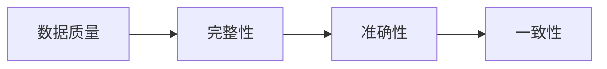

#### 模型准确性

模型准确性是能源消耗优化的重要指标。高精度的模型可以提高优化的效果，降低能源消耗。模型准确性取决于模型的训练数据、参数设置和算法选择等。

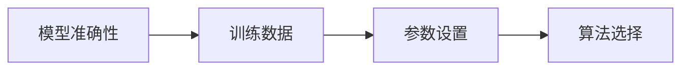

#### 算法效率

算法效率是能源消耗优化的重要因素。高效的算法可以降低计算成本，提高优化的效率。算法效率取决于算法的设计、实现和优化等。

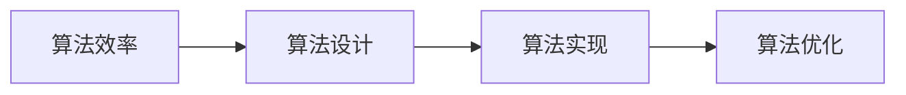

### 3.3 能源消耗优化的方法

能源消耗优化的方法主要包括数据采集与预处理、模型训练与优化和模型部署与评估。

#### 数据采集与预处理

数据采集与预处理是能源消耗优化的第一步。通过采集能源消耗数据，并对数据进行清洗、归一化和特征提取等预处理操作，可以提高数据质量，为后续的模型训练提供支持。

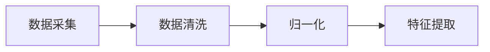

#### 模型训练与优化

模型训练与优化是能源消耗优化的核心步骤。通过应用生成对抗网络（GAN）、变分自编码器（VAE）和强化学习（RL）等技术，训练优化模型，提高模型准确性。

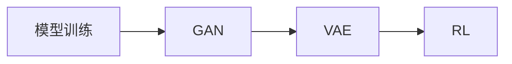

#### 模型部署与评估

模型部署与评估是能源消耗优化的最后一步。将训练好的模型部署到实际环境中，对模型进行评估，验证其性能，为能源消耗优化提供支持。

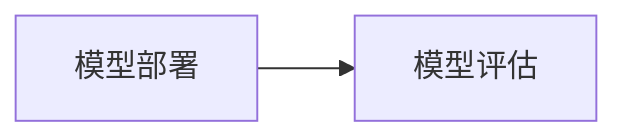

## 4. AIGC在能源消耗优化中的应用

### 4.1 数据采集与预处理

数据采集与预处理是AIGC在能源消耗优化中的第一步。首先，需要采集能源消耗数据，包括电力、燃气、水等。数据采集可以通过传感器、智能仪表等设备实现。接下来，对数据进行清洗、归一化和特征提取等预处理操作。

#### 数据采集

数据采集的关键是传感器和智能仪表。传感器可以实时监测能源消耗情况，并将数据传输到中央控制系统。智能仪表可以实现对能源消耗数据的自动记录和存储。

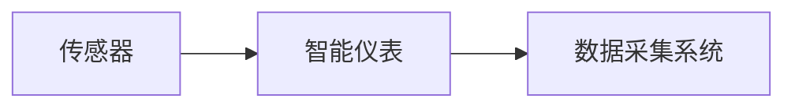

#### 数据清洗

数据清洗是确保数据质量的重要步骤。在数据清洗过程中，需要去除错误数据、异常数据和重复数据。此外，还需要对数据缺失值进行填充，以保证数据的完整性。

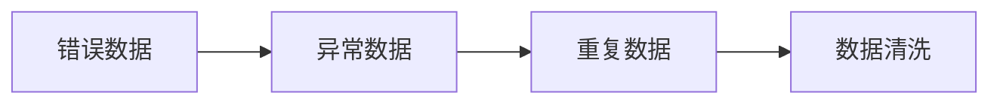

#### 数据归一化

数据归一化是将不同数据范围的数据转换为同一数据范围，以便于后续处理。常用的归一化方法包括最小-最大归一化和零-均值归一化等。

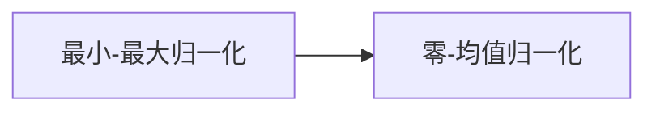

#### 数据特征提取

数据特征提取是从原始数据中提取有用的特征信息，以便于模型训练和优化。常用的特征提取方法包括主成分分析（PCA）和自编码器（AE）等。

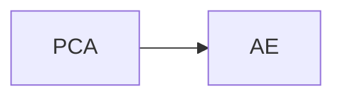

### 4.2 模型训练与优化

模型训练与优化是AIGC在能源消耗优化中的关键步骤。通过应用生成对抗网络（GAN）、变分自编码器（VAE）和强化学习（RL）等技术，训练优化模型，提高模型准确性。

#### 生成对抗网络（GAN）

生成对抗网络（GAN）是一种由生成器和判别器组成的对抗性模型。生成器负责生成与真实数据相似的数据，判别器负责区分生成的数据和真实数据。GAN的训练过程是一个生成器与判别器的对抗过程。

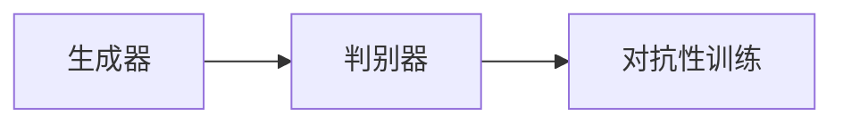

#### 变分自编码器（VAE）

变分自编码器（VAE）是一种无监督学习模型，由编码器和解码器组成。编码器将输入数据编码为一个概率分布，解码器则根据这个概率分布生成数据。VAE的训练过程是通过最大化数据生成概率来优化模型参数。

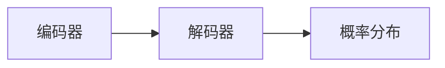

#### 强化学习（RL）

强化学习（RL）是一种通过试错来学习最优策略的机器学习技术。在能源消耗优化中，RL可以通过与环境交互来学习最优的能源消耗策略。

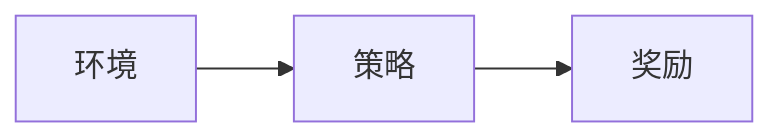

### 4.3 模型部署与评估

模型部署与评估是AIGC在能源消耗优化中的最后一步。将训练好的模型部署到实际环境中，对模型进行评估，验证其性能，为能源消耗优化提供支持。

#### 模型部署

模型部署是将训练好的模型应用到实际环境中。模型部署可以通过构建应用程序或Web服务来实现。

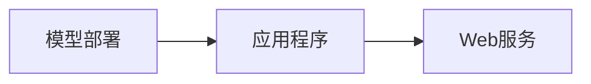

#### 模型评估

模型评估是对模型的性能进行评估。常用的评估指标包括准确率、召回率、F1分数等。

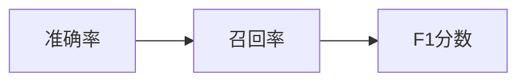

## 5. 案例分析

### 5.1 案例一：智能电网中的AIGC应用

#### 案例背景

智能电网是一种基于信息通信技术、自动控制技术和智能设备技术的电力系统。智能电网可以通过实时监测电力供需，优化电力分配，提高电力系统的效率。

#### 案例方法

在智能电网中，AIGC技术可以应用于能源预测、能源管理和能源优化。具体方法如下：

1. 数据采集与预处理：通过传感器和智能仪表采集电力消耗数据，并对数据进行清洗、归一化和特征提取等预处理操作。
2. 模型训练与优化：应用生成对抗网络（GAN）、变分自编码器（VAE）和强化学习（RL）等技术，训练优化模型，提高模型准确性。
3. 模型部署与评估：将训练好的模型部署到实际环境中，对模型进行评估，验证其性能。

#### 案例结果

通过应用AIGC技术，智能电网的能源消耗优化效果显著。例如，在电力预测方面，AIGC技术可以准确预测未来一段时间内的电力需求，从而优化电力生产和分配，提高电力系统的效率。在能源管理方面，AIGC技术可以实时监测电力消耗情况，优化电力分配，降低能源浪费。在能源优化方面，AIGC技术可以通过深度挖掘能源消耗数据，实现能源消耗的优化控制，提高能源利用效率。

### 5.2 案例二：智能建筑中的AIGC应用

#### 案例背景

智能建筑是一种基于物联网、自动控制技术和智能设备技术的建筑物。智能建筑可以通过实时监测室内环境，优化能源消耗，提高居住舒适度和安全性。

#### 案例方法

在智能建筑中，AIGC技术可以应用于室内环境监测、能源管理和能源优化。具体方法如下：

1. 数据采集与预处理：通过传感器和智能设备采集室内环境数据，包括温度、湿度、光照等，并对数据进行清洗、归一化和特征提取等预处理操作。
2. 模型训练与优化：应用生成对抗网络（GAN）、变分自编码器（VAE）和强化学习（RL）等技术，训练优化模型，提高模型准确性。
3. 模型部署与评估：将训练好的模型部署到实际环境中，对模型进行评估，验证其性能。

#### 案例结果

通过应用AIGC技术，智能建筑的能源消耗优化效果显著。例如，在室内环境监测方面，AIGC技术可以准确预测室内环境变化，从而优化空调、照明等设备的运行，提高居住舒适度。在能源管理方面，AIGC技术可以实时监测能源消耗情况，优化能源分配，降低能源浪费。在能源优化方面，AIGC技术可以通过深度挖掘能源消耗数据，实现能源消耗的优化控制，提高能源利用效率。

## 6. 未来展望

### 6.1 AIGC技术发展趋势

AIGC技术在能源消耗优化领域的应用前景广阔。未来，AIGC技术将继续向更高精度、更高效率和更广泛应用方向发展。具体趋势包括：

1. 深度学习技术的不断进步，将进一步提高AIGC技术的生成质量和准确性。
2. 算法效率和计算资源的提升，将使得AIGC技术在更复杂的能源消耗优化场景中发挥作用。
3. 跨学科融合，如AIGC技术与大数据、物联网、区块链等技术的结合，将推动能源消耗优化技术的创新。

### 6.2 能源消耗优化领域的挑战与机遇

能源消耗优化领域面临着一系列挑战和机遇。挑战包括：

1. 数据质量和数据隐私保护：高质量的数据是能源消耗优化的基础，但数据质量和数据隐私保护问题亟待解决。
2. 算法效率和计算资源：高效的算法和充足的计算资源是实现高效能源消耗优化的关键。
3. 系统集成与优化：将AIGC技术与现有的能源管理系统集成，实现系统的优化和提升。

机遇包括：

1. 全球能源需求的持续增长，为能源消耗优化提供了广阔的市场需求。
2. 环境保护意识的提高，为能源消耗优化提供了政策支持和资金投入。
3. 新兴技术的不断涌现，为能源消耗优化提供了新的技术和方法。

## 7. 结论

本文探讨了AIGC技术在智能能源消耗优化中的应用。通过分析AIGC的基本概念、核心技术及其在能源领域的应用，本文详细阐述了能源消耗优化的原理和关键因素，并展示了AIGC技术在智能电网和智能建筑中的成功应用。未来，随着AIGC技术的不断发展，智能能源消耗优化领域将迎来更大的发展机遇。

### 7.1 主要成果总结

本文的主要成果包括：

1. 介绍了AIGC技术的定义、发展历程和核心技术。
2. 详细阐述了能源消耗优化的原理和关键因素。
3. 展示了AIGC技术在智能电网和智能建筑中的成功应用。
4. 分析了AIGC技术在能源消耗优化领域的挑战和机遇。

### 7.2 研究展望与建议

未来的研究可以从以下几个方面展开：

1. 深入研究AIGC技术在不同能源消耗优化场景中的应用，探索其最佳应用策略。
2. 加强AIGC技术在能源消耗优化中的算法效率和计算资源研究，提高应用效果。
3. 探索AIGC技术与大数据、物联网、区块链等技术的融合，推动能源消耗优化技术的创新。
4. 关注能源消耗优化领域的政策动态和市场需求，为技术研究和应用提供指导。

作者：AI天才研究院/AI Genius Institute & 禅与计算机程序设计艺术 /Zen And The Art of Computer Programming

