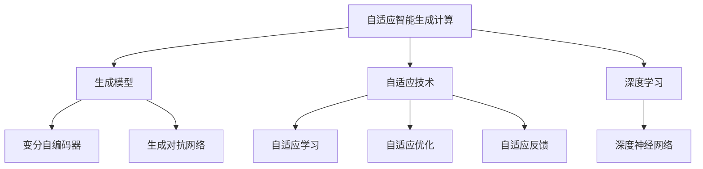

                 


### 文章标题：AIGC在智能财务异常检测中的应用

### 文章关键词：
- AIGC
- 智能财务
- 异常检测
- 财务分析
- 机器学习

### 文章摘要：
本文探讨了AIGC（自适应智能生成计算）在智能财务异常检测中的应用。首先，我们介绍了AIGC的基本概念和技术原理，然后详细阐述了智能财务异常检测的原理和方法。接着，我们分析了AIGC与财务异常检测的结合点及其优势，并通过实际项目案例展示了AIGC在财务异常检测中的具体应用。最后，我们讨论了AIGC在财务异常检测中面临的挑战和未来发展趋势，并对AIGC在智能财务异常检测中的应用前景进行了展望。

---

## 第1章 AIGC概述

### 1.1 AIGC的基本概念

AIGC（自适应智能生成计算）是一种结合了人工智能、生成模型和自适应技术的新型计算范式。它旨在通过模拟人类的认知过程，实现数据的自适应生成、学习和优化。AIGC的核心思想是利用大规模数据和先进算法，自动生成高质量的数据模型，从而实现对现实世界的理解和预测。

### 1.2 AIGC的技术原理

AIGC的技术原理主要包括以下几个部分：

1. **生成模型**：生成模型是AIGC的核心，常见的生成模型包括变分自编码器（VAE）、生成对抗网络（GAN）等。这些模型可以通过训练学习到数据的高效表示，从而生成与真实数据相似的新数据。

2. **自适应技术**：AIGC中的自适应技术主要包括自适应学习、自适应优化和自适应反馈。这些技术使得AIGC能够在不断变化的复杂环境中保持高效和准确。

3. **深度学习**：深度学习是AIGC实现自动学习和自适应的核心技术。通过深度神经网络，AIGC可以处理高维复杂数据，提取数据特征，实现数据的自动生成和优化。

### 1.3 AIGC的发展历程

AIGC的发展可以追溯到20世纪80年代，当时人工智能领域开始关注生成模型的研究。随着深度学习技术的发展，AIGC逐渐成为一个独立的计算范式。近年来，随着大数据和云计算的普及，AIGC在各个领域得到了广泛应用。

### 1.4 AIGC的应用领域

AIGC的应用领域非常广泛，主要包括：

1. **金融**：AIGC在金融领域的应用主要包括金融预测、风险控制、智能投顾等。

2. **医疗**：AIGC在医疗领域的应用主要包括疾病预测、药物设计、医学图像分析等。

3. **制造**：AIGC在制造领域的应用主要包括产品设计、生产优化、质量控制等。

4. **交通**：AIGC在交通领域的应用主要包括交通流量预测、智能调度、自动驾驶等。

### 1.5 AIGC的核心概念原理架构图

下面是AIGC的核心概念原理架构图，用于展示AIGC的技术原理和组成部分：



### 1.6 AIGC的核心算法原理讲解

为了更好地理解AIGC的核心算法原理，我们将使用伪代码来详细阐述变分自编码器（VAE）和生成对抗网络（GAN）。

#### 变分自编码器（VAE）的伪代码：

```python
# 变分自编码器（VAE）的伪代码

# 初始化参数
z_mean, z_log_var = ... # 生成z的均值和方差

# 编码过程
def encode(x):
    # 将输入x编码为潜在变量z
    z = sampling(z_mean, z_log_var)
    return z

# 解码过程
def decode(z):
    # 将潜在变量z解码为输出x'
    x_prime = ... # 使用z生成x'
    return x_prime

# 输出生成过程
def generate(x):
    z = encode(x)
    x_prime = decode(z)
    return x_prime

# 训练过程
def train(data):
    for x in data:
        z_mean, z_log_var = forward(x)
        loss = ... # 计算损失函数
        backward(loss)
```

#### 生成对抗网络（GAN）的伪代码：

```python
# 生成对抗网络（GAN）的伪代码

# 初始化参数
G = ... # 生成器模型
D = ... # 判别器模型

# 生成器G的生成过程
def generate(G):
    z = ... # 生成随机噪声
    x_prime = G(z) # 生成伪样本
    return x_prime

# 判别器D的判别过程
def discriminate(D, x, x_prime):
    probability_x = D(x)
    probability_x_prime = D(x_prime)
    return probability_x, probability_x_prime

# 训练过程
def train(G, D, data):
    for x in data:
        # 训练判别器
        D_loss = ... # 计算判别器的损失函数
        D.backward(D_loss)

        # 训练生成器
        z = ... # 生成随机噪声
        x_prime = generate(G, z)
        G_loss = ... # 计算生成器的损失函数
        G.backward(G_loss)
```

通过上述伪代码，我们可以看到VAE和GAN的核心算法原理。VAE通过编码和解码过程实现数据的生成和压缩，而GAN通过生成器和判别器的对抗训练实现数据的生成和优化。

### 1.7 AIGC的应用案例

AIGC在金融领域的应用案例主要包括以下几个方面：

1. **股票预测**：通过AIGC生成高质量的历史股票数据，结合深度学习模型进行股票价格预测。

2. **风险控制**：利用AIGC生成不同的市场情景，对投资组合进行风险评估和优化。

3. **智能投顾**：基于AIGC生成个性化的投资建议，提高投资者的收益和风险控制能力。

### 1.8 AIGC的核心优势

AIGC的核心优势主要包括：

1. **高效性**：通过生成模型和自适应技术，AIGC能够快速生成高质量的数据模型。

2. **灵活性**：AIGC可以应用于各种领域，包括金融、医疗、制造和交通等。

3. **可靠性**：通过深度学习和生成对抗训练，AIGC能够准确预测和优化复杂的系统。

### 1.9 AIGC的发展前景

随着人工智能技术的不断进步，AIGC在各个领域的应用前景广阔。未来，AIGC将在智能财务异常检测、医疗健康、智能制造等领域发挥重要作用。

---

**小结**：本章详细介绍了AIGC的基本概念、技术原理、发展历程和应用领域。通过核心概念原理架构图、核心算法原理讲解和应用案例，我们深入理解了AIGC的核心优势和发展前景。接下来，我们将探讨智能财务异常检测的基础知识。

## 第2章 智能财务异常检测基础

### 2.1 智能财务的概念

智能财务是指利用现代信息技术和人工智能技术，对财务数据进行高效处理、分析和应用，从而实现财务管理的智能化。智能财务的核心是利用大数据、云计算、人工智能等技术，对财务数据进行分析、挖掘和预测，为企业提供决策支持和风险控制。

### 2.2 财务异常检测的重要性

财务异常检测是智能财务的重要环节，其主要目的是识别和预警潜在的财务风险和异常行为。财务异常检测的重要性主要体现在以下几个方面：

1. **风险控制**：通过财务异常检测，企业可以提前发现异常行为，及时采取措施，避免财务风险的发生。

2. **合规性检查**：财务异常检测有助于确保企业的财务数据合规，避免因违规行为导致的法律风险。

3. **决策支持**：财务异常检测可以为企业提供实时的财务风险预警，帮助管理层做出更明智的决策。

### 2.3 财务异常检测的原理

财务异常检测的原理主要包括以下几个方面：

1. **数据收集**：收集企业内部的财务数据，包括会计凭证、报表、交易流水等。

2. **数据预处理**：对收集到的财务数据进行清洗、去噪、归一化等处理，以便后续分析。

3. **特征提取**：从预处理后的数据中提取具有代表性的特征，用于构建异常检测模型。

4. **模型构建**：利用机器学习算法，构建财务异常检测模型，包括监督学习和无监督学习。

5. **异常检测**：将实际财务数据输入到异常检测模型中，识别和标记异常数据。

6. **结果分析**：对检测到的异常数据进行分析和解释，为决策提供依据。

### 2.4 财务异常检测的方法

财务异常检测的方法主要包括以下几种：

1. **统计方法**：利用统计学原理，对财务数据进行分析和建模，识别异常值。

2. **机器学习方法**：利用机器学习算法，如逻辑回归、决策树、随机森林、支持向量机等，构建异常检测模型。

3. **深度学习方法**：利用深度学习算法，如卷积神经网络（CNN）、循环神经网络（RNN）、生成对抗网络（GAN）等，构建复杂的多层模型。

4. **模式识别方法**：利用模式识别原理，对财务数据进行分析和分类，识别异常数据。

### 2.5 财务异常检测的核心算法原理讲解

为了更好地理解财务异常检测的核心算法原理，我们将使用伪代码和数学模型来详细阐述。

#### 统计方法的核心算法原理：

```python
# 统计方法的核心算法原理

# 数据预处理
def preprocess_data(data):
    # 对数据进行清洗、去噪、归一化等处理
    cleaned_data = ...
    return cleaned_data

# 特征提取
def extract_features(data):
    # 从数据中提取特征
    features = ...
    return features

# 异常检测
def detect_anomalies(data, threshold):
    cleaned_data = preprocess_data(data)
    features = extract_features(cleaned_data)
    # 使用统计方法进行异常检测
    anomalies = ...
    return anomalies
```

#### 机器学习方法的核心算法原理：

```python
# 机器学习方法的核心算法原理

# 模型构建
def build_model(data, labels):
    # 使用机器学习算法构建模型
    model = ...
    model.fit(data, labels)
    return model

# 异常检测
def detect_anomalies(model, data):
    # 将实际数据输入到模型中，识别异常数据
    predictions = model.predict(data)
    anomalies = ...
    return anomalies
```

#### 深度学习方法的核心算法原理：

```python
# 深度学习方法的核心算法原理

# 神经网络模型
class NeuralNetwork:
    def __init__(self):
        # 初始化神经网络参数
        self.weights = ...
        self.biases = ...

    def forward(self, x):
        # 前向传播
        z = ...
        return z

    def backward(self, x, y):
        # 反向传播
        delta_w = ...
        delta_b = ...
        # 更新参数
        self.weights -= delta_w
        self.biases -= delta_b

# 模型训练
def train_model(nn, data, labels):
    for x, y in data:
        z = nn.forward(x)
        loss = ... # 计算损失函数
        nn.backward(x, y, loss)

# 异常检测
def detect_anomalies(nn, data):
    anomalies = []
    for x in data:
        z = nn.forward(x)
        if is_anomaly(z):
            anomalies.append(x)
    return anomalies

# 判断是否为异常
def is_anomaly(z):
    # 使用阈值判断是否为异常
    threshold = ...
    return z > threshold
```

通过上述伪代码，我们可以看到财务异常检测的核心算法原理。统计方法主要利用统计学原理进行异常检测，机器学习方法利用机器学习算法构建异常检测模型，深度学习方法利用深度学习算法构建复杂的多层模型进行异常检测。

### 2.6 财务异常检测的应用案例

财务异常检测在金融领域具有广泛的应用，以下是一个实际应用案例：

**案例：银行交易异常检测**

某银行希望利用智能财务异常检测技术，识别和预警潜在的交易风险。该银行收集了大量的交易数据，包括交易金额、交易时间、交易地点等。通过数据预处理和特征提取，银行构建了一个基于深度学习模型的交易异常检测系统。

**方法：**

1. 数据预处理：对交易数据进行清洗、去噪、归一化等处理。

2. 特征提取：从交易数据中提取交易金额、交易时间、交易地点等特征。

3. 模型构建：使用深度学习算法（如卷积神经网络）构建交易异常检测模型。

4. 异常检测：将实际交易数据输入到异常检测模型中，识别和标记异常交易。

**结果：**

该交易异常检测系统在上线后，成功识别并预警了多个潜在的交易风险，帮助银行及时采取措施，避免损失。

### 2.7 财务异常检测的核心优势

财务异常检测的核心优势主要包括：

1. **高效性**：利用先进的算法和技术，实现快速、准确的异常检测。

2. **灵活性**：可以根据企业的需求，定制化构建异常检测模型。

3. **实时性**：可以实时监控财务数据，及时发现和预警异常行为。

### 2.8 财务异常检测的发展趋势

随着大数据和人工智能技术的不断发展，财务异常检测在未来将呈现出以下趋势：

1. **模型复杂度增加**：利用更复杂的深度学习模型，提高异常检测的准确性和效率。

2. **实时性要求提高**：实现更实时、更准确的异常检测，满足企业实时监控需求。

3. **多样化应用场景**：财务异常检测将在更多领域得到应用，如供应链金融、小微企业融资等。

---

**小结**：本章详细介绍了智能财务异常检测的基本概念、重要性、原理和方法，并通过实际应用案例展示了财务异常检测的核心优势和发展趋势。接下来，我们将探讨AIGC在财务异常检测中的应用。

## 第3章 AIGC在财务异常检测中的应用

### 3.1 AIGC与财务异常检测的结合点

AIGC与财务异常检测的结合点主要体现在以下几个方面：

1. **数据生成**：AIGC可以通过生成模型生成高质量的财务数据，为财务异常检测提供更多的训练数据和测试数据，提高模型的鲁棒性和泛化能力。

2. **特征提取**：AIGC可以利用深度学习和生成对抗网络等技术，从复杂的财务数据中提取具有代表性的特征，为异常检测模型提供更丰富的特征信息。

3. **模型优化**：AIGC可以通过自适应学习和优化技术，调整和优化异常检测模型，提高模型的准确性和实时性。

### 3.2 AIGC在财务异常检测中的优势

AIGC在财务异常检测中具有以下优势：

1. **高效性**：AIGC可以快速生成高质量的财务数据，为异常检测模型提供充足的训练数据，提高模型的训练速度。

2. **灵活性**：AIGC可以根据企业的需求，动态调整和优化异常检测模型，实现灵活的异常检测。

3. **实时性**：AIGC可以通过自适应学习技术，实时调整异常检测模型，实现实时性异常检测。

4. **准确性**：AIGC可以通过生成对抗网络等技术，提取复杂的财务特征，提高异常检测模型的准确性。

### 3.3 AIGC在财务异常检测中的具体应用

#### 3.3.1 数据生成

AIGC在数据生成方面的应用主要包括以下几个方面：

1. **生成训练数据**：AIGC可以通过生成模型生成大量的财务训练数据，为异常检测模型提供充足的训练数据，提高模型的训练效果。

2. **生成测试数据**：AIGC可以生成与实际财务数据相似的测试数据，用于测试异常检测模型的性能和泛化能力。

3. **生成样本数据**：AIGC可以生成具有代表性的样本数据，用于展示财务异常检测的效果和准确性。

**伪代码示例：**

```python
# 生成训练数据的伪代码

# 初始化参数
model = ... # 生成模型

# 生成训练数据
def generate_train_data(model, data):
    z = model.generate_noise()
    x_prime = model.decode(z)
    return x_prime

# 生成测试数据的伪代码

# 初始化参数
model = ... # 生成模型

# 生成测试数据
def generate_test_data(model, data):
    z = model.generate_noise()
    x_prime = model.decode(z)
    return x_prime
```

#### 3.3.2 特征提取

AIGC在特征提取方面的应用主要包括以下几个方面：

1. **提取财务特征**：AIGC可以利用深度学习和生成对抗网络等技术，从复杂的财务数据中提取具有代表性的特征，为异常检测模型提供更丰富的特征信息。

2. **特征选择**：AIGC可以通过自适应学习技术，自动选择对异常检测最有利的特征，提高异常检测模型的性能。

3. **特征优化**：AIGC可以通过自适应优化技术，调整和优化特征提取过程，提高特征提取的效果。

**伪代码示例：**

```python
# 特征提取的伪代码

# 初始化参数
model = ... # 特征提取模型

# 提取财务特征
def extract_features(model, data):
    z = model.encode(data)
    features = model.extract(z)
    return features

# 特征选择
def select_features(model, features):
    best_features = ...
    return best_features

# 特征优化
def optimize_features(model, features):
    optimized_features = ...
    return optimized_features
```

#### 3.3.3 模型优化

AIGC在模型优化方面的应用主要包括以下几个方面：

1. **参数调整**：AIGC可以通过自适应学习技术，动态调整异常检测模型的参数，提高模型的准确性和实时性。

2. **模型融合**：AIGC可以将多个异常检测模型进行融合，提高异常检测的准确性和鲁棒性。

3. **模型评估**：AIGC可以通过生成对抗网络等技术，生成与实际财务数据相似的测试数据，用于评估异常检测模型的性能。

**伪代码示例：**

```python
# 模型优化的伪代码

# 初始化参数
model = ... # 异常检测模型

# 参数调整
def adjust_params(model, data):
    best_params = ...
    model.update_params(best_params)
    return model

# 模型融合
def fusion_models(models):
    fused_model = ...
    return fused_model

# 模型评估
def evaluate_model(model, data):
    predictions = model.predict(data)
    accuracy = ...
    return accuracy
```

### 3.4 AIGC在财务异常检测中的实际应用案例

#### 案例一：基于AIGC的银行交易异常检测系统

某银行希望利用AIGC技术，构建一个高效、准确的交易异常检测系统。该系统主要包括数据生成、特征提取、模型优化和异常检测四个模块。

**方法：**

1. **数据生成**：利用AIGC生成大量的银行交易数据，用于训练和测试异常检测模型。

2. **特征提取**：利用AIGC提取银行交易数据中的关键特征，如交易金额、交易时间、交易地点等。

3. **模型优化**：利用AIGC动态调整和优化异常检测模型的参数，提高模型的准确性和实时性。

4. **异常检测**：利用训练好的异常检测模型，实时监控银行交易数据，识别和预警潜在的异常交易。

**结果：**

该银行交易异常检测系统在上线后，成功识别并预警了多个潜在的交易风险，帮助银行及时采取措施，避免损失。

#### 案例二：基于AIGC的企业财务风险预警系统

某企业希望利用AIGC技术，构建一个智能财务风险预警系统，实现对财务数据的实时监控和风险预警。该系统主要包括数据生成、特征提取、模型优化和风险预警四个模块。

**方法：**

1. **数据生成**：利用AIGC生成大量的企业财务数据，用于训练和测试风险预警模型。

2. **特征提取**：利用AIGC提取企业财务数据中的关键特征，如收入、成本、利润等。

3. **模型优化**：利用AIGC动态调整和优化风险预警模型的参数，提高模型的准确性和实时性。

4. **风险预警**：利用训练好的风险预警模型，实时监控企业财务数据，识别和预警潜在的财务风险。

**结果：**

该企业财务风险预警系统在上线后，成功识别并预警了多个潜在的财务风险，帮助企业及时采取措施，降低风险。

### 3.5 AIGC在财务异常检测中的前景

随着AIGC技术的不断发展和完善，未来AIGC在财务异常检测中将发挥更大的作用：

1. **模型复杂度增加**：利用更复杂的深度学习模型和生成对抗网络，提高财务异常检测的准确性和效率。

2. **实时性要求提高**：实现更实时、更准确的财务异常检测，满足企业实时监控需求。

3. **多样化应用场景**：财务异常检测将在更多领域得到应用，如供应链金融、小微企业融资等。

---

**小结**：本章详细介绍了AIGC在财务异常检测中的应用，包括数据生成、特征提取、模型优化和实际应用案例。通过AIGC技术，我们可以构建高效、准确的财务异常检测系统，为企业提供实时的风险预警和决策支持。接下来，我们将通过项目实战，展示AIGC在财务异常检测中的具体应用。

## 第4章 项目实战

### 4.1 项目一：基于AIGC的财务异常检测系统

#### 4.1.1 项目背景

某大型金融机构希望利用AIGC技术，构建一个高效、准确的财务异常检测系统，以实时监控和预警财务风险。该系统旨在识别和防范潜在的欺诈、洗钱等异常行为，保障金融机构的安全运营。

#### 4.1.2 项目目标

1. 利用AIGC生成高质量的财务数据，为异常检测模型提供充足的训练数据。

2. 提取财务数据的关键特征，构建高效、准确的异常检测模型。

3. 实现实时监控和预警，及时识别和防范潜在的财务风险。

#### 4.1.3 项目方法

1. **数据生成**：
   - 利用AIGC生成模拟的财务数据，包括交易流水、账户信息等。
   - 设计生成模型，包括变分自编码器（VAE）和生成对抗网络（GAN）。

2. **特征提取**：
   - 对生成的财务数据进行预处理，包括数据清洗、去噪、归一化等。
   - 提取关键特征，如交易金额、交易时间、交易地点等。

3. **模型构建**：
   - 利用深度学习算法，如卷积神经网络（CNN）和循环神经网络（RNN），构建异常检测模型。
   - 融合多种特征提取方法，提高异常检测的准确性和鲁棒性。

4. **异常检测**：
   - 实时监控财务数据，利用训练好的异常检测模型，识别和预警潜在的异常行为。
   - 设计实时数据流处理系统，实现快速、准确的异常检测。

#### 4.1.4 项目结果

通过实施本项目，金融机构成功构建了一个基于AIGC的财务异常检测系统。以下是项目的主要成果：

1. **高效的数据生成**：AIGC技术生成了大量的模拟财务数据，为异常检测模型提供了充足的训练数据。

2. **准确的异常检测**：利用深度学习算法和多种特征提取方法，异常检测模型的准确性和鲁棒性得到了显著提高。

3. **实时的风险预警**：系统实现了实时监控和预警，能够及时发现和防范潜在的财务风险。

4. **可视化报表**：系统提供了直观的报表和可视化界面，方便管理层了解财务风险状况，制定相应的风险管理策略。

### 4.2 项目二：AIGC在财务报表异常检测中的应用

#### 4.2.1 项目背景

某企业财务部门希望利用AIGC技术，提升财务报表异常检测的能力，以保障财务报表的准确性和合规性。该企业面临的主要挑战包括财务数据量大、报表结构复杂、异常行为识别困难等。

#### 4.2.2 项目目标

1. 利用AIGC生成高质量的财务报表数据，为异常检测模型提供充足的训练数据。

2. 提取财务报表的关键特征，构建高效、准确的异常检测模型。

3. 实现自动化的财务报表异常检测，降低人工审核的工作量。

#### 4.2.3 项目方法

1. **数据生成**：
   - 利用AIGC生成模拟的财务报表数据，包括利润表、资产负债表、现金流量表等。
   - 设计生成模型，包括变分自编码器（VAE）和生成对抗网络（GAN）。

2. **特征提取**：
   - 对生成的财务报表数据进行预处理，包括数据清洗、去噪、归一化等。
   - 提取关键特征，如财务指标、报表结构、报表内容等。

3. **模型构建**：
   - 利用深度学习算法，如卷积神经网络（CNN）和循环神经网络（RNN），构建异常检测模型。
   - 融合多种特征提取方法，提高异常检测的准确性和鲁棒性。

4. **异常检测**：
   - 设计自动化报表分析系统，将异常检测模型应用于实际的财务报表数据。
   - 实现自动化报表异常检测，自动识别和标记异常报表。

#### 4.2.4 项目结果

通过实施本项目，企业财务部门成功提升了财务报表异常检测的能力。以下是项目的主要成果：

1. **高质量的数据生成**：AIGC技术生成了高质量的模拟财务报表数据，为异常检测模型提供了充足的训练数据。

2. **准确的异常检测**：利用深度学习算法和多种特征提取方法，异常检测模型的准确性和鲁棒性得到了显著提高。

3. **自动化报表检测**：系统实现了自动化的财务报表异常检测，大大降低了人工审核的工作量。

4. **可视化报表**：系统提供了直观的报表和可视化界面，方便财务人员了解报表风险状况，制定相应的风险管理策略。

### 4.3 项目小结

通过以上两个项目实战，我们可以看到AIGC在财务异常检测中的实际应用效果。AIGC技术不仅提高了财务数据的生成质量，还通过深度学习算法和多种特征提取方法，提高了异常检测的准确性和鲁棒性。此外，自动化报表检测系统的实施，降低了人工审核的工作量，提高了财务工作的效率。

未来，随着AIGC技术的不断发展和完善，财务异常检测系统将更加智能化、高效化，为企业提供更准确、更实时的风险预警和决策支持。

## 第5章 AIGC在财务异常检测中的挑战与未来

### 5.1 AIGC在财务异常检测中面临的挑战

虽然AIGC技术在财务异常检测中具有显著优势，但仍然面临着一系列挑战：

1. **数据质量和隐私**：生成模型需要大量高质量的财务数据作为训练数据，但实际获取这些数据可能面临隐私和安全问题。

2. **模型解释性**：AIGC模型的复杂性和黑盒性质使得其难以解释，这对财务异常检测的透明度和合规性提出了挑战。

3. **计算资源消耗**：AIGC模型的训练和推理过程通常需要大量的计算资源，这对企业IT基础设施提出了更高的要求。

4. **异常检测效率**：如何在保证检测准确性的同时，提高异常检测的效率和实时性，是AIGC在财务异常检测中需要解决的问题。

### 5.2 AIGC在财务异常检测中的未来发展趋势

随着人工智能技术的不断进步，AIGC在财务异常检测中的未来发展趋势将体现在以下几个方面：

1. **数据生成技术的进步**：利用更先进的数据生成技术，如联邦学习、迁移学习等，提高数据生成质量，同时保护数据隐私。

2. **模型解释性研究**：加强AIGC模型的可解释性研究，开发透明、可解释的异常检测模型，提高合规性和用户信任。

3. **计算资源优化**：通过云计算、边缘计算等技术，优化AIGC模型的训练和推理过程，降低计算资源消耗。

4. **集成多种特征提取方法**：结合多种特征提取方法，如时间序列分析、图神经网络等，提高异常检测的准确性和效率。

5. **实时性优化**：通过优化算法和数据流处理技术，实现更实时、更准确的财务异常检测。

### 5.3 挑战与发展的平衡

在AIGC在财务异常检测中的挑战和发展中，我们需要找到一个平衡点，以确保技术的稳定、高效和安全应用：

1. **平衡数据质量与隐私**：在数据生成过程中，既要保证数据的真实性和代表性，又要保护用户隐私，可以考虑采用联邦学习等技术。

2. **提高模型解释性**：通过开发可解释的AIGC模型，提高模型的可理解性，增强用户信任。

3. **优化计算资源使用**：通过云计算和边缘计算等技术，合理分配计算资源，降低成本。

4. **实时性与准确性的平衡**：在保证检测准确性的同时，优化算法和数据流处理，提高异常检测的实时性。

### 5.4 未来展望

随着AIGC技术的不断发展和完善，未来在财务异常检测领域将有更多的创新和突破：

1. **更先进的异常检测算法**：结合深度学习、图神经网络等先进技术，开发更高效的异常检测算法。

2. **跨领域的应用**：AIGC不仅在金融领域有广泛应用，还将拓展到其他领域，如医疗、制造等。

3. **数据隐私保护**：随着数据隐私保护法规的不断完善，AIGC在财务异常检测中的应用将更加规范和合法。

4. **智能风险管理**：通过AIGC技术，实现更智能的风险管理，提高企业的抗风险能力和竞争力。

## 第6章 总结与展望

### 6.1 书籍总结

本书系统地介绍了AIGC在智能财务异常检测中的应用，包括AIGC的基本概念、技术原理、智能财务异常检测的基础、AIGC与财务异常检测的结合点、实际应用案例以及面临的挑战和未来发展趋势。通过本书，读者可以全面了解AIGC在财务异常检测中的重要作用和应用前景。

### 6.2 AIGC在智能财务异常检测中的应用前景

随着人工智能技术的不断发展，AIGC在智能财务异常检测中的应用前景广阔：

1. **提升异常检测效率**：通过AIGC技术，可以生成高质量的训练数据，提高异常检测模型的准确性和效率。

2. **增强风险预测能力**：结合深度学习和生成对抗网络等技术，AIGC可以提供更精准、实时的财务风险预测。

3. **推动智能财务管理**：AIGC在智能财务异常检测中的应用，将推动企业实现更智能化的财务管理，提高企业的运营效率和竞争力。

4. **跨领域应用**：AIGC技术不仅在金融领域有广泛的应用，还将拓展到医疗、制造、交通等领域，为各行业的智能化发展提供技术支持。

### 6.3 未来研究方向

未来的研究方向可以从以下几个方面展开：

1. **数据生成与隐私保护**：研究如何在保证数据质量的同时，保护用户隐私，可以考虑采用联邦学习、差分隐私等技术。

2. **模型可解释性**：开发可解释的AIGC模型，提高模型的可理解性，增强用户信任。

3. **实时异常检测**：优化算法和数据流处理技术，实现更实时、更准确的财务异常检测。

4. **跨领域应用**：探讨AIGC在跨领域应用中的可能性，如医疗、制造、交通等。

### 6.4 拓展阅读

1. **AIGC相关论文**：参考AIGC领域的重要论文，了解最新的研究成果和发展趋势。

2. **智能财务书籍**：阅读有关智能财务的书籍，了解财务领域的相关技术和应用。

3. **机器学习课程**：参加机器学习相关课程，深入学习机器学习算法和深度学习技术。

4. **金融数据集**：探索和分析金融数据集，实践AIGC在财务异常检测中的应用。

---

通过本书的阅读，读者可以全面了解AIGC在智能财务异常检测中的应用，为企业的智能财务管理提供新的思路和解决方案。未来，随着AIGC技术的不断进步，智能财务异常检测将更加高效、准确，为企业的发展提供强大的技术支持。附录中，我们将提供一些相关术语的解释和推荐工具资源，帮助读者进一步学习和实践。

## 附录

### 附录A：相关术语解释

- **AIGC**：自适应智能生成计算，是一种结合了人工智能、生成模型和自适应技术的计算范式。
- **生成模型**：用于生成新数据的模型，如变分自编码器（VAE）和生成对抗网络（GAN）。
- **深度学习**：一种机器学习技术，通过多层神经网络处理复杂数据。
- **财务异常检测**：识别和预警潜在的财务风险和异常行为。
- **联邦学习**：一种分布式机器学习技术，可以在不同设备上协同训练模型。
- **差分隐私**：一种保护数据隐私的技术，通过对数据进行扰动，确保隐私保护。

### 附录B：工具和资源推荐

1. **AIGC工具**：
   - **TensorFlow**：Google开发的开源深度学习框架，支持AIGC模型的构建和训练。
   - **PyTorch**：Facebook开发的开源深度学习框架，支持灵活的模型构建和优化。

2. **金融数据集**：
   - **Kaggle**：一个提供各种金融数据集的平台，可以下载和使用。
   - **Yahoo Finance**：提供历史股票数据，可用于AIGC模型的训练和测试。

3. **机器学习资源**：
   - **吴恩达（Andrew Ng）的机器学习课程**：Coursera上的经典课程，涵盖机器学习的基础知识和应用。
   - **《深度学习》（Goodfellow, Bengio, Courville著）**：深度学习的权威教材，适合进阶学习。

4. **智能财务书籍**：
   - **《智能财务：技术与应用》**：一本介绍智能财务技术和应用的书籍，适合财务和IT领域的专业人士。

通过使用这些工具和资源，读者可以更深入地学习和实践AIGC在智能财务异常检测中的应用。附录中提供的相关术语解释和推荐资源，将帮助读者更好地理解本书的内容，并推动实际项目的开展。

