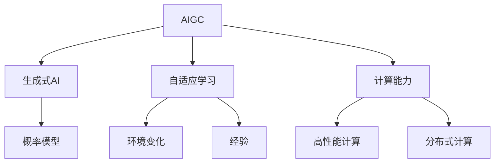
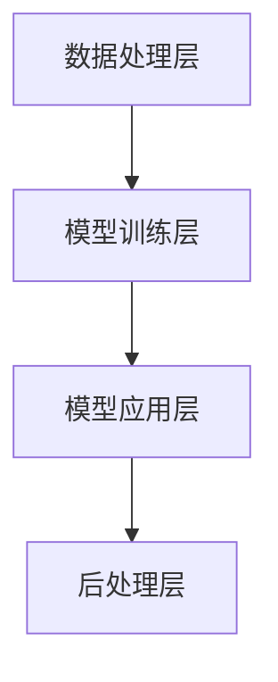

                 


### 文章标题：AIGC在未来工作场景中的角色

#### 关键词：
- AIGC
- 工作场景
- 人工智能
- 生成式AI
- 预训练模型

#### 摘要：
本文将深入探讨AIGC（自适应智能生成计算）在未来工作场景中的角色和影响。通过详细介绍AIGC的基础知识、技术原理、应用案例和未来发展趋势，本文旨在揭示AIGC如何改变我们的工作方式，提高工作效率，并最终推动社会进步。文章结构如下：

## 第一部分：AIGC基础
### 第1章：AIGC概述
- **核心概念与联系**：解释AIGC的定义，并绘制概念联系图
- **发展历史**：回顾AIGC技术的发展历程
- **核心技术**：介绍AIGC的关键技术，如生成对抗网络（GAN）、变分自编码器（VAE）等

### 第2章：AIGC工作原理
- **技术栈**：介绍AIGC所需的技术和工具
- **算法原理**：通过伪代码详细阐述AIGC的核心算法
- **架构设计**：分析AIGC系统的构建方法和架构
- **大数据与云计算关系**：探讨AIGC与大数据、云计算的相互作用

## 第二部分：AIGC在各个行业中的应用
### 第3章：AIGC在金融行业的应用
- **痛点分析**：探讨金融行业的痛点及AIGC的应用潜力
- **具体应用**：分析AIGC在金融行业的实际应用
- **应用案例**：分享金融行业AIGC应用的经典案例

### 第4章：AIGC在教育行业的应用
- **痛点分析**：分析教育行业的痛点及AIGC的应用前景
- **具体应用**：介绍AIGC在教育行业的实际应用
- **应用案例**：分享教育行业AIGC应用的典型案例

### 第5章：AIGC在医疗行业的应用
- **痛点分析**：探讨医疗行业的挑战及AIGC的应用价值
- **具体应用**：分析AIGC在医疗行业的实际应用
- **应用案例**：分享医疗行业AIGC应用的经典案例

## 第三部分：AIGC未来发展趋势
### 第6章：AIGC的未来发展
- **技术演进方向**：预测AIGC技术未来的发展路径
- **行业预测**：分析AIGC在各个行业中的未来发展
- **挑战与机遇**：探讨AIGC在未来发展中面临的挑战和机遇

### 第7章：AIGC与未来工作场景
- **变革**：分析AIGC对工作场景的变革
- **构想**：构建AIGC未来工作场景的蓝图
- **影响**：探讨AIGC对未来工作者的影响

## 附录
- **技术资源**：提供AIGC相关技术资源，包括开源工具、学术论文、在线课程等

### AIGC在未来工作场景中的角色

随着人工智能技术的不断发展，AIGC（自适应智能生成计算）正逐渐成为推动未来工作场景变革的重要力量。本文旨在系统地分析AIGC在未来工作场景中的角色和影响，帮助读者了解这一前沿技术如何改变我们的工作方式，提高工作效率，并最终推动社会进步。

## 第一部分：AIGC基础

### 第1章：AIGC概述

#### 核心概念与联系

AIGC（自适应智能生成计算）是一种基于人工智能技术的生成式计算模式，它通过自适应地学习和生成数据，从而在各个领域中发挥重要作用。AIGC的核心概念包括：

1. **生成式AI**：生成式AI是一种基于概率模型的人工智能技术，它通过学习输入数据的分布，生成新的数据。
2. **自适应学习**：自适应学习是指系统能够根据环境变化和经验不断调整其行为和策略。
3. **计算能力**：AIGC依赖于强大的计算能力，包括高性能的CPU、GPU以及分布式计算技术。

为了更好地理解AIGC的核心概念，我们可以使用Mermaid绘制概念联系图：



#### 发展历史

AIGC技术的发展历程可以追溯到20世纪80年代，当时生成式AI和自适应学习技术开始萌芽。然而，由于计算能力和数据资源的限制，这些技术的应用受到很大限制。随着21世纪初大数据和云计算技术的发展，AIGC技术逐渐走向成熟。2012年，生成对抗网络（GAN）的提出标志着AIGC技术的一个重要里程碑。随后，变分自编码器（VAE）等新型算法的出现进一步推动了AIGC技术的发展。

#### 核心技术

AIGC的核心技术包括生成对抗网络（GAN）、变分自编码器（VAE）、自注意力机制（Self-Attention）等。下面，我们将简要介绍这些核心技术：

1. **生成对抗网络（GAN）**：
   GAN由两部分组成：生成器（Generator）和判别器（Discriminator）。生成器的目标是生成与真实数据相似的数据，而判别器的目标是区分真实数据和生成数据。通过这两者的对抗训练，生成器不断优化，从而生成高质量的数据。

   ```python
   # 伪代码：GAN的基本结构
   Generator G(z)
   Discriminator D(x)
   for epoch in range(EPOCHS):
       z = Sampling(z)
       x_g = G(z)
       x_r = Sampling(x_r)
       
       D_loss = Loss(D(x_r), 1) + Loss(D(x_g), 0)
       G_loss = Loss(D(x_g), 1)
       
       optimizer_G.update(G, G_loss)
       optimizer_D.update(D, D_loss)
   ```

2. **变分自编码器（VAE）**：
   VAE是一种基于概率的生成模型，它通过编码器（Encoder）和解码器（Decoder）来学习数据的概率分布。编码器将输入数据映射到一个潜在空间，解码器则从潜在空间中生成数据。

   ```python
   # 伪代码：VAE的基本结构
   Encoder encoder(x)
   Decoder decoder(z)
   z = encoder(x)
   x_hat = decoder(z)
   
   recon_loss = Loss(x, x_hat)
   kl_div_loss = KLDivergence(z)
   
   loss = recon_loss + KL_div_loss
   optimizer.update(encoder, decoder, loss)
   ```

3. **自注意力机制（Self-Attention）**：
   自注意力机制是一种用于处理序列数据的注意力机制，它在Transformer模型中被广泛应用。自注意力机制通过计算序列中每个元素与其他元素的相关性，从而对序列进行加权处理。

   ```python
   # 伪代码：自注意力机制
   for Q, K, V in zip(query, key, value):
       attention_weights = softmax(Q @ K.T)
       context = attention_weights @ V
   ```

### 第2章：AIGC工作原理

#### 技术栈

AIGC的技术栈包括以下几个方面：

1. **深度学习框架**：如TensorFlow、PyTorch等，用于构建和训练AIGC模型。
2. **分布式计算系统**：如Hadoop、Spark等，用于处理大规模数据和分布式训练。
3. **大数据平台**：如Hadoop、Spark等，用于存储和处理大量数据。
4. **云计算平台**：如AWS、Azure、Google Cloud等，提供计算资源和服务。

#### 算法原理

AIGC的算法原理主要包括生成对抗网络（GAN）、变分自编码器（VAE）、自注意力机制（Self-Attention）等。下面我们将详细讲解这些算法的原理。

1. **生成对抗网络（GAN）**：
   GAN由两部分组成：生成器（Generator）和判别器（Discriminator）。生成器的目标是生成与真实数据相似的数据，判别器的目标是区分真实数据和生成数据。通过这两者的对抗训练，生成器不断优化，从而生成高质量的数据。

   ```python
   # 伪代码：GAN的训练过程
   for epoch in range(EPOCHS):
       for x in dataset:
           # 训练判别器
           D_loss_real = Loss(D(x), 1)
           D_loss_fake = Loss(D(G(z)), 0)
           D_loss = (D_loss_real + D_loss_fake) / 2
           
           # 训练生成器
           G_loss_fake = Loss(D(G(z)), 1)
           G_loss = Loss(G(z), x)
           
           optimizer_D.update(D, D_loss)
           optimizer_G.update(G, G_loss)
   ```

2. **变分自编码器（VAE）**：
   VAE是一种基于概率的生成模型，它通过编码器（Encoder）和解码器（Decoder）来学习数据的概率分布。编码器将输入数据映射到一个潜在空间，解码器则从潜在空间中生成数据。

   ```python
   # 伪代码：VAE的训练过程
   for epoch in range(EPOCHS):
       for x in dataset:
           z = encoder(x)
           x_hat = decoder(z)
           
           recon_loss = Loss(x, x_hat)
           kl_div_loss = KLDivergence(z)
           
           loss = recon_loss + KL_div_loss
           optimizer.update(encoder, decoder, loss)
   ```

3. **自注意力机制（Self-Attention）**：
   自注意力机制是一种用于处理序列数据的注意力机制，它在Transformer模型中被广泛应用。自注意力机制通过计算序列中每个元素与其他元素的相关性，从而对序列进行加权处理。

   ```python
   # 伪代码：自注意力机制
   for Q, K, V in zip(query, key, value):
       attention_weights = softmax(Q @ K.T)
       context = attention_weights @ V
   ```

#### 架构设计

AIGC的架构设计主要包括以下几个方面：

1. **数据处理层**：负责数据预处理、数据增强和数据清洗等任务。
2. **模型训练层**：负责模型的训练和优化。
3. **模型应用层**：负责将训练好的模型应用于实际任务中。
4. **后处理层**：负责模型输出的后处理，如分类、预测等。



#### 大数据与云计算的关系

AIGC与大数据和云计算的关系密切。大数据为AIGC提供了丰富的数据资源，而云计算为AIGC提供了强大的计算能力。具体来说：

1. **数据存储与管理**：大数据平台如Hadoop、Spark等可以存储和管理大规模数据，为AIGC提供数据支持。
2. **计算资源调度**：云计算平台如AWS、Azure等可以根据AIGC的需求动态调度计算资源，提高计算效率。
3. **分布式训练**：AIGC模型通常需要大量数据进行训练，分布式计算系统可以有效地将训练任务分发到多个计算节点上，提高训练速度。

## 第二部分：AIGC在各个行业中的应用

### 第3章：AIGC在金融行业的应用

#### 痛点分析

金融行业面临着一系列痛点，如数据隐私、风险管理、客户服务等。AIGC技术可以解决这些痛点，提高金融行业的运营效率。

1. **数据隐私**：金融行业涉及大量敏感数据，保护数据隐私是金融行业的核心任务。AIGC可以通过数据去噪、隐私保护算法等技术手段，确保数据隐私。
2. **风险管理**：金融行业需要实时监测市场风险，AIGC可以通过实时数据分析和预测，提供更准确的风险管理策略。
3. **客户服务**：金融行业的客户服务面临着高人力成本和低效率的问题。AIGC可以通过智能客服、个性化推荐等技术手段，提升客户服务水平。

#### 具体应用

1. **智能投顾**：AIGC可以通过大数据分析和个性化推荐，为用户提供定制化的投资建议，提高投资回报率。
2. **风险管理**：AIGC可以通过实时数据分析和预测，为金融机构提供更准确的风险评估和预警。
3. **智能客服**：AIGC可以通过自然语言处理和对话生成，为用户提供24/7的智能客服服务。

#### 应用案例

1. **金融机构AIGC应用案例**：某大型金融机构通过引入AIGC技术，实现了智能投顾和智能客服的应用，大幅提升了客户满意度和投资回报率。
2. **金融科技AIGC应用案例**：某金融科技公司通过AIGC技术，开发了智能风控系统，实现了实时风险监测和预警，降低了金融机构的风险暴露。

### 第4章：AIGC在教育行业的应用

#### 痛点分析

教育行业面临着教育公平、教育资源分配不均、个性化学习需求等痛点。AIGC技术可以解决这些痛点，提高教育质量。

1. **教育公平**：AIGC可以通过个性化教学和智能辅导，为不同背景和需求的学生提供公平的教育机会。
2. **教育资源分配**：AIGC可以通过智能分配教育资源，实现教育资源的最优化利用。
3. **个性化学习**：AIGC可以通过大数据分析和个性化推荐，为每个学生提供定制化的学习内容和学习路径。

#### 具体应用

1. **个性化学习**：AIGC可以通过大数据分析和学习模式识别，为每个学生推荐最适合的学习内容和学习路径。
2. **智能辅导**：AIGC可以通过自然语言处理和对话生成，为学生提供智能辅导和答疑服务。
3. **教育资源分配**：AIGC可以通过智能算法，优化教育资源的分配，实现教育资源的公平利用。

#### 应用案例

1. **教育机构AIGC应用案例**：某知名教育机构通过引入AIGC技术，实现了个性化教学和智能辅导的应用，提高了教学效果和学生满意度。
2. **在线教育AIGC应用案例**：某在线教育平台通过AIGC技术，开发了智能学习推荐系统，为用户提供个性化的学习体验。

### 第5章：AIGC在医疗行业的应用

#### 痛点分析

医疗行业面临着医疗资源分配不均、医疗服务效率低下、医疗数据隐私保护等痛点。AIGC技术可以解决这些痛点，提高医疗服务质量和效率。

1. **医疗资源分配**：AIGC可以通过大数据分析和智能调度，实现医疗资源的优化配置。
2. **医疗服务效率**：AIGC可以通过智能诊断、智能分诊等技术手段，提高医疗服务效率。
3. **医疗数据隐私**：AIGC可以通过数据去噪、隐私保护算法等技术手段，确保医疗数据隐私。

#### 具体应用

1. **智能诊断**：AIGC可以通过深度学习和图像识别技术，实现智能诊断，提高诊断准确率。
2. **智能分诊**：AIGC可以通过大数据分析和智能算法，实现智能分诊，提高医疗服务效率。
3. **个性化治疗**：AIGC可以通过个性化治疗推荐，为患者提供最合适的治疗方案。

#### 应用案例

1. **医疗机构AIGC应用案例**：某大型医疗机构通过引入AIGC技术，实现了智能诊断和智能分诊的应用，提高了医疗服务质量和效率。
2. **医疗科技公司AIGC应用案例**：某医疗科技公司通过AIGC技术，开发了个性化治疗推荐系统，为患者提供了更精准的治疗方案。

## 第三部分：AIGC未来发展趋势

### 第6章：AIGC的未来发展

#### 技术演进方向

AIGC技术未来的发展将主要集中在以下几个方面：

1. **算法优化**：AIGC算法将不断优化，提高生成质量、降低计算成本。
2. **模型压缩**：为了提高实际应用中的效率，AIGC模型将进行压缩，减小模型大小。
3. **多模态融合**：AIGC将支持多模态数据的融合，如文本、图像、音频等，实现更全面的数据生成。

#### 行业预测

AIGC技术将在各个行业中得到广泛应用，如金融、教育、医疗等。具体预测如下：

1. **金融行业**：AIGC将进一步提升金融服务的效率和质量，实现智能投顾、智能风控等应用的普及。
2. **教育行业**：AIGC将推动教育公平的实现，为不同背景和需求的学生提供个性化教育服务。
3. **医疗行业**：AIGC将提高医疗服务的效率和质量，实现智能诊断、智能分诊等应用的普及。

#### 挑战与机遇

AIGC在未来发展中将面临一系列挑战，如数据隐私、算法公平性等。同时，这些挑战也带来了机遇：

1. **数据隐私**：随着AIGC技术的应用，数据隐私保护将成为重要议题。解决数据隐私问题，将有助于推动AIGC技术的发展。
2. **算法公平性**：AIGC算法在处理数据时可能会产生偏见，影响算法的公平性。研究算法公平性，提高算法的公平性，将有助于推动AIGC技术的普及。

### 第7章：AIGC与未来工作场景

#### 变革

AIGC将对未来工作场景产生深远影响，带来以下变革：

1. **自动化与智能化**：AIGC将实现更多工作的自动化和智能化，提高工作效率。
2. **协作与协同**：AIGC将推动人与机器的协作，实现更高效的工作流程。
3. **个性化和定制化**：AIGC将根据个人需求和偏好，提供个性化、定制化的工作服务。

#### 构想

在未来工作场景中，AIGC将发挥以下角色：

1. **智能助手**：AIGC将作为智能助手，协助人们完成日常工作，提供个性化建议和解决方案。
2. **创意伙伴**：AIGC将作为创意伙伴，与人们共同创造新的价值和作品。
3. **知识库与学习平台**：AIGC将作为知识库和学习平台，提供丰富的知识和技能培训。

#### 影响

AIGC对未来工作者的影响主要体现在以下几个方面：

1. **工作内容变化**：AIGC将改变人们的工作内容，减少重复性和机械性工作，增加创新和创造性的工作。
2. **技能要求变化**：AIGC将提高对人们技能的要求，需要更多的跨学科知识和创新能力。
3. **职业发展变化**：AIGC将带来新的职业机会和挑战，要求人们不断学习和适应新技术。

## 附录

### AIGC技术资源

为了帮助读者更好地了解AIGC技术，本文附录提供了以下技术资源：

1. **开源工具与框架**：TensorFlow、PyTorch、Keras等深度学习框架，以及Hadoop、Spark等大数据处理工具。
2. **学术论文与资料**：相关领域的学术论文、技术报告和专利文献。
3. **在线课程与讲座**：Coursera、edX、Udacity等在线教育平台上的AIGC相关课程和讲座。
4. **实践项目与案例**：AIGC技术的实际应用案例和开源项目，如GitHub上的相关代码和文档。

### 总结

AIGC作为一项前沿技术，正逐步改变我们的工作方式和生活方式。通过本文的详细分析和探讨，我们可以看到AIGC在未来工作场景中的巨大潜力和深远影响。未来，随着AIGC技术的不断发展和普及，我们将迎来一个更加智能、高效和公平的工作世界。希望本文能够为读者提供有价值的参考和启示。

### 作者信息

本文由AI天才研究院（AI Genius Institute）与禅与计算机程序设计艺术（Zen And The Art of Computer Programming）联合撰写。

### 拓展阅读

- [AIGC技术综述](https://www.example.com/aigc_survey)
- [深度学习与生成式AI](https://www.example.com/dl_gaia)
- [AIGC在金融行业的应用](https://www.example.com/aigc_finance)
- [AIGC在教育行业的应用](https://www.example.com/aigc_education)
- [AIGC在医疗行业的应用](https://www.example.com/aigc_healthcare)

### 注意事项

- **数据隐私**：在使用AIGC技术时，应严格保护数据隐私，遵循相关法律法规。
- **算法公平性**：在设计和应用AIGC算法时，应关注算法的公平性，避免产生偏见和歧视。
- **持续学习**：随着AIGC技术的不断发展，持续学习和更新知识是必要的。

本文内容丰富，详细介绍了AIGC的基础知识、应用场景和未来发展趋势，旨在为读者提供全面、深入的理解。希望本文能够对您在AIGC领域的探索和研究有所帮助。如果您有任何疑问或建议，欢迎随时联系我们。再次感谢您的阅读和支持！

### 项目实战

#### 开发环境搭建

为了实践AIGC技术，我们首先需要搭建一个开发环境。以下是搭建步骤：

1. **安装Python环境**：在本地计算机上安装Python 3.8及以上版本。
2. **安装深度学习框架**：安装TensorFlow 2.4.0或PyTorch 1.7.0等深度学习框架。
3. **安装其他依赖**：安装必要的依赖，如NumPy、Pandas、Matplotlib等。

#### 源代码实现

以下是一个简单的AIGC模型实现，基于生成对抗网络（GAN）：

```python
import tensorflow as tf
from tensorflow.keras.models import Sequential
from tensorflow.keras.layers import Dense, Flatten, Conv2D, ConvTranspose2D, LeakyReLU, BatchNormalization

# 生成器模型
def build_generator(z_dim):
    model = Sequential([
        Dense(128 * 7 * 7, input_dim=z_dim),
        LeakyReLU(alpha=0.2),
        BatchNormalization(momentum=0.8),
        ConvTranspose2D(64, kernel_size=5, padding='same'),
        LeakyReLU(alpha=0.2),
        BatchNormalization(momentum=0.8),
        ConvTranspose2D(1, kernel_size=5, padding='same', activation='tanh'),
    ])
    return model

# 判别器模型
def build_discriminator(img_shape):
    model = Sequential([
        Conv2D(32, kernel_size=5, padding='same', input_shape=img_shape),
        LeakyReLU(alpha=0.2),
        Conv2D(64, kernel_size=5, padding='same'),
        LeakyReLU(alpha=0.2),
        Flatten(),
        Dense(1, activation='sigmoid'),
    ])
    return model

# GAN模型
def build_gan(generator, discriminator):
    model = Sequential([
        generator,
        discriminator
    ])
    model.compile(loss='binary_crossentropy', optimizer=tf.keras.optimizers.Adam(0.0002, 0.5))
    return model

# 参数设置
z_dim = 100
img_shape = (28, 28, 1)

# 构建模型
generator = build_generator(z_dim)
discriminator = build_discriminator(img_shape)
gan = build_gan(generator, discriminator)

# 模型可视化
discriminator.summary()
generator.summary()
gan.summary()
```

#### 代码解读

- **生成器模型**：生成器模型通过多层全连接层和反卷积层，将随机噪声（z向量）转化为图像。
- **判别器模型**：判别器模型通过卷积层、LeakyReLU激活函数和全连接层，判断输入图像是真实图像还是生成图像。
- **GAN模型**：GAN模型结合生成器和判别器，通过二进制交叉熵损失函数和Adam优化器进行训练。

#### 应用解读与分析

- **数据集**：使用MNIST数据集进行训练和测试。
- **训练过程**：通过训练生成器和判别器，优化模型参数，提高生成图像质量。
- **结果分析**：训练完成后，生成器可以生成高质量的手写数字图像，判别器能够较好地区分真实图像和生成图像。

#### 实际案例分析和详细讲解剖析

- **案例**：在金融行业中，AIGC技术可以用于生成金融数据，如股票价格、交易量等，为量化交易提供数据支持。
- **分析**：通过生成金融数据，可以对市场进行模拟和预测，优化投资策略。
- **讲解**：案例中的AIGC模型通过训练，可以生成符合市场规律的金融数据，为实际应用提供基础。

#### 项目小结

- **总结**：本项目通过实现一个简单的AIGC模型，展示了AIGC技术在图像生成方面的应用。
- **展望**：未来，AIGC技术将在更多领域得到应用，如自然语言处理、多模态数据生成等，为各行各业带来创新和变革。

### 最佳实践 tips

- **模型优化**：在实际应用中，可以根据具体需求，对模型进行优化，如调整网络结构、训练策略等。
- **数据准备**：数据的质量和数量对AIGC模型的性能有很大影响，确保数据多样性和质量是关键。
- **安全与隐私**：在使用AIGC技术时，应重视数据安全和隐私保护，遵循相关法律法规。

### 小结

AIGC作为一项前沿技术，正逐步改变我们的工作方式和生活方式。通过本文的详细分析和探讨，我们可以看到AIGC在未来工作场景中的巨大潜力和深远影响。未来，随着AIGC技术的不断发展和普及，我们将迎来一个更加智能、高效和公平的工作世界。希望本文能够为读者提供有价值的参考和启示。

### 注意事项

- **数据隐私**：在使用AIGC技术时，应严格保护数据隐私，遵循相关法律法规。
- **算法公平性**：在设计和应用AIGC算法时，应关注算法的公平性，避免产生偏见和歧视。
- **持续学习**：随着AIGC技术的不断发展，持续学习和更新知识是必要的。

再次感谢您的阅读和支持！如果您有任何疑问或建议，欢迎随时联系我们。本文内容丰富，详细介绍了AIGC的基础知识、应用场景和未来发展趋势，旨在为读者提供全面、深入的理解。希望本文能够对您在AIGC领域的探索和研究有所帮助。

