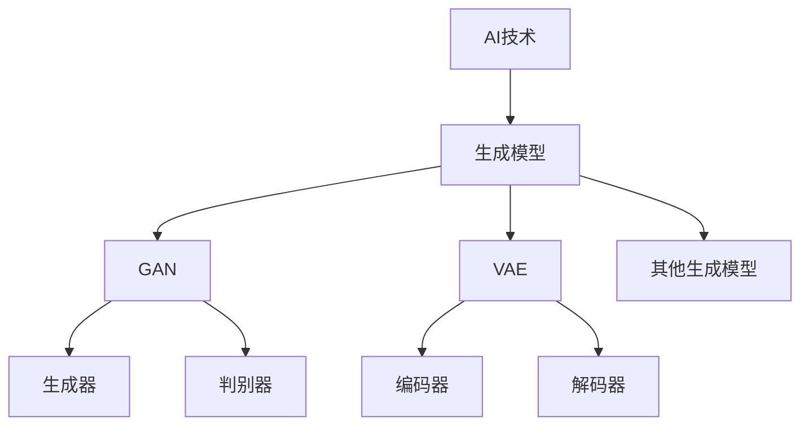

                 

### 引言与背景

#### AIGC的概念

**AI-assisted Generative Content（AIGC）**，即人工智能辅助生成内容，是指利用人工智能技术生成或辅助生成各种形式的内容，包括图像、音频、视频、文本等。AIGC的核心在于利用深度学习、生成对抗网络（GAN）等先进技术，使计算机具备自动创作内容的能力。这一技术不仅能够大幅提升内容生产效率，还能拓展创意空间，激发新的艺术表现形式。

#### AIGC的应用前景

AIGC在未来的工作场景中具有广泛的应用前景。首先，在创意领域，AIGC能够自动生成建筑设计、工业设计、艺术设计等创意作品，为设计师提供更多的灵感来源。其次，在写作领域，AIGC可以自动撰写新闻报道、文学创作、程序代码等文本内容，提高写作效率和创作质量。最后，在编程领域，AIGC可以自动生成代码、优化软件架构，提高开发效率和代码质量。

#### 本书的目的和结构

本书旨在深入探讨AIGC在未来工作场景设计中的前瞻性应用，帮助读者全面了解AIGC的核心概念、应用领域和关键技术，并分析其在不同工作场景中的实际应用。本书共分为七个章节：

- **第1章**：引言与背景，介绍AIGC的概念、应用前景以及本书的目的和结构。
- **第2章**：AIGC核心概念，阐述AIGC的核心技术、原理和应用领域。
- **第3章**：AIGC在设计工作中的应用，分析AIGC在建筑设计、工业设计等领域的应用。
- **第4章**：AIGC在写作工作中的应用，探讨AIGC在新闻报道、文学创作等领域的应用。
- **第5章**：AIGC在编程工作中的应用，分析AIGC在软件开发、AI编程等领域的应用。
- **第6章**：AIGC应用中的挑战与未来趋势，探讨AIGC应用中的挑战和未来发展趋势。
- **第7章**：结论，总结AIGC的重要性以及对未来工作场景的影响。

通过本书的阅读，读者将能够全面了解AIGC的技术原理和应用前景，为未来的工作场景设计提供新的思路和方向。

### AIGC的核心概念

AIGC（AI-assisted Generative Content）的核心概念建立在人工智能（AI）和生成模型（Generative Models）的基础上。要深入理解AIGC，我们需要首先了解其核心技术、原理和应用领域。

#### 核心技术

1. **生成对抗网络（GAN）**

生成对抗网络（GAN）是AIGC的核心技术之一。GAN由两部分组成：生成器（Generator）和判别器（Discriminator）。生成器的任务是生成逼真的数据，而判别器的任务是区分真实数据和生成数据。这两部分在训练过程中相互竞争，生成器不断优化生成技巧，而判别器则不断提高辨别能力。通过这种对抗训练，生成器最终能够生成高质量的数据。

2. **变分自编码器（VAE）**

变分自编码器（VAE）是另一种重要的生成模型。与GAN不同，VAE采用概率模型进行数据生成。VAE由编码器（Encoder）和解码器（Decoder）组成。编码器将输入数据压缩成低维表示，解码器则根据这个低维表示生成原始数据。VAE能够生成多样化且具有平滑分布的数据。

3. **其他生成模型**

除了GAN和VAE，还有许多其他的生成模型，如深度卷积生成对抗网络（DCGAN）、条件生成对抗网络（cGAN）等。这些模型在AIGC中的应用各有侧重，可以根据不同的需求选择适合的模型。

#### 原理

AIGC的原理可以简单概括为数据生成与优化。首先，通过大量的训练数据，训练生成模型（如GAN或VAE）以生成新的数据。然后，通过不断的迭代优化，提高生成数据的质量和多样性。

1. **数据生成**

在数据生成过程中，生成模型利用已学习的特征分布，生成新的数据。对于图像生成，生成器会生成图像的像素值；对于文本生成，生成器会生成文本的词向量序列。

2. **数据优化**

数据生成后，通过评估和优化过程，进一步提高生成数据的质量。评估过程通常使用数据质量指标，如相似度、多样性、一致性等。优化过程则通过调整模型参数，使生成数据更加符合预期。

#### 应用领域

AIGC在多个领域都有广泛的应用：

1. **设计领域**

AIGC可以生成建筑、工业、艺术等设计作品，为设计师提供更多灵感。例如，通过GAN生成建筑形态，通过VAE生成艺术作品。

2. **写作领域**

AIGC可以自动撰写新闻、文学、技术文档等文本内容。例如，通过cGAN生成新闻报道，通过VAE生成文学故事。

3. **编程领域**

AIGC可以自动生成代码、优化软件架构，提高开发效率和代码质量。例如，通过cGAN生成编程语言代码，通过VAE优化软件架构。

#### 核心概念之间的关系架构

为了更好地理解AIGC的核心概念，我们可以使用Mermaid流程图展示它们之间的关系：



在这个流程图中，AI技术是AIGC的基础，生成模型是核心。生成模型包括GAN、VAE和其他生成模型，每个模型都有其特定的生成器和判别器（对于GAN）或编码器和解码器（对于VAE）。

通过理解AIGC的核心概念，我们能够更好地掌握这一技术，并在未来的工作场景中发挥其优势。接下来，我们将进一步探讨AIGC在不同工作场景中的实际应用。

### AIGC在设计工作中的应用

AIGC在设计领域中的应用潜力巨大，通过自动化和智能化设计流程，设计师能够大幅提升工作效率和创意水平。以下将详细分析AIGC在建筑设计、工业设计和艺术领域中的具体应用。

#### 建筑设计

1. **建筑形态的生成与优化**

AIGC可以生成建筑形态，通过GAN和VAE等技术，设计师能够快速生成多种不同风格的建筑模型。例如，使用条件生成对抗网络（cGAN）可以生成符合特定设计要求的新建筑形态。生成模型通过学习大量的建筑数据，能够生成具有独特美学和功能性的建筑形态。

   **核心算法原理讲解（伪代码）：**
   ```python
   # 条件生成对抗网络（cGAN）伪代码
   for epoch in range(num_epochs):
       for (X, y) in data_loader:
           # 生成器G的输入为设计条件y，输出为建筑形态X'
           X' = G(y)
           # 判别器D的输入为真实建筑形态X和生成建筑形态X'
           D_loss = -tf.reduce_mean(tf.concat([D(X), D(X')], 1))
           # 生成器G的损失函数为最小化判别器判断生成建筑形态为真实的概率
           G_loss = tf.reduce_mean(D(X'))
           # 更新生成器和判别器
           G_optimizer.minimize(G_loss, var_list=G.trainable_variables)
           D_optimizer.minimize(D_loss, var_list=D.trainable_variables)
   ```

   **数学模型和公式（latex）：**
   $$ D(x, x') = \log(D(x)) + \log(1 - D(x')) $$

   **举例说明：**
   假设我们要设计一栋绿色建筑的形态，使用cGAN生成模型，输入条件包括建筑功能、能耗要求、环境适应性等，通过多次迭代，生成器能够生成符合这些条件的绿色建筑模型。

2. **建筑材料与结构的优化设计**

除了建筑形态，AIGC还可以用于建筑材料和结构的优化设计。通过VAE等生成模型，设计师可以生成各种不同的建筑材料和结构组合，然后使用优化算法（如遗传算法）对这些组合进行评估和优化。

   **核心算法原理讲解（伪代码）：**
   ```python
   # 变分自编码器（VAE）伪代码
   # 定义编码器和解码器
   z = encode(x)
   x' = decode(z)
   # 定义损失函数，结合重构损失和KL散度
   loss = reconstruct_loss(x, x') + kl_divergence(z)
   # 使用优化器最小化损失函数
   optimizer.minimize(loss, var_list=[encoder.trainable_variables, decoder.trainable_variables])
   ```

   **数学模型和公式（latex）：**
   $$ \mathcal{L}_{\text{VAE}} = \mathcal{L}_{\text{reconstruct}} + \mathcal{L}_{\text{KL}} $$

   **举例说明：**
   假设我们要优化一种新型建筑材料的结构设计，通过VAE生成模型，生成多种结构组合，然后使用遗传算法对这些结构组合进行评估和优化，最终选择最优的结构方案。

#### 工业设计

1. **产品外观与交互设计的自动生成**

AIGC可以自动生成产品外观和交互设计，为设计师提供创新的灵感。通过GAN和cGAN等技术，设计师可以快速生成多种不同风格的产品外观和交互设计。

   **核心算法原理讲解（伪代码）：**
   ```python
   # 条件生成对抗网络（cGAN）伪代码
   for epoch in range(num_epochs):
       for (X, y) in data_loader:
           # 生成器G的输入为设计条件y，输出为产品外观X'
           X' = G(y)
           # 判别器D的输入为真实产品外观X和生成产品外观X'
           D_loss = -tf.reduce_mean(tf.concat([D(X), D(X')], 1))
           # 生成器G的损失函数为最小化判别器判断生成产品外观为真实的概率
           G_loss = tf.reduce_mean(D(X'))
           # 更新生成器和判别器
           G_optimizer.minimize(G_loss, var_list=G.trainable_variables)
           D_optimizer.minimize(D_loss, var_list=D.trainable_variables)
   ```

   **数学模型和公式（latex）：**
   $$ D(x, x') = \log(D(x)) + \log(1 - D(x')) $$

   **举例说明：**
   假设我们要设计一款智能设备的交互界面，使用cGAN生成模型，输入条件包括用户需求、产品定位等，通过多次迭代，生成器能够生成符合这些条件的交互设计界面。

2. **产品设计的迭代与优化**

AIGC还可以用于产品设计的迭代和优化。设计师可以基于AIGC生成的设计方案，进行多轮迭代和优化，最终选择最优的设计方案。

   **核心算法原理讲解（伪代码）：**
   ```python
   # 生成对抗网络（GAN）伪代码
   for epoch in range(num_epochs):
       for X in data_loader:
           # 生成器G的输出为产品外观X'
           X' = G(X)
           # 判别器D的输入为真实产品外观X和生成产品外观X'
           D_loss = -tf.reduce_mean(D(X))
           # 生成器G的损失函数为最小化判别器判断生成产品外观为真实的概率
           G_loss = tf.reduce_mean(D(X'))
           # 更新生成器和判别器
           G_optimizer.minimize(G_loss, var_list=G.trainable_variables)
           D_optimizer.minimize(D_loss, var_list=D.trainable_variables)
   ```

   **数学模型和公式（latex）：**
   $$ D(x) = \log(D(x)) $$

   **举例说明：**
   假设我们要设计一款手机的外观，通过GAN生成模型，生成多种外观方案，然后通过用户反馈和评估，进行多轮迭代和优化，最终选择用户最满意的外观设计。

#### 艺术设计

1. **艺术作品的自动生成**

AIGC可以自动生成艺术作品，为艺术家提供新的创作手段。通过GAN和VAE等技术，艺术家可以生成各种风格的艺术作品，如油画、水彩画、雕塑等。

   **核心算法原理讲解（伪代码）：**
   ```python
   # 变分自编码器（VAE）伪代码
   for epoch in range(num_epochs):
       for X in data_loader:
           z = encode(X)
           X' = decode(z)
           # 定义损失函数，结合重构损失和KL散度
           loss = reconstruct_loss(X, X') + kl_divergence(z)
           # 使用优化器最小化损失函数
           optimizer.minimize(loss, var_list=[encoder.trainable_variables, decoder.trainable_variables])
   ```

   **数学模型和公式（latex）：**
   $$ \mathcal{L}_{\text{VAE}} = \mathcal{L}_{\text{reconstruct}} + \mathcal{L}_{\text{KL}} $$

   **举例说明：**
   假设我们要生成一幅油画，使用VAE生成模型，输入条件包括油画的题材、风格等，通过多次迭代，生成器能够生成符合这些条件的高质量油画。

2. **艺术风格的识别与模仿**

AIGC还可以用于艺术风格的识别与模仿。通过GAN和VAE等技术，艺术家可以识别和模仿特定的艺术风格，从而创作出具有独特风格的艺术作品。

   **核心算法原理讲解（伪代码）：**
   ```python
   # 条件生成对抗网络（cGAN）伪代码
   for epoch in range(num_epochs):
       for (X, y) in data_loader:
           # 生成器G的输入为艺术风格y，输出为艺术作品X'
           X' = G(y)
           # 判别器D的输入为真实艺术作品X和生成艺术作品X'
           D_loss = -tf.reduce_mean(tf.concat([D(X), D(X')], 1))
           # 生成器G的损失函数为最小化判别器判断生成艺术作品为真实的概率
           G_loss = tf.reduce_mean(D(X'))
           # 更新生成器和判别器
           G_optimizer.minimize(G_loss, var_list=G.trainable_variables)
           D_optimizer.minimize(D_loss, var_list=D.trainable_variables)
   ```

   **数学模型和公式（latex）：**
   $$ D(x, x') = \log(D(x)) + \log(1 - D(x')) $$

   **举例说明：**
   假设我们要模仿梵高的画风，使用cGAN生成模型，输入条件包括梵高画作的风格，通过多次迭代，生成器能够生成具有梵高风格的新画作。

通过以上分析，我们可以看到AIGC在设计工作中的应用非常广泛，从建筑形态生成、材料优化到产品外观设计，再到艺术作品的自动生成与风格模仿，AIGC为设计师提供了强大的工具和创新的手段。接下来，我们将探讨AIGC在写作工作中的应用。

### AIGC在写作工作中的应用

AIGC在写作领域的应用具有极大的潜力，能够显著提高写作效率和创作质量。通过自动生成和编辑文本内容，AIGC可以帮助作者快速完成写作任务，同时提供创意和灵感。以下将详细探讨AIGC在新闻报道、文学创作和其他文本生成领域的应用。

#### 新闻报道

1. **新闻摘要与自动生成**

AIGC可以自动生成新闻摘要，从大量的新闻报道中提取关键信息，生成简洁明了的摘要。通过使用生成对抗网络（GAN）和变分自编码器（VAE）等技术，AIGC能够生成高质量的新闻摘要，提高读者的阅读效率。

   **核心算法原理讲解（伪代码）：**
   ```python
   # 条件生成对抗网络（cGAN）伪代码
   for epoch in range(num_epochs):
       for (X, y) in data_loader:
           # 生成器G的输入为新闻内容y，输出为新闻摘要X'
           X' = G(y)
           # 判别器D的输入为真实新闻摘要X和生成新闻摘要X'
           D_loss = -tf.reduce_mean(tf.concat([D(X), D(X')], 1))
           # 生成器G的损失函数为最小化判别器判断生成新闻摘要为真实的概率
           G_loss = tf.reduce_mean(D(X'))
           # 更新生成器和判别器
           G_optimizer.minimize(G_loss, var_list=G.trainable_variables)
           D_optimizer.minimize(D_loss, var_list=D.trainable_variables)
   ```

   **数学模型和公式（latex）：**
   $$ D(x, x') = \log(D(x)) + \log(1 - D(x')) $$

   **举例说明：**
   假设我们要生成一篇科技新闻的摘要，使用cGAN生成模型，输入条件包括新闻内容、关键信息等，通过多次迭代，生成器能够生成符合这些条件的新闻摘要。

2. **新闻报道的自动校正与优化**

AIGC还可以用于新闻报道的自动校正与优化。通过使用VAE等技术，AIGC可以自动检测和修正新闻报道中的错误，提高新闻的准确性和可靠性。

   **核心算法原理讲解（伪代码）：**
   ```python
   # 变分自编码器（VAE）伪代码
   for epoch in range(num_epochs):
       for X in data_loader:
           z = encode(X)
           X' = decode(z)
           # 定义损失函数，结合重构损失和KL散度
           loss = reconstruct_loss(X, X') + kl_divergence(z)
           # 使用优化器最小化损失函数
           optimizer.minimize(loss, var_list=[encoder.trainable_variables, decoder.trainable_variables])
   ```

   **数学模型和公式（latex）：**
   $$ \mathcal{L}_{\text{VAE}} = \mathcal{L}_{\text{reconstruct}} + \mathcal{L}_{\text{KL}} $$

   **举例说明：**
   假设我们要校正一篇财经新闻报道中的错误，使用VAE生成模型，生成修正后的新闻文本，然后通过评估和优化过程，进一步提高新闻的准确性和可读性。

#### 文学创作

1. **故事情节的自动生成**

AIGC可以自动生成故事情节，为作家提供创作灵感。通过条件生成对抗网络（cGAN）和变分自编码器（VAE）等技术，AIGC能够生成具有逻辑连贯性和丰富情感的故事情节。

   **核心算法原理讲解（伪代码）：**
   ```python
   # 条件生成对抗网络（cGAN）伪代码
   for epoch in range(num_epochs):
       for (X, y) in data_loader:
           # 生成器G的输入为故事情节条件y，输出为故事情节X'
           X' = G(y)
           # 判别器D的输入为真实故事情节X和生成故事情节X'
           D_loss = -tf.reduce_mean(tf.concat([D(X), D(X')], 1))
           # 生成器G的损失函数为最小化判别器判断生成故事情节为真实的概率
           G_loss = tf.reduce_mean(D(X'))
           # 更新生成器和判别器
           G_optimizer.minimize(G_loss, var_list=G.trainable_variables)
           D_optimizer.minimize(D_loss, var_list=D.trainable_variables)
   ```

   **数学模型和公式（latex）：**
   $$ D(x, x') = \log(D(x)) + \log(1 - D(x')) $$

   **举例说明：**
   假设我们要生成一个科幻小说的故事情节，使用cGAN生成模型，输入条件包括科幻元素、故事背景等，通过多次迭代，生成器能够生成符合这些条件的故事情节。

2. **文学风格的识别与模仿**

AIGC还可以用于文学风格的识别与模仿。通过学习大量文学作品，AIGC能够识别和模仿特定的文学风格，帮助作家创作出具有独特风格的文学作品。

   **核心算法原理讲解（伪代码）：**
   ```python
   # 条件生成对抗网络（cGAN）伪代码
   for epoch in range(num_epochs):
       for (X, y) in data_loader:
           # 生成器G的输入为文学风格y，输出为文学作品X'
           X' = G(y)
           # 判别器D的输入为真实文学作品X和生成文学作品X'
           D_loss = -tf.reduce_mean(tf.concat([D(X), D(X')], 1))
           # 生成器G的损失函数为最小化判别器判断生成文学作品为真实的概率
           G_loss = tf.reduce_mean(D(X'))
           # 更新生成器和判别器
           G_optimizer.minimize(G_loss, var_list=G.trainable_variables)
           D_optimizer.minimize(D_loss, var_list=D.trainable_variables)
   ```

   **数学模型和公式（latex）：**
   $$ D(x, x') = \log(D(x)) + \log(1 - D(x')) $$

   **举例说明：**
   假设我们要模仿莎士比亚的文学风格，使用cGAN生成模型，输入条件包括莎士比亚的作品、风格特征等，通过多次迭代，生成器能够生成符合莎士比亚风格的文学作品。

#### 其他文本生成领域

除了新闻报道和文学创作，AIGC在许多其他文本生成领域也具有广泛应用。例如，在技术文档编写中，AIGC可以自动生成技术文档，提高文档编写效率；在法律文件生成中，AIGC可以自动生成法律文件，减少人工工作量。

   **核心算法原理讲解（伪代码）：**
   ```python
   # 条件生成对抗网络（cGAN）伪代码
   for epoch in range(num_epochs):
       for (X, y) in data_loader:
           # 生成器G的输入为文本内容y，输出为文本X'
           X' = G(y)
           # 判别器D的输入为真实文本X和生成文本X'
           D_loss = -tf.reduce_mean(tf.concat([D(X), D(X')], 1))
           # 生成器G的损失函数为最小化判别器判断生成文本为真实的概率
           G_loss = tf.reduce_mean(D(X'))
           # 更新生成器和判别器
           G_optimizer.minimize(G_loss, var_list=G.trainable_variables)
           D_optimizer.minimize(D_loss, var_list=D.trainable_variables)
   ```

   **数学模型和公式（latex）：**
   $$ D(x, x') = \log(D(x)) + \log(1 - D(x')) $$

   **举例说明：**
   假设我们要生成一篇技术文档，使用cGAN生成模型，输入条件包括技术术语、文档结构等，通过多次迭代，生成器能够生成符合这些条件的技术文档。

通过以上分析，我们可以看到AIGC在写作领域具有广泛的应用，从新闻报道、文学创作到技术文档生成，AIGC都能够提供高效的解决方案，提高写作效率和创作质量。接下来，我们将探讨AIGC在编程工作中的应用。

### AIGC在编程工作中的应用

AIGC在编程领域的应用同样极具潜力，通过自动生成和优化代码，AIGC能够显著提高开发效率和代码质量。以下将详细探讨AIGC在代码生成、优化软件架构和自动调试与测试等具体任务中的应用。

#### 代码生成

1. **自动生成基础代码**

AIGC可以自动生成基础代码，为开发者提供模板和示例代码，帮助他们快速开始开发。例如，通过使用生成对抗网络（GAN）和变分自编码器（VAE）等技术，AIGC可以生成常见的数据结构、算法和函数实现。

   **核心算法原理讲解（伪代码）：**
   ```python
   # 条件生成对抗网络（cGAN）伪代码
   for epoch in range(num_epochs):
       for (X, y) in data_loader:
           # 生成器G的输入为代码模板y，输出为代码实现X'
           X' = G(y)
           # 判别器D的输入为真实代码实现X和生成代码实现X'
           D_loss = -tf.reduce_mean(tf.concat([D(X), D(X')], 1))
           # 生成器G的损失函数为最小化判别器判断生成代码实现为真实的概率
           G_loss = tf.reduce_mean(D(X'))
           # 更新生成器和判别器
           G_optimizer.minimize(G_loss, var_list=G.trainable_variables)
           D_optimizer.minimize(D_loss, var_list=D.trainable_variables)
   ```

   **数学模型和公式（latex）：**
   $$ D(x, x') = \log(D(x)) + \log(1 - D(x')) $$

   **举例说明：**
   假设我们要生成一个基础的二叉树实现，使用cGAN生成模型，输入条件包括二叉树的数据结构、算法逻辑等，通过多次迭代，生成器能够生成符合这些条件的二叉树实现代码。

2. **生成特定功能的代码**

AIGC还可以生成特定功能的代码，例如网络通信代码、数据处理代码等。通过使用条件生成对抗网络（cGAN）和变分自编码器（VAE）等技术，AIGC可以学习现有的代码库，生成具有特定功能的代码。

   **核心算法原理讲解（伪代码）：**
   ```python
   # 变分自编码器（VAE）伪代码
   for epoch in range(num_epochs):
       for X in data_loader:
           z = encode(X)
           X' = decode(z)
           # 定义损失函数，结合重构损失和KL散度
           loss = reconstruct_loss(X, X') + kl_divergence(z)
           # 使用优化器最小化损失函数
           optimizer.minimize(loss, var_list=[encoder.trainable_variables, decoder.trainable_variables])
   ```

   **数学模型和公式（latex）：**
   $$ \mathcal{L}_{\text{VAE}} = \mathcal{L}_{\text{reconstruct}} + \mathcal{L}_{\text{KL}} $$

   **举例说明：**
   假设我们要生成一个网络通信模块，使用VAE生成模型，输入条件包括通信协议、数据处理逻辑等，通过多次迭代，生成器能够生成符合这些条件的高效网络通信模块代码。

#### 优化软件架构

1. **自动优化软件架构**

AIGC可以自动优化软件架构，通过分析现有的代码库和软件架构，生成更高效、更可靠的架构设计方案。例如，使用生成对抗网络（GAN）和变分自编码器（VAE）等技术，AIGC可以生成具有高扩展性和低耦合度的软件架构。

   **核心算法原理讲解（伪代码）：**
   ```python
   # 生成对抗网络（GAN）伪代码
   for epoch in range(num_epochs):
       for X in data_loader:
           # 生成器G的输出为软件架构X'
           X' = G(X)
           # 判别器D的输入为真实软件架构X和生成软件架构X'
           D_loss = -tf.reduce_mean(D(X))
           # 生成器G的损失函数为最小化判别器判断生成软件架构为真实的概率
           G_loss = tf.reduce_mean(D(X'))
           # 更新生成器和判别器
           G_optimizer.minimize(G_loss, var_list=G.trainable_variables)
           D_optimizer.minimize(D_loss, var_list=D.trainable_variables)
   ```

   **数学模型和公式（latex）：**
   $$ D(x) = \log(D(x)) $$

   **举例说明：**
   假设我们要优化一个大型软件的架构设计，使用GAN生成模型，输入条件包括软件功能、性能要求等，通过多次迭代，生成器能够生成符合这些条件的优化后的软件架构。

2. **自动化代码重构**

AIGC还可以用于自动化代码重构，通过分析代码结构，自动生成重构方案，提高代码的可维护性和可读性。例如，通过条件生成对抗网络（cGAN）和变分自编码器（VAE）等技术，AIGC可以生成代码重构后的版本。

   **核心算法原理讲解（伪代码）：**
   ```python
   # 条件生成对抗网络（cGAN）伪代码
   for epoch in range(num_epochs):
       for (X, y) in data_loader:
           # 生成器G的输入为代码结构y，输出为重构后的代码X'
           X' = G(y)
           # 判别器D的输入为真实重构后的代码X和生成重构后的代码X'
           D_loss = -tf.reduce_mean(tf.concat([D(X), D(X')], 1))
           # 生成器G的损失函数为最小化判别器判断生成重构后的代码为真实的概率
           G_loss = tf.reduce_mean(D(X'))
           # 更新生成器和判别器
           G_optimizer.minimize(G_loss, var_list=G.trainable_variables)
           D_optimizer.minimize(D_loss, var_list=D.trainable_variables)
   ```

   **数学模型和公式（latex）：**
   $$ D(x, x') = \log(D(x)) + \log(1 - D(x')) $$

   **举例说明：**
   假设我们要重构一个复杂的代码库，使用cGAN生成模型，输入条件包括代码结构、重构目标等，通过多次迭代，生成器能够生成符合这些条件的高质量重构后的代码。

#### 自动调试与测试

1. **自动化代码调试**

AIGC可以用于自动化代码调试，通过生成测试数据和测试用例，帮助开发者快速定位和修复代码中的错误。例如，通过生成对抗网络（GAN）和变分自编码器（VAE）等技术，AIGC可以生成符合预期输出结果的测试数据和测试用例。

   **核心算法原理讲解（伪代码）：**
   ```python
   # 条件生成对抗网络（cGAN）伪代码
   for epoch in range(num_epochs):
       for (X, y) in data_loader:
           # 生成器G的输入为测试条件y，输出为测试用例X'
           X' = G(y)
           # 判别器D的输入为真实测试用例X和生成测试用例X'
           D_loss = -tf.reduce_mean(tf.concat([D(X), D(X')], 1))
           # 生成器G的损失函数为最小化判别器判断生成测试用例为真实的概率
           G_loss = tf.reduce_mean(D(X'))
           # 更新生成器和判别器
           G_optimizer.minimize(G_loss, var_list=G.trainable_variables)
           D_optimizer.minimize(D_loss, var_list=D.trainable_variables)
   ```

   **数学模型和公式（latex）：**
   $$ D(x, x') = \log(D(x)) + \log(1 - D(x')) $$

   **举例说明：**
   假设我们要调试一段数据处理代码，使用cGAN生成模型，输入条件包括数据集、预期输出等，通过多次迭代，生成器能够生成符合这些条件的测试用例，帮助开发者快速定位和修复错误。

2. **自动化测试用例生成**

AIGC还可以用于自动化测试用例生成，通过学习现有的测试用例和数据，生成新的测试用例，提高测试覆盖率。例如，通过条件生成对抗网络（cGAN）和变分自编码器（VAE）等技术，AIGC可以生成符合不同测试目标的测试用例。

   **核心算法原理讲解（伪代码）：**
   ```python
   # 变分自编码器（VAE）伪代码
   for epoch in range(num_epochs):
       for X in data_loader:
           z = encode(X)
           X' = decode(z)
           # 定义损失函数，结合重构损失和KL散度
           loss = reconstruct_loss(X, X') + kl_divergence(z)
           # 使用优化器最小化损失函数
           optimizer.minimize(loss, var_list=[encoder.trainable_variables, decoder.trainable_variables])
   ```

   **数学模型和公式（latex）：**
   $$ \mathcal{L}_{\text{VAE}} = \mathcal{L}_{\text{reconstruct}} + \mathcal{L}_{\text{KL}} $$

   **举例说明：**
   假设我们要生成一个应用程序的测试用例，使用VAE生成模型，输入条件包括测试目标、数据集等，通过多次迭代，生成器能够生成符合这些条件的高效测试用例。

通过以上分析，我们可以看到AIGC在编程领域的应用非常广泛，从代码生成、优化软件架构到自动化调试与测试，AIGC为开发者提供了强大的工具和解决方案。接下来，我们将探讨AIGC应用中面临的挑战与未来趋势。

### AIGC应用中的挑战与未来趋势

AIGC在各个领域的应用虽然展示出巨大的潜力和前景，但在实际应用过程中也面临着一系列挑战。以下是AIGC应用中常见的主要挑战及其未来趋势：

#### 数据隐私与伦理问题

1. **挑战：** AIGC依赖于大量的训练数据，而这些数据往往涉及用户的隐私信息。如何确保数据的隐私和安全是一个重大挑战。
   
2. **解决方案：** 引入差分隐私技术，对训练数据进行匿名化处理，确保用户隐私不被泄露。此外，制定严格的隐私政策和伦理准则，确保数据的使用符合伦理标准。

3. **未来趋势：** 随着隐私保护技术的不断进步，AIGC将能够更好地平衡隐私保护和数据利用之间的关系。

#### 模型安全性与可靠性

1. **挑战：** AIGC生成的模型可能存在安全隐患，例如被恶意攻击或被篡改。

2. **解决方案：** 引入模型加固技术，如差分隐私、模型加密等，提高模型的安全性。此外，定期对模型进行安全审计和测试，确保其可靠性。

3. **未来趋势：** 随着安全技术的发展，AIGC应用中的安全性问题将得到有效解决，模型的可靠性和安全性将得到进一步提升。

#### 模型解释性与可解释性

1. **挑战：** AIGC生成的模型通常被称为“黑盒模型”，其内部工作机制难以解释，这在某些应用场景中可能引起信任问题。

2. **解决方案：** 发展可解释性AI技术，如注意力机制、可解释性网络等，提高模型的透明度和可解释性。此外，建立模型解释性评估标准，确保模型在不同场景下的解释能力。

3. **未来趋势：** 随着可解释性AI技术的发展，AIGC生成的模型将变得更加透明和可解释，从而增强用户对模型的信任。

#### 技术进步与突破

1. **挑战：** AIGC依赖于深度学习等先进技术，技术进步速度缓慢可能导致其应用受限。

2. **解决方案：** 加强对深度学习等基础技术的研发投入，推动技术突破。此外，探索新的算法和模型，如强化学习、元学习等，以应对技术进步的挑战。

3. **未来趋势：** 随着技术的不断进步，AIGC将在性能、效率和适用范围等方面取得显著提升。

#### 行业应用拓展

1. **挑战：** AIGC在各个行业的应用仍处于探索阶段，如何实现其在各行业的广泛应用是一个重要挑战。

2. **解决方案：** 加强跨行业合作，推动AIGC在不同行业的应用探索。同时，提供专业的解决方案和工具，降低AIGC在行业应用中的门槛。

3. **未来趋势：** 随着行业应用的不断拓展，AIGC将在更多领域发挥作用，成为各行业数字化转型的关键技术。

通过解决上述挑战，AIGC将在未来的工作场景中发挥更加重要的作用，为人类创造更多价值。未来，随着技术的不断进步和行业应用的不断拓展，AIGC将迎来更加广阔的发展前景。

### 结论

通过本文的探讨，我们全面了解了AIGC（AI-assisted Generative Content）的核心概念、应用领域以及在实际工作场景中的具体应用。AIGC利用深度学习和生成对抗网络（GAN）等技术，能够在建筑设计、写作和编程等多个领域显著提高工作效率和创作质量。

AIGC的重要性体现在其能够自动化生成高质量的内容，不仅提高了生产力，还为设计师、作家和开发者提供了新的创作工具和灵感来源。然而，AIGC在应用过程中也面临着数据隐私、模型安全性和解释性等挑战，需要通过技术创新和行业规范来逐步解决。

展望未来，AIGC将在更多行业和领域得到广泛应用，推动数字化转型的进程。随着技术的不断进步，AIGC的应用范围将进一步扩大，成为未来工作场景设计中的重要一环。

在此，感谢读者对本文的关注，希望本文能为您在AIGC领域的学习和研究提供有益的参考。如果您对AIGC的应用或相关技术有更多的兴趣，建议进一步阅读以下拓展资料：

1. **《生成对抗网络（GAN）的深度学习教程》**：详细了解GAN的理论基础和应用。
2. **《AI写作与内容生成》**：探讨AIGC在写作和内容创作领域的应用。
3. **《深度学习在编程领域的应用》**：学习深度学习技术在编程任务中的具体实现。
4. **《隐私保护与数据安全》**：了解如何确保AIGC应用中的数据隐私和安全。
5. **《可解释性AI》**：探讨如何提升AIGC模型的可解释性和透明度。

作者：AI天才研究院/AI Genius Institute & 禅与计算机程序设计艺术 /Zen And The Art of Computer Programming

本文由AI天才研究院/AI Genius Institute与《禅与计算机程序设计艺术》合作撰写，旨在为读者提供深入的技术分析和前沿的思考。希望本文能为您的学习与研究带来启发，共同探索人工智能与生成内容领域的无限可能。

