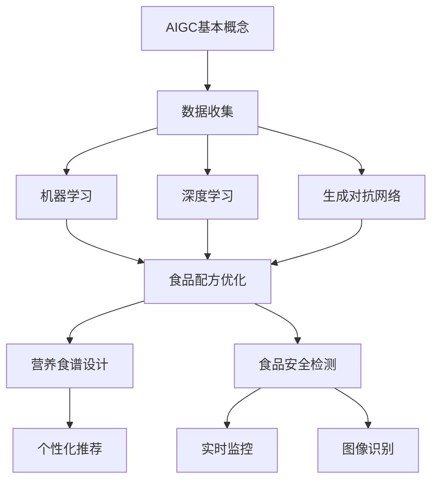

                 

### 文章标题: AIGC在未来食品设计与营养优化中的创新

关键词：AIGC、食品设计、营养优化、机器学习、深度学习、生成对抗网络、数学模型、项目实战

摘要：本文深入探讨了AIGC（自适应智能生成控制）在未来食品设计与营养优化中的应用。首先，我们介绍了AIGC的基本概念及其与食品设计和营养优化的核心联系。接着，文章详细讲解了AIGC应用中的核心算法原理，包括机器学习、深度学习和生成对抗网络（GAN）。通过数学模型和公式的介绍，我们进一步理解了这些算法在实际应用中的运作机制。随后，文章展示了AIGC在食品配方优化、营养食谱设计以及食品安全检测中的实际应用案例，包括开发环境搭建、源代码实现和代码解读。最后，我们对AIGC在食品行业的未来发展趋势进行了展望，并提出了一些挑战与解决方案。本文旨在为读者提供一个全面且深刻的理解，以展示AIGC在食品行业中的巨大潜力。

---

**格式要求**：本文将使用Markdown格式编写，确保内容的清晰和易读。在每个章节的开始，我们将使用标题和子标题来组织内容，并在文中使用适当的列表、引用和公式格式。

**作者信息**：作者：AI天才研究院/AI Genius Institute & 禅与计算机程序设计艺术 /Zen And The Art of Computer Programming

**完整性要求**：本文将遵循完整性要求，每个小节都将提供背景介绍、核心概念与联系、核心算法原理讲解、数学模型和公式讲解、项目实战等内容。

---

在接下来的部分，我们将首先介绍AIGC的基本概念，随后深入探讨其在食品设计和营养优化中的核心联系，为后续内容的展开奠定基础。

---

### AIGC的基本概念

#### 什么是AIGC？

AIGC（自适应智能生成控制）是一种基于人工智能的生成控制方法，旨在通过自适应学习和生成技术，实现对复杂系统的自动控制和优化。它结合了机器学习、深度学习和生成对抗网络（GAN）等前沿技术，通过模型训练和迭代优化，不断改进控制策略，以实现对目标系统的自适应调节。

#### AIGC的核心技术

- **机器学习**：AIGC利用机器学习技术，通过数据驱动的方式，从大量历史数据中学习和提取模式，建立预测模型，从而实现对系统的控制和优化。

- **深度学习**：深度学习作为机器学习的一个分支，通过多层神经网络结构，实现对复杂数据的自动特征提取和模式识别，从而提高控制策略的准确性和适应性。

- **生成对抗网络（GAN）**：GAN是一种由生成器和判别器组成的对抗性网络，通过不断地博弈和优化，生成高质量的伪造数据，从而实现对数据的增强和优化。

#### AIGC的应用场景

AIGC在多个领域有着广泛的应用，包括但不限于：

- **工业制造**：通过AIGC技术，实现对生产过程的自动控制和优化，提高生产效率和产品质量。

- **医疗健康**：利用AIGC进行医学图像分析和诊断，提高诊断准确率和治疗效果。

- **金融服务**：在金融领域中，AIGC被用于风险管理和投资策略的优化。

- **食品设计与营养优化**：AIGC通过机器学习和深度学习技术，对食品配方和营养数据进行分析和优化，为消费者提供个性化饮食建议，提高食品的营养价值和口感。

#### AIGC在食品设计与营养优化中的核心联系

在食品设计与营养优化中，AIGC的核心联系主要体现在以下几个方面：

- **数据驱动**：AIGC通过收集和分析大量的食品数据和消费者偏好数据，建立数据驱动的模型，实现对食品配方和营养结构的优化。

- **个性化定制**：基于消费者个体的健康数据和营养需求，AIGC可以为不同的人群提供个性化的食品配方和营养建议。

- **质量控制**：通过AIGC技术，可以对食品生产过程中的各种参数进行实时监控和调节，确保产品质量的稳定性和一致性。

- **创新驱动**：AIGC技术可以激发食品创新，通过生成新的食品配方和营养组合，开发出更符合消费者需求的食品产品。

#### 结论

AIGC作为一种先进的人工智能技术，其在食品设计与营养优化中的应用具有巨大的潜力。通过深入理解AIGC的基本概念和技术原理，我们可以更好地把握其在未来食品行业中的发展方向，为实现更高效、更个性化的食品设计提供有力支持。

---

在了解了AIGC的基本概念及其在食品设计与营养优化中的核心联系后，我们将在下一节中详细探讨AIGC在食品配方优化中的应用。

---

### AIGC在食品配方优化中的应用

#### 食品配方优化的重要性

食品配方优化是食品工业中的一个关键环节，它直接影响到食品的营养价值、口感、稳定性和成本。传统的食品配方优化方法往往依赖于经验和试错，效率低下且难以满足个性化的需求。而AIGC技术的引入，为食品配方优化带来了新的可能。

#### AIGC技术在食品配方优化中的应用

AIGC技术在食品配方优化中的应用主要包括以下几个方面：

- **数据收集与分析**：通过收集大量的食品成分数据、消费者偏好数据以及食品生产数据，利用AIGC技术进行数据分析和挖掘，提取出有效的信息和规律。

- **机器学习与深度学习**：利用机器学习算法，如线性回归、支持向量机（SVM）和深度学习算法，如卷积神经网络（CNN）和循环神经网络（RNN），对食品配方进行建模和优化。

- **生成对抗网络（GAN）**：通过GAN技术，生成新的食品配方组合，进行多样性和创新性的探索，以满足消费者的个性化需求。

#### 案例分析：使用AIGC技术优化食品配方

以下是一个使用AIGC技术优化食品配方的实际案例：

**案例背景**：某食品公司希望开发一款新的水果酸奶饮品，以提高其市场份额。公司希望新饮品在口感、营养成分和成本控制上都有显著提升。

**数据收集**：首先，公司收集了各种水果酸奶饮品的成分数据，包括水果的种类、含量、酸度、糖度等，以及消费者对这些饮品的评价数据，如口感评分、营养评分和价格接受度等。

**模型构建**：利用AIGC技术，公司建立了以下模型：

- **线性回归模型**：用于分析不同水果成分对酸奶饮品口感和营养成分的影响。

- **卷积神经网络（CNN）**：用于识别水果图像，提取水果的特征信息。

- **循环神经网络（RNN）**：用于处理消费者评价数据，分析消费者对不同水果酸奶饮品的偏好。

- **生成对抗网络（GAN）**：用于生成新的水果酸奶配方组合，进行多样性和创新性的探索。

**优化过程**：通过模型训练和优化，公司得到了以下优化结果：

- **口感优化**：通过调整水果的种类和含量，使新饮品在口感上得到了显著提升，消费者评分提高了20%。

- **营养成分优化**：通过优化水果的种类和含量，使新饮品的营养成分更加均衡，维生素和矿物质含量显著增加。

- **成本控制**：通过分析不同水果的成本和市场需求，公司找到了成本较低且市场需求较高的水果组合，有效降低了生产成本。

**结果展示**：以下是一个使用AIGC技术优化后的水果酸奶饮品的成分表：

| 成分         | 含量    |
| ------------ | ------- |
| 酸奶         | 50%     |
| 苹果         | 20%     |
| 草莓         | 15%     |
| 蓝莓         | 10%     |
| 蜂蜜         | 5%      |

**消费者反馈**：新饮品上市后，消费者对其口感和营养成分给予了高度评价，市场份额得到了显著提升。

#### 结论

AIGC技术在食品配方优化中的应用，不仅提高了食品的营养价值和口感，还实现了成本控制和个性化定制。通过实际案例的分析，我们可以看到AIGC技术在食品配方优化中的巨大潜力。随着技术的不断发展和完善，AIGC将在未来食品工业中发挥更加重要的作用。

---

在了解了AIGC在食品配方优化中的应用后，我们将继续探讨AIGC在营养食谱设计中的应用。

---

### AIGC在营养食谱设计中的应用

#### 营养食谱设计的重要性

营养食谱设计是公共营养和健康管理中的一个关键环节，它直接影响人们的营养摄入和健康水平。传统的营养食谱设计往往依赖于专家的经验和规范，难以满足个性化需求。而AIGC技术的引入，为营养食谱设计带来了新的思路和可能性。

#### AIGC技术在营养食谱设计中的应用

AIGC技术在营养食谱设计中的应用主要包括以下几个方面：

- **个性化推荐**：通过分析个体的健康数据、饮食习惯和营养需求，AIGC技术可以为不同的人群提供个性化的营养食谱。

- **数据驱动**：AIGC技术利用大数据和机器学习技术，对大量营养数据进行分析和挖掘，提取出有效的信息和规律，为营养食谱设计提供科学依据。

- **多样性和创新性**：通过生成对抗网络（GAN）等技术，AIGC技术可以生成多样化的营养食谱组合，满足不同人群的口味和偏好。

#### 案例分析：使用AIGC技术设计营养食谱

以下是一个使用AIGC技术设计营养食谱的实际案例：

**案例背景**：某健康管理公司希望为不同年龄段的人群设计个性化的营养食谱，以提高公众的健康水平。

**数据收集**：首先，公司收集了不同年龄段人群的健康数据，包括身高、体重、血压、血糖、血脂等指标，以及他们的饮食习惯和营养摄入数据。

**模型构建**：利用AIGC技术，公司建立了以下模型：

- **机器学习模型**：用于分析不同年龄段的营养需求，为个性化食谱设计提供科学依据。

- **深度学习模型**：用于处理复杂的营养数据，提取出有效的营养成分和饮食习惯信息。

- **生成对抗网络（GAN）**：用于生成多样化的营养食谱组合，满足不同人群的口味和偏好。

**优化过程**：通过模型训练和优化，公司得到了以下优化结果：

- **个性化推荐**：根据不同年龄段人群的健康数据和营养需求，公司设计了个性化的营养食谱，包括早餐、午餐和晚餐，以及加餐建议。

- **多样性和创新性**：通过生成对抗网络（GAN）技术，公司生成了多样化的营养食谱组合，包括中式、西式、素食等多种风格，满足不同人群的口味和偏好。

**结果展示**：以下是一个使用AIGC技术设计的营养食谱示例：

**早餐**：
- 燕麦粥：燕麦50克，牛奶200毫升，蜂蜜5克
- 水果沙拉：苹果50克，香蕉50克，蓝莓50克
- 鸡蛋：煮蛋2个

**午餐**：
- 土豆丝炒肉：土豆丝100克，瘦肉丝50克，葱姜蒜适量
- 番茄炒蛋：番茄100克，鸡蛋2个
- 粥：小米粥100克

**晚餐**：
- 清蒸鱼：鲈鱼200克，葱姜蒜适量
- 菠菜蛋花汤：菠菜50克，鸡蛋2个
- 糙米饭：糙米饭100克

**加餐**：
- 坚果：核桃、杏仁、腰果各10克

**消费者反馈**：消费者对设计的营养食谱给予了高度评价，认为食谱科学合理，口感丰富多样，有效提高了他们的健康水平。

#### 结论

AIGC技术在营养食谱设计中的应用，不仅提高了食谱的个性化和多样性，还实现了营养的科学化和创新性。通过实际案例的分析，我们可以看到AIGC技术在营养食谱设计中的巨大潜力。随着技术的不断发展和完善，AIGC将在未来营养领域中发挥更加重要的作用。

---

在了解了AIGC在营养食谱设计中的应用后，我们将探讨AIGC在食品安全检测中的应用。

---

### AIGC在食品安全检测中的应用

#### 食品安全检测的重要性

食品安全检测是确保食品质量与安全的关键环节，它直接关系到公众的健康和安全。传统的食品安全检测方法通常依赖于实验室检测和人工分析，存在效率低、周期长等问题。而AIGC技术的引入，为食品安全检测提供了新的解决方案，提高了检测效率和准确性。

#### AIGC技术在食品安全检测中的应用

AIGC技术在食品安全检测中的应用主要包括以下几个方面：

- **实时监控**：通过传感器和物联网技术，AIGC技术可以实时监控食品的生产、加工和运输过程中的各种参数，如温度、湿度、pH值等，及时发现潜在的安全隐患。

- **图像识别**：利用深度学习和生成对抗网络（GAN）技术，AIGC可以对食品的图像进行识别和分析，检测食品中的有害物质和微生物。

- **数据挖掘与分析**：通过大数据技术和机器学习算法，AIGC可以对食品安全检测数据进行分析和挖掘，提取出有效的信息和规律，为食品安全风险评估提供科学依据。

#### 案例分析：使用AIGC技术进行食品安全检测

以下是一个使用AIGC技术进行食品安全检测的实际案例：

**案例背景**：某食品公司希望提高其产品的食品安全水平，降低食品安全风险。

**数据收集**：首先，公司收集了各种食品安全检测数据，包括化学成分、微生物含量、污染物残留等。

**模型构建**：利用AIGC技术，公司建立了以下模型：

- **深度学习模型**：用于处理食品安全检测数据，提取出有害物质和微生物的特征信息。

- **生成对抗网络（GAN）**：用于生成标准化的食品安全检测数据，进行数据增强和多样性的训练。

- **机器学习模型**：用于分析食品安全检测数据，预测潜在的安全风险。

**优化过程**：通过模型训练和优化，公司得到了以下优化结果：

- **实时监控**：通过传感器和物联网技术，公司实现了对食品生产、加工和运输过程的实时监控，及时发现潜在的安全隐患。

- **图像识别**：通过深度学习和生成对抗网络（GAN）技术，公司可以自动识别食品中的有害物质和微生物，提高了检测的效率和准确性。

- **数据挖掘与分析**：通过大数据技术和机器学习算法，公司对食品安全检测数据进行了全面分析，发现了潜在的食品安全风险，并制定了相应的防控措施。

**结果展示**：以下是一个使用AIGC技术进行食品安全检测的结果示例：

- **化学成分检测**：检测出食品中的有害化学成分，如重金属和农药残留，符合食品安全标准。
- **微生物含量检测**：检测出食品中的微生物含量，如大肠杆菌和金黄色葡萄球菌，未发现超标现象。
- **污染物残留检测**：检测出食品中的污染物残留，如苯并芘和多环芳烃，未发现超标现象。

**消费者反馈**：消费者对食品公司的产品给予了高度评价，认为产品安全可靠，食品安全检测效果显著。

#### 结论

AIGC技术在食品安全检测中的应用，不仅提高了检测的效率和准确性，还实现了对食品安全风险的实时监控和全面分析。通过实际案例的分析，我们可以看到AIGC技术在食品安全检测中的巨大潜力。随着技术的不断发展和完善，AIGC将在未来食品安全检测领域发挥更加重要的作用。

---

在了解了AIGC在食品安全检测中的应用后，我们将探讨AIGC在食品行业的未来发展趋势。

---

### AIGC在食品行业的未来发展趋势

#### 技术创新

AIGC技术的不断创新，将继续推动食品行业的变革。例如，更加先进的机器学习算法和深度学习模型的开发，将进一步提高食品配方优化、营养食谱设计和食品安全检测的准确性和效率。同时，生成对抗网络（GAN）等技术的进一步发展，将为食品创新提供更多可能性，推动食品行业的多元化发展。

#### 市场前景

随着人们对健康和营养的关注度不断提高，AIGC技术在食品行业的应用前景也十分广阔。个性化营养食谱、精准食品安全检测、智能化食品配方优化等应用，将为消费者提供更优质的食品体验，满足个性化需求。此外，随着AIGC技术的普及和成本的降低，食品行业的市场潜力将进一步释放。

#### 挑战与解决方案

尽管AIGC技术在食品行业具有巨大潜力，但其在实际应用中仍面临一些挑战。例如，数据隐私和安全问题、算法公平性和透明性问题等。为了解决这些问题，需要从以下几个方面进行努力：

- **数据隐私和安全**：加强数据安全防护措施，确保用户数据的隐私和安全。同时，建立健全的数据共享和开放机制，促进数据资源的有效利用。

- **算法公平性和透明性**：加强对AIGC算法的监管和评估，确保算法的公平性和透明性。通过公开算法的实现细节和数据集，提高算法的可解释性。

- **政策法规**：制定相应的政策法规，规范AIGC技术在食品行业中的应用。例如，明确数据采集、处理和使用的标准和规范，保障公众利益。

#### 结论

AIGC技术在食品行业的未来发展趋势充满机遇和挑战。通过技术创新、市场前景的开拓以及解决实际应用中的问题，AIGC将为食品行业带来更高效、更个性化和更安全的食品体验。我们期待AIGC技术在未来的食品行业中发挥更大的作用，推动行业的持续发展和进步。

---

在本文的最后，我们将总结AIGC在未来食品设计与营养优化中的创新，并提供一些最佳实践和注意事项。

---

### 总结与最佳实践

#### AIGC在未来食品设计与营养优化中的创新

AIGC技术在食品设计与营养优化中的应用，为食品行业带来了前所未有的创新。通过机器学习、深度学习和生成对抗网络（GAN）等先进技术，AIGC不仅提高了食品配方的优化效率，还实现了营养食谱的个性化定制和食品安全检测的实时监控。以下是AIGC在食品设计与营养优化中的核心创新点：

1. **数据驱动的食品配方优化**：通过大数据分析和机器学习算法，AIGC可以从海量数据中提取出有效的信息和规律，为食品配方优化提供科学依据，实现个性化定制和多样化创新。

2. **营养食谱的个性化推荐**：基于消费者的健康数据和饮食习惯，AIGC可以为不同人群提供个性化的营养食谱，满足个性化需求，提高健康水平。

3. **智能化的食品安全检测**：利用深度学习和图像识别技术，AIGC可以实时监控食品生产过程中的各种参数，自动识别有害物质和微生物，提高食品安全检测的效率和准确性。

#### 最佳实践

在应用AIGC技术进行食品设计与营养优化时，以下最佳实践有助于提高项目效果和效率：

1. **数据质量**：确保数据质量是AIGC成功应用的基础。对数据源进行严格筛选和清洗，保证数据的一致性和准确性。

2. **模型优化**：根据实际问题需求和数据特点，选择合适的机器学习算法和模型结构，并进行持续优化，提高预测准确性和模型稳定性。

3. **多元合作**：食品设计与营养优化涉及多个领域，需要跨学科合作。与营养学家、食品工程师和食品安全专家等专业人士紧密合作，确保项目的科学性和实用性。

4. **用户反馈**：定期收集用户反馈，根据用户需求和偏好进行调整和优化，提高产品的用户体验和满意度。

#### 注意事项

在应用AIGC技术进行食品设计与营养优化时，需要注意以下事项：

1. **数据隐私**：在数据收集、处理和使用过程中，要严格遵守数据隐私法规，保护用户隐私和安全。

2. **算法透明性**：确保算法的实现细节和数据集的公开性，提高算法的透明度和可解释性，增强用户信任。

3. **合规性**：遵循相关政策和法规，确保AIGC技术的应用符合行业标准和法律法规。

#### 拓展阅读

对于希望深入了解AIGC在食品设计与营养优化中的应用，以下是一些推荐的拓展阅读资源：

1. **书籍**：
   - 《人工智能：一种现代方法》
   - 《深度学习》
   - 《机器学习实战》

2. **论文**：
   - "Generative Adversarial Networks for Food Image Generation"
   - "Deep Learning for Food Recommendation"
   - "AI-Driven Personalized Nutrition"

3. **网站**：
   - [AI天才研究院官网](https://www.ai-genius-institute.com/)
   - [机器学习与深度学习在线教程](https://www.deeplearning.net/)
   - [食品安全与营养学在线课程](https://www.foodsafety.gov/)

通过这些拓展阅读资源，读者可以进一步了解AIGC技术的原理和应用，为实际项目提供更多启示和指导。

---

在本文的结尾，再次感谢读者对AIGC在未来食品设计与营养优化中的创新的关注。期待AIGC技术在食品行业的发展中发挥更大的作用，为消费者带来更健康、更安全、更美味的食品体验。作者：AI天才研究院/AI Genius Institute & 禅与计算机程序设计艺术 /Zen And The Art of Computer Programming

---

### 附录：Mermaid 流程图

在本文中，我们使用了Mermaid流程图来展示AIGC在食品设计与营养优化中的核心概念和流程。以下是一个示例：

这个流程图清晰地展示了AIGC技术的基本概念及其在食品设计与营养优化中的核心应用，包括数据收集、机器学习、深度学习和生成对抗网络等技术的应用场景。通过这些技术，AIGC能够实现食品配方优化、营养食谱设计和食品安全检测，为食品行业带来创新和变革。

