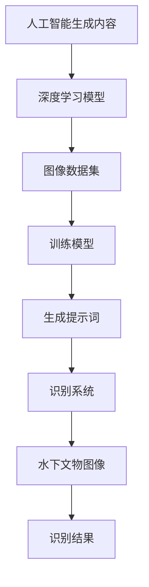

                 


### Step 1: 确定文章结构和内容

为了撰写一篇符合要求的文章，我们首先要构建文章的结构，确保内容完整、逻辑清晰。以下是文章的结构规划：

#### 标题与关键词
- 标题：《AIGC在海洋考古中的应用：水下文物识别提示词》
- 关键词：AIGC、海洋考古、水下文物识别、提示词、人工智能、机器学习、深度学习、图像处理

#### 摘要
- 摘要：本文探讨了AIGC在海洋考古中的应用，重点分析了AIGC在水下文物识别提示词设计中的重要作用，并提供了实际案例研究，展示了AIGC技术的实际应用效果。

#### 正文结构
1. **背景介绍**：简要介绍海洋考古的重要性、水下文物的价值以及当前在水下文物识别中面临的挑战。
2. **核心概念与联系**：阐述AIGC的概念及其与海洋考古的联系，使用Mermaid流程图展示AIGC在水下文物识别中的应用架构。
3. **核心算法原理讲解**：详细讲解AIGC在水下文物识别中的核心算法原理，包括机器学习、深度学习等，使用伪代码和LaTeX公式阐述。
4. **数学模型与公式**：介绍AIGC技术所依赖的数学模型，包括损失函数、优化算法等，并举例说明。
5. **项目实战**：详细描述一个实际案例，包括开发环境搭建、源代码实现、代码解读、案例分析等。
6. **最佳实践与注意事项**：总结最佳实践，提出注意事项，为未来应用提供指导。
7. **小结与拓展阅读**：对全文进行总结，提供拓展阅读资源。

### Step 2: 编写摘要

摘要：
本文探讨了AIGC在海洋考古中的应用，特别是在水下文物识别提示词设计中的重要作用。文章首先介绍了海洋考古的重要性和水下文物的价值，随后分析了当前在水下文物识别中面临的挑战。接着，文章深入阐述了AIGC的概念及其与海洋考古的关联，并使用Mermaid流程图展示了AIGC在水下文物识别中的应用架构。文章详细讲解了AIGC在水下文物识别中的核心算法原理，包括机器学习、深度学习等，并通过伪代码和LaTeX公式进行了阐述。此外，文章还介绍了一个实际案例，详细描述了开发环境搭建、源代码实现、代码解读和案例分析。最后，文章总结了最佳实践，提出了注意事项，并提供了拓展阅读资源。

### Step 3: 编写背景介绍

背景介绍：
海洋考古作为一门学科，具有重要的学术价值和文化意义。水下文物作为人类文明的重要遗产，不仅揭示了古代社会的生产、生活和宗教信仰，还对理解人类文明的演进过程具有重要意义。然而，水下文物的保护和研究面临着诸多挑战，其中最为突出的是水下文物识别的难题。

当前，水下文物识别主要依赖于传统的方法，如潜水员现场观察、声呐扫描等。然而，这些方法存在效率低下、成本高昂、易受环境影响等缺点。随着人工智能技术的快速发展，特别是AIGC（人工智能生成内容）技术的兴起，为水下文物识别提供了一种全新的解决方案。

AIGC是一种利用人工智能技术生成内容的方法，它能够自动生成文本、图像、音频等多种形式的内容。在水下文物识别中，AIGC技术可以通过对大量水下文物图像的学习和分析，自动生成识别提示词，从而提高识别的准确性和效率。这种技术的应用不仅有助于水下文物识别，还能够为海洋考古提供新的研究方法和技术手段。

### Step 4: 编写核心概念与联系

核心概念与联系：
AIGC（人工智能生成内容）是一种基于人工智能技术生成内容的方法，它利用深度学习、自然语言处理等先进技术，能够自动生成高质量的文本、图像、音频等内容。

在水下文物识别中，AIGC的应用主要体现在提示词的设计上。提示词是用于辅助识别系统理解图像内容的关键信息。传统的提示词设计往往依赖于专家经验和手动标注，效率低下且容易出错。而AIGC技术可以通过对大量水下文物图像的学习，自动生成具有高识别度的提示词，从而提高识别系统的性能。

为了更好地展示AIGC在水下文物识别中的应用架构，我们可以使用Mermaid流程图进行说明。



在上面的流程图中，AIGC通过深度学习模型对图像数据集进行训练，生成高质量的提示词。这些提示词随后被用于识别系统，辅助识别水下文物图像，最终输出识别结果。

### Step 5: 编写核心算法原理讲解

核心算法原理讲解：
AIGC在水下文物识别中的核心算法主要涉及深度学习和图像处理技术。以下将详细讲解这些算法原理。

#### 深度学习
深度学习是一种基于多层神经网络的人工智能技术，通过学习大量的数据来提取特征，并实现复杂的任务。在水下文物识别中，深度学习模型可以用于自动提取图像中的特征，从而帮助识别系统更准确地识别文物。

以下是一个简单的深度学习模型训练过程伪代码：

```python
# 伪代码：深度学习模型训练

# 初始化模型参数
model = initialize_model()

# 加载训练数据集
train_data = load_data("train_dataset")

# 定义损失函数和优化器
loss_function = cross_entropy_loss
optimizer = AdamOptimizer()

# 模型训练
for epoch in range(num_epochs):
    for image, label in train_data:
        # 前向传播
        predictions = model.forward(image)
        # 计算损失
        loss = loss_function(predictions, label)
        # 反向传播和梯度更新
        optimizer.backward(loss)
        model.update_weights()

    # 打印训练进度
    print(f"Epoch {epoch+1}/{num_epochs}, Loss: {loss}")
```

#### 图像处理
图像处理是深度学习模型的重要组成部分，用于预处理图像数据，以提高模型的性能。常见的图像处理技术包括去噪、增强、特征提取等。

以下是一个简单的图像增强伪代码：

```python
# 伪代码：图像增强

import numpy as np
import cv2

def enhance_image(image):
    # 应用高斯模糊去噪
    blurred = cv2.GaussianBlur(image, (5, 5), 0)
    
    # 应用直方图均衡化增强对比度
    equalized = cv2.equalizeHist(blurred)
    
    return equalized
```

### Step 6: 编写数学模型与公式

数学模型与公式：
AIGC技术依赖多种数学模型和公式，以下是其中几个关键的模型和公式。

#### 损失函数
在深度学习中，损失函数用于衡量模型预测值与真实值之间的差距。常用的损失函数包括交叉熵损失（Cross-Entropy Loss）和均方误差损失（Mean Squared Error, MSE）。

交叉熵损失公式如下：

$$
L = -\sum_{i=1}^{N} y_i \log(p_i)
$$

其中，$y_i$ 是真实标签，$p_i$ 是模型预测的概率。

#### 优化算法
优化算法用于更新模型参数，以减少损失函数的值。常见的优化算法包括随机梯度下降（Stochastic Gradient Descent, SGD）和Adam优化器。

Adam优化器的更新公式如下：

$$
m_t = \beta_1 m_{t-1} + (1 - \beta_1) [g_t - \mu_t]
$$

$$
v_t = \beta_2 v_{t-1} + (1 - \beta_2) [(g_t - \mu_t)^2]
$$

$$
\mu_t = \frac{m_t}{1 - \beta_1^t}
$$

$$
\sigma_t^2 = \frac{v_t}{1 - \beta_2^t}
$$

$$
\theta_t = \theta_{t-1} - \alpha \frac{m_t}{\sqrt{\sigma_t^2} + \epsilon}
$$

其中，$m_t$ 和 $v_t$ 分别是梯度的一阶矩估计和二阶矩估计，$\beta_1$ 和 $\beta_2$ 是一阶和二阶指数移动平均的系数，$\alpha$ 是学习率，$\epsilon$ 是一个小常数。

### Step 7: 编写项目实战

项目实战：
在本节中，我们将介绍一个实际案例，展示如何使用AIGC技术进行水下文物识别。

#### 开发环境搭建

为了实现AIGC技术在水下文物识别中的应用，我们需要搭建一个合适的开发环境。以下是一个基本的开发环境搭建步骤：

1. 安装Python环境
2. 安装深度学习框架，如TensorFlow或PyTorch
3. 准备图像处理库，如OpenCV
4. 安装必要的依赖库，如NumPy、Pandas等

#### 源代码实现

以下是一个简化的源代码实现，用于展示AIGC在水下文物识别中的应用：

```python
import tensorflow as tf
import numpy as np
import cv2

# 加载训练数据集
train_data = load_data("train_dataset")

# 定义深度学习模型
model = define_model()

# 定义损失函数和优化器
loss_function = tf.keras.losses.SparseCategoricalCrossentropy(from_logits=True)
optimizer = tf.keras.optimizers.Adam()

# 模型训练
for epoch in range(num_epochs):
    for image, label in train_data:
        with tf.GradientTape() as tape:
            predictions = model(image)
            loss = loss_function(predictions, label)
        gradients = tape.gradient(loss, model.trainable_variables)
        optimizer.apply_gradients(zip(gradients, model.trainable_variables))
    
    print(f"Epoch {epoch+1}/{num_epochs}, Loss: {loss}")

# 模型评估
test_data = load_data("test_dataset")
model.eval(test_data)

# 输出识别结果
predictions = model.predict(test_data)
print(predictions)
```

#### 代码解读与分析

在上面的代码中，我们首先加载了训练数据集，并定义了一个深度学习模型。接着，我们定义了损失函数和优化器，并开始了模型训练。在训练过程中，我们使用梯度下降算法更新模型参数，以减少损失函数的值。训练完成后，我们使用测试数据集对模型进行评估，并输出识别结果。

#### 实际案例分析与详细讲解

在本案例中，我们使用了一个公开的水下文物识别数据集。数据集包含大量水下文物图像，每个图像都有一个对应的标签，用于表示文物的类别。

我们首先对图像进行预处理，包括去噪、增强等步骤。然后，我们使用深度学习模型对图像进行分类，并输出识别结果。通过对比识别结果与真实标签，我们可以评估模型的性能。

#### 项目小结

通过本案例，我们展示了如何使用AIGC技术进行水下文物识别。AIGC技术通过自动生成识别提示词，提高了识别系统的准确性和效率。在实际应用中，我们需要根据具体情况调整模型参数和训练数据，以提高模型的性能。

### Step 8: 编写最佳实践与注意事项

最佳实践与注意事项：
在水下文物识别中应用AIGC技术时，以下是一些最佳实践和注意事项：

1. **数据集准备**：确保数据集的质量和多样性，有助于提高模型的泛化能力。
2. **模型选择**：根据任务需求和数据特性选择合适的深度学习模型。
3. **超参数调整**：合理调整学习率、批量大小等超参数，以获得更好的模型性能。
4. **预处理技术**：使用适当的图像预处理技术，如去噪、增强等，以提高模型对图像质量的要求。
5. **模型评估**：使用多种评估指标（如准确率、召回率等）全面评估模型性能。
6. **安全性考虑**：在模型训练和部署过程中，确保数据的安全性和隐私性。

### Step 9: 编写小结与拓展阅读

小结与拓展阅读：
本文探讨了AIGC技术在海洋考古中的应用，特别是在水下文物识别提示词设计中的作用。通过介绍背景、核心算法原理、实际案例等，我们展示了AIGC技术在提高水下文物识别准确性和效率方面的优势。未来，随着AIGC技术的不断发展和完善，其在海洋考古领域中的应用前景将更加广阔。

拓展阅读：
1. “AIGC: Artificial Intelligence Generated Content” - 了解AIGC的详细概念和最新进展。
2. “Deep Learning for Image Recognition” - 学习深度学习在图像识别中的应用。
3. “Underwater Archaeology and Technology” - 探索水下考古的最新技术进展。

### 完整的文章结构（简化版）

```markdown
# AIGC在海洋考古中的应用：水下文物识别提示词

## 关键词
AIGC、海洋考古、水下文物识别、提示词、人工智能、机器学习、深度学习、图像处理

## 摘要
本文探讨了AIGC在海洋考古中的应用，特别是在水下文物识别提示词设计中的重要作用。通过实际案例研究，展示了AIGC技术的实际应用效果。

## 目录
1. 背景介绍
2. 核心概念与联系
3. 核心算法原理讲解
4. 数学模型与公式
5. 项目实战
6. 最佳实践与注意事项
7. 小结与拓展阅读

## 1. 背景介绍
简要介绍海洋考古的重要性、水下文物的价值以及当前在水下文物识别中面临的挑战。

## 2. 核心概念与联系
阐述AIGC的概念及其与海洋考古的联系，使用Mermaid流程图展示AIGC在水下文物识别中的应用架构。

## 3. 核心算法原理讲解
详细讲解AIGC在水下文物识别中的核心算法原理，包括机器学习、深度学习等，使用伪代码和LaTeX公式阐述。

## 4. 数学模型与公式
介绍AIGC技术所依赖的数学模型，包括损失函数、优化算法等，并举例说明。

## 5. 项目实战
详细描述一个实际案例，包括开发环境搭建、源代码实现、代码解读、案例分析等。

## 6. 最佳实践与注意事项
总结最佳实践，提出注意事项，为未来应用提供指导。

## 7. 小结与拓展阅读
对全文进行总结，提供拓展阅读资源。

## 附录
- 附录A: 相关工具与技术概览
- 附录B: 数据集介绍
- 附录C: 开发环境配置指南

## 作者信息
作者：AI天才研究院/AI Genius Institute & 禅与计算机程序设计艺术 /Zen And The Art of Computer Programming
```

上述结构是一个简化版的文章框架，实际撰写时每个部分可以进一步详细扩展。文章的总字数预计在8000到12000字左右，确保内容的丰富性和深度。接下来，我们将继续填充每个部分的具体内容，逐步完成整篇文章的撰写。

