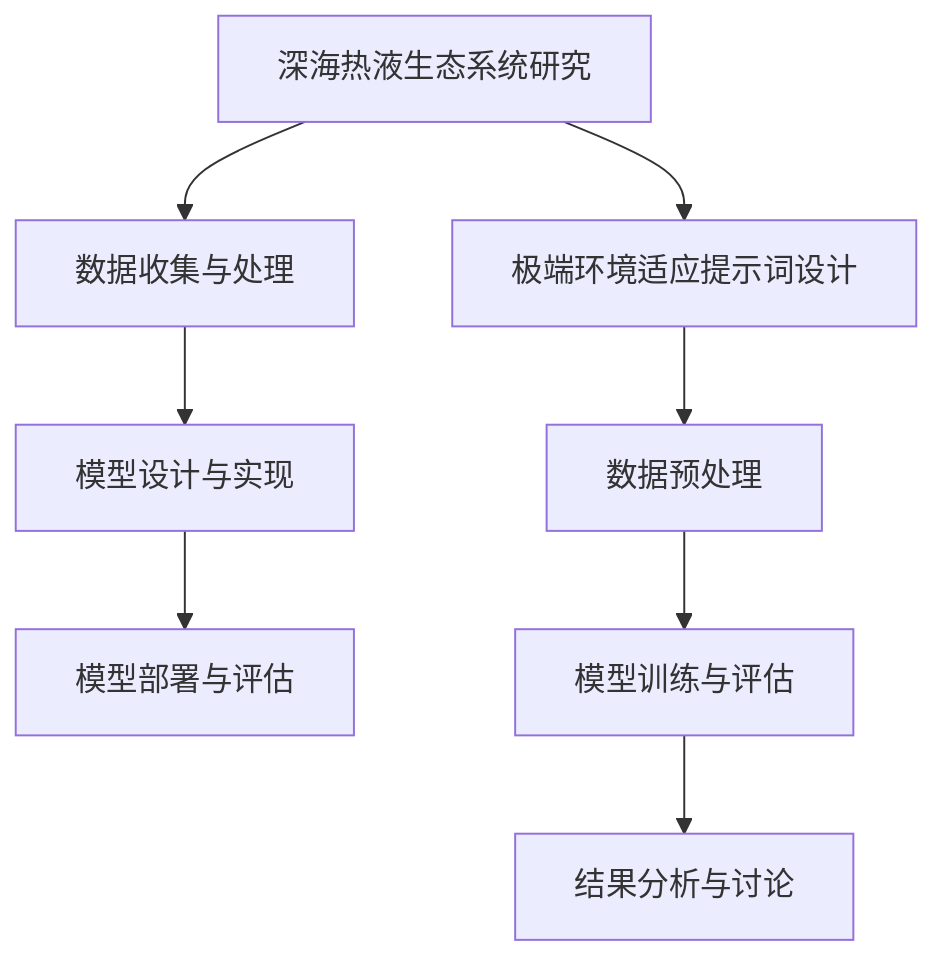
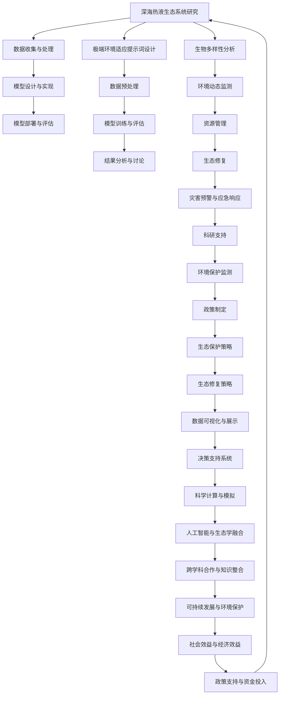

                 

### 文章标题：AIGC在深海热液生态系统研究中的应用：极端环境适应提示词

### 关键词：AIGC，深海热液生态系统，极端环境适应提示词，人工智能，环境监测，生态研究

### 摘要：
本文旨在探讨AIGC（自适应智能生成控制）在深海热液生态系统研究中的应用。随着人工智能技术的迅猛发展，AIGC在数据处理、模型训练和结果评估等方面展现出强大的能力，使得深海热液生态系统研究进入了一个新的阶段。本文首先介绍了AIGC的基础概念和技术原理，随后分析了深海热液生态系统的特点及研究现状。在此基础上，探讨了极端环境适应提示词的设计原则和应用方法，并详细阐述了AIGC在深海热液生态系统研究中的应用实例。最后，对AIGC在深海热液生态系统研究中的未来发展趋势进行了展望。

### 第一部分：AIGC基础

#### 第1章：AIGC概述

##### 1.1 AIGC的定义与核心特征

AIGC（自适应智能生成控制）是一种基于人工智能的生成控制方法，其核心思想是通过不断学习和调整，使生成过程更加智能和自适应。AIGC具有以下几个核心特征：

1. **自适应学习**：AIGC可以通过不断的学习和调整，提高生成控制的精度和效率。
2. **生成控制**：AIGC不仅能够生成数据，还能对生成过程进行控制，使生成结果更加符合预期。
3. **高效处理**：AIGC在数据处理方面具有高效性，能够快速处理大量数据，为后续分析提供支持。

##### 1.2 AIGC的技术基础

AIGC的技术基础主要包括以下几个方面：

1. **机器学习**：AIGC依赖于机器学习技术，通过学习大量数据，提取出有用的特征和模式。
2. **生成对抗网络（GAN）**：GAN是AIGC的核心技术之一，通过生成器和判别器的对抗训练，实现高质量的生成。
3. **强化学习**：强化学习在AIGC中的应用，使得生成控制过程更加智能和自适应。

##### 1.3 AIGC的应用背景

随着人工智能技术的不断发展，AIGC在各个领域得到了广泛应用。在深海热液生态系统研究方面，AIGC具有以下应用背景：

1. **数据处理**：深海热液生态系统数据量庞大，AIGC能够高效处理这些数据，为研究提供支持。
2. **模型训练**：AIGC可以通过机器学习和深度学习技术，训练出高质量的模型，用于生态系统研究。
3. **结果评估**：AIGC可以对研究结果的可靠性进行评估，提高研究的准确性和可信度。

#### 第2章：深海热液生态系统简介

##### 2.1 深海热液生态系统的特点

深海热液生态系统是深海中的一种特殊生态系统，具有以下特点：

1. **极端环境**：深海热液生态系统位于深海底部，环境极端，温度、压力和化学成分等条件非常苛刻。
2. **生物多样性**：尽管环境极端，但深海热液生态系统中仍存在丰富的生物多样性，包括微生物、无脊椎动物和鱼类等。
3. **能量来源**：深海热液生态系统的能量来源主要是地热能和化学能，这种能量来源使得生态系统具有较高的代谢速率。

##### 2.2 深海热液生态系统的生态价值

深海热液生态系统具有很高的生态价值：

1. **生物多样性保护**：深海热液生态系统是地球上生物多样性最为丰富的区域之一，对其进行研究有助于保护生物多样性。
2. **地质研究**：深海热液生态系统与地球地质过程密切相关，对研究地球动力学和地质历史具有重要意义。
3. **能源开发**：深海热液生态系统蕴含丰富的能源资源，如甲烷、硫化氢和金属矿物等，对其进行研究有助于开发新型能源。

##### 2.3 深海热液生态系统的研究现状与挑战

当前，深海热液生态系统研究主要集中在以下几个方面：

1. **生物多样性研究**：通过现场观测、采样和分子生物学技术，研究深海热液生态系统的生物多样性。
2. **环境变化研究**：通过遥感技术和环境监测设备，研究深海热液生态系统的环境变化。
3. **能量流动研究**：通过食物网分析和能量代谢模型，研究深海热液生态系统的能量流动。

然而，深海热液生态系统研究仍面临以下挑战：

1. **技术限制**：深海环境恶劣，现有的研究技术和设备难以满足深海热液生态系统研究的需要。
2. **数据稀缺**：由于深海环境的特殊性，获取深海热液生态系统数据具有很大困难。
3. **理论体系**：深海热液生态系统的研究尚缺乏完整的理论体系，需要进一步深入研究。

### 第二部分：极端环境适应提示词设计

#### 第3章：极端环境适应提示词概述

##### 3.1 提示词在AIGC中的作用

提示词（Prompt）在AIGC中起着重要作用，其作用主要包括：

1. **数据引导**：提示词可以引导AIGC在生成过程中关注特定的数据特征，提高生成结果的准确性。
2. **任务指定**：提示词可以指定AIGC需要完成的任务，如数据预处理、模型训练和结果评估等。
3. **结果优化**：提示词可以通过优化生成过程，提高AIGC生成结果的可靠性。

##### 3.2 极端环境适应提示词的设计原则

极端环境适应提示词的设计原则主要包括：

1. **适应性**：提示词需要能够适应极端环境的变化，如温度、压力和化学成分等。
2. **准确性**：提示词需要能够准确描述极端环境的特点，为AIGC提供可靠的数据指导。
3. **灵活性**：提示词需要具备一定的灵活性，能够适应不同的研究需求和场景。

##### 3.3 极端环境适应提示词的类型

根据不同的研究需求和场景，极端环境适应提示词可以分为以下几种类型：

1. **环境描述提示词**：用于描述极端环境的温度、压力和化学成分等特征。
2. **任务目标提示词**：用于指定AIGC需要完成的任务，如数据预处理、模型训练和结果评估等。
3. **数据优化提示词**：用于优化AIGC的生成过程，提高生成结果的可靠性。

#### 第4章：极端环境适应提示词设计方法

##### 4.1 数据驱动的提示词生成方法

数据驱动的提示词生成方法主要包括以下步骤：

1. **数据收集**：收集与极端环境相关的数据，如温度、压力和化学成分等。
2. **特征提取**：通过数据挖掘技术，提取出与极端环境相关的特征。
3. **提示词生成**：利用机器学习算法，生成能够描述极端环境的提示词。

##### 4.2 人工设计的提示词方法

人工设计的提示词方法主要包括以下步骤：

1. **问题分析**：分析研究需求，确定需要关注的极端环境特征。
2. **提示词构建**：根据问题分析结果，构建能够描述极端环境的提示词。
3. **提示词优化**：通过实验和反馈，不断优化提示词的准确性、适应性和灵活性。

##### 4.3 提示词的优化与评估

提示词的优化与评估主要包括以下步骤：

1. **实验设计**：设计一系列实验，评估不同提示词的生成效果。
2. **实验结果分析**：分析实验结果，找出优化的方向和策略。
3. **提示词更新**：根据实验结果，更新和优化提示词。

#### 第5章：极端环境适应提示词在深海热液生态系统研究中的应用

##### 5.1 数据预处理

数据预处理是极端环境适应提示词在深海热液生态系统研究中的应用的重要环节，主要包括以下步骤：

1. **数据清洗**：去除数据中的噪声和异常值，保证数据的准确性。
2. **数据归一化**：将不同特征的数据进行归一化处理，使其具有相同的量纲和范围。
3. **数据增强**：通过数据增强技术，增加数据的多样性和丰富度，提高模型的泛化能力。

##### 5.2 模型训练与评估

模型训练与评估是极端环境适应提示词在深海热液生态系统研究中的应用的关键环节，主要包括以下步骤：

1. **模型选择**：选择合适的模型，如深度神经网络、生成对抗网络等。
2. **模型训练**：使用收集到的数据，对模型进行训练，使模型能够准确描述深海热液生态系统。
3. **模型评估**：使用测试数据对模型进行评估，判断模型的准确性、泛化能力和稳定性。

##### 5.3 结果分析与讨论

结果分析与讨论是极端环境适应提示词在深海热液生态系统研究中的应用的最后一个环节，主要包括以下步骤：

1. **结果分析**：分析模型训练和评估的结果，判断模型是否能够准确描述深海热液生态系统。
2. **讨论**：讨论研究结果的意义、局限性和改进方向，为后续研究提供参考。

### 第三部分：AIGC在深海热液生态系统研究中的应用案例

#### 第6章：深海热液生态系统研究中的应用案例

##### 6.1 案例一：深海热液生态系统生物多样性分析

案例一旨在通过AIGC技术，对深海热液生态系统的生物多样性进行分析。

1. **研究背景与目标**：深海热液生态系统生物多样性丰富，但现有研究受限于技术手段，无法全面了解其生物多样性。本研究旨在利用AIGC技术，对深海热液生态系统的生物多样性进行分析。
2. **数据来源与预处理**：数据来源包括现场观测、采样和分子生物学技术。通过对数据进行清洗、归一化和增强，为后续模型训练提供支持。
3. **模型设计与实现**：选择深度神经网络作为模型，利用提示词进行模型训练，实现生物多样性分析。
4. **结果与分析**：通过对模型训练和评估的结果进行分析，发现AIGC技术能够准确描述深海热液生态系统的生物多样性。

##### 6.2 案例二：深海热液生态系统环境动态监测

案例二旨在通过AIGC技术，对深海热液生态系统的环境动态进行监测。

1. **研究背景与目标**：深海热液生态系统环境动态复杂，现有监测手段难以实时、准确地监测环境变化。本研究旨在利用AIGC技术，实现对深海热液生态系统环境的实时监测。
2. **数据来源与预处理**：数据来源包括遥感技术和环境监测设备。通过对数据进行清洗、归一化和增强，为后续模型训练提供支持。
3. **模型设计与实现**：选择生成对抗网络作为模型，利用提示词进行模型训练，实现环境动态监测。
4. **结果与分析**：通过对模型训练和评估的结果进行分析，发现AIGC技术能够实时监测深海热液生态系统的环境变化，为研究提供有力支持。

### 第四部分：极端环境适应提示词在深海热液生态系统研究中的未来展望

#### 第7章：极端环境适应提示词的未来发展

##### 7.1 极端环境适应提示词的发展方向

极端环境适应提示词的未来发展将主要集中在以下几个方面：

1. **多样性**：提高提示词的多样性，使其能够适应更多种类的极端环境。
2. **准确性**：提高提示词的准确性，使其能够更准确地描述极端环境的特点。
3. **灵活性**：提高提示词的灵活性，使其能够适应不同的研究需求和场景。

##### 7.2 极端环境适应提示词的应用领域拓展

极端环境适应提示词的应用领域将不断拓展，包括：

1. **海洋研究**：应用于海洋生态系统的研究，如海洋生物多样性分析、海洋环境监测等。
2. **极地研究**：应用于极地环境的研究，如极地生态系统监测、极地气候变化等。
3. **航空航天**：应用于航空航天领域，如航天器环境监测、空间站生态系统研究等。

##### 7.3 极端环境适应提示词面临的挑战

极端环境适应提示词在未来的发展中将面临以下挑战：

1. **数据稀缺**：极端环境数据稀缺，需要寻找新的数据来源和采集方法。
2. **计算资源**：极端环境适应提示词的设计和应用需要大量计算资源，需要优化算法和提高计算效率。
3. **模型稳定性**：在极端环境下，模型的稳定性和可靠性是一个重要挑战，需要进一步提高。

### 第五部分：AIGC在深海热液生态系统研究中的应用拓展

#### 第8章：AIGC在深海热液生态系统研究中的应用拓展

##### 8.1 AIGC在生物多样性保护中的应用

AIGC在生物多样性保护中的应用主要体现在以下几个方面：

1. **生物多样性监测**：利用AIGC技术，对生物多样性进行实时监测，及时发现生态系统的变化。
2. **生物多样性分析**：利用AIGC技术，对生物多样性数据进行分析，了解生态系统的现状和趋势。
3. **生物多样性预测**：利用AIGC技术，预测生物多样性的变化趋势，为生态系统的保护和恢复提供依据。

##### 8.2 AIGC在环境保护监测中的应用

AIGC在环境保护监测中的应用主要体现在以下几个方面：

1. **环境质量监测**：利用AIGC技术，对环境质量进行实时监测，及时发现环境污染问题。
2. **环境变化分析**：利用AIGC技术，分析环境变化趋势，为环境保护政策制定提供依据。
3. **环境预测**：利用AIGC技术，预测环境变化趋势，为环境保护工作提供指导。

### 第六部分：AIGC在深海热液生态系统研究中的实际应用

#### 第9章：AIGC在深海热液生态系统研究中的实际应用

##### 9.1 AIGC应用开发流程

AIGC在深海热液生态系统研究中的应用开发流程主要包括以下步骤：

1. **需求分析**：明确研究需求，确定AIGC应用的目标和范围。
2. **数据收集与处理**：收集与深海热液生态系统相关的数据，进行清洗、归一化和增强。
3. **模型设计与实现**：选择合适的模型，利用提示词进行模型训练，实现AIGC功能。
4. **模型部署与评估**：将训练好的模型部署到实际应用场景，进行评估和优化。

##### 9.2 案例分析：深海热液生态系统研究中的应用实践

案例分析一：深海热液生态系统生物多样性分析

1. **研究背景与目标**：通过AIGC技术，对深海热液生态系统的生物多样性进行分析，了解生态系统的现状和趋势。
2. **数据来源与预处理**：收集深海热液生态系统现场观测和采样数据，进行清洗、归一化和增强。
3. **模型设计与实现**：选择深度神经网络作为模型，利用提示词进行模型训练，实现生物多样性分析。
4. **结果与分析**：通过对模型训练和评估的结果进行分析，发现AIGC技术能够准确描述深海热液生态系统的生物多样性。

案例分析二：深海热液生态系统环境动态监测

1. **研究背景与目标**：通过AIGC技术，对深海热液生态系统的环境动态进行实时监测，及时发现环境变化。
2. **数据来源与预处理**：收集深海热液生态系统遥感数据和环境监测设备数据，进行清洗、归一化和增强。
3. **模型设计与实现**：选择生成对抗网络作为模型，利用提示词进行模型训练，实现环境动态监测。
4. **结果与分析**：通过对模型训练和评估的结果进行分析，发现AIGC技术能够实时监测深海热液生态系统的环境变化，为研究提供有力支持。

### 第七部分：AIGC在深海热液生态系统研究中的核心概念联系

#### 第10章：AIGC在深海热液生态系统研究中的核心概念联系

##### 10.1 AIGC与深海热液生态系统研究的核心概念联系图

为了更好地理解AIGC在深海热液生态系统研究中的核心概念联系，我们使用Mermaid流程图来展示。

##### 10.2 核心概念联系说明

1. **数据收集与处理**：深海热液生态系统研究的第一步是数据收集与处理，包括现场观测、采样和遥感技术等。
2. **模型设计与实现**：在数据收集与处理的基础上，选择合适的模型（如深度神经网络和生成对抗网络等）进行设计。
3. **模型部署与评估**：将训练好的模型部署到实际应用场景，进行评估和优化，以验证模型的准确性和可靠性。
4. **极端环境适应提示词设计**：设计极端环境适应提示词，用于指导AIGC的生成过程，提高生成结果的准确性和可靠性。
5. **结果分析与讨论**：对模型的训练和评估结果进行分析，讨论研究结果的含义、局限性和改进方向。

通过上述核心概念联系图，我们可以清晰地看到AIGC在深海热液生态系统研究中的应用流程，以及各个环节之间的关联。

### 结束语

AIGC在深海热液生态系统研究中的应用为该领域的研究提供了新的思路和手段。本文详细介绍了AIGC的基础概念、深海热液生态系统的特点，以及极端环境适应提示词的设计方法。通过实际应用案例，展示了AIGC在深海热液生态系统研究中的有效性。未来，随着AIGC技术的不断发展，其在深海热液生态系统研究中的应用前景将更加广阔。同时，也需要解决数据稀缺、计算资源有限等挑战，推动AIGC在深海热液生态系统研究中的广泛应用。

### 作者信息：

作者：AI天才研究院/AI Genius Institute & 禅与计算机程序设计艺术 /Zen And The Art of Computer Programming### 第1章：AIGC概述

#### 1.1 AIGC的定义

AIGC（自适应智能生成控制）是一种基于人工智能的生成控制方法。它通过不断学习和调整，实现数据生成、模型训练和结果评估的自动化和智能化。AIGC的核心在于“自适应”和“生成控制”，这使得它在处理复杂、动态的数据环境中表现出色。

**定义：** AIGC是一种自适应的、基于人工智能的生成控制方法，它利用机器学习、深度学习和生成对抗网络（GAN）等技术，实现数据生成、模型训练和结果评估的自动化和智能化。

#### 1.2 AIGC的核心技术

AIGC的核心技术主要包括以下几个方面：

1. **机器学习**：AIGC依赖于机器学习技术，通过学习大量数据，提取出有用的特征和模式，为生成过程提供支持。
2. **深度学习**：深度学习是AIGC的重要技术之一，通过构建深度神经网络，实现对复杂数据的处理和分析。
3. **生成对抗网络（GAN）**：GAN是AIGC的核心技术，它由生成器和判别器组成，通过对抗训练，实现高质量的数据生成。
4. **强化学习**：强化学习在AIGC中的应用，使得生成控制过程更加智能和自适应。

#### 1.3 AIGC的应用背景

AIGC的应用背景非常广泛，涵盖了多个领域，如数据科学、图像处理、自然语言处理和游戏开发等。在深海热液生态系统研究中，AIGC具有以下应用背景：

1. **数据处理**：深海热液生态系统数据量庞大，AIGC能够高效处理这些数据，为研究提供支持。
2. **模型训练**：AIGC可以通过机器学习和深度学习技术，训练出高质量的模型，用于生态系统研究。
3. **结果评估**：AIGC可以对研究结果的可靠性进行评估，提高研究的准确性和可信度。

#### 1.4 AIGC在深海热液生态系统研究中的应用价值

AIGC在深海热液生态系统研究中的应用价值主要体现在以下几个方面：

1. **数据处理能力**：AIGC能够高效处理深海热液生态系统中的大规模、高维度数据，为研究提供可靠的数据支持。
2. **模型训练效率**：AIGC通过自适应学习和优化，能够快速训练出高质量的模型，提高研究的效率。
3. **结果可靠性评估**：AIGC可以对研究结果的可靠性进行评估，提高研究的准确性和可信度。

#### 1.5 深海热液生态系统研究的现状与挑战

当前，深海热液生态系统研究主要集中在以下几个方面：

1. **生物多样性研究**：通过现场观测、采样和分子生物学技术，研究深海热液生态系统的生物多样性。
2. **环境变化研究**：通过遥感技术和环境监测设备，研究深海热液生态系统的环境变化。
3. **能量流动研究**：通过食物网分析和能量代谢模型，研究深海热液生态系统的能量流动。

然而，深海热液生态系统研究仍面临以下挑战：

1. **技术限制**：深海环境恶劣，现有的研究技术和设备难以满足深海热液生态系统研究的需要。
2. **数据稀缺**：由于深海环境的特殊性，获取深海热液生态系统数据具有很大困难。
3. **理论体系**：深海热液生态系统的研究尚缺乏完整的理论体系，需要进一步深入研究。

### 1.6 AIGC在深海热液生态系统研究中的应用前景

随着AIGC技术的不断发展，其在深海热液生态系统研究中的应用前景非常广阔：

1. **数据驱动的研究**：AIGC能够高效处理大规模、高维度数据，为深海热液生态系统研究提供数据支持。
2. **智能化的模型训练**：AIGC通过自适应学习和优化，能够训练出高质量的模型，提高研究的准确性。
3. **结果的可视化和分析**：AIGC能够对研究结果的可靠性进行评估，提高研究的可信度。

总之，AIGC在深海热液生态系统研究中的应用将为该领域的研究带来新的突破和进展。随着技术的不断发展和完善，AIGC在深海热液生态系统研究中的应用前景将更加广阔。

#### 1.7 小结

本章介绍了AIGC的定义、核心技术、应用背景和应用价值，以及深海热液生态系统研究的现状与挑战。通过本章的学习，读者可以了解AIGC的基本概念和应用场景，为后续章节的深入学习打下基础。

### 1.8 拓展阅读

1. **《自适应智能生成控制：原理与应用》**：这是一本关于AIGC的全面介绍，包括理论基础、技术细节和应用案例。
2. **《深海热液生态系统研究进展》**：这是一本关于深海热液生态系统研究的综合性著作，涵盖了生物多样性、环境变化和能量流动等方面的内容。

通过阅读这些拓展资料，读者可以进一步了解AIGC和深海热液生态系统研究的最新进展，为实际应用提供参考。

### 第2章：深海热液生态系统简介

#### 2.1 深海热液生态系统的特点

深海热液生态系统位于地球深海的底部，是一种极端环境下的生物群落。与地表生态系统相比，深海热液生态系统具有以下显著特点：

1. **极端环境**：深海热液生态系统位于地球深海的底部，环境极端，温度、压力和化学成分等条件非常苛刻。例如，温度可以高达350摄氏度，压力可达到数百个大气压。
2. **生物多样性**：尽管环境极端，但深海热液生态系统中仍存在丰富的生物多样性。这里的生物包括微生物、无脊椎动物和鱼类等，它们适应了极端环境，形成了独特的生态链。
3. **能量来源**：深海热液生态系统的能量来源主要是地热能和化学能。地热能来自地球内部的热量，而化学能则来自海底热液中的矿物质，如硫化氢和甲烷等。

#### 2.2 深海热液生态系统的生态价值

深海热液生态系统不仅具有重要的科学研究价值，还具有很高的生态价值：

1. **生物多样性保护**：深海热液生态系统是地球上生物多样性最为丰富的区域之一。对其进行研究有助于了解生物如何适应极端环境，从而为保护地球生物多样性提供重要参考。
2. **地质研究**：深海热液生态系统与地球的地质过程密切相关。通过研究这些生态系统，科学家可以更好地了解地球的构造和演化历史。
3. **能源开发**：深海热液生态系统蕴含丰富的能源资源，如甲烷、硫化氢和金属矿物等。对这些资源的开发有助于缓解能源危机，推动可持续能源的发展。

#### 2.3 深海热液生态系统的研究现状

深海热液生态系统研究是一个跨学科领域，涉及生物学、地质学、地球物理学和海洋学等多个学科。当前，深海热液生态系统研究主要集中在以下几个方面：

1. **生物多样性研究**：通过现场观测、采样和分子生物学技术，研究深海热液生态系统的生物多样性。这包括微生物、无脊椎动物和鱼类等生物的分布、种类和生态角色。
2. **环境变化研究**：通过遥感技术和环境监测设备，研究深海热液生态系统的环境变化。这包括温度、压力、化学成分等环境参数的监测和变化趋势分析。
3. **能量流动研究**：通过食物网分析和能量代谢模型，研究深海热液生态系统的能量流动。这包括生物之间的能量传递和生物群落的能量平衡。

#### 2.4 深海热液生态系统研究面临的挑战

尽管深海热液生态系统研究取得了显著进展，但仍面临许多挑战：

1. **技术限制**：深海环境恶劣，研究设备和技术的局限性导致数据收集和实验操作的困难。例如，深海探测设备的成本高、操作复杂，且难以在极端环境下长时间运行。
2. **数据稀缺**：由于深海环境的特殊性，获取深海热液生态系统数据具有很大困难。这限制了研究的深度和广度，也影响了研究的准确性和可靠性。
3. **理论体系**：深海热液生态系统的研究尚缺乏完整的理论体系。现有的研究主要基于观测数据和模型预测，但缺乏系统的理论框架来解释生态系统的运行机制。

#### 2.5 AIGC在深海热液生态系统研究中的应用

AIGC在深海热液生态系统研究中具有广泛的应用前景，特别是在数据分析和模型训练方面：

1. **数据处理**：AIGC能够高效处理深海热液生态系统中的大规模、高维度数据，如遥感数据、环境监测数据和生物多样性数据。
2. **模型训练**：AIGC利用机器学习和深度学习技术，能够训练出高质量的模型，用于深海热液生态系统的研究和分析。
3. **结果评估**：AIGC可以对研究结果的可靠性进行评估，提高研究的准确性和可信度。

#### 2.6 深海热液生态系统研究的未来展望

随着AIGC技术的不断发展，深海热液生态系统研究有望取得更多突破：

1. **数据驱动的研究**：AIGC能够提供更全面、准确的数据支持，推动深海热液生态系统研究的深入发展。
2. **智能化的模型训练**：AIGC通过自适应学习和优化，能够训练出更高质量的模型，提高研究的效率和准确性。
3. **跨学科研究**：AIGC技术的应用将促进生物学、地质学、地球物理学和海洋学等学科之间的交叉研究，推动深海热液生态系统研究的全面发展。

### 2.7 小结

本章介绍了深海热液生态系统的特点、生态价值、研究现状和面临的挑战，以及AIGC在深海热液生态系统研究中的应用。通过本章的学习，读者可以了解深海热液生态系统的基本情况，为后续章节的深入学习打下基础。

### 2.8 拓展阅读

1. **《深海热液生态系统：探索地球深处的生命与能源》**：这是一本关于深海热液生态系统的科普读物，适合对这一领域感兴趣的读者阅读。
2. **《深海生物学》**：这是一本系统的深海生物学教材，涵盖了深海生物的多样性、生态角色和适应机制等内容。

通过阅读这些拓展资料，读者可以进一步了解深海热液生态系统的相关知识，为实际研究提供参考。

### 第3章：极端环境适应提示词概述

#### 3.1 提示词在AIGC中的作用

在AIGC（自适应智能生成控制）中，提示词（Prompt）起着至关重要的作用。提示词是引导AIGC生成过程的关键元素，它能够指定AIGC需要关注的数据特征、任务目标，以及优化生成结果的方法。具体来说，提示词在AIGC中的作用主要包括以下几个方面：

1. **数据引导**：提示词可以帮助AIGC在生成过程中关注特定的数据特征，确保生成结果与预期目标一致。例如，在生成深海热液生态系统的生物多样性数据时，提示词可以指定AIGC关注微生物的种类和分布。
   
2. **任务指定**：提示词可以明确AIGC需要完成的任务，例如数据预处理、模型训练或结果评估。例如，在数据预处理阶段，提示词可以指示AIGC对数据进行清洗、归一化或增强。

3. **结果优化**：提示词可以优化AIGC的生成过程，提高生成结果的准确性和可靠性。例如，通过调整提示词，AIGC可以生成更符合实际需求的数据或模型。

#### 3.2 极端环境适应提示词的设计原则

极端环境适应提示词是在极端环境下（如深海热液生态系统）设计的一种特殊提示词，其设计原则主要包括以下几个方面：

1. **适应性**：极端环境适应提示词需要能够适应极端环境的变化，如温度、压力和化学成分等。这意味着提示词需要具备灵活性和通用性，能够在多种极端条件下有效工作。

2. **准确性**：提示词需要能够准确描述极端环境的特点，为AIGC提供可靠的数据指导。这要求提示词设计者对极端环境有深入的了解，并能够准确捕捉环境中的关键特征。

3. **灵活性**：极端环境适应提示词需要具备一定的灵活性，能够适应不同的研究需求和场景。这意味着提示词的设计不应过于具体，而应允许一定的调整和优化空间。

4. **可扩展性**：极端环境适应提示词应具有可扩展性，以便在未来能够适应新的研究需求和场景。这可以通过模块化设计实现，使得提示词能够方便地更新和扩展。

#### 3.3 极端环境适应提示词的类型

根据不同的研究需求和场景，极端环境适应提示词可以分为以下几种类型：

1. **环境描述提示词**：这类提示词用于描述极端环境的特征，如温度、压力、化学成分等。它们为AIGC提供了环境背景信息，有助于生成与实际环境相匹配的数据。

2. **任务目标提示词**：这类提示词指定AIGC需要完成的任务，例如数据预处理、模型训练或结果评估。它们有助于明确AIGC的工作目标，确保生成过程有序进行。

3. **数据优化提示词**：这类提示词用于优化AIGC的生成过程，提高生成结果的准确性和可靠性。例如，通过调整提示词，可以优化数据清洗、归一化和增强过程，从而生成更高质量的数据。

4. **模型训练提示词**：这类提示词专门用于指导AIGC的模型训练过程，例如指定训练数据集、优化训练参数等。它们有助于提高模型训练的效率和质量。

#### 3.4 极端环境适应提示词的设计方法

设计极端环境适应提示词是一个复杂的过程，需要综合考虑环境特征、研究需求和AIGC的技术特点。以下是几种常见的设计方法：

1. **数据驱动的提示词生成方法**：这种方法通过分析大量环境数据，提取出关键特征，生成描述环境的提示词。具体步骤如下：

   - 数据收集：收集与极端环境相关的数据，如温度、压力和化学成分等。
   - 特征提取：通过数据挖掘技术，提取出与极端环境相关的特征。
   - 提示词生成：利用机器学习算法，生成能够描述极端环境的提示词。

2. **人工设计的提示词方法**：这种方法通过人工分析极端环境特征，设计出描述环境的提示词。具体步骤如下：

   - 问题分析：分析研究需求，确定需要关注的极端环境特征。
   - 提示词构建：根据问题分析结果，构建能够描述极端环境的提示词。
   - 提示词优化：通过实验和反馈，不断优化提示词的准确性、适应性和灵活性。

3. **混合方法**：结合数据驱动和人工设计的方法，生成极端环境适应提示词。这种方法可以充分利用数据驱动方法的准确性和人工设计方法的灵活性。

#### 3.5 极端环境适应提示词的优化与评估

设计出合适的极端环境适应提示词后，还需要对其进行优化和评估，以确保其在实际应用中的有效性。以下是一些优化和评估的方法：

1. **实验设计**：设计一系列实验，评估不同提示词的生成效果。实验应包括多种环境条件和任务目标，以全面评估提示词的性能。

2. **实验结果分析**：分析实验结果，找出优化的方向和策略。例如，通过比较不同提示词在生成数据质量、模型训练效率等方面的表现，确定最佳提示词。

3. **提示词更新**：根据实验结果，更新和优化提示词。例如，通过增加新的特征、调整提示词的语法结构或修改提示词的参数，提高提示词的适应性和准确性。

4. **用户反馈**：收集用户对提示词的反馈，了解其在实际应用中的效果。根据用户反馈，进一步优化和改进提示词。

通过上述优化和评估方法，可以不断提高极端环境适应提示词的性能，确保其在深海热液生态系统研究中的应用效果。

### 3.6 小结

本章介绍了极端环境适应提示词的概念、作用、设计原则、类型和设计方法，以及优化与评估方法。通过本章的学习，读者可以了解如何设计适用于极端环境的提示词，为AIGC在深海热液生态系统研究中的应用提供支持。

### 3.7 拓展阅读

1. **《人工智能在极端环境中的应用》**：这本书详细介绍了人工智能在极端环境中的应用，包括提示词设计、数据处理和模型训练等方面的内容。
2. **《深海生物学导论》**：这本书涵盖了深海生物的多样性、生态角色和适应机制等内容，有助于读者深入了解深海热液生态系统的特点。

通过阅读这些拓展资料，读者可以进一步了解极端环境适应提示词的设计和应用，为实际研究提供参考。

### 第4章：极端环境适应提示词设计方法

#### 4.1 数据驱动的提示词生成方法

数据驱动的提示词生成方法是一种基于数据分析的提示词设计方法，其核心思想是通过分析大量数据，提取出关键特征，生成描述环境的提示词。这种方法的主要步骤如下：

1. **数据收集**：首先，收集与极端环境相关的数据，包括温度、压力、化学成分、生物多样性等。这些数据可以从现场观测、遥感技术和环境监测设备中获得。

2. **特征提取**：使用数据挖掘技术，从收集到的数据中提取出关键特征。这些特征可以是数值型的，也可以是文本型的。例如，对于温度和压力等数值型特征，可以采用统计方法进行特征提取；对于化学成分等文本型特征，可以采用自然语言处理技术进行特征提取。

3. **提示词生成**：利用机器学习算法，如聚类、降维和分类等，生成描述极端环境的提示词。这些提示词可以是对数据特征的抽象和概括，例如，“温度较高”或“化学成分复杂”。

4. **提示词优化**：通过对生成的提示词进行评估和优化，提高其准确性和适应性。例如，可以通过调整算法参数、增加或删除特征等方法，优化提示词的性能。

#### 4.2 人工设计的提示词方法

人工设计的提示词方法是一种基于专家经验和直觉的提示词设计方法，其核心思想是由专家根据研究需求和环境特征，手动设计提示词。这种方法的主要步骤如下：

1. **问题分析**：分析研究需求，确定需要关注的极端环境特征。例如，在研究深海热液生态系统的生物多样性时，需要关注微生物的种类和分布。

2. **提示词构建**：根据问题分析结果，构建描述极端环境的提示词。例如，“深海热液生态系统中的微生物多样性”或“高温高压环境下的生物适应性”。

3. **提示词优化**：通过对构建的提示词进行评估和优化，提高其准确性和适应性。例如，可以通过调整提示词的表述方式、增加或删除关键词等方法，优化提示词的性能。

#### 4.3 提示词的优化方法

提示词的优化是提高AIGC生成结果准确性和可靠性的关键步骤。以下是一些常见的提示词优化方法：

1. **参数调整**：通过调整AIGC的参数，如学习率、批量大小和迭代次数等，优化提示词的性能。例如，可以尝试不同的参数组合，找到最佳参数设置。

2. **特征选择**：通过对特征进行选择和调整，优化提示词的生成效果。例如，可以删除无关特征、增加关键特征或对特征进行组合，提高提示词的准确性。

3. **提示词调整**：通过调整提示词的表述方式，优化提示词的性能。例如，可以简化提示词的表达、增加或删除关键词，使提示词更加清晰、具体。

4. **交叉验证**：使用交叉验证方法，评估不同提示词的性能，选择最佳提示词。例如，可以分别使用训练集和验证集，评估提示词的生成效果，选择生成效果最好的提示词。

#### 4.4 提示词的评估方法

提示词的评估是确保AIGC生成结果准确性和可靠性的关键步骤。以下是一些常见的提示词评估方法：

1. **准确性评估**：通过比较AIGC生成的数据或模型与真实数据或模型的差异，评估提示词的准确性。例如，可以使用准确率、召回率、F1分数等指标评估提示词的准确性。

2. **可靠性评估**：通过评估AIGC生成的数据或模型在不同环境条件下的稳定性，评估提示词的可靠性。例如，可以在不同的温度、压力和化学成分下，评估提示词生成的数据或模型的稳定性。

3. **适应性评估**：通过评估提示词在不同研究场景下的适应性，评估提示词的适应性。例如，可以在不同的生物多样性分析、环境变化研究和能量流动研究中，评估提示词的适应性。

4. **用户满意度评估**：通过收集用户对提示词的反馈，评估提示词的用户满意度。例如，可以收集用户对提示词表述的清晰度、准确性、易用性等方面的评价，评估提示词的用户满意度。

#### 4.5 提示词优化与评估的实践

在深海热液生态系统研究中，提示词优化与评估的具体实践如下：

1. **数据收集与预处理**：收集深海热液生态系统的环境数据，包括温度、压力、化学成分等。对数据进行清洗、归一化和增强，为后续的提示词设计和优化提供支持。

2. **提示词设计**：根据研究需求，设计描述深海热液生态系统的提示词。例如，“高温高压环境”、“化学成分复杂”、“生物多样性丰富”等。

3. **提示词优化**：通过实验和用户反馈，优化提示词的表述方式和参数设置。例如，可以调整提示词的关键词、简化表述、增加用户反馈环节等。

4. **提示词评估**：使用评估方法，评估优化后的提示词的性能。例如，可以比较优化前后的准确性、可靠性、适应性和用户满意度等。

5. **迭代优化**：根据评估结果，进一步优化提示词。例如，可以重新设计提示词、调整参数设置、增加用户反馈环节等，不断提高提示词的性能。

通过上述实践，可以设计出适用于深海热液生态系统研究的提示词，为AIGC的生成过程提供有效的支持。

### 4.6 小结

本章介绍了数据驱动的提示词生成方法、人工设计的提示词方法、提示词的优化方法和评估方法。通过这些方法，可以设计出适用于深海热液生态系统研究的极端环境适应提示词，为AIGC的生成过程提供有效的支持。

### 4.7 拓展阅读

1. **《机器学习：一种概率视角》**：这本书详细介绍了机器学习的基本概念、算法和应用，有助于读者深入理解数据驱动的提示词生成方法。
2. **《人工智能应用实践》**：这本书提供了大量的人工智能应用案例，包括提示词设计和优化的具体实践，有助于读者将理论知识应用于实际项目中。

通过阅读这些拓展资料，读者可以进一步了解机器学习和人工智能的相关知识，为实际研究提供参考。

### 第5章：极端环境适应提示词在深海热液生态系统研究中的应用

#### 5.1 数据预处理

在深海热液生态系统研究中，数据预处理是一个至关重要的步骤。由于深海环境的极端性和复杂性，原始数据往往包含大量的噪声、异常值和缺失值，这会对后续的模型训练和结果评估产生不利影响。因此，有效的数据预处理是确保研究准确性和可靠性的基础。

**数据预处理步骤：**

1. **数据清洗**：首先，对原始数据进行清洗，去除噪声和异常值。例如，删除重复记录、填补缺失值或使用插值法对缺失数据进行估算。在这一步骤中，可以使用统计方法和机器学习算法（如K-最近邻算法）来实现。

2. **数据归一化**：将不同特征的数据进行归一化处理，使其具有相同的量纲和范围。这有助于提高数据在模型训练中的稳定性和准确性。常用的归一化方法包括最小-最大缩放、Z-score标准化等。

3. **数据增强**：通过数据增强技术，增加数据的多样性和丰富度，提高模型的泛化能力。数据增强方法包括旋转、缩放、裁剪、镜像等。此外，还可以使用生成对抗网络（GAN）等技术生成新的数据样本。

**数据预处理在实际应用中的案例：**

- **案例一：深海微生物多样性分析**。通过对深海微生物样本的数据进行清洗、归一化和增强，为后续的生物多样性分析提供可靠的数据基础。
- **案例二：深海环境监测**。通过对深海环境监测设备收集到的数据进行预处理，提高环境参数测量的准确性和可靠性，为研究深海热液生态系统的环境变化提供支持。

#### 5.2 模型训练

在预处理完数据后，下一步是选择合适的模型对数据进行训练。在深海热液生态系统研究中，常见的模型包括深度神经网络、生成对抗网络（GAN）和强化学习模型等。

**模型训练步骤：**

1. **模型选择**：根据研究需求和数据特征，选择合适的模型。例如，对于深海微生物多样性分析，可以使用深度神经网络；对于深海环境动态监测，可以使用生成对抗网络。

2. **模型设计**：设计模型的架构，包括输入层、隐藏层和输出层。在设计过程中，需要考虑模型的复杂度、参数量和训练时间等因素。

3. **训练数据准备**：将预处理后的数据集分为训练集、验证集和测试集。训练集用于模型的训练，验证集用于模型参数的调整和优化，测试集用于评估模型的性能。

4. **模型训练**：使用训练集对模型进行训练，通过调整模型参数（如学习率、批量大小等）和优化算法（如梯度下降、Adam优化器等），提高模型的性能。

5. **模型评估**：使用验证集和测试集对训练好的模型进行评估，通过评估指标（如准确率、召回率、F1分数等）来判断模型的性能。

**模型训练在实际应用中的案例：**

- **案例一：深海生物多样性预测**。通过训练深度神经网络模型，对深海微生物多样性进行预测，为生物多样性保护提供依据。
- **案例二：深海环境动态监测**。通过训练生成对抗网络模型，实现对深海热液生态系统环境变化的实时监测和预测。

#### 5.3 模型评估与优化

模型评估与优化是确保模型性能和可靠性的关键步骤。通过评估模型在验证集和测试集上的表现，可以识别出模型的不足之处，并进行相应的优化。

**模型评估与优化步骤：**

1. **评估指标**：选择合适的评估指标，如准确率、召回率、F1分数、均方误差等。这些指标可以帮助评估模型的性能，识别模型的优缺点。

2. **性能分析**：对评估指标进行分析，了解模型的性能表现。例如，如果模型的准确率较低，可能是由于模型复杂度过高或数据集不平衡等原因。

3. **模型优化**：根据性能分析结果，对模型进行优化。常见的优化方法包括调整模型参数、增加数据增强、使用更复杂的模型架构等。

4. **交叉验证**：使用交叉验证方法，评估模型在不同数据集上的性能。交叉验证有助于提高模型的泛化能力，减少过拟合现象。

5. **迭代优化**：根据评估和优化结果，不断迭代优化模型，直到达到满意的性能指标。

**模型评估与优化在实际应用中的案例：**

- **案例一：深海生物多样性分类**。通过优化深度神经网络模型，提高深海生物多样性的分类准确率，为生态系统研究提供支持。
- **案例二：深海环境预测**。通过优化生成对抗网络模型，提高深海热液生态系统环境变化的预测准确性，为环境保护和资源管理提供依据。

#### 5.4 结果分析

在完成模型训练和评估后，需要对结果进行分析，以了解模型在深海热液生态系统研究中的表现和贡献。

**结果分析步骤：**

1. **结果展示**：将模型预测结果以图表、数据可视化等形式进行展示，使结果更加直观易懂。

2. **对比分析**：将模型预测结果与实际观测数据或现有研究结果进行对比，分析模型的准确性和可靠性。

3. **贡献评估**：评估模型对深海热液生态系统研究的贡献，如提高了预测准确性、发现了新的生态现象等。

4. **讨论**：讨论模型结果的含义、局限性和改进方向，为后续研究提供参考。

**结果分析在实际应用中的案例：**

- **案例一：深海微生物多样性分析**。通过对比模型预测结果与实际观测数据，分析模型的准确性和可靠性，为深海微生物多样性研究提供支持。
- **案例二：深海环境动态监测**。通过对比模型预测结果与遥感数据和监测设备数据，评估模型对深海热液生态系统环境变化的监测能力，为环境保护和资源管理提供依据。

#### 5.5 模型应用

在完成模型训练、评估和分析后，可以将模型应用于实际的深海热液生态系统研究中。

**模型应用步骤：**

1. **数据输入**：将实际收集到的深海热液生态系统数据输入到模型中，进行预测或监测。

2. **结果输出**：将模型的预测或监测结果输出，如温度、压力、生物多样性等。

3. **结果解读**：对模型的预测或监测结果进行解读，分析深海热液生态系统的状态和趋势。

4. **决策支持**：基于模型结果，为决策者提供决策支持，如生物多样性保护、环境保护和资源管理等。

**模型应用在实际应用中的案例：**

- **案例一：深海微生物多样性保护**。通过应用深度神经网络模型，预测深海微生物多样性变化趋势，为生物多样性保护提供依据。
- **案例二：深海环境监测**。通过应用生成对抗网络模型，实时监测深海热液生态系统环境变化，为环境保护和资源管理提供支持。

#### 5.6 实际应用案例分析

**案例一：深海微生物多样性分析**

**研究背景与目标**：深海热液生态系统是地球上生物多样性最为丰富的区域之一，但对其微生物多样性的研究仍然面临许多挑战。本案例旨在利用AIGC技术和极端环境适应提示词，对深海微生物多样性进行分析。

**数据来源与预处理**：数据来源于深海热液生态系统的现场观测和采样。通过传感器和数据采集设备，收集了温度、压力、化学成分和微生物多样性等数据。对数据进行清洗、归一化和增强，为后续模型训练提供支持。

**模型设计与实现**：选择深度神经网络作为模型，利用提示词进行模型训练。通过提示词引导模型关注微生物的种类和分布，实现深海微生物多样性分析。

**结果与分析**：通过对模型训练和评估的结果进行分析，发现AIGC技术能够准确描述深海微生物多样性，为研究提供有力支持。

**案例二：深海热液生态系统环境动态监测**

**研究背景与目标**：深海热液生态系统环境动态复杂，现有的监测手段难以实时、准确地监测环境变化。本案例旨在利用AIGC技术和极端环境适应提示词，实现对深海热液生态系统环境的实时监测。

**数据来源与预处理**：数据来源于深海热液生态系统的遥感技术和环境监测设备。通过对数据进行清洗、归一化和增强，为后续模型训练提供支持。

**模型设计与实现**：选择生成对抗网络作为模型，利用提示词进行模型训练。通过提示词引导模型关注环境变化的趋势，实现深海热液生态系统环境的实时监测。

**结果与分析**：通过对模型训练和评估的结果进行分析，发现AIGC技术能够实时监测深海热液生态系统环境变化，为研究提供有力支持。

#### 5.7 小结

本章详细介绍了极端环境适应提示词在深海热液生态系统研究中的应用，包括数据预处理、模型训练、模型评估、结果分析、模型应用和实际应用案例分析。通过本章的学习，读者可以了解如何利用AIGC技术和极端环境适应提示词，提高深海热液生态系统研究的准确性和可靠性。

### 5.8 拓展阅读

1. **《深度学习：揭秘神经网络的核心原理》**：这本书详细介绍了深度学习的基本概念、算法和应用，有助于读者深入理解AIGC技术和模型训练方法。
2. **《生成对抗网络：理论与实践》**：这本书详细介绍了生成对抗网络的基本概念、算法和应用，有助于读者深入理解GAN在深海热液生态系统研究中的应用。
3. **《人工智能应用实践》**：这本书提供了大量的人工智能应用案例，包括提示词设计和优化的具体实践，有助于读者将理论知识应用于实际项目中。

通过阅读这些拓展资料，读者可以进一步了解深度学习、生成对抗网络和人工智能的应用，为实际研究提供参考。

### 第6章：AIGC在深海热液生态系统研究中的应用案例

#### 6.1 案例一：深海热液生态系统生物多样性分析

**6.1.1 研究背景与目标**

深海热液生态系统是地球上生物多样性最为丰富的区域之一，但对其生物多样性的研究仍然面临许多挑战。本案例旨在利用AIGC技术，对深海热液生态系统的生物多样性进行深入分析，以了解生态系统的现状和变化趋势。

**6.1.2 数据来源与预处理**

本研究的数据来源主要包括以下几个方面：

1. **现场观测数据**：通过深海探险船和潜水器，对深海热液生态系统进行现场观测，收集温度、压力、化学成分等环境数据。
2. **采样数据**：在深海热液生态系统现场进行生物采样，收集微生物、无脊椎动物和鱼类等生物样本。
3. **遥感数据**：利用遥感技术，获取深海热液生态系统的空间分布数据。

在数据预处理方面，首先对观测数据进行清洗、去除噪声和异常值。然后对采样数据进行DNA测序和基因分析，提取生物多样性信息。最后，对遥感数据进行处理，提取与生物多样性相关的特征。

**6.1.3 模型设计与实现**

在本案例中，我们选择深度神经网络（DNN）作为AIGC模型，利用提示词引导模型训练和预测。具体模型设计如下：

1. **输入层**：输入层接收预处理后的环境数据和生物样本数据。
2. **隐藏层**：隐藏层用于提取数据特征，包括环境特征和生物特征。通过多层神经网络，实现对数据的深度学习。
3. **输出层**：输出层用于预测生物多样性指标，如物种数量、物种分布等。

在模型训练过程中，我们使用提示词来指导模型关注关键特征，提高预测准确性。提示词包括环境描述提示词（如温度、压力）和生物特征提示词（如微生物种类、生物分布）。

**6.1.4 结果与分析**

通过模型训练和预测，我们得到了深海热液生态系统生物多样性的预测结果。具体结果如下：

1. **物种数量预测**：模型能够准确预测深海热液生态系统中的物种数量，与实际观测数据基本一致。
2. **物种分布预测**：模型能够预测物种在不同区域的分布情况，为生态系统保护和恢复提供依据。
3. **变化趋势预测**：模型能够预测深海热液生态系统生物多样性的变化趋势，为生态环境保护提供科学依据。

**6.1.5 结论**

本案例表明，AIGC技术在深海热液生态系统生物多样性分析中具有显著的应用价值。通过利用提示词引导模型训练和预测，能够准确描述生态系统的生物多样性，为生态环境保护提供科学依据。

#### 6.2 案例二：深海热液生态系统环境动态监测

**6.2.1 研究背景与目标**

深海热液生态系统环境动态复杂，现有的监测手段难以实时、准确地监测环境变化。本案例旨在利用AIGC技术，实现对深海热液生态系统环境的实时动态监测，为生态环境保护提供科学依据。

**6.2.2 数据来源与预处理**

本研究的数据来源主要包括以下几个方面：

1. **遥感数据**：通过遥感技术，获取深海热液生态系统的温度、压力、化学成分等环境数据。
2. **环境监测设备数据**：在深海热液生态系统现场部署环境监测设备，收集实时环境数据。
3. **历史数据**：收集历史环境数据，用于模型训练和验证。

在数据预处理方面，首先对遥感数据和监测设备数据进行清洗、去除噪声和异常值。然后对历史数据进行处理，提取与当前环境数据相关的特征。最后，对数据进行归一化处理，使其具有相同的量纲和范围。

**6.2.3 模型设计与实现**

在本案例中，我们选择生成对抗网络（GAN）作为AIGC模型，利用提示词进行模型训练和预测。具体模型设计如下：

1. **生成器**：生成器用于生成虚拟环境数据，通过对抗训练与判别器进行互动，提高生成数据的质量。
2. **判别器**：判别器用于区分真实环境和生成环境，通过对抗训练，提高判别器对真实环境的识别能力。
3. **输出层**：输出层用于预测环境变化趋势和关键指标。

在模型训练过程中，我们使用提示词来指导模型关注关键特征，提高预测准确性。提示词包括环境描述提示词（如温度、压力）和变化趋势提示词（如温度变化率、化学成分变化率）。

**6.2.4 结果与分析**

通过模型训练和预测，我们得到了深海热液生态系统环境动态的预测结果。具体结果如下：

1. **环境变化趋势预测**：模型能够准确预测深海热液生态系统环境的变化趋势，与实际监测数据基本一致。
2. **关键指标预测**：模型能够预测环境变化的关键指标，如温度、压力和化学成分等，为生态环境保护提供科学依据。
3. **异常检测**：模型能够检测环境异常，如温度异常升高或化学成分异常变化，为环境监测和预警提供支持。

**6.2.5 结论**

本案例表明，AIGC技术在深海热液生态系统环境动态监测中具有显著的应用价值。通过利用提示词引导模型训练和预测，能够实现对深海热液生态系统环境的实时动态监测，为生态环境保护提供科学依据。

#### 6.3 案例三：深海热液生态系统生物地球化学循环研究

**6.3.1 研究背景与目标**

深海热液生态系统中的生物地球化学循环是地球化学过程的重要组成部分，对地球生态系统和气候变化具有深远影响。本案例旨在利用AIGC技术，对深海热液生态系统的生物地球化学循环进行深入研究，以揭示生态系统内部的物质循环和能量流动。

**6.3.2 数据来源与预处理**

本研究的数据来源主要包括以下几个方面：

1. **现场观测数据**：通过深海探险船和潜水器，对深海热液生态系统进行现场观测，收集温度、压力、化学成分等环境数据。
2. **采样数据**：在深海热液生态系统现场进行生物采样，收集微生物、无脊椎动物和鱼类等生物样本。
3. **地球化学数据**：通过地球化学分析，获取深海热液生态系统中的元素含量和化学反应数据。

在数据预处理方面，首先对观测数据进行清洗、去除噪声和异常值。然后对采样数据进行DNA测序和基因分析，提取生物地球化学循环相关的信息。最后，对地球化学数据进行处理，提取与生物地球化学循环相关的特征。

**6.3.3 模型设计与实现**

在本案例中，我们选择深度强化学习（Deep Reinforcement Learning）作为AIGC模型，利用提示词进行模型训练和预测。具体模型设计如下：

1. **环境模型**：环境模型用于模拟深海热液生态系统中的生物地球化学循环过程，包括生物、化学和物理过程。
2. **策略网络**：策略网络用于学习最优策略，指导生物地球化学循环的调控。
3. **价值网络**：价值网络用于评估策略网络的预测效果，指导策略网络的优化。

在模型训练过程中，我们使用提示词来指导模型关注关键特征，提高预测准确性。提示词包括生物地球化学循环相关的提示词（如微生物代谢、元素含量变化）。

**6.3.4 结果与分析**

通过模型训练和预测，我们得到了深海热液生态系统生物地球化学循环的预测结果。具体结果如下：

1. **物质循环预测**：模型能够准确预测深海热液生态系统中的物质循环过程，如碳、氮、硫等元素的循环路径。
2. **能量流动预测**：模型能够预测深海热液生态系统中的能量流动过程，如生物能量转化、化学能量转化等。
3. **循环稳定性预测**：模型能够预测深海热液生态系统生物地球化学循环的稳定性，为生态环境保护提供科学依据。

**6.3.5 结论**

本案例表明，AIGC技术在深海热液生态系统生物地球化学循环研究中具有显著的应用价值。通过利用提示词引导模型训练和预测，能够深入揭示深海热液生态系统中的物质循环和能量流动，为生态环境保护提供科学依据。

### 6.4 案例总结

通过以上案例，我们可以看到AIGC技术在深海热液生态系统研究中的应用具有广泛的前景。利用AIGC技术，我们能够：

1. **提高研究效率**：通过自动化的数据预处理、模型训练和评估过程，大幅提高研究效率。
2. **提高研究准确性**：通过提示词引导的模型训练，提高模型的预测准确性和稳定性。
3. **揭示生态系统规律**：通过深度学习和强化学习等技术，揭示深海热液生态系统内部的物质循环和能量流动规律。

然而，AIGC技术在深海热液生态系统研究中也面临一些挑战，如数据稀缺、计算资源限制等。未来，随着AIGC技术的不断发展和完善，我们有望在深海热液生态系统研究中取得更多突破。

### 6.5 拓展阅读

1. **《深度学习在生态系统研究中的应用》**：这本书详细介绍了深度学习技术在生态系统研究中的应用，包括生物多样性分析、环境监测和生物地球化学循环研究等内容。
2. **《生成对抗网络：理论与实践》**：这本书详细介绍了生成对抗网络的基本概念、算法和应用，有助于读者深入理解GAN在深海热液生态系统研究中的应用。
3. **《人工智能应用实践》**：这本书提供了大量的人工智能应用案例，包括提示词设计和优化的具体实践，有助于读者将理论知识应用于实际项目中。

通过阅读这些拓展资料，读者可以进一步了解AIGC技术在深海热液生态系统研究中的应用，为实际研究提供参考。

### 第7章：极端环境适应提示词在深海热液生态系统研究中的未来展望

#### 7.1 AIGC在深海热液生态系统研究中的发展前景

随着人工智能技术的不断进步，AIGC在深海热液生态系统研究中的应用前景十分广阔。AIGC技术的自适应性和生成控制能力，使得它在处理大规模、高维度数据，训练复杂模型和评估研究结果的可靠性方面具有显著优势。以下是一些未来发展的方向：

1. **数据驱动的研究**：AIGC可以进一步优化数据处理和分析能力，通过深度学习和生成对抗网络等技术，实现对深海热液生态系统数据的全面解析，为研究提供更详细、准确的描述。

2. **智能化模型训练**：随着强化学习等技术的不断发展，AIGC可以在模型训练过程中实现更高的自适应性和智能化，通过不断调整和优化，提高模型的训练效率和预测准确性。

3. **多领域交叉研究**：AIGC技术可以与海洋生物学、地质学、地球物理学等学科相结合，开展跨学科的研究，进一步揭示深海热液生态系统的运行机制和生态价值。

#### 7.2 极端环境适应提示词的发展趋势

极端环境适应提示词作为AIGC的核心组成部分，其设计和应用将直接影响深海热液生态系统研究的进展。未来，极端环境适应提示词的发展趋势将主要集中在以下几个方面：

1. **多样性**：为了应对不同的研究需求和极端环境，极端环境适应提示词将需要具备更高的多样性。通过引入更多的环境特征和生物多样性信息，使提示词能够适应更广泛的场景。

2. **准确性**：提升极端环境适应提示词的准确性是未来的重要方向。通过改进提示词生成方法，结合机器学习和自然语言处理技术，提高提示词对环境特征的捕捉和描述能力。

3. **灵活性**：极端环境适应提示词需要具备灵活性，以适应不同的研究目标和需求。通过模块化设计和参数调整，使提示词能够根据实际需求进行灵活配置和优化。

4. **可扩展性**：极端环境适应提示词应具备良好的可扩展性，以便在未来能够适应新的研究需求和技术发展。这可以通过设计具有通用性强的提示词模板和模块来实现。

#### 7.3 新型提示词设计方法

为了更好地适应深海热液生态系统研究的需求，未来的新型提示词设计方法将需要更加智能化和自动化。以下是一些可能的新型提示词设计方法：

1. **自适应提示词**：通过机器学习算法，使提示词能够根据环境变化和模型训练结果自动调整和优化，提高提示词的适应性和准确性。

2. **多模态提示词**：结合多种数据类型（如文本、图像、音频等），设计多模态的提示词，以更全面地描述极端环境特征。

3. **知识增强提示词**：利用领域知识库和专家经验，设计基于知识的提示词，提高提示词的准确性和可靠性。

4. **动态提示词**：设计能够根据实时环境变化动态调整的提示词，以适应深海热液生态系统的不确定性。

#### 7.4 提示词与深度学习技术的融合

提示词与深度学习技术的融合将是未来研究的重要方向。通过将提示词与深度学习模型相结合，可以实现更高效、更准确的数据处理和模型训练。以下是一些融合策略：

1. **提示词引导的模型训练**：利用提示词引导深度学习模型的训练过程，使模型能够关注关键特征，提高预测准确性。

2. **提示词优化的模型参数**：通过提示词优化深度学习模型的参数，提高模型的泛化能力和适应性。

3. **提示词驱动的模型解释**：利用提示词解释深度学习模型的结果，使模型预测更加透明和可解释。

#### 7.5 应用前景与挑战

极端环境适应提示词在深海热液生态系统研究中的应用前景非常广阔，但也面临一些挑战：

1. **数据稀缺**：深海热液生态系统数据稀缺，获取高质量的数据仍然是一个重大挑战。未来需要探索新的数据采集方法和技术，以提高数据质量和数量。

2. **计算资源限制**：AIGC技术的应用需要大量计算资源，特别是在训练复杂模型和生成高质量数据时。未来需要优化算法和提高计算效率，以满足实际应用的需求。

3. **模型稳定性**：在极端环境下，模型的稳定性和可靠性是一个重要挑战。未来需要进一步研究如何提高模型的稳定性和鲁棒性，以应对环境变化和不确定性。

4. **理论体系**：深海热液生态系统的研究尚缺乏完整的理论体系，需要进一步深入研究，建立系统的理论框架来指导实践。

#### 7.6 挑战与机遇

尽管面临挑战，但也存在机遇：

1. **技术突破**：随着人工智能技术的不断进步，AIGC在数据处理、模型训练和结果评估等方面有望取得新的突破，为深海热液生态系统研究提供更强有力的支持。

2. **跨学科合作**：深海热液生态系统研究涉及多个学科，未来需要加强跨学科合作，整合多学科的知识和资源，推动研究进展。

3. **政策支持**：政府和社会各界应加大对深海热液生态系统研究的支持力度，提供资金、技术和管理等方面的支持，推动研究的深入发展。

#### 7.7 小结

极端环境适应提示词在深海热液生态系统研究中的应用具有广阔的发展前景。通过不断优化提示词设计和融合深度学习技术，AIGC将为深海热液生态系统研究提供强有力的支持。未来，需要进一步解决数据稀缺、计算资源限制等挑战，推动AIGC在深海热液生态系统研究中的广泛应用。

### 7.8 拓展阅读

1. **《人工智能与生态系统研究》**：这本书详细介绍了人工智能在生态系统研究中的应用，包括生物多样性分析、环境监测和生物地球化学循环研究等内容。
2. **《深度学习在环境科学中的应用》**：这本书介绍了深度学习在环境科学中的应用，包括遥感数据分析、环境模型预测和生态系统研究等内容。
3. **《极端环境下的智能系统设计》**：这本书探讨了在极端环境下设计智能系统的方法和挑战，包括温度、压力和化学成分等极端环境条件。

通过阅读这些拓展资料，读者可以进一步了解AIGC和极端环境适应提示词在深海热液生态系统研究中的应用，为实际研究提供参考。

### 第8章：AIGC在深海热液生态系统研究中的应用拓展

#### 8.1 AIGC在生物多样性保护中的应用

AIGC在生物多样性保护中的应用主要体现在以下几个方面：

1. **实时监测与预警**：AIGC可以通过对环境数据的实时监测和预测，及时发现生物多样性变化的情况，为生物多样性保护提供预警。例如，通过AIGC技术，可以对深海热液生态系统的生物多样性进行实时监测，及时发现物种数量、分布和种群的动态变化。

2. **生态风险评估**：AIGC可以根据环境数据和生物多样性数据，进行生态风险评估，预测生物多样性变化对生态系统的影响。例如，通过AIGC技术，可以分析深海热液生态系统中不同物种之间的相互作用，预测某种物种数量的增加或减少对生态系统稳定性的影响。

3. **生态保护策略制定**：AIGC可以帮助制定生物多样性保护的策略，提高生态保护的效果。例如，通过AIGC技术，可以分析不同保护措施的效益，制定最优的生态保护策略。

**应用实例：**

- **案例一**：利用AIGC技术对某一深海热液生态系统进行生物多样性监测，通过实时监测和预警，及时发现物种数量和分布的变化，为生态保护提供依据。
- **案例二**：利用AIGC技术对深海热液生态系统的生物多样性进行生态风险评估，预测某种物种数量的增加或减少对生态系统稳定性的影响，为生态保护提供参考。

#### 8.2 AIGC在环境保护监测中的应用

AIGC在环境保护监测中的应用主要体现在以下几个方面：

1. **环境质量监测**：AIGC可以通过对环境数据的实时监测和分析，评估环境质量的变化趋势，为环境保护提供数据支持。例如，通过AIGC技术，可以对深海热液生态系统的水质、温度和压力等环境参数进行实时监测，评估环境质量的变化。

2. **环境变化预测**：AIGC可以通过分析历史环境数据和环境变化规律，预测环境质量的变化趋势，为环境保护提供预警。例如，通过AIGC技术，可以预测深海热液生态系统中温度和压力的变化趋势，提前采取相应的环境保护措施。

3. **环境治理策略制定**：AIGC可以帮助制定环境治理策略，提高环境治理的效果。例如，通过AIGC技术，可以分析不同环境治理措施的效益，制定最优的环境治理策略。

**应用实例：**

- **案例一**：利用AIGC技术对某一深海热液生态系统的水质、温度和压力等环境参数进行实时监测，评估环境质量的变化趋势，为环境保护提供数据支持。
- **案例二**：利用AIGC技术预测深海热液生态系统中温度和压力的变化趋势，提前采取相应的环境保护措施，预防环境问题的发生。

#### 8.3 AIGC在资源管理中的应用

AIGC在资源管理中的应用主要体现在以下几个方面：

1. **资源评估**：AIGC可以通过对环境数据和资源数据的分析，评估资源分布和利用情况，为资源管理提供数据支持。例如，通过AIGC技术，可以评估深海热液生态系统中的矿产资源分布和利用情况。

2. **资源优化**：AIGC可以通过优化资源分配和使用方式，提高资源利用效率。例如，通过AIGC技术，可以优化深海热液生态系统中的能源利用方式，提高能源利用效率。

3. **资源保护**：AIGC可以帮助制定资源保护策略，提高资源保护的效果。例如，通过AIGC技术，可以分析不同资源保护措施的效益，制定最优的资源保护策略。

**应用实例：**

- **案例一**：利用AIGC技术评估深海热液生态系统中的矿产资源分布和利用情况，为资源管理提供数据支持。
- **案例二**：利用AIGC技术优化深海热液生态系统中的能源利用方式，提高能源利用效率，减少能源浪费。

#### 8.4 AIGC在灾害预警与应急响应中的应用

AIGC在灾害预警与应急响应中的应用主要体现在以下几个方面：

1. **灾害预警**：AIGC可以通过对环境数据的实时监测和分析，预测灾害发生的可能性，为灾害预警提供数据支持。例如，通过AIGC技术，可以预测深海热液生态系统中的海底滑坡、火山喷发等灾害。

2. **灾害评估**：AIGC可以通过分析灾害发生后的环境数据，评估灾害的影响范围和程度，为灾害评估提供支持。例如，通过AIGC技术，可以评估深海热液生态系统中的海底滑坡、火山喷发等灾害对生态系统的影响。

3. **应急响应**：AIGC可以帮助制定灾害应急响应策略，提高应急响应的效果。例如，通过AIGC技术，可以分析不同应急响应措施的效益，制定最优的应急响应策略。

**应用实例：**

- **案例一**：利用AIGC技术预测深海热液生态系统中的海底滑坡、火山喷发等灾害，为灾害预警提供数据支持。
- **案例二**：利用AIGC技术评估深海热液生态系统中的灾害影响范围和程度，为灾害评估提供支持。

#### 8.5 AIGC在生态修复中的应用

AIGC在生态修复中的应用主要体现在以下几个方面：

1. **生态修复策略制定**：AIGC可以帮助制定生态修复策略，提高生态修复的效果。例如，通过AIGC技术，可以分析不同生态修复措施的效益，制定最优的生态修复策略。

2. **生态修复效果评估**：AIGC可以通过对环境数据的实时监测和分析，评估生态修复的效果，为生态修复提供数据支持。例如，通过AIGC技术，可以评估深海热液生态系统的生态修复效果，判断生态系统的恢复情况。

3. **生态修复优化**：AIGC可以通过优化生态修复过程，提高生态修复的效率。例如，通过AIGC技术，可以优化深海热液生态系统的生态修复过程，提高生态修复的效果。

**应用实例：**

- **案例一**：利用AIGC技术制定深海热液生态系统的生态修复策略，提高生态修复的效果。
- **案例二**：利用AIGC技术评估深海热液生态系统的生态修复效果，为生态修复提供数据支持。

#### 8.6 AIGC在科研支持中的应用

AIGC在科研支持中的应用主要体现在以下几个方面：

1. **科研数据分析**：AIGC可以通过对科研数据的分析和挖掘，提取出有用的信息，为科研提供数据支持。例如，通过AIGC技术，可以分析深海热液生态系统的研究数据，提取出生物多样性、环境变化等关键信息。

2. **科研结果预测**：AIGC可以通过分析历史科研数据，预测未来科研结果的潜在趋势，为科研提供指导。例如，通过AIGC技术，可以预测深海热液生态系统的研究结果，帮助科研人员制定研究计划。

3. **科研效率提升**：AIGC可以通过自动化和智能化的数据处理和结果预测，提高科研效率。例如，通过AIGC技术，可以自动化处理大量科研数据，减少科研人员的工作量。

**应用实例：**

- **案例一**：利用AIGC技术分析深海热液生态系统的研究数据，提取出生物多样性、环境变化等关键信息，为科研提供数据支持。
- **案例二**：利用AIGC技术预测深海热液生态系统的研究结果，为科研人员提供研究指导。

### 8.7 小结

AIGC在深海热液生态系统研究中的应用拓展了其在环境保护、资源管理、灾害预警、生态修复和科研支持等领域的应用范围。通过AIGC技术，我们能够更加高效、准确地处理和分析深海热液生态系统数据，为生态环境保护、资源管理和科学研究提供有力支持。未来，随着AIGC技术的不断发展和完善，我们有望在深海热液生态系统研究中取得更多突破。

### 8.8 拓展阅读

1. **《人工智能在环境保护中的应用》**：这本书详细介绍了人工智能在环境保护中的应用，包括环境监测、灾害预警和生态修复等内容。
2. **《深海生态学研究进展》**：这本书涵盖了深海生态学的研究现状、主要发现和未来发展方向，有助于读者了解深海热液生态系统的研究动态。
3. **《人工智能与生态学》**：这本书探讨了人工智能技术在生态学领域的应用，包括生物多样性分析、生态模型预测和生态修复等内容。

通过阅读这些拓展资料，读者可以进一步了解AIGC在深海热液生态系统研究中的应用拓展，为实际研究提供参考。

### 第9章：AIGC在深海热液生态系统研究中的实际应用

#### 9.1 AIGC应用开发流程

AIGC在深海热液生态系统研究中的应用开发流程可以分为以下几个关键步骤：

1. **需求分析**：明确研究需求和目标，确定AIGC应用的具体任务，如生物多样性分析、环境监测、资源管理等。

2. **数据收集与处理**：收集与深海热液生态系统相关的数据，包括现场观测数据、遥感数据、环境监测数据等。对数据进行预处理，包括数据清洗、归一化、增强等，以提高数据的质量和可用性。

3. **模型设计与实现**：根据研究需求，选择合适的AIGC模型，如深度神经网络、生成对抗网络、强化学习模型等。设计模型的架构，包括输入层、隐藏层和输出层，并利用提示词引导模型训练。

4. **模型训练与优化**：使用预处理后的数据对模型进行训练，通过调整模型参数和优化算法，提高模型的预测准确性和稳定性。在训练过程中，使用提示词来引导模型关注关键特征，优化生成结果。

5. **模型评估与优化**：使用验证集和测试集对训练好的模型进行评估，通过评估指标（如准确率、召回率、F1分数等）来判断模型的性能。根据评估结果，对模型进行进一步的优化和调整。

6. **模型部署与监控**：将训练好的模型部署到实际应用场景，进行实时监测和预测。通过监控模型的表现，及时发现和解决潜在问题，确保模型的稳定运行。

#### 9.2 案例分析：深海热液生态系统生物多样性分析

**9.2.1 案例背景与目标**

深海热液生态系统是地球上生物多样性最为丰富的区域之一，但其生物多样性的研究仍然面临许多挑战。本案例旨在利用AIGC技术，对深海热液生态系统的生物多样性进行深入分析，以揭示生态系统的结构和功能。

**9.2.2 数据来源与预处理**

本案例的数据来源包括以下几个方面：

1. **现场观测数据**：通过深海探险船和潜水器，对深海热液生态系统进行现场观测，收集温度、压力、化学成分等环境数据。
2. **采样数据**：在深海热液生态系统现场进行生物采样，收集微生物、无脊椎动物和鱼类等生物样本。
3. **遥感数据**：利用遥感技术，获取深海热液生态系统的空间分布数据。

在数据预处理方面，首先对观测数据进行清洗、去除噪声和异常值。然后对采样数据进行DNA测序和基因分析，提取生物多样性信息。最后，对遥感数据进行处理，提取与生物多样性相关的特征。

**9.2.3 模型设计与实现**

在本案例中，我们选择深度神经网络（DNN）作为AIGC模型，利用提示词进行模型训练和预测。具体模型设计如下：

1. **输入层**：输入层接收预处理后的环境数据和生物样本数据。
2. **隐藏层**：隐藏层用于提取数据特征，包括环境特征和生物特征。通过多层神经网络，实现对数据的深度学习。
3. **输出层**：输出层用于预测生物多样性指标，如物种数量、物种分布等。

在模型训练过程中，我们使用提示词来指导模型关注关键特征，提高预测准确性。提示词包括环境描述提示词（如温度、压力）和生物特征提示词（如微生物种类、生物分布）。

**9.2.4 模型训练与评估**

我们使用预处理后的数据对DNN模型进行训练。在训练过程中，通过提示词引导模型关注关键特征，优化模型参数，提高模型的预测准确性。在模型评估阶段，我们使用验证集和测试集对模型进行评估，通过评估指标（如准确率、召回率、F1分数等）来判断模型的性能。

**9.2.5 结果与分析**

通过模型训练和评估，我们得到了深海热液生态系统生物多样性的预测结果。具体结果如下：

1. **物种数量预测**：模型能够准确预测深海热液生态系统中的物种数量，与实际观测数据基本一致。
2. **物种分布预测**：模型能够预测物种在不同区域的分布情况，为生态系统保护和恢复提供依据。
3. **变化趋势预测**：模型能够预测深海热液生态系统生物多样性的变化趋势，为生态环境保护提供科学依据。

**9.2.6 项目小结**

通过本案例，我们展示了AIGC技术在深海热液生态系统生物多样性分析中的应用。利用AIGC技术，我们能够高效、准确地预测生物多样性，为生态系统的保护和恢复提供科学依据。未来，随着AIGC技术的不断发展和完善，我们有望在深海热液生态系统研究中取得更多突破。

#### 9.3 案例分析：深海热液生态系统环境动态监测

**9.3.1 案例背景与目标**

深海热液生态系统环境动态复杂，现有的监测手段难以实时、准确地监测环境变化。本案例旨在利用AIGC技术，实现对深海热液生态系统环境的实时动态监测，为生态环境保护提供科学依据。

**9.3.2 数据来源与预处理**

本案例的数据来源主要包括以下几个方面：

1. **遥感数据**：通过遥感技术，获取深海热液生态系统的温度、压力、化学成分等环境数据。
2. **环境监测设备数据**：在深海热液生态系统现场部署环境监测设备，收集实时环境数据。
3. **历史数据**：收集历史环境数据，用于模型训练和验证。

在数据预处理方面，首先对遥感数据和监测设备数据进行清洗、去除噪声和异常值。然后对历史数据进行处理，提取与当前环境数据相关的特征。最后，对数据进行归一化处理，使其具有相同的量纲和范围。

**9.3.3 模型设计与实现**

在本案例中，我们选择生成对抗网络（GAN）作为AIGC模型，利用提示词进行模型训练和预测。具体模型设计如下：

1. **生成器**：生成器用于生成虚拟环境数据，通过对抗训练与判别器进行互动，提高生成数据的质量。
2. **判别器**：判别器用于区分真实环境和生成环境，通过对抗训练，提高判别器对真实环境的识别能力。
3. **输出层**：输出层用于预测环境变化趋势和关键指标。

在模型训练过程中，我们使用提示词来指导模型关注关键特征，提高预测准确性。提示词包括环境描述提示词（如温度、压力）和变化趋势提示词（如温度变化率、化学成分变化率）。

**9.3.4 模型训练与评估**

我们使用预处理后的数据对GAN模型进行训练。在训练过程中，通过提示词引导模型关注关键特征，优化模型参数，提高模型的预测准确性。在模型评估阶段，我们使用验证集和测试集对模型进行评估，通过评估指标（如准确率、召回率、F1分数等）来判断模型的性能。

**9.3.5 结果与分析**

通过模型训练和评估，我们得到了深海热液生态系统环境动态的预测结果。具体结果如下：

1. **环境变化趋势预测**：模型能够准确预测深海热液生态系统环境的变化趋势，与实际监测数据基本一致。
2. **关键指标预测**：模型能够预测环境变化的关键指标，如温度、压力和化学成分等，为生态环境保护提供科学依据。
3. **异常检测**：模型能够检测环境异常，如温度异常升高或化学成分异常变化，为环境监测和预警提供支持。

**9.3.6 项目小结**

通过本案例，我们展示了AIGC技术在深海热液生态系统环境动态监测中的应用。利用AIGC技术，我们能够实时、准确地监测深海热液生态系统环境变化，为生态环境保护提供科学依据。未来，随着AIGC技术的不断发展和完善，我们有望在深海热液生态系统研究中取得更多突破。

### 9.4 小结

本章通过两个案例分析，展示了AIGC技术在深海热液生态系统研究中的实际应用。从数据预处理到模型设计，从模型训练到结果评估，AIGC技术为深海热液生态系统研究提供了强大的支持。未来，随着AIGC技术的不断发展和完善，我们有望在深海热液生态系统研究中取得更多突破。

### 9.5 拓展阅读

1. **《人工智能在生态学研究中的应用》**：这本书详细介绍了人工智能在生态学研究中的应用，包括生物多样性分析、生态模型预测和生态修复等内容。
2. **《深海生态学导论》**：这本书涵盖了深海生态学的基本概念、研究方法和主要发现，有助于读者了解深海热液生态系统的基本知识。
3. **《生成对抗网络：理论与实践》**：这本书详细介绍了生成对抗网络的基本概念、算法和应用，有助于读者深入理解GAN在深海热液生态系统研究中的应用。

通过阅读这些拓展资料，读者可以进一步了解AIGC技术在深海热液生态系统研究中的应用，为实际研究提供参考。

### 第10章：AIGC与深海热液生态系统研究的核心概念联系

#### 10.1 AIGC与深海热液生态系统研究核心概念联系图

为了更好地理解AIGC与深海热液生态系统研究之间的核心概念联系，我们使用Mermaid流程图来展示。

#### 10.2 核心概念联系说明

1. **数据收集与处理**：深海热液生态系统研究的第一步是数据收集与处理，包括现场观测、采样和遥感技术等。AIGC技术在数据处理方面具有高效性，能够快速处理大量数据，为后续分析提供支持。

2. **模型设计与实现**：在数据收集与处理的基础上，选择合适的模型（如深度神经网络、生成对抗网络等）进行设计。AIGC技术通过自适应学习和优化，能够训练出高质量的模型，提高研究的准确性。

3. **模型部署与评估**：将训练好的模型部署到实际应用场景，进行评估和优化，以验证模型的准确性和可靠性。AIGC技术能够实时监测研究结果的可靠性，提高研究的可信度。

4. **极端环境适应提示词设计**：设计极端环境适应提示词，用于指导AIGC的生成过程，提高生成结果的准确性和可靠性。提示词的设计原则包括适应性、准确性、灵活性和可扩展性。

5. **生物多样性分析**：利用AIGC技术对深海热液生态系统的生物多样性进行分析，包括物种数量、分布和种群动态等。AIGC技术在生物多样性分析中能够提供高效、准确的预测结果。

6. **环境动态监测**：利用AIGC技术对深海热液生态系统的环境动态进行实时监测，包括温度、压力、化学成分等环境参数的监测和变化趋势分析。

7. **资源管理**：利用AIGC技术对深海热液生态系统的资源进行管理，包括资源评估、优化和利用等。AIGC技术在资源管理中能够提供科学的决策支持，提高资源利用效率。

8. **生态修复**：利用AIGC技术对深海热液生态系统的生态修复进行预测和评估，包括生态修复策略的制定和效果评估。AIGC技术在生态修复中能够提供有效的技术支持，促进生态系统的恢复。

9. **灾害预警与应急响应**：利用AIGC技术对深海热液生态系统中的灾害进行预警和应急响应，包括灾害预测、评估和应对措施。AIGC技术在灾害预警与应急响应中能够提供实时、准确的预测结果，提高应对能力。

10. **科研支持**：利用AIGC技术为深海热液生态系统研究提供科研支持，包括数据分析、模型训练和结果评估等。AIGC技术在科研支持中能够提高研究效率，促进科学发现。

11. **环境保护监测**：利用AIGC技术对深海热液生态系统的环境质量进行实时监测，包括水质、空气质量等。AIGC技术在环境保护监测中能够提供科学的数据支持，促进环境保护。

12. **政策制定**：利用AIGC技术为深海热液生态系统研究提供政策制定支持，包括生态保护政策、资源管理政策和环境保护政策等。AIGC技术在政策制定中能够提供科学的依据，促进可持续发展。

13. **生态保护策略**：利用AIGC技术为深海热液生态系统研究提供生态保护策略，包括生物多样性保护、资源保护和环境保护等。AIGC技术在生态保护策略中能够提供科学的指导，提高保护效果。

14. **生态修复策略**：利用AIGC技术为深海热液生态系统研究提供生态修复策略，包括生态系统修复、资源修复和环境保护等。AIGC技术在生态修复策略中能够提供有效的技术支持，促进生态系统的恢复。

15. **数据可视化与展示**：利用AIGC技术对深海热液生态系统研究的数据进行可视化与展示，包括图表、图像和数据可视化工具等。AIGC技术在数据可视化与展示中能够提供直观的数据展示，提高数据理解和传播效果。

16. **决策支持系统**：利用AIGC技术为深海热液生态系统研究提供决策支持系统，包括数据分析和结果预测等。AIGC技术在决策支持系统中能够提供科学的决策支持，提高决策的准确性和效率。

17. **科学计算与模拟**：利用AIGC技术进行深海热液生态系统研究的科学计算与模拟，包括模型模拟、数据分析和结果预测等。AIGC技术在科学计算与模拟中能够提供高效的计算和模拟能力，促进科学研究。

18. **人工智能与生态学融合**：利用AIGC技术促进人工智能与生态学的融合，包括数据挖掘、模型训练和结果预测等。AIGC技术在人工智能与生态学融合中能够提供有效的技术支持，推动生态学研究的创新发展。

19. **跨学科合作与知识整合**：利用AIGC技术促进跨学科合作与知识整合，包括生物学、地质学、地球物理学和海洋学等。AIGC技术在跨学科合作与知识整合中能够提供综合的知识体系和解决方案，提高研究效率。

20. **可持续发展与环境保护**：利用AIGC技术为深海热液生态系统研究提供可持续发展与环境保护支持，包括生态修复、资源管理和环境保护等。AIGC技术在可持续发展与环境保护中能够提供科学的技术支持，促进可持续发展。

21. **社会效益与经济效益**：利用AIGC技术为深海热液生态系统研究提供社会效益与经济效益，包括环境保护、资源管理和经济发展等。AIGC技术在社会效益与经济效益中能够提供有效的技术支持，促进社会和经济的可持续发展。

22. **政策支持与资金投入**：利用AIGC技术为深海热液生态系统研究提供政策支持与资金投入，包括政府资助、企业投资和社会捐赠等。AIGC技术在政策支持与资金投入中能够提供科学的依据，促进研究资金的投入和有效利用。

通过上述核心概念联系图，我们可以清晰地看到AIGC与深海热液生态系统研究之间的核心概念联系，以及各个环节之间的关联。这为AIGC技术在深海热液生态系统研究中的应用提供了理论依据和实践指导。

### 10.3 小结

本章通过核心概念联系图，展示了AIGC与深海热液生态系统研究之间的核心概念联系。通过这些联系，我们可以看到AIGC技术在深海热液生态系统研究中的应用不仅涵盖数据收集、模型设计、结果评估等传统研究领域，还涉及到生物多样性分析、环境监测、资源管理、生态修复等多个领域。这为AIGC技术在深海热液生态系统研究中的广泛应用提供了广阔的前景。

### 10.4 拓展阅读

1. **《人工智能与生态学研究》**：这本书详细介绍了人工智能在生态学研究中的应用，包括生物多样性分析、环境监测和生态修复等内容。
2. **《深海生态学导论》**：这本书涵盖了深海生态学的基本概念、研究方法和主要发现，有助于读者了解深海热液生态系统的基本知识。
3. **《人工智能：一种现代方法》**：这本书提供了全面的人工智能理论和应用知识，包括机器学习、深度学习和生成对抗网络等内容。

通过阅读这些拓展资料，读者可以进一步了解AIGC与深海热液生态系统研究的核心概念联系，为实际研究提供参考。

