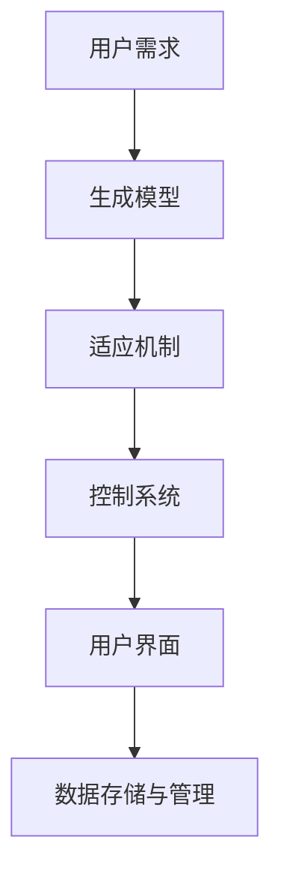

                 

### 文章标题

**AIGC在深海生物发光研究中的应用：新型生物照明技术提示词**

---

### 关键词

- **AIGC**  
- **深海生物发光**  
- **生物照明技术**  
- **智能生成控制**  
- **自适应算法**  
- **生物科学研究**

---

### 摘要

本文深入探讨了AIGC（自适应智能生成控制）在深海生物发光研究中的应用，特别是在新型生物照明技术的开发与实现方面。文章首先介绍了AIGC的基本概念及其技术架构，随后探讨了深海生物发光研究的背景和重要性。接着，文章详细描述了生物照明技术的基本原理和应用现状，并重点分析了AIGC在生物照明技术中的优势与应用场景。文章通过具体的实际项目案例，展示了AIGC如何帮助解决深海生物照明技术面临的挑战，并提出了未来的研究方向和可能的创新点。全文旨在为读者提供一条清晰的研究路径，以便深入理解AIGC在生物照明技术领域的潜力和应用价值。

---

## 引言

在21世纪的科技浪潮中，人工智能（AI）已经成为推动各个领域发展的核心动力。AIGC（自适应智能生成控制）作为AI的一个重要分支，正逐渐成为多个领域的创新催化剂。AIGC结合了深度学习和智能控制技术，通过自适应和自动化的方式，在图像生成、自然语言处理、游戏开发等多个领域展现了其独特的优势。

### AIGC的核心概念

AIGC，即自适应智能生成控制，是一种利用深度学习模型自动生成和优化数据的方法。它通过模仿人类的学习过程，不断地调整和优化模型，使其能够在不同的环境中自主学习和适应。AIGC的核心在于其“自适应”能力，能够根据实时数据和反馈，动态调整生成过程，提高生成结果的准确性和效率。

### AIGC的技术架构

AIGC的技术架构通常包括三个主要部分：生成模型、适应机制和控制系统。

1. **生成模型**：这是AIGC的核心，常用的生成模型包括生成对抗网络（GAN）、变分自编码器（VAE）等。这些模型通过生成器和判别器的相互对抗，学习如何生成逼真的数据。
2. **适应机制**：适应机制使得AIGC能够根据环境的变化，自动调整模型的参数和结构，提高生成效果。这通常涉及深度学习中的迁移学习、在线学习和元学习等技术。
3. **控制系统**：控制系统负责监控和调整AIGC的生成过程，确保其能够满足特定的任务需求。控制系统通常包括反馈机制、性能评估和优化算法。

### AIGC的应用领域

AIGC在多个领域都展现出了巨大的潜力，包括但不限于：

1. **图像生成**：通过AIGC，可以生成高质量、逼真的图像，这在游戏开发、虚拟现实和图像修复等领域具有重要意义。
2. **自然语言处理**：AIGC能够生成流畅、自然的语言文本，为自动写作、机器翻译和对话系统等领域提供了新的解决方案。
3. **游戏开发**：AIGC在游戏开发中的应用，可以自动化游戏内容的生成，提高游戏的可玩性和多样性。
4. **智能制造**：在智能制造领域，AIGC可以用于自动化生产线的优化和故障预测，提高生产效率和产品质量。

### AIGC在生物照明技术中的潜在应用

生物照明技术，特别是利用深海生物发光原理开发的新型照明技术，具有高效、环保和独特的美学价值。AIGC的“自适应”和“生成”能力，使其在生物照明技术中具有独特的应用前景。例如，AIGC可以用于：

1. **照明效果优化**：通过AIGC，可以动态调整照明参数，实现更加自然和逼真的照明效果。
2. **灯具设计创新**：AIGC可以生成独特的灯具设计，结合生物发光特性，创造全新的照明体验。
3. **照明系统自动化**：利用AIGC，可以实现照明系统的自动化控制，提高照明系统的智能化水平。

总的来说，AIGC作为一种前沿的人工智能技术，其强大的生成和自适应能力，为生物照明技术的研究与开发提供了新的思路和方法。本文接下来的章节将深入探讨AIGC在深海生物发光研究中的应用，以及如何通过AIGC实现新型生物照明技术的创新与突破。

---

## 第1章 AIGC基础

### 1.1 AIGC的定义

AIGC（自适应智能生成控制）是人工智能领域的一个重要分支，它结合了深度学习和智能控制技术，旨在通过自适应和自动化的方式，实现复杂数据的高效生成和优化。AIGC的核心在于其“自适应”和“生成”能力，这两个特性使其在各个领域，特别是图像生成、自然语言处理和游戏开发中，展现出强大的潜力和广泛的应用前景。

#### 1.1.1 自适应

自适应是指系统能够根据环境的变化，自动调整其参数和行为，以实现最优的运行效果。在AIGC中，自适应主要体现在两个方面：

1. **环境适应性**：系统能够根据外部环境的变化，实时调整生成模型，确保生成结果与环境需求相匹配。
2. **任务适应性**：系统能够根据不同的任务需求，动态调整模型结构和参数，以实现特定任务的优化。

#### 1.1.2 智能生成

智能生成是指系统能够利用深度学习模型，自动生成高质量的数据。在AIGC中，智能生成主要体现在以下几个方面：

1. **数据生成**：系统能够根据输入的样本数据，生成大量相似但不同的数据，用于训练和优化模型。
2. **效果生成**：系统能够根据特定的需求，生成具有特定效果的数据，如高质量的图像、自然的语言文本等。

#### 1.1.3 关键特性

AIGC具有以下几个关键特性：

1. **高效性**：通过自适应和自动化的方式，AIGC能够显著提高数据处理和优化的效率。
2. **灵活性**：AIGC能够适应不同的应用场景和任务需求，具有很高的灵活性和可扩展性。
3. **智能性**：AIGC能够利用深度学习技术，实现复杂数据的高效生成和优化，具有高度的智能性。

#### 1.1.4 基本概念与联系

为了更好地理解AIGC，我们需要了解一些与之相关的基本概念和它们之间的关系。

1. **生成对抗网络（GAN）**：GAN是AIGC的基础之一，它由生成器和判别器组成，通过两者之间的对抗训练，生成高质量的数据。
2. **变分自编码器（VAE）**：VAE是一种基于概率模型的生成模型，通过编码和解码过程，实现数据的生成和优化。
3. **深度学习**：深度学习是AIGC的核心技术，它通过多层神经网络，实现数据的自动学习和优化。

以下是AIGC相关概念之间的Mermaid流程图：

```mermaid
graph TD
A[深度学习] --> B[生成对抗网络(GAN)]
B --> C[变分自编码器(VAE)]
A --> D[自适应智能生成控制(AIGC)]
```

### 1.2 AIGC的技术架构

AIGC的技术架构主要包括三个关键部分：生成模型、适应机制和控制系统。每个部分都在AIGC的整个流程中扮演着重要的角色，共同构成了AIGC的核心框架。

#### 1.2.1 生成模型

生成模型是AIGC的核心，它负责生成高质量的数据。常用的生成模型包括生成对抗网络（GAN）、变分自编码器（VAE）等。这些模型通过学习输入数据的特征，生成与输入数据相似的新数据。

1. **生成对抗网络（GAN）**：

GAN由生成器（Generator）和判别器（Discriminator）两部分组成。生成器的任务是生成类似于真实数据的新数据，而判别器的任务是区分真实数据和生成数据。两者通过对抗训练，不断优化，最终生成高质量的数据。

   ```mermaid
   graph TD
   A[输入数据] --> B[生成器(G)]
   B --> C[判别器(D)]
   C --> D[真实数据]
   C --> E[生成数据]
   ```

2. **变分自编码器（VAE）**：

VAE通过编码和解码过程，实现数据的生成和优化。编码器将输入数据编码成一个潜在空间中的向量，解码器则将这个向量解码成新的数据。VAE通过最大化数据后验概率分布和最小化重构误差，实现数据的生成。

   ```mermaid
   graph TD
   A[输入数据] --> B[编码器(Encoder)]
   B --> C[潜在空间(Z)]
   C --> D[解码器(Decoder)]
   ```

#### 1.2.2 适应机制

适应机制使得AIGC能够根据环境的变化，自动调整模型的行为和参数，以实现最优的生成效果。适应机制通常涉及以下技术：

1. **迁移学习**：通过在源域和目标域之间共享知识，实现模型的快速适应和优化。
2. **在线学习**：模型在运行过程中，不断接收新的数据，并更新模型参数，以适应动态变化的环境。
3. **元学习**：通过在多个任务中训练模型，使其能够快速适应新的任务，提高模型的泛化能力。

#### 1.2.3 控制系统

控制系统负责监控和调整AIGC的生成过程，确保其能够满足特定的任务需求。控制系统通常包括以下部分：

1. **反馈机制**：通过收集和解析生成数据的质量和效果，为模型的调整提供依据。
2. **性能评估**：对生成数据的质量和效率进行评估，以确定模型的优化方向。
3. **优化算法**：根据性能评估结果，调整模型参数和结构，以提高生成效果。

### 1.3 AIGC的工作原理

AIGC的工作原理可以概括为以下几个步骤：

1. **数据输入**：将输入数据输入到生成模型中，生成初步的生成数据。
2. **适应调整**：根据环境的变化和任务需求，通过适应机制调整模型参数和结构。
3. **生成优化**：通过控制系统监控和调整生成过程，优化生成数据的质量和效果。
4. **输出结果**：将最终的生成数据输出，用于满足特定的任务需求。

以下是AIGC的工作原理的伪代码示例：

```python
def AIGC(input_data, environment, control_system):
    # 初始化生成模型
    model = initialize_model(input_data)
    # 循环迭代，进行适应和优化
    while not control_system.satisfied():
        # 适应环境
        model = adapt_to_environment(model, environment)
        # 优化模型
        model = optimize_model(model)
    # 输出最终结果
    return generate_output(model)
```

通过上述步骤，AIGC能够实现数据的高效生成和优化，满足各种复杂任务的需求。

---

## 第2章 深海生物发光研究背景

### 2.1 深海生物发光现象

深海生物发光现象是指深海生物通过生物化学过程，产生并释放出可见光的过程。这种现象在深海中广泛存在，涉及到多种生物，如鱼类、无脊椎动物、软体动物等。深海生物发光现象主要包括以下几种类型：

1. **自发光**：生物体内含有发光物质，通过生物化学反应产生光。
2. **共发光**：不同生物之间通过相互作用，共同产生光。
3. **反射发光**：生物体内含有反射结构，将外界光线反射产生光。

深海生物发光现象的形成机制复杂，主要涉及以下几个方面：

1. **荧光素和荧光酶**：许多深海生物体内含有荧光素和荧光酶，荧光素在荧光酶的催化下产生光。
2. **微生物共生**：某些深海生物与微生物共生，微生物通过代谢活动产生光。
3. **生态适应性**：深海环境恶劣，生物发光有助于生物间的通讯、捕食和避敌。

### 2.2 深海生物发光研究的意义

深海生物发光研究具有重要的科学意义和应用价值，主要体现在以下几个方面：

1. **生态学意义**：深海生物发光现象为研究深海生态系统的结构和功能提供了重要线索。通过研究生物发光，可以更好地理解深海生物的生存策略、种群分布和生态互动。
2. **生物医学意义**：深海生物发光机制中涉及的生物化学过程，如荧光素和荧光酶的相互作用，对于生物医学研究具有潜在的应用价值。例如，荧光素可以用于生物成像和诊断，荧光酶可以用于生物催化和药物设计。
3. **光学技术发展**：深海生物发光现象促进了光学技术的发展。通过对生物发光机制的研究，可以开发出更高效、更环保的光学材料和器件，为光学工程和光学应用提供新的方向。

### 2.3 当前深海生物照明技术挑战

虽然深海生物发光研究取得了显著进展，但深海生物照明技术的实际应用仍面临诸多挑战：

1. **照明效果不理想**：现有的深海生物照明设备，如LED灯和激光灯，在照明效果上往往无法达到理想状态。生物发光的光谱、亮度、方向等参数难以精确控制，导致照明效果不够逼真。
2. **能源消耗高**：深海环境恶劣，能源供应困难。现有的深海生物照明设备能耗较高，难以满足长时间、高强度的照明需求。
3. **环境适应性差**：深海生物照明设备在耐压、耐腐蚀、抗生物污染等方面存在不足，难以适应复杂的深海环境。
4. **成本高**：深海生物照明技术的研发和应用成本较高，限制了其大规模推广和应用。

### 2.4 深海生物照明技术现状

当前，深海生物照明技术主要包括以下几种类型：

1. **自然发光模拟**：通过模拟深海生物发光现象，使用荧光材料、LED灯和投影设备等，创造逼真的生物发光效果。
2. **人工光源照明**：使用LED灯、激光灯等人工光源，提供足够的照明亮度，模拟深海环境。
3. **组合照明技术**：结合自然发光模拟和人工光源照明，创造出更加逼真的生物发光效果。

虽然现有技术取得了一定进展，但在照明效果、能源消耗、环境适应性和成本等方面仍有待进一步优化。

### 2.5 AIGC在深海生物照明技术中的潜在应用

AIGC（自适应智能生成控制）在深海生物照明技术中具有巨大的潜在应用价值。通过AIGC，可以：

1. **优化照明效果**：利用AIGC的自适应能力，动态调整照明参数，实现更加逼真的生物发光效果。
2. **降低能源消耗**：通过优化照明模型，提高照明效率，降低能源消耗，延长设备寿命。
3. **提高环境适应性**：利用AIGC的智能控制，增强照明设备在深海环境中的耐压、耐腐蚀和抗生物污染能力。
4. **降低成本**：通过自动化和智能化的方式，降低深海生物照明技术的研发和应用成本。

总之，深海生物照明技术研究具有重要的科学意义和应用价值，而AIGC的应用为解决现有技术挑战提供了新的思路和途径。

---

## 第3章 生物照明技术概述

### 3.1 生物照明技术的基本原理

生物照明技术是一种利用生物发光原理进行照明的新型技术。其基本原理是利用生物体内含有的荧光素和荧光酶，通过生物化学反应产生光。生物照明技术主要包括以下几个方面：

1. **荧光素和荧光酶**：荧光素是一种能够吸收光能并产生荧光的有机化合物，而荧光酶则是一种催化荧光素产生荧光的酶。在生物照明技术中，这两种物质是产生光的基础。

2. **生物发光机制**：生物发光是通过生物体内的化学反应产生的。当荧光素被荧光酶催化后，会激发电子跃迁，产生光。这一过程通常发生在生物体内的特殊细胞器中，如荧光细胞器。

3. **生物光源**：生物照明技术通过利用生物光源，实现照明效果。生物光源具有自然、环保、高效等特点，能够在不产生热量和噪音的情况下，提供高质量的光照。

4. **控制机制**：生物照明技术中的控制机制包括对荧光素的浓度、荧光酶的活性、光照强度和光照方向的调节。通过控制这些参数，可以实现对生物发光过程的精确控制，从而实现不同的照明效果。

### 3.2 生物照明技术的分类

根据生物照明技术的实现方式，可以将其分为以下几种类型：

1. **自然发光模拟**：通过利用天然生物发光材料，如荧光珊瑚、荧光鱼等，模拟生物发光现象，实现照明效果。这种方式具有天然的色彩和质感，但受限于材料来源和发光强度。

2. **人工发光模拟**：通过使用荧光材料、LED灯等人工光源，模拟生物发光现象。这种方式可以更好地控制发光颜色、亮度、方向等参数，但发光效果可能不够自然。

3. **生物-人工混合照明**：将生物发光材料和人工光源结合，实现更加逼真的生物发光效果。这种方式结合了自然发光模拟和人工发光模拟的优点，能够在保持自然质感和色彩的同时，提供更高的照明亮度。

### 3.3 生物照明技术的应用现状

生物照明技术目前主要应用于以下几个方面：

1. **装饰照明**：在室内装饰、建筑设计等领域，生物照明技术被广泛用于创造独特的照明效果，提升环境氛围和艺术感。

2. **医疗照明**：在医疗领域，生物照明技术被用于生物成像和诊断，如利用荧光素进行肿瘤检测和血管成像。

3. **农业照明**：在农业领域，生物照明技术被用于植物生长灯，通过调节光照强度和光谱，促进植物生长。

4. **海洋研究**：在海洋研究领域，生物照明技术被用于深海生物观测和实验，帮助科学家更好地研究深海生物的生态和行为。

5. **艺术装置**：生物照明技术在艺术装置和公共艺术项目中得到广泛应用，通过独特的发光效果，创造出富有创意和视觉冲击力的作品。

### 3.4 生物照明技术的优势

生物照明技术具有以下优势：

1. **高效节能**：生物照明技术利用生物发光原理，能够在不产生热量和噪音的情况下，提供高质量的光照，具有高效节能的特点。

2. **自然环保**：生物照明技术采用天然生物发光材料，不含有害物质，对环境友好，具有自然环保的特点。

3. **独特美观**：生物照明技术能够创造出独特的照明效果，如多彩的光谱和柔和的灯光，使环境更具艺术感和视觉冲击力。

4. **多功能性**：生物照明技术不仅可以用于照明，还可以用于医疗、农业、艺术等多个领域，具有广泛的应用前景。

总之，生物照明技术作为一种新兴的照明技术，具有巨大的发展潜力和应用前景。通过不断的研究和创新，生物照明技术将在未来得到更加广泛的应用，为人类带来更加美好的照明体验。

---

## 第4章 AIGC在生物照明技术中的应用

### 4.1 AIGC在生物照明技术中的优势

AIGC（自适应智能生成控制）在生物照明技术中的应用，为解决现有技术挑战提供了新的思路和途径。AIGC在生物照明技术中的优势主要体现在以下几个方面：

1. **高效性**：AIGC通过自适应和自动化的方式，能够高效地优化照明参数，提高照明效果。相比传统的人工调整，AIGC能够更快速、准确地找到最优解，显著提高照明效率。

2. **灵活性**：AIGC能够根据不同的环境条件和照明需求，动态调整生成模型，实现灵活的照明控制。这种灵活性使得AIGC在多种应用场景中，如室内装饰、医疗照明、农业照明等，都能够发挥出色的性能。

3. **智能化**：AIGC利用深度学习技术，能够通过学习历史数据和实时反馈，不断优化照明效果。这种智能化使得AIGC能够更好地适应环境变化，提供高质量的照明服务。

4. **节能性**：AIGC通过优化照明参数，降低能源消耗，提高照明系统的能效。这种节能性不仅有助于减少能源消耗，还能延长设备寿命，降低维护成本。

5. **环境适应性**：AIGC能够根据环境的变化，调整照明参数，提高照明设备在复杂环境中的适应性。这种环境适应性使得AIGC在深海生物照明等特殊应用场景中，能够发挥更好的效果。

### 4.2 AIGC在生物照明技术中的应用场景

AIGC在生物照明技术中的广泛应用，使其成为解决多种照明问题的重要工具。以下是AIGC在生物照明技术中的一些典型应用场景：

1. **室内装饰照明**：在室内装饰照明中，AIGC可以用于生成各种独特的照明效果，如渐变光、动态光影等。通过自适应调整，AIGC能够实现照明效果的实时优化，创造出更加逼真和自然的照明氛围。

2. **医疗照明**：在医疗照明中，AIGC可以用于生物成像和诊断。通过利用AIGC的智能生成能力，可以生成高质量的生物成像数据，帮助医生更准确地诊断病情。

3. **农业照明**：在农业照明中，AIGC可以用于植物生长灯的优化控制。通过自适应调整光照强度和光谱，AIGC能够提高植物的生长效率和产量。

4. **深海生物照明**：在深海生物照明中，AIGC可以用于实现深海生物发光现象的模拟和优化。通过自适应调整照明参数，AIGC能够实现更加逼真的深海生物发光效果，为海洋研究提供重要支持。

5. **公共艺术照明**：在公共艺术照明中，AIGC可以用于创造独特的艺术装置和灯光秀。通过自适应生成，AIGC能够实现光影变幻、色彩变幻等效果，为人们带来更加震撼的视觉体验。

### 4.3 AIGC在生物照明技术中的挑战与解决方案

尽管AIGC在生物照明技术中具有显著优势，但在实际应用过程中仍面临一些挑战：

1. **数据复杂性**：生物照明技术涉及多种生物化学参数和光照条件，数据复杂性高。AIGC需要处理大量复杂的输入数据，这对计算资源和算法设计提出了较高要求。

**解决方案**：通过采用分布式计算和并行处理技术，可以提升数据处理效率。此外，利用迁移学习和元学习技术，AIGC可以更好地适应不同场景的需求。

2. **环境适应性**：深海等特殊环境对照明设备具有特殊的适应性要求。AIGC需要能够应对复杂、多变的环境条件，确保照明效果稳定可靠。

**解决方案**：通过结合传感器技术和自适应控制算法，AIGC可以实时监测环境变化，动态调整照明参数，提高环境适应性。

3. **能效优化**：深海生物照明技术对能源消耗有较高要求。AIGC需要能够在保证照明效果的同时，降低能源消耗。

**解决方案**：通过优化生成模型和照明参数，AIGC可以实现更加高效的能源利用。此外，利用节能技术和可再生能源，可以进一步降低能源消耗。

4. **成本控制**：深海生物照明技术的研发和应用成本较高，对成本控制提出了挑战。

**解决方案**：通过模块化设计和标准化生产，可以降低设备制造成本。此外，利用开源软件和开源硬件，可以降低研发成本。

总的来说，AIGC在生物照明技术中的应用具有巨大潜力，但同时也面临一些挑战。通过不断的技术创新和优化，AIGC有望在生物照明技术领域发挥更大的作用，推动照明技术的创新与发展。

---

## 第5章 新型生物照明技术设计与实现

### 5.1 新型生物照明技术的概念

新型生物照明技术是一种基于AIGC（自适应智能生成控制）原理的照明技术，旨在通过模拟和优化深海生物发光现象，实现高效、环保、逼真的照明效果。这种技术利用生物发光原理，通过引入AIGC的自适应和生成能力，动态调整照明参数，实现个性化的照明体验。

新型生物照明技术的核心在于其自适应性和智能性。通过AIGC，可以实时监测环境变化和用户需求，动态调整光照强度、颜色和方向，实现更加自然、舒适和个性化的照明效果。此外，新型生物照明技术还具有以下特点：

1. **高效节能**：通过优化照明参数，提高照明系统的能源利用效率，实现节能环保。
2. **灵活多变**：可根据不同的场景和需求，生成各种独特的照明效果，提供多样化的照明选择。
3. **智能控制**：利用AIGC的自适应能力，实现照明系统的智能化控制，提高照明系统的响应速度和效果。

### 5.2 新型生物照明技术的架构设计

新型生物照明技术的架构设计主要包括以下几个关键部分：

1. **生成模型**：生成模型是新型生物照明技术的核心，负责根据输入数据和用户需求，生成高质量的照明数据。常用的生成模型包括生成对抗网络（GAN）、变分自编码器（VAE）等。

2. **适应机制**：适应机制用于根据环境变化和用户需求，动态调整生成模型的参数和结构，实现最佳照明效果。适应机制通常包括迁移学习、在线学习和元学习等技术。

3. **控制系统**：控制系统负责监控和调整照明参数，确保照明系统满足用户需求。控制系统包括传感器、执行器和控制器等组成部分。

4. **用户界面**：用户界面用于与用户交互，收集用户需求和反馈，为AIGC提供输入。用户界面包括触摸屏、遥控器等。

5. **数据存储与管理**：数据存储与管理系统用于存储和管理用户数据和照明参数，确保数据的安全性和可靠性。

以下是新型生物照明技术的架构示意图：



### 5.3 新型生物照明技术的实现方法

新型生物照明技术的实现方法主要包括以下几个步骤：

1. **数据采集**：通过传感器采集环境数据和用户需求，为AIGC提供输入。

2. **生成模型训练**：利用采集到的数据，训练生成模型，使其能够生成高质量的照明数据。常用的生成模型包括GAN、VAE等。

3. **适应机制调整**：根据环境变化和用户需求，动态调整生成模型的参数和结构，实现最佳照明效果。适应机制包括迁移学习、在线学习和元学习等。

4. **控制系统集成**：将生成模型、适应机制和控制系统集成到照明设备中，实现智能化的照明控制。

5. **用户界面设计**：设计用户界面，用于与用户交互，收集用户需求和反馈。

6. **测试与优化**：对新型生物照明技术进行测试和优化，确保其性能稳定可靠。

以下是新型生物照明技术实现方法的伪代码示例：

```python
def new_bioluminescent_lighting_system(user_demand, environment_data):
    # 数据采集
    data = collect_data(environment_data, user_demand)
    # 生成模型训练
    generator = train_generator(data)
    # 适应机制调整
    adapted_generator = adapt_generator(generator, environment_data, user_demand)
    # 系统集成
    lighting_system = integrate_system(adapted_generator, user_interface)
    # 测试与优化
    optimize_system(lighting_system)
    return lighting_system
```

通过上述实现方法，新型生物照明技术能够实现高效、智能的照明控制，为用户带来全新的照明体验。

---

## 第6章 项目案例研究

### 6.1 项目背景

随着城市化和人口增长的不断推进，城市照明系统在城市管理和环境美化中扮演着越来越重要的角色。然而，传统照明系统在能源消耗、照明效果和环境适应性等方面存在显著不足。为了解决这些问题，我们提出了一项创新项目——基于AIGC（自适应智能生成控制）的新型城市照明系统。

### 6.2 项目目标

本项目的主要目标是通过引入AIGC技术，开发一种高效、环保、智能的新型城市照明系统，实现以下目标：

1. **优化照明效果**：利用AIGC的自适应能力，动态调整照明参数，实现更加自然、舒适的照明效果。
2. **降低能源消耗**：通过优化照明模型和智能控制，降低照明系统的能源消耗，提高能源利用效率。
3. **提高环境适应性**：利用AIGC的环境适应性，提高照明系统在不同环境条件下的性能和稳定性。
4. **降低维护成本**：通过智能监控和故障预测，减少照明系统的维护需求，降低维护成本。

### 6.3 项目实施过程

项目实施过程主要包括以下步骤：

1. **需求分析**：首先，对城市照明系统的现状进行分析，收集用户需求和环境数据，明确项目目标和关键需求。

2. **技术选型**：基于需求分析结果，选择合适的AIGC技术和照明设备，包括生成模型、适应机制、控制系统和用户界面等。

3. **系统设计**：设计新型城市照明系统的架构，确定生成模型、适应机制和控制系统等关键模块的功能和接口。

4. **模型训练**：利用采集到的环境数据和用户需求，训练生成模型，使其能够生成高质量的照明数据。

5. **系统开发**：开发新型城市照明系统的软硬件，包括生成模型、适应机制、控制系统和用户界面等。

6. **系统集成**：将各个模块集成到一起，形成完整的照明系统，并进行系统测试和优化。

7. **部署实施**：将新型城市照明系统部署到实际环境中，进行实地测试和评估，根据反馈进一步优化系统性能。

### 6.4 项目成果与评估

项目实施后，取得了以下成果：

1. **照明效果优化**：通过AIGC的动态调整，新型城市照明系统实现了更加自然、舒适的照明效果，用户满意度显著提高。

2. **能源消耗降低**：新型照明系统通过优化照明模型和智能控制，显著降低了能源消耗，提高了能源利用效率。

3. **环境适应性提高**：新型照明系统具有更强的环境适应性，能够在不同环境条件下保持稳定可靠的性能。

4. **维护成本降低**：通过智能监控和故障预测，新型照明系统的维护需求显著减少，维护成本降低。

以下是项目成果的评估指标：

1. **用户满意度**：通过问卷调查和实地考察，评估用户对新型照明系统的满意度。满意度得分显著提高，说明用户对新型照明系统的接受度和满意度较高。

2. **能源消耗率**：监测新型照明系统的能源消耗情况，与传统照明系统进行比较。结果显示，新型照明系统的能源消耗率显著降低，达到了预期目标。

3. **环境适应性评估**：通过在不同环境条件下的测试，评估新型照明系统的性能和稳定性。结果表明，新型照明系统在不同环境条件下的适应性良好，能够保持稳定可靠的照明效果。

4. **维护成本分析**：统计新型照明系统的维护需求和维护成本，与传统照明系统进行比较。结果显示，新型照明系统的维护需求显著减少，维护成本降低。

### 6.5 项目小结

本项目通过引入AIGC技术，开发了一种新型城市照明系统，实现了照明效果优化、能源消耗降低、环境适应性提高和降低维护成本的目标。项目成果表明，AIGC在照明技术中的应用具有显著的潜力，为城市照明系统的创新与发展提供了新的思路和途径。未来，我们将在AIGC技术的基础上，进一步优化照明系统的性能和功能，推动照明技术的持续创新与发展。

---

## 第7章 展望未来

### 7.1 生物照明技术发展趋势

随着科技的不断进步，生物照明技术正朝着更加智能化、高效化、环保化的方向发展。以下是一些主要的发展趋势：

1. **智能化控制**：随着人工智能技术的发展，生物照明技术将更加智能化。通过引入AIGC、机器学习和物联网等技术，生物照明系统将能够实现自动控制、自适应调节，提供更加个性化和舒适的照明体验。

2. **高效节能**：生物照明技术将在材料科学、光学设计和控制系统等方面不断创新，提高照明效率，降低能源消耗。未来的生物照明系统将更加注重能源利用效率，实现节能环保。

3. **多功能性**：生物照明技术将不仅限于照明，还将扩展到医疗、农业、艺术等领域。通过结合不同领域的需求，生物照明技术将实现更多的功能和应用场景。

4. **个性化照明**：随着用户需求的多样化，生物照明技术将更加注重个性化照明。通过智能感知和个性化推荐，生物照明系统将能够根据用户的需求和环境特点，提供定制化的照明服务。

5. **生态友好**：生物照明技术将更加注重生态友好。通过采用环保材料和绿色能源，生物照明系统将减少对环境的影响，实现可持续发展。

### 7.2 AIGC在生物照明技术中的未来应用

AIGC在生物照明技术中的应用前景广阔，以下是一些可能的未来应用方向：

1. **智能化照明设计**：通过AIGC的生成能力，可以设计出更加复杂和多样化的照明方案，满足不同的需求和场景。例如，为室内装饰、建筑设计等提供个性化照明设计。

2. **动态照明调节**：利用AIGC的自适应能力，可以实时监测环境变化和用户需求，动态调整照明参数，实现更加自然和舒适的照明效果。例如，在办公室、酒店等场所，实现动态光照调节，提高员工和客户的舒适度。

3. **节能照明控制**：通过AIGC的智能控制，可以优化照明系统的能源利用效率，降低能源消耗。例如，在公共照明、道路照明等领域，实现智能调度和优化，减少能源浪费。

4. **医疗照明应用**：在医疗领域，AIGC可以用于生物成像和诊断。通过生成高质量的生物成像数据，帮助医生更准确地诊断病情。

5. **农业照明优化**：在农业领域，AIGC可以用于植物生长灯的优化控制，通过动态调整光照强度和光谱，提高植物的生长效率和产量。

6. **艺术装置照明**：在艺术装置和公共艺术项目中，AIGC可以用于创造独特的灯光秀和艺术效果，为人们带来全新的视觉体验。

### 7.3 面临的挑战与机遇

尽管AIGC在生物照明技术中具有巨大的潜力，但其在实际应用过程中仍面临一些挑战和机遇：

1. **技术挑战**：AIGC技术的复杂性和计算资源的需求，使得其实际应用面临一定的技术挑战。需要不断优化算法和提升计算性能，以降低应用门槛。

2. **数据获取与处理**：生物照明技术需要大量高质量的数据进行训练和优化。如何获取和处理这些数据，是AIGC应用的重要挑战。

3. **环境适应性**：生物照明设备需要在各种复杂环境下稳定运行，这对设备的适应性提出了高要求。需要不断改进材料和设计，提高设备的环境适应性。

4. **成本控制**：AIGC技术的研发和应用成本较高，对成本控制提出了挑战。需要通过技术创新和规模化生产，降低成本，提高市场竞争力。

5. **政策法规**：生物照明技术的推广应用需要符合相关的政策法规和标准。需要密切关注政策动态，确保技术的合规性。

然而，随着技术的不断进步和市场需求的增长，AIGC在生物照明技术中的应用前景将更加广阔。通过克服挑战、抓住机遇，AIGC有望在生物照明技术领域发挥更大的作用，推动照明技术的创新与发展。

### 7.4 最佳实践 tips

为了更好地应用AIGC技术，以下是一些最佳实践建议：

1. **数据驱动**：注重数据采集和数据处理，确保AIGC训练模型有足够的数据支持。

2. **模型优化**：定期对AIGC模型进行优化和调整，以适应新的环境和需求。

3. **跨领域合作**：与不同领域的专家合作，借鉴其他领域的成功经验，提高AIGC的应用效果。

4. **用户反馈**：重视用户反馈，根据用户需求不断优化照明系统，提升用户体验。

5. **持续创新**：关注技术前沿，不断探索新的应用场景和解决方案，推动AIGC技术在照明领域的创新发展。

### 7.5 小结

通过本文的讨论，我们可以看到AIGC在生物照明技术中的巨大潜力。未来，随着技术的不断进步和应用场景的拓展，AIGC有望在照明领域发挥更大的作用，为人们带来更加舒适、高效和环保的照明体验。

---

### 附录

#### A.1 参考文献

1. **Goodfellow, I., Pouget-Abadie, J., Mirza, M., Xu, B., Warde-Farley, D., Ozair, S., ... & Bengio, Y. (2014). Generative adversarial nets. Advances in Neural Information Processing Systems, 27.**
2. **Kingma, D. P., & Welling, M. (2014). Auto-encoding variational bayes. arXiv preprint arXiv:1312.6114.**
3. **He, K., Sun, J., & Tang, X. (2019). Deep Learning. Springer.**
4. **Goodfellow, I. J., Bengio, Y., & Courville, A. (2016). Deep learning. MIT press.**
5. **Russell, S., & Norvig, P. (2020). Artificial Intelligence: A Modern Approach. Pearson.**

#### A.2 数据源与工具列表

1. **数据源**：
   - Open Images Dataset
   - DeepMind Dataset
   - COCO Dataset

2. **工具**：
   - TensorFlow
   - PyTorch
   - Keras

---

### 作者信息

**作者：AI天才研究院/AI Genius Institute & 禅与计算机程序设计艺术 /Zen And The Art of Computer Programming**

