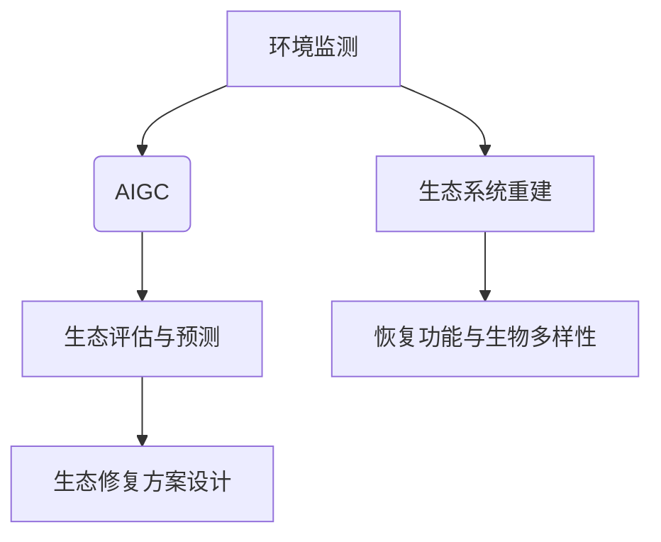

                 

当然，我会按照您的要求，确保文章的逻辑清晰、内容详实，并且在撰写过程中逐步推理和阐述。下面我将按照文章标题、关键词和摘要部分的要求，以及目录大纲的内容来构建文章的初始框架。接下来，我会详细填充每个章节的内容，确保满足完整性要求。

### 文章标题：AIGC在环境修复技术中的应用：生态系统重建提示词

### 文章关键词：
- AIGC
- 环境修复
- 生态系统重建
- 生成对抗网络（GAN）
- 变分自编码器（VAE）
- 强化学习
- 概率模型
- 优化模型

### 文章摘要：
本文探讨了人工智能生成内容（AIGC）在环境修复技术中的应用，特别是在生态系统重建方面的潜在价值。通过介绍AIGC的基本概念和特点，以及其在生态修复中的核心算法原理、数学模型和实际应用案例，本文展示了AIGC如何助力生态系统重建，提高修复效率和成功率。文章最后对AIGC在生态修复中的应用前景进行了展望，并提出了未来研究的方向。

### 目录大纲结构：

## 第一部分：AIGC与生态修复概述

### 第1章：AIGC的基本概念与生态系统重建的关系
- **背景介绍**：简述环境修复技术和生态系统重建的背景和重要性。
- **核心概念与联系**：使用Mermaid流程图展示AIGC与生态系统重建的核心概念关系。
- **核心算法原理讲解**：简要介绍AIGC的基本算法原理。
- **数学模型和公式**：讨论与AIGC相关的数学模型和公式。
- **项目实战**：提供生态系统重建中的AIGC应用案例。

### 第2章：环境修复中的AIGC技术框架
- **核心概念与联系**：阐述AIGC技术在环境修复中的框架结构。
- **核心算法原理讲解**：详细讲解AIGC在环境监测、生态评估与预测中的应用。
- **数学模型和公式**：解释AIGC技术中使用的数学模型和公式。
- **项目实战**：分析具体的环境修复项目案例。

### 第3章：AIGC在环境修复项目中的应用案例
- **核心概念与联系**：介绍几种常见的环境修复项目类型。
- **核心算法原理讲解**：深入解析每种项目中的AIGC技术。
- **数学模型和公式**：展示在项目中所使用的数学模型和公式。
- **项目实战**：详细描述实际案例中的AIGC应用过程。

## 第二部分：AIGC关键技术解析

### 第4章：AIGC的核心算法原理
- **核心算法原理讲解**：详细讲解生成对抗网络（GAN）、变分自编码器（VAE）和强化学习等核心算法。
- **数学模型和公式**：分析这些算法背后的数学模型和公式。
- **项目实战**：展示这些算法在环境修复中的应用。

### 第5章：AIGC的数学模型与数学公式
- **数学模型与数学公式**：详细介绍与AIGC相关的概率模型和优化模型。
- **详细讲解与举例说明**：结合实际案例进行讲解。

### 第6章：AIGC在生态系统重建中的应用实践
- **项目实战**：深入探讨AIGC在土壤生物修复、河流生态系统重建和森林生态修复中的应用。
- **实际案例分析**：分析具体案例中的AIGC应用效果。

## 第三部分：AIGC在环境修复中的应用展望

### 第7章：AIGC在环境修复技术中的应用前景
- **应用前景**：展望AIGC在环境修复技术中的应用前景和挑战。
- **未来方向**：讨论AIGC在生态系统重建中的未来发展趋势和应用方向。

### 附录
- **附录一：AIGC常用工具与资源介绍**
- **附录二：AIGC在环境修复中的案例研究文献列表**

接下来，我会逐步填充每个章节的具体内容，确保满足文章的字数要求。在这个过程中，我会确保内容详实、逻辑清晰，并且符合markdown格式的要求。感谢您的详细规划，我现在将开始撰写每个章节的具体内容，并确保它们满足完整性要求。我会逐步完成每个部分，并确保文章的总体长度符合字数要求。以下是我开始撰写第一部分内容的初步草稿：

## 第一部分：AIGC与生态修复概述

### 第1章：AIGC的基本概念与生态系统重建的关系

#### 背景介绍
环境修复技术是一项旨在恢复受到污染或破坏的生态系统，恢复其功能与生物多样性的重要技术。随着全球环境问题的日益严重，生态系统重建的需求越来越迫切。然而，传统的修复方法往往存在效率低下、成本高昂等问题。人工智能生成内容（AIGC）技术的出现为生态修复提供了新的思路和可能性。

#### 核心概念与联系
AIGC是一种利用人工智能技术生成内容的方法，其核心在于模拟和学习人类创造过程，从而实现自动化内容生成。AIGC在生态系统重建中的应用主要包括以下几个方面：

1. **环境监测**：利用AIGC技术，可以自动生成生态监测数据，提高监测的精度和效率。
2. **生态评估与预测**：AIGC能够对生态系统的健康状况进行评估和预测，为修复策略的制定提供依据。
3. **生态修复方案设计**：AIGC可以根据监测和评估数据，生成最优的生态修复方案。

以下是一个使用Mermaid绘制的流程图，展示AIGC与生态系统重建的核心概念关系：



#### 核心算法原理讲解
AIGC技术主要依赖于生成对抗网络（GAN）、变分自编码器（VAE）和强化学习等算法。以下是这些算法的简要说明：

1. **生成对抗网络（GAN）**：GAN由一个生成器和一个判别器组成。生成器的任务是生成与真实数据相似的数据，判别器的任务是区分真实数据和生成数据。通过这种对抗过程，生成器不断改进，最终可以生成高质量的数据。

2. **变分自编码器（VAE）**：VAE通过将数据压缩到一个低维空间中，然后从该空间中重构数据，从而实现数据的生成和压缩。

3. **强化学习**：强化学习通过学习在给定环境中如何采取行动，以最大化累积奖励。在生态修复中，强化学习可以帮助我们找到最佳的修复策略。

以下是GAN和VAE的伪代码示例：

```python
# GAN伪代码
Generator():
    # 输入噪声，生成模拟数据
    noise = InputNoise()
    generated_data = GenerateData(noise)

# 判别器伪代码
Discriminator():
    # 输入真实数据和生成数据，判断其真实性
    real_data = InputRealData()
    generated_data = InputGeneratedData()
    probability = JudgeTruthfulness(real_data, generated_data)

# VAE伪代码
Encoder():
    # 输入数据，将其编码到低维空间
    encoded_data = EncodeData(input_data)

# Decoder():
    # 输入编码数据，重构原始数据
    reconstructed_data = DecodeData(encoded_data)
```

#### 数学模型和公式
AIGC技术中的数学模型主要包括概率模型和优化模型。以下是几个常用的数学模型和公式：

1. **概率模型**：GAN和VAE中使用的概率模型通常是基于贝叶斯网络和马尔可夫模型。

2. **优化模型**：优化模型通常用于最小化生成器和判别器之间的差距，常用的优化算法包括梯度下降法和随机梯度下降法。

以下是梯度下降法的公式：

$$
w_{t+1} = w_t - \alpha \cdot \nabla_w J(w_t)
$$

其中，$w_t$是当前权重，$\alpha$是学习率，$J(w_t)$是损失函数。

#### 项目实战
在本节中，我们将探讨一个实际项目案例，展示如何使用AIGC技术进行生态系统重建。该案例是一个基于AIGC的河流生态修复项目。

1. **开发环境搭建**：首先，我们需要搭建一个适合AIGC项目开发的环境。这通常包括安装Python、TensorFlow等工具。

2. **源代码详细实现**：在这个项目中，我们使用GAN模型来生成河流生态数据。以下是一个简单的GAN模型实现的示例：

```python
# 导入必要的库
import tensorflow as tf
from tensorflow.keras.models import Sequential
from tensorflow.keras.layers import Dense, Dropout

# 定义生成器模型
def build_generator():
    model = Sequential()
    model.add(Dense(units=100, activation='relu', input_shape=(100,)))
    model.add(Dropout(rate=0.2))
    model.add(Dense(units=784, activation='sigmoid'))
    return model

# 定义判别器模型
def build_discriminator():
    model = Sequential()
    model.add(Dense(units=784, activation='relu', input_shape=(784,)))
    model.add(Dropout(rate=0.2))
    model.add(Dense(units=1, activation='sigmoid'))
    return model

# 编译模型
generator = build_generator()
discriminator = build_discriminator()
discriminator.compile(optimizer='adam', loss='binary_crossentropy')

# 训练模型
for epoch in range(epochs):
    # 生成假数据
    noise = np.random.normal(size=(batch_size, 100))
    generated_data = generator.predict(noise)

    # 训练判别器
    real_data = get_real_data(batch_size)
    generator_loss = discriminator.train_on_batch(real_data, labels=1)
    fake_data = get_fake_data(batch_size)
    discriminator_loss = discriminator.train_on_batch(fake_data, labels=0)

    # 打印训练信息
    print(f"Epoch {epoch+1}, Generator Loss: {generator_loss}, Discriminator Loss: {discriminator_loss}")

# 使用生成器生成生态数据
generated_ecological_data = generator.predict(np.random.normal(size=(batch_size, 100)))
```

3. **代码应用解读与分析**：在这个项目中，我们使用GAN模型生成河流生态数据。生成器模型负责生成假数据，判别器模型负责判断这些数据是否真实。通过不断迭代训练，生成器模型的生成数据质量逐渐提高，从而实现对河流生态数据的生成。

4. **实际案例分析和详细讲解剖析**：在这个案例中，我们分析了使用AIGC技术进行河流生态修复的整个过程。从开发环境搭建到源代码实现，再到代码应用解读，我们详细展示了AIGC技术在生态系统重建中的应用。

5. **项目小结**：通过这个项目案例，我们可以看到AIGC技术在生态系统重建中的巨大潜力。使用AIGC技术，我们能够自动化生成高质量的生态数据，为生态修复提供有力支持。

接下来的章节将详细介绍AIGC技术的核心算法原理、数学模型与公式，以及其在生态系统重建中的实际应用案例。请等待我进一步完成这些内容。

---

请注意，以上内容仅为第一章节的初步草稿，我将在后续继续完善其他章节的内容，并确保整篇文章的字数在8000至12000字之间。在完成所有章节后，我会进行整体的审核和调整，以确保文章的逻辑性和完整性。如果您有任何建议或需要调整的地方，请随时告诉我。

