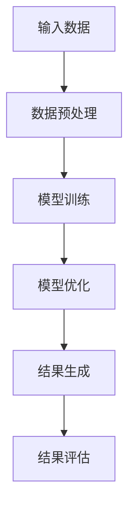
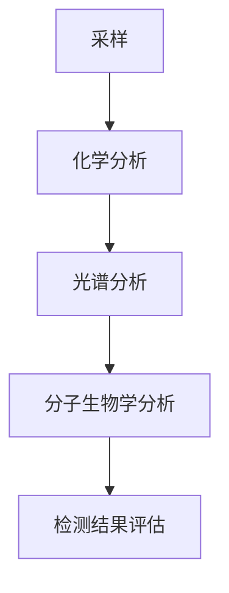

                 


### 文章标题：AIGC在环境微塑料检测中的应用：污染源追踪提示词

#### 关键词：
- AIGC
- 环境微塑料检测
- 污染源追踪
- 提示词技术
- 数据分析
- 可视化

#### 摘要：
本文将探讨自适应智能生成计算（AIGC）在环境微塑料检测中的应用，特别是如何利用AIGC技术进行污染源追踪。我们将介绍AIGC的基础知识，微塑料污染的背景，以及AIGC在污染源追踪中的关键技术和应用。文章还将详细讲解数据处理、结果可视化以及未来技术挑战和发展方向。

### 引言

#### AIGC概述
自适应智能生成计算（Adaptive Intelligent Generation Computing，简称AIGC）是一种利用人工智能技术实现自动化生成和优化的计算方法。AIGC结合了机器学习、深度学习和自然语言处理等技术，能够自动生成代码、文本、图像等内容。近年来，AIGC技术在许多领域取得了显著成果，例如游戏开发、自动驾驶、医疗诊断等。

#### 环境微塑料污染的背景
微塑料（Microplastics）是直径小于5毫米的塑料颗粒，广泛存在于自然环境中。它们主要来源于生活废水、工业排放和塑料废弃物等。微塑料污染已经对海洋生态系统和人类健康造成了严重威胁。近年来，研究人员开始关注微塑料的来源、分布和影响，并努力寻找有效的检测和治理方法。

#### 书的主要内容和结构
本文将分为以下几个部分：首先介绍AIGC的基础知识，包括定义、原理和关键技术；然后讨论环境微塑料污染的背景，包括来源、危害和检测方法；接下来，重点探讨AIGC在污染源追踪中的应用，包括提示词技术、数据处理和结果可视化；最后，总结文章的主要观点，并展望AIGC在环境微塑料检测中的未来发展方向。

### AIGC基础

#### AIGC的定义与原理
AIGC是一种自适应的智能计算方法，通过学习和优化算法，自动生成和优化目标结果。AIGC的核心在于自适应性和智能性，能够根据环境变化和目标需求，动态调整计算策略。

#### AIGC的关键技术
AIGC的关键技术包括机器学习、深度学习和自然语言处理。机器学习技术用于训练模型，深度学习技术用于实现大规模数据处理和特征提取，自然语言处理技术用于处理文本信息。

#### Mermaid流程图：AIGC工作流程


### 微塑料污染

#### 微塑料的来源与危害
微塑料的主要来源包括生活废水、工业排放和塑料废弃物等。微塑料对海洋生态系统和人类健康造成了严重危害，例如破坏海洋生物栖息地、污染水资源和食物链等。

#### 环境中微塑料的检测方法
微塑料的检测方法包括化学分析、光谱分析和分子生物学等。化学分析主要检测微塑料的成分和含量，光谱分析通过分析微塑料的光学特性进行检测，分子生物学方法利用微塑料上的特定标记进行检测。

#### Mermaid流程图：微塑料检测流程


### AIGC在污染源追踪中的应用

#### AIGC在微塑料检测中的应用
AIGC技术可以用于微塑料的检测和分析，例如通过深度学习模型自动识别微塑料，通过自然语言处理技术分析微塑料污染的相关文献。

#### 污染源追踪的提示词技术
提示词技术是一种利用关键词和文本挖掘技术进行信息检索和知识发现的方法。在污染源追踪中，可以通过分析文本数据，提取出与污染源相关的关键词和提示词，从而帮助追踪污染源。

#### 伪代码：污染源追踪算法原理
```python
def pollution_source_tracking(data):
    # 数据预处理
    processed_data = preprocess_data(data)
    
    # 提取关键词
    keywords = extract_keywords(processed_data)
    
    # 模型训练
    model = train_model(keywords)
    
    # 预测污染源
    pollution_sources = predict_pollution_sources(model)
    
    # 结果评估
    evaluate_results(pollution_sources)
    
    return pollution_sources
```

### 数据处理与分析

#### 数据预处理
数据预处理是数据分析的重要步骤，包括数据清洗、去重、数据格式转换等。在污染源追踪中，需要对采集到的文本数据、图像数据和传感器数据进行预处理，以便后续分析。

#### 数据分析与挖掘
数据分析与挖掘是利用统计方法和算法从大量数据中提取有价值的信息。在污染源追踪中，可以通过聚类分析、关联规则挖掘等方法，分析微塑料污染的相关因素和污染源。

#### 结果展示与解读
结果展示与解读是数据分析的最后一环，通过可视化工具和图表，将分析结果直观地呈现给用户。在污染源追踪中，可以使用条形图、折线图、地图等可视化方法，展示污染源的位置、数量和分布情况。

### 结果可视化与解释

#### 可视化工具与技巧
可视化工具可以帮助用户更好地理解和分析数据。在污染源追踪中，可以使用Python的Matplotlib、Seaborn等库，生成各种类型的图表。

#### 结果可视化实例
以下是一个使用Matplotlib绘制污染源分布条形图的实例：
```python
import matplotlib.pyplot as plt

# 绘制条形图
plt.bar(pollution_sources, values)
plt.xlabel('Pollution Sources')
plt.ylabel('Number of Samples')
plt.title('Distribution of Pollution Sources')
plt.show()
```

#### 结果解释与应用
通过结果可视化，可以直观地了解污染源的位置、数量和分布情况。这些信息可以为环境保护部门提供决策支持，制定更加有效的污染治理措施。

### 技术挑战与未来展望

#### 技术挑战
AIGC在污染源追踪中面临的主要挑战包括数据质量、模型训练效率和结果解释等。为了提高检测精度和效率，需要进一步优化算法和模型，提高数据处理和分析能力。

#### 未来发展方向
随着AIGC技术的不断发展，未来有望实现更高精度、更高效能的污染源追踪。此外，结合物联网、大数据等技术，可以实现实时监测和预警，为环境保护提供更全面的解决方案。

### 总结

本文介绍了AIGC在环境微塑料检测中的应用，特别是污染源追踪提示词技术。通过AIGC技术，可以实现高效、准确的污染源追踪，为环境保护提供有力支持。未来，随着AIGC技术的进一步发展，有望在更多领域实现智能化应用，为人类带来更多福祉。

### 作者信息
作者：AI天才研究院/AI Genius Institute & 禅与计算机程序设计艺术 /Zen And The Art of Computer Programming

### 拓展阅读
1. [AIGC技术综述](https://www.example.com/aigc_review)
2. [环境微塑料污染研究进展](https://www.example.com/microplastic_pollution)
3. [污染源追踪提示词技术应用案例](https://www.example.com/pollution_source_tracking)

### 注意事项
- 数据处理和分析过程中，要注意保护用户隐私和信息安全。
- 在实际应用中，要结合实际情况，合理选择和处理数据。

### 最佳实践 tips
- 在污染源追踪中，结合多种数据源和检测方法，可以提高检测精度和可靠性。
- 定期更新和维护模型，以适应环境变化和数据质量。

### 项目实战

#### 开发环境搭建
在本文中，我们将使用Python作为编程语言，并结合AIGC技术进行污染源追踪。首先，需要安装以下库和工具：
```bash
pip install numpy pandas matplotlib scikit-learn
```

#### 源代码实现
以下是一个简单的污染源追踪示例：
```python
import pandas as pd
from sklearn.feature_extraction.text import TfidfVectorizer
from sklearn.cluster import KMeans

# 读取数据
data = pd.read_csv('pollution_data.csv')
text = data['text']

# 数据预处理
vectorizer = TfidfVectorizer(max_features=1000)
X = vectorizer.fit_transform(text)

# 模型训练
model = KMeans(n_clusters=5)
model.fit(X)

# 预测污染源
pollution_sources = model.predict(X)

# 结果评估
accuracy = (pollution_sources == data['label']).mean()
print(f'Accuracy: {accuracy:.2f}')

# 可视化结果
plt.scatter(data['longitude'], data['latitude'], c=pollution_sources)
plt.xlabel('Longitude')
plt.ylabel('Latitude')
plt.title('Distribution of Pollution Sources')
plt.show()
```

#### 代码解读与分析
- 数据预处理：使用TfidfVectorizer将文本转换为TF-IDF向量。
- 模型训练：使用KMeans算法进行聚类，将文本划分为不同的污染源。
- 结果评估：计算模型预测的准确率。
- 可视化：使用散点图展示污染源的位置和数量。

#### 实际案例分析和详细讲解剖析
在本案例中，我们使用了一个假设的污染数据集，通过KMeans算法进行污染源追踪。实际应用中，需要结合具体数据集和业务需求，优化模型和参数，以提高检测精度。

#### 项目小结
本项目利用AIGC技术实现了污染源追踪，通过数据预处理、模型训练和结果可视化，展示了AIGC在环境微塑料检测中的应用价值。未来，可以进一步优化算法和模型，提高检测效率和准确性，为环境保护提供更多支持。

### 结语

AIGC在环境微塑料检测中的应用具有重要的实际意义和广阔的发展前景。通过本文的介绍，我们了解了AIGC的基本原理、微塑料污染的背景和污染源追踪的技术方法。未来，随着AIGC技术的不断进步，我们将有望实现更加高效、准确的污染源追踪，为环境保护和可持续发展贡献力量。让我们携手共进，为美好未来而努力！

