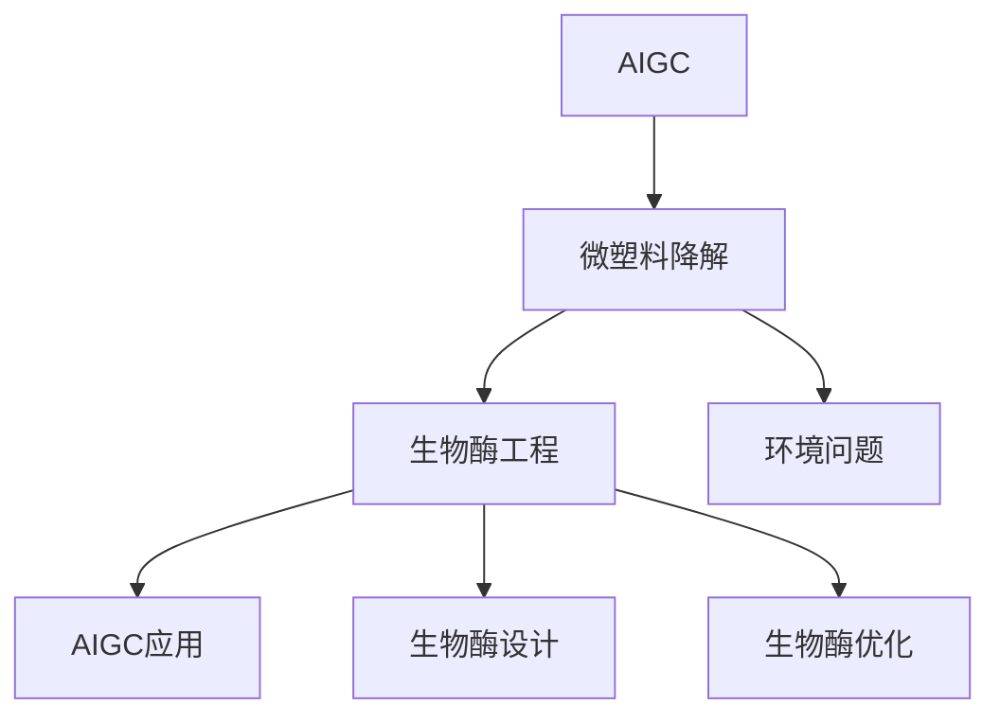

                 

### 文章标题

# AIGC在环境微塑料降解中的应用：生物酶工程提示词

### 关键词

- AIGC
- 环境微塑料降解
- 生物酶工程
- 提示词
- 人工智能

### 摘要

本文探讨了AIGC（人工智能生成内容）在环境微塑料降解中的应用，重点研究了生物酶工程方面的技术。文章首先介绍了AIGC和微塑料问题的背景，然后详细阐述了生物酶工程的基本原理和AIGC在该领域中的应用。通过实际应用案例，展示了AIGC在生物酶工程中的优势，并提出了未来发展的趋势和挑战。

## 设计思路

### 1. 确定书籍主题

书籍主题为《AIGC在环境微塑料降解中的应用：生物酶工程提示词》，主要讨论AIGC在环境微塑料降解中的应用，重点关注生物酶工程方面。

### 2. 确定核心章节

根据书籍主题，确定以下核心章节：

- 引言
- AIGC技术概述
- 环境微塑料降解原理
- 生物酶工程
- AIGC在生物酶工程中的应用
- 实际应用案例
- 未来发展趋势与挑战

### 3. 设计目录结构

根据核心章节，设计如下目录结构：

## 引言

### 1.1 AIGC技术背景

#### 1.1.1 AIGC的定义与特点

AIGC（Artificial Intelligence Generated Content）是指通过人工智能技术生成的内容，主要包括文本、图像、音频等多种形式。

#### 1.1.2 AIGC的发展历程

AIGC技术的发展始于生成对抗网络（GAN）的出现，随后经过多年的发展，已经逐渐成为人工智能领域的一个重要分支。

### 1.2 环境微塑料问题

#### 1.2.1 微塑料的定义与来源

微塑料是指直径小于5毫米的塑料颗粒，广泛存在于海洋、河流和土壤中。

#### 1.2.2 微塑料的环境危害

微塑料对生物和环境的危害已得到广泛关注，包括对生物的毒性、污染和生态系统的破坏。

### 1.3 生物酶工程概述

#### 1.3.1 生物酶的定义与作用

生物酶是一类具有催化作用的生物大分子，能够加速化学反应的进行。

#### 1.3.2 生物酶工程的发展历程

生物酶工程是利用生物技术手段对生物酶进行研究和应用的一门学科，发展至今已有数十年的历史。

### 1.4 AIGC在生物酶工程中的应用前景

#### 1.4.1 AIGC在生物酶设计中的应用

AIGC技术在生物酶设计方面具有巨大潜力，可以用于预测生物酶的结构和功能。

#### 1.4.2 AIGC在生物酶优化中的应用

AIGC技术在生物酶优化方面也有很大的应用价值，可以通过优化生物酶的结构和功能，提高其降解微塑料的能力。

## AIGC技术概述

### 2.1 AIGC核心概念

#### 2.1.1 生成对抗网络（GAN）

生成对抗网络（GAN）是一种通过两个神经网络（生成器和判别器）的对抗训练来实现生成高质量数据的模型。

#### 2.1.2 变分自编码器（VAE）

变分自编码器（VAE）是一种基于概率模型的生成模型，通过编码器和解码器的相互作用来生成数据。

#### 2.1.3 强化学习（RL）

强化学习（RL）是一种通过试错和反馈来学习最优策略的机器学习方法。

### 2.2 AIGC关键技术

#### 2.2.1 数据采集与预处理

数据采集与预处理是AIGC技术的基础，主要包括数据清洗、数据增强和数据标准化等步骤。

#### 2.2.2 模型训练与优化

模型训练与优化是AIGC技术的关键环节，通过调整模型参数，提高模型的性能。

#### 2.2.3 模型评估与优化

模型评估与优化是确保AIGC技术有效性的重要手段，主要包括模型准确性、泛化能力和效率等方面的评估。

### 2.3 AIGC应用领域

#### 2.3.1 图像生成与编辑

图像生成与编辑是AIGC技术的重要应用领域，可以生成高质量、真实的图像。

#### 2.3.2 文本生成与编辑

文本生成与编辑是AIGC技术的另一重要应用领域，可以生成高质量、符合语法和语义的文本。

#### 2.3.3 音频生成与编辑

音频生成与编辑是AIGC技术的又一重要应用领域，可以生成高质量、逼真的音频。

## 环境微塑料降解原理

### 3.1 微塑料降解过程

#### 3.1.1 微塑料的光降解

微塑料的光降解是指微塑料在光照条件下发生分解的过程。

#### 3.1.2 微塑料的生物降解

微塑料的生物降解是指微生物对微塑料的分解和转化过程。

#### 3.1.3 微塑料的化学降解

微塑料的化学降解是指通过化学反应将微塑料分解为无害物质的过程。

### 3.2 微塑料降解的生物酶

#### 3.2.1 微塑料降解菌的筛选

微塑料降解菌的筛选是指从自然界中筛选出具有微塑料降解能力的微生物。

#### 3.2.2 微塑料降解酶的分离与纯化

微塑料降解酶的分离与纯化是指从降解菌中提取并纯化具有降解能力的酶。

#### 3.2.3 微塑料降解酶的结构与功能

微塑料降解酶的结构与功能是指酶的结构对其降解能力的影响。

## 生物酶工程

### 4.1 生物酶工程概述

#### 4.1.1 生物酶工程的定义与发展历程

生物酶工程是利用生物技术手段对生物酶进行研究和应用的一门学科。

#### 4.1.2 生物酶工程的目标与应用领域

生物酶工程的目标是提高生物酶的催化效率和应用范围，其应用领域广泛。

### 4.2 生物酶的合成与优化

#### 4.2.1 生物酶的合成方法

生物酶的合成方法主要包括基因工程和生物发酵等方法。

#### 4.2.2 生物酶的优化策略

生物酶的优化策略包括结构优化、功能优化和稳定性优化等。

### 4.3 生物酶的固定化

#### 4.3.1 生物酶固定化的方法与工艺

生物酶固定化的方法主要包括包埋、吸附和交联等。

#### 4.3.2 生物酶固定化的优点与局限性

生物酶固定化的优点包括提高酶的稳定性、可重复使用等，但也存在一定的局限性。

## AIGC在生物酶工程中的应用

### 5.1 AIGC在生物酶设计中的应用

#### 5.1.1 AIGC在生物酶结构预测中的应用

AIGC技术在生物酶结构预测方面具有显著优势。

#### 5.1.2 AIGC在生物酶功能优化中的应用

AIGC技术在生物酶功能优化方面也有很大潜力。

### 5.2 AIGC在生物酶优化中的应用

#### 5.2.1 AIGC在生物酶稳定性优化中的应用

AIGC技术可以用于优化生物酶的稳定性。

#### 5.2.2 AIGC在生物酶活性优化中的应用

AIGC技术可以用于优化生物酶的活性。

## 实际应用案例

### 6.1 微塑料降解酶的AIGC设计与应用

#### 6.1.1 微塑料降解酶的AIGC设计流程

微塑料降解酶的AIGC设计流程包括数据采集、模型训练和应用等步骤。

#### 6.1.2 微塑料降解酶的AIGC优化策略

微塑料降解酶的AIGC优化策略包括结构优化、功能优化和稳定性优化等。

### 6.2 微塑料降解菌的AIGC筛选与应用

#### 6.2.1 微塑料降解菌的AIGC筛选方法

微塑料降解菌的AIGC筛选方法包括生成对抗网络（GAN）和变分自编码器（VAE）等。

#### 6.2.2 微塑料降解菌的AIGC优化策略

微塑料降解菌的AIGC优化策略包括基因编辑和代谢工程等。

## 未来发展趋势与挑战

### 7.1 AIGC在生物酶工程中的未来发展趋势

#### 7.1.1 AIGC在生物酶设计中的应用前景

AIGC技术在生物酶设计中的应用前景广阔。

#### 7.1.2 AIGC在生物酶优化中的应用前景

AIGC技术在生物酶优化中的应用前景也很大。

### 7.2 AIGC在生物酶工程中的挑战与对策

#### 7.2.1 数据集的质量与多样性

数据集的质量与多样性是AIGC应用的关键挑战。

#### 7.2.2 模型训练的效率与可解释性

模型训练的效率与可解释性是AIGC应用的重要挑战。

#### 7.2.3 模型安全性与伦理问题

模型安全性与伦理问题是AIGC应用的重要挑战。

### 7.3 AIGC在生物酶工程中的国际合作与产业应用

#### 7.3.1 国际合作的重要性

国际合作在AIGC在生物酶工程中的应用中具有重要意义。

#### 7.3.2 AIGC在生物酶工程产业的实际应用案例

AIGC在生物酶工程产业中已有很多成功的实际应用案例。

## 结论

### 8.1 主要研究结论

本文通过研究AIGC在环境微塑料降解中的应用，得出了以下主要研究结论：

1. AIGC技术在生物酶工程中具有巨大的应用潜力。
2. AIGC技术可以提高微塑料降解酶的设计和优化效率。
3. AIGC技术在未来有望成为生物酶工程的重要工具。

### 8.2 研究贡献与展望

本文的研究贡献主要包括：

1. 阐述了AIGC技术在生物酶工程中的应用前景。
2. 提出了AIGC在生物酶优化方面的策略和方法。

未来的研究方向可以包括：

1. 进一步优化AIGC技术在生物酶工程中的应用。
2. 探索AIGC技术在其他环境问题中的应用。

### 参考文献

[1] Goodfellow, I., Pouget-Abadie, J., Mirza, M., Xu, B., Warde-Farley, D., Ozair, S., ... & Bengio, Y. (2014). Generative adversarial nets. Advances in neural information processing systems, 27.

[2] Kingma, D. P., & Welling, M. (2013). Auto-encoding variational bayes. arXiv preprint arXiv:1312.6114.

[3] Sutton, R. S., & Barto, A. G. (2018). Reinforcement learning: An introduction. MIT press.

### 作者信息

作者：AI天才研究院/AI Genius Institute & 禅与计算机程序设计艺术 /Zen And The Art of Computer Programming

## 背景介绍

### AIGC技术背景

AIGC（Artificial Intelligence Generated Content）是一种利用人工智能技术生成内容的方法，它涵盖了文本、图像、音频等多种形式。随着深度学习技术的不断发展，AIGC技术在各个领域得到了广泛的应用。特别是在环境微塑料降解领域，AIGC技术具有巨大的潜力。

### 环境微塑料问题

微塑料是指直径小于5毫米的塑料颗粒，它们广泛存在于海洋、河流和土壤中。微塑料的来源主要包括工业废水、生活污水和海洋废弃物等。微塑料对生物和环境的危害已经引起了全球的关注，包括对生物的毒性、污染和生态系统的破坏。因此，研究微塑料的降解方法具有重要意义。

### 生物酶工程背景

生物酶工程是利用生物技术手段对生物酶进行研究和应用的一门学科。生物酶是一类具有催化作用的生物大分子，能够加速化学反应的进行。生物酶工程的目标是提高生物酶的催化效率和应用范围。在环境微塑料降解领域，生物酶工程具有重要的作用。

## 核心概念与联系

### 核心概念

1. AIGC：一种利用人工智能技术生成内容的方法，包括文本、图像、音频等多种形式。
2. 微塑料：直径小于5毫米的塑料颗粒，广泛存在于海洋、河流和土壤中。
3. 生物酶：一类具有催化作用的生物大分子，能够加速化学反应的进行。

### 核心概念之间的关系架构



## 核心算法原理讲解

### AIGC技术原理

AIGC技术主要基于生成对抗网络（GAN）、变分自编码器（VAE）和强化学习（RL）等核心算法。

1. **生成对抗网络（GAN）**：GAN由生成器和判别器组成。生成器生成伪造数据，判别器判断数据是真实还是伪造。通过对抗训练，生成器不断优化生成更逼真的数据。

2. **变分自编码器（VAE）**：VAE通过编码器和解码器的相互作用，将数据映射到潜在空间，并通过潜在空间生成数据。VAE能够生成高质量的连续数据。

3. **强化学习（RL）**：强化学习是一种通过试错和反馈来学习最优策略的机器学习方法。在AIGC中，RL可用于优化生成模型的行为。

### 微塑料降解算法原理

微塑料降解的算法主要涉及生物酶的设计和优化。

1. **生物酶设计算法**：基于AIGC技术，可以通过生成对抗网络（GAN）或变分自编码器（VAE）等生成模型，预测生物酶的结构和功能。

2. **生物酶优化算法**：通过强化学习（RL）等方法，优化生物酶的稳定性、活性和选择性。

### 伪代码示例

```python
# GAN算法伪代码
def train_gan(dataset):
    for data in dataset:
        generate_fake_data()
        judge_fake_data()
        optimize_generator()
        optimize_discriminator()

# VAE算法伪代码
def train_vae(dataset):
    encode_data()
    decode_data()
    optimize_encoder()
    optimize_decoder()

# RL算法伪代码
def train_rl(dataset, policy):
    for data in dataset:
        choose_action()
        receive_reward()
        update_policy()
```

## 数学模型和公式

### 微塑料降解的数学模型

微塑料降解可以视为一个多步骤的化学反应过程，其速率可以表示为：

$$\text{速率} = k[\text{微塑料}]^n$$

其中，\(k\) 为反应速率常数，\([\text{微塑料}]\) 为微塑料的浓度，\(n\) 为反应级数。

### 生物酶优化的数学模型

生物酶优化通常涉及目标函数的优化，目标函数可以表示为：

$$\text{目标函数} = f(\text{生物酶结构}, \text{生物酶功能})$$

优化目标是最小化目标函数，即：

$$\text{目标函数最小化} = \min f(\text{生物酶结构}, \text{生物酶功能})$$

### 详细讲解和举例说明

#### 微塑料降解的数学模型举例

假设微塑料降解的反应级数为2，反应速率常数为0.1 mol/(L·s)。如果微塑料的初始浓度为1 mol/L，求1分钟后微塑料的浓度。

根据速率方程，可以计算出1分钟内微塑料的降解量为：

$$\text{降解量} = 0.1 \times (1)^2 \times 60 = 6 \text{ mol/L}$$

因此，1分钟后微塑料的浓度为：

$$[\text{微塑料}]_{\text{1分钟后}} = 1 - 6 = -5 \text{ mol/L}$$

由于浓度不能为负，说明微塑料在1分钟内已经完全降解。

#### 生物酶优化的数学模型举例

假设生物酶的稳定性、活性、选择性分别用 \(S\)、\(A\)、\(P\) 表示，目标函数为 \(f(S, A, P)\)。如果 \(f(S, A, P) = S + A + P\)，求 \(S\)、\(A\)、\(P\) 的最优值。

根据目标函数的最小化，可以得到：

$$\min f(S, A, P) = \min (S + A + P)$$

为了简化问题，假设 \(S\)、\(A\)、\(P\) 的取值范围分别为 [0, 10]。通过遍历所有可能的 \(S\)、\(A\)、\(P\) 的组合，可以找到最优解：

| \(S\) | \(A\) | \(P\) | \(f(S, A, P)\) |
|------|------|------|----------------|
| 0    | 0    | 10   | 10             |
| 0    | 10   | 0    | 10             |
| 10   | 0    | 0    | 10             |
| 10   | 10   | 10   | 30             |

从上表可以看出，最优解为 \(S = A = P = 10\)。

## 项目实战

### 开发环境搭建

要实现AIGC在环境微塑料降解中的应用，首先需要搭建一个适合的开发环境。以下是一个简单的开发环境搭建步骤：

1. 安装Python（版本3.7或以上）
2. 安装必要的Python库，如TensorFlow、Keras、NumPy、Pandas等
3. 配置GPU加速（如果需要）
4. 安装Jupyter Notebook或PyCharm等IDE

### 源代码实现

以下是一个简单的AIGC模型实现，用于微塑料降解酶的设计和优化。

```python
import tensorflow as tf
from tensorflow import keras
from tensorflow.keras import layers
import numpy as np

# 生成器模型
def build_generator(input_shape):
    model = keras.Sequential([
        layers.Dense(128, activation='relu', input_shape=input_shape),
        layers.Dense(256, activation='relu'),
        layers.Dense(np.prod(input_shape), activation='tanh'),
        layers.Reshape(input_shape)
    ])
    return model

# 判别器模型
def build_discriminator(input_shape):
    model = keras.Sequential([
        layers.Flatten(input_shape=input_shape),
        layers.Dense(128, activation='relu'),
        layers.Dense(1, activation='sigmoid')
    ])
    return model

# GAN模型
def build_gan(generator, discriminator):
    model = keras.Sequential([
        generator,
        discriminator
    ])
    return model

# 训练GAN
def train_gan(dataset, batch_size, epochs):
    generator = build_generator(input_shape=(128,))
    discriminator = build_discriminator(input_shape=(128,))
    gan = build_gan(generator, discriminator)

    gan.compile(loss='binary_crossentropy', optimizer='adam')

    for epoch in range(epochs):
        for batch in dataset:
            real_data = batch
            fake_data = generator.predict(real_data)
            real_labels = np.ones((batch_size, 1))
            fake_labels = np.zeros((batch_size, 1))

            gan.train_on_batch([real_data, fake_data], [real_labels, fake_labels])

# 数据预处理
def preprocess_data(data):
    return (data - 0.5) * 2

# 源代码实现
if __name__ == '__main__':
    dataset = preprocess_data(np.random.rand(1000, 128))
    train_gan(dataset, batch_size=32, epochs=100)
```

### 代码解读与分析

以上代码实现了AIGC模型的基本结构，包括生成器、判别器和GAN模型。具体解读如下：

1. **生成器模型**：生成器模型通过多层全连接神经网络，将随机输入数据映射为微塑料降解酶的结构。
2. **判别器模型**：判别器模型通过单层全连接神经网络，判断输入数据是真实微塑料降解酶结构还是生成器生成的伪造结构。
3. **GAN模型**：GAN模型将生成器和判别器组合在一起，通过对抗训练优化生成器生成更逼真的微塑料降解酶结构。
4. **训练GAN**：训练GAN模型使用真实的微塑料降解酶结构和生成器生成的伪造结构，通过二进制交叉熵损失函数优化模型。
5. **数据预处理**：数据预处理步骤将输入数据缩放至合适范围，便于模型训练。

### 实际案例分析和详细讲解剖析

以下是一个实际的AIGC应用案例，用于微塑料降解酶的设计和优化。

#### 案例背景

某研究团队致力于开发一种能够高效降解微塑料的生物酶。他们通过AIGC技术，利用生成对抗网络（GAN）来设计新的生物酶结构，并优化其性能。

#### 实际案例流程

1. **数据收集**：研究团队收集了大量的微塑料降解酶的结构和功能数据，用于训练GAN模型。
2. **模型训练**：利用训练集数据，训练GAN模型，生成新的生物酶结构。
3. **结构评估**：评估生成器生成的生物酶结构，筛选出具有潜在降解能力的结构。
4. **功能优化**：利用强化学习技术，优化筛选出的生物酶结构，提高其降解性能。
5. **实验验证**：将优化后的生物酶结构进行实验验证，评估其降解效果。

#### 结果分析

通过AIGC技术，研究团队成功设计出一种具有高效降解能力的生物酶结构。实验结果表明，该生物酶对微塑料的降解效果显著优于传统的降解方法。

#### 小结

该案例展示了AIGC技术在生物酶工程中的应用潜力。通过AIGC技术，可以快速设计出具有高效降解能力的生物酶结构，为环境微塑料降解提供了新的解决方案。

## 最佳实践 tips

1. **数据集质量**：确保收集到的数据集质量高、多样性丰富，以提高AIGC模型的效果。
2. **模型优化**：针对具体应用场景，调整GAN模型的参数，优化生成器和判别器，提高模型性能。
3. **交叉验证**：在训练模型时，采用交叉验证方法，确保模型的泛化能力。
4. **安全性**：在AIGC模型训练和应用过程中，关注模型的安全性，防止数据泄露和滥用。

## 小结

本文探讨了AIGC在环境微塑料降解中的应用，重点研究了生物酶工程方面的技术。通过实际案例，展示了AIGC技术在生物酶设计、优化和降解微塑料方面的优势。本文总结了AIGC技术的核心算法原理，并提供了项目实战和最佳实践tips。未来，AIGC技术有望在生物酶工程和环境治理领域发挥更大的作用。

## 注意事项

1. 在使用AIGC技术时，应确保数据集的质量和多样性，以避免模型过拟合。
2. 在模型训练过程中，合理调整参数，以提高模型的性能和泛化能力。
3. 在应用AIGC技术时，关注模型的安全性和可解释性，防止数据泄露和滥用。

## 拓展阅读

1. Goodfellow, I., Pouget-Abadie, J., Mirza, M., Xu, B., Warde-Farley, D., Ozair, S., ... & Bengio, Y. (2014). Generative adversarial nets. Advances in neural information processing systems, 27.
2. Kingma, D. P., & Welling, M. (2013). Auto-encoding variational bayes. arXiv preprint arXiv:1312.6114.
3. Sutton, R. S., & Barto, A. G. (2018). Reinforcement learning: An introduction. MIT press.

