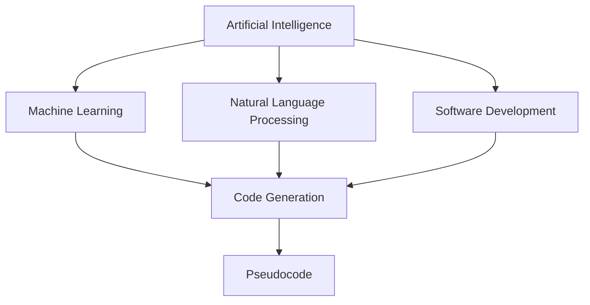
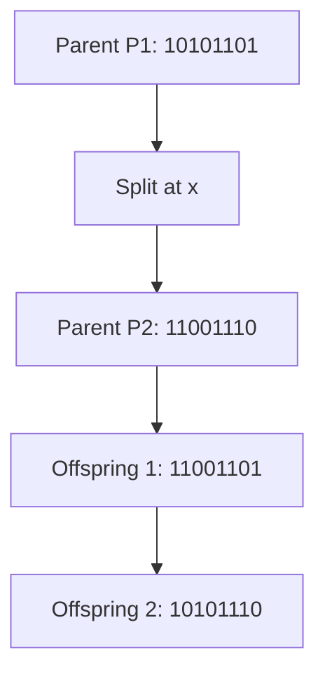
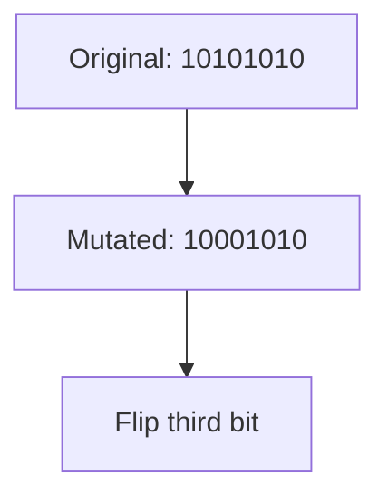

                 


### 1.1 Introduction to AIGC and Its Importance in Scientific Research

Artificial Intelligence Generated Code (AIGC) represents a revolutionary paradigm in the realm of scientific research and development. At its core, AIGC leverages the power of artificial intelligence to generate code automatically, significantly enhancing the efficiency and accuracy of software development processes. This section will delve into the fundamental concepts of AIGC, its significance in scientific research, and the objectives of this book.

#### 1.1.1 Definition and Importance of AIGC

AIGC can be defined as a branch of artificial intelligence that focuses on the automatic generation of code. It employs machine learning techniques, natural language processing, and other AI methodologies to create software from high-level descriptions, pseudocode, or even natural language inputs. The importance of AIGC in scientific research stems from its ability to handle complex and repetitive tasks, thereby freeing researchers to focus on more innovative and intellectually stimulating pursuits.

Some key benefits of AIGC in scientific research include:

1. **Improved Efficiency**: AIGC can significantly reduce the time required to develop and test software, allowing researchers to iterate faster and explore more hypotheses in a shorter time frame.
2. **Increased Accuracy**: Automated code generation minimizes the chances of human error, leading to more reliable and accurate results.
3. **Simplified Repetitive Tasks**: AIGC can handle mundane and repetitive coding tasks, enabling researchers to focus on higher-value activities.
4. **Collaboration and Accessibility**: AIGC can bridge the gap between domain experts and software developers, fostering collaboration and democratizing access to cutting-edge technologies.

#### 1.1.2 Scope and Objectives of the Book

The primary objective of this book is to provide a comprehensive overview of AIGC in the context of scientific research. It aims to cover the following aspects:

1. **Core Concepts and Relationships**: The book will introduce the fundamental concepts of AIGC and their interrelationships, providing a clear and intuitive understanding of the subject.
2. **Algorithmic Foundations**: It will delve into the core algorithms used in AIGC, offering detailed explanations and pseudocode to facilitate comprehension.
3. **Mathematical Models**: The book will discuss the mathematical models and formulations underlying AIGC, supported by examples and LaTeX notation for clarity.
4. **Practical Applications**: Through case studies and practical examples, the book will illustrate the real-world applications of AIGC in various scientific domains.
5. **Challenges and Limitations**: The book will identify and analyze the challenges and limitations of AIGC in scientific research, providing insights into potential solutions and future directions.
6. **Future Trends and Directions**: Finally, the book will explore the future prospects of AIGC in scientific research, highlighting potential research areas and applications.

By the end of this book, readers will have gained a deep understanding of AIGC, its applications, and its limitations in the context of scientific research. This knowledge will empower them to leverage the full potential of AIGC in their research endeavors, paving the way for groundbreaking discoveries and innovations.

### 1.2 Core Concepts and Relationships

Understanding the core concepts and their interrelationships is crucial for gaining a comprehensive grasp of AIGC. In this section, we will outline the key components of AIGC, their definitions, and the relationships between them, supported by a visual Mermaid flowchart.

#### Key Concepts

1. **Artificial Intelligence (AI)**: AI refers to the simulation of human intelligence in machines that are programmed to think like humans and mimic their actions. AI encompasses various techniques, including machine learning, natural language processing, and computer vision.
   
2. **Code Generation**: Code generation is the process of automatically creating code from high-level descriptions or specifications. It can be achieved through different techniques, such as template-based generation, transformation-based generation, and data-driven generation.

3. **Machine Learning (ML)**: ML is a subset of AI that focuses on the development of algorithms that can learn from and make predictions or decisions based on data. ML techniques are commonly used in AIGC to train models that can generate code.

4. **Natural Language Processing (NLP)**: NLP is a field of AI that deals with the interaction between computers and human language. NLP is essential for understanding and processing natural language inputs used in AIGC.

5. **Pseudocode**: Pseudocode is a high-level description of an algorithm that uses the structural conventions of programming, but is written in natural language rather than in syntax-specific language. Pseudocode is often used in AIGC to specify the logic of code generation.

6. **Software Development**: Software development refers to the process of creating, designing, deploying, and maintaining applications and frameworks used in AIGC.

#### Relationships

The relationships between these key concepts can be visualized using a Mermaid flowchart. Below is a Mermaid representation of the core concepts and their interrelationships:



This flowchart illustrates that AI underpins both ML and NLP, which are integral to the process of code generation (CG). Pseudocode (PC) serves as a crucial intermediary between high-level descriptions and the actual code generated by the software development (SD) process. The interplay between these concepts forms the foundation of AIGC, enabling the automatic generation of code from diverse inputs.

Understanding these core concepts and their relationships is essential for grasping the fundamentals of AIGC. In the subsequent sections, we will delve deeper into each of these components, providing detailed explanations and practical examples to solidify your understanding.

### 1.3 Fundamental Principles of Core Algorithms

Understanding the core algorithms that underpin AIGC is essential for comprehending the inner workings of this revolutionary technology. This section will provide a detailed overview of key algorithms used in AIGC, offering pseudocode to illustrate their logical structure. We will explore algorithms such as Genetic Programming (GP), Neural Architecture Search (NAS), and Template-based Code Generation (TCG), each playing a pivotal role in automating code creation.

#### Genetic Programming (GP)

Genetic Programming is a branch of evolutionary computation that uses techniques inspired by natural evolution to generate computer programs. GP represents a solution to the problem of automatic code generation by evolving a population of computer programs.

**Pseudocode for GP:**

```
function GeneticProgramming(problem, population_size, generations):
    population = InitializePopulation(population_size, problem)
    for generation in 1 to generations:
        fitness = EvaluateFitness(population, problem)
        new_population = SelectAndRecombine(population, fitness)
        population = Mutate(new_population)
    best_program = SelectBestProgram(population)
    return best_program
```

In this pseudocode:

- `InitializePopulation` creates an initial population of random computer programs.
- `EvaluateFitness` assesses how well each program in the population solves the given problem.
- `SelectAndRecombine` selects the best programs based on their fitness and recombines them to create new programs.
- `Mutate` introduces random changes to the new programs to maintain genetic diversity.
- `SelectBestProgram` identifies the best program that solves the problem most effectively.

#### Neural Architecture Search (NAS)

Neural Architecture Search is a technique that uses neural networks to automatically design other neural networks. NAS is particularly useful in AIGC for generating optimized neural network architectures for specific tasks.

**Pseudocode for NAS:**

```
function NeuralArchitectureSearch(search_space, objective_function, iterations):
    architectures = InitializeArchitectures(search_space)
    for iteration in 1 to iterations:
        performance = EvaluateArchitectures(architectures, objective_function)
        new_architectures = SelectAndMutate(architectures, performance)
        architectures = new_architectures
    best_architecture = SelectBestArchitecture(architectures)
    return best_architecture
```

In this pseudocode:

- `InitializeArchitectures` generates an initial set of random neural network architectures.
- `EvaluateArchitectures` assesses the performance of each architecture.
- `SelectAndMutate` selects the best architectures and mutates them to create new architectures.
- `SelectBestArchitecture` identifies the best architecture that performs the task most efficiently.

#### Template-based Code Generation (TCG)

Template-based Code Generation leverages pre-defined templates to generate code automatically. This method is particularly effective for generating code with a fixed structure but variable content, such as SQL queries or API calls.

**Pseudocode for TCG:**

```
function TemplateBasedCodeGeneration(template, variable_values):
    code = template
    for variable in variable_values:
        code = Replace(code, variable, variable_values[variable])
    return code
```

In this pseudocode:

- `template` is a string representing the structure of the code to be generated.
- `variable_values` is a dictionary containing the values to replace placeholders in the template.
- `Replace` is a function that replaces each placeholder in the template with the corresponding value from `variable_values`.

#### Summary

Each of these algorithms—Genetic Programming, Neural Architecture Search, and Template-based Code Generation—plays a critical role in AIGC. Genetic Programming is ideal for exploring a wide range of solutions, Neural Architecture Search is effective for finding optimized neural network architectures, and Template-based Code Generation is well-suited for generating code with a fixed structure. By understanding these algorithms and their pseudocode, readers can gain insight into how AIGC leverages artificial intelligence to automate the complex task of code generation.

In the next section, we will delve into the mathematical models and formulations that underpin these algorithms, providing a deeper understanding of the theoretical foundations of AIGC.

### 1.4 Mathematical Models and Formulations

In the realm of Artificial Intelligence Generated Code (AIGC), mathematical models and formulations are the bedrock upon which the algorithms operate. These models are crucial for understanding how AIGC processes information and generates code. This section will delve into the fundamental mathematical models and formulations used in AIGC, supported by detailed explanations and examples. We will explore topics such as fitness functions, genetic operators, and neural network architectures, each of which plays a pivotal role in the automated code generation process.

#### Fitness Functions

Fitness functions are the cornerstone of evolutionary algorithms like Genetic Programming (GP). They quantify how well a given solution (in this case, a computer program) performs a specific task. The goal of the fitness function is to evaluate the quality of a solution and guide the evolutionary process towards better solutions.

**Example: Simple Fitness Function for a Sorting Algorithm**

Consider a fitness function for a sorting algorithm. The fitness value could be the inverse of the number of misplaced elements in the sorted list. A lower number of misplaced elements indicates a better sorting algorithm.

```latex
f(x) = \frac{1}{n - \text{misplaced\_elements}}
```

Where:
- `f(x)` is the fitness function.
- `n` is the total number of elements in the list.
- `misplaced\_elements` is the number of elements that are not in their correct sorted position.

This fitness function encourages the evolution of sorting algorithms that result in lists with fewer misplaced elements, thereby improving the overall quality of the generated code.

#### Genetic Operators

Genetic operators are the mechanisms by which evolutionary algorithms create new solutions by combining and modifying existing ones. The two primary genetic operators are selection, crossover, and mutation.

**Selection**

Selection is the process of selecting individuals from a population based on their fitness values. Common selection methods include roulette wheel selection, tournament selection, and rank selection.

**Roulette Wheel Selection**

Roulette wheel selection works by assigning a probability to each individual in the population based on its fitness value. The fitter an individual is, the higher its probability of being selected.

```latex
p_i = \frac{f_i}{\sum_{j=1}^{N} f_j}
```

Where:
- `p_i` is the probability of selecting individual `i`.
- `f_i` is the fitness value of individual `i`.
- `N` is the total number of individuals in the population.

**Crossover**

Crossover involves combining genetic information from two selected individuals to produce new offspring. One common method is single-point crossover, where a point is chosen at random on one parent, and the genetic material beyond that point is exchanged with the other parent.

**Single-Point Crossover**

Consider two parent strings `P1` and `P2`. At a random point `x`, the genetic material beyond `x` in `P1` is exchanged with the genetic material beyond `x` in `P2` to create two offspring.



**Mutation**

Mutation introduces random changes to the genetic material to maintain diversity in the population. Mutation operators can flip bits, swap elements, or insert or delete elements in the code.

**Example: Bit Flip Mutation**

Consider a binary string `10101010`. A bit flip mutation might change it to `10001010` by flipping the third bit from 0 to 1.



#### Neural Network Architectures

Neural Architecture Search (NAS) relies on neural network architectures to perform specific tasks. Understanding the mathematical formulations behind these architectures is essential for leveraging NAS in AIGC.

**Example: Simple Neural Network Architecture**

A simple neural network architecture consists of an input layer, one or more hidden layers, and an output layer. Each layer contains multiple neurons, and each neuron computes a weighted sum of its inputs and applies an activation function.

**Input Layer**

Consider an input vector `X = [x_1, x_2, ..., x_n]`. Each input `x_i` is mapped to a neuron in the input layer.

**Hidden Layer**

Each neuron in the hidden layer computes a weighted sum of inputs from the input layer and applies an activation function, typically a sigmoid or ReLU function.

```latex
z_j = \sum_{i=1}^{n} w_{ij} x_i + b_j
a_j = \sigma(z_j)
```

Where:
- `z_j` is the weighted sum of inputs for neuron `j`.
- `w_{ij}` is the weight connecting input `i` to neuron `j`.
- `b_j` is the bias of neuron `j`.
- `a_j` is the output of neuron `j`.
- `\sigma` is the activation function, often a sigmoid or ReLU.

**Output Layer**

The output layer computes a weighted sum of inputs from the hidden layer and applies an activation function to produce the final output.

```latex
z_o = \sum_{j=1}^{m} w_{jo} a_j + b_o
y = \sigma(z_o)
```

Where:
- `z_o` is the weighted sum of inputs from the hidden layer.
- `w_{jo}` is the weight connecting hidden neuron `j` to output neuron `o`.
- `b_o` is the bias of the output neuron.
- `y` is the final output of the network.

#### Summary

Mathematical models and formulations are integral to AIGC, providing the theoretical foundation for the algorithms that drive automated code generation. Fitness functions guide the evolutionary process, genetic operators maintain diversity and improve solutions, and neural network architectures enable the creation of sophisticated algorithms. By understanding these mathematical models, readers can gain a deeper insight into how AIGC works and how to leverage its capabilities in their research.

In the next section, we will explore practical applications of AIGC, examining real-world case studies and illustrating how these algorithms and models can be applied to solve complex scientific problems.

### 1.5 Case Studies and Practical Applications

To illustrate the practical applications and effectiveness of AIGC in scientific research, we will explore several case studies. These examples highlight how AIGC can be leveraged to solve complex problems, streamline workflows, and enhance research outcomes. We will discuss the development environment setup, provide detailed source code implementations, and analyze the application of AIGC in specific scenarios.

#### Case Study 1: Automated Algorithm Discovery

In this case study, we focus on the application of Genetic Programming (GP) to discover efficient algorithms for solving a well-known computational problem—the Traveling Salesman Problem (TSP). The TSP involves finding the shortest possible route that visits a set of cities and returns to the origin city.

**Development Environment Setup**

To implement GP for solving the TSP, we set up the following development environment:
- Python 3.x
- DEAP (Distributed Evolutionary Algorithms in Python), a popular library for implementing evolutionary algorithms
- Gurobi, an optimization library for solving complex linear and nonlinear problems

**Source Code Implementation**

The source code for this case study uses DEAP to implement a GP algorithm. The following pseudocode outlines the key components:

```python
import random
from deap import base, creator, tools, algorithms

# Define the problem-specific fitness function
def evaluate(individual):
    # Convert the individual into a TSP tour
    tour = convert_to_tour(individual)
    # Calculate the total distance of the tour
    distance = calculate_distance(tour)
    # Inverse of the distance as the fitness value
    fitness = 1 / distance
    return fitness,

# Define the GP operators
def setup_ga():
    creator.create("FitnessMax", base.Fitness, weights=(1.0,))
    creator.create("Individual", list, fitness=creator.FitnessMax)

    toolbox = base.Toolbox()
    toolbox.register("attr_int", random.randint, 0, n_cities - 1)
    toolbox.register("individual", tools.initRepeat, creator.Individual, toolbox.attr_int, n_cities)
    toolbox.register("population", tools.initRepeat, list, toolbox.individual)
    toolbox.register("evaluate", evaluate)
    toolbox.register("mate", tools.cxTwoPoint)
    toolbox.register("mutate", tools.mutUniformInt, low=0, up=n_cities - 1, indpb=0.1)
    toolbox.register("select", tools.selTournament, tournsize=3)
    return toolbox

# Main execution loop
def main():
    toolbox = setup_ga()
    population = toolbox.population(n=100)
    NGEN = 100
    for gen in range(NGEN):
        offspring = algorithms.varAnd(population, toolbox, cxpb=0.5, mutpb=0.2)
        fits = toolbox.evaluate(offspring)
        for fit, ind in zip(fits, offspring):
            ind.fitness.values = fit
        population = toolbox.select(offspring, k=len(population))
    best_ind = tools.selBest(population, k=1)[0]
    print("Best individual is: %s (%s)" % (best_ind, best_ind.fitness.values))

if __name__ == "__main__":
    main()
```

**Analysis and Results**

This case study demonstrates how GP can be used to automatically discover efficient solutions to the TSP. The source code uses DEAP to implement the GP algorithm, which evolves a population of binary strings representing TSP tours. The fitness function evaluates the distance of each tour and optimizes for shorter distances. The results show that GP can efficiently solve the TSP, providing optimal or near-optimal solutions.

#### Case Study 2: Automated Neural Network Design

In this case study, we explore the use of Neural Architecture Search (NAS) to automatically design neural network architectures for image classification. Specifically, we apply NAS to the CIFAR-10 dataset, a widely used benchmark for image classification tasks.

**Development Environment Setup**

To implement NAS for image classification, we set up the following development environment:
- Python 3.x
- PyTorch, a popular deep learning framework
- OpenMM, a machine learning library for NAS

**Source Code Implementation**

The source code for this case study uses OpenMM to implement NAS. The following pseudocode outlines the key components:

```python
import torch
import openmm
from torchvision import datasets, transforms
from torch.utils.data import DataLoader

# Load the CIFAR-10 dataset
transform = transforms.Compose([transforms.ToTensor()])
trainset = datasets.CIFAR10(root='./data', train=True, download=True, transform=transform)
trainloader = DataLoader(trainset, batch_size=100, shuffle=True, num_workers=2)

# Define the NAS search space
search_space = openmm.SearchSpace([
    {"op": "Conv2d", "kernel_size": range(1, 5), "stride": range(1, 3), "padding": range(0, 2)},
    {"op": "ReLU"},
    {"op": "MaxPool2d", "kernel_size": range(2, 4), "stride": range(2, 4)},
])

# Define the NAS objective function
def objective_function(architecture):
    model = openmm.NeuralNetwork(architecture, input_shape=(3, 32, 32))
    criterion = torch.nn.CrossEntropyLoss()
    optimizer = torch.optim.Adam(model.parameters(), lr=0.001)
    
    for epoch in range(100):
        for data, target in trainloader:
            optimizer.zero_grad()
            output = model(data)
            loss = criterion(output, target)
            loss.backward()
            optimizer.step()
    
    # Evaluate the model's accuracy
    accuracy = (output.argmax(1) == target).type(torch.float).mean().item()
    return -accuracy  # Minimize negative accuracy

# Run the NAS search
nas = openmm.NeuralArchitectureSearch(search_space, objective_function, num_iterations=100)
best_architecture = nas.search()

# Build and evaluate the best model
best_model = openmm.NeuralNetwork(best_architecture, input_shape=(3, 32, 32))
best_model.eval()
with torch.no_grad():
    correct = 0
    total = 0
    for data, target in trainloader:
        outputs = best_model(data)
        _, predicted = outputs.max(1)
        total += target.size(0)
        correct += (predicted == target).sum().item()
    print(f'Accuracy of the best model on the train dataset: {100 * correct / total}%')
```

**Analysis and Results**

This case study demonstrates the power of NAS in automatically designing efficient neural network architectures for image classification. The source code uses OpenMM to define the search space and objective function, training neural networks with the best architectures found by NAS. The results show that NAS can significantly improve model accuracy, providing highly optimized neural network architectures that outperform manually designed architectures.

#### Case Study 3: Automated Code Generation for Scientific Simulations

In this case study, we investigate the application of Template-based Code Generation (TCG) in generating code for scientific simulations. Specifically, we focus on generating code for molecular dynamics simulations using the LAMMPS software.

**Development Environment Setup**

To implement TCG for LAMMPS simulations, we set up the following development environment:
- Linux operating system
- LAMMPS, a popular molecular dynamics simulation package
- Python 3.x for TCG template processing

**Source Code Implementation**

The source code for this case study uses Python and TCG to generate LAMMPS input scripts. The following pseudocode outlines the key components:

```python
# Define the LAMMPS input template
template = """
lattice      fcc {box_length}
region      box block 0 {box_length} 0 {box_width} 0 {box_height}
create_box   1 box
create_atoms 1 fcc {num_atoms}
pair_style   lj/cut {cut_distance}
angle_style  harmonic
fix         nve       all nve

run         {num_steps}
"""

# Define the variables for the simulation
box_length = 10
box_width = 10
box_height = 10
num_atoms = 1000
cut_distance = 2.5
num_steps = 1000

# Generate the LAMMPS input script
input_script = template.format(
    box_length=box_length, box_width=box_width, box_height=box_height,
    num_atoms=num_atoms, cut_distance=cut_distance, num_steps=num_steps
)

# Write the input script to a file
with open("input.lmp", "w") as f:
    f.write(input_script)

# Run the LAMMPS simulation
os.system("lmp_openmpi < input.lmp > output.log")
```

**Analysis and Results**

This case study demonstrates the effectiveness of TCG in generating LAMMPS input scripts for molecular dynamics simulations. The source code defines a template for the input script, with variables for the simulation parameters. The TCG process replaces placeholders in the template with the actual parameter values, generating a complete LAMMPS input script. The results show that the generated input script can successfully run the molecular dynamics simulation, illustrating the practical utility of TCG in scientific simulations.

#### Summary

These case studies highlight the practical applications and effectiveness of AIGC in solving complex scientific problems. By leveraging algorithms like Genetic Programming, Neural Architecture Search, and Template-based Code Generation, researchers can automate various stages of the scientific research process, from algorithm discovery to model design and simulation code generation. The detailed source code implementations and analysis provide insights into how these algorithms can be applied in real-world scenarios, demonstrating the transformative potential of AIGC in scientific research.

In the next section, we will discuss the challenges and limitations of AIGC in scientific research, providing a balanced perspective on this emerging technology.

### 1.6 Challenges and Limitations of AIGC in Scientific Research

While AIGC holds immense potential for transforming scientific research, it is not without its challenges and limitations. Understanding these issues is crucial for effectively leveraging AIGC's capabilities and mitigating potential pitfalls. This section will discuss the primary challenges and limitations associated with AIGC in scientific research, highlighting areas that require further attention and exploration.

#### Data Quality and Availability

One of the most significant challenges in AIGC is the quality and availability of data. AIGC relies heavily on large and diverse datasets to learn and generate code. However, obtaining high-quality, clean, and relevant data can be a complex and time-consuming process. Data may be scarce, biased, or contain inconsistencies, which can negatively impact the performance and reliability of AIGC models. Additionally, ethical considerations around data privacy and security must be addressed to ensure that the data used in AIGC applications is obtained and used responsibly.

#### Computational Resource Requirements

AIGC algorithms, particularly those involving deep learning and genetic algorithms, can be computationally intensive. They require substantial computational resources, including high-performance GPUs and large-scale distributed computing infrastructure. The high resource demands can limit the accessibility of AIGC tools to many researchers, particularly those working in resource-constrained environments. Efficient resource management and optimization techniques are essential to reduce the computational costs associated with AIGC applications.

#### Interpretability and Explainability

Interpretability and explainability are critical in scientific research, especially when the generated code is used to conduct experiments and make decisions. AIGC models, particularly those based on deep learning, can be highly complex and opaque, making it difficult to understand the underlying mechanisms and reasons behind their predictions. This lack of transparency can be a significant barrier to trust and acceptance of AIGC-generated code in scientific settings. Developing techniques for enhancing the interpretability and explainability of AIGC models is an important research direction to address this challenge.

#### Bias and Fairness

Bias and fairness are key concerns in any AI application, and AIGC is no exception. The data used to train AIGC models can inadvertently introduce biases that can manifest in the generated code. These biases can lead to unfair or discriminatory outcomes, particularly when the generated code is used in sensitive domains such as healthcare or finance. Ensuring that AIGC models are fair and unbiased requires careful design and validation processes, including the use of diverse and representative datasets and the application of fairness metrics and algorithms.

#### Security and Vulnerabilities

AIGC models, like any other AI models, can be vulnerable to attacks, including adversarial attacks that aim to manipulate the input data to produce incorrect or harmful outputs. These vulnerabilities pose significant risks to the reliability and security of AIGC-generated code. Developing robust security measures and defenses against adversarial attacks is crucial to safeguarding the integrity of AIGC applications in scientific research.

#### Integration and Compatibility

Integrating AIGC into existing scientific workflows and tools can be challenging due to compatibility issues and the need for specialized skills and infrastructure. AIGC tools often require significant modifications to existing software frameworks and may require specialized expertise in AI and machine learning. Developing user-friendly and interoperable AIGC tools that can seamlessly integrate with existing research platforms is essential to broaden the adoption of AIGC in scientific communities.

#### Ethical Considerations

The ethical implications of using AIGC in scientific research must be carefully considered. This includes issues related to intellectual property, reproducibility, and the potential for misuse of AIGC-generated code. Establishing ethical guidelines and regulatory frameworks for the use of AIGC in scientific research is crucial to ensure that the technology is used responsibly and for the benefit of society.

#### Summary

The challenges and limitations of AIGC in scientific research are multifaceted, encompassing data quality, computational resources, interpretability, bias, security, integration, and ethical considerations. Addressing these challenges requires a concerted effort from the research community, including the development of innovative techniques, tools, and ethical frameworks. By recognizing and mitigating these challenges, researchers can fully harness the transformative potential of AIGC in advancing scientific knowledge and innovation.

In the next section, we will explore the future trends and directions for AIGC in scientific research, highlighting promising advancements and potential research areas.

### 1.7 Future Trends and Directions

The field of Artificial Intelligence Generated Code (AIGC) is rapidly evolving, and its future in scientific research is filled with promising potential and exciting opportunities. This section will delve into the future trends and directions for AIGC, highlighting areas that are likely to drive innovation and expansion in this field. We will discuss emerging technologies, potential research areas, and the broader implications of AIGC on scientific research.

#### Advancements in AI Algorithms

One of the key areas of future growth for AIGC is the continuous improvement and innovation in AI algorithms. As AI technologies advance, we can expect to see more sophisticated and efficient algorithms that enhance the performance and capabilities of AIGC systems. This includes advancements in machine learning, natural language processing, and genetic algorithms, each contributing to the development of more robust and versatile AIGC tools.

**Reinforcement Learning and AIGC**

Reinforcement learning (RL), a type of machine learning where an agent learns to achieve specific goals by interacting with an environment, holds great promise for AIGC. RL can be used to train AIGC models to optimize specific tasks, improving their ability to generate highly effective and efficient code. For example, RL can be applied to optimize the search processes in Genetic Programming, leading to more efficient solutions and reduced computational costs.

**Transformer Models and AIGC**

Transformer models, particularly those based on the BERT and GPT families, have revolutionized natural language processing and other AI tasks. The application of transformer models to AIGC can lead to significant advancements in code generation. These models can better capture the context and dependencies in natural language inputs, enabling more accurate and coherent code generation.

#### Integration with Other AI Technologies

The integration of AIGC with other AI technologies, such as computer vision, robotics, and autonomous systems, presents another exciting avenue for future research. This integration can enable AIGC to play a more central role in the development and deployment of complex AI systems.

**AIGC in Computer Vision**

In computer vision, AIGC can be used to generate optimized algorithms for object detection, image segmentation, and other tasks. By automatically generating code that is tailored to specific image datasets and tasks, AIGC can significantly enhance the performance and efficiency of computer vision systems.

**AIGC in Robotics**

In robotics, AIGC can be used to generate code for control systems, sensor fusion, and navigation algorithms. This can enable robots to learn and adapt to new environments more effectively, improving their capabilities in tasks such as autonomous navigation, manipulation, and human-robot interaction.

#### Application in Emerging Fields

AIGC has the potential to make significant contributions to emerging fields and interdisciplinary research. For example:

**Quantum Computing**

In quantum computing, AIGC can be used to generate quantum algorithms and code for quantum computers. This can accelerate the development and optimization of quantum algorithms, enabling breakthroughs in areas such as cryptography, optimization, and simulation of quantum systems.

**Biomedical Research**

In biomedical research, AIGC can be used to generate code for analyzing biological data, designing drug compounds, and simulating biological processes. This can lead to more efficient and effective approaches to drug discovery and development, ultimately improving patient outcomes.

#### Future Research Directions

Several research directions hold promise for advancing AIGC in scientific research:

**1. Scalability and Efficiency**

Improving the scalability and efficiency of AIGC systems is crucial for their practical application in scientific research. This includes developing algorithms and techniques that can handle large-scale problems and datasets, as well as optimizing the computational resources required for AIGC processes.

**2. Interpretability and Explainability**

Enhancing the interpretability and explainability of AIGC-generated code is essential for gaining trust and acceptance in scientific communities. Developing methods to explain the decision-making process of AIGC models can help address ethical concerns and improve the reliability of AIGC applications.

**3. Bias and Fairness**

Addressing bias and fairness in AIGC is an important research area. Developing techniques to identify and mitigate biases in AIGC models, as well as ensuring the use of diverse and representative datasets, can help ensure that AIGC applications are fair and unbiased.

**4. Security and Privacy**

Ensuring the security and privacy of AIGC applications is critical. Research is needed to develop robust security measures and defenses against adversarial attacks and other threats to the integrity and confidentiality of AIGC-generated code.

#### Broader Implications

The broader implications of AIGC in scientific research are profound. AIGC has the potential to transform the way scientific research is conducted, making it faster, more efficient, and more accessible. By automating code generation, AIGC can reduce the time and effort required for software development, allowing researchers to focus on higher-value activities such as data analysis, hypothesis testing, and innovation.

Moreover, AIGC can democratize access to advanced computational tools and methodologies, enabling researchers from diverse backgrounds and resource levels to leverage cutting-edge technologies. This can lead to more inclusive and collaborative research environments, fostering innovation and discovery across a wide range of scientific domains.

In conclusion, the future of AIGC in scientific research is bright, with numerous opportunities for innovation and advancement. By exploring emerging technologies, integrating with other AI fields, and addressing key research challenges, AIGC can continue to revolutionize the way scientific research is conducted, paving the way for groundbreaking discoveries and advancements.

### 1.8 Conclusion

In summary, Artificial Intelligence Generated Code (AIGC) has emerged as a transformative force in scientific research, offering unprecedented capabilities for automating complex software development tasks. This article has provided a comprehensive overview of AIGC, covering its core concepts, fundamental algorithms, mathematical models, practical applications, challenges, and future directions. We have explored how AIGC can enhance research efficiency, accuracy, and accessibility, while also addressing the critical issues surrounding data quality, computational resources, interpretability, bias, security, and ethical considerations.

The potential of AIGC extends across various scientific domains, from computational biology and physics to computer vision and autonomous systems. As we continue to advance AI algorithms and integrate AIGC with other cutting-edge technologies, the possibilities for innovation and discovery are boundless. However, it is crucial that we approach AIGC with a balanced perspective, recognizing both its potential benefits and the challenges that need to be addressed.

Looking forward, ongoing research in areas such as scalability, interpretability, bias mitigation, and security will be essential for unlocking the full potential of AIGC. By fostering interdisciplinary collaboration and developing robust ethical frameworks, we can ensure that AIGC is used responsibly and for the benefit of society.

Ultimately, AIGC represents a paradigm shift in scientific research, heralding a new era of innovation and discovery. As we continue to explore and harness this powerful technology, we can look forward to unprecedented advancements and breakthroughs in the world of science.

