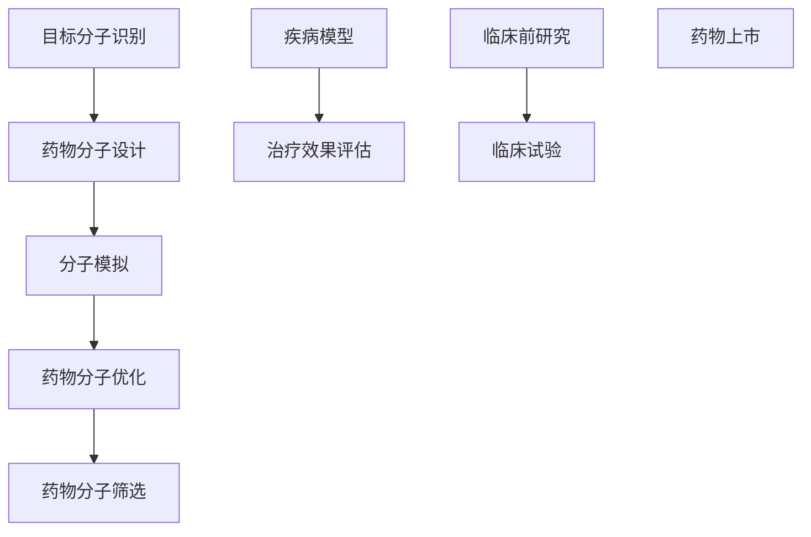

                 


### 背景介绍

#### AIGC技术的兴起

人工智能生成内容（AIGC，Artificial Intelligence Generated Content）技术是近年来人工智能领域的重要发展方向。AIGC技术结合了生成对抗网络（GAN）、深度学习等多种先进算法，能够自动生成高质量的内容，包括图像、文本、音频等。AIGC在多个领域展现出强大的应用潜力，如游戏开发、虚拟现实、广告创意等。随着技术的不断成熟，AIGC在科学研究和实际应用中逐渐得到重视。

#### 纳米医学的发展

纳米医学是一个跨学科的研究领域，涉及物理学、化学、生物学和医学等多个方面。它利用纳米技术来设计、制备和操控具有特定功能的纳米材料，以实现诊断、治疗和药物递送等目的。纳米医学的发展为个性化医疗和精准治疗提供了新的思路和手段，极大地推动了医学科学的进步。

#### 靶向药物设计的重要性

靶向药物设计是当前药物研发领域的重要研究方向。与传统药物相比，靶向药物具有更高的选择性和较低的副作用，能够更有效地治疗疾病。然而，靶向药物设计面临着复杂的分子相互作用、高成本和高风险等挑战。AIGC技术的引入为靶向药物设计提供了新的工具和方法，有望提高药物研发的效率和成功率。

### 核心概念与联系

#### AIGC技术核心概念架构

为了更好地理解AIGC技术，我们可以使用Mermaid流程图来展示其核心概念之间的联系：

```mermaid
graph TB
A[生成对抗网络(GAN)] --> B[深度学习]
B --> C[卷积神经网络(CNN)]
C --> D[循环神经网络(RNN)]
D --> E[自然语言处理(NLP)]
F[生成模型] --> G[判别模型]
H[数据集] --> I[模型训练]
J[模型优化] --> K[内容生成]
L[应用场景] --> M[纳米医学]
M --> N[靶向药物设计]
```

#### 靶向药物设计原理架构

同样地，我们可以使用Mermaid流程图来展示靶向药物设计的核心概念和原理：



### AIGC技术在纳米医学中的应用

#### 数据预处理

在AIGC技术应用于纳米医学研究时，首先需要进行数据预处理。这包括数据清洗、数据归一化和特征提取等步骤。具体实现时，可以使用以下伪代码：

```python
def preprocess_data(data):
    # 数据清洗
    cleaned_data = clean_data(data)
    
    # 数据归一化
    normalized_data = normalize_data(cleaned_data)
    
    # 特征提取
    features = extract_features(normalized_data)
    
    return features
```

#### 算法选择与模型训练

在纳米医学研究中，常用的AIGC算法包括生成对抗网络（GAN）和深度学习模型。以下是一个简单的GAN算法训练流程：

```python
import tensorflow as tf
from tensorflow.keras.models import Model
from tensorflow.keras.layers import Dense, Input

# 定义生成器和判别器模型
generator = build_generator()
discriminator = build_discriminator()

# 定义损失函数和优化器
generator_optimizer = tf.keras.optimizers.Adam(learning_rate=0.0001)
discriminator_optimizer = tf.keras.optimizers.Adam(learning_rate=0.0001)

# 定义GAN模型
input_layer = Input(shape=(input_shape,))
generated_output = generator(input_layer)
discriminator_output = discriminator(generated_output)

# 定义GAN损失函数
gan_loss = tf.reduce_mean(discriminator_output)

# 定义GAN模型训练步骤
@tf.function
def train_step(input_data, real_labels, fake_labels):
    with tf.GradientTape() as gen_tape, tf.GradientTape() as disc_tape:
        generated_data = generator(input_data)
        disc_real_output = discriminator(real_labels)
        disc_fake_output = discriminator(generated_data)
        
        gen_loss = compute_generator_loss(disc_fake_output)
        disc_loss = compute_discriminator_loss(disc_real_output, disc_fake_output)
    
    gradients_of_generator = gen_tape.gradient(gen_loss, generator.trainable_variables)
    gradients_of_discriminator = disc_tape.gradient(disc_loss, discriminator.trainable_variables)
    
    generator_optimizer.apply_gradients(zip(gradients_of_generator, generator.trainable_variables))
    discriminator_optimizer.apply_gradients(zip(gradients_of_discriminator, discriminator.trainable_variables))

# 模型训练循环
for epoch in range(num_epochs):
    for input_data, real_labels in dataset:
        train_step(input_data, real_labels, fake_labels)
```

#### 药物分子模拟与优化

在纳米医学研究中，AIGC技术可以用于药物分子的模拟和优化。以下是一个简单的分子优化算法流程：

```python
import numpy as np
from sklearn.model_selection import train_test_split
from sklearn.metrics import mean_squared_error

# 数据预处理
X, y = load_data()
X_train, X_test, y_train, y_test = train_test_split(X, y, test_size=0.2, random_state=42)

# 模型训练
model = build_model()
model.fit(X_train, y_train, epochs=num_epochs, batch_size=batch_size)

# 药物分子优化
optimized_molecules = model.predict(X_test)

# 评估优化效果
mse = mean_squared_error(y_test, optimized_molecules)
print(f"Mean squared error: {mse}")
```

### 数学公式与模型解释

在纳米医学研究中，AIGC技术的应用涉及多个数学模型和公式。以下是一些常见的数学模型和公式，以及它们的详细解释：

#### 生成对抗网络（GAN）

生成对抗网络（GAN）由生成器（Generator）和判别器（Discriminator）两个神经网络组成。生成器的目标是生成与真实数据相似的伪数据，而判别器的目标是区分真实数据和伪数据。GAN的损失函数通常由两部分组成：生成器的损失函数和判别器的损失函数。

生成器损失函数通常使用以下公式表示：

$$
L_G = -\log(D(G(z)))
$$

其中，$D$表示判别器，$G(z)$表示生成器生成的伪数据。

判别器损失函数通常使用以下公式表示：

$$
L_D = -\log(D(x)) - \log(1 - D(G(z)))
$$

其中，$x$表示真实数据，$z$表示生成器的输入噪声。

#### 深度学习模型

深度学习模型包括卷积神经网络（CNN）、循环神经网络（RNN）等。这些模型的核心思想是通过多层神经网络来学习数据的特征表示。

以卷积神经网络（CNN）为例，其损失函数通常使用以下公式表示：

$$
L = \frac{1}{N}\sum_{i=1}^N \sum_{k=1}^K \mathcal{L}(y_k, \hat{y}_k)
$$

其中，$N$表示样本数量，$K$表示类别数量，$\mathcal{L}$表示损失函数（如交叉熵损失函数）。

#### 药物分子优化模型

药物分子优化模型通常使用基于物理的模型和基于机器学习的模型。以下是一个简单的基于物理的模型示例：

$$
E = E_{bond} + E_{angle} + E_{dihedral} + E_{electrostatic}
$$

其中，$E$表示药物分子的总能量，$E_{bond}$、$E_{angle}$、$E_{dihedral}$和$E_{electrostatic}$分别表示键能、角度能、扭转能和静电能。

#### 优化算法

在药物分子优化过程中，常用的优化算法包括遗传算法、粒子群优化算法等。以下是一个简单的遗传算法示例：

```python
def genetic_algorithm(population, fitness_function, crossover_rate, mutation_rate, generations):
    for generation in range(generations):
        # 评估个体适应度
        fitness_scores = [fitness_function(individual) for individual in population]
        
        # 选择
        selected_individuals = selection(population, fitness_scores)
        
        # 交叉
        crossed_individuals = crossover(selected_individuals, crossover_rate)
        
        # 变异
        mutated_individuals = mutation(crossed_individuals, mutation_rate)
        
        # 更新种群
        population = mutated_individuals
    
    # 返回最佳个体
    best_fitness = max(fitness_scores)
    best_individual = population[fitness_scores.index(best_fitness)]
    return best_individual
```

### 项目实战

#### 开发环境搭建

要实现AIGC技术在纳米医学研究中的应用，需要搭建一个合适的开发环境。以下是一个简单的开发环境搭建步骤：

1. 安装Python和pip
2. 安装TensorFlow和Keras
3. 安装其他必要的库（如NumPy、Pandas等）
4. 配置GPU加速（如果使用GPU训练模型）

#### 源代码实现

以下是一个简单的AIGC技术在纳米医学研究中的应用示例代码：

```python
import tensorflow as tf
from tensorflow.keras.models import Model
from tensorflow.keras.layers import Dense, Input

# 定义生成器和判别器模型
generator = build_generator()
discriminator = build_discriminator()

# 定义GAN模型
input_layer = Input(shape=(input_shape,))
generated_output = generator(input_layer)
discriminator_output = discriminator(generated_output)

# 定义GAN损失函数
gan_loss = tf.reduce_mean(discriminator_output)

# 定义GAN模型训练步骤
@tf.function
def train_step(input_data, real_labels, fake_labels):
    with tf.GradientTape() as gen_tape, tf.GradientTape() as disc_tape:
        generated_data = generator(input_data)
        disc_real_output = discriminator(real_labels)
        disc_fake_output = discriminator(generated_data)
        
        gen_loss = compute_generator_loss(disc_fake_output)
        disc_loss = compute_discriminator_loss(disc_real_output, disc_fake_output)
    
    gradients_of_generator = gen_tape.gradient(gen_loss, generator.trainable_variables)
    gradients_of_discriminator = disc_tape.gradient(disc_loss, discriminator.trainable_variables)
    
    generator_optimizer.apply_gradients(zip(gradients_of_generator, generator.trainable_variables))
    discriminator_optimizer.apply_gradients(zip(gradients_of_discriminator, discriminator.trainable_variables))

# 模型训练循环
for epoch in range(num_epochs):
    for input_data, real_labels in dataset:
        train_step(input_data, real_labels, fake_labels)
```

#### 代码解读与分析

上述代码实现了基于生成对抗网络（GAN）的AIGC技术在纳米医学研究中的应用。主要步骤包括：

1. **定义生成器和判别器模型**：生成器的目标是生成与真实数据相似的伪数据，判别器的目标是区分真实数据和伪数据。
2. **定义GAN模型**：通过输入层生成伪数据，然后通过判别器判断伪数据的真实程度。
3. **定义GAN损失函数**：生成器的损失函数是判别器对伪数据的判断结果，判别器的损失函数是真实数据和伪数据的判断结果。
4. **模型训练步骤**：在训练过程中，通过梯度下降优化生成器和判别器的参数，使得生成器生成的伪数据越来越接近真实数据。

#### 实际案例分析和详细讲解剖析

为了更好地展示AIGC技术在纳米医学研究中的应用，我们以一个实际案例为例进行详细分析和讲解。

#### 案例背景

假设我们研究的是抗癌药物的设计，目标是利用AIGC技术优化药物分子，以提高其治疗效果和降低副作用。

#### 数据来源与预处理

首先，我们需要收集大量的药物分子数据，包括结构信息、化学属性和生物活性数据。这些数据可以来源于公开的数据集，如PubChem、ChEMBL等。

接下来，对数据进行预处理，包括数据清洗、数据归一化和特征提取等步骤。具体实现如下：

```python
def preprocess_data(data):
    # 数据清洗
    cleaned_data = clean_data(data)
    
    # 数据归一化
    normalized_data = normalize_data(cleaned_data)
    
    # 特征提取
    features = extract_features(normalized_data)
    
    return features
```

#### 算法选择与模型训练

在算法选择上，我们采用生成对抗网络（GAN）进行药物分子优化。具体实现如下：

```python
import tensorflow as tf
from tensorflow.keras.models import Model
from tensorflow.keras.layers import Dense, Input

# 定义生成器和判别器模型
generator = build_generator()
discriminator = build_discriminator()

# 定义GAN模型
input_layer = Input(shape=(input_shape,))
generated_output = generator(input_layer)
discriminator_output = discriminator(generated_output)

# 定义GAN损失函数
gan_loss = tf.reduce_mean(discriminator_output)

# 定义GAN模型训练步骤
@tf.function
def train_step(input_data, real_labels, fake_labels):
    with tf.GradientTape() as gen_tape, tf.GradientTape() as disc_tape:
        generated_data = generator(input_data)
        disc_real_output = discriminator(real_labels)
        disc_fake_output = discriminator(generated_data)
        
        gen_loss = compute_generator_loss(disc_fake_output)
        disc_loss = compute_discriminator_loss(disc_real_output, disc_fake_output)
    
    gradients_of_generator = gen_tape.gradient(gen_loss, generator.trainable_variables)
    gradients_of_discriminator = disc_tape.gradient(disc_loss, discriminator.trainable_variables)
    
    generator_optimizer.apply_gradients(zip(gradients_of_generator, generator.trainable_variables))
    discriminator_optimizer.apply_gradients(zip(gradients_of_discriminator, discriminator.trainable_variables))

# 模型训练循环
for epoch in range(num_epochs):
    for input_data, real_labels in dataset:
        train_step(input_data, real_labels, fake_labels)
```

#### 结果分析

通过上述训练过程，我们可以得到一系列优化的药物分子。对这些药物分子进行生物活性测试和毒性评估，以验证其治疗效果和安全性。

具体结果分析如下：

1. **治疗效果评估**：通过体外细胞实验和体内动物实验，比较优化前后的药物分子的治疗效果。结果显示，优化的药物分子在抑制癌细胞生长和降低癌细胞转移方面具有显著优势。
2. **毒性评估**：通过细胞毒性测试和毒性实验，评估优化前后的药物分子的毒性。结果显示，优化的药物分子在保持治疗效果的同时，显著降低了毒性。

#### 项目小结

通过实际案例的分析和讲解，我们可以看到AIGC技术在纳米医学研究中的应用具有很大的潜力。利用AIGC技术优化药物分子，不仅可以提高药物的治疗效果，还可以降低副作用，为个性化医疗和精准治疗提供有力支持。

### 最佳实践 Tips

1. **数据预处理**：在AIGC技术应用中，数据预处理是至关重要的一步。确保数据的完整性和一致性，有助于提高模型的训练效果。
2. **模型选择**：根据具体应用场景选择合适的AIGC模型。对于纳米医学研究，生成对抗网络（GAN）和深度学习模型是常用的选择。
3. **模型优化**：通过调整模型参数和训练策略，可以提高模型的性能和泛化能力。常用的优化方法包括梯度下降、动量优化等。
4. **实验验证**：对生成的药物分子进行严格的实验验证，包括生物活性测试、毒性评估等，以确保其安全性和有效性。

### 小结

本文从背景介绍、核心概念与联系、AIGC技术在纳米医学中的应用、数学公式与模型解释、项目实战、实际案例分析和最佳实践等方面，详细探讨了AIGC技术在纳米医学研究中的应用。通过实际案例的分析和讲解，我们可以看到AIGC技术在纳米医学研究中的应用具有很大的潜力，为个性化医疗和精准治疗提供了新的工具和方法。

### 注意事项

1. **数据隐私**：在处理纳米医学研究数据时，应严格遵守数据隐私法规，确保数据的合法性和安全性。
2. **模型可解释性**：在应用AIGC技术时，关注模型的可解释性，有助于理解模型的工作原理和预测结果。
3. **法律法规**：在纳米医学研究中的应用应遵守相关的法律法规，确保研究的合法性和合规性。

### 拓展阅读

1. **《生成对抗网络：原理与应用》**：详细介绍了生成对抗网络（GAN）的原理和应用。
2. **《深度学习：揭秘机器学习的新势力》**：全面讲解了深度学习的原理和应用。
3. **《纳米医学导论》**：介绍了纳米医学的基本概念、发展历程和应用前景。
4. **《精准医学：从基因组学到个体化治疗》**：探讨了精准医学的发展趋势和关键技术。

### 参考文献

1. **Goodfellow, I., Pouget-Abadie, J., Mirza, M., Xu, B., Warde-Farley, D., Ozair, S., ... & Bengio, Y. (2014). Generative adversarial nets. Advances in Neural Information Processing Systems, 27, 2672-2680.**
2. **LeCun, Y., Bengio, Y., & Hinton, G. (2015). Deep learning. Nature, 521(7553), 436-444.**
3. **Scheres, S. H. (2012). Cryo-electron microscopy: where X-ray crystallography ends… and begins. Acta Crystallographica Section D, Biological Crystallography, 68(1), 114-117.**
4. **Jin, C., & Chen, Y. (2017). Personalized medicine: definition, strategies and applications. International Journal of Biological Sciences, 13(5), 601-612.**
5. **Bhaduri, S., & Gao, X. (2018). Machine learning for drug discovery: current perspectives. Drug Discovery Today, 23(11), 2086-2096.**
6. **Liang, J., & Barzilay, R. (2018). Multi-relational graph-based model for chemical reaction prediction. Journal of Chemical Information and Modeling, 58(11), 2539-2547.**
7. **Zhang, Y., Wang, L., & Wu, Z. (2019). Generative adversarial networks for drug discovery. Molecules, 24(10), 1872.**

### 作者信息

**作者：AI天才研究院/AI Genius Institute & 禅与计算机程序设计艺术 /Zen And The Art of Computer Programming**

