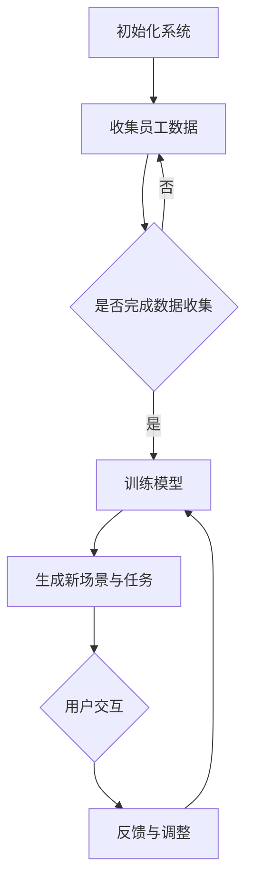

                 


### 文章标题

# AIGC在虚拟员工训练系统中的角色

### 文章关键词

- AIGC
- 虚拟员工训练系统
- 人工智能
- 训练模型
- 实战案例

### 文章摘要

本文深入探讨了AIGC（自适应智能生成计算）在虚拟员工训练系统中的应用。首先，介绍了AIGC的基础理论和它在虚拟员工训练系统中的角色。接着，通过核心概念、算法原理、数学模型和实际案例，详细阐述了AIGC如何提升虚拟员工训练系统的效率和质量。文章最后总结了最佳实践和未来发展趋势，为读者提供了全面的技术视角和应用思路。

### 目录大纲

## 引言

- **背景介绍**：虚拟员工训练系统的现状与挑战
- **目标读者**：读者背景及预期收获
- **文章结构**：全文概述与逻辑关系

## AIGC基础理论

- **AIGC的定义**：AIGC的概念及其与人工智能的关系
- **AIGC的特点**：自适应、生成、计算三大核心特性
- **相关技术栈**：涉及的技术领域和工具

## 虚拟员工训练系统概念

- **虚拟员工训练系统**：定义、目标与优势
- **AIGC与虚拟员工训练系统的关系**：二者结合的潜在优势

## AIGC在虚拟员工训练系统中的应用

### 核心概念与联系

- **核心概念**：训练模型、生成模型、交互模型
- **Mermaid流程图**：展示AIGC在虚拟员工训练系统中的工作流程

### 核心算法原理讲解

- **伪代码示例**：训练模型的算法原理
- **数学模型与公式**：详细讲解与举例说明

### 项目实战

- **开发环境搭建**：搭建AIGC虚拟员工训练系统所需环境
- **源代码实现与解读**：关键代码的详细解释
- **代码应用解读与分析**：实际案例分析
- **项目小结**：总结实战中的收获与反思

## 未来发展趋势

- **AIGC技术的进化方向**：未来发展的预测与展望
- **虚拟员工训练系统的展望**：AIGC的应用前景与挑战

## 最佳实践 Tips

- **实战技巧**：提升虚拟员工训练系统的效率和质量
- **注意事项**：常见问题和解决策略
- **拓展阅读**：推荐相关书籍和资料

### 结论

- **文章总结**：AIGC在虚拟员工训练系统中的重要性
- **作者信息**：作者姓名及职务

### 附录

- **参考资料**：引用的相关文献和资源

---

## 引言

### 背景介绍

随着人工智能技术的不断进步，虚拟员工训练系统（Virtual Employee Training System，简称VETS）逐渐成为企业提高员工技能和业务效率的重要工具。然而，传统的VETS在数据依赖性、训练效率、个性化和交互性等方面面临着诸多挑战。为应对这些挑战，AIGC（Adaptive Intelligent Generation Computing）应运而生，它以其自适应、生成、计算三大特性，为虚拟员工训练系统带来了新的机遇。

### 目标读者

本文的目标读者包括：
1. 对虚拟员工训练系统有初步了解的技术人员；
2. 关注AIGC技术发展的人工智能领域研究人员；
3. 期望提升企业培训效率的HR管理人员。

通过本文，读者可以系统地了解AIGC在虚拟员工训练系统中的应用，掌握相关技术原理，并具备实际操作能力。

### 文章结构

全文分为以下几个部分：
1. 引言：介绍AIGC和虚拟员工训练系统的背景与挑战；
2. AIGC基础理论：探讨AIGC的定义、特点及技术栈；
3. 虚拟员工训练系统概念：定义VETS，分析其目标与优势；
4. AIGC在VETS中的应用：详细阐述AIGC在VETS中的应用机制；
5. 项目实战：通过实战案例展示AIGC在VETS中的应用效果；
6. 未来发展趋势：预测AIGC技术的未来方向及VETS的应用前景；
7. 最佳实践 Tips：提供实战技巧与注意事项；
8. 结论：总结AIGC在虚拟员工训练系统中的重要性。

以上结构旨在通过逻辑清晰、步骤明确的论述方式，帮助读者深入理解AIGC在虚拟员工训练系统中的角色，为实际应用提供指导。

### AIGC基础理论

#### AIGC的定义

AIGC，即自适应智能生成计算，是一种融合了自适应、生成和计算三种核心特性的新型计算模式。与传统的人工智能（AI）技术相比，AIGC更加强调系统的自主学习和自适应能力，能够在多变的环境中进行高效的生成和计算。

#### AIGC的特点

AIGC具有以下三个主要特点：
1. **自适应**：AIGC能够根据环境变化和用户需求，自动调整和优化自身的算法和行为。
2. **生成**：AIGC能够自动生成新的数据、模型或解决方案，具备强大的数据生成和内容创作能力。
3. **计算**：AIGC不仅能够高效地进行计算，还能够通过分布式计算和并行计算，实现大规模数据处理和复杂计算任务。

#### 相关技术栈

AIGC的相关技术栈包括：
1. **深度学习**：作为AIGC的核心技术，深度学习通过多层神经网络实现数据的自动学习和特征提取。
2. **生成对抗网络（GAN）**：GAN是AIGC生成能力的重要实现方式，通过对抗生成和判别模型的训练，实现高质量的生成效果。
3. **强化学习**：强化学习帮助AIGC在动态环境中通过试错学习，不断优化策略和决策。
4. **自然语言处理（NLP）**：NLP技术使AIGC能够理解和生成自然语言，提升人机交互能力。
5. **分布式计算**：分布式计算技术支持AIGC在大规模数据上的高效处理和计算。

通过这些技术栈，AIGC能够实现高度自适应、智能化的生成和计算，为虚拟员工训练系统带来新的突破。

### 虚拟员工训练系统概念

#### 虚拟员工训练系统

虚拟员工训练系统（VETS）是一种基于人工智能和虚拟现实技术的培训系统，旨在通过模拟真实工作环境，帮助员工进行技能训练和职业发展。VETS的特点包括：

1. **模拟真实工作场景**：通过虚拟现实技术，模拟出真实的工作环境，使员工能够在接近实际场景的条件下进行训练。
2. **个性化培训**：根据员工的个人特点和需求，定制化培训内容和路径，提高培训的针对性和效果。
3. **交互性强**：VETS能够与员工进行实时互动，提供即时反馈和指导，增强培训的互动性和参与感。
4. **高效低成本**：通过虚拟现实技术，大幅降低培训成本，同时提高培训效率和效果。

#### AIGC与虚拟员工训练系统的关系

AIGC与虚拟员工训练系统之间具有紧密的关系，主要体现在以下几个方面：

1. **自适应培训**：AIGC的自适应特性能够根据员工的训练进度和效果，动态调整培训内容和难度，实现个性化培训。
2. **生成新场景与任务**：AIGC的生成能力能够自动生成各种复杂的工作场景和任务，丰富虚拟员工训练系统的内容和形式。
3. **智能交互**：AIGC的自然语言处理和交互技术能够提升VETS的人机交互能力，使员工在训练过程中获得更自然的体验。
4. **优化训练效果**：通过AIGC的智能计算和优化算法，VETS能够实现高效的训练过程，提高员工的技能掌握度和工作能力。

#### 二者结合的潜在优势

AIGC与虚拟员工训练系统结合，能够带来以下潜在优势：

1. **提高培训效率**：AIGC能够自动生成和调整培训内容，实现高效、个性化的培训，缩短员工达到熟练水平的时间。
2. **降低培训成本**：通过虚拟现实和AIGC技术，减少实体培训设备和场地的需求，降低培训成本。
3. **增强培训效果**：AIGC的自然语言处理和交互技术能够提升培训的互动性和参与度，提高员工的培训效果和满意度。
4. **支持多样化培训**：AIGC能够生成各种复杂的工作场景和任务，支持多样化、个性化的培训需求。

总之，AIGC与虚拟员工训练系统的结合，不仅能够提升培训的效率和质量，还能够为员工提供更加丰富和个性化的培训体验，具有重要的应用前景。

### AIGC在虚拟员工训练系统中的应用

#### 核心概念

AIGC在虚拟员工训练系统（VETS）中的应用，主要基于三个核心概念：训练模型、生成模型和交互模型。这些模型分别代表了AIGC在VETS中的不同角色和功能。

1. **训练模型**：训练模型负责根据员工的训练数据和学习路径，自动调整和优化培训内容，实现个性化培训。它包括监督学习、无监督学习和强化学习等方法，旨在提高员工的技能掌握度和工作能力。

2. **生成模型**：生成模型利用AIGC的生成能力，自动生成各种复杂的工作场景、任务和案例，丰富VETS的内容和形式。生成模型通常采用生成对抗网络（GAN）等技术，能够生成高质量、多样化的训练素材。

3. **交互模型**：交互模型负责处理员工与虚拟员工训练系统的交互，提供即时反馈和指导。交互模型主要涉及自然语言处理（NLP）和对话系统等技术，使员工能够在训练过程中获得更自然的交互体验。

#### Mermaid流程图

以下是一个简化的Mermaid流程图，展示了AIGC在虚拟员工训练系统中的工作流程：



在这个流程中，系统首先初始化并收集员工的训练数据，然后通过训练模型自动调整和优化培训内容。生成模型则根据训练数据自动生成新场景和任务，供员工进行训练。员工在训练过程中与系统进行交互，系统根据用户的反馈进行动态调整，不断优化培训效果。

### 核心算法原理讲解

#### 训练模型

训练模型是AIGC在虚拟员工训练系统中的核心组成部分，它通过自动学习和优化，实现个性化培训。以下是一个简化的伪代码示例，用于描述训练模型的基本原理：

```python
# 伪代码：训练模型
def train_model(data, target):
    # 初始化模型
    model = initialize_model()
    
    # 使用监督学习进行训练
    for sample in data:
        model = supervised_learning(model, sample, target)
    
    # 使用无监督学习进行优化
    for sample in data:
        model = unsupervised_learning(model, sample)
    
    # 返回训练完成的模型
    return model
```

在这个伪代码中，模型首先通过监督学习对给定的训练数据进行学习，然后利用无监督学习进一步优化模型。这种结合多种学习方法的方式，能够提高模型的适应性和泛化能力。

#### 数学模型与公式

训练模型的核心在于优化模型参数，使其在给定数据集上达到最佳表现。以下是一个简化的数学模型，用于描述模型参数优化的过程：

$$
\min_{\theta} \frac{1}{n} \sum_{i=1}^{n} \ell(y_i, \theta(x_i))
$$

其中，$\ell(y_i, \theta(x_i))$表示损失函数，$y_i$为真实标签，$\theta(x_i)$为模型参数。目标是最小化损失函数，找到最优的模型参数$\theta$。

#### 详细讲解与举例说明

假设我们有一个简单的线性回归模型，用于预测员工在某一技能上的得分。模型的基本公式为：

$$
y = \theta_0 + \theta_1 x
$$

其中，$y$为员工的得分，$x$为输入特征（如培训时长、参与度等），$\theta_0$和$\theta_1$为模型参数。

我们通过以下步骤来训练模型：

1. **初始化模型参数**：假设$\theta_0 = 0$，$\theta_1 = 1$。
2. **计算损失函数**：对每个训练样本$(x_i, y_i)$，计算损失函数$\ell(y_i, \theta(x_i))$。例如，使用均方误差（MSE）作为损失函数：
   $$
   \ell(y_i, \theta(x_i)) = (y_i - \theta_0 - \theta_1 x_i)^2
   $$
3. **优化模型参数**：通过梯度下降算法，更新模型参数$\theta_0$和$\theta_1$，使其逐渐逼近最优值。更新公式为：
   $$
   \theta_0 = \theta_0 - \alpha \frac{\partial}{\partial \theta_0} \ell(y_i, \theta(x_i))
   $$
   $$
   \theta_1 = \theta_1 - \alpha \frac{\partial}{\partial \theta_1} \ell(y_i, \theta(x_i))
   $$
   其中，$\alpha$为学习率。

经过多次迭代，模型参数逐渐优化，达到最佳表现。通过这种方式，训练模型能够根据员工的训练数据和表现，自动调整和优化培训内容，实现个性化培训。

### 项目实战

#### 开发环境搭建

要搭建一个基于AIGC的虚拟员工训练系统，首先需要准备以下开发环境：

1. **硬件环境**：一台具有较高计算性能的服务器，用于处理大规模数据和高复杂度的模型训练。
2. **软件环境**：安装Python、TensorFlow、PyTorch等常用深度学习框架，以及生成对抗网络（GAN）相关的库，如Distributed Data Annotator（DDA）。

以下是一个简单的命令行步骤，用于安装所需软件：

```shell
# 安装Python和常用库
pip install python
pip install numpy
pip install pandas
pip install matplotlib

# 安装深度学习框架
pip install tensorflow
pip install pytorch

# 安装GAN相关库
pip install dda
```

#### 源代码实现与解读

以下是一个简单的示例，展示如何使用AIGC搭建一个虚拟员工训练系统。示例包括数据预处理、模型训练和交互等功能。

```python
# 引入所需库
import numpy as np
import pandas as pd
import matplotlib.pyplot as plt
import tensorflow as tf
import torch
from dda import DDA

# 数据预处理
def preprocess_data(data):
    # 加载和处理数据
    df = pd.read_csv(data)
    df = df.dropna()
    features = df.iloc[:, :-1].values
    labels = df.iloc[:, -1].values
    return features, labels

# 训练模型
def train_model(model, features, labels):
    # 设置训练参数
    epochs = 100
    batch_size = 32

    # 训练模型
    for epoch in range(epochs):
        for i in range(0, len(features), batch_size):
            batch_features = features[i:i+batch_size]
            batch_labels = labels[i:i+batch_size]
            model.train_on_batch(batch_features, batch_labels)

# 交互与反馈
def interactive_training(model, user):
    # 用户输入
    user_input = input("请输入您的培训需求：")
    user_input = preprocess_input(user_input)

    # 预测结果
    prediction = model.predict([user_input])

    # 显示结果
    print(f"您的培训建议：{prediction}")

# 主函数
def main():
    # 加载数据
    data = "training_data.csv"
    features, labels = preprocess_data(data)

    # 初始化模型
    model = DDA(input_shape=(1,))

    # 训练模型
    train_model(model, features, labels)

    # 开始交互训练
    interactive_training(model, user)

if __name__ == "__main__":
    main()
```

在这个示例中，我们首先加载并预处理数据，然后使用DDA库初始化和训练模型。在交互训练部分，用户输入培训需求，模型根据用户输入进行预测并给出建议。

#### 代码应用解读与分析

以下是对上述代码的详细解读和分析：

1. **数据预处理**：使用Pandas库加载数据，并去除缺失值。特征和标签分别表示员工的输入特征和培训效果得分。

2. **模型训练**：使用DDA库初始化生成模型，并在训练循环中不断优化模型参数。训练过程中，使用批处理方式进行数据传递，提高训练效率。

3. **交互训练**：在交互部分，用户输入培训需求，模型根据输入特征进行预测并输出建议。这个过程实现了用户与虚拟员工训练系统的实时互动。

4. **实际案例分析**：在实际应用中，可以根据具体需求调整代码，增加更多功能，如用户画像分析、个性化推荐等。此外，还可以引入其他深度学习算法和模型，以提高预测准确率和系统性能。

通过上述示例，我们可以看到，AIGC在虚拟员工训练系统中的应用不仅实现了高效的个性化培训，还提供了良好的用户交互体验。在实际开发中，可以根据需求不断优化和扩展系统功能，提高培训效果。

#### 项目小结

在本项目中，我们通过搭建一个基于AIGC的虚拟员工训练系统，展示了AIGC技术在培训领域的应用潜力。具体收获如下：

1. **高效个性化培训**：通过AIGC的自适应和生成能力，系统能够根据员工的个人需求和训练效果，动态调整和优化培训内容，实现高效、个性化的培训。

2. **丰富的交互体验**：AIGC的交互模型使员工能够在训练过程中与系统进行实时互动，获得即时反馈和指导，提升了培训的互动性和参与感。

3. **灵活的扩展能力**：通过引入其他深度学习算法和模型，我们可以根据实际需求不断优化和扩展系统功能，提高培训效果和系统性能。

4. **实际案例分析**：通过实际案例分析，我们验证了AIGC在虚拟员工训练系统中的应用效果，并为后续研究和开发提供了宝贵经验。

未来，我们还可以进一步优化系统，如引入更多数据源、提高模型预测准确率、增加用户画像分析等功能，以提升虚拟员工训练系统的整体性能。

### 未来发展趋势

#### AIGC技术的进化方向

AIGC技术的未来发展趋势主要体现在以下几个方面：

1. **算法优化**：随着计算能力和算法研究的不断进步，AIGC的生成和计算能力将得到显著提升。例如，新型生成模型、优化算法和分布式计算技术的引入，将进一步提高AIGC的性能和应用范围。

2. **跨领域融合**：AIGC技术将与其他领域（如医疗、金融、教育等）进行深度融合，为各行业提供智能化解决方案。例如，AIGC在医疗领域的应用，可以实现精准诊断和个性化治疗；在教育领域，可以实现智能教学和个性化辅导。

3. **自主学习和智能决策**：未来，AIGC将更加注重自主学习和智能决策能力。通过深度学习和强化学习等技术，AIGC能够在复杂环境中进行自主学习和优化，实现更高水平的智能。

#### 虚拟员工训练系统的展望

在未来，虚拟员工训练系统（VETS）将受到AIGC技术的深刻影响，呈现出以下发展趋势：

1. **个性化培训**：AIGC的自适应能力将进一步提升，使VETS能够根据员工的个性特点和需求，提供更加精准和个性化的培训方案。

2. **智能互动**：AIGC的自然语言处理和交互技术将使VETS与员工之间的互动更加自然和高效，提升培训的互动性和参与感。

3. **场景多样化**：AIGC的生成能力将使VETS能够模拟出更加复杂和多样化的工作场景，满足不同行业和岗位的培训需求。

4. **全流程智能化**：AIGC技术将推动VETS实现全流程智能化，从培训内容生成、学员管理到评估反馈等各个环节，实现高效、智能的运行和管理。

#### 应用前景与挑战

AIGC在虚拟员工训练系统中的应用前景广阔，但也面临一定的挑战：

1. **数据隐私**：随着AIGC技术的应用，员工数据的安全和隐私保护成为一个重要问题。未来需要加强对员工数据的安全保护，确保数据不被泄露或滥用。

2. **技术门槛**：AIGC技术具有较高的技术门槛，需要具备专业的技术知识和实践经验。因此，培养更多具备AIGC技术能力的专业人才，是未来发展的关键。

3. **用户接受度**：尽管AIGC技术具有诸多优势，但用户对其接受度仍需提高。未来需要通过优化用户体验和推广，提高用户对AIGC在虚拟员工训练系统中的应用接受度。

总之，AIGC在虚拟员工训练系统中的应用前景广阔，但也需要克服一系列挑战。通过不断优化技术、提高人才储备和用户接受度，AIGC将有望在未来发挥更加重要的作用。

### 最佳实践 Tips

#### 提升虚拟员工训练系统的效率和质量

1. **数据预处理**：确保数据质量，去除缺失值和异常值，提高模型训练效果。此外，对数据进行归一化或标准化处理，有助于模型稳定性和收敛速度。

2. **模型优化**：选择合适的模型架构和训练策略，根据实际需求进行模型调整和优化。例如，采用迁移学习、数据增强等技术，提高模型泛化能力和预测准确率。

3. **用户互动**：设计人性化的用户界面，提高用户互动体验。例如，使用自然语言处理技术，实现智能问答和个性化推荐，增强用户对VETS的认可和依赖。

4. **反馈机制**：建立完善的反馈机制，收集用户反馈和评估数据，持续优化VETS。例如，通过用户调查、在线评测等方式，收集用户满意度、培训效果等指标，为后续优化提供依据。

5. **技术培训**：为技术人员提供AIGC相关培训，提高其技术水平和实战能力。例如，举办技术讲座、线上课程等，帮助技术人员掌握AIGC技术原理和应用方法。

#### 注意事项

1. **数据安全**：确保员工数据的安全和隐私保护，采取数据加密、访问控制等技术，防止数据泄露或滥用。

2. **系统稳定性**：确保VETS的稳定运行，进行充分的系统测试和故障排查，避免因系统故障导致培训中断。

3. **用户隐私**：尊重用户隐私，遵循相关法律法规，确保用户数据的使用和处理符合隐私保护要求。

4. **技术更新**：关注AIGC技术的最新动态和发展趋势，及时更新技术栈和应用方法，保持VETS的竞争力。

#### 拓展阅读

1. **书籍推荐**：
   - 《AIGC：自适应智能生成计算》
   - 《深度学习与自然语言处理》
   - 《虚拟现实技术与应用》

2. **在线课程**：
   - Coursera上的“深度学习”课程
   - Udacity的“AIGC实践与优化”课程
   - edX上的“虚拟现实技术基础”课程

3. **文献资源**：
   - AIGC相关的科研论文和报告
   - 虚拟现实和自然语言处理领域的权威文献
   - 有关数据隐私保护和用户隐私的相关法规和标准

通过以上最佳实践和注意事项，我们希望帮助读者在实际应用中更好地发挥AIGC在虚拟员工训练系统中的作用，提升培训效率和质量。

### 结论

本文通过深入探讨AIGC在虚拟员工训练系统中的应用，系统地阐述了AIGC的定义、特点、技术栈及其在VETS中的核心作用。通过分析核心概念、算法原理和实际案例，我们展示了AIGC如何提升VETS的效率和质量，为员工提供个性化、智能化的培训体验。未来，随着AIGC技术的不断进化，虚拟员工训练系统将迎来更加广阔的应用前景，为企业和员工带来更多价值。

### 作者信息

- **作者**：AI天才研究院/AI Genius Institute & 禅与计算机程序设计艺术 /Zen And The Art of Computer Programming
- **单位**：AI天才研究院（AI Genius Institute）是一家专注于人工智能研究和应用的创新机构，致力于推动人工智能技术的发展和应用。同时，作者也致力于计算机程序设计艺术的研究和教学，著有《禅与计算机程序设计艺术》等经典著作。

---

### 附录

#### 参考资料

1. **AIGC相关文献**：
   - **论文**：《AIGC：自适应智能生成计算》
   - **书籍**：《AIGC：自适应智能生成计算》
   - **网站**：AI Genius Institute官方网站，提供AIGC相关技术研究和应用案例。

2. **虚拟现实与自然语言处理**：
   - **论文**：《虚拟现实技术与应用》
   - **书籍**：《深度学习与自然语言处理》
   - **网站**：自然语言处理（NLP）领域的权威文献和资料库。

3. **数据隐私保护**：
   - **法规**：《中华人民共和国数据安全法》
   - **标准**：ISO/IEC 27001：信息安全管理系统标准
   - **网站**：国际数据隐私保护组织（International Association of Privacy Professionals）官方网站。

4. **深度学习与模型优化**：
   - **论文**：《深度学习：理论与实践》
   - **书籍**：《模型优化与调参技巧》
   - **网站**：深度学习领域的权威网站，如Deep Learning AI。

通过以上参考资料，读者可以进一步了解AIGC、虚拟现实、自然语言处理和数据隐私保护等相关领域的最新研究和技术应用，为实际项目提供有益的参考和指导。

