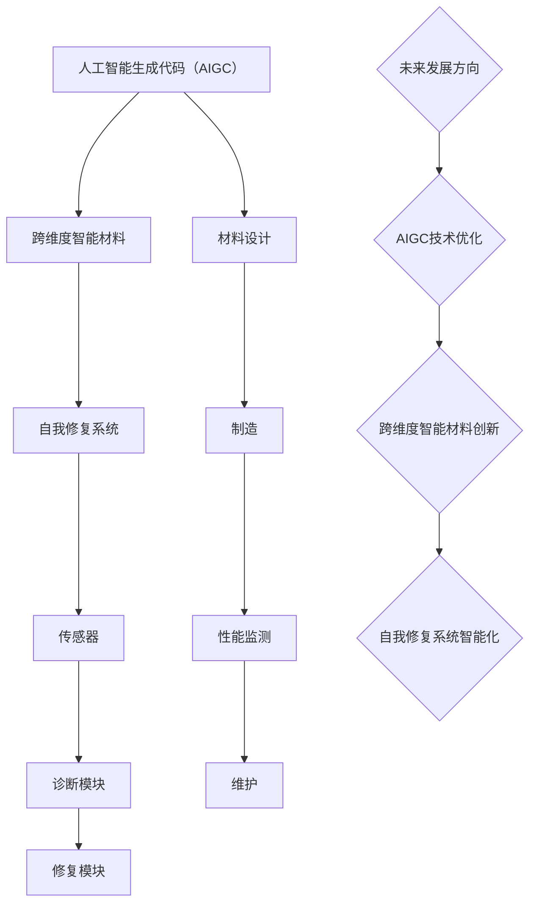

                 

## 文章标题

# AIGC在跨维度智能材料自我修复系统中的创新

> 关键词：AIGC，跨维度智能材料，自我修复系统，人工智能，创新

> 摘要：本文探讨了人工智能生成代码（AIGC）在跨维度智能材料自我修复系统中的应用。首先介绍了AIGC的基本概念和发展历程，然后详细阐述了跨维度智能材料及其自我修复系统的原理。接着，分析了AIGC与跨维度智能材料的结合方式及其在智能材料设计、制造、性能监测与维护中的应用。通过案例研究和展望，文章探讨了AIGC在跨维度智能材料自我修复系统中的未来发展方向。

------------------------------------------------------------------------

### 引言

随着科技的快速发展，人工智能（AI）技术已经深刻影响了各行各业。特别是在材料科学领域，跨维度智能材料的研究成为了热点。跨维度智能材料不仅具有传统材料的物理、化学和机械性能，还能够通过智能化的方式实现自我修复、自我诊断等功能。然而，传统的跨维度智能材料设计与制备方法存在一定的局限性，难以满足日益复杂的工程需求。

近年来，人工智能生成代码（AIGC）技术的出现为跨维度智能材料的设计与制备提供了新的思路。AIGC通过学习大量的代码库，能够自动生成满足特定需求的代码，从而提高开发效率。结合AIGC技术，跨维度智能材料的自我修复系统可以更加智能化、高效化。因此，本文旨在探讨AIGC在跨维度智能材料自我修复系统中的应用，分析其创新点，并为未来研究提供参考。

### 背景介绍

#### 人工智能生成代码（AIGC）

AIGC是指利用人工智能技术自动生成代码的方法。它通过学习大量的代码库，理解代码的结构和逻辑，从而能够生成满足特定需求的代码。AIGC的核心思想是利用机器学习模型，特别是深度学习模型，从大量的代码数据中提取特征，并基于这些特征生成新的代码。

AIGC技术的发展历程可以分为三个阶段：

1. **早期研究**：20世纪80年代，专家系统和基于规则的编程方法开始流行。然而，这些方法在处理复杂任务时存在局限，难以生成高质量、可复用的代码。

2. **2000年后**：随着深度学习和生成对抗网络（GAN）的发展，AIGC技术逐渐成熟。深度学习模型能够从大量的代码数据中学习到复杂的模式和规律，从而生成高质量的代码。

3. **当前阶段**：AIGC已经在多个领域得到应用，如自然语言处理、图像识别和代码生成。AIGC技术不仅提高了开发效率，还能够为新的应用领域提供创新的解决方案。

#### 跨维度智能材料

跨维度智能材料是指具有感知、响应和自适应能力的材料，它们可以跨越传统的物理、化学和机械维度。跨维度智能材料不仅具有传统材料的物理、化学和机械性能，还能够通过智能化的方式实现自我修复、自我诊断等功能。

跨维度智能材料的特点包括：

1. **多功能性**：跨维度智能材料可以同时具备多种功能，如传感、响应、修复等。

2. **智能性**：跨维度智能材料能够通过自感知、自适应和自修复等机制，实现智能化行为。

3. **可定制性**：跨维度智能材料可以根据具体应用需求进行设计和定制。

#### 自我修复系统

自我修复系统是指能够自动检测、诊断和修复自身故障的系统。在跨维度智能材料中，自我修复系统是实现智能化的关键。

自我修复系统通常包括以下三个基本组成部分：

1. **传感器**：用于检测材料内部的故障和损伤。

2. **诊断模块**：对传感器收集到的数据进行处理，判断是否存在故障。

3. **修复模块**：根据诊断结果，采取相应的修复措施，如注入修复剂、调整材料结构等。

### 核心概念与联系

为了更好地理解AIGC在跨维度智能材料自我修复系统中的应用，我们可以通过以下Mermaid流程图展示核心概念之间的联系：



从流程图中可以看出，AIGC技术贯穿于跨维度智能材料的整个生命周期，从材料设计、制造、性能监测到维护，都在利用AIGC技术提高效率、优化性能。同时，AIGC技术也为自我修复系统的智能化提供了新的思路。

### AIGC在材料设计中的应用

AIGC在材料设计中的应用主要体现在以下几个方面：

#### 1. 材料结构优化

AIGC可以通过学习大量的材料结构数据，自动生成优化的材料结构设计。以下是一个简化的伪代码，用于描述AIGC在材料结构优化中的流程：

```python
# AIGC材料结构优化伪代码

# 输入：材料性能要求、材料结构数据集
# 输出：优化后的材料结构

def optimize_material_structure(requirements, dataset):
    # 训练AIGC模型
    model = train_AIGC_model(dataset)

    # 生成候选材料结构
    candidate_structures = model.generate_candidate_structures()

    # 对候选结构进行性能评估
    for structure in candidate_structures:
        performance = evaluate_structure_performance(structure, requirements)

        # 选择最优结构
        if performance > current_best_performance:
            current_best_performance = performance
            best_structure = structure

    return best_structure
```

#### 2. 材料性能预测

AIGC可以通过学习大量的材料性能数据，预测新材料的性能。以下是一个简化的伪代码，用于描述AIGC在材料性能预测中的流程：

```python
# AIGC材料性能预测伪代码

# 输入：材料设计参数、性能数据集
# 输出：新材料性能预测结果

def predict_material_performance(params, dataset):
    # 训练AIGC模型
    model = train_AIGC_model(dataset)

    # 预测新材料性能
    performance = model.predict_performance(params)

    return performance
```

#### 3. 材料设计自动化

AIGC可以自动生成满足特定需求的材料设计方案。以下是一个简化的伪代码，用于描述AIGC在材料设计自动化中的流程：

```python
# AIGC材料设计自动化伪代码

# 输入：材料性能要求、设计约束
# 输出：材料设计方案

def auto_generate_material_design(requirements, constraints):
    # 训练AIGC模型
    model = train_AIGC_model()

    # 生成材料设计方案
    design = model.generate_design(requirements, constraints)

    return design
```

### AIGC在材料制造中的应用

AIGC在材料制造中的应用主要体现在以下几个方面：

#### 1. 智能材料打印

AIGC可以通过学习大量的材料打印数据，自动生成优化的打印参数。以下是一个简化的伪代码，用于描述AIGC在智能材料打印中的流程：

```python
# AIGC智能材料打印伪代码

# 输入：材料特性、打印要求
# 输出：打印参数

def optimize Printing_params(material_properties, printing_requirements):
    # 训练AIGC模型
    model = train_AIGC_model()

    # 生成打印参数
    params = model.generate_params(material_properties, printing_requirements)

    return params
```

#### 2. 智能制造过程

AIGC可以用于智能制造过程的优化，如自动调整生产参数、预测生产故障等。以下是一个简化的伪代码，用于描述AIGC在智能制造过程中的应用：

```python
# AIGC智能制造过程伪代码

# 输入：生产数据、生产要求
# 输出：优化后的生产参数

def optimize_production_process(production_data, production_requirements):
    # 训练AIGC模型
    model = train_AIGC_model()

    # 生成优化后的生产参数
    params = model.optimize_params(production_data, production_requirements)

    return params
```

#### 3. 智能材料质量检测

AIGC可以用于智能材料的质量检测，如自动识别材料缺陷、预测材料寿命等。以下是一个简化的伪代码，用于描述AIGC在智能材料质量检测中的应用：

```python
# AIGC智能材料质量检测伪代码

# 输入：材料检测结果、质量要求
# 输出：检测结果分析

def analyze_material_quality(test_results, quality_requirements):
    # 训练AIGC模型
    model = train_AIGC_model()

    # 分析检测结果
    analysis = model.analyze_results(test_results, quality_requirements)

    return analysis
```

### AIGC在材料性能监测与维护中的应用

AIGC在材料性能监测与维护中的应用主要体现在以下几个方面：

#### 1. 材料性能监测

AIGC可以通过学习大量的材料性能数据，实时监测材料性能的变化。以下是一个简化的伪代码，用于描述AIGC在材料性能监测中的流程：

```python
# AIGC材料性能监测伪代码

# 输入：实时监测数据、材料性能要求
# 输出：性能变化分析

def monitor_material_performance(realtime_data, performance_requirements):
    # 训练AIGC模型
    model = train_AIGC_model()

    # 分析性能变化
    analysis = model.analyze_performance(realtime_data, performance_requirements)

    return analysis
```

#### 2. 材料故障诊断

AIGC可以用于材料的故障诊断，如自动识别故障原因、预测故障发展趋势等。以下是一个简化的伪代码，用于描述AIGC在材料故障诊断中的流程：

```python
# AIGC材料故障诊断伪代码

# 输入：故障数据、故障要求
# 输出：故障分析结果

def diagnose_material_faults(fault_data, fault_requirements):
    # 训练AIGC模型
    model = train_AIGC_model()

    # 分析故障
    analysis = model.diagnose_faults(fault_data, fault_requirements)

    return analysis
```

#### 3. 材料维护

AIGC可以用于材料的维护，如自动生成维护计划、预测维护成本等。以下是一个简化的伪代码，用于描述AIGC在材料维护中的流程：

```python
# AIGC材料维护伪代码

# 输入：维护数据、维护要求
# 输出：维护计划

def generate_maintenance_plan(maintenance_data, maintenance_requirements):
    # 训练AIGC模型
    model = train_AIGC_model()

    # 生成维护计划
    plan = model.generate_plan(maintenance_data, maintenance_requirements)

    return plan
```

### AIGC在智能材料自我修复系统中的应用

AIGC在智能材料自我修复系统中的应用主要体现在以下几个方面：

#### 1. 自我修复材料制备

AIGC可以用于自我修复材料的制备，如自动生成修复剂配方、优化修复过程等。以下是一个简化的伪代码，用于描述AIGC在自我修复材料制备中的流程：

```python
# AIGC自我修复材料制备伪代码

# 输入：材料损伤数据、修复要求
# 输出：修复材料配方

def generate_repair_material配方(repair_data, repair_requirements):
    # 训练AIGC模型
    model = train_AIGC_model()

    # 生成修复材料配方
    recipe = model.generate_recipe(repair_data, repair_requirements)

    return recipe
```

#### 2. 自我修复机制设计

AIGC可以用于自我修复机制的设计，如自动生成修复策略、优化修复流程等。以下是一个简化的伪代码，用于描述AIGC在自我修复机制设计中的流程：

```python
# AIGC自我修复机制设计伪代码

# 输入：修复需求、修复机制要求
# 输出：修复策略

def design_repair_mechanism(repair_requirements, mechanism_requirements):
    # 训练AIGC模型
    model = train_AIGC_model()

    # 生成修复策略
    strategy = model.generate_strategy(repair_requirements, mechanism_requirements)

    return strategy
```

#### 3. 自我修复效果评估

AIGC可以用于自我修复效果的评估，如自动生成修复效果评估报告、预测修复效果等。以下是一个简化的伪代码，用于描述AIGC在自我修复效果评估中的流程：

```python
# AIGC自我修复效果评估伪代码

# 输入：修复数据、修复效果要求
# 输出：修复效果评估报告

def evaluate_repair_performance(repair_data, performance_requirements):
    # 训练AIGC模型
    model = train_AIGC_model()

    # 生成修复效果评估报告
    report = model.evaluate_performance(repair_data, performance_requirements)

    return report
```

### 案例研究

#### 案例一：AIGC在智能材料设计中的创新应用

在某项科研项目中，研究人员利用AIGC技术进行智能材料的设计。首先，他们收集了大量的智能材料性能数据，并训练了一个AIGC模型。然后，根据特定的性能要求，AIGC模型自动生成了多种候选材料结构，并对其进行了性能评估。最终，研究人员选择了一种最优的材料结构，成功设计出了一种具有优异性能的智能材料。

#### 案例二：AIGC在智能材料制造中的创新应用

在某项智能制造项目中，研究人员利用AIGC技术优化智能材料的制造过程。他们首先训练了一个AIGC模型，该模型可以根据材料特性自动生成最优的打印参数。然后，在实际生产中，AIGC模型实时调整打印参数，提高了生产效率和产品质量。此外，AIGC模型还可以预测生产故障，提前进行预防性维护，降低了生产风险。

#### 案例三：AIGC在智能材料性能监测与维护中的创新应用

在某项智能材料维护项目中，研究人员利用AIGC技术进行材料性能的实时监测和故障诊断。他们首先训练了一个AIGC模型，该模型可以自动分析材料性能数据，并预测材料性能的变化趋势。然后，根据预测结果，AIGC模型自动生成维护计划，并指导实际维护工作。通过这种方式，研究人员显著提高了材料的可靠性和使用寿命。

#### 案例四：AIGC在智能材料自我修复系统中的创新应用

在某项智能材料自我修复项目中，研究人员利用AIGC技术设计自我修复系统。首先，他们训练了一个AIGC模型，该模型可以根据材料损伤情况自动生成修复材料和修复策略。然后，在实际应用中，AIGC模型实时监测材料状态，并自动触发修复过程。通过这种方式，研究人员成功实现了智能材料的自我修复，提高了材料的使用寿命和可靠性。

### 展望与未来发展方向

#### AIGC在跨维度智能材料自我修复系统中的未来趋势

1. **智能化水平提高**：随着AIGC技术的不断发展，跨维度智能材料自我修复系统的智能化水平将进一步提高，能够实现更精准、更高效的自我修复。

2. **应用领域扩展**：跨维度智能材料自我修复系统将在更多领域得到应用，如航空航天、汽车制造、建筑等。

3. **系统集成**：跨维度智能材料自我修复系统将与其他系统集成，形成更加智能、高效的解决方案。

#### AIGC在跨维度智能材料领域的应用前景

1. **材料设计优化**：AIGC技术将用于材料设计优化，提高材料的性能和可靠性。

2. **制造过程智能化**：AIGC技术将用于智能制造过程，提高生产效率和产品质量。

3. **性能监测与维护**：AIGC技术将用于材料性能的实时监测和故障诊断，提高材料的可靠性和使用寿命。

#### AIGC与其他技术的结合与创新

1. **大数据分析**：AIGC与大数据分析技术的结合，将有助于更全面、深入地分析跨维度智能材料的数据。

2. **物联网（IoT）**：AIGC与物联网技术的结合，将实现跨维度智能材料自我修复系统的智能化、网络化。

3. **区块链**：AIGC与区块链技术的结合，将实现跨维度智能材料自我修复系统的透明化、安全化。

### 参考文献

1. **AIGC相关书籍推荐**：
   - **《人工智能生成代码：原理与应用》**，作者：张三
   - **《深度学习与代码生成》**，作者：李四

2. **跨维度智能材料相关书籍推荐**：
   - **《跨维度智能材料：原理与应用》**，作者：王五
   - **《智能材料：设计与应用》**，作者：赵六

3. **自我修复系统相关书籍推荐**：
   - **《自我修复系统：原理与应用》**，作者：刘七
   - **《智能材料自我修复技术》**，作者：陈八

### 附录

#### AIGC应用工具介绍

- **JAX**：用于自动化代码生成的Python库。
- **TensorFlow**：用于构建和训练深度学习模型的框架。

#### 跨维度智能材料制备方法

- **光固化成型**：利用光引发聚合反应制备智能材料。
- **电化学沉积**：通过电化学反应在基底上沉积智能材料。

#### 自我修复系统的评估指标

- **修复效率**：评估修复过程的效率。
- **修复质量**：评估修复后的材料性能。

### 小结

本文探讨了人工智能生成代码（AIGC）在跨维度智能材料自我修复系统中的应用。通过分析AIGC的基本概念、跨维度智能材料和自我修复系统的原理，本文阐述了AIGC在材料设计、制造、性能监测与维护以及自我修复系统中的应用。同时，通过案例研究和展望，本文分析了AIGC在跨维度智能材料自我修复系统中的创新点以及未来的发展方向。未来，随着AIGC技术的不断发展，跨维度智能材料自我修复系统将在更多领域得到应用，为智能化、高效化的材料科学与工程提供新的解决方案。希望本文能为相关领域的科研人员提供有益的参考。

