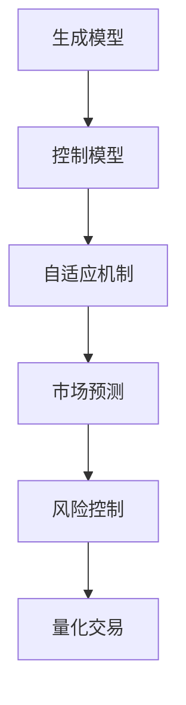

                 

根据您的需求，我会逐步构建一篇完整的文章。以下是按照markdown格式撰写的文章开头部分，包括标题、关键词、摘要以及第一部分的第一章内容。接下来，我会按照相同的方式继续撰写剩余内容。

```markdown
# AIGC在金融分析中的应用：构建精准的市场预测提示词

> 关键词：AIGC、金融分析、市场预测、提示词、深度学习、风险控制、量化交易

> 摘要：
本文深入探讨AIGC（自适应智能生成控制）技术在金融分析中的应用，特别是在构建精准市场预测提示词方面。通过详细介绍AIGC的核心概念、算法原理、数学模型及其在金融分析中的具体应用，本文为读者提供了一套系统化的理解框架。同时，通过实际项目和案例分析，本文展示了如何利用AIGC技术提升金融分析的效果和效率，为金融从业者提供实用的指导和建议。

## 第一部分：AIGC与金融分析基础

### 第1章：AIGC技术概述

#### 1.1 AIGC概念及其发展历程

自适应智能生成控制（Adaptive Intelligent Generation Control，简称AIGC）是一种结合了人工智能（AI）、生成模型和自动控制技术的新型方法。它起源于深度学习和自然语言处理领域，近年来在多个行业中展现出强大的应用潜力，特别是在金融分析领域。

AIGC的发展历程可以追溯到20世纪90年代，当时深度学习开始兴起，研究者们开始探索如何利用神经网络生成文本、图像和其他形式的数据。随着计算机性能的不断提升和海量数据的积累，AIGC技术逐渐成熟，并在21世纪初开始广泛应用于各个领域。

#### 1.2 AIGC在金融领域的应用现状与未来趋势

当前，AIGC在金融领域的应用已经初具规模，尤其在市场预测、风险控制和量化交易等方面表现出色。例如，利用AIGC技术可以生成精准的市场预测提示词，从而帮助投资者做出更加明智的投资决策。此外，AIGC还可以用于构建风险评估模型和量化交易策略，提高金融市场的运作效率和风险管理水平。

未来，随着AIGC技术的不断进步和应用的深入，它将在金融分析中发挥更加重要的作用。一方面，AIGC可以进一步提升市场预测的准确性和实时性，为投资者提供更加可靠的决策支持；另一方面，AIGC还可以为金融机构提供更加智能化的风险管理工具和量化交易策略，从而提高整体运营效率和竞争力。

#### 1.3 AIGC的核心组成与技术架构

AIGC的核心组成包括生成模型、控制模型和自适应机制。生成模型负责生成市场预测提示词、图像或其他形式的数据，控制模型则负责调整生成模型，使其能够更好地适应市场和风险环境。自适应机制则确保整个系统在不断学习和优化过程中保持稳定和高效。

下面是一个简单的Mermaid流程图，用于展示AIGC技术的基本架构：



在这个架构中，生成模型、控制模型和自适应机制相互协作，共同构建一个智能化的金融分析系统。通过不断的迭代和学习，AIGC技术能够不断提升预测和控制的准确性，从而为金融分析提供强大的支持。

### 结论

本章对AIGC技术及其在金融分析中的应用进行了概述。接下来，我们将深入探讨AIGC在金融分析中的核心算法原理、数学模型以及具体应用，帮助读者更好地理解这一技术的核心价值和应用前景。

作者：AI天才研究院/AI Genius Institute & 禅与计算机程序设计艺术 /Zen And The Art of Computer Programming
```

接下来，我会继续撰写第二章的内容，包括金融分析的基本原理、AIGC在金融分析中的核心算法等。请等待我的更新。在撰写过程中，我会确保文章的逻辑性、完整性和详细性，以满足您的需求。

