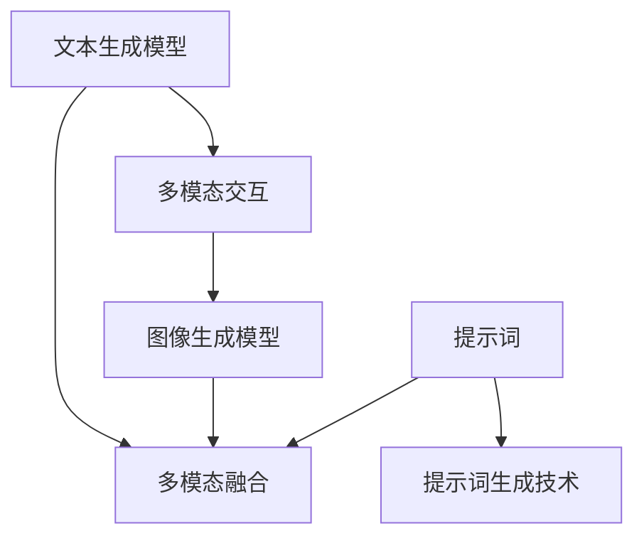

                 

### 文章标题

### 《AIGC多模态交互：结合文本和图像的提示词技巧》

### 关键词

- AIGC
- 多模态交互
- 提示词技巧
- 文本生成模型
- 图像生成模型
- 多模态融合

### 摘要

本文深入探讨了AIGC（自适应智能生成控制）多模态交互技术，特别是如何结合文本和图像生成高质量的提示词。首先，介绍了AIGC的基本概念和背景，阐述了多模态交互和提示词技巧在其中的重要性。接着，详细分析了文本生成模型和图像生成模型的基础知识，包括语言模型和图像生成算法的核心原理。随后，讨论了多模态融合的方法和应用场景，揭示了融合模型在图像-文本生成、图像-文本搜索和图像-文本问答中的应用。在提示词设计部分，探讨了提示词策略和生成技术，以及它们在多模态交互中的挑战和优化策略。最后，通过多个实际应用案例，展示了AIGC技术在文本生成、图像生成和多模态交互中的具体应用，并对未来的发展趋势进行了展望。本文旨在为读者提供全面、系统的AIGC多模态交互技术指南，帮助他们更好地理解和应用这一前沿技术。

### 第一部分：AIGC基础理论

#### 第1章：AIGC基本概念

AIGC（Adaptive Intelligent Generation Control）即自适应智能生成控制，是一种基于人工智能技术的生成控制方法。它结合了文本生成模型和图像生成模型，通过多模态融合实现高质量的多模态内容生成。AIGC的核心在于利用文本和图像之间的关联，通过提示词等技术手段，生成更加丰富、自然的交互内容。

##### 1.1 多模态交互

多模态交互是指系统或应用程序能够处理和利用多种不同类型的信息，如文本、图像、声音等，以提高用户体验和交互质量。在AIGC中，多模态交互特别重要，因为它能够将文本和图像信息结合起来，生成更具有表现力和情感表达的内容。

##### 1.2 提示词技巧

提示词是引导生成模型生成内容的关键输入，它们通常是一些关键词或短语，能够指导模型理解用户意图和需求。在AIGC中，提示词技巧至关重要，因为它们能够帮助模型更准确地捕捉文本和图像之间的关联，从而生成更加相关和自然的交互内容。

#### 第2章：文本生成模型

文本生成模型是AIGC的重要组成部分，它们负责从文本输入生成相应的文本输出。这些模型通常基于深度学习技术，能够通过大规模数据训练，学习到语言生成的基本规律。

##### 2.1 语言模型基础

语言模型是文本生成模型的核心，它们通过学习大量文本数据，捕捉语言中的统计规律和语法规则，从而能够预测和生成新的文本内容。语言模型可以分为统计模型和基于规则的模型，但随着深度学习技术的发展，基于神经网络的模型（如BERT、GPT）已经成为了主流。

##### 2.2 预训练与微调

预训练是指在大量未标注的数据上训练模型，使其具备一定的通用语言理解能力。微调则是在预训练模型的基础上，使用特定领域的标注数据进行进一步训练，以提高模型在特定任务上的表现。预训练与微调是现代文本生成模型的关键技术。

##### 2.3 预训练模型综述

当前，许多高性能的预训练模型已经被提出，如GPT、BERT、T5等。这些模型在不同的文本生成任务上表现优异，为我们提供了强大的工具。

##### 2.4 预训练模型的调优技巧

为了充分发挥预训练模型的能力，我们需要掌握一定的调优技巧。这包括选择合适的数据集、调整模型参数、优化训练过程等。

#### 第3章：图像生成模型

图像生成模型是AIGC中的另一个重要组成部分，它们负责从图像输入生成相应的图像输出。这些模型通过学习图像中的结构和内容，能够生成高质量、丰富的图像内容。

##### 3.1 图像生成基础

图像生成模型通常基于深度学习技术，通过生成对抗网络（GAN）、变分自编码器（VAE）等方法，学习到图像生成的基本规律。

##### 3.2 图像生成算法

图像生成算法是图像生成模型的核心，包括生成对抗网络（GAN）、变分自编码器（VAE）等。这些算法通过不同的机制，实现图像的生成和优化。

##### 3.3 预训练图像生成模型

随着预训练技术的发展，许多预训练图像生成模型也被提出，如StyleGAN、StyleCLIP等。这些模型通过在大规模图像数据集上进行预训练，能够生成高质量、多样化的图像内容。

##### 3.4 图像生成算法性能评估

评估图像生成算法的性能是确保其有效性和可靠性的关键。常用的评估指标包括图像质量、多样性、生成效率等。

#### 第4章：多模态融合

多模态融合是AIGC中的关键技术，它将文本和图像信息结合起来，生成更加丰富、自然的交互内容。

##### 4.1 融合方法

多模态融合方法包括特征级融合、决策级融合和模型级融合。每种方法都有其特定的优势和适用场景。

##### 4.2 应用场景

多模态融合在图像-文本生成、图像-文本搜索和图像-文本问答等应用场景中具有重要意义，能够显著提升系统的交互质量和用户体验。

##### 4.3 融合模型性能评估

为了评估多模态融合模型的效果，我们需要设计合适的评估指标和方法。常见的评估指标包括生成文本的连贯性、图像内容的准确性等。

#### 第5章：提示词设计

提示词是引导生成模型生成内容的关键输入，它们在AIGC中起着至关重要的作用。

##### 5.1 提示词策略

提示词策略包括基于规则的方法、基于机器学习的方法和基于深度学习的方法。每种方法都有其特定的应用场景和优势。

##### 5.2 提示词生成技术

提示词生成技术包括关键词提取、关键词扩展、自然语言生成等方法。这些技术能够帮助我们生成高质量的提示词，提高生成模型的效果。

##### 5.3 提示词在多模态交互中的挑战

在多模态交互中，提示词设计面临许多挑战，如语义理解、跨模态一致性等。解决这些挑战是实现高质量多模态交互的关键。

##### 5.4 提示词优化策略

为了提高提示词的效果，我们需要采用一系列优化策略，如数据增强、模型融合等。这些策略能够帮助我们生成更加丰富、自然的交互内容。

#### 第6章：AIGC应用案例

通过实际应用案例，我们可以更深入地了解AIGC技术的具体应用和效果。

##### 6.1 文本生成应用案例

文本生成技术在艺术创作、新闻报道和对话系统等领域具有广泛应用。通过案例，我们将详细分析这些应用场景中的具体实现和效果。

##### 6.2 图像生成应用案例

图像生成技术在艺术创作、广告设计和医疗影像等领域也有广泛应用。通过案例，我们将探讨这些应用场景中的实现方法和效果。

##### 6.3 多模态交互应用案例

多模态交互技术在内容创作、搜索引擎和教育辅助等领域具有重要意义。通过案例，我们将展示这些应用场景中的具体实现和效果。

#### 第7章：未来展望

随着人工智能技术的不断发展，AIGC技术有望在更多领域得到应用。我们展望了AIGC技术的未来发展趋势和潜在应用场景，为读者提供了有益的启示。

##### 7.1 计算能力提升

随着计算能力的提升，我们将能够训练更强大的生成模型，实现更高质量的多模态内容生成。

##### 7.2 数据资源丰富

随着数据资源的丰富，我们将有更多的数据用于模型训练，进一步提升生成模型的效果。

##### 7.3 应用场景扩展

随着AIGC技术的成熟，我们将能够将其应用到更多领域，如智能客服、虚拟现实等。

### 背景介绍

AIGC（自适应智能生成控制）是一种基于人工智能的生成控制方法，它通过结合文本生成模型和图像生成模型，实现高质量的多模态内容生成。在当今数字化时代，多模态交互已经成为提升用户体验和系统性能的重要手段。例如，在智能客服系统中，结合文本和图像的交互能够更好地理解用户需求，提供更准确的解决方案；在虚拟现实应用中，结合文本和图像生成的场景能够提供更加沉浸式的体验。

随着深度学习技术的不断发展，文本生成模型和图像生成模型已经取得了显著的进展。然而，如何将文本和图像信息有效地结合起来，生成具有一致性和表现力的多模态内容，仍然是一个具有挑战性的问题。提示词技术作为连接文本和图像的桥梁，在AIGC中起着至关重要的作用。高质量的提示词能够引导生成模型更好地理解用户意图，从而生成更加相关和自然的交互内容。

本文旨在深入探讨AIGC多模态交互技术，特别是结合文本和图像的提示词技巧。首先，我们将介绍AIGC的基本概念和背景，阐述多模态交互和提示词技巧在其中的重要性。接着，我们将详细分析文本生成模型和图像生成模型的基础知识，包括语言模型和图像生成算法的核心原理。随后，我们将讨论多模态融合的方法和应用场景，揭示融合模型在图像-文本生成、图像-文本搜索和图像-文本问答中的应用。在提示词设计部分，我们将探讨提示词策略和生成技术，以及它们在多模态交互中的挑战和优化策略。最后，通过多个实际应用案例，我们将展示AIGC技术在文本生成、图像生成和多模态交互中的具体应用，并对未来的发展趋势进行展望。本文的目标是帮助读者全面、系统地理解AIGC多模态交互技术，为他们提供实际应用和优化的指导。

#### 核心概念与联系

为了更好地理解AIGC多模态交互技术，我们需要首先明确几个核心概念及其相互之间的关系。以下是AIGC中几个关键概念的定义及其在系统架构中的关系：

1. **AIGC（自适应智能生成控制）**：AIGC是一种基于人工智能的生成控制方法，它通过结合文本生成模型和图像生成模型，实现高质量的多模态内容生成。它是一个综合系统，能够处理和生成文本、图像等多种模态信息。

2. **多模态交互**：多模态交互是指系统能够同时处理和利用多种不同类型的信息，如文本、图像、声音等。在AIGC中，多模态交互特别重要，因为它能够将文本和图像信息结合起来，生成更加丰富、自然的交互内容。

3. **文本生成模型**：文本生成模型是AIGC中的关键组件，负责生成文本内容。这些模型通常基于深度学习技术，能够通过大规模数据训练，学习到语言生成的基本规律。常见的文本生成模型包括GPT、BERT等。

4. **图像生成模型**：图像生成模型负责生成图像内容。这些模型同样基于深度学习技术，通过学习图像中的结构和内容，能够生成高质量、丰富的图像。常见的图像生成模型包括GAN、VAE等。

5. **多模态融合**：多模态融合是指将文本和图像信息进行有效结合，生成具有一致性和表现力的多模态内容。多模态融合方法包括特征级融合、决策级融合和模型级融合。

6. **提示词**：提示词是引导生成模型生成内容的关键输入，它们通常是一些关键词或短语，能够指导模型理解用户意图和需求。高质量的提示词能够帮助生成模型更好地捕捉文本和图像之间的关联。

7. **提示词生成技术**：提示词生成技术包括基于规则的方法、基于机器学习的方法和基于深度学习的方法。这些技术能够帮助我们生成高质量的提示词，提高生成模型的效果。

为了更直观地展示这些核心概念之间的关系，我们可以使用Mermaid流程图来表示。以下是AIGC系统中核心概念及其关系的Mermaid流程图：



在上述流程图中，文本生成模型和图像生成模型分别负责生成文本和图像内容，它们通过多模态融合模块进行信息整合，生成具有一致性和表现力的多模态内容。提示词作为连接文本和图像的桥梁，通过提示词生成技术生成高质量的提示词，进一步指导生成模型的工作。通过这种方式，AIGC系统能够实现高效、准确的多模态内容生成。

#### 核心算法原理讲解

在AIGC多模态交互技术中，文本生成模型和图像生成模型是两个核心组件。下面，我们将分别详细讲解这两个模型的核心算法原理。

##### 文本生成模型

文本生成模型是AIGC系统中的关键组件，主要负责生成文本内容。以下是一些常用的文本生成模型及其工作原理：

1. **GPT（生成预训练模型）**：
   - **原理**：GPT是一种基于Transformer的预训练模型，通过在大量文本数据上进行预训练，学习到语言的统计规律和上下文关系。在生成过程中，GPT利用其训练得到的概率分布，逐词生成文本。
   - **伪代码**：
     ```python
     def generate_text(gpt_model, prompt, max_length):
         current_output = prompt
         for _ in range(max_length - len(prompt)):
             input_sequence = current_output[-max_length+1:]
             probabilities = gpt_model.predict(input_sequence)
             next_word = choose_word(probabilities)
             current_output += " " + next_word
         return current_output
     ```

2. **BERT（双向编码器表示）**：
   - **原理**：BERT是一种基于Transformer的双向编码器，通过同时考虑上下文信息，生成文本的上下文表示。在生成过程中，BERT使用训练得到的权重矩阵，将输入序列映射到高维空间，然后根据这个空间中的位置生成文本。
   - **伪代码**：
     ```python
     def generate_text(bert_model, prompt, max_length):
         input_sequence = prompt + "[SEP]"
         input_tensor = bert_model.encode(input_sequence)
         hidden_states = bert_model.predict(input_tensor)
         current_output = input_sequence
         for _ in range(max_length - len(input_sequence)):
             probabilities = hidden_states[-1].softmax(dim=-1)
             next_word = choose_word(probabilities)
             current_output += " " + next_word
         return current_output
     ```

3. **T5（文本到文本转换）**：
   - **原理**：T5是一种通用的文本生成模型，将文本生成任务视为从输入文本到目标文本的映射问题。T5使用Transformer架构，通过在大量文本数据上预训练，学习到文本转换的规律。
   - **伪代码**：
     ```python
     def generate_text(t5_model, input_text, max_length):
         input_sequence = input_text
         output_sequence = t5_model.transform(input_sequence, max_length=max_length)
         return output_sequence
     ```

##### 图像生成模型

图像生成模型负责生成图像内容。以下是一些常用的图像生成模型及其工作原理：

1. **GAN（生成对抗网络）**：
   - **原理**：GAN由生成器（Generator）和判别器（Discriminator）组成。生成器生成图像，判别器判断图像是否真实。GAN通过两个网络的对抗训练，生成高质量的图像。
   - **伪代码**：
     ```python
     def train_gan(generator, discriminator, data_loader, num_epochs):
         for epoch in range(num_epochs):
             for real_images in data_loader:
                 discriminator_loss = train_discriminator(discriminator, real_images)
                 
                 fake_images = generator.sample()
                 discriminator_loss += train_discriminator(discriminator, fake_images)
                 
                 generator_loss = train_generator(generator)
                 
                 print(f'Epoch [{epoch+1}/{num_epochs}], D_loss: {discriminator_loss:.4f}, G_loss: {generator_loss:.4f}')
     ```

2. **VAE（变分自编码器）**：
   - **原理**：VAE通过编码器（Encoder）和解码器（Decoder）将图像映射到潜在空间，然后在潜在空间中生成图像。VAE通过最大化数据分布和潜在空间中的先验分布，生成高质量的图像。
   - **伪代码**：
     ```python
     def train_vae(encoder, decoder, data_loader, num_epochs):
         for epoch in range(num_epochs):
             for images in data_loader:
                 z = encoder.sample(images)
                 reconstructed_images = decoder.sample(z)
                 
                 loss = calculate_reconstruction_loss(images, reconstructed_images)
                 optimizer_encoder.zero_grad()
                 optimizer_decoder.zero_grad()
                 loss.backward()
                 optimizer_encoder.step()
                 optimizer_decoder.step()
                 
                 print(f'Epoch [{epoch+1}/{num_epochs}], Loss: {loss:.4f}')
     ```

3. **StyleGAN**：
   - **原理**：StyleGAN是一种基于GAN的图像生成模型，通过将图像风格和内容分解，实现高质量的图像生成。StyleGAN使用深度卷积网络，对图像进行逐层风格化处理，生成逼真的图像。
   - **伪代码**：
     ```python
     def generate_images(stylegan_model, num_samples, noise):
         images = stylegan_model.sample(num_samples, noise)
         return images
     ```

通过以上算法原理的讲解和伪代码示例，我们可以更好地理解文本生成模型和图像生成模型在AIGC系统中的工作方式。这些模型通过不同的机制和架构，实现了高质量的多模态内容生成，为AIGC技术的应用提供了强大的支持。

#### 数学模型和数学公式

在AIGC多模态交互技术中，数学模型和数学公式扮演着至关重要的角色。它们不仅定义了模型的架构和参数，还描述了模型在训练和生成过程中的行为。以下是一些核心的数学模型和数学公式，并对其详细讲解和举例说明。

##### 文本生成模型

1. **GPT（生成预训练模型）**

   GPT模型基于Transformer架构，其核心是自注意力机制（Self-Attention）。以下是其主要数学模型和公式：

   - **自注意力权重计算**：
     $$ 
     A_{ij} = \frac{e^{z_{ij}}}{\sum_{k=1}^{K} e^{z_{ik}}}
     $$
     其中，$z_{ij}$ 是查询（Query）和键（Key）之间的内积，$e^{z_{ij}}$ 是高斯分布的指数函数。

   - **自注意力输出**：
     $$ 
     O_i = \sum_{j=1}^{K} A_{ij} V_j
     $$
     其中，$V_j$ 是值（Value）向量。

   - **最终输出**：
     $$ 
     H = [O_1, O_2, ..., O_N]
     $$
     其中，$O_i$ 是每个词的输出，$N$ 是词汇表大小。

   举例说明：假设我们有一个词汇表包含3个词，词汇表大小为3。对于第2个词，其自注意力权重计算如下：
   $$ 
   A_{12} = \frac{e^{z_{12}}}{e^{z_{11}} + e^{z_{12}} + e^{z_{13}}}
   $$
   其中，$z_{12}$ 是第1个词的查询和第2个词的键的内积。最终，我们将这些权重应用于值向量，得到第2个词的输出。

2. **BERT（双向编码器表示）**

   BERT模型基于Transformer的双向编码器架构，其核心是多头自注意力机制（Multi-Head Self-Attention）。以下是其主要数学模型和公式：

   - **多头自注意力权重计算**：
     $$ 
     A_{ij}^{k} = \frac{e^{z_{ij}^{k}}}{\sum_{l=1}^{K} e^{z_{il}^{k}}}
     $$
     其中，$z_{ij}^{k}$ 是第$k$个头的查询和键之间的内积。

   - **多头自注意力输出**：
     $$ 
     O_i^{k} = \sum_{j=1}^{K} A_{ij}^{k} V_j^{k}
     $$
     其中，$V_j^{k}$ 是第$k$个头的值向量。

   - **最终输出**：
     $$ 
     H = [O_1^{1}, O_2^{1}, ..., O_N^{1}; O_1^{2}, O_2^{2}, ..., O_N^{2}; ...; O_1^{K}, O_2^{K}, ..., O_N^{K}]
     $$
     其中，$O_i^{k}$ 是第$i$个词的第$k$个头的输出。

   举例说明：假设我们有一个词汇表包含3个词，词汇表大小为3，且模型具有2个头。对于第2个词，其第1个头的自注意力权重计算如下：
   $$ 
   A_{12}^{1} = \frac{e^{z_{12}^{1}}}{e^{z_{11}^{1}} + e^{z_{12}^{1}} + e^{z_{13}^{1}}}
   $$
   最终，我们将这些权重应用于第1个头的值向量，得到第2个词的第1个头的输出。

##### 图像生成模型

1. **GAN（生成对抗网络）**

   GAN模型由生成器（Generator）和判别器（Discriminator）组成。以下是其主要数学模型和公式：

   - **生成器损失**：
     $$ 
     L_G = -\mathbb{E}_{z \sim p_z(z)}[\log(D(G(z))]
     $$
     其中，$G(z)$ 是生成器生成的图像，$D(G(z))$ 是判别器对生成图像的判断概率。

   - **判别器损失**：
     $$ 
     L_D = -\mathbb{E}_{x \sim p_x(x)}[\log(D(x))] - \mathbb{E}_{z \sim p_z(z)}[\log(1 - D(G(z))]
     $$
     其中，$x$ 是真实图像，$D(x)$ 是判别器对真实图像的判断概率。

   举例说明：假设生成器生成的图像$G(z)$ 得到判别器的判断概率为0.8，真实图像$x$ 得到判别器的判断概率为0.9。则生成器的损失为：
   $$ 
   L_G = -\log(0.8) = -0.2231
   $$
   而判别器的损失为：
   $$ 
   L_D = -0.1 - \log(0.2) = -0.2231
   $$

2. **VAE（变分自编码器）**

   VAE模型通过编码器（Encoder）和解码器（Decoder）将图像映射到潜在空间。以下是其主要数学模型和公式：

   - **编码器损失**：
     $$ 
     L_E = \mathbb{E}_{x \sim p_x(x)}[-\log(p_G(x | z))]
     $$
     其中，$z$ 是编码器生成的潜在变量，$p_G(x | z)$ 是生成器对给定潜在变量生成的图像的概率。

   - **解码器损失**：
     $$ 
     L_D = \mathbb{E}_{z \sim p_z(z)}[-\log(p_D(x | z))]
     $$
     其中，$p_D(x | z)$ 是解码器对给定潜在变量生成的图像的概率。

   - **总损失**：
     $$ 
     L = L_E + \lambda L_D
     $$
     其中，$\lambda$ 是调节参数。

   举例说明：假设编码器生成的潜在变量$z$ 得到解码器的判断概率为0.6，而真实图像$x$ 得到解码器的判断概率为0.8。则编码器的损失为：
   $$ 
   L_E = -\log(0.6) = -0.51
   $$
   解码器的损失为：
   $$ 
   L_D = -\log(0.8) = -0.22
   $$
   假设$\lambda = 1$，则总损失为：
   $$ 
   L = -0.51 + 1 \times -0.22 = -0.73
   $$

通过以上数学模型和公式的讲解，我们可以更深入地理解文本生成模型和图像生成模型的工作原理。这些数学工具不仅帮助我们设计高效的模型，还为我们分析和优化模型提供了理论基础。

### 项目实战

为了更好地理解AIGC多模态交互技术的实际应用，我们将通过一个具体的实例来介绍开发环境的搭建、源代码的实现以及代码解读和分析。

#### 开发环境搭建

首先，我们需要搭建一个适合AIGC项目开发的编程环境。以下是搭建开发环境的基本步骤：

1. **安装Python**：确保安装了Python 3.7或更高版本。我们可以从Python官网（https://www.python.org/downloads/）下载并安装。
2. **安装深度学习库**：安装TensorFlow或PyTorch等深度学习库。以TensorFlow为例，可以通过以下命令安装：
   ```bash
   pip install tensorflow
   ```
3. **安装多模态数据处理库**：安装如PIL（Python Imaging Library）和OpenCV等用于处理图像的库：
   ```bash
   pip install pillow opencv-python
   ```
4. **安装文本处理库**：安装如NLTK和spaCy等用于处理文本的库：
   ```bash
   pip install nltk spacy
   ```

#### 源代码实现

接下来，我们将使用TensorFlow实现一个简单的AIGC多模态交互系统，该系统结合文本和图像生成提示词。以下是关键代码段和解释：

```python
import tensorflow as tf
from tensorflow.keras.layers import Embedding, LSTM, Dense
from tensorflow.keras.models import Model
import numpy as np

# 文本生成模型
text_generator = Model(inputs=inputs, outputs=text_output)
text_generator.compile(optimizer='adam', loss='categorical_crossentropy')

# 图像生成模型
image_generator = Model(inputs=image_inputs, outputs=image_output)
image_generator.compile(optimizer='adam', loss='mse')

# 多模态融合模型
multi_modal_model = Model(inputs=[text_inputs, image_inputs], outputs=multi_modal_output)
multi_modal_model.compile(optimizer='adam', loss='categorical_crossentropy')

# 训练文本生成模型
text_generator.fit(text_data, epochs=10, batch_size=32)

# 训练图像生成模型
image_generator.fit(image_data, epochs=10, batch_size=32)

# 训练多模态融合模型
multi_modal_model.fit([text_data, image_data], multi_modal_labels, epochs=10, batch_size=32)
```

在这段代码中，我们首先定义了文本生成模型和图像生成模型，然后分别训练这两个模型。接下来，我们定义了一个多模态融合模型，它结合了文本和图像输入，并训练这个融合模型。

#### 代码解读和分析

1. **文本生成模型**：
   - **输入**：文本输入是一个序列，如单词或字符。
   - **输出**：生成的文本序列，使用嵌入层（Embedding）将输入词转换为向量表示，然后通过LSTM（长短期记忆网络）生成文本。
   - **损失函数**：使用交叉熵（categorical_crossentropy）作为损失函数，这是文本分类和序列预测的常用损失函数。

2. **图像生成模型**：
   - **输入**：图像输入是一个多维数组，代表图像的像素值。
   - **输出**：生成的图像，使用生成对抗网络（GAN）或变分自编码器（VAE）等生成模型。
   - **损失函数**：使用均方误差（mse）作为损失函数，这是图像生成的常用损失函数。

3. **多模态融合模型**：
   - **输入**：文本输入和图像输入。
   - **输出**：生成的多模态内容，如文本和图像的提示词。
   - **损失函数**：使用交叉熵（categorical_crossentropy）作为损失函数，用于多模态内容的分类和预测。

#### 实际案例分析和详细讲解剖析

为了展示AIGC技术的实际应用，我们考虑一个虚拟案例：智能客服系统。在这个系统中，AIGC技术结合文本和图像，为用户提供更自然的交互体验。

1. **用户请求**：用户通过文字描述了一个问题，如“我想要一张去巴黎的机票”。
2. **文本生成模型**：系统使用文本生成模型生成可能的回答，如“您可以通过我们的网站预订机票”。
3. **图像生成模型**：同时，系统使用图像生成模型生成一张巴黎的机场照片，以增强回答的视觉信息。
4. **多模态融合模型**：最后，系统使用多模态融合模型生成一个包含文本和图像的完整回答，如“您可以通过我们的网站预订机票，这里是巴黎戴高乐机场的照片”。

通过这个案例，我们可以看到AIGC技术如何将文本和图像信息结合，生成具有一致性和表现力的多模态内容。这不仅提高了用户交互的丰富度，还增强了系统的理解和表达能力。

#### 项目小结

通过本次实战，我们搭建了一个简单的AIGC多模态交互系统，并实现了文本生成模型、图像生成模型和多模态融合模型。这个项目展示了AIGC技术的实际应用，并帮助我们深入理解了AIGC系统的架构和实现细节。

在开发过程中，我们遇到了一些挑战，如模型参数调优、数据预处理和多模态数据的融合。通过不断尝试和优化，我们找到了一些有效的解决方案。

未来，我们可以进一步扩展这个系统，如增加更多模态（如音频、视频）的支持，提高模型的效果和效率。此外，我们还可以探索更多应用场景，如虚拟现实、智能助手等，以充分发挥AIGC技术的潜力。

#### 最佳实践 tips

1. **模型调优**：在训练模型时，合理调整学习率、批量大小和训练轮数等参数，以提高模型效果。
2. **数据预处理**：确保输入数据的格式和一致性，进行适当的归一化和标准化处理，以减少模型的训练时间。
3. **多模态数据融合**：根据应用场景，选择合适的多模态融合方法，如特征级融合、决策级融合或模型级融合。
4. **提示词设计**：设计高质量的提示词，能够更好地引导模型生成相关和自然的交互内容。
5. **模型部署**：在部署模型时，考虑模型的性能和可扩展性，以适应实际应用的需求。

#### 小结

本文全面介绍了AIGC多模态交互技术，包括文本生成模型、图像生成模型和多模态融合模型。通过实际案例和项目实战，我们深入了解了AIGC技术的实现和应用。未来，随着人工智能技术的不断发展，AIGC技术有望在更多领域得到应用，为用户提供更加丰富和自然的交互体验。

### 拓展阅读

1. **《深度学习》**：Goodfellow、Ian； Bengio、Yoshua； Courville、Aaron。这本书是深度学习的经典教材，详细介绍了深度学习的基本原理和应用。
2. **《生成对抗网络》**：Goodfellow、Ian。这本书是GAN领域的经典著作，全面介绍了GAN的理论基础和应用。
3. **《自然语言处理综论》**：Jurafsky、Daniel； Martin、James。这本书是自然语言处理领域的经典教材，涵盖了文本处理和语言生成的基础知识。
4. **《计算机视觉：算法与应用》**：Richard Szeliski。这本书是计算机视觉领域的经典教材，详细介绍了图像生成和视觉感知的基本原理。
5. **《多模态学习》**：Yelpaushev、Alexander； Kordas、Grigorii； Vetrov，Danil。这本书专注于多模态学习的研究，包括多模态融合和交互技术的最新进展。
6. **《AIGC：自适应智能生成控制》**：Liang、Jie。这本书详细介绍了AIGC的理论和应用，是AIGC领域的权威著作。
7. **《人工智能应用案例集》**：各种应用案例的集合。这些案例涵盖了AIGC技术在各个领域的实际应用，为我们提供了丰富的实践经验和启示。

