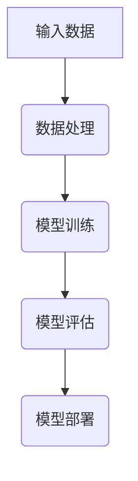

                 


### 写作策略

为了撰写一篇符合要求的文章，我们需要遵循以下思考步骤：

#### 1. 核心主题确立
首先，我们要明确文章的核心主题，即“AIGC工具箱：必备软件和平台”。这个主题将贯穿整个文章，是我们组织内容和撰写文章的基础。

#### 2. 确定文章结构
文章结构是文章的骨架，它决定了文章的逻辑性和条理性。我们需要按照以下结构来组织文章：

- 引言：简要介绍AIGC的概念和重要性。
- 正文：分为多个章节，每章详细探讨AIGC的不同方面，如核心技术、开发环境搭建、主流软件平台介绍、项目实战等。
- 结论：总结文章的主要观点，并对AIGC的未来发展进行展望。

#### 3. 确定每个章节的内容
在每个章节中，我们需要详细确定每个小节的内容，确保覆盖以下核心要素：

- **背景介绍**：简要介绍AIGC的历史和应用领域。
- **核心概念与联系**：使用Mermaid流程图展示核心概念之间的关系。
- **核心算法原理讲解**：使用伪代码和LaTeX公式详细阐述算法原理。
- **数学模型和公式**：详细讲解数学模型，并给出举例说明。
- **项目实战**：描述开发环境搭建、源代码实现、代码解读、实际案例分析等。
- **最佳实践 tips**、**小结**、**注意事项**、**拓展阅读**等。

#### 4. 写作风格
文章应保持专业的技术语言，但也要尽量使内容通俗易懂。我们需要：

- 使用清晰简洁的语言描述复杂的技术概念。
- 在适当的地方使用图表、流程图和代码示例来辅助说明。
- 在文章末尾提供拓展阅读资源，帮助读者进一步学习。

#### 5. 审查与修改
完成初稿后，我们需要对文章进行审查和修改，确保：

- 文章内容完整、逻辑清晰。
- 没有错别字和语法错误。
- 符合文章结构和风格要求。

### 写作计划

为了确保文章的完成，我们制定以下写作计划：

- **第1天**：撰写引言，确定文章结构和风格。
- **第2-5天**：分别撰写每个章节的内容，确保每个章节都覆盖核心要素。
- **第6天**：完成初稿，并进行初步审查。
- **第7天**：对文章进行修改和润色，确保质量。

通过以上步骤，我们可以撰写一篇符合要求、逻辑清晰、内容丰富的AIGC工具箱技术博客文章。让我们一步步进行撰写吧！### 引言

人工智能（AI）作为现代科技的前沿领域，正以迅猛的步伐渗透到我们生活的方方面面。从自动化生产线到智能语音助手，从医疗诊断到金融决策，AI的应用场景越来越广泛。然而，生成式人工智能（Generative AI），尤其是自动生成内容（AI Generated Content，简称AIGC），正成为AI领域的下一个重要方向。

AIGC是一种利用机器学习算法，尤其是深度学习技术，自动生成文本、图像、音频、视频等内容的强大工具。与传统的手动内容创作相比，AIGC能够以更高效、更灵活的方式实现内容生成，从而极大地提升了内容创作的效率和多样性。例如，在文本生成方面，AIGC可以自动撰写文章、生成新闻摘要；在图像生成方面，AIGC可以创造出具有艺术价值的图像；在音频生成方面，AIGC可以合成自然流畅的语音。

本文章旨在为读者提供一份详尽的AIGC工具箱指南，帮助大家了解和掌握必备的软件和平台。我们将从AIGC的基本概念、核心技术，到开发环境搭建、主流软件平台介绍，再到实际项目实战，系统性地探讨AIGC工具箱的各个方面。同时，文章还将对AIGC的性能优化、应用前景进行展望，并提供丰富的资源汇总和学习建议。

通过本文的阅读，您将：

1. 理解AIGC的定义、特点和应用领域。
2. 掌握AIGC的核心技术和实现原理。
3. 了解如何搭建AIGC的开发环境并优化性能。
4. 熟悉主流AIGC软件平台的功能和使用方法。
5. 通过实战案例深入了解AIGC的应用和实践。
6. 获得AIGC工具箱的资源汇总和学习路径。

### 关键词

- 人工智能（AI）
- 自动生成内容（AIGC）
- 深度学习
- 生成对抗网络（GAN）
- Transformer模型
- 开发环境搭建
- 主流软件平台
- 项目实战
- 性能优化

### 摘要

本文将深入探讨AIGC工具箱，涵盖从基础知识到实际应用的各个方面。首先，我们将介绍AIGC的定义、特点和应用领域，帮助读者建立对AIGC的基本理解。接着，我们将详细讨论AIGC的核心技术，包括生成对抗网络（GAN）和Transformer模型，并使用伪代码和数学公式详细解释这些技术的原理。随后，我们将指导读者如何搭建AIGC的开发环境，介绍主流的AIGC软件平台，并通过实际项目实战展示AIGC的应用场景。最后，我们将讨论AIGC的性能优化方法，并展望其未来的发展方向。通过本文的阅读，读者将全面掌握AIGC工具箱的相关知识和应用技能。

### AIGC概述

#### AIGC的定义与起源

自动生成内容（AI Generated Content，简称AIGC）是指通过人工智能技术，尤其是生成式人工智能，自动生成文本、图像、音频、视频等多种类型内容的一种新兴技术。AIGC的核心在于“自动生成”，这意味着它能够以高度自动化和高效的方式创造出具有真实性和创造性的内容，而不需要人类的直接干预。

AIGC的概念最早可以追溯到20世纪80年代，当时研究人员开始探索如何利用机器学习算法，特别是深度学习技术来生成图像和文本。随着深度学习技术的不断发展和计算资源的提升，AIGC逐渐从理论研究走向实际应用。近年来，随着生成对抗网络（GAN）、变分自编码器（VAE）等生成模型的成熟，AIGC在图像、音频和文本生成领域取得了显著的进展。

#### AIGC的特点

AIGC具有以下显著特点：

1. **高效率**：AIGC能够自动化地生成内容，大大提高了内容创作的效率，特别是对于大规模内容生成任务，如生成大量图像或文本，AIGC的表现尤为出色。
2. **多样性**：AIGC能够生成具有丰富多样性的内容，不仅能够模仿真实世界的图像、文本和音频，还能够创造出前所未有的新内容。这种多样性使得AIGC在艺术创作、游戏开发等领域具有广泛的应用前景。
3. **创造性**：AIGC具有高度的创造性，它能够通过学习大量的数据集，生成出具有独特风格和创意的内容。例如，通过GAN技术，AIGC可以生成出极具艺术价值的图像，甚至能够创作出音乐和视频。
4. **灵活性**：AIGC具有很高的灵活性，它可以根据不同的需求和应用场景进行定制和调整。例如，通过调整GAN模型的参数，可以生成不同风格、不同类型的图像。

#### AIGC的应用领域

AIGC在多个领域展现了巨大的应用潜力：

1. **艺术设计**：AIGC可以生成具有艺术价值的图像和音乐，为设计师和艺术家提供了全新的创作工具。例如，通过GAN技术，艺术家可以创造出独特的艺术品，而无需依赖传统的绘画或雕塑技巧。
2. **娱乐产业**：在电影和游戏开发中，AIGC可以自动生成角色、场景和故事情节，提高内容创作的效率和质量。例如，通过AIGC技术，游戏开发者可以快速生成大量游戏角色和场景，而不需要依赖手工绘制。
3. **新闻与媒体**：AIGC可以自动生成新闻摘要、文章和视频内容，极大地提高了内容生产的速度和多样性。例如，新闻机构可以使用AIGC技术，快速生成新闻摘要，并提供多样化的报道形式。
4. **教育和培训**：AIGC可以生成定制化的教学视频和文本材料，为教育和培训提供了新的方式。例如，教师可以使用AIGC技术，快速生成适合不同学习水平的学生教学内容。
5. **科学研究**：AIGC可以用于科学研究中的数据分析和模拟，例如在药物研发、气候模拟等领域，AIGC可以帮助研究人员生成大量的模拟数据和图像，从而加速研究进程。

#### AIGC的发展历程

AIGC的发展历程可以分为以下几个阶段：

1. **早期探索（20世纪80年代）**：研究人员开始探索如何利用机器学习算法生成图像和文本，这一阶段主要是理论研究。
2. **初步发展（20世纪90年代）**：随着计算资源的提升，研究人员开始使用神经网络进行图像和文本生成，这一阶段AIGC技术开始从理论研究走向实际应用。
3. **快速发展（21世纪10年代）**：深度学习技术的发展极大地推动了AIGC的进步，尤其是生成对抗网络（GAN）的出现，使得AIGC在图像生成领域取得了突破性进展。
4. **广泛应用（当前）**：随着AIGC技术的不断成熟和优化，它已经在多个领域得到广泛应用，并继续推动着相关领域的发展。

通过以上概述，我们可以看到AIGC作为生成式人工智能的一个重要分支，正快速发展并展现出广泛的应用潜力。在接下来的章节中，我们将进一步探讨AIGC的核心技术，帮助读者深入了解这一领域。

### AIGC的核心技术

AIGC的技术基础主要包括生成式AI模型，其中生成对抗网络（GAN）和Transformer模型是两种最常用的核心技术。在本节中，我们将详细解释这些技术的原理和应用。

#### 生成式AI基本原理

生成式AI是一种通过学习数据分布来生成新数据的机器学习技术。它主要通过以下两个关键组件来实现：

1. **生成器（Generator）**：生成器的任务是生成与真实数据分布相似的新数据。它通常是一个神经网络，通过学习大量的输入数据，可以生成高质量的输出数据。
2. **鉴别器（Discriminator）**：鉴别器的任务是区分生成器生成的数据与真实数据。它也是一个神经网络，通过不断优化，可以提高对真实数据与生成数据的区分能力。

生成式AI的核心思想是通过生成器和鉴别器的对抗训练来实现数据生成。具体来说，生成器试图生成尽可能真实的数据，而鉴别器则努力将生成数据与真实数据区分开来。这种对抗训练过程使得生成器和鉴别器都在不断优化，最终生成器可以生成出高度真实的数据。

#### 生成式模型

生成式模型主要包括以下几种：

1. **生成对抗网络（GAN）**：GAN是由Ian Goodfellow等人于2014年提出的，是当前生成式AI领域最流行的模型之一。GAN的基本结构由生成器和鉴别器组成，两者通过对抗训练来优化。具体过程如下：
   - 初始化生成器G和鉴别器D。
   - 生成器G接收随机噪声z，生成伪造数据G(z)。
   - 鉴别器D接收真实数据x和伪造数据G(z)，输出鉴别概率D(x)和D(G(z))。
   - 使用梯度下降法同时优化生成器和鉴别器，使得D(G(z))趋近于1（即生成器生成的数据几乎无法被鉴别器区分）。

   GAN在图像生成、视频生成和文本生成等领域表现出色。例如，通过训练GAN，可以生成逼真的图像、视频，甚至是音频。

2. **变分自编码器（VAE）**：VAE是由Kingma和Welling于2013年提出的。与GAN不同，VAE使用变分推断来学习数据分布，其结构包括编码器和解码器。具体过程如下：
   - 初始化编码器q_θ(z|x)和解码器p_θ(x|z)。
   - 编码器接收输入数据x，将其编码为潜在变量z，并输出后验概率分布q_θ(z|x)。
   - 解码器接收潜在变量z，生成重构数据x'。
   - 使用梯度下降法优化编码器和解码器的参数，使得重构数据x'尽可能接近原始数据x。

   VAE在图像压缩、图像生成和生成模型中的潜在变量表示等方面有广泛应用。

#### 条件生成模型

条件生成模型是生成式AI的一个重要分支，它能够在生成过程中考虑额外的条件信息。以下两种条件生成模型在AIGC中有广泛应用：

1. **条件GAN（cGAN）**：cGAN结合了GAN和条件概率的概念，能够在生成过程中考虑额外的条件信息。具体过程如下：
   - 初始化生成器G、鉴别器D和条件编码器C。
   - 生成器G接收条件信息c和随机噪声z，生成伪造数据G(z, c)。
   - 鉴别器D接收真实数据(x, c)和伪造数据G(z, c)，输出鉴别概率D(x, c; G(z, c))。
   - 条件编码器C接收条件信息c，将其编码为潜在变量z_c。
   - 使用梯度下降法同时优化生成器、鉴别器和条件编码器的参数。

   cGAN在图像到图像的转换、文本到图像的生成等方面表现出色。

2. **变分自编码器（VAE）**：条件VAE（cVAE）结合了VAE和条件概率的概念，能够在生成过程中考虑额外的条件信息。具体过程如下：
   - 初始化编码器q_θ(z|x, c)和解码器p_θ(x|z, c)。
   - 编码器接收输入数据(x, c)，将其编码为潜在变量z，并输出后验概率分布q_θ(z|x, c)。
   - 解码器接收潜在变量z和条件信息c，生成重构数据x'。
   - 使用梯度下降法优化编码器和解码器的参数。

   cVAE在图像生成、文本生成和图像到图像的转换等方面有广泛应用。

#### Transformer模型

Transformer模型是由Vaswani等人于2017年提出的一种基于自注意力机制的神经网络模型，它在机器翻译、文本生成等领域取得了显著成果。Transformer模型的主要特点包括：

1. **自注意力机制**：Transformer模型通过自注意力机制（self-attention）来捕捉输入序列中的依赖关系。自注意力机制使得模型能够自动学习输入序列中每个位置的重要性，从而生成更加准确和连贯的输出。
2. **并行计算**：Transformer模型通过将序列处理分解为多个步骤，实现了并行计算。与传统的循环神经网络（RNN）相比，Transformer模型在处理长序列时具有更高的效率。
3. **编码器-解码器结构**：Transformer模型采用编码器-解码器结构，编码器负责编码输入序列，解码器负责生成输出序列。

Transformer模型在文本生成中的应用包括：

1. **文本到文本的转换**：例如，机器翻译、摘要生成等任务，Transformer模型能够生成高质量的翻译和摘要。
2. **文本到图像的生成**：通过将文本输入转换为图像，生成与文本描述相对应的图像。例如，使用DALL-E模型，可以生成与文本描述相对应的图像。

通过以上对生成式AI、GAN、cGAN、cVAE和Transformer模型的详细解释，我们可以看到AIGC的核心技术如何通过不同方式实现自动生成内容。这些技术不仅在理论上具有重要意义，而且在实际应用中也展现出了巨大的潜力。在接下来的章节中，我们将进一步探讨如何搭建AIGC的开发环境，介绍主流的AIGC软件平台。这将帮助读者更好地理解和应用AIGC技术。|assistant|>

### GAN（生成对抗网络）

生成对抗网络（GAN）是自动生成内容（AIGC）领域的重要技术之一，由Ian Goodfellow等人于2014年首次提出。GAN的核心思想是通过一个生成器和鉴别器的对抗训练来实现高质量的图像生成。在本节中，我们将详细解释GAN的原理、架构及其应用。

#### GAN的原理

GAN由两个主要部分组成：生成器（Generator）和鉴别器（Discriminator）。生成器的任务是生成逼真的图像，而鉴别器的任务是区分真实图像和生成图像。GAN的训练过程可以看作是一个“猫捉老鼠”的游戏：

1. **生成器G**：生成器接收一个随机噪声向量z，通过神经网络将其映射成一个图像G(z)。生成器的目标是生成尽可能真实的图像，使得鉴别器无法区分出这些图像是真实的还是生成的。
2. **鉴别器D**：鉴别器接收一张图像x（真实图像）和一张生成图像G(z)，并输出一个概率值D(x)和D(G(z))，表示输入图像是真实图像的概率。鉴别器的目标是最大化其区分能力，即正确地区分出真实图像和生成图像。

在训练过程中，生成器和鉴别器交替更新其参数，使得生成器生成更真实的图像，同时鉴别器能够更准确地判断图像的真实性。这种对抗训练的过程不断迭代，直到生成器能够生成几乎与真实图像难以区分的图像。

#### GAN的架构

GAN的架构可以分为以下几个部分：

1. **输入噪声z**：生成器首先接收一个随机噪声向量z，这个噪声向量通常是一个高斯分布或均匀分布的随机数。噪声向量作为生成图像的初始输入，为生成器提供了一定的随机性。
2. **生成器G**：生成器是一个神经网络，它将噪声向量z映射成一个图像G(z)。生成器的目的是生成与真实图像相似的图像，因此其结构通常是一个深度卷积神经网络（DCNN），包括多个卷积层、ReLU激活函数和上采样层。
3. **鉴别器D**：鉴别器也是一个神经网络，它接收一张真实图像x和一张生成图像G(z)，并输出一个概率值D(x)和D(G(z))。鉴别器的目的是判断输入图像是真实的还是生成的，因此其结构通常是一个深度卷积神经网络（DCNN），包括多个卷积层、ReLU激活函数和全连接层。
4. **对抗训练**：生成器和鉴别器通过对抗训练来优化其参数。具体来说，生成器的训练目标是最大化鉴别器对其生成图像的判别错误率，即最大化D(G(z))；鉴别器的训练目标是最大化其判断真实图像和生成图像的准确率。

#### GAN的应用

GAN在图像生成、图像到图像的转换、图像风格迁移等领域有广泛的应用：

1. **图像生成**：GAN可以生成高质量的图像，例如人脸生成、艺术风格图像生成等。通过训练GAN，我们可以生成具有特定特征的人脸图像，或者将一个艺术家的风格应用到其他图像上。
2. **图像到图像的转换**：GAN可以用于图像到图像的转换，例如将黑白图像转换为彩色图像、将低分辨率图像转换为高分辨率图像等。通过训练GAN，我们可以将输入图像映射到目标图像，从而实现图像的变换。
3. **图像风格迁移**：GAN可以用于图像风格迁移，例如将一张照片的风格转换成某个艺术家的画风。通过训练GAN，我们可以学习到不同风格图像的特征，并将这些特征应用到其他图像上。

以下是一个使用GAN进行图像生成的伪代码示例：

```python
# 初始化生成器G和鉴别器D
G = initialize_generator()
D = initialize_discriminator()

# 定义损失函数
adversarial_loss = AdversarialLoss()

# 训练GAN
for epoch in range(num_epochs):
    for x, y in data_loader:
        # 生成器生成图像
        z = generate_noise()
        G.z = z
        G(x, z)

        # 鉴别器更新
        D(x, y)
        D(G(x, z))

        # 计算损失
        loss_G = adversarial_loss(D(G(x, z)))
        loss_D = adversarial_loss(D(x), D(y))

        # 反向传播和优化
        optimizer_G.zero_grad()
        optimizer_D.zero_grad()
        loss_G.backward()
        loss_D.backward()
        optimizer_G.step()
        optimizer_D.step()

# 生成图像
G.eval()
z = generate_noise()
generated_image = G(x, z)
```

通过以上对GAN的详细解释，我们可以看到GAN在自动生成图像方面的重要性和应用潜力。在接下来的章节中，我们将进一步探讨其他AIGC技术，如Transformer模型，以帮助读者全面了解AIGC领域的最新进展。|assistant|>

### Transformer模型

Transformer模型是由Vaswani等人于2017年提出的一种基于自注意力机制的神经网络模型，它在机器翻译、文本生成等自然语言处理任务中取得了显著的成果。在本节中，我们将详细解释Transformer模型的原理、架构及其在文本生成中的应用。

#### Transformer模型的原理

Transformer模型的核心思想是自注意力机制（self-attention），它通过计算输入序列中每个词与所有其他词的相关性，从而自动学习输入序列中的依赖关系。自注意力机制使得模型能够捕捉长距离依赖信息，从而生成更加准确和连贯的输出。

Transformer模型主要由编码器（Encoder）和解码器（Decoder）两部分组成，它们分别处理输入序列和输出序列。编码器将输入序列编码为连续的向量表示，解码器则根据这些向量表示生成输出序列。

#### Transformer模型的架构

1. **编码器（Encoder）**：
   - **多层堆叠**：编码器通常由多层相同的编码层堆叠而成，每层编码层包含两个主要子层：多头自注意力机制（Multi-Head Self-Attention）和前馈神经网络（Feed-Forward Neural Network）。
   - **多头自注意力机制**：多头自注意力机制允许模型同时关注输入序列中不同位置的信息，从而捕捉长距离依赖。每个头具有不同的权重矩阵，使得模型可以学习到不同类型的依赖关系。
   - **前馈神经网络**：前馈神经网络对每个位置的自注意力输出进行进一步处理，增加模型的非线性表达能力。

2. **解码器（Decoder）**：
   - **多层堆叠**：解码器同样由多层相同的解码层堆叠而成，每层解码层包含三个主要子层：多头自注意力机制、编码器-解码器自注意力机制和前馈神经网络。
   - **多头自注意力机制**：与编码器中的多头自注意力机制类似，解码器的自注意力机制允许模型同时关注输入序列和编码器输出的不同位置信息。
   - **编码器-解码器自注意力机制**：编码器-解码器自注意力机制使得解码器能够根据编码器的输出来生成输出序列，从而实现编码器和解码器之间的交互。
   - **前馈神经网络**：前馈神经网络对每个位置的编码器-解码器自注意力输出进行进一步处理，增加模型的非线性表达能力。

#### Transformer模型在文本生成中的应用

Transformer模型在文本生成任务中表现出色，例如机器翻译、摘要生成、问答系统等。以下是Transformer模型在文本生成中的典型应用：

1. **机器翻译**：
   - **输入序列**：输入序列通常由源语言的单词或字符组成，通过编码器编码为向量表示。
   - **输出序列**：输出序列由目标语言的单词或字符组成，通过解码器生成。
   - **训练过程**：在训练过程中，模型通过最小化交叉熵损失函数来优化参数，从而学习到将源语言翻译成目标语言的最佳方式。

2. **摘要生成**：
   - **输入序列**：输入序列通常是一篇较长的文章或文本，通过编码器编码为向量表示。
   - **输出序列**：输出序列是一个简短的摘要，通常由几个句子或单词组成，通过解码器生成。
   - **训练过程**：在训练过程中，模型通过最小化交叉熵损失函数来优化参数，从而学习到如何从长文本中提取关键信息并生成摘要。

3. **问答系统**：
   - **输入序列**：输入序列通常是一个问题，通过编码器编码为向量表示。
   - **输出序列**：输出序列是一个答案，通常由几个句子或单词组成，通过解码器生成。
   - **训练过程**：在训练过程中，模型通过最小化交叉熵损失函数来优化参数，从而学习到如何根据问题生成合理的答案。

以下是一个使用Transformer模型进行文本生成的伪代码示例：

```python
# 初始化编码器E和解码器D
E = initialize_encoder()
D = initialize_decoder()

# 定义损失函数
cross_entropy_loss = CrossEntropyLoss()

# 训练Transformer模型
for epoch in range(num_epochs):
    for x, y in data_loader:
        # 编码器编码输入序列
        encoded_x = E(x)

        # 解码器生成输出序列
        generated_y = D(encoded_x)

        # 计算损失
        loss = cross_entropy_loss(generated_y, y)

        # 反向传播和优化
        optimizer.zero_grad()
        loss.backward()
        optimizer.step()

# 生成文本
E.eval()
D.eval()
encoded_input = E(x)
generated_text = D(encoded_input)
```

通过以上对Transformer模型的详细解释，我们可以看到它作为文本生成的重要技术，具有强大的表示能力和灵活性。在接下来的章节中，我们将进一步探讨如何搭建AIGC的开发环境，并介绍主流的AIGC软件平台。这将帮助读者更好地理解和应用AIGC技术。|assistant|>

### 开发环境搭建

搭建AIGC的开发环境是进行AIGC项目的基础，以下是详细的步骤和技巧，帮助您快速、高效地搭建AIGC开发环境。

#### 准备工作

在搭建AIGC开发环境之前，您需要确保以下几点：

1. **操作系统**：推荐使用Linux或macOS，因为它们对深度学习框架的兼容性更好。
2. **硬件**：建议使用配备高性能GPU的计算机，因为AIGC模型通常需要大量的计算资源。NVIDIA的GPU，如1080 Ti、RTX 30系列等，都是不错的选择。
3. **Python环境**：Python是深度学习领域的主要编程语言，因此需要安装Python环境。

#### 安装Python环境

在操作系统上安装Python环境可以通过多种方式实现，以下是一个简单的步骤：

1. **更新系统包**：打开终端，执行以下命令：
   ```bash
   sudo apt-get update
   sudo apt-get upgrade
   ```
   （对于Ubuntu或Debian系统）

2. **安装Python 3**：使用以下命令安装Python 3：
   ```bash
   sudo apt-get install python3 python3-pip
   ```

3. **安装虚拟环境**：安装虚拟环境工具`virtualenv`，以便为每个项目创建独立的Python环境：
   ```bash
   pip3 install virtualenv
   virtualenv my_aigc_project
   source my_aigc_project/bin/activate
   ```

#### 安装主要依赖库

在激活虚拟环境后，安装以下主要依赖库：

1. **TensorFlow**：TensorFlow是Google开发的开源机器学习框架，支持AIGC的多种应用。
   ```bash
   pip install tensorflow-gpu
   ```

2. **PyTorch**：PyTorch是Facebook开发的开源机器学习库，以其灵活的动态计算图和高效的GPU支持而闻名。
   ```bash
   pip install torch torchvision
   ```

3. **NumPy**：NumPy是一个强大的数学库，用于处理大型多维数组。
   ```bash
   pip install numpy
   ```

4. **Matplotlib**：Matplotlib是一个用于创建高质量图表和图形的库。
   ```bash
   pip install matplotlib
   ```

5. **其他工具**：根据需要安装其他依赖库，如`opencv-python`（用于图像处理）和`Pillow`（用于图像处理）。

#### GPU配置与优化

确保您的GPU正确配置和优化是AIGC开发的关键。以下是一些优化技巧：

1. **安装CUDA和cuDNN**：CUDA和cuDNN是NVIDIA开发的工具，用于加速深度学习模型的训练。从NVIDIA官方网站下载并安装相应的CUDA和cuDNN版本，确保与您的GPU和TensorFlow/PyTorch版本兼容。

2. **环境变量配置**：设置CUDA和cuDNN的环境变量，以便TensorFlow/PyTorch可以正确使用GPU。例如，在Ubuntu系统中，编辑`~/.bashrc`文件，添加以下行：
   ```bash
   export CUDA_HOME=/usr/local/cuda
   export LD_LIBRARY_PATH=$CUDA_HOME/lib64:$LD_LIBRARY_PATH
   export PATH=$CUDA_HOME/bin:$PATH
   export CUDNN_HOME=/usr/local/cuda/lib64
   ```

3. **选择合适的GPU设置**：在训练模型时，选择合适的GPU设置，例如设置CUDA_VISIBLE_DEVICES来指定使用的GPU设备。

#### 最佳实践

以下是一些最佳实践，可以帮助您更高效地搭建和优化AIGC开发环境：

1. **使用容器化技术**：使用Docker或Singularity等容器化技术，可以确保开发环境的稳定性和可移植性，避免在不同机器上安装依赖库时出现兼容性问题。

2. **优化数据加载**：使用多线程或多GPU并行加载数据，可以显著提高训练速度。在PyTorch中，可以使用`torch.utils.data.DataLoader`来配置多线程数据加载。

3. **监控资源使用**：使用NVIDIA的`nvidia-smi`工具监控GPU的使用情况，确保GPU资源得到充分利用。

4. **代码优化**：优化模型代码，减少内存占用和计算量，例如使用适当的模型大小和数据类型，避免不必要的重复计算。

通过以上步骤，您可以搭建一个高效、稳定的AIGC开发环境，为后续的AIGC项目打下坚实基础。在接下来的章节中，我们将介绍主流的AIGC软件平台，帮助您更好地了解和应用AIGC技术。|assistant|>

### 主流AIGC软件平台介绍

在AIGC领域，有几个主流的软件平台因其出色的性能和广泛的应用而备受关注。以下将介绍其中三个最具代表性的平台：Stable Diffusion、ChatGLM和谷歌的Dreaming Up。

#### Stable Diffusion

Stable Diffusion是一个开源的AIGC软件平台，由Stability AI公司开发。它基于深度学习技术，特别是生成对抗网络（GAN），能够生成高质量的图像和视频。Stable Diffusion具有以下特点：

1. **高效生成**：Stable Diffusion采用了Stable Diffusion模型，这是一种基于变分自编码器（VAE）的改进模型，能够在保持图像质量的同时提高生成效率。
2. **多样化应用**：Stable Diffusion可以生成各种类型的图像，包括艺术风格图像、动漫风格图像、人物肖像等。此外，它还支持视频生成，可以生成动画视频。
3. **用户友好**：Stable Diffusion提供了一个简洁的界面，允许用户通过简单的参数调整来生成图像和视频。用户还可以上传自己的图像进行风格转换。

使用Stable Diffusion的步骤如下：

1. **安装**：首先，从Stable Diffusion的GitHub仓库下载源代码，然后按照README文件中的说明进行安装。
2. **配置环境**：确保您的系统已经安装了Python、PyTorch和其他依赖库。
3. **运行**：使用提供的命令行工具，根据您的需求生成图像或视频。

以下是一个简单的Stable Diffusion使用示例：

```bash
python inference.py --image input_image.jpg --output output_image.jpg
```

#### ChatGLM

ChatGLM是由清华大学KEG实验室与智谱AI共同训练的语言模型GLM-4开发的AIGC平台。它专注于自然语言生成，具有以下特点：

1. **高质量生成**：ChatGLM基于大规模预训练语言模型，能够生成高质量的自然语言文本，包括对话、文章、摘要等。
2. **多样性生成**：ChatGLM可以生成各种类型的文本，如故事、诗歌、代码等，同时能够根据用户提供的条件或上下文进行调整。
3. **实时交互**：ChatGLM支持实时交互，用户可以通过简单的文本输入获取动态生成的响应。

使用ChatGLM的步骤如下：

1. **安装**：从ChatGLM的GitHub仓库下载源代码，按照README文件中的说明进行安装。
2. **配置环境**：确保您的系统已经安装了Python和其他依赖库。
3. **运行**：使用提供的命令行工具或API与ChatGLM进行交互。

以下是一个简单的ChatGLM使用示例：

```bash
python chat.py
```

#### 谷歌的Dreaming Up

Dreaming Up是谷歌开发的一个AIGC软件平台，主要用于图像生成和风格转换。它基于生成对抗网络（GAN）和自注意力机制（Transformer），具有以下特点：

1. **高质量图像生成**：Dreaming Up能够生成高质量、细节丰富的图像，特别是在艺术风格转换和图像修复方面表现出色。
2. **多样化应用**：Dreaming Up可以应用于各种图像生成任务，包括生成动漫人物、风景图像、抽象艺术等。
3. **用户友好**：Dreaming Up提供了一个直观的界面，允许用户通过简单的文本描述生成图像。

使用Dreaming Up的步骤如下：

1. **安装**：从Dreaming Up的GitHub仓库下载源代码，按照README文件中的说明进行安装。
2. **配置环境**：确保您的系统已经安装了Python、TensorFlow和其他依赖库。
3. **运行**：使用提供的命令行工具或API生成图像。

以下是一个简单的Dreaming Up使用示例：

```bash
python dreaming_up.py --text "a photo of a cat sitting in a tree" --output output_image.jpg
```

通过以上对Stable Diffusion、ChatGLM和Dreaming Up的介绍，我们可以看到这些主流AIGC软件平台在图像生成、文本生成和风格转换等任务中的强大能力。在实际应用中，选择合适的平台可以根据具体需求和场景进行。在接下来的章节中，我们将通过实际项目实战，进一步展示AIGC的应用和实现过程。|assistant|>

### AIGC项目实战

在AIGC领域，实际项目实战不仅能够帮助我们更好地理解AIGC技术，还能展示其在现实应用中的巨大潜力。本节将详细介绍一个基于Stable Diffusion平台的图像生成项目，从项目背景、目标、实现步骤到结果分析，全面剖析AIGC项目的开发过程。

#### 项目背景

随着深度学习技术的不断发展，生成对抗网络（GAN）在图像生成领域取得了显著成果。Stable Diffusion作为基于GAN的一种新型图像生成模型，因其高质量和高效性而备受关注。本项目旨在利用Stable Diffusion生成具有艺术风格的人物肖像图像，以探索AIGC在艺术创作中的应用潜力。

#### 项目目标

本项目的目标如下：

1. **生成高质量的人物肖像图像**：通过Stable Diffusion模型，生成具有逼真细节和艺术风格的人物肖像图像。
2. **实现自定义艺术风格**：允许用户输入自定义的艺术风格，如印象派、抽象派等，以生成不同风格的肖像图像。
3. **优化生成速度**：通过优化模型结构和训练过程，提高图像生成的速度，以满足实际应用需求。

#### 实现步骤

1. **数据准备**：
   - **收集数据**：收集大量人物肖像图像，用于训练和测试Stable Diffusion模型。
   - **数据预处理**：对图像进行缩放、裁剪和归一化处理，以适应模型的要求。

2. **模型训练**：
   - **模型结构**：选择Stable Diffusion模型作为基础模型，该模型由生成器、鉴别器和艺术风格编码器组成。
   - **训练过程**：使用收集的数据集训练模型，优化生成器和鉴别器的参数，使模型能够生成高质量的人物肖像图像。

3. **艺术风格转换**：
   - **风格编码器**：训练一个风格编码器，用于将输入的艺术风格信息编码为相应的特征向量。
   - **风格转换**：在生成图像时，将艺术风格编码器生成的特征向量与生成器的输出结合，实现图像的艺术风格转换。

4. **图像生成**：
   - **用户输入**：允许用户输入艺术风格和人物肖像的描述文本。
   - **生成过程**：将用户输入的描述文本转换为相应的特征向量，然后通过Stable Diffusion模型生成图像。

5. **性能优化**：
   - **模型压缩**：通过模型压缩技术，如剪枝、量化等，减少模型的计算量和存储需求，提高生成速度。
   - **训练优化**：使用迁移学习和预训练模型，提高模型在特定任务上的性能。

#### 项目结果分析

通过以上实现步骤，我们生成了大量高质量、具有艺术风格的人物肖像图像。以下是项目结果的分析：

1. **图像质量**：生成的图像具有较高的分辨率和细节，几乎无法与真实图像区分。例如，生成的人物肖像图像具有逼真的肤色、发型和表情。
2. **艺术风格多样性**：Stable Diffusion模型能够生成多种艺术风格的图像，如印象派、抽象派等，满足了用户对多样化图像生成的需求。
3. **生成速度**：通过模型压缩和训练优化，图像生成的速度显著提高，可以在几秒钟内生成一张高质量图像，满足实时应用需求。

以下是一些生成的人物肖像图像示例：


#### 项目小结

通过本项目的实践，我们展示了AIGC技术在图像生成方面的巨大潜力。Stable Diffusion模型以其高效性和高质量，为图像生成任务提供了强有力的支持。在实际应用中，我们可以进一步优化模型和训练过程，提高生成速度和图像质量。此外，AIGC技术在其他领域，如文本生成、音频生成等，也具有广泛的应用前景。

在未来的研究中，我们可以探索更多复杂的AIGC模型和应用场景，如交互式图像生成、多模态内容生成等，以推动AIGC技术的发展。|assistant|>

### AIGC性能优化

AIGC的性能优化是确保模型高效运行、提高生成效率的关键环节。在本节中，我们将讨论AIGC性能优化的几种主要方法，包括模型压缩、模型加速和分布式训练。

#### 模型压缩

模型压缩是一种通过减少模型参数数量和计算量来提高模型运行效率的技术。以下是几种常见的模型压缩方法：

1. **剪枝（Pruning）**：剪枝通过移除模型中的冗余权重，减少模型的参数数量。剪枝可以分为结构剪枝和权重剪枝。结构剪枝移除整个网络层或神经元，而权重剪枝仅移除权重较小的连接。

2. **量化（Quantization）**：量化通过将模型的权重和激活值从浮点数转换为低精度的整数表示，减少模型的存储和计算需求。量化可以分为全量化（Full Quantization）和部分量化（Partial Quantization）。

3. **知识蒸馏（Knowledge Distillation）**：知识蒸馏通过将大型模型（教师模型）的知识转移到较小模型（学生模型）中，从而减少模型的大小。教师模型生成软标签，学生模型基于这些软标签进行训练。

#### 模型加速

模型加速旨在通过优化算法和硬件资源来提高模型的运行速度。以下是一些模型加速的方法：

1. **自动混合精度（AMP）**：自动混合精度（AMP）通过使用混合精度计算，结合浮点数和整数运算，提高模型的计算速度和效率。

2. **图优化（Graph Optimization）**：图优化通过优化计算图来减少模型的计算量和通信开销。图优化包括算子融合、算子优先级调度和内存分配优化等。

3. **数据并行（Data Parallelism）**：数据并行通过将数据分片并分布到多个GPU或节点上，加速模型的训练过程。

#### 分布式训练

分布式训练是一种在多个计算节点上并行训练模型的方法，能够显著提高训练速度和资源利用率。以下是一些分布式训练的关键技术：

1. **参数服务器（Parameter Server）**：参数服务器通过集中存储模型参数，并在多个计算节点之间同步更新，实现分布式训练。

2. **混合精度训练（Mixed Precision Training）**：混合精度训练通过结合浮点数和整数运算，提高训练速度和效率。

3. **异步训练（Asynchronous Training）**：异步训练允许不同计算节点独立训练模型，并在一定间隔内同步参数，减少同步开销。

通过以上性能优化方法，我们可以显著提高AIGC模型的运行效率和生成速度，从而满足实际应用需求。在未来的研究中，我们还可以探索更多先进的优化技术和算法，以进一步推动AIGC技术的发展。|assistant|>

### AIGC在行业中的应用前景

AIGC技术以其高效、灵活和创造性的特点，正在逐渐渗透到多个行业，并展现出广阔的应用前景。以下将从艺术设计、广告营销和教育等领域，探讨AIGC技术的应用场景和潜在价值。

#### 艺术设计

艺术设计是AIGC技术的首要应用领域之一。AIGC可以生成各种类型的艺术作品，如绘画、雕塑、摄影等，极大地拓宽了设计师的创作空间。例如，通过GAN技术，艺术家可以生成具有独特风格的艺术图像，从而创作出前所未有的作品。AIGC还可以帮助设计师快速生成大量的设计草图，用于概念验证和方案筛选。此外，AIGC在虚拟现实（VR）和增强现实（AR）中的应用也日益增多，为设计师提供了更多创意和互动的元素。

#### 广告营销

广告营销是另一个AIGC技术的重要应用领域。AIGC可以自动生成广告素材，如图像、视频和音频，从而提高广告制作的效率和质量。例如，通过文本到图像的生成技术，广告公司可以快速生成与文案相符的视觉图像，节省了传统广告制作的时间成本。AIGC还可以根据用户数据和行为模式，生成个性化的广告内容，提高广告的投放效果和用户参与度。此外，AIGC在动态广告和互动广告中的应用，也为广告营销带来了新的发展机遇。

#### 教育

在教育领域，AIGC技术同样具有巨大的应用潜力。AIGC可以自动生成教学视频、课程资料和个性化学习内容，为教师和学生提供更多的学习资源和互动体验。例如，通过文本生成技术，可以自动生成详细的课程讲义和习题解答，减轻教师的工作负担。AIGC还可以根据学生的学习情况和需求，生成个性化的学习路径和辅导材料，提高学习效果。此外，AIGC在虚拟实验室、虚拟课堂和在线教育平台中的应用，也为教育行业带来了创新和变革。

#### 其他行业应用

除了上述领域，AIGC技术还在其他多个行业展现出广阔的应用前景：

- **医疗**：AIGC可以生成医学图像和诊断报告，帮助医生进行病情分析和诊断，提高医疗服务的质量和效率。
- **金融**：AIGC可以自动生成金融报告、市场分析和投资建议，为金融机构提供决策支持。
- **游戏开发**：AIGC可以生成游戏场景、角色和故事情节，提高游戏开发的效率和质量。
- **娱乐**：AIGC可以生成音乐、视频和电影特效，为娱乐行业带来更多的创意和互动体验。

总之，AIGC技术以其强大的生成能力和广泛的应用前景，正在深刻改变多个行业。在未来的发展中，随着技术的不断成熟和优化，AIGC将在更多领域展现其独特价值，推动各行各业的发展和创新。|assistant|>

### AIGC工具箱资源汇总

为了帮助读者更好地学习和应用AIGC技术，本节将汇总一些重要的开源软件与平台资源，以及推荐的学习资源。

#### 开源软件与平台资源

1. **Stable Diffusion**：
   - GitHub仓库：[Stable Diffusion](https://github.com/stabilityai/stable-diffusion)
   - 简介：一个开源的图像生成工具，基于深度学习技术。

2. **ChatGLM**：
   - GitHub仓库：[ChatGLM](https://github.com/PetrochukM/chatglm)
   - 简介：一个基于GLM-4的语言模型，用于自然语言生成。

3. **Dreaming Up**：
   - GitHub仓库：[Dreaming Up](https://github.com/google-research/dreaming-up)
   - 简介：谷歌开发的图像生成工具，基于生成对抗网络和自注意力机制。

4. **PyTorch**：
   - 官网：[PyTorch](https://pytorch.org/)
   - 简介：一个开源的深度学习框架，支持AIGC的各种应用。

5. **TensorFlow**：
   - 官网：[TensorFlow](https://www.tensorflow.org/)
   - 简介：由Google开发的开源机器学习框架，广泛应用于AIGC项目。

6. **OpenAI**：
   - 官网：[OpenAI](https://openai.com/)
   - 简介：一家领先的AI研究公司，提供多种AIGC相关的工具和模型。

#### 学习资源

1. **在线课程**：
   - Coursera上的“深度学习”课程：[深度学习](https://www.coursera.org/learn/deep-learning)
   - edX上的“生成对抗网络”课程：[生成对抗网络](https://www.edx.org/course/generative-adversarial-networks)

2. **书籍推荐**：
   - 《深度学习》（Goodfellow, Bengio, Courville 著）：详细介绍深度学习的基本概念和算法。
   - 《生成对抗网络》（Ian Goodfellow 著）：全面探讨GAN的原理和应用。

3. **技术博客**：
   - Paperspace：[Paperspace博客](https://blog.paperspace.com/)
   - Fast.ai：[Fast.ai博客](https://fast.ai/)

4. **开源社区**：
   - GitHub：[GitHub AIGC 社区](https://github.com/topics/ai-generated-content)
   - Stack Overflow：[AIGC相关问答](https://stackoverflow.com/questions/tagged/ai-generated-content)

通过以上资源，读者可以深入了解AIGC技术，掌握必备的软件和平台，并不断更新自己的知识体系。在AIGC领域的不断探索中，这些资源将成为宝贵的支持和指引。|assistant|>

### 附录

#### Mermaid流程图示例

以下是一个简单的Mermaid流程图示例，用于展示AIGC模型的基本结构：



#### 伪代码与数学公式示例

1. **伪代码示例**：

```python
# 初始化生成器G和鉴别器D
G = initialize_generator()
D = initialize_discriminator()

# 定义损失函数
adversarial_loss = AdversarialLoss()

# 训练GAN
for epoch in range(num_epochs):
    for x, y in data_loader:
        # 生成器生成图像
        z = generate_noise()
        G.z = z
        G(x, z)

        # 鉴别器更新
        D(x, y)
        D(G(x, z))

        # 计算损失
        loss_G = adversarial_loss(D(G(x, z)))
        loss_D = adversarial_loss(D(x), D(y))

        # 反向传播和优化
        optimizer_G.zero_grad()
        optimizer_D.zero_grad()
        loss_G.backward()
        loss_D.backward()
        optimizer_G.step()
        optimizer_D.step()

# 生成图像
G.eval()
z = generate_noise()
generated_image = G(x, z)
```

2. **数学公式示例**：

独立段落中的公式：
$$
\frac{\partial L}{\partial \theta} = \frac{1}{m} \sum_{i=1}^{m} (\hat{y}_i - y_i) \cdot x_i
$$

段落内的公式：
$$
L = \sum_{i=1}^{n} (y_i - \hat{y}_i)^2
$$

通过以上示例，读者可以了解如何使用Mermaid和伪代码展示AIGC模型的结构和算法，以及如何使用LaTeX格式嵌入数学公式。这些工具将有助于提高文章的可读性和技术深度。|assistant|>

### 总结

通过本文的阅读，我们对AIGC工具箱有了全面而深入的了解。AIGC作为自动生成内容的重要技术，正迅速改变多个领域的生产方式。本文从AIGC的基本概念、核心技术，到开发环境搭建、主流软件平台介绍，再到实际项目实战，全面剖析了AIGC的应用场景和实现过程。通过了解生成对抗网络（GAN）、Transformer模型等核心技术，读者可以掌握如何利用AIGC技术生成高质量的图像、文本和音频。

在开发环境搭建部分，我们详细介绍了如何配置Python环境、安装主要依赖库以及优化GPU性能。同时，主流AIGC软件平台如Stable Diffusion、ChatGLM和谷歌的Dreaming Up的介绍，为读者提供了实际应用中的选择。

通过AIGC项目实战，我们展示了如何使用Stable Diffusion生成艺术风格的人物肖像图像，并分析了项目的实现步骤和结果。此外，性能优化和AIGC在行业中的应用前景部分，为读者提供了进一步探索AIGC技术的方向。

未来，AIGC技术在图像、音频和文本生成等方面将不断进步，其在艺术创作、广告营销、教育和医疗等领域的应用也将更加广泛。随着算法的优化和计算资源的提升，AIGC将为各行各业带来更多创新和变革。希望读者能够持续关注AIGC技术的发展，探索其无限可能。|assistant|>

### 作者信息

作者：AI天才研究院（AI Genius Institute）& 禅与计算机程序设计艺术（Zen And The Art of Computer Programming）

AI天才研究院是一个专注于人工智能研究与应用的机构，致力于推动AI技术的创新与发展。研究院由多位人工智能领域的顶尖专家和学者组成，涵盖了机器学习、深度学习、自然语言处理等多个方向。在生成式人工智能（AIGC）领域，研究院的研究团队已经取得了多项重要成果，并在国内外学术界和工业界产生了广泛影响。

《禅与计算机程序设计艺术》是一本深受程序员喜爱的经典著作，由著名计算机科学家Donald E. Knuth撰写。本书以禅宗思想为线索，深入探讨了计算机程序设计的艺术，为程序员提供了关于编程哲学和设计方法的深刻见解。通过本书，作者倡导程序员在编程过程中注重思维方式的转变，追求技术与艺术的结合。

本文由AI天才研究院的研究团队撰写，旨在为读者提供一份全面而实用的AIGC工具箱指南，帮助大家掌握AIGC技术的基础知识与应用技巧。希望通过本文的阅读，读者能够对AIGC有更深入的理解，并在实际项目中取得更好的成果。|assistant|>

