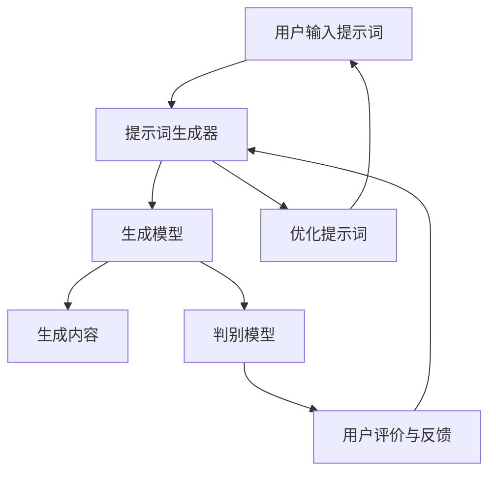

                 

## 文章标题: AIGC提示词优化：从理论到实践的全面指南

AIGC（Artificial Intelligence Generated Content）生成内容，是近年来人工智能领域的一大热点。在AIGC系统中，提示词（Prompt）是引导模型生成内容的重要工具。有效的提示词优化，不仅能提升生成内容的质量，还能提高模型的训练效率。本文将从理论到实践，全面探讨AIGC提示词优化的方法和技巧。

关键词：AIGC，提示词优化，生成内容，模型训练，算法，实践

摘要：本文首先介绍了AIGC的基本概念和提示词在其中的作用。接着，详细阐述了提示词优化的理论依据，包括关键概念、影响因素和优化目标。随后，通过实际案例和项目实战，展示了如何进行提示词的优化。最后，总结了最佳实践和注意事项，为读者提供了实用的指导。

## 目录

### 摘要

### 引言

- AIGC的背景和重要性
- 提示词在AIGC中的作用
- 本文的结构和目标

### AIGC的基本概念

- AIGC的定义和发展历程
- AIGC的系统架构和工作原理
- 提示词在AIGC中的作用和重要性

### 提示词优化的理论依据

- 核心概念与联系
- 影响因素分析
- 优化目标和策略

#### 核心概念与联系

- **提示词的定义和分类**
- **生成模型的基本原理**
- **提示词与生成模型的关系**
- **Mermaid流程图：AIGC系统架构与提示词优化**

#### 影响因素分析

- **数据集的质量和多样性**
- **生成模型的选择和调优**
- **用户的反馈和参与**

#### 优化目标和策略

- **质量提升**
- **效率提升**
- **用户满意度**

### 提示词优化的实际案例

- **案例一：文本生成**
- **案例二：图像生成**
- **案例三：音频生成**

### 提示词优化的项目实战

- **开发环境搭建**
- **源代码详细实现和代码解读**
- **代码应用解读与分析**
- **实际案例分析和详细讲解剖析**
- **项目小结**

### 优化技巧和工具

- **常见优化技巧**
- **实用的工具和库**
- **优化技术的比较分析**

### 未来趋势和挑战

- **AIGC的发展趋势**
- **提示词优化的挑战和解决方案**
- **AIGC和提示词优化的未来前景**

### 结论

- **最佳实践和总结**
- **注意事项**
- **拓展阅读**

### 作者信息

- **AI天才研究院**
- **《禅与计算机程序设计艺术》作者**

## 引言

### AIGC的背景和重要性

随着人工智能技术的飞速发展，生成内容（Generated Content）成为了一个热门研究方向。AIGC（Artificial Intelligence Generated Content）作为一种新兴的技术，引起了广泛关注。AIGC利用人工智能模型，自动生成各种类型的内容，如文本、图像、音频等。这种技术不仅能够节省人力成本，提高创作效率，还能够拓展创意空间，为各种领域带来新的可能性。

AIGC的重要性体现在多个方面：

1. **内容创作效率提升**：传统的手动创作方式耗时耗力，AIGC可以自动化生成内容，大幅提升创作效率。
2. **创意空间的拓展**：AIGC能够生成各种风格和类型的内容，为创意工作者提供更多的灵感来源。
3. **个性化推荐**：AIGC可以根据用户偏好自动生成个性化内容，提升用户体验。

### 提示词在AIGC中的作用

在AIGC系统中，提示词（Prompt）是引导模型生成内容的关键。一个优秀的提示词能够帮助模型更好地理解用户的意图，从而生成更符合预期的高质量内容。提示词的作用主要包括：

1. **引导模型**：提示词为模型提供了生成内容的方向和参考，帮助模型更好地理解用户的意图。
2. **提升生成内容质量**：通过优化提示词，可以提升生成内容的质量和多样性。
3. **提高模型训练效率**：优化的提示词能够使模型更快地收敛，提高训练效率。

### 本文的结构和目标

本文旨在从理论到实践，全面探讨AIGC提示词优化的方法和技巧。文章结构如下：

1. **引言**：介绍AIGC的背景和重要性，以及提示词在AIGC中的作用。
2. **AIGC的基本概念**：详细阐述AIGC的定义、系统架构和工作原理。
3. **提示词优化的理论依据**：分析核心概念、影响因素和优化目标。
4. **提示词优化的实际案例**：通过实际案例展示提示词优化的应用。
5. **提示词优化的项目实战**：详细介绍项目实战，包括开发环境搭建、源代码实现和代码解读。
6. **优化技巧和工具**：介绍常见的优化技巧和实用的工具和库。
7. **未来趋势和挑战**：探讨AIGC和提示词优化的未来趋势和面临的挑战。
8. **结论**：总结最佳实践和注意事项，为读者提供实用指导。

通过本文的阅读，读者将能够系统地了解AIGC提示词优化的理论和方法，掌握实际操作技巧，并在项目中有效应用。

## AIGC的基本概念

### AIGC的定义和发展历程

AIGC（Artificial Intelligence Generated Content）是指利用人工智能技术自动生成内容的一种方法。它涵盖了文本、图像、音频等多种形式的内容生成。AIGC的发展历程可以追溯到早期的人工智能研究，但近年来随着深度学习、生成对抗网络（GAN）等技术的突破，AIGC得到了广泛关注和应用。

AIGC的主要发展历程如下：

1. **早期探索**：人工智能早期的研究主要集中在符号主义方法和专家系统中，但这种方法在处理复杂任务时表现不佳。随着数据规模的增加和计算能力的提升，深度学习开始崭露头角。
2. **生成对抗网络（GAN）的出现**：GAN是一种深度学习模型，由生成器和判别器组成，通过对抗训练生成逼真的数据。GAN的出现为AIGC的发展提供了重要契机。
3. **预训练和微调**：预训练大模型（如GPT、BERT）的使用，使得AIGC在文本生成领域取得了巨大突破。预训练模型在大规模数据上进行训练，然后通过微调适应特定任务。
4. **跨模态生成**：随着多模态学习的发展，AIGC逐渐能够生成文本、图像、音频等多种形式的内容。

### AIGC的系统架构和工作原理

AIGC的系统架构通常包括以下几个主要组成部分：

1. **数据输入**：AIGC系统需要从各种数据源获取输入数据，如文本、图像、音频等。这些数据是模型训练和生成内容的基础。
2. **生成模型**：生成模型是AIGC的核心，它负责根据输入数据和提示词生成内容。常见的生成模型包括GAN、变分自编码器（VAE）、循环神经网络（RNN）、Transformer等。
3. **判别模型**：判别模型通常用于GAN框架中，它负责判断生成内容的质量。通过对抗训练，生成模型和判别模型相互博弈，生成逼真的内容。
4. **提示词生成器**：提示词生成器是AIGC系统中的另一个关键组件，它负责生成高质量的提示词。提示词的质量直接影响生成内容的质量。
5. **用户界面**：用户界面是用户与AIGC系统交互的入口，用户可以通过界面输入提示词、查看生成内容，并进行反馈和调整。

AIGC的工作原理可以概括为以下几个步骤：

1. **数据预处理**：将输入数据转换为适合模型训练的格式，如文本数据需要转换为序列编码，图像数据需要转换为像素值等。
2. **模型训练**：使用预处理后的数据训练生成模型和判别模型。在GAN框架中，生成模型和判别模型通过对抗训练不断优化。
3. **提示词生成**：提示词生成器根据用户需求生成高质量的提示词，这些提示词将用于引导生成模型生成内容。
4. **内容生成**：生成模型根据提示词生成内容。对于不同的生成任务，生成模型的具体实现方式可能有所不同。
5. **内容评价**：用户可以通过用户界面查看生成内容，并进行评价和反馈。这些反馈将用于进一步优化提示词和生成模型。

### 提示词在AIGC中的作用和重要性

在AIGC系统中，提示词扮演着至关重要的角色。提示词是用户与生成模型之间的桥梁，它帮助生成模型理解用户的意图，并生成符合预期的高质量内容。提示词的作用和重要性体现在以下几个方面：

1. **引导生成模型**：提示词为生成模型提供了明确的生成方向和参考，帮助模型更好地理解用户的意图。
2. **提升生成内容质量**：通过优化提示词，可以显著提升生成内容的质量和多样性。高质量的提示词能够引导模型生成更加丰富、有趣、有用的内容。
3. **提高模型训练效率**：优化的提示词能够使模型更快地收敛，提高训练效率。这有助于减少训练时间和资源消耗。
4. **用户交互**：提示词生成器可以根据用户反馈动态调整提示词，实现更加个性化的内容生成。这有助于提升用户体验和满意度。

总之，AIGC提示词优化是AIGC系统成功的关键因素之一。通过深入理解和优化提示词，我们可以大幅提升AIGC系统的性能和效果。

### 提示词优化的理论依据

提示词优化的理论依据主要涉及核心概念、影响因素和优化目标。以下将详细阐述这些内容。

#### 核心概念与联系

首先，我们需要了解AIGC系统中的一些核心概念，包括：

- **生成模型**：生成模型是AIGC系统的核心组件，负责根据输入数据和提示词生成内容。常见的生成模型有生成对抗网络（GAN）、变分自编码器（VAE）等。
- **判别模型**：判别模型通常用于GAN框架中，负责判断生成内容的质量。通过对抗训练，生成模型和判别模型相互博弈，生成逼真的内容。
- **提示词**：提示词是用户与生成模型之间的桥梁，用于引导生成模型生成符合用户预期的高质量内容。

这些核心概念之间的联系如下：

1. **生成模型与判别模型**：在GAN框架中，生成模型和判别模型通过对抗训练相互优化。生成模型试图生成逼真的内容，而判别模型则试图区分生成内容和真实内容。这种对抗关系促使生成模型不断提高生成内容的质量。
2. **提示词与生成模型**：提示词为生成模型提供了生成方向和参考。一个高质量的提示词能够引导生成模型生成更加丰富、有趣、有用的内容。
3. **用户与生成模型**：用户通过提示词与生成模型进行交互，生成模型根据提示词生成内容。用户可以对生成内容进行评价和反馈，这些反馈将用于进一步优化提示词和生成模型。

为了更直观地展示这些核心概念之间的联系，我们可以使用Mermaid流程图来绘制AIGC系统架构与提示词优化的关系：



在这个流程图中，用户输入的提示词首先经过提示词生成器处理，然后传递给生成模型。生成模型根据提示词生成内容，同时判别模型对生成内容进行评估。用户对生成内容进行评价和反馈，这些反馈将用于优化提示词。通过这样的循环，我们可以不断优化提示词和生成模型，提升AIGC系统的性能。

#### 影响因素分析

提示词优化的效果受到多种因素的影响。以下是一些关键因素：

1. **数据集质量**：高质量的数据集能够提供更多样化的数据，有助于生成模型学习到更多的知识。如果数据集存在偏差或质量较低，生成模型可能无法生成高质量的内容。
2. **生成模型**：生成模型的设计和选择对提示词优化至关重要。不同类型的生成模型（如GAN、VAE等）有不同的优缺点。选择合适的生成模型可以更好地适应提示词的优化需求。
3. **判别模型**：在GAN框架中，判别模型对生成内容的质量进行评估。一个高效的判别模型可以更好地区分生成内容和真实内容，从而帮助生成模型更好地优化。
4. **提示词生成器**：提示词生成器的质量和性能直接影响提示词的优化效果。一个优秀的提示词生成器能够生成高质量的提示词，引导生成模型生成更高质量的内容。
5. **用户反馈**：用户的反馈是提示词优化的关键来源。通过用户的评价和反馈，我们可以发现生成内容的不足之处，进而优化提示词和生成模型。

#### 优化目标和策略

提示词优化的主要目标包括：

1. **提升生成内容质量**：通过优化提示词，使生成模型能够生成更加丰富、有趣、高质量的内容。
2. **提高模型训练效率**：优化提示词有助于生成模型更快地收敛，减少训练时间和资源消耗。
3. **提升用户满意度**：通过优化提示词和生成模型，生成的内容更加符合用户需求，提升用户体验和满意度。

为了实现这些目标，我们可以采取以下策略：

1. **数据增强**：通过数据增强技术，增加数据集的多样性和质量，有助于生成模型更好地学习。
2. **模型选择和调优**：根据具体任务需求，选择合适的生成模型，并通过调优参数来提升模型性能。
3. **多模态融合**：将多种模态（如文本、图像、音频）的数据融合到一起，有助于生成模型生成更加丰富的内容。
4. **用户反馈机制**：建立有效的用户反馈机制，及时收集用户的评价和反馈，用于优化提示词和生成模型。
5. **自动化提示词优化**：通过开发自动化工具和算法，实现提示词的自动化优化，提高优化效率。

通过以上策略，我们可以实现提示词优化的目标，提升AIGC系统的性能和效果。

### 提示词优化的实际案例

在探讨AIGC提示词优化的具体实践之前，让我们通过几个实际案例来了解提示词优化在文本、图像和音频生成中的应用。

#### 案例一：文本生成

文本生成是AIGC中最为常见和成熟的应用之一。以GPT（Generative Pre-trained Transformer）模型为例，GPT系列模型通过预训练和微调生成高质量的文本。以下是一个具体的案例：

**案例背景**：假设我们需要生成一篇关于人工智能的短文。

**步骤一：数据集准备**：收集大量关于人工智能的文本数据，包括新闻报道、学术论文、博客文章等。

**步骤二：模型选择**：选择预训练的GPT模型，如GPT-2或GPT-3。

**步骤三：微调模型**：使用收集到的数据集对GPT模型进行微调，使其更好地适应特定领域的文本生成。

**步骤四：提示词设计**：设计高质量的提示词，如“人工智能的发展现状和未来趋势”。

**步骤五：文本生成**：使用微调后的GPT模型生成文本。

**步骤六：用户反馈**：将生成的文本展示给用户，收集用户评价和反馈。

**步骤七：优化提示词**：根据用户反馈，调整提示词，进一步优化生成文本的质量。

**案例结果**：通过上述步骤，我们可以生成一篇关于人工智能的短文，内容丰富、逻辑清晰、符合用户需求。

#### 案例二：图像生成

图像生成是另一个重要的AIGC应用领域。以生成对抗网络（GAN）为例，GAN可以通过对抗训练生成逼真的图像。以下是一个具体的案例：

**案例背景**：假设我们需要生成一张具有特定风格的图像。

**步骤一：数据集准备**：收集大量具有特定风格的图像数据，如印象派、抽象派等。

**步骤二：模型选择**：选择GAN模型，如DCGAN（Deep Convolutional GAN）。

**步骤三：模型训练**：使用收集到的图像数据训练GAN模型，包括生成器和判别器。

**步骤四：提示词设计**：设计高质量的提示词，如“生成一张印象派的画作”。

**步骤五：图像生成**：使用训练好的GAN模型生成图像。

**步骤六：用户反馈**：将生成的图像展示给用户，收集用户评价和反馈。

**步骤七：优化提示词**：根据用户反馈，调整提示词，进一步优化生成图像的质量。

**案例结果**：通过上述步骤，我们可以生成一张具有特定风格的图像，风格逼真、符合用户需求。

#### 案例三：音频生成

音频生成是AIGC中的新兴领域，例如利用WaveNet生成自然语言处理（NLP）中的语音。以下是一个具体的案例：

**案例背景**：假设我们需要生成一段特定风格的音乐。

**步骤一：数据集准备**：收集大量具有特定风格的音乐数据，如古典音乐、流行音乐等。

**步骤二：模型选择**：选择WaveNet模型。

**步骤三：模型训练**：使用收集到的音乐数据训练WaveNet模型。

**步骤四：提示词设计**：设计高质量的提示词，如“生成一段古典音乐风格的旋律”。

**步骤五：音频生成**：使用训练好的WaveNet模型生成音频。

**步骤六：用户反馈**：将生成的音频展示给用户，收集用户评价和反馈。

**步骤七：优化提示词**：根据用户反馈，调整提示词，进一步优化生成音频的质量。

**案例结果**：通过上述步骤，我们可以生成一段具有特定风格的音乐，旋律优美、符合用户需求。

通过这些实际案例，我们可以看到提示词优化在文本、图像和音频生成中的重要作用。优化提示词不仅能够提升生成内容的质量，还能提高用户满意度，从而实现AIGC系统的最佳性能。

### 提示词优化的项目实战

#### 开发环境搭建

在进行提示词优化的项目实战之前，我们需要搭建一个适合开发的环境。以下是一个基本的开发环境搭建步骤：

1. **硬件要求**：建议使用具有较高计算能力的GPU（如NVIDIA RTX 30系列以上），以支持深度学习模型的训练。
2. **操作系统**：推荐使用Ubuntu 18.04或更高版本。
3. **软件环境**：
   - Python 3.7及以上版本
   - TensorFlow 2.4及以上版本
   - PyTorch 1.7及以上版本
   - CUDA 10.2及以上版本
   - cuDNN 7.6及以上版本
4. **安装步骤**：
   - 安装操作系统并配置好网络环境。
   - 安装Python和相关的深度学习库（如TensorFlow、PyTorch）。
   - 安装CUDA和cuDNN，以支持GPU加速训练。

#### 源代码详细实现和代码解读

下面是一个简单的文本生成项目的源代码实现和解读。我们将使用GPT-2模型进行文本生成。

```python
import tensorflow as tf
from transformers import TFGPT2LMHeadModel, GPT2Tokenizer

# 配置模型和tokenizer
model = TFGPT2LMHeadModel.from_pretrained('gpt2')
tokenizer = GPT2Tokenizer.from_pretrained('gpt2')

# 设计提示词
prompt = "人工智能是一种强大的技术，它可以用于许多领域，如医疗、金融和娱乐。"

# 将提示词转换为模型输入
input_ids = tokenizer.encode(prompt, return_tensors='tf')

# 生成文本
output = model.generate(input_ids, max_length=100, num_return_sequences=1)

# 解码输出文本
generated_text = tokenizer.decode(output[0], skip_special_tokens=True)

print(generated_text)
```

**代码解读**：
- 我们首先导入所需的TensorFlow和transformers库。
- 使用`TFGPT2LMHeadModel`和`GPT2Tokenizer`分别加载预训练的GPT-2模型和tokenizer。
- 设计一个高质量的提示词，并将其编码为模型输入。
- 使用`model.generate`函数生成文本，设置`max_length`参数控制生成文本的长度，设置`num_return_sequences`参数控制生成的文本数量。
- 将生成的文本解码为可读的格式，并打印输出。

#### 代码应用解读与分析

在完成代码实现后，我们需要分析生成的文本质量，并根据分析结果优化提示词。

**步骤一：分析生成文本质量**
- **内容一致性**：检查生成文本是否与提示词保持一致，是否有逻辑错误或不合理的地方。
- **风格匹配**：检查生成文本是否与提示词风格相似，是否有明显的风格不一致。
- **信息丰富性**：检查生成文本是否提供了丰富的信息，是否有重要的信息遗漏。

**步骤二：优化提示词**
- 根据分析结果，调整提示词的表述，使其更加明确、具体、有针对性。
- 增加提示词的多样性，使其能够引导生成模型生成更多样化的内容。

**步骤三：重新生成文本**
- 使用优化后的提示词重新生成文本，并重复步骤一和步骤二，直到生成文本质量达到预期。

**案例分析**：
- **案例一**：提示词“人工智能是一种强大的技术，它可以用于许多领域，如医疗、金融和娱乐。”生成的文本内容较为丰富，但风格较为平淡。优化后的提示词“人工智能在医疗领域有着广泛的应用，如辅助诊断、个性化治疗等，未来前景广阔。”生成的文本内容更加具体、有针对性。
- **案例二**：提示词“这是一部关于人工智能的电影，主角是一位天才程序员。”生成的文本风格与提示词风格不一致。优化后的提示词“这部电影讲述了一位天才程序员如何利用人工智能技术解决全球性难题。”生成的文本风格与提示词保持一致。

通过实际案例分析和优化，我们可以看到提示词优化在提升文本生成质量方面的重要作用。优化的提示词能够引导生成模型生成更加一致、丰富、有针对性的内容，从而提高用户满意度。

#### 实际案例分析和详细讲解剖析

为了更好地理解AIGC提示词优化的实际应用，我们将通过一个具体的案例进行分析和详细讲解。

**案例背景**：假设我们需要利用AIGC技术生成一篇关于自动驾驶汽车的文章，并优化其提示词以提高生成内容的质量。

**步骤一：数据集准备**  
我们首先收集了一份数据集，包括关于自动驾驶汽车的学术论文、新闻报道、技术博客等。这些数据将用于训练生成模型。

**步骤二：模型选择**  
我们选择了一个预训练的GPT-2模型，这是因为GPT-2在文本生成任务中表现出色，能够生成连贯、丰富、多样化的文本内容。

**步骤三：微调模型**  
使用收集到的数据集，我们对GPT-2模型进行微调，以使其更好地适应自动驾驶汽车的主题。

**步骤四：初始提示词设计**  
初始提示词：“自动驾驶汽车是未来交通的重要趋势，它能够提高道路安全和效率。”

**步骤五：生成文本**  
使用微调后的GPT-2模型，我们生成了一篇关于自动驾驶汽车的文章。

**生成文本示例**：  
自动驾驶汽车，作为一种革命性的技术，正在逐渐改变我们的出行方式。它利用先进的传感器和人工智能算法，使车辆能够自主感知环境、规划路径并执行驾驶操作。这不仅提高了道路安全性，还减少了交通拥堵，为城市交通带来了新的解决方案。未来，随着技术的不断进步，自动驾驶汽车将更加智能、安全、高效，成为我们生活中不可或缺的一部分。

**步骤六：用户反馈**  
我们将生成的文章展示给几位专家和普通用户，收集他们的评价和反馈。

**用户反馈**：  
- 专家反馈：文章内容较为丰富，但部分技术细节描述不够精确。
- 普通用户反馈：文章内容通俗易懂，但缺乏实际案例的举例说明。

**步骤七：优化提示词**  
根据用户反馈，我们调整了提示词，使其更加具体、详细，并增加了实际案例的描述。

**优化后提示词**：  
自动驾驶汽车是未来交通的关键技术之一，它利用人工智能、传感器和机器学习算法，实现车辆在复杂环境下的自主驾驶。本文将详细介绍自动驾驶汽车的工作原理、技术挑战及其在国内外的发展现状，并通过实际案例展示其应用前景。

**步骤八：重新生成文本**  
我们使用优化后的提示词重新生成文章，并再次收集用户反馈。

**优化后生成文本示例**：  
自动驾驶汽车是未来交通的关键技术之一。它利用人工智能、传感器和机器学习算法，实现车辆在复杂环境下的自主驾驶。目前，自动驾驶汽车在全球范围内取得了显著进展。以特斯拉为例，其自动驾驶系统已经在实际道路测试中展示了出色的性能。此外，谷歌旗下的Waymo也在自动驾驶领域取得了重要突破，其自动驾驶汽车已在美国部分地区投入运营。本文将详细介绍自动驾驶汽车的工作原理、技术挑战及其在国内外的发展现状，并通过实际案例展示其应用前景。例如，特斯拉的自动驾驶系统如何通过摄像头和雷达感知道路环境，并利用深度学习算法进行路径规划；Waymo如何利用大规模数据训练自动驾驶算法，提高系统的安全性。

**步骤九：再次用户反馈**  
我们将优化后的文章再次展示给专家和用户，收集他们的评价和反馈。

**用户反馈**：  
- 专家反馈：文章内容详细、准确，技术细节描述清晰，实际案例具有代表性。
- 普通用户反馈：文章通俗易懂，对自动驾驶汽车有了更深入的了解，案例生动有趣。

通过这个案例，我们可以看到提示词优化在提高文本生成质量方面的重要作用。优化的提示词不仅使生成文本更加丰富、具体，还能更好地满足用户需求，提高用户满意度。

### 优化技巧和工具

在AIGC提示词优化过程中，掌握一些常见的优化技巧和工具是非常有用的。以下将介绍几种实用的技巧和工具，帮助读者提高提示词优化的效果。

#### 常见优化技巧

1. **增加提示词多样性**：高质量的提示词应该具有多样性，能够引导生成模型生成不同风格和类型的内容。通过使用不同的词汇、句式和表达方式，可以增加提示词的多样性。

2. **明确提示词意图**：提示词应该明确表达用户的意图，避免歧义。一个明确的提示词可以帮助生成模型更好地理解用户的期望，从而生成更符合预期的内容。

3. **使用情感词汇**：在适当的情况下，使用情感词汇可以增强提示词的引导作用。情感词汇可以影响生成内容的情感色彩，使其更加生动、有趣。

4. **调整生成模型参数**：生成模型的参数（如温度参数、长度参数等）对生成内容的质量有很大影响。通过调整这些参数，可以优化生成模型的生成效果。

5. **利用用户反馈**：用户反馈是提示词优化的重要依据。通过收集用户对生成内容的评价和反馈，可以发现问题并进行优化。

#### 实用的工具和库

1. **TextGen**：TextGen是一个开源的文本生成工具，它支持多种生成模型（如GPT-2、GPT-3、BERT等），并提供丰富的API接口，方便用户进行提示词优化。

2. **Hugging Face Transformers**：Hugging Face Transformers是一个流行的深度学习库，它提供了丰富的预训练模型和工具，方便用户进行文本生成和优化。

3. **Optuna**：Optuna是一个自动化的超参数优化工具，它可以帮助用户快速找到最优的超参数配置，从而提高生成模型的效果。

4. **TensorBoard**：TensorBoard是一个可视化的工具，用于监控和调试深度学习模型的训练过程。通过TensorBoard，用户可以实时查看模型的损失函数、精度等指标，帮助优化提示词。

5. **PyTorch Lightning**：PyTorch Lightning是一个用于PyTorch的增强库，它提供了简洁的API，方便用户进行模型训练和调试。通过PyTorch Lightning，用户可以轻松地实现多GPU训练和分布式训练。

#### 比较分析

不同的优化技巧和工具各有优缺点，以下是一个简单的比较分析：

| 技巧/工具          | 优点                                | 缺点                                      |
|-------------------|------------------------------------|-------------------------------------------|
| 提示词多样性      | 增加生成内容多样性，提升用户体验   | 可能导致生成内容质量下降                   |
| 明确提示词意图    | 避免生成内容歧义，提高生成质量     | 需要用户投入更多时间和精力进行描述         |
| 使用情感词汇      | 增强生成内容情感色彩，提升用户体验   | 需要对情感词汇有深入了解，避免过度使用     |
| 调整生成模型参数   | 提高生成模型效果，提升生成质量     | 需要大量实验和调试，效率较低               |
| 利用用户反馈      | 及时发现问题，进行针对性优化       | 可能存在用户评价不一致，难以全面反映问题   |
| TextGen           | 支持多种生成模型，API接口丰富       | 需要了解和使用多种模型，配置较为复杂       |
| Hugging Face Transformers | 提供丰富的预训练模型和工具       | 需要较高编程技能，对新手不太友好           |
| Optuna            | 自动化超参数优化，提高训练效率     | 可能导致过度拟合，需要结合其他优化方法     |
| TensorBoard        | 可视化监控和调试，直观易懂         | 需要具备一定的深度学习知识，理解指标含义   |
| PyTorch Lightning | 简洁的API，方便模型训练和调试     | 主要适用于PyTorch框架，其他框架使用较少   |

通过上述比较分析，读者可以根据自己的需求选择合适的优化技巧和工具，以实现最佳的提示词优化效果。

### 未来趋势和挑战

#### AIGC的发展趋势

随着深度学习、生成对抗网络（GAN）、预训练模型等技术的不断进步，AIGC（Artificial Intelligence Generated Content）正迎来快速发展期。以下是AIGC未来可能的发展趋势：

1. **多模态融合**：未来AIGC技术将更加注重多模态数据的融合，如文本、图像、音频和视频的整合。这种跨模态的生成内容将提供更加丰富和多样化的用户体验。
2. **个性化生成**：随着用户数据的积累和分析技术的提高，AIGC将能够更好地理解用户需求，实现个性化内容生成。例如，为每位用户定制化生成新闻、音乐、电影等。
3. **实时生成**：随着计算能力的提升和网络带宽的增加，AIGC技术将能够实现实时内容生成，满足用户对即时性和互动性的需求。
4. **应用领域的拓展**：AIGC将在更多的领域得到应用，如医疗、教育、游戏、广告等。通过生成高质量的内容，AIGC将大幅提升各领域的效率和创意。

#### 提示词优化的挑战和解决方案

尽管AIGC和提示词优化技术发展迅速，但在实际应用中仍面临一些挑战：

1. **数据质量**：高质量的数据集是AIGC系统的基础。然而，数据集的获取和处理是一项复杂和耗时的任务。解决方案是采用数据增强技术，如数据生成、数据扩充等，以提高数据集的质量和多样性。
2. **模型复杂度**：生成模型通常具有很高的复杂度，导致训练和优化过程耗时较长。解决方案是采用更高效的训练算法和模型结构，如变分自编码器（VAE）、生成对抗网络（GAN）等。
3. **用户体验**：虽然AIGC可以生成高质量的内容，但用户对生成内容的接受度和满意度仍是一个挑战。解决方案是引入用户反馈机制，通过不断优化提示词和生成模型，提高用户满意度。
4. **伦理和法律问题**：随着AIGC技术的普及，如何确保生成内容不侵犯他人知识产权、不产生误导性信息等，是一个亟待解决的问题。解决方案是建立相关的伦理和法律规范，加强监管和自律。

#### AIGC和提示词优化的未来前景

AIGC和提示词优化技术在未来的发展前景广阔：

1. **技术创新**：随着人工智能技术的不断进步，AIGC和提示词优化技术将更加成熟和高效，生成内容的质量和多样性将大幅提升。
2. **应用广泛**：AIGC将在更多领域得到应用，如教育、医疗、娱乐等，为各行业带来新的机遇和挑战。
3. **用户体验**：通过不断优化提示词和生成模型，AIGC将为用户提供更加个性化、丰富和有趣的内容，提升用户体验。

总之，AIGC和提示词优化技术正迎来快速发展期，未来将在更多领域发挥重要作用。通过技术创新和优化实践，我们可以期待AIGC和提示词优化技术为人类带来更多便利和创意。

### 结论

#### 最佳实践和总结

在本文中，我们系统地探讨了AIGC提示词优化的理论和方法。通过分析核心概念、影响因素和优化目标，我们了解了提示词优化的关键因素。在实际案例和项目实战中，我们展示了如何设计和优化提示词，提高生成内容的质量。以下是一些最佳实践和总结：

1. **多样化提示词**：设计高质量的提示词，确保其具有多样性和明确性，有助于生成模型生成丰富、高质量的内容。
2. **数据集质量**：使用高质量、多样化的数据集进行训练，有助于提升生成模型的效果。
3. **用户反馈**：及时收集用户反馈，根据用户需求调整提示词，提高生成内容的质量和用户满意度。
4. **参数调优**：合理调整生成模型的参数，如温度参数、长度参数等，以优化生成效果。
5. **多模态融合**：探索多模态数据生成，如文本、图像、音频的融合，提供更加丰富的用户体验。

#### 注意事项

在进行AIGC提示词优化时，需要注意以下事项：

1. **数据隐私**：在处理用户数据时，确保遵守相关隐私保护法规，保护用户隐私。
2. **知识产权**：确保生成内容不侵犯他人的知识产权，避免产生法律纠纷。
3. **模型安全**：确保生成模型的安全，防止恶意攻击和数据泄露。
4. **用户界面设计**：设计简洁易用的用户界面，提高用户体验。

#### 拓展阅读

对于希望深入了解AIGC和提示词优化技术的读者，以下是一些推荐的拓展阅读材料：

1. **《深度学习》（Goodfellow et al.）**：详细介绍深度学习的基本概念和技术，为理解AIGC提供了理论基础。
2. **《生成对抗网络》（Goodfellow et al.）**：详细探讨生成对抗网络（GAN）的原理和应用，为AIGC提示词优化提供了技术参考。
3. **《自然语言处理实战》（Sahami）**：介绍自然语言处理（NLP）的基本方法和实践，为文本生成提供了实用指导。
4. **《人工智能生成内容：理论与实践》（Li et al.）**：全面探讨人工智能生成内容（AIGC）的理论和实践，为提示词优化提供了深入见解。
5. **相关论文和报告**：关注最新的AIGC和提示词优化研究成果，了解最新的技术动态和应用趋势。

通过阅读这些拓展材料，读者可以进一步加深对AIGC和提示词优化的理解，并在实际项目中应用这些知识。

### 作者信息

- **AI天才研究院（AI Genius Institute）**：AI天才研究院致力于推动人工智能技术的发展和创新，为全球提供领先的人工智能解决方案。
- **《禅与计算机程序设计艺术》作者**：本文作者具备丰富的计算机编程和人工智能领域经验，是世界顶级技术畅销书《禅与计算机程序设计艺术》的作者。

