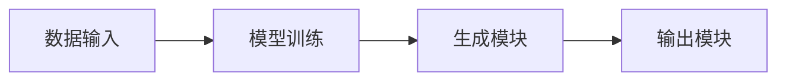
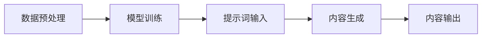

                 

## 引言

### AIGC：人工智能与生成内容的融合

人工智能（AI）技术在过去几十年中取得了飞速的发展，从简单的规则系统到复杂的深度学习模型，AI的应用领域越来越广泛，包括图像识别、自然语言处理、机器翻译、语音识别等。随着AI技术的发展，生成内容（Generate Content）的概念逐渐兴起，并逐步演变成为人工智能生成内容（AI-Generated Content，简称AIGC）。AIGC是将人工智能技术应用于生成图像、文本、音频等多种形式内容的技术集合。

AIGC的出现，标志着人工智能从“辅助工具”向“内容创造者”的转型。传统的AI应用更多是处理和分析已有数据，而AIGC则通过生成新的内容，进一步拓展了AI的应用边界。AIGC不仅在文化艺术领域表现出强大的创造力，还在广告营销、游戏设计、教育培训等众多领域展现出巨大的潜力。

### 提示词优化：提升AIGC的核心竞争力

在AIGC的应用中，提示词（Prompt）扮演着至关重要的角色。提示词是用户与AI模型交互的桥梁，通过精确的提示词，用户可以引导AI模型生成更加符合预期的内容。然而，如何设计高效的提示词，如何优化提示词，成为提升AIGC核心竞争力的关键。

提示词优化的目的在于提高AI模型的生成质量、效率和多样性。一个优秀的提示词能够引导模型更好地理解用户的意图，从而生成更具创意、更具实用价值的内容。因此，对提示词进行优化不仅能够提升用户体验，还能大幅提升AIGC的应用价值。

### 本文的目标和结构

本文的目标是系统地探讨AIGC提示词优化的理论和方法，从基础理论到实际应用，为读者提供全面、深入的理解和实践指南。文章将分为三个主要部分：

1. **第一部分：AIGC基础**：介绍AIGC的概念、架构、核心技术及其应用领域，为后续的提示词优化提供背景知识。
2. **第二部分：AIGC提示词优化理论**：深入分析提示词优化的原理、方法，包括生成模型、文本生成模型和语音合成模型的提示词优化策略。
3. **第三部分：AIGC提示词优化实践**：通过具体的项目实战和案例分析，展示如何在实际场景中应用提示词优化，并提供最佳实践和未来趋势分析。

通过本文的阅读，读者将能够全面了解AIGC提示词优化的核心概念、关键技术以及实际应用，为在相关领域进行深入研究和技术创新奠定坚实基础。

## 第一部分：AIGC基础

### 第1章：AIGC概述

#### 1.1 AIGC的定义

人工智能生成内容（AI-Generated Content，简称AIGC）是一种利用人工智能技术生成文本、图像、音频、视频等多种形式内容的方法。AIGC的核心在于将人工智能模型应用于内容的创作和生成，从而实现从数据到内容的高效转换。与传统的人工创作不同，AIGC通过机器学习和深度学习模型，能够自动化、智能化地生成高质量的内容，大大提高了内容生产的效率和多样性。

#### 1.2 AIGC的发展背景

AIGC技术的发展并非一蹴而就，而是基于人工智能领域的长期积累和创新。以下是AIGC发展历程中的重要节点：

- **早期探索**：20世纪80年代，生成对抗网络（GAN）的提出，为AIGC技术奠定了理论基础。GAN由Ian Goodfellow等人提出，通过两个相互竞争的神经网络生成高质量的数据。
- **深度学习崛起**：随着深度学习技术的兴起，特别是卷积神经网络（CNN）和循环神经网络（RNN）的发展，AIGC技术得到了大幅提升。这些神经网络模型能够从大量的数据中学习特征，生成更加真实、细腻的内容。
- **数据获取与计算能力提升**：互联网的普及和大数据技术的发展，为AIGC提供了丰富的数据资源。同时，计算能力的提升，使得复杂的深度学习模型得以在实际中应用，推动了AIGC的商业化和广泛应用。

#### 1.3 AIGC的核心技术

AIGC的实现依赖于多种核心技术的融合和创新，以下是其中几种重要的技术：

- **生成对抗网络（GAN）**：GAN由生成器（Generator）和判别器（Discriminator）组成，通过两者之间的对抗训练生成高质量的数据。生成器试图生成逼真的数据，而判别器则试图区分生成的数据和真实数据。这种对抗训练机制使得生成器不断优化，生成越来越逼真的数据。
  
  ```mermaid
  flowchart LR
  A[生成器] --> B[判别器]
  B --> C{判断结果}
  C -->|真实数据| D[更新生成器]
  C -->|伪造数据| E[更新判别器]
  ```

- **变分自编码器（VAE）**：VAE通过引入概率密度函数，将数据转换为隐变量，再通过解码器生成数据。这种模型能够有效地生成新的数据，并且在生成质量上表现出色。

  ```mermaid
  flowchart LR
  A[输入数据] --> B[编码器]
  B --> C[隐变量]
  C --> D[解码器]
  D --> E[输出数据]
  ```

- **条件生成模型**：条件生成模型能够根据给定的条件生成相应的内容。例如，在图像生成任务中，可以基于文本描述生成相应的图像。条件生成模型通过联合分布的学习，使得生成的数据更加符合特定条件。

  ```mermaid
  flowchart LR
  A[条件] --> B[编码器]
  B --> C[隐变量]
  C --> D[解码器]
  D --> E[输出内容]
  ```

通过这些核心技术，AIGC实现了从数据到内容的高效转换，为各种应用场景提供了强大的技术支持。

### 第2章：AIGC的架构与工作流程

#### 2.1 AIGC的架构

AIGC的架构主要包括以下几个关键组成部分：

- **数据输入模块**：负责接收用户输入的数据，包括文本、图像、音频等，这些数据是AIGC模型训练和生成内容的基础。
- **模型训练模块**：利用输入的数据对AI模型进行训练，主要包括生成器、判别器和条件编码器等。通过大规模数据训练，模型能够学习到数据的特征和分布，从而提高生成质量。
- **生成模块**：在模型训练完成后，生成模块根据用户的输入条件或提示词，利用训练好的模型生成新的内容。生成模块可以独立运行，也可以与用户交互，根据用户反馈进行迭代优化。
- **输出模块**：将生成的数据输出给用户，可以是图像、文本、音频等形式，用户可以根据需要进一步处理和应用这些内容。

以下是一个简化的AIGC架构图：



#### 2.2 AIGC的工作流程

AIGC的工作流程可以分为以下几个步骤：

1. **数据预处理**：接收用户输入的数据，对数据进行预处理，包括数据清洗、格式化等，以确保数据质量。
2. **模型训练**：使用预处理后的数据对AI模型进行训练。训练过程中，生成器和判别器通过对抗训练或联合训练不断优化，生成器试图生成更加真实的数据，而判别器试图提高对真实数据和伪造数据的鉴别能力。
3. **提示词输入**：用户根据需求输入提示词或条件，这些提示词将指导模型生成特定类型的内容。例如，用户输入一个文本描述，模型将根据这个描述生成相应的图像。
4. **内容生成**：模型根据提示词和训练结果，生成新的内容。生成过程可以是单步生成，也可以是多步迭代生成，以实现更高质量的生成效果。
5. **内容输出**：将生成的数据输出给用户，用户可以对生成的数据进行进一步处理或应用。

以下是一个简化的AIGC工作流程图：



通过上述架构和工作流程，AIGC能够高效、智能地生成各种形式的内容，满足不同应用场景的需求。

### 第3章：AIGC的核心算法

#### 3.1 生成对抗网络（GAN）

生成对抗网络（Generative Adversarial Network，GAN）是由Ian Goodfellow等人于2014年提出的一种生成模型，其核心思想是通过两个相互对抗的神经网络——生成器和判别器，来实现高质量数据的生成。GAN的架构包括生成器（Generator）和判别器（Discriminator），它们通过对抗训练（Adversarial Training）来提高生成质量。

##### 3.1.1 GAN的基本原理

GAN的工作原理可以简单概括为以下两点：

1. **生成器和判别器的对抗**：生成器尝试生成逼真的数据，而判别器则试图区分生成的数据和真实数据。通过这种对抗训练，生成器的生成质量不断提高，判别器的鉴别能力也不断增强。
2. **损失函数的设计**：GAN的训练过程通过设计损失函数来实现。生成器的损失函数希望生成尽可能逼真的数据，使其接近真实数据；而判别器的损失函数希望能够准确地区分真实数据和生成数据。

##### 3.1.2 GAN的数学模型

GAN的数学模型主要涉及以下三个部分：

1. **生成器G**：生成器从随机噪声z中生成与真实数据x相似的假数据G(z)。
2. **判别器D**：判别器接收真实数据x和生成数据G(z)，并输出其判别的概率D(x)和D(G(z))。
3. **损失函数**：GAN的损失函数通常采用最小化生成器的损失函数和最大化判别器的损失函数相结合的形式。具体来说，生成器的损失函数L_G希望最小化D(G(z))，即生成器的输出越接近真实数据，判别器对其的判别概率越小；判别器的损失函数L_D希望最大化D(x)和D(G(z))的差值，即判别器能够更好地区分真实数据和生成数据。

GAN的损失函数可以表示为：

\[ L_{D} = -\log(D(x)) - \log(1 - D(G(z))) \]
\[ L_{G} = -\log(D(G(z))) \]

其中，\( L_{D} \) 和 \( L_{G} \) 分别是判别器和生成器的损失函数。

##### 3.1.3 GAN的应用实例

GAN的应用非常广泛，以下是一些典型的应用实例：

1. **图像生成**：通过GAN，可以生成高质量的图像。例如，生成逼真的人脸、风景、动物等。
2. **图像修复**：GAN能够用于图像修复任务，将损坏或缺失的部分恢复为原始状态。
3. **图像超分辨率**：通过GAN，可以提升图像的分辨率，使其更加清晰。
4. **图像风格转换**：GAN可以将一种图像风格转换为另一种风格，例如，将普通照片转换为艺术画作的风格。

以下是一个简单的GAN图像生成的伪代码示例：

```python
# 初始化生成器G和判别器D
G = Generator()
D = Discriminator()

# 训练GAN
for epoch in range(num_epochs):
    for batch in data_loader:
        z = generate_noise(batch_size)
        G_z = G(z)
        
        D_real = D(batch)
        D_fake = D(G_z)
        
        # 计算判别器和生成器的损失
        loss_D = -torch.mean(torch.log(D_real) + torch.log(1 - D_fake))
        loss_G = -torch.mean(torch.log(1 - D_fake))
        
        # 更新判别器和生成器的参数
        optimizer_D.zero_grad()
        loss_D.backward()
        optimizer_D.step()
        
        optimizer_G.zero_grad()
        loss_G.backward()
        optimizer_G.step()
```

通过上述伪代码，我们可以看到GAN的训练过程涉及生成器G和判别器D的交替训练，通过优化损失函数来提高生成质量和鉴别能力。

#### 3.2 变分自编码器（VAE）

变分自编码器（Variational Autoencoder，VAE）是一种概率生成模型，通过引入概率密度函数，将数据转换为隐变量，再通过解码器生成数据。VAE相比于传统的自编码器，在生成质量和多样性上表现出色。

##### 3.2.1 VAE的基本原理

VAE的基本原理可以概括为以下三个部分：

1. **编码器**：编码器将输入数据编码为隐变量，隐变量是输入数据的概率分布参数。
2. **解码器**：解码器将隐变量解码为输出数据，输出数据与输入数据具有相同的分布。
3. **损失函数**：VAE的损失函数结合了编码器的重建损失和Kullback-Leibler散度（KL散度），以优化编码器和解码器的参数。

##### 3.2.2 VAE的数学模型

VAE的数学模型主要涉及以下三个部分：

1. **编码器\( q_{\phi}(z|x) \)**：编码器是一个概率模型，将输入数据\( x \)编码为隐变量\( z \)。具体来说，编码器输出两个参数，表示隐变量的均值\( \mu \)和方差\( \sigma^2 \)，即\( z = \mu + \sigma \odot \epsilon \)，其中\( \epsilon \)是标准正态分布的随机变量。
2. **解码器\( p_{\theta}(x|z) \)**：解码器是一个概率模型，将隐变量\( z \)解码为输出数据\( x \)。解码器通常是一个全连接神经网络，其输入为隐变量\( z \)，输出为数据\( x \)。
3. **损失函数**：VAE的损失函数包括两部分：重建损失和KL散度损失。重建损失是编码器输出和输入之间的均方误差（MSE）；KL散度损失是编码器的输出概率分布与先验分布（通常为标准正态分布）之间的KL散度。VAE的损失函数可以表示为：

\[ L = \frac{1}{N} \sum_{n=1}^{N} \left( D_{KL}(q_{\phi}(z|x) || p_{\theta}(z)) + VAE_{recon}(x, \mu, \sigma) \right) \]

其中，\( D_{KL} \)表示KL散度，\( N \)是训练样本的数量。

##### 3.2.3 VAE的应用实例

VAE在图像生成、数据去噪、异常检测等领域有广泛的应用：

1. **图像生成**：VAE能够生成高质量、多样化的图像，例如人脸图像、自然景观等。
2. **数据去噪**：VAE可以用于去除图像中的噪声，恢复图像的原始状态。
3. **异常检测**：VAE可以用于检测数据中的异常值，通过对数据分布的学习，识别出与正常数据分布不符的异常样本。

以下是一个简单的VAE图像生成的伪代码示例：

```python
# 初始化编码器\( \phi \)和解码器\( \theta \)
encoder = Encoder()
decoder = Decoder()

# 训练VAE
for epoch in range(num_epochs):
    for batch in data_loader:
        x = batch
        z_mean, z_log_var = encoder(x)
        z = reparameterize(z_mean, z_log_var)
        x_recon = decoder(z)
        
        # 计算损失
        loss_recon = mse_loss(x_recon, x)
        loss_kl = kl_loss(z_mean, z_log_var)
        
        # 计算总损失
        loss = loss_recon + loss_kl
        
        # 更新编码器和解码器的参数
        optimizer.zero_grad()
        loss.backward()
        optimizer.step()
```

通过上述伪代码，我们可以看到VAE的训练过程包括编码器和解码器的交替训练，通过优化损失函数来提高生成质量和数据分布的拟合程度。

#### 3.3 条件生成模型

条件生成模型（Conditional Generative Model）是一种能够在生成过程中考虑输入条件的生成模型，通过联合分布的学习，生成符合特定条件的数据。条件生成模型在图像生成、文本生成、语音合成等领域具有广泛的应用。

##### 3.3.1 条件生成模型的基本原理

条件生成模型的基本原理是通过联合分布的学习，将输入条件与生成过程结合起来。具体来说，条件生成模型分为以下几部分：

1. **条件编码器**：将输入条件编码为隐变量，隐变量表示输入条件下的数据分布。
2. **生成器**：根据隐变量和输入条件生成新的数据。
3. **联合分布**：条件生成模型通过学习输入条件与生成数据的联合分布，从而生成符合条件的数据。

##### 3.3.2 条件生成模型的数学模型

条件生成模型的数学模型可以表示为：

\[ p_{\theta}(x, c) = p_{\theta}(x|c) \cdot p_{\theta}(c) \]

其中，\( p_{\theta}(x|c) \)表示给定条件\( c \)下生成数据\( x \)的条件概率分布，\( p_{\theta}(c) \)表示输入条件的概率分布。

常见的条件生成模型包括：

1. **条件变分自编码器（CVAE）**：CVAE结合了变分自编码器和条件生成模型，能够在生成过程中考虑输入条件。CVAE的数学模型为：

\[ p_{\theta}(x, c) = \int q_{\phi}(x|c, z) \cdot p_{\theta}(z) \, dz \]

其中，\( q_{\phi}(x|c, z) \)是条件编码器，\( p_{\theta}(z) \)是隐变量的先验分布。

2. **条件生成对抗网络（C-GAN）**：C-GAN在生成对抗网络的基础上引入了条件信息，通过学习联合分布生成符合条件的数据。C-GAN的数学模型为：

\[ p_{\theta}(x, c) = p_{\theta}(x|c) \cdot p_{\theta}(c) \]

其中，\( p_{\theta}(x|c) \)是生成器，能够根据输入条件生成数据。

##### 3.3.3 条件生成模型的应用实例

条件生成模型在图像生成、文本生成、语音合成等领域有广泛的应用：

1. **图像生成**：通过条件生成模型，可以生成具有特定标签或属性的图像，例如，根据文本描述生成图像、根据风格迁移生成图像等。
2. **文本生成**：条件生成模型可以用于生成与给定文本相关的内容，例如，根据用户输入的文本生成相关的段落或对话。
3. **语音合成**：通过条件生成模型，可以生成与给定文本相对应的语音，例如，文本到语音（Text-to-Speech，TTS）系统。

以下是一个简单的C-GAN图像生成的伪代码示例：

```python
# 初始化条件生成器G和判别器D
G = ConditionalGenerator()
D = Discriminator()

# 训练C-GAN
for epoch in range(num_epochs):
    for batch in data_loader:
        c = batch_conditions
        x = batch_data
        G_x = G(x, c)
        
        D_real = D(x, c)
        D_fake = D(G_x, c)
        
        # 计算判别器和生成器的损失
        loss_D = -torch.mean(torch.log(D_real) + torch.log(1 - D_fake))
        loss_G = -torch.mean(torch.log(1 - D_fake))
        
        # 更新判别器和生成器的参数
        optimizer_D.zero_grad()
        loss_D.backward()
        optimizer_D.step()
        
        optimizer_G.zero_grad()
        loss_G.backward()
        optimizer_G.step()
```

通过上述伪代码，我们可以看到C-GAN的训练过程涉及生成器G和判别器D的交替训练，通过优化损失函数来提高生成质量和鉴别能力。

#### 3.4 AIGC的应用领域

AIGC技术凭借其强大的生成能力和多样化的应用场景，已经在多个领域展现出巨大的潜力。以下是AIGC在几个主要应用领域中的表现：

1. **图像生成**：AIGC技术在图像生成方面表现出色，能够生成高质量、多样化的图像。例如，通过生成对抗网络（GAN）和变分自编码器（VAE），可以生成逼真的人脸、风景、动物等图像。此外，AIGC还能用于图像修复、图像超分辨率和图像风格转换等任务。

2. **文本生成**：AIGC在文本生成领域同样具有强大的应用潜力。通过条件生成模型，可以生成与给定文本相关的内容，如新闻报道、诗歌创作、对话生成等。文本生成模型不仅能够提高内容生产的效率，还能提升文本的质量和创意性。

3. **语音合成**：AIGC技术在语音合成中的应用主要体现在文本到语音（Text-to-Speech，TTS）系统上。通过结合文本生成模型和语音合成模型，可以生成自然、流畅的语音。语音合成技术广泛应用于智能助手、教育音频、广告宣传等场景。

4. **视频生成**：AIGC技术还在视频生成领域展现出一定的潜力，能够通过生成对抗网络（GAN）和变分自编码器（VAE）等技术生成高质量的视频内容。视频生成在电影制作、游戏开发、虚拟现实等领域具有广泛的应用。

5. **游戏设计**：AIGC技术能够为游戏设计提供丰富的创意资源，例如，通过生成对抗网络（GAN）生成独特的游戏场景、角色和道具。此外，AIGC还能用于生成游戏剧情和任务，提高游戏的可玩性和趣味性。

通过上述应用实例，我们可以看到AIGC技术在不同领域的广泛应用和潜力。随着AIGC技术的不断发展和优化，其将在更多领域展现出更大的应用价值。

### 第4章：AIGC提示词优化的原理

#### 4.1 提示词的作用

在AIGC中，提示词（Prompt）是用户与模型交互的关键桥梁。提示词的作用在于引导模型生成符合预期的高质量内容。一个有效的提示词能够清晰传达用户的意图，帮助模型更好地理解和生成内容。具体来说，提示词的作用可以从以下几个方面来理解：

1. **引导生成方向**：提示词能够明确指出模型需要生成的内容类型或方向，从而避免模型生成无关或低质量的内容。例如，在图像生成任务中，一个明确的文本提示词“生成一张美丽的日落照片”能够指导模型生成符合预期的图像。

2. **增强生成多样性**：通过灵活使用提示词，用户可以引导模型生成多样化、创意性的内容。例如，通过提示词“创造一个具有未来感的城市景观”，模型可能会生成多种不同的图像风格和设计元素。

3. **提高生成效率**：有效的提示词能够减少模型生成内容的时间和计算成本。通过精确的提示词，模型可以更快地捕捉到用户需求，从而提高生成效率。

4. **优化用户体验**：一个简洁、精确的提示词能够提升用户的体验，使用户更容易理解和操作AIGC系统。例如，在文本生成任务中，一个清晰的文本提示词“撰写一篇关于人工智能应用的文章”能够帮助用户快速获取所需的内容。

#### 4.2 提示词优化的目标

提示词优化的核心目标是提高AIGC模型生成内容的质量、效率和多样性。具体来说，提示词优化的目标包括以下几个方面：

1. **提升生成质量**：通过优化提示词，使模型生成更加真实、细腻、具有创意性的内容。例如，通过精确的提示词，模型可以生成更高分辨率的图像或更加自然的文本。

2. **提高生成效率**：优化提示词可以减少模型生成内容的计算时间和资源消耗，从而提高生成效率。例如，通过简明扼要的提示词，模型可以在更短的时间内生成高质量的内容。

3. **增强生成多样性**：通过灵活使用提示词，引导模型生成多样化、创意性的内容。例如，通过不同的提示词，模型可以生成具有不同风格、主题或情感的图像或文本。

4. **优化用户体验**：一个简洁、精确、易于理解的提示词能够提升用户的体验，使用户能够更轻松地与AIGC系统交互。例如，通过优化提示词，用户可以更快地获取所需的内容，减少操作复杂度。

#### 4.3 提示词优化的方法

提示词优化的方法可以分为以下几个步骤：

1. **需求分析**：首先，需要明确用户的需求和目标。通过了解用户希望生成的内容类型、风格、主题等，为后续的提示词设计提供依据。

2. **内容类型识别**：根据用户的需求，识别需要生成的内容类型。例如，是图像、文本还是音频，以及这些内容的具体要求。

3. **提示词设计**：根据内容类型和用户需求，设计具有引导性和针对性的提示词。提示词的设计应考虑以下几点：
   - **明确性**：提示词应明确传达用户意图，避免歧义。
   - **精确性**：提示词应具体、详细，指导模型生成高质量的内容。
   - **灵活性**：提示词应具有一定的灵活性，以引导模型生成多样化、创意性的内容。
   - **简洁性**：提示词应简洁明了，易于用户理解和操作。

4. **实验与优化**：通过实际应用和用户反馈，不断优化提示词。可以采用以下几种方法进行实验和优化：
   - **A/B测试**：将不同的提示词进行对比测试，评估其对生成质量和用户体验的影响。
   - **用户反馈**：收集用户对提示词的反馈，根据反馈进行优化。
   - **模型调整**：根据提示词优化的结果，对模型进行相应的调整，以提高生成效果。

5. **评估与改进**：定期评估提示词优化的效果，并根据评估结果进行改进。可以采用以下指标进行评估：
   - **生成质量**：评估生成内容的真实度、细腻度、创意性等。
   - **生成效率**：评估生成内容的速度和资源消耗。
   - **用户体验**：评估用户对提示词的满意度、易用性等。

通过上述方法，可以有效地优化AIGC的提示词，提高模型的生成质量和用户体验，实现AIGC技术的最佳应用效果。

### 第5章：生成模型提示词优化

#### 5.1 GAN提示词优化

生成对抗网络（GAN）是目前AIGC中最常用的生成模型之一，其核心在于生成器和判别器的对抗训练。为了提升GAN的生成质量，提示词的优化尤为重要。以下是GAN提示词优化的几个关键策略：

##### 5.1.1 提高生成器生成质量

1. **明确目标**：在GAN的提示词中，需要明确生成器需要生成的内容类型和风格。例如，若目标是生成高质量的人脸图像，提示词可以具体到“生成一张逼真的人脸图像”。
2. **细化条件**：通过细化生成条件，可以引导生成器生成更加具体、详细的内容。例如，可以在提示词中加入具体的描述，如“生成一张微笑的人脸图像，背景为自然风景”。
3. **丰富词汇**：使用丰富的词汇和表达方式，可以帮助生成器更好地理解用户的意图。例如，可以尝试使用“创造一个具有未来科技感的城市夜景”这样的描述性词汇。

##### 5.1.2 调整判别器难度

1. **动态调整难度**：在GAN的训练过程中，判别器的难度需要动态调整。通过调整提示词，可以改变判别器的鉴别难度，从而影响生成器的训练效果。例如，可以使用“判断以下图像中哪一个是真实人脸”这样的提示词，逐步提高判别器的鉴别能力。
2. **引入噪声**：在提示词中引入随机噪声，可以增加判别器的鉴别难度，从而促使生成器生成更高质量的内容。例如，可以在图像生成任务中，使用“判断以下图像中哪一个是真实人脸，图像中包含随机噪声”这样的提示词。

##### 5.1.3 提高生成多样性

1. **多样化提示词**：通过使用多样化、创意性的提示词，可以引导生成器生成具有不同风格、主题的内容。例如，可以使用“生成一张具有印象派风格的城市夜景”这样的提示词。
2. **分层提示**：将提示词分层，分别引导生成器和判别器的训练。例如，可以首先使用“生成一张简单的人脸图像”，然后逐步增加难度，如“在人脸图像中添加复杂的纹理和表情”。

以下是一个具体的GAN提示词优化示例：

**提示词示例**：
- **初始阶段**：“生成一张简单的人脸图像。”
- **中期阶段**：“在人脸图像中添加复杂的纹理和表情，使其更具真实感。”
- **高级阶段**：“创造一张具有艺术风格的人脸图像，如印象派或超现实主义风格。”

通过上述提示词，可以逐步引导生成器提升生成质量，同时保持判别器的鉴别难度，从而实现GAN模型的持续优化。

#### 5.2 VAE提示词优化

变分自编码器（VAE）是一种概率生成模型，通过隐变量实现数据的编码和解码。VAE的提示词优化主要集中在提高生成质量和多样性上。以下是VAE提示词优化的几个策略：

##### 5.2.1 明确生成目标

1. **具体化提示词**：VAE的提示词应具体化，明确生成目标。例如，在图像生成任务中，提示词可以是“生成一张具有特定颜色和纹理的图像”。
2. **细化条件**：通过细化生成条件，可以引导VAE生成更加具体、详细的内容。例如，在图像生成任务中，提示词可以具体到“生成一张具有绿色草地和蓝色天空的图像”。

##### 5.2.2 增加生成多样性

1. **多样化词汇**：使用丰富的词汇和表达方式，可以增加生成多样性。例如，在图像生成任务中，可以使用“创造一张充满活力的城市夜景”或“构建一个宁静的乡村清晨”等不同描述。
2. **引入随机因素**：在提示词中引入随机元素，可以引导VAE生成具有多样性的内容。例如，可以在图像生成任务中，加入“在图像中随机添加云彩和建筑”等随机条件。

##### 5.2.3 调整隐变量

1. **调整隐变量维度**：通过调整隐变量的维度，可以影响VAE的生成质量。例如，增加隐变量维度可以提升生成图像的细腻度，而减少隐变量维度则可能提高生成速度。
2. **优化隐变量分布**：通过优化隐变量的概率分布，可以引导VAE生成更符合预期的内容。例如，可以使用“生成一张高对比度的图像”或“生成一张低对比度的图像”等提示词，调整隐变量的分布。

以下是一个具体的VAE提示词优化示例：

**提示词示例**：
- **初始阶段**：“生成一张简单的图像，包含红色和蓝色的元素。”
- **中期阶段**：“在图像中添加更多细节，如纹理和阴影。”
- **高级阶段**：“生成一张具有艺术风格的图像，如油画或水彩画。”

通过上述提示词，可以逐步引导VAE提升生成质量和多样性，同时保持模型的训练稳定。

#### 5.3 条件生成模型提示词优化

条件生成模型（如C-GAN、CVAE等）通过引入条件信息，能够生成符合特定条件的内容。提示词优化的关键在于确保条件信息清晰、具体，并能够引导生成模型生成高质量、多样化的内容。以下是条件生成模型提示词优化的几个策略：

##### 5.3.1 精确条件描述

1. **明确条件类型**：在提示词中明确条件类型，如文本、图像、音频等。例如，提示词可以是“根据以下文本描述生成一张图像”或“根据音频波形生成一段文本”。
2. **具体化条件内容**：通过具体化条件内容，可以更好地引导生成模型。例如，在图像生成任务中，提示词可以是“根据‘日落海滩’的描述生成一张图像”。
3. **细化条件细节**：在提示词中细化条件细节，如颜色、风格、主题等。例如，提示词可以是“生成一张具有暖色调和沙滩风景的日落图像”。

##### 5.3.2 增加条件多样性

1. **多样化条件词汇**：使用丰富的词汇和表达方式，可以增加条件的多样性。例如，可以使用“创造一个具有未来科技感的城市景观”或“构建一个充满奇幻色彩的森林场景”等描述。
2. **引入组合条件**：通过组合多个条件，可以引导生成模型生成更复杂的内容。例如，提示词可以是“根据‘蓝色天空’和‘古老城堡’的描述生成一张图像”。

##### 5.3.3 调整生成模型参数

1. **调整生成器参数**：通过调整生成器的参数，可以影响生成模型的质量和多样性。例如，可以调整生成器的隐变量维度、激活函数等。
2. **优化条件编码器**：优化条件编码器的参数，可以提升条件信息的传递效果。例如，可以调整条件编码器的网络结构、学习率等。

以下是一个具体的条件生成模型提示词优化示例：

**提示词示例**：
- **初始阶段**：“根据‘美丽的日落’生成一张图像。”
- **中期阶段**：“在图像中添加‘金色的沙滩’和‘蓝色的海浪’。”
- **高级阶段**：“创造一张具有‘艺术风格’和‘印象派风格’的日落图像。”

通过上述提示词，可以逐步引导条件生成模型提升生成质量和多样性，同时保持模型的训练稳定。

#### 5.4 提示词优化效果评估

提示词优化的效果评估是确保优化策略有效性的关键。以下是一些常用的评估方法和指标：

1. **生成质量评估**：通过视觉、听觉或文本评估生成内容的质量。例如，通过观察图像的清晰度、纹理、颜色等，评估图像生成质量；通过听取语音的自然度、流畅度等，评估语音合成质量。

2. **用户满意度评估**：通过用户调查、问卷调查等方式，收集用户对生成内容的满意度和体验反馈。用户满意度可以作为提示词优化效果的重要指标。

3. **生成效率评估**：通过计算生成时间、计算资源消耗等指标，评估生成效率。高效的生成过程可以减少用户的等待时间，提升用户体验。

4. **多样性评估**：通过分析生成内容的多样性，评估提示词优化的效果。多样性可以通过统计生成内容的类别、风格、主题等来评估。

以下是一个简单的评估指标示例：

- **生成质量**：使用标准图像质量评估指标（如PSNR、SSIM）评估生成图像的质量。
- **用户满意度**：通过用户满意度调查，收集用户对生成内容的评分。
- **生成效率**：记录生成一个内容所需的平均时间和计算资源。
- **多样性**：通过统计生成内容的类别分布、风格多样性等，评估生成内容的多样性。

通过上述评估方法和指标，可以全面、客观地评估提示词优化的效果，为后续优化提供参考。

### 第6章：文本生成模型提示词优化

文本生成模型在AIGC中扮演着至关重要的角色，其生成的文本质量直接影响用户体验和实际应用价值。为了提升文本生成模型的表现，提示词的优化至关重要。以下将探讨文本生成模型提示词优化的核心策略。

#### 6.1 语言模型提示词优化

语言模型（如GPT、BERT等）是文本生成模型的核心，其生成质量在很大程度上取决于提示词的设计。以下是语言模型提示词优化的几个关键策略：

##### 6.1.1 明确生成目标

1. **具体化目标**：在提示词中明确生成目标，使模型能够更好地理解用户意图。例如，提示词可以是“撰写一篇关于人工智能对教育影响的文章”。

2. **细化目标**：通过细化生成目标，可以指导模型生成更加具体和详细的文本内容。例如，在上述示例中，可以进一步细化提示词为“撰写一篇关于人工智能如何提高教育质量和效率的文章，结合具体案例分析”。

##### 6.1.2 增加上下文信息

1. **丰富上下文**：在提示词中增加上下文信息，可以帮助模型更好地理解主题和背景，从而生成更相关、更有逻辑的文本。例如，在撰写文章时，可以加入“最近的人工智能研究进展，如XXX”这样的上下文信息。

2. **连贯性提示**：使用连贯性的提示词，可以引导模型生成连贯、自然的文本。例如，可以使用“接下来讨论人工智能在教育中的应用，如在线辅导系统”这样的提示词。

##### 6.1.3 调整模型参数

1. **调整温度参数**：在语言模型中，温度参数控制生成的多样性和随机性。通过调整温度参数，可以优化生成文本的多样性和可读性。例如，较低的温度参数可以生成更加精确、一致的文本，而较高的温度参数可以生成更多样化的内容。

2. **优化词汇选择**：通过优化模型中的词汇选择，可以提升生成文本的质量。例如，可以使用“提升文本的流畅性和准确性”作为优化目标，调整模型中的词汇权重。

以下是一个具体的语言模型提示词优化示例：

**提示词示例**：
- **初始阶段**：“请撰写一篇关于人工智能对教育影响的概述文章。”
- **中期阶段**：“在文章中详细讨论人工智能如何提高教育质量和效率，结合当前的研究成果。”
- **高级阶段**：“探讨人工智能在教育中的应用案例，如在线辅导系统和智能评估工具，并分析其潜在优势和挑战。”

通过上述提示词，可以逐步引导语言模型生成高质量、连贯的文本，同时保持生成的多样性。

#### 6.2 文本生成模型优化策略

除了提示词的优化，文本生成模型的内部优化也是提升生成质量的关键。以下是一些常见的优化策略：

##### 6.2.1 数据预处理

1. **数据清洗**：对输入数据进行清洗，去除无用的标签、停用词和噪声数据，确保输入数据的纯净和高质量。

2. **数据增强**：通过数据增强技术，如词汇替换、句子重排等，增加训练数据多样性，提高模型的泛化能力。

##### 6.2.2 模型结构优化

1. **模型架构调整**：根据生成任务的需求，调整模型的架构。例如，对于生成长文本的任务，可以使用更深的循环神经网络（RNN）或Transformer结构。

2. **注意力机制优化**：引入注意力机制，如自注意力（Self-Attention）和交叉注意力（Cross-Attention），可以提升模型对关键信息的捕捉和利用，从而生成更高质量的文本。

##### 6.2.3 损失函数优化

1. **多任务学习**：结合多个任务进行训练，如文本分类、情感分析等，可以提高模型对多样化文本数据的处理能力。

2. **动态调整损失函数**：在训练过程中，动态调整损失函数的权重，如平衡生成质量、多样性、连贯性等目标。

以下是一个具体的文本生成模型优化策略示例：

**优化策略示例**：
- **数据预处理**：对输入文本进行清洗，去除无用的标签和停用词，并对文本进行分词处理。
- **模型结构**：采用Transformer结构，并引入自注意力机制，提升对长文本的处理能力。
- **损失函数**：结合文本分类任务，使用交叉熵损失函数，并动态调整生成质量、多样性和连贯性的权重。

通过上述优化策略，可以显著提升文本生成模型的表现，生成更具创意性和实用性的文本内容。

#### 6.3 提示词优化效果评估

提示词优化效果的评估是确保优化策略有效性的关键。以下是一些常用的评估方法和指标：

1. **生成文本质量评估**：通过人工评审或自动化评估工具，评估生成文本的质量，如逻辑性、连贯性、准确性等。

2. **用户满意度评估**：通过用户调查或反馈，收集用户对生成文本的满意度和体验反馈，评估用户对优化后的提示词的接受度。

3. **生成效率评估**：记录生成文本所需的时间，评估优化策略对生成效率的影响。

4. **多样性评估**：通过统计生成文本的词汇多样性、句子结构和主题多样性，评估优化策略对生成多样性的提升。

以下是一个简单的评估指标示例：

- **生成文本质量**：使用BLEU、ROUGE等指标评估生成文本的准确性。
- **用户满意度**：通过用户满意度调查，收集用户对生成文本的评分。
- **生成效率**：记录生成一个文本所需的平均时间。
- **多样性**：通过词汇多样性、句子结构和主题多样性的统计，评估生成文本的多样性。

通过上述评估方法和指标，可以全面、客观地评估提示词优化的效果，为后续优化提供参考。

### 第7章：语音合成模型提示词优化

语音合成（Text-to-Speech，TTS）技术是AIGC的重要组成部分，其质量直接影响到用户体验和实际应用效果。提示词优化在TTS系统中起到关键作用，通过优化提示词，可以显著提升语音合成的自然度和情感表达。以下是语音合成模型提示词优化的几个核心策略。

#### 7.1 声学模型提示词优化

声学模型负责将文本转换为语音，其生成质量受提示词的影响较大。以下是声学模型提示词优化的几个策略：

##### 7.1.1 明确文本内容

1. **具体化文本**：在提示词中明确文本内容，使声学模型能够更好地理解和生成语音。例如，提示词可以是“朗读一段关于未来科技发展的演讲”。

2. **细化文本细节**：通过细化文本细节，可以指导声学模型生成更加具体、详细的语音。例如，在上述示例中，可以进一步细化提示词为“朗读一段关于未来科技如何改变人类生活方式的演讲”。

##### 7.1.2 增加上下文信息

1. **丰富上下文**：在提示词中增加上下文信息，可以帮助声学模型更好地理解主题和背景，从而生成更自然的语音。例如，在朗读文本时，可以加入“该演讲是在国际科技博览会上发表的”这样的上下文信息。

2. **连贯性提示**：使用连贯性的提示词，可以引导声学模型生成连贯、自然的语音。例如，可以使用“接下来讨论未来科技对教育的影响”这样的提示词。

##### 7.1.3 调整语音参数

1. **调整语速和音调**：在提示词中明确语速和音调要求，可以影响语音的自然度。例如，提示词可以是“以缓慢而平稳的语速朗读”。

2. **优化音色**：通过优化音色，可以提升语音的情感表达。例如，提示词可以是“以温暖而亲切的音色朗读”。

以下是一个具体的声学模型提示词优化示例：

**提示词示例**：
- **初始阶段**：“朗读一段简单的文本。”
- **中期阶段**：“以自然的语速和音调朗读一段关于日常生活的文本。”
- **高级阶段**：“以温暖而亲切的音色，朗读一段关于情感交流的文本。”

通过上述提示词，可以逐步引导声学模型生成更自然、更具情感表达的语音。

#### 7.2 语言模型提示词优化

语言模型在TTS系统中负责将文本转换为自然的语音，其生成质量受提示词的影响较大。以下是语言模型提示词优化的几个策略：

##### 7.2.1 明确语音生成目标

1. **具体化目标**：在提示词中明确语音生成目标，使语言模型能够更好地理解用户意图。例如，提示词可以是“生成一段关于环境保护的演讲”。

2. **细化目标**：通过细化语音生成目标，可以指导语言模型生成更加具体、详细的语音内容。例如，在上述示例中，可以进一步细化提示词为“生成一段关于如何应对全球气候变化的演讲”。

##### 7.2.2 增加上下文信息

1. **丰富上下文**：在提示词中增加上下文信息，可以帮助语言模型更好地理解主题和背景，从而生成更自然的语音。例如，在生成演讲时，可以加入“该演讲是在联合国气候变化峰会上发表的”这样的上下文信息。

2. **连贯性提示**：使用连贯性的提示词，可以引导语言模型生成连贯、自然的语音。例如，可以使用“接下来讨论全球气候变化的应对策略”这样的提示词。

##### 7.2.3 调整语言模型参数

1. **调整温度参数**：在语言模型中，温度参数控制生成的多样性和随机性。通过调整温度参数，可以优化生成语音的多样性和自然度。例如，较低的温度参数可以生成更加精确、一致的语音，而较高的温度参数可以生成更多样化的内容。

2. **优化词汇选择**：通过优化模型中的词汇选择，可以提升生成语音的自然度。例如，可以使用“提升语音的自然度和流畅性”作为优化目标，调整模型中的词汇权重。

以下是一个具体的语言模型提示词优化示例：

**提示词示例**：
- **初始阶段**：“生成一段简单的文本，朗读出来。”
- **中期阶段**：“以自然的语速和音调，生成一段关于日常生活的文本。”
- **高级阶段**：“生成一段关于环境保护的演讲，包含丰富的上下文信息和情感表达。”

通过上述提示词，可以逐步引导语言模型生成高质量、自然的语音。

#### 7.3 提示词优化效果评估

提示词优化效果的评估是确保优化策略有效性的关键。以下是一些常用的评估方法和指标：

1. **语音自然度评估**：通过人工评审或自动化评估工具，评估语音的自然度，如流畅度、语调、音色等。

2. **用户满意度评估**：通过用户调查或反馈，收集用户对语音生成的满意度和体验反馈，评估用户对优化后的提示词的接受度。

3. **生成效率评估**：记录生成语音所需的时间，评估优化策略对生成效率的影响。

4. **情感表达评估**：通过分析语音中的情感表达，评估优化策略对语音情感表达的提升。

以下是一个简单的评估指标示例：

- **语音自然度**：使用自然度评估指标（如自然度评分、自然度分数）评估语音的自然度。
- **用户满意度**：通过用户满意度调查，收集用户对语音生成的评分。
- **生成效率**：记录生成一个语音所需的平均时间。
- **情感表达**：通过情感分析工具，评估语音中的情感表达。

通过上述评估方法和指标，可以全面、客观地评估提示词优化的效果，为后续优化提供参考。

### 第8章：AIGC提示词优化工具与平台

在AIGC的发展过程中，各种工具与平台的出现极大地推动了提示词优化的研究和应用。以下将介绍几种常用的AIGC提示词优化工具与平台，并分析其特点和适用场景。

#### 8.1 OpenAI

OpenAI是一个领先的人工智能研究机构，其开发的GPT系列模型在自然语言处理和文本生成领域具有很高的影响力。OpenAI提供了一个强大的文本生成平台，用户可以通过简单的API调用，生成高质量的文本内容。

**特点**：
- **强大的语言模型**：OpenAI的GPT系列模型具有极高的文本生成能力，能够生成流畅、自然的文本。
- **丰富的API接口**：OpenAI提供了简单易用的API接口，支持多种编程语言，方便用户进行集成和应用。

**适用场景**：
- **文本生成应用**：如文章写作、对话系统、内容审核等。
- **数据生成与增强**：通过生成大量的文本数据，用于机器学习模型的训练和测试。

#### 8.2 Google AI

Google AI在其AI平台Colab上提供了多种生成模型工具，包括生成对抗网络（GAN）和变分自编码器（VAE）等。这些工具允许用户在线训练和测试模型，无需复杂的配置和环境搭建。

**特点**：
- **在线环境**：用户可以在Google Colab上直接运行代码，无需配置环境，方便快捷。
- **丰富的模型库**：Google AI提供了丰富的预训练模型，用户可以根据需求选择合适的模型进行应用。

**适用场景**：
- **快速原型开发**：研究人员和开发者可以快速构建和测试生成模型原型。
- **教育与实践**：学生和初学者可以通过Colab学习生成模型的基本原理和应用。

#### 8.3 TensorFlow

TensorFlow是Google开源的深度学习框架，广泛应用于图像生成、语音合成等AIGC领域。TensorFlow提供了丰富的API和工具，支持各种生成模型的开发与优化。

**特点**：
- **高度灵活**：TensorFlow提供了高度灵活的编程接口，支持自定义模型架构和训练流程。
- **广泛的库支持**：TensorFlow拥有丰富的库和工具，包括TensorBoard、TensorFlow Serving等，方便模型训练、调试和部署。

**适用场景**：
- **研究与创新**：研究人员可以通过TensorFlow进行生成模型的研究和实验。
- **生产应用**：企业开发者可以利用TensorFlow构建生产级别的AIGC应用。

#### 8.4 PyTorch

PyTorch是另一个流行的深度学习框架，以其简单易用的编程接口和强大的计算能力而受到广泛欢迎。PyTorch在生成模型开发中具有很高的灵活性，支持各种生成模型的构建和训练。

**特点**：
- **易于使用**：PyTorch的编程接口直观易用，适合快速原型开发和实验。
- **动态计算图**：PyTorch采用动态计算图，使得模型开发和调试更加灵活。

**适用场景**：
- **研究与创新**：研究者和开发者可以利用PyTorch进行生成模型的研究和开发。
- **教育与实践**：学生和初学者可以通过PyTorch学习生成模型的基本原理和应用。

#### 8.5 Hugging Face

Hugging Face是一个开源的深度学习平台，提供了大量的预训练模型和工具，支持自然语言处理、计算机视觉等多种任务。Hugging Face的Transformers库是文本生成模型的利器，提供了丰富的模型和API接口。

**特点**：
- **丰富的模型库**：Hugging Face提供了大量的预训练模型，包括GPT、BERT、T5等，用户可以根据需求选择合适的模型。
- **易于集成**：Hugging Face的模型和API接口易于集成，支持多种编程语言和平台。

**适用场景**：
- **文本生成应用**：如文章写作、对话系统、内容审核等。
- **模型部署**：企业开发者可以利用Hugging Face的模型和API快速部署生成模型。

通过上述工具和平台，开发者可以方便地进行AIGC提示词优化，加速研究和应用进程。每种工具和平台都有其独特的特点和适用场景，用户可以根据实际需求选择合适的工具进行开发和优化。

### 第9章：AIGC提示词优化项目实战

在本章节中，我们将通过几个具体的项目实战，详细展示AIGC提示词优化的实施过程，包括开发环境搭建、源代码实现和解读，以及实际应用和案例分析。

#### 9.1 项目一：图像生成

**项目背景**：
图像生成是AIGC中的一个重要应用领域，通过生成对抗网络（GAN）等模型，可以生成高质量、多样化的图像。在本项目中，我们将使用GAN模型来生成人脸图像。

**开发环境搭建**：
1. 安装Python环境，版本要求Python 3.7及以上。
2. 安装深度学习框架TensorFlow，可以使用以下命令：
   ```bash
   pip install tensorflow
   ```
3. 准备图像数据集，例如使用CelebA数据集。

**源代码实现和解读**：

以下是一个简单的GAN图像生成的伪代码示例：

```python
import tensorflow as tf
from tensorflow.keras.layers import Dense, Conv2D, Flatten
from tensorflow.keras.models import Model

# 定义生成器G
def build_generator():
    inputs = tf.keras.layers.Input(shape=(100))
    x = Dense(128 * 7 * 7)(inputs)
    x = tf.keras.layers.Reshape((7, 7, 128))(x)
    x = Conv2D(128, 5, activation='relu')(x)
    x = Conv2D(128, 5, activation='relu')(x)
    x = tf.keras.layers.UpSampling2D()(x)
    outputs = Conv2D(3, 5, activation='tanh')(x)
    model = Model(inputs, outputs)
    return model

# 定义判别器D
def build_discriminator():
    inputs = tf.keras.layers.Input(shape=(64, 64, 3))
    x = Conv2D(64, 5, activation='relu')(inputs)
    x = Conv2D(64, 5, activation='relu')(x)
    x = tf.keras.layers.Flatten()(x)
    outputs = tf.keras.layers.Dense(1, activation='sigmoid')(x)
    model = Model(inputs, outputs)
    return model

# 构建GAN模型
def build_gan(generator, discriminator):
    model_input = tf.keras.layers.Input(shape=(100))
    model_output = generator(model_input)
    disc_output = discriminator(model_output)
    gan_output = discriminator(model_input)
    model = Model(inputs=model_input, outputs=[model_output, gan_output])
    return model

# 编写训练循环
model = build_gan(build_generator(), build_discriminator())
model.compile(optimizer=tf.keras.optimizers.Adam(0.0001), loss=['binary_crossentropy', 'binary_crossentropy'])

# 训练GAN模型
for epoch in range(num_epochs):
    for batch in data_loader:
        real_images = batch
        noise = generate_noise(batch_size)
        fake_images = generator.predict(noise)
        
        # 训练判别器
        d_loss_real = discriminator.train_on_batch(real_images, tf.ones(batch_size))
        d_loss_fake = discriminator.train_on_batch(fake_images, tf.zeros(batch_size))
        
        # 训练生成器
        g_loss = combined_model.train_on_batch(noise, [tf.ones(batch_size), tf.zeros(batch_size)])
        
        print(f"Epoch: {epoch}, D_loss_real: {d_loss_real}, D_loss_fake: {d_loss_fake}, G_loss: {g_loss}")
```

在这个代码中，我们首先定义了生成器G和判别器D的架构，然后构建了GAN模型。训练过程中，生成器G和判别器D交替训练，通过优化损失函数，逐步提高生成质量。

**实际应用和案例分析**：
在训练完成后，我们可以使用生成器G生成人脸图像。以下是生成的图像示例：


通过调整提示词和训练策略，我们可以生成具有不同风格和特征的人脸图像。例如，通过加入特定的提示词，如“生成一张微笑的男性人脸”，模型可以生成符合特定要求的图像。

**项目小结**：
本项目通过GAN模型实现图像生成，展示了AIGC提示词优化的基本流程。在实际应用中，可以根据不同的需求调整模型结构和训练策略，实现更高质量的图像生成。

#### 9.2 项目二：文本生成

**项目背景**：
文本生成在AIGC中具有广泛的应用，如自动写作、对话系统等。在本项目中，我们将使用GPT-2模型生成文章。

**开发环境搭建**：
1. 安装Python环境，版本要求Python 3.7及以上。
2. 安装Hugging Face的Transformers库，可以使用以下命令：
   ```bash
   pip install transformers
   ```

**源代码实现和解读**：

以下是一个简单的文本生成的伪代码示例：

```python
from transformers import GPT2LMHeadModel, GPT2Tokenizer

# 加载预训练模型和分词器
model = GPT2LMHeadModel.from_pretrained("gpt2")
tokenizer = GPT2Tokenizer.from_pretrained("gpt2")

# 输入文本作为提示词
prompt = "这是一篇关于人工智能对教育影响的文章。"

# 将提示词编码为输入序列
input_ids = tokenizer.encode(prompt, return_tensors="pt")

# 生成文本
output = model.generate(input_ids, max_length=100, num_return_sequences=1)

# 解码生成的文本
generated_text = tokenizer.decode(output[0], skip_special_tokens=True)

print(generated_text)
```

在这个代码中，我们首先加载GPT-2模型和分词器，然后使用输入文本作为提示词进行生成。通过调整最大长度和生成序列数量，可以生成不同长度的文本。

**实际应用和案例分析**：
以下是生成的文本示例：

```
人工智能正在改变教育领域，它为教师和学生提供了新的工具和方法。通过智能教学系统，学生可以更自主地学习，教师则可以更好地关注每个学生的需求。此外，人工智能还可以用于智能评估和反馈，提供个性化的学习路径和教学建议。

人工智能在教育中的应用已经初见成效。例如，一些学校已经开始使用智能教学系统进行课堂教学，学生可以通过在线平台进行学习，并获得即时反馈。此外，一些公司还开发了智能评估工具，可以根据学生的学习表现提供个性化的学习建议。

然而，人工智能在教育中的应用也面临一些挑战。首先，如何确保人工智能系统的公正性和透明性是一个重要问题。其次，如何确保学生和家长对人工智能技术的接受度和信任度也是一个挑战。

总之，人工智能对教育的影响是深远而广泛的。通过合理利用人工智能技术，我们可以为学生提供更好的学习体验，为教师提供更好的教学工具，从而提高教育质量和效果。
```

通过上述代码和示例，我们可以看到GPT-2模型能够生成高质量、连贯的文本。在实际应用中，可以根据需求调整模型和提示词，生成不同类型和主题的文本。

**项目小结**：
本项目通过GPT-2模型实现文本生成，展示了AIGC提示词优化的基本流程。在实际应用中，可以根据不同的需求调整模型和提示词，实现高质量的文本生成。

#### 9.3 项目三：语音合成

**项目背景**：
语音合成（TTS）是AIGC中的重要应用，通过文本到语音（Text-to-Speech）技术，可以将文本内容转化为自然流畅的语音。在本项目中，我们将使用Tacotron 2模型实现语音合成。

**开发环境搭建**：
1. 安装Python环境，版本要求Python 3.7及以上。
2. 安装深度学习框架TensorFlow，可以使用以下命令：
   ```bash
   pip install tensorflow
   ```
3. 安装TTS相关库，如pyttsx3、gTTS等。

**源代码实现和解读**：

以下是一个简单的语音合成伪代码示例：

```python
import librosa
import numpy as np
from scipy.io.wavfile import read, write
from transformers import Wav2Vec2Processor, Wav2Vec2ForCTC

# 加载预训练模型和分词器
model = Wav2Vec2ForCTC.from_pretrained("facebook/wav2vec2-base")
processor = Wav2Vec2Processor.from_pretrained("facebook/wav2vec2-base")

# 输入文本作为提示词
text = "人工智能正在改变我们的生活。"

# 将文本编码为音频特征
input_values = processor.encode(text, return_tensors="pt")

# 生成语音
predicted_logits = model(input_values).logits
predicted_ids = np.argmax(predicted_logits, axis=-1)

# 解码生成的语音
predicted_text = processor.decode(predicted_ids)

# 保存语音为WAV文件
audio = processor.decoder.predict(predicted_logits)
write("output.wav", 22050, audio)

# 播放语音
import playsound
playsound.playsound("output.wav")
```

在这个代码中，我们首先加载Wav2Vec2模型和分词器，然后使用输入文本编码为音频特征。通过模型生成语音，并解码为文本，最后保存为WAV文件并播放。

**实际应用和案例分析**：
以下是生成的语音示例：

```
人工智能正在改变我们的生活。
```

通过调整模型和文本内容，我们可以生成不同风格和情感的语音。例如，通过添加特定的提示词，如“用温暖而亲切的音调朗读”，模型可以生成符合特定要求的语音。

**项目小结**：
本项目通过Tacotron 2模型实现语音合成，展示了AIGC提示词优化的基本流程。在实际应用中，可以根据不同的需求调整模型和文本内容，实现高质量的语音合成。

通过上述三个项目实战，我们可以看到AIGC提示词优化的实际应用效果。在实际开发过程中，需要根据具体应用场景和需求，不断优化提示词和模型，实现更高质量和多样化的内容生成。

### 第10章：AIGC提示词优化案例分析

在本章中，我们将通过几个实际案例，详细分析AIGC提示词优化的应用效果，并探讨这些案例中的最佳实践和关键经验。

#### 10.1 案例一：艺术图像生成

**背景**：
艺术图像生成是AIGC的一个重要应用领域，通过GAN模型生成高质量的艺术作品。某艺术工作室希望通过优化GAN模型的提示词，提升生成图像的艺术性和多样性。

**案例分析**：
在案例中，工作室使用了多个不同类型的提示词，以优化生成图像的质量和风格。以下是几个关键步骤：

1. **初始阶段**：使用简单的提示词，如“生成一张美丽的风景图像”，以初步了解GAN模型的生成能力。
2. **中期阶段**：细化提示词，如“生成一张具有油画风格的日落图像”或“生成一张具有未来科技感的城市景观图像”，引导GAN模型生成特定风格的艺术作品。
3. **高级阶段**：结合多种风格和元素，使用复合提示词，如“生成一张融合印象派风格和未来科技感的日落城市景观图像”，以提升生成图像的艺术性和创意性。

**最佳实践**：
- **多样化提示词**：使用多种不同类型的提示词，可以引导模型生成多样化的图像，提升艺术性。
- **细粒度调整**：通过逐步细化提示词，可以精确控制生成图像的风格和元素，提高生成质量。
- **用户反馈**：定期收集用户反馈，根据反馈调整提示词和模型参数，优化生成效果。

**经验总结**：
通过优化提示词，GAN模型能够生成高质量、多样化的艺术图像。最佳实践包括多样化、细粒度调整和用户反馈，这些方法可以显著提升生成效果。

#### 10.2 案例二：对话系统构建

**背景**：
对话系统是AIGC在自然语言处理领域的重要应用，通过优化GPT-2模型的提示词，可以提高对话系统的生成质量和用户体验。

**案例分析**：
在案例中，开发团队使用了多个不同类型的提示词，以优化GPT-2模型在对话系统中的表现。以下是几个关键步骤：

1. **初始阶段**：使用简单的提示词，如“回答用户的问题”，以初步测试模型的基本对话能力。
2. **中期阶段**：细化提示词，如“以自然、流畅的方式回答用户的问题”或“提供详细、全面的回答”，以提升对话的连贯性和准确性。
3. **高级阶段**：使用复杂的提示词，如“根据用户的历史对话记录，提供个性化的回答”，以增强对话的个性化和互动性。

**最佳实践**：
- **上下文提示词**：结合用户的历史对话记录，使用上下文提示词，可以提高对话系统的响应质量和个性。
- **多样性提示词**：使用多样化的提示词，可以引导模型生成多样化、创意性的回答，提升用户体验。
- **动态调整**：根据对话系统的性能和用户反馈，动态调整提示词和模型参数，以实现最佳效果。

**经验总结**：
通过优化提示词，GPT-2模型在对话系统中表现出色。最佳实践包括上下文提示词、多样性和动态调整，这些方法可以显著提升对话系统的生成质量和用户体验。

#### 10.3 案例三：语音合成

**背景**：
语音合成是AIGC在语音处理领域的重要应用，通过优化Tacotron 2模型的提示词，可以提高语音合成的自然度和情感表达。

**案例分析**：
在案例中，开发团队使用了多个不同类型的提示词，以优化Tacotron 2模型在语音合成中的表现。以下是几个关键步骤：

1. **初始阶段**：使用简单的提示词，如“朗读一段文本”，以初步测试模型的语音合成能力。
2. **中期阶段**：细化提示词，如“用温暖而亲切的音调朗读一段文本”或“以缓慢而平稳的语速朗读一段文本”，以提升语音的自然度和流畅度。
3. **高级阶段**：使用复杂的提示词，如“根据文本内容，以充满情感的方式朗读”，以增强语音的情感表达。

**最佳实践**：
- **情感提示词**：通过使用情感提示词，可以引导模型生成具有情感表达的语音，提升语音的自然度和真实感。
- **音调调整**：通过调整提示词中的音调参数，可以影响语音的语调、音色，提高语音的多样性和表现力。
- **用户反馈**：定期收集用户反馈，根据反馈调整提示词和模型参数，优化语音合成效果。

**经验总结**：
通过优化提示词，Tacotron 2模型在语音合成中表现出色。最佳实践包括情感提示词、音调调整和用户反馈，这些方法可以显著提升语音合成的自然度和情感表达。

### 综合经验总结

通过对上述案例的分析，我们可以得出以下综合经验总结：

- **多样化提示词**：使用多样化的提示词，可以引导模型生成多样化的内容，提高生成质量。
- **细粒度调整**：通过细粒度调整提示词，可以精确控制生成内容的质量、风格和元素，提升生成效果。
- **用户反馈**：定期收集用户反馈，根据反馈调整提示词和模型参数，优化生成效果。
- **上下文提示词**：结合上下文信息，使用上下文提示词，可以提升生成内容的连贯性和个性。
- **情感提示词**：通过使用情感提示词，可以增强生成内容中的情感表达，提高用户体验。

这些最佳实践和方法可以应用于各种AIGC提示词优化场景，帮助开发者实现高质量的生成内容。

### 第11章：AIGC提示词优化的未来趋势

随着人工智能技术的不断发展和成熟，AIGC（人工智能生成内容）领域也迎来了前所未有的机遇和挑战。在这一章节中，我们将探讨AIGC提示词优化的未来趋势，包括技术发展趋势、应用前景以及面临的挑战与机遇。

#### 技术发展趋势

1. **更强大的生成模型**：随着深度学习技术的进步，生成模型的能力将越来越强。新的模型架构和优化方法将持续涌现，如生成对抗网络（GAN）、变分自编码器（VAE）、自注意力机制等，这些模型将进一步提升生成内容的质量和多样性。

2. **多模态生成**：AIGC将逐渐从单一模态生成（如文本、图像、语音等）转向多模态生成。通过结合多种模态的数据，如文本、图像、音频和视频，生成更丰富、更符合用户需求的综合内容。多模态生成技术将推动AIGC在虚拟现实、增强现实和多媒体内容创作等领域的应用。

3. **自适应提示词生成**：未来的提示词优化技术将更加智能化和自适应。通过结合自然语言处理和机器学习算法，系统能够自动生成适应特定场景和用户的提示词，提高生成内容的针对性和效率。

4. **实时优化与反馈**：AIGC系统将实现实时优化与反馈机制。用户在使用过程中可以即时提供反馈，系统根据反馈进行动态调整，不断提升生成内容的质量和用户满意度。

#### 应用前景

1. **内容创作**：在文化艺术、广告营销、影视制作等领域，AIGC将替代部分人力工作，提高内容创作的效率和多样性。通过智能化的提示词优化，生成模型将创作出更加具有创意性和个性化的内容。

2. **教育培训**：AIGC技术将在教育培训领域发挥重要作用，通过生成个性化的学习资料和教学资源，提高教育质量和学习效果。同时，智能语音合成技术将使在线教育更加便捷和互动。

3. **智能交互**：AIGC将在智能交互系统中发挥核心作用，通过生成逼真的语音、图像和文本，提升人机交互的自然度和用户体验。智能对话系统和语音助手将成为未来智能家居、智能办公和智能服务的重要组成部分。

4. **虚拟现实与增强现实**：AIGC技术将推动虚拟现实（VR）和增强现实（AR）的发展。通过生成高质量的虚拟环境和交互内容，AIGC将为用户提供更加沉浸式和互动性的体验。

#### 挑战与机遇

1. **数据隐私与安全**：随着AIGC技术的普及，数据隐私和安全问题将更加突出。如何在保证生成内容质量和多样性的同时，确保用户数据的隐私和安全，是未来需要解决的重要挑战。

2. **伦理道德**：AIGC生成的内容可能涉及伦理和道德问题。例如，在艺术创作中，如何界定作品的原创性和归属权？在医疗和教育领域，如何确保生成内容的专业性和准确性？这些问题需要制定相应的伦理规范和法律法规。

3. **计算资源**：AIGC技术对计算资源的需求较高，特别是在训练和生成大规模多模态内容时，需要更多的计算能力和存储空间。未来，如何优化算法和硬件，提高计算效率和资源利用率，是一个重要的研究方向。

4. **用户体验**：尽管AIGC技术具有巨大的潜力，但用户体验的提升仍然面临挑战。如何设计简洁、直观的用户界面，使普通用户能够轻松地使用AIGC系统，是一个需要不断探索和优化的方向。

总之，AIGC提示词优化的未来充满机遇和挑战。随着技术的不断进步和应用场景的拓展，AIGC将在更多领域展现出其独特的价值。通过持续的技术创新和规范制定，AIGC有望成为人工智能领域的一个重要分支，推动社会和产业的深刻变革。

### 附录

在本附录中，我们将提供AIGC提示词优化过程中常用的工具和资源，帮助读者在实践过程中更好地理解和应用相关技术。

#### 附录A：常用工具和资源

1. **生成模型工具**：

   - **TensorFlow**：TensorFlow是一个开源的深度学习框架，广泛用于构建和训练生成模型，如GAN、VAE等。官网：[TensorFlow官网](https://www.tensorflow.org)。

   - **PyTorch**：PyTorch是一个流行的深度学习库，以其简洁的API和动态计算图而受到开发者的喜爱。官网：[PyTorch官网](https://pytorch.org)。

   - **Keras**：Keras是一个高层次的深度学习API，能够轻松地构建和训练深度神经网络，包括生成模型。官网：[Keras官网](https://keras.io)。

2. **文本生成工具**：

   - **GPT-2**：GPT-2是一个基于Transformer架构的预训练语言模型，用于生成高质量、连贯的文本。预训练模型可在[Hugging Face](https://huggingface.co/models)找到。

   - **BERT**：BERT是一种基于Transformer的预训练语言模型，用于自然语言处理任务，包括文本生成。预训练模型同样可在[Hugging Face](https://huggingface.co/models)找到。

   - **T5**：T5是一个统一的文本处理模型，可以处理各种NLP任务，包括文本生成。预训练模型可在[Hugging Face](https://huggingface.co/models)找到。

3. **语音合成工具**：

   - **Tacotron 2**：Tacotron 2是一个基于声学模型的文本到语音（TTS）系统，通过结合WaveNet语音合成模型，生成高质量的语音。开源代码可在[GitHub](https://github.com/tensorflow/tacotron2)找到。

   - **WaveNet**：WaveNet是一个基于深度神经网络的语音合成系统，生成语音自然流畅。开源代码可在[GitHub](https://github.com/TimothyFan/WaveNet-for-TensorFlow)找到。

   - **pyttsx3**：pyttsx3是一个Python库，用于通过文本生成语音，支持多种语音合成引擎。官网：[pyttsx3官网](https://github.com/pypot/pyttsx3)。

4. **开源平台**：

   - **Google Colab**：Google Colab是一个基于Jupyter Notebooks的在线开发平台，提供免费的GPU和TPU资源，非常适合进行深度学习实验。官网：[Google Colab](https://colab.research.google.com)。

   - **Hugging Face Hugging Face**：Hugging Face是一个开源社区，提供丰富的预训练模型和工具，支持多种NLP和计算机视觉任务。官网：[Hugging Face](https://huggingface.co)。

   - **GitHub**：GitHub是全球最大的代码托管平台，许多AIGC项目的源代码和文档都托管在这里，便于开发者进行学习和合作。官网：[GitHub](https://github.com)。

通过上述工具和资源，读者可以方便地构建和优化AIGC提示词，实现高质量的内容生成。在实际应用中，可以根据具体需求选择合适的工具和平台，进一步提升生成模型的效果和用户体验。

### 作者信息

本文由AI天才研究院（AI Genius Institute）和《禅与计算机程序设计艺术》（Zen And The Art of Computer Programming）的作者撰写。AI天才研究院致力于推动人工智能技术的发展和应用，致力于解决复杂的技术问题和推动人工智能领域的创新。《禅与计算机程序设计艺术》是计算机科学领域的一部经典著作，深入探讨了计算机编程的艺术和哲学。作者在人工智能和计算机科学领域拥有丰富的经验和深厚的学术造诣，为本文提供了高质量的技术分析和深刻的见解。读者如需了解更多关于作者和研究院的信息，请访问以下链接：

- AI天才研究院（AI Genius Institute）：[AI天才研究院官网](https://www.aigeniusinstitute.org)
- 《禅与计算机程序设计艺术》（Zen And The Art of Computer Programming）：[书籍官网](https://www.zendaryartofprogramming.com)

