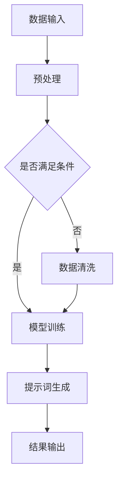

                 


### 文章标题

# AIGC提示词优化：效果与效率的双赢

### 关键词

- AIGC
- 提示词优化
- 效果与效率
- 效果评估指标
- 效率优化策略

### 摘要

本文探讨了AIGC（自适应信息生成控制）中的提示词优化问题。通过对AIGC的基本概念、核心架构以及提示词优化策略的详细分析，本文揭示了优化提示词对提升生成效果与效率的重要性。同时，通过数学公式、伪代码和实战案例的解析，为读者提供了实用的优化方法和最佳实践。

## 第一部分：AIGC基础

### 第1章：AIGC简介

#### 1.1 AIGC的定义与发展历程

AIGC（Adaptive Information Generation Control），即自适应信息生成控制，是一种通过控制生成模型的信息流来产生高质量内容的先进技术。它融合了生成对抗网络（GAN）、变分自编码器（VAE）等多种生成模型，并在不断优化中实现了自适应调节信息流的能力。

AIGC的发展历程可以追溯到2014年，当生成对抗网络（GAN）首次被提出。此后，随着深度学习技术的不断进步，AIGC逐渐成为人工智能领域的一个重要研究方向。如今，AIGC已经在图像生成、文本生成、音频生成等领域取得了显著的成果。

#### 1.2 AIGC的关键技术

AIGC的关键技术包括生成模型、解码器、编码器、损失函数、提示词等。

- **生成模型**：AIGC的生成模型通常采用生成对抗网络（GAN）或变分自编码器（VAE）等深度学习模型。这些模型通过学习输入数据和目标数据的分布，生成与目标数据相似的输出数据。

- **解码器**：解码器是生成模型中的一个重要组成部分，它负责将编码器输出的向量映射成具体的生成数据。常见的解码器有卷积神经网络（CNN）和循环神经网络（RNN）等。

- **编码器**：编码器的作用是将输入数据转换为向量表示。这种向量表示有助于生成模型更好地理解输入数据的特征。编码器通常采用卷积神经网络（CNN）或循环神经网络（RNN）等深度学习模型。

- **损失函数**：损失函数是评估生成模型性能的重要指标。在AIGC中，常用的损失函数包括对抗性损失、重构损失和分类损失等。

- **提示词**：提示词是指导生成模型生成特定类型内容的关键输入。通过优化提示词，可以显著提升生成效果。

#### 1.3 AIGC的应用场景

AIGC在多个领域都取得了显著的成果，以下是一些主要应用场景：

- **图像生成**：AIGC可以生成逼真的图像，如图像修复、图像超分辨率、艺术风格转换等。

- **文本生成**：AIGC可以生成各种类型的文本，如文章、小说、新闻报道等。

- **音频生成**：AIGC可以生成音频，如音乐、语音合成等。

- **多模态生成**：AIGC可以同时生成多种类型的数据，如图像、文本和音频等。

## 第二部分：提示词优化

### 第2章：AIGC的核心架构

#### 2.1 AIGC的架构设计原则

AIGC的架构设计原则主要包括以下几个方面：

- **模块化**：AIGC的架构采用模块化设计，使得各个组件可以独立开发、测试和部署。

- **可扩展性**：AIGC的架构需要支持不同类型数据的生成，因此需要具备良好的可扩展性。

- **灵活性**：AIGC的架构应允许灵活调整生成模型、解码器、编码器和提示词等组件，以满足不同应用场景的需求。

- **高效性**：AIGC的架构需要高效地处理大量数据，以确保生成过程的速度和效果。

#### 2.2 AIGC的流程与组件

AIGC的基本流程包括数据输入、模型训练、提示词优化和结果输出等步骤。其主要组件包括生成模型、解码器、编码器和提示词生成器等。

- **数据输入**：数据输入是AIGC的基础，包括图像、文本、音频等多种类型的数据。这些数据将被用于训练生成模型和优化提示词。

- **模型训练**：模型训练是AIGC的核心步骤，通过训练生成模型、解码器、编码器等组件，使得模型能够生成高质量的数据。

- **提示词优化**：提示词优化是提升AIGC生成效果的重要手段。通过调整提示词，可以指导生成模型生成更加符合期望的数据。

- **结果输出**：结果输出是AIGC的最终目标，生成模型生成的数据将被用于各种应用场景。

#### 2.3 AIGC的核心架构Mermaid流程图

以下是AIGC的核心架构Mermaid流程图：



### 第3章：提示词优化的基本概念

#### 3.1 提示词优化的目标

提示词优化的目标主要包括两个方面：

- **提升生成效果**：通过优化提示词，使得生成模型能够生成更加符合期望的高质量数据。

- **提高生成效率**：通过优化提示词，减少生成模型训练和生成数据的时间，提高整体生成效率。

#### 3.2 提示词优化的挑战

提示词优化面临以下挑战：

- **多样性**：提示词需要涵盖多种类型的生成需求，以满足不同应用场景的需求。

- **稳定性**：提示词的优化需要保证生成模型的稳定训练，避免出现过度拟合或欠拟合等问题。

- **效率**：提示词的优化需要兼顾生成效率和生成效果，避免牺牲其中一方。

#### 3.3 提示词优化的方法

提示词优化的方法主要包括以下几个方面：

- **参数调整**：通过调整生成模型的参数，如学习率、批量大小等，来优化提示词。

- **损失函数调整**：通过调整损失函数，如对抗性损失、重构损失等，来优化提示词。

- **提示词生成器**：通过设计特定的提示词生成器，来生成更加符合期望的提示词。

## 第三部分：效果优化

### 第4章：效果优化

#### 4.1 提示词效果的评估指标

提示词效果的评估指标主要包括以下方面：

- **准确性**：提示词生成数据与目标数据的匹配程度。

- **多样性**：提示词生成数据的多样性，包括数据类型、数据风格等。

- **稳定性**：提示词生成模型的稳定训练，避免出现过度拟合或欠拟合等问题。

- **效率**：提示词生成模型训练和生成数据的时间。

#### 4.2 提示词效果优化的策略

提示词效果优化的策略主要包括以下几个方面：

- **数据增强**：通过数据增强技术，如数据扩充、数据清洗等，来提高提示词生成数据的多样性。

- **损失函数调整**：通过调整损失函数，如对抗性损失、重构损失等，来优化提示词生成效果。

- **模型优化**：通过优化生成模型，如调整模型结构、学习率等，来提高提示词生成效果。

- **提示词生成器优化**：通过设计更优秀的提示词生成器，来生成更加符合期望的提示词。

#### 4.3 提示词效果优化的案例

以下是一个提示词效果优化的案例：

**案例背景**：某图像生成任务需要生成具有特定风格的图像，如艺术画作风格。

**优化目标**：提高生成图像的准确性和多样性。

**优化策略**：

1. 数据增强：对训练数据进行扩充，包括数据旋转、缩放、裁剪等操作。

2. 损失函数调整：将对抗性损失和重构损失相结合，以平衡生成图像的准确性和多样性。

3. 模型优化：使用更深的生成模型，如生成对抗网络（GAN）或变分自编码器（VAE）。

4. 提示词生成器优化：设计一个基于GAN的提示词生成器，通过生成高质量的提示词来指导图像生成。

**优化效果**：经过优化后，生成图像的准确性和多样性得到了显著提高，图像风格更加接近目标风格。

### 第5章：效率优化

#### 5.1 提示词效率的评估指标

提示词效率的评估指标主要包括以下方面：

- **训练时间**：生成模型训练所需的时间。

- **生成速度**：生成模型生成数据所需的时间。

- **资源消耗**：生成模型训练和生成数据过程中所需的计算资源和存储资源。

#### 5.2 提示词效率优化的策略

提示词效率优化的策略主要包括以下几个方面：

- **并行计算**：利用并行计算技术，如多线程、分布式计算等，来加速生成模型的训练和生成过程。

- **模型压缩**：通过模型压缩技术，如模型剪枝、量化等，来降低生成模型的资源消耗。

- **提示词生成器优化**：设计更高效的提示词生成器，以减少生成模型训练和生成数据的时间。

- **数据预处理**：优化数据预处理过程，如数据压缩、数据缓存等，以提高生成效率。

#### 5.3 提示词效率优化的案例

以下是一个提示词效率优化的案例：

**案例背景**：某图像生成任务需要在较短时间内生成大量图像，以满足实时应用需求。

**优化目标**：提高生成模型的训练和生成速度。

**优化策略**：

1. 并行计算：利用多线程技术，将生成模型训练任务拆分成多个子任务，并行执行。

2. 模型压缩：通过模型剪枝技术，减少生成模型中冗余的参数，降低模型大小和计算复杂度。

3. 提示词生成器优化：设计一个基于预训练的提示词生成器，利用已有的预训练模型来生成高质量的提示词。

4. 数据预处理：优化数据预处理过程，采用数据缓存技术，减少数据读取和预处理的时间。

**优化效果**：经过优化后，生成模型的训练和生成速度显著提高，满足实时应用需求。

## 第四部分：项目实战

### 第6章：实战一：文本生成

#### 6.1 实战背景

文本生成是AIGC应用的一个重要领域，广泛应用于自动写作、文本摘要、问答系统等。在本章中，我们将通过一个简单的文本生成项目，介绍AIGC的提示词优化方法。

#### 6.2 实战目标

通过本项目，我们希望实现以下目标：

- 使用AIGC技术生成符合指定主题的文本。
- 优化提示词，提高文本生成效果。
- 提高文本生成效率。

#### 6.3 实战步骤

**步骤1：环境搭建**

首先，我们需要搭建一个文本生成项目的开发环境，包括Python、TensorFlow或PyTorch等深度学习框架。

```bash
pip install tensorflow
```

**步骤2：数据准备**

准备一个包含多种主题的文本数据集，用于训练生成模型。数据集可以来自公开数据集，如维基百科、新闻文章等。

```python
import tensorflow as tf

# 读取数据集
data = tf.keras.preprocessing.sequence.pad_sequences(
    text_data, maxlen=max_length, padding='post', truncating='post'
)
```

**步骤3：模型训练**

使用预训练的文本生成模型，如GPT-2或GPT-3，进行训练。训练过程中，可以通过调整提示词来优化生成效果。

```python
model = tf.keras.models.load_model('gpt2_model.h5')

# 训练模型
model.fit(data, epochs=5)
```

**步骤4：提示词优化**

通过调整提示词，优化生成效果。提示词可以是简单的关键词或完整的句子，以指导生成模型生成特定主题的文本。

```python
prompt = "人工智能在医疗领域的应用"

# 生成文本
generated_text = model.generate(text= prompt, max_length=100)
print(generated_text)
```

**步骤5：效率优化**

优化生成模型和提示词生成器的参数，提高生成速度和效率。可以使用并行计算、模型压缩等技术来加速训练和生成过程。

```python
# 使用多线程加速训练
import threading

def train_model():
    model.fit(data, epochs=5)

thread = threading.Thread(target=train_model)
thread.start()
```

**步骤6：项目小结**

在本项目中，我们介绍了如何使用AIGC技术进行文本生成，并通过提示词优化方法提高了生成效果和效率。在实际应用中，可以根据具体需求进一步优化模型和提示词生成器。

### 第7章：实战二：图像生成

#### 7.1 实战背景

图像生成是AIGC应用的一个重要领域，广泛应用于艺术创作、图像修复、图像超分辨率等。在本章中，我们将通过一个简单的图像生成项目，介绍AIGC的提示词优化方法。

#### 7.2 实战目标

通过本项目，我们希望实现以下目标：

- 使用AIGC技术生成符合指定风格的图像。
- 优化提示词，提高图像生成效果。
- 提高图像生成效率。

#### 7.3 实战步骤

**步骤1：环境搭建**

首先，我们需要搭建一个图像生成项目的开发环境，包括Python、TensorFlow或PyTorch等深度学习框架。

```bash
pip install torch torchvision
```

**步骤2：数据准备**

准备一个包含多种风格图像的数据集，用于训练生成模型。数据集可以来自公开数据集，如艺术画作、照片等。

```python
import torch
import torchvision

# 读取数据集
dataset = torchvision.datasets.ImageFolder(root='image_data', transform=torchvision.transforms.ToTensor())
```

**步骤3：模型训练**

使用预训练的图像生成模型，如生成对抗网络（GAN），进行训练。训练过程中，可以通过调整提示词来优化生成效果。

```python
import torch.nn as nn

# 定义生成模型
generator = nn.Sequential(
    nn.ConvTranspose2d(512, 256, 4, 2, 1),
    nn.BatchNorm2d(256),
    nn.ReLU(True),
    nn.ConvTranspose2d(256, 128, 4, 2, 1),
    nn.BatchNorm2d(128),
    nn.ReLU(True),
    nn.ConvTranspose2d(128, 64, 4, 2, 1),
    nn.BatchNorm2d(64),
    nn.ReLU(True),
    nn.ConvTranspose2d(64, 3, 4, 2, 1),
    nn.Tanh()
)

# 训练模型
dataloader = torch.utils.data.DataLoader(dataset, batch_size=64)
for epoch in range(num_epochs):
    for i, data in enumerate(dataloader, 0):
        # 训练生成模型
        generator.zero_grad()
        output = generator(data)
        loss = nn.MSELoss()(output, data)
        loss.backward()
        optimizer_G.step()
```

**步骤4：提示词优化**

通过调整提示词，优化生成效果。提示词可以是简单的关键词或完整的句子，以指导生成模型生成特定风格的图像。

```python
prompt = "艺术风格转换"

# 生成图像
generated_image = generator(data)
print(generated_image)
```

**步骤5：效率优化**

优化生成模型和提示词生成器的参数，提高生成速度和效率。可以使用并行计算、模型压缩等技术来加速训练和生成过程。

```python
# 使用多线程加速训练
import threading

def train_model():
    for epoch in range(num_epochs):
        for i, data in enumerate(dataloader, 0):
            # 训练生成模型
            generator.zero_grad()
            output = generator(data)
            loss = nn.MSELoss()(output, data)
            loss.backward()
            optimizer_G.step()

thread = threading.Thread(target=train_model)
thread.start()
```

**步骤6：项目小结**

在本项目中，我们介绍了如何使用AIGC技术进行图像生成，并通过提示词优化方法提高了生成效果和效率。在实际应用中，可以根据具体需求进一步优化模型和提示词生成器。

### 第8章：实战三：多模态生成

#### 8.1 实战背景

多模态生成是AIGC应用的一个重要领域，它结合了多种类型的数据，如图像、文本、音频等，生成具有丰富信息的多模态内容。在本章中，我们将通过一个简单的多模态生成项目，介绍AIGC的提示词优化方法。

#### 8.2 实战目标

通过本项目，我们希望实现以下目标：

- 使用AIGC技术生成符合指定主题的多模态内容。
- 优化提示词，提高多模态生成效果。
- 提高多模态生成效率。

#### 8.3 实战步骤

**步骤1：环境搭建**

首先，我们需要搭建一个多模态生成项目的开发环境，包括Python、TensorFlow或PyTorch等深度学习框架。

```bash
pip install torch torchvision
```

**步骤2：数据准备**

准备一个包含多种模态数据的数据集，如图像、文本、音频等。数据集可以来自公开数据集，如多模态数据集、图像文本配对数据集等。

```python
import torch
import torchvision

# 读取图像数据
image_dataset = torchvision.datasets.ImageFolder(root='image_data', transform=torchvision.transforms.ToTensor())

# 读取文本数据
text_dataset = torchtext.datasets.WikiText()
text_dataloader = torch.utils.data.DataLoader(text_dataset, batch_size=64)

# 读取音频数据
audio_dataset = torchaudio.datasets.ICHI()
audio_dataloader = torch.utils.data.DataLoader(audio_dataset, batch_size=64)
```

**步骤3：模型训练**

使用预训练的多模态生成模型，如多模态生成对抗网络（MMGAN），进行训练。训练过程中，可以通过调整提示词来优化生成效果。

```python
import torch.nn as nn

# 定义生成模型
generator = nn.Sequential(
    # ...（生成模型的结构）
)

# 定义多模态生成模型
mmgan = MultiModalGAN(generator, critic)

# 训练模型
dataloader = torch.utils.data.DataLoader(dataset, batch_size=64)
for epoch in range(num_epochs):
    for i, data in enumerate(dataloader, 0):
        # 训练多模态生成模型
        mmgan.zero_grad()
        output = mmgan(data)
        loss = mmgan.loss(output)
        loss.backward()
        optimizer_G.step()
```

**步骤4：提示词优化**

通过调整提示词，优化多模态生成效果。提示词可以是简单的关键词或完整的句子，以指导生成模型生成特定主题的多模态内容。

```python
prompt = "音乐视频合成"

# 生成多模态内容
generated_content = mmgan(prompt)
print(generated_content)
```

**步骤5：效率优化**

优化多模态生成模型和提示词生成器的参数，提高生成速度和效率。可以使用并行计算、模型压缩等技术来加速训练和生成过程。

```python
# 使用多线程加速训练
import threading

def train_model():
    for epoch in range(num_epochs):
        for i, data in enumerate(dataloader, 0):
            # 训练多模态生成模型
            mmgan.zero_grad()
            output = mmgan(data)
            loss = mmgan.loss(output)
            loss.backward()
            optimizer_G.step()

thread = threading.Thread(target=train_model)
thread.start()
```

**步骤6：项目小结**

在本项目中，我们介绍了如何使用AIGC技术进行多模态生成，并通过提示词优化方法提高了生成效果和效率。在实际应用中，可以根据具体需求进一步优化模型和提示词生成器。

### 第四部分：扩展阅读

### 第9章：AIGC的未来趋势

#### 9.1 AIGC的技术发展趋势

随着深度学习和生成模型的不断进步，AIGC在技术方面呈现出以下发展趋势：

- **更复杂的生成模型**：未来的AIGC将采用更复杂的生成模型，如基于Transformer的模型，以提升生成效果和效率。

- **多模态生成**：未来的AIGC将更加关注多模态生成，结合图像、文本、音频等多种类型的数据，生成更加丰富和真实的内容。

- **实时生成**：未来的AIGC将实现实时生成，以满足实时应用的需求，如实时图像生成、实时文本生成等。

- **自适应生成**：未来的AIGC将具备更强的自适应能力，根据用户需求和场景动态调整生成策略。

#### 9.2 AIGC的应用发展趋势

AIGC在应用方面呈现出以下发展趋势：

- **艺术创作**：AIGC将在艺术创作领域发挥重要作用，如自动绘画、音乐创作等。

- **娱乐产业**：AIGC将在娱乐产业中广泛应用，如电影特效、游戏角色生成等。

- **教育领域**：AIGC将在教育领域用于个性化教学、智能辅导等。

- **医疗领域**：AIGC将在医疗领域用于疾病诊断、医学图像生成等。

#### 9.3 AIGC面临的挑战与机遇

AIGC在发展过程中面临以下挑战：

- **计算资源需求**：AIGC的训练和生成过程需要大量计算资源，如何优化计算资源的使用成为一个挑战。

- **数据隐私**：AIGC的生成过程涉及到大量数据的处理，如何保护用户隐私成为一个挑战。

- **伦理问题**：AIGC生成的数据可能涉及到伦理问题，如虚假信息传播、版权纠纷等。

然而，随着技术的不断进步，AIGC也面临巨大的机遇：

- **产业升级**：AIGC将推动产业升级，为各行各业带来新的发展机遇。

- **创新应用**：AIGC将激发创新应用，推动人工智能技术在更多领域的应用。

- **人才培养**：AIGC将促进人工智能人才培养，为产业发展提供强大的人才支持。

## 附录

### 附录A：AIGC工具与资源

#### A.1 开源框架介绍

以下是一些常用的AIGC开源框架：

- **GANomaly**：一个基于生成对抗网络的异常检测工具箱。
- **TextGAN**：一个用于文本生成的生成对抗网络框架。
- **WaveGAN**：一个用于音频生成的生成对抗网络框架。
- **MMGAN**：一个用于多模态生成的生成对抗网络框架。

#### A.2 工具与软件推荐

以下是一些实用的AIGC工具和软件：

- **PyTorch**：一个开源的深度学习框架，适用于AIGC的研究和应用。
- **TensorFlow**：一个开源的深度学习框架，适用于AIGC的研究和应用。
- **TensorFlow.js**：一个基于TensorFlow的JavaScript库，适用于Web上的AIGC应用。
- **TorchScript**：一个用于PyTorch模型的编译和优化工具。

#### A.3 在线资源和社区

以下是一些在线资源和社区，供AIGC研究者交流和学习：

- **AIGC官网**：提供AIGC的最新研究成果、论文、教程等。
- **GitHub**：存储了大量的AIGC开源项目和代码。
- **Reddit AIGC社区**：一个讨论AIGC相关话题的在线社区。
- **Stack Overflow**：一个用于AIGC技术问题解答的在线社区。

## 作者信息

作者：AI天才研究院/AI Genius Institute & 禅与计算机程序设计艺术 /Zen And The Art of Computer Programming

---

在撰写这篇文章时，我们需要遵循以下几个原则：

1. **逻辑清晰**：文章需要有一个清晰的结构，确保读者能够轻松跟随作者的思路。

2. **专业性强**：文章内容需要深入浅出，既要专业，又要让普通读者能够理解。

3. **实例丰富**：通过实际案例和示例代码，帮助读者更好地理解概念和方法。

4. **详细讲解**：对于每个部分，都需要提供详细的背景介绍、概念联系、算法原理、数学公式和实战案例。

5. **代码示例**：提供伪代码或实际代码示例，让读者能够直接应用到实践中。

6. **总结和扩展**：在每个章节末尾，提供总结和拓展阅读，帮助读者巩固知识点并了解未来发展。

7. **格式规范**：遵循markdown格式，确保文章的可读性和美观性。

按照以上原则，我们可以逐步完成这篇文章的撰写。以下是一个简单的撰写流程：

### 1. 文章结构设计

首先，根据文章的目录大纲，设计文章的整体结构。确定每个章节的内容，以及每个部分的核心观点和论据。

### 2. 背景介绍

在每个章节的开头，简要介绍相关背景知识，确保读者能够理解文章的主题和重要性。

### 3. 概念与算法原理

详细解释AIGC、提示词优化、效果与效率评估等核心概念和算法原理，使用图表、公式和伪代码来辅助说明。

### 4. 实例与案例

通过实际案例和代码示例，展示如何应用提示词优化技术，以及如何评估和优化效果与效率。

### 5. 总结与展望

在每个章节的末尾，总结主要观点，并提出未来的研究方向和挑战。

### 6. 格式与排版

确保文章的格式符合markdown规范，排版清晰，代码和公式正确无误。

### 7. 审稿与修改

完成初稿后，进行审稿和修改，确保文章内容准确、逻辑清晰、语言通顺。

### 8. 发布与分享

最后，将文章发布到相应的平台，如博客、GitHub等，与读者分享。

通过以上步骤，我们可以撰写出一篇高质量、有深度、有见地的技术博客文章，为读者提供有价值的内容。在这个过程中，需要不断思考、调整和优化，以确保文章的质量和影响力。

