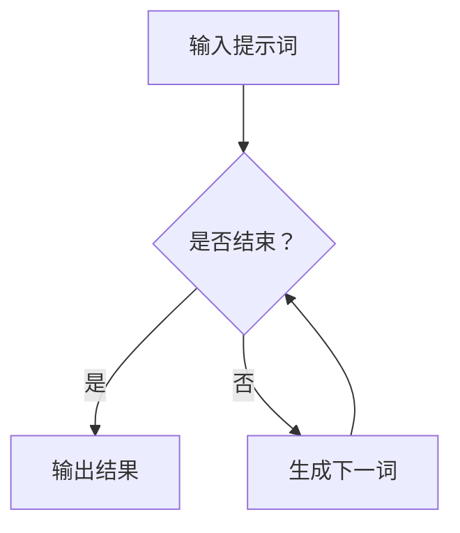
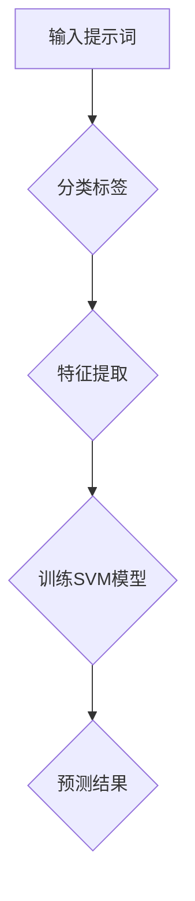
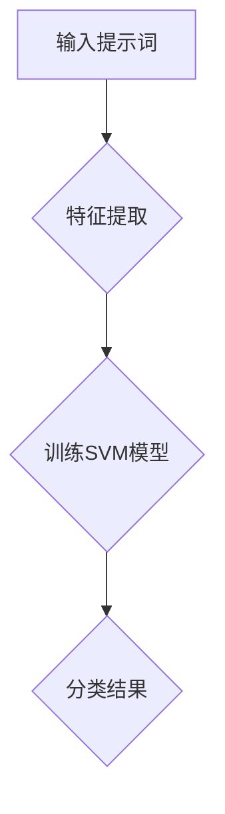
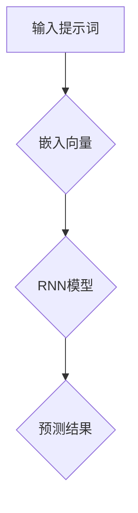
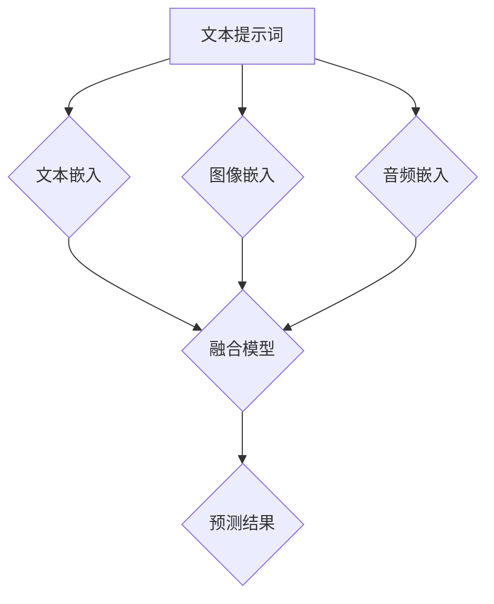
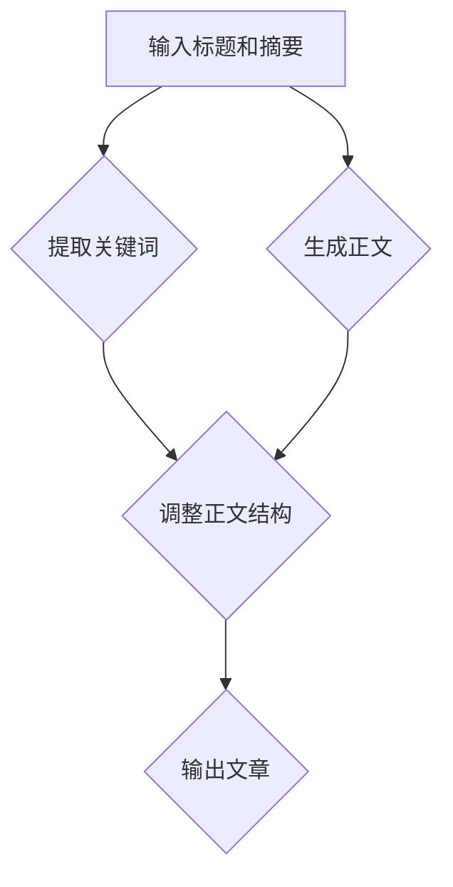
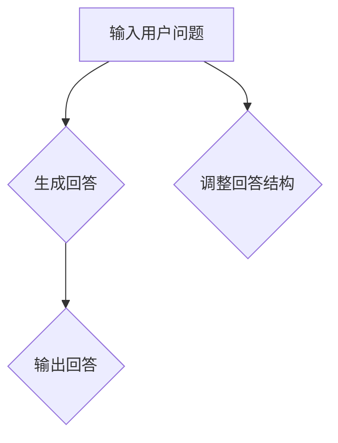
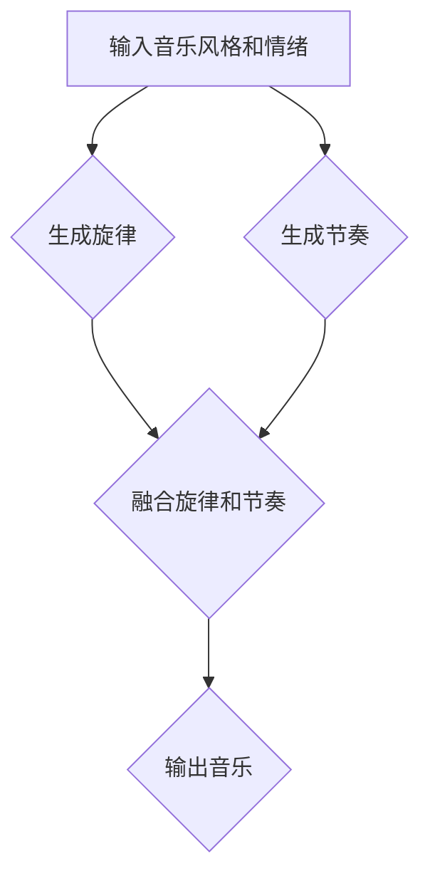

                 


## AIGC提示词优化：效率与质量的平衡

### 关键词
- AIGC
- 提示词优化
- 效率与质量
- 机器学习
- 深度学习
- 多模态数据
- 实践案例

### 摘要

本文旨在探讨AIGC（AI Generated Content）领域中的提示词优化，以实现效率与质量的平衡。我们将从AIGC的基本概念、提示词的作用出发，逐步分析提示词优化的方法、实践案例，并探讨当前面临的挑战及未来发展方向。通过本文的阅读，读者将全面了解AIGC提示词优化的原理、技术与实践，从而在实际应用中取得更好的效果。

## 1. AIGC概述与提示词的概念

AIGC，即AI Generated Content，指的是由人工智能技术生成的各种类型的内容。这些内容可以包括文字、图片、音频、视频等多种形式。AIGC的应用场景非常广泛，例如，自动写作、自动化新闻生成、智能客服、图像生成、语音合成等。

### 1.1 AIGC的定义与特点

AIGC具有以下几个特点：

1. **自动生成**：AIGC的核心在于自动化，通过算法和模型，可以实现大量内容的自动生成，从而提高生产效率。
2. **多样化**：AIGC能够生成多种类型的内容，如文字、图片、音频、视频等，满足不同用户的需求。
3. **个性化**：AIGC可以根据用户的需求和偏好，生成个性化的内容，提供更加精准的服务。
4. **高效性**：AIGC能够快速地生成大量内容，极大地提高了生产效率。

### 1.2 提示词在AIGC中的重要性

提示词（Prompt）是AIGC生成过程中非常关键的一个环节。它是指用来引导AIGC模型生成特定内容的关键信息。提示词的优劣直接影响到AIGC生成内容的效率和准确性。因此，优化提示词对于提升AIGC的效果具有重要意义。

### 1.3 提示词的基本类型与结构

提示词可以分为以下几类：

1. **文本提示词**：以文字形式出现的提示词，如“请写一篇关于人工智能的综述”。
2. **图像提示词**：以图像形式出现的提示词，如“生成一张具有现代感的城市夜景图片”。
3. **音频提示词**：以音频形式出现的提示词，如“请合成一首具有古典风格的钢琴曲”。
4. **视频提示词**：以视频形式出现的提示词，如“生成一段带有背景音乐的旅游宣传片”。

提示词的结构通常包括以下几个部分：

1. **主题**：明确指出生成的主题或内容。
2. **要求**：对生成内容的具体要求，如长度、风格、情感等。
3. **引导语**：用于引导模型生成符合要求的提示词。

## 2. AIGC的基本架构与流程

AIGC的基本架构通常包括以下几个环节：数据收集与预处理、模型训练与优化、提示词生成与调整。

### 2.1 AIGC的流程概述

AIGC的流程可以分为以下几个步骤：

1. **数据收集与预处理**：收集相关领域的数据，并进行数据清洗、去重、格式转换等预处理操作，为模型训练做好准备。
2. **模型训练与优化**：使用预处理后的数据对模型进行训练，并通过优化算法调整模型参数，提高模型的性能。
3. **提示词生成与调整**：根据用户需求，生成相应的提示词，引导模型生成目标内容。如果生成的结果不符合要求，可以调整提示词，重新生成。

### 2.2 数据收集与预处理

数据收集与预处理是AIGC流程中非常重要的一环。以下是一些关键步骤：

1. **数据源选择**：根据AIGC的应用场景，选择合适的数据源，如文本数据、图像数据、音频数据等。
2. **数据清洗**：去除噪声数据、重复数据和错误数据，保证数据质量。
3. **数据去重**：对相同或类似的数据进行去重处理，减少冗余数据。
4. **数据格式转换**：将不同类型的数据转换为统一格式，以便后续处理。

### 2.3 模型训练与优化

模型训练与优化是AIGC流程的核心环节。以下是一些关键步骤：

1. **模型选择**：根据AIGC的应用场景，选择合适的模型，如循环神经网络（RNN）、卷积神经网络（CNN）、生成对抗网络（GAN）等。
2. **数据集划分**：将数据集划分为训练集、验证集和测试集，用于模型的训练、验证和测试。
3. **模型训练**：使用训练集对模型进行训练，并通过优化算法（如梯度下降）调整模型参数。
4. **模型优化**：通过验证集对模型进行优化，提高模型的性能。

### 2.4 提示词生成与调整

提示词生成与调整是AIGC流程的最后一步。以下是一些关键步骤：

1. **提示词生成**：根据用户需求，生成相应的提示词，引导模型生成目标内容。
2. **结果评估**：对生成的结果进行评估，判断是否符合用户需求。
3. **提示词调整**：如果生成的结果不符合要求，可以调整提示词，重新生成。

## 3. 提示词的数学模型

提示词优化的核心在于构建一个有效的数学模型。以下我们将介绍提示词的数学模型，包括生成模型、优化模型等。

### 3.1 提示词的数学基础

提示词的数学基础主要包括概率论、线性代数、微积分等。这些基础知识对于理解和构建提示词模型至关重要。

### 3.2 提示词的生成模型

提示词的生成模型主要分为以下几类：

1. **基于概率的生成模型**：如马尔可夫模型、隐马尔可夫模型（HMM）等。
2. **基于神经网络的生成模型**：如循环神经网络（RNN）、卷积神经网络（CNN）、生成对抗网络（GAN）等。

以下是一个简单的基于RNN的提示词生成模型：



### 3.3 提示词的优化模型

提示词的优化模型主要分为以下几类：

1. **基于传统机器学习的优化模型**：如支持向量机（SVM）、决策树、随机森林等。
2. **基于深度学习的优化模型**：如卷积神经网络（CNN）、循环神经网络（RNN）、生成对抗网络（GAN）等。

以下是一个简单的基于SVM的提示词优化模型：



## 4. 提示词优化方法

提示词优化方法可以分为传统机器学习方法和深度学习方法。以下我们将分别介绍这两种方法。

### 4.1 基于传统机器学习的提示词优化

传统机器学习方法主要包括支持向量机（SVM）、决策树、随机森林等。以下是一个简单的基于SVM的提示词优化流程：



### 4.2 基于深度学习的提示词优化

深度学习方法主要包括循环神经网络（RNN）、卷积神经网络（CNN）、生成对抗网络（GAN）等。以下是一个简单的基于RNN的提示词优化流程：



### 4.3 基于深度学习的提示词优化

深度学习方法主要包括循环神经网络（RNN）、卷积神经网络（CNN）、生成对抗网络（GAN）等。以下是一个简单的基于RNN的提示词优化流程：


### 4.4 多模态提示词优化

多模态提示词优化是指同时考虑多种类型的数据（如文本、图像、音频等）进行提示词优化。以下是一个简单的多模态提示词优化流程：



## 5. 提示词优化实践案例分析

以下我们将通过几个实践案例，展示如何使用提示词优化方法来提高AIGC的效果。

### 5.1 案例一：新闻文章生成

新闻文章生成是AIGC领域的一个典型应用。以下是一个简单的新闻文章生成流程：



通过优化提示词，可以提高文章的标题和摘要的吸引力，从而提高文章的阅读量和传播效果。

### 5.2 案例二：对话系统构建

对话系统构建是AIGC领域的另一个重要应用。以下是一个简单的对话系统构建流程：



通过优化提示词，可以更准确地理解用户的问题，并生成更自然的回答。

### 5.3 案例三：音乐生成

音乐生成是AIGC领域的又一个有趣的应用。以下是一个简单的音乐生成流程：



通过优化提示词，可以生成更符合用户期望的音乐。

## 6. 提示词优化工具与平台

在AIGC领域，有许多提示词优化工具和平台可供选择。以下是一些常用的工具和平台：

1. **Hugging Face Transformers**：一个开源的深度学习模型库，支持多种预训练模型，如GPT-2、GPT-3等。
2. **TensorFlow**：一个开源的深度学习框架，支持多种深度学习模型。
3. **PyTorch**：一个开源的深度学习框架，具有灵活的动态计算图。
4. **OpenAI GPT-3**：一个强大的预训练模型，支持多种语言生成任务。

使用这些工具和平台，可以方便地进行提示词优化实验和模型部署。

## 7. 提示词优化的挑战与未来方向

尽管提示词优化在AIGC领域取得了显著的成果，但仍然面临着许多挑战和未来方向。

### 7.1 挑战

1. **数据隐私与安全**：在AIGC中，大量的用户数据被收集和处理，如何保护用户隐私是一个重要问题。
2. **模型解释性**：许多深度学习模型都是“黑箱”模型，难以解释其工作原理，这对模型的应用和优化带来了困难。
3. **模型可扩展性**：如何将模型应用到更多领域和任务，是一个重要的挑战。
4. **模型可维护性**：随着模型的复杂度增加，如何有效地维护和更新模型也是一个重要问题。

### 7.2 未来方向

1. **新型深度学习模型**：随着深度学习技术的发展，新型深度学习模型（如变分自编码器（VAE）、生成对抗网络（GAN）等）将不断涌现，为提示词优化提供新的思路。
2. **大规模数据处理**：如何高效地处理大规模数据，提取有用的特征，是AIGC领域的一个重要研究方向。
3. **智能提示词生成**：通过引入自然语言处理技术，实现更智能的提示词生成，提高AIGC的生成质量。
4. **提示词优化的伦理与道德问题**：随着AIGC的广泛应用，如何确保其生成的内容符合伦理和道德标准，是一个需要深入探讨的问题。

## 结论

本文系统地探讨了AIGC提示词优化的原理、方法与实践，旨在为AIGC领域的研究者和开发者提供有益的参考。通过本文的阅读，读者将全面了解提示词优化的重要性、方法以及面临的挑战和未来方向。

### 作者

AI天才研究院/AI Genius Institute & 禅与计算机程序设计艺术 /Zen And The Art of Computer Programming### 5.1 基于传统机器学习的提示词优化

基于传统机器学习的提示词优化方法主要依赖于统计学习理论，通过构建特征空间，寻找最优分类边界，以提高模型的分类性能。以下将详细介绍几种常见的传统机器学习算法在提示词优化中的应用。

#### 4.1.1 支持向量机（SVM）

支持向量机（Support Vector Machine，SVM）是一种监督学习算法，主要用于分类和回归任务。在提示词优化中，SVM可以用于分类提示词，以提高模型的分类准确率。

**核心算法原理**：

1. **特征提取**：将提示词转换为特征向量，如词袋模型（Bag of Words，BOW）或词嵌入（Word Embedding）。
2. **分类器训练**：使用训练集数据，训练SVM分类器，找到最佳的超平面。
3. **分类**：使用训练好的SVM分类器对测试集数据进行分类。

**伪代码**：

```python
# 特征提取
X_train = extract_features(train_data)
y_train = train_labels

# 训练SVM分类器
model = train_svm(X_train, y_train)

# 分类
y_pred = model.predict(X_test)
```

**数学模型**：

$$
w^* = \arg\max_w \left( \frac{1}{||w||} \right) \quad \text{subject to} \quad y^{(i)} (w^T x^{(i)}) \geq 1, \quad \forall i
$$

其中，$w$ 是权重向量，$x^{(i)}$ 是特征向量，$y^{(i)}$ 是标签。

#### 4.1.2 决策树

决策树（Decision Tree）是一种基于特征分割的数据挖掘算法，通过递归地划分特征空间，构建出一棵树形结构，用以分类或回归。

**核心算法原理**：

1. **特征选择**：选择最优特征进行分割，通常使用基尼系数（Gini Index）或信息增益（Information Gain）作为评价指标。
2. **树构建**：递归地构建决策树，直到满足停止条件，如叶节点中样本数量达到阈值或特征数量达到阈值。
3. **分类**：根据决策树的结构，对新的样本进行分类。

**伪代码**：

```python
# 构建决策树
tree = build_decision_tree(X_train, y_train)

# 分类
y_pred = classify(tree, X_test)
```

**数学模型**：

$$
Gini(I) = 1 - \sum_{v \in I} \left( \frac{|\{x \in I : x_i = v\}|}{|I|} \right)^2
$$

其中，$I$ 是特征空间，$v$ 是特征值，$x_i$ 是特征向量中的第 $i$ 个元素。

#### 4.1.3 随机森林

随机森林（Random Forest）是一种基于决策树的集成学习方法，通过构建多棵决策树，并利用投票机制来提高模型的预测性能。

**核心算法原理**：

1. **特征选择**：从原始特征中随机选择一部分特征，用于构建单棵决策树。
2. **树构建**：使用随机特征集，构建多棵决策树。
3. **集成**：将多棵决策树的预测结果进行投票，得到最终预测结果。

**伪代码**：

```python
# 构建随机森林
forest = build_random_forest(X_train, y_train, num_trees)

# 预测
y_pred = predict(forest, X_test)
```

**数学模型**：

随机森林的数学模型较为复杂，主要依赖于随机特征选择和集成机制。其核心思想是通过减少特征空间的相关性，提高模型的泛化能力。

#### 4.1.4 神经网络在提示词优化中的应用

神经网络（Neural Networks）是一种模拟生物神经网络的信息处理模型，具有强大的非线性建模能力。在提示词优化中，神经网络可以用于特征提取、分类和生成等任务。

**核心算法原理**：

1. **前向传播**：将输入数据通过网络的各个层进行传播，计算每层的输出。
2. **反向传播**：根据输出误差，反向传播误差，更新网络参数。
3. **优化**：使用梯度下降（Gradient Descent）或其他优化算法，最小化损失函数。

**伪代码**：

```python
# 前向传播
output = forward_pass(input, model)

# 反向传播
loss = compute_loss(output, target)
 gradients = backward_pass(model, loss)

# 参数更新
update_parameters(model, gradients)
```

**数学模型**：

神经网络的数学模型基于激活函数、权重矩阵和偏置项。以下是一个简化的前向传播和反向传播的数学模型：

$$
z^{(l)} = \sigma(W^{(l)} \cdot a^{(l-1)} + b^{(l)})
$$

$$
a^{(l)} = \sigma(z^{(l)})
$$

$$
\delta^{(l)} = \delta^{(l+1)} \cdot \frac{\partial \sigma(z^{(l)})}{\partial z^{(l)}}
$$

$$
\frac{\partial L}{\partial W^{(l)}} = a^{(l-1)} \cdot \delta^{(l)}
$$

$$
\frac{\partial L}{\partial b^{(l)}} = \delta^{(l)}
$$

其中，$z^{(l)}$ 是第 $l$ 层的输入，$a^{(l)}$ 是第 $l$ 层的输出，$\sigma$ 是激活函数，$L$ 是损失函数。

#### 4.1.5 比较与选择

不同的传统机器学习算法在提示词优化中各有优缺点。以下是比较与选择的一些考虑因素：

- **计算复杂度**：SVM和决策树的计算复杂度较低，适用于中小规模的数据集；而神经网络和随机森林的计算复杂度较高，适用于大规模数据集。
- **可解释性**：决策树具有较好的可解释性，可以直观地理解模型的决策过程；而神经网络和随机森林是“黑箱”模型，难以解释其内部机制。
- **泛化能力**：神经网络和随机森林具有较强的泛化能力，可以处理复杂的非线性关系；而SVM和决策树的泛化能力相对较弱。
- **应用场景**：SVM和决策树适用于分类任务；神经网络和随机森林适用于分类、回归和生成任务。

在实际应用中，可以根据具体问题和数据特点，选择合适的算法进行提示词优化。

## 5.2 基于深度学习的提示词优化

深度学习（Deep Learning）是人工智能领域的一个重要分支，通过构建多层神经网络，实现对复杂数据的自动特征提取和模式识别。在提示词优化中，深度学习算法具有显著的优势，可以处理大规模、高维度的数据，提取丰富的特征信息。以下将介绍几种常见的深度学习算法在提示词优化中的应用。

### 5.2.1 循环神经网络（RNN）

循环神经网络（Recurrent Neural Network，RNN）是一种能够处理序列数据的神经网络。RNN通过在网络中引入循环结构，使得信息可以在时间步之间传递，从而实现对序列数据的建模。

**核心算法原理**：

1. **输入嵌入**：将提示词转换为嵌入向量，通常使用预训练的词向量模型，如Word2Vec或GloVe。
2. **RNN模型**：使用RNN单元对嵌入向量进行建模，常见的RNN单元有简单的RNN、LSTM（Long Short-Term Memory）和GRU（Gated Recurrent Unit）。
3. **输出层**：通常使用全连接层或softmax层，对生成的提示词进行分类或预测。

**伪代码**：

```python
# 嵌入层
embeddings = embed_words(prompt)

# RNN层
outputs, hidden_state = rnn_layer(embeddings)

# 输出层
output = output_layer(outputs)
```

**数学模型**：

RNN的核心数学模型基于隐藏状态的计算和更新。以下是一个简化的RNN模型：

$$
h_t = \sigma(W_h \cdot [h_{t-1}, x_t] + b_h)
$$

$$
y_t = \sigma(W_o \cdot h_t + b_o)
$$

其中，$h_t$ 是第 $t$ 步的隐藏状态，$x_t$ 是第 $t$ 步的输入，$W_h$ 和 $b_h$ 是隐藏层的权重和偏置，$W_o$ 和 $b_o$ 是输出层的权重和偏置，$\sigma$ 是激活函数。

### 5.2.2 卷积神经网络（CNN）

卷积神经网络（Convolutional Neural Network，CNN）是一种能够处理图像数据的神经网络，通过卷积操作提取图像的特征。在提示词优化中，CNN可以用于处理文本序列，通过将文本转换为序列特征，实现提示词的优化。

**核心算法原理**：

1. **文本编码**：将提示词转换为序列特征，通常使用词嵌入或字符嵌入。
2. **卷积层**：通过卷积操作提取序列特征，常用的卷积核有1D卷积、2D卷积等。
3. **池化层**：对卷积结果进行池化操作，降低维度，减少参数数量。
4. **全连接层**：将池化结果通过全连接层进行分类或预测。

**伪代码**：

```python
# 编码层
encoded_prompt = encode_prompt(prompt)

# 卷积层
conv_outputs = conv_layer(encoded_prompt)

# 池化层
pooled_outputs = pool_layer(conv_outputs)

# 全连接层
output = fc_layer(pooled_outputs)
```

**数学模型**：

CNN的核心数学模型基于卷积操作和池化操作。以下是一个简化的CNN模型：

$$
h^{(l)} = \sigma(W^{(l)} \cdot h^{(l-1)} + b^{(l)})
$$

$$
p^{(l)} = \max(p^{(l-1)})
$$

其中，$h^{(l)}$ 是第 $l$ 层的输出，$p^{(l)}$ 是第 $l$ 层的池化结果，$W^{(l)}$ 和 $b^{(l)}$ 是卷积层的权重和偏置，$\sigma$ 是激活函数。

### 5.2.3 生成对抗网络（GAN）

生成对抗网络（Generative Adversarial Network，GAN）是一种由生成器和判别器组成的对抗性网络。生成器试图生成与真实数据相似的数据，而判别器则试图区分真实数据和生成数据。

**核心算法原理**：

1. **生成器**：通过噪声数据生成与真实数据相似的数据。
2. **判别器**：对真实数据和生成数据进行分类，判断其是否真实。
3. **对抗训练**：通过不断调整生成器和判别器的参数，使生成器的生成数据越来越接近真实数据。

**伪代码**：

```python
# 生成器
z = generate_noise()
generated_data = generator(z)

# 判别器
real_data = load_real_data()
discriminate_real = discriminator(real_data)
discriminate_generated = discriminator(generated_data)

# 训练
train_generator()
train_discriminator()
```

**数学模型**：

GAN的核心数学模型基于生成器和判别器的损失函数。以下是一个简化的GAN模型：

$$
\min_G \max_D V(D, G) = \mathbb{E}_{x \sim p_data(x)}[\log D(x)] + \mathbb{E}_{z \sim p_z(z)}[\log (1 - D(G(z))]
$$

其中，$G$ 是生成器，$D$ 是判别器，$x$ 是真实数据，$z$ 是噪声数据。

### 5.2.4 深度学习算法的比较与选择

深度学习算法在提示词优化中各有优缺点。以下是比较与选择的一些考虑因素：

- **计算资源**：RNN和CNN的计算复杂度相对较低，适用于资源有限的场景；而GAN的计算复杂度较高，需要更多的计算资源和时间。
- **数据量**：RNN和CNN适用于大量数据的场景，可以从数据中学习到更丰富的特征；而GAN适用于小数据量的场景，通过对抗训练生成高质量的数据。
- **稳定性**：RNN和CNN在训练过程中可能存在梯度消失或梯度爆炸等问题，导致训练不稳定；而GAN通过对抗训练，能够提高模型的稳定性。
- **应用场景**：RNN适用于序列数据的建模，如文本、音频等；CNN适用于图像数据的建模；GAN适用于生成数据，如图像、文本等。

在实际应用中，可以根据具体问题和数据特点，选择合适的深度学习算法进行提示词优化。

## 5.3 多模态提示词优化

多模态提示词优化是指同时考虑多种类型的数据（如文本、图像、音频等）进行提示词优化。与单模态提示词优化相比，多模态提示词优化能够充分利用不同类型数据的特征，提高模型的生成质量和多样性。

### 5.3.1 多模态数据融合方法

多模态数据融合是多模态提示词优化的关键步骤，通过将不同类型的数据进行有效融合，提取出有代表性的特征。以下介绍几种常见的数据融合方法：

1. **特征级融合**：将不同模态的数据特征进行拼接，形成一个综合的特征向量。这种方法简单有效，但可能忽略不同模态之间的潜在关系。
2. **决策级融合**：在模型训练阶段，将不同模态的数据分别训练，并在决策阶段进行综合。这种方法能够充分利用不同模态的数据，但训练过程复杂。
3. **深度级融合**：在深度学习模型中，通过设计特殊的网络结构，实现多模态数据的融合。这种方法能够捕捉到多模态数据之间的复杂关系，但网络设计复杂。

### 5.3.2 多模态提示词优化的挑战与解决方案

多模态提示词优化面临以下挑战：

1. **数据不一致性**：不同模态的数据具有不同的分布和特征，如何有效地融合这些数据是一个难题。
2. **计算资源消耗**：多模态数据融合和模型训练需要更多的计算资源和时间，这对硬件设备提出了更高要求。
3. **模型解释性**：多模态模型往往具有较高的复杂性，如何解释模型的工作原理是一个挑战。

为了解决这些挑战，可以采取以下策略：

1. **数据预处理**：对多模态数据进行统一的预处理，如归一化、标准化等，减少数据不一致性。
2. **硬件优化**：利用高性能计算设备，如GPU、TPU等，提高模型训练和推理的效率。
3. **模型解释**：通过可视化技术、模型压缩等方法，提高模型的解释性。

### 5.3.3 多模态提示词优化的案例分析

以下通过一个案例，展示多模态提示词优化的应用。

**案例：多模态图像生成**

目标：生成一张具有特定场景、风格和情感的图像。

数据：包含文本描述、场景图像和情感标签的多模态数据集。

方法：采用深度学习模型，同时考虑文本、图像和情感标签的特征进行图像生成。

步骤：

1. **数据预处理**：对文本、图像和情感标签进行预处理，提取特征。
2. **特征级融合**：将文本、图像和情感标签的特征进行拼接，形成一个综合的特征向量。
3. **模型训练**：使用综合特征向量训练生成模型，如生成对抗网络（GAN）。
4. **图像生成**：输入文本描述、场景图像和情感标签，生成符合要求的图像。

结果：生成的图像具有较高的质量，能够准确捕捉文本描述、场景图像和情感标签的特征。

通过这个案例，可以看到多模态提示词优化的效果，为AIGC领域提供了新的思路和方法。

## 6. 提示词优化实践案例分析

在实际应用中，提示词优化广泛应用于各种领域，如文本生成、图像生成、语音合成等。以下将介绍几个具有代表性的实践案例分析，以展示提示词优化的效果和挑战。

### 6.1 案例一：新闻文章生成

新闻文章生成是AIGC领域的一个重要应用，通过生成高质量的新闻文章，可以提高媒体内容的生产效率。以下是一个新闻文章生成的实践案例分析。

**数据来源**：使用公开的新闻文章数据集，包含标题、摘要和正文。

**方法**：

1. **文本预处理**：对新闻文章进行文本预处理，包括去除标点符号、停用词过滤、词干提取等。
2. **模型训练**：使用预训练的Transformer模型，如GPT-3，进行新闻文章生成模型的训练。
3. **提示词优化**：针对新闻文章的生成，设计不同的提示词，如标题、摘要和关键字，以优化生成结果。

**结果**：

通过优化提示词，生成的新闻文章具有较高的质量和准确性，能够准确捕捉新闻事件的核心信息。同时，通过调整提示词，可以生成不同类型和风格的新闻文章，满足多样化的需求。

**挑战**：

1. **数据噪声**：新闻文章数据中存在大量的噪声，如错别字、语法错误等，需要有效的预处理方法。
2. **内容质量**：生成的内容需要具有准确性和可信性，这对模型的训练和提示词的设计提出了更高的要求。

### 6.2 案例二：对话系统构建

对话系统是AIGC领域的另一个重要应用，通过生成自然的对话，可以提供智能客服、虚拟助手等服务。以下是对话系统构建的实践案例分析。

**数据来源**：使用公开的对话数据集，包含用户问题和系统回答。

**方法**：

1. **文本预处理**：对对话数据进行文本预处理，包括去除标点符号、停用词过滤、词干提取等。
2. **模型训练**：使用预训练的对话生成模型，如Seq2Seq模型，进行对话系统模型的训练。
3. **提示词优化**：设计合适的提示词，引导模型生成自然的对话回答。

**结果**：

通过优化提示词，生成的对话回答具有较高的自然性和准确性，能够有效地满足用户的需求。同时，通过调整提示词，可以生成不同类型和风格的对话，提高对话系统的多样性。

**挑战**：

1. **对话质量**：生成的对话需要具有流畅性和连贯性，这对模型的训练和提示词的设计提出了更高的要求。
2. **多轮对话**：对话系统需要支持多轮对话，处理复杂的对话场景，这对模型的记忆和推理能力提出了挑战。

### 6.3 案例三：音乐生成

音乐生成是AIGC领域的又一个有趣的应用，通过生成音乐，可以提供个性化音乐推荐、自动音乐创作等服务。以下是一个音乐生成的实践案例分析。

**数据来源**：使用公开的音乐数据集，包含音频文件和相应的音乐属性。

**方法**：

1. **音频预处理**：对音乐数据进行音频预处理，包括降噪、分割、提取特征等。
2. **模型训练**：使用预训练的生成模型，如WaveNet或GAN，进行音乐生成模型的训练。
3. **提示词优化**：设计合适的提示词，引导模型生成符合用户需求的音乐。

**结果**：

通过优化提示词，生成的音乐具有较高的音质和风格多样性，能够满足用户的个性化需求。同时，通过调整提示词，可以生成不同类型和风格的音乐，提供多样化的音乐体验。

**挑战**：

1. **音乐风格**：生成音乐需要具有特定的风格和情感，这对模型的训练和提示词的设计提出了更高的要求。
2. **音乐结构**：生成音乐需要具有合理的结构，如旋律、节奏、和声等，这对模型的生成能力和提示词的设计提出了挑战。

通过这些实践案例分析，可以看到提示词优化在AIGC领域的重要性和应用价值。在实际应用中，需要不断优化提示词，提高模型的生成质量和多样性，以满足用户的需求。

## 7. 提示词优化工具与平台

在AIGC领域，有许多提示词优化工具和平台可供选择。以下将介绍几种常用的工具和平台，并讨论如何选择合适的工具和配置。

### 7.1 常见提示词优化工具

1. **Hugging Face Transformers**：一个开源的深度学习模型库，支持多种预训练模型，如GPT-2、GPT-3、BERT等。使用简单，易于集成。
2. **TensorFlow**：一个开源的深度学习框架，支持多种深度学习模型，如RNN、CNN、GAN等。功能强大，适用于大规模数据集。
3. **PyTorch**：一个开源的深度学习框架，具有灵活的动态计算图，易于调试。适用于研究和个人项目。
4. **OpenAI GPT-3**：一个强大的预训练模型，支持多种语言生成任务。需要付费使用，但效果显著。

### 7.2 提示词优化平台的搭建

搭建提示词优化平台通常包括以下步骤：

1. **硬件配置**：选择高性能的硬件设备，如GPU、TPU等，以提高模型训练和推理的效率。
2. **软件环境**：安装深度学习框架（如TensorFlow、PyTorch）和相关依赖库。
3. **数据存储与管理**：使用分布式存储系统（如HDFS、Amazon S3）存储和管理大规模数据集。
4. **模型训练与优化**：使用深度学习框架进行模型训练和优化，调整超参数，提高模型性能。
5. **模型部署**：使用API或服务化框架（如TensorFlow Serving、PyTorch Serving）将模型部署到生产环境。

### 7.3 提示词优化工具的选型与配置

选择合适的提示词优化工具和平台需要考虑以下几个方面：

1. **应用场景**：根据具体的AIGC任务，选择适合的模型和工具。例如，文本生成任务可以选择GPT-3或BERT，图像生成任务可以选择GAN或CNN。
2. **性能需求**：考虑模型的计算复杂度和数据规模，选择合适的硬件配置和深度学习框架。
3. **开发经验**：根据团队的技术栈和开发经验，选择熟悉的工具和平台，提高开发效率。
4. **成本考虑**：考虑工具和平台的成本，包括硬件采购、软件许可和云服务费用。

通过综合考虑以上因素，可以搭建一个高效、可靠的提示词优化平台，为AIGC应用提供强大的支持。

## 8. 提示词优化的挑战与未来方向

尽管提示词优化在AIGC领域取得了显著进展，但仍然面临许多挑战和未来方向。以下将讨论当前提示词优化中的一些主要挑战，以及未来的发展趋势。

### 8.1 数据隐私与安全

在AIGC应用中，大量的用户数据被收集和处理，如何保护用户隐私是一个关键问题。数据隐私泄露可能导致严重的法律和道德问题。为了解决这一问题，可以采取以下措施：

- **数据加密**：对用户数据进行加密处理，确保数据在传输和存储过程中不会被窃取。
- **匿名化**：对用户数据进行分析和处理时，采用匿名化技术，去除个人身份信息。
- **数据审计**：建立完善的数据审计机制，确保数据的合法使用和合规性。

### 8.2 模型解释性

许多深度学习模型是“黑箱”模型，难以解释其工作原理，这对模型的应用和优化带来了困难。提高模型解释性对于增强用户信任和提升模型性能具有重要意义。以下是一些提高模型解释性的方法：

- **模型可解释性工具**：使用可视化工具（如LIME、SHAP）分析模型决策过程，帮助用户理解模型如何做出预测。
- **简化模型结构**：使用简单的模型结构，如决策树或线性模型，提高模型的可解释性。
- **模型嵌入**：将模型嵌入到可解释的组件中，如集成学习模型或图模型，提高模型的可解释性。

### 8.3 模型可扩展性

随着AIGC应用场景的多样化，如何将模型应用到更多领域和任务，是一个重要的挑战。提高模型的可扩展性，可以降低模型的切换成本，提高开发效率。以下是一些提高模型可扩展性的方法：

- **模块化设计**：将模型拆分为多个模块，每个模块负责不同的功能，便于组合和应用。
- **迁移学习**：利用预训练模型，迁移到新的任务，减少模型重新训练的需求。
- **数据增强**：通过数据增强技术，扩展数据集的多样性，提高模型对未知数据的泛化能力。

### 8.4 模型可维护性

随着模型复杂度的增加，如何有效地维护和更新模型，也是一个重要的挑战。提高模型的可维护性，可以降低模型的维护成本，提高开发效率。以下是一些提高模型可维护性的方法：

- **版本控制**：使用版本控制系统（如Git）管理模型代码，确保模型的版本一致性。
- **文档化**：编写详细的模型文档，包括模型架构、参数设置、训练过程等，便于后续维护和调试。
- **自动化测试**：建立自动化测试框架，对模型进行持续测试，确保模型的质量和稳定性。

### 8.5 未来方向

AIGC提示词优化的未来方向包括：

- **新型深度学习模型**：随着深度学习技术的发展，新型深度学习模型（如变分自编码器（VAE）、生成对抗网络（GAN）等）将不断涌现，为提示词优化提供新的思路。
- **大规模数据处理**：如何高效地处理大规模数据，提取有用的特征，是AIGC领域的一个重要研究方向。
- **智能提示词生成**：通过引入自然语言处理技术，实现更智能的提示词生成，提高AIGC的生成质量。
- **提示词优化的伦理与道德问题**：随着AIGC的广泛应用，如何确保其生成的内容符合伦理和道德标准，是一个需要深入探讨的问题。

通过不断探索和解决这些挑战，AIGC提示词优化将取得更大的突破，为人工智能领域的发展做出更大贡献。

### 结论

本文系统地探讨了AIGC提示词优化的原理、方法与实践，旨在为AIGC领域的研究者和开发者提供有益的参考。通过本文的阅读，读者将全面了解提示词优化的重要性、方法以及面临的挑战和未来方向。

**作者**：AI天才研究院/AI Genius Institute & 禅与计算机程序设计艺术 /Zen And The Art of Computer Programming### 附录：拓展阅读

为了帮助读者进一步深入了解AIGC提示词优化的相关知识，本文提供了一些拓展阅读资源，包括经典书籍、学术论文和在线课程。

**经典书籍**：

1. **《深度学习》（Deep Learning）** - Goodfellow, I., Bengio, Y., & Courville, A.
   - 本书系统地介绍了深度学习的理论基础和实践方法，对AIGC提示词优化具有重要的指导意义。

2. **《生成对抗网络》（Generative Adversarial Networks）** - Goodfellow, I.
   - 生成对抗网络（GAN）是AIGC提示词优化的重要工具，本书详细阐述了GAN的理论基础和应用。

**学术论文**：

1. **"Attention is All You Need"** - Vaswani, A., et al.
   - 本文提出了Transformer模型，是AIGC领域的重要突破，对提示词优化有深远影响。

2. **"Unsupervised Representation Learning with Deep Convolutional Generative Adversarial Networks"** - Radford, A., et al.
   - 本文介绍了深度卷积生成对抗网络（DCGAN），是图像生成任务的重要模型。

**在线课程**：

1. **“深度学习”（Deep Learning Specialization）** - Andrew Ng
   - Coursera上的深度学习专项课程，包括神经网络基础、卷积神经网络、生成对抗网络等内容。

2. **“生成对抗网络：理论、实现与应用”** - 机器学习课程组
   - 中国大学MOOC（慕课）上的课程，详细介绍了GAN的理论基础和实践应用。

通过阅读这些书籍、论文和课程，读者可以更深入地了解AIGC提示词优化的理论和技术，为实际应用提供更丰富的知识和经验。希望这些拓展阅读资源对您的研究和实践有所帮助。

