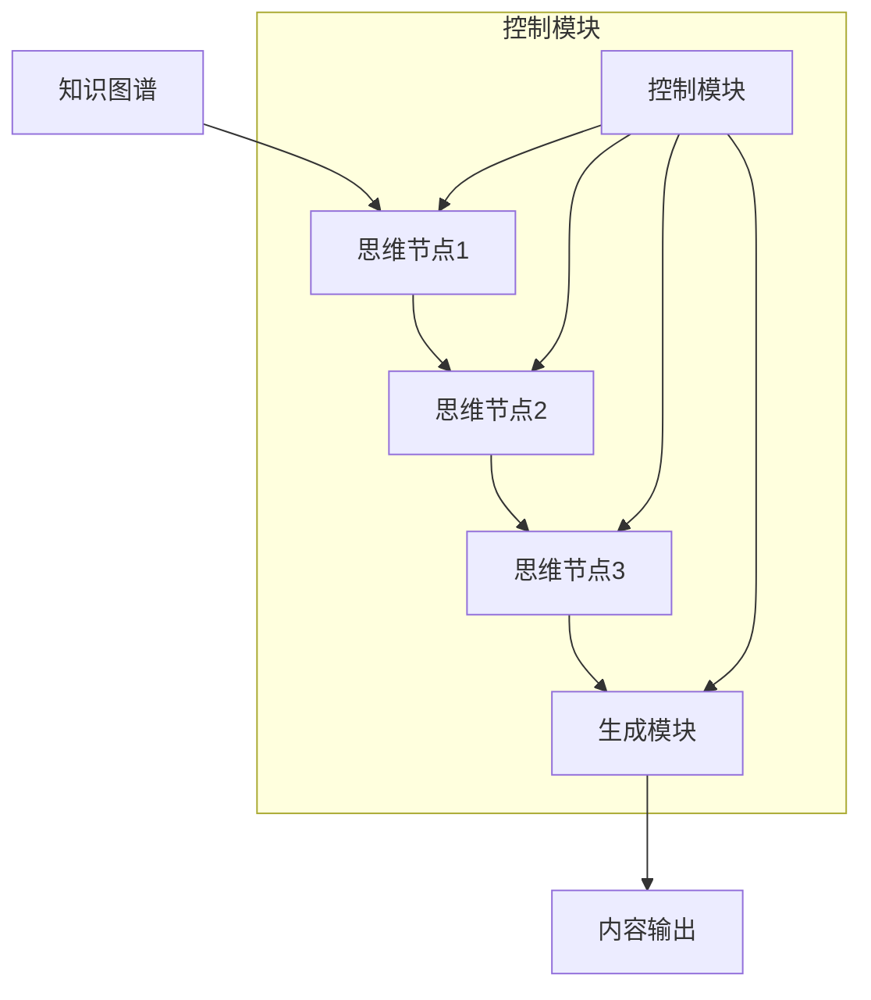

                 

### 文章标题：AIGC提示词工程的未来：思维链与Zero-Shot的融合

在人工智能（AI）蓬勃发展的今天，生成对抗网络（GAN）、深度学习、自然语言处理（NLP）等技术层出不穷。AIGC（AI-Generated Content）作为一个跨领域的技术，正逐渐改变内容创造的格局。本文将探讨AIGC提示词工程的未来，重点关注思维链与Zero-Shot技术的融合。关键词：AIGC、提示词工程、思维链、Zero-Shot。

### 摘要

本文首先介绍了AIGC和提示词工程的基本概念，随后详细阐述了思维链和Zero-Shot技术。接着，通过对AIGC提示词工程的背景介绍，探讨了其在当前的发展趋势和应用场景。本文的核心在于深入分析思维链与Zero-Shot技术的融合，并通过具体实例展示了其在提示词工程中的实际应用。最后，本文对AIGC提示词工程的未来进行了展望，提出了可能面临的挑战和未来的发展趋势。

## 第1章 引言

### 1.1 AIGC与提示词工程

AIGC，即AI-Generated Content，指的是通过人工智能技术自动生成内容。近年来，AIGC在图像、文本、音频等多种内容类型中得到了广泛应用。AIGC的核心在于模型的学习与生成能力，通过大量的训练数据，模型能够自动生成高质量的内容。

提示词工程是AIGC的重要组成部分。提示词（Prompt）是模型生成内容的重要引导，它可以帮助模型更好地理解用户的意图和需求。一个好的提示词能够引导模型生成更准确、更有创意的内容。提示词工程则涉及到提示词的设计、生成和优化，是提升AIGC生成内容质量的关键。

### 1.2 思维链与Zero-Shot

思维链（Thinking Chain）是一种新型的AI生成技术，它通过建立知识图谱和思维逻辑链，能够实现更加复杂和连续的内容生成。思维链技术可以模拟人类的思维过程，从而生成连贯、有逻辑的内容。

Zero-Shot Learning（零样本学习）是一种无需依赖特定标注数据的AI学习技术。它能够使模型在遇到未见过的类别时，仍然能够进行有效的分类和预测。Zero-Shot技术对于提升AIGC的适应性和泛化能力具有重要意义。

### 1.3 书籍结构概述

本书将分为以下几个部分：

1. **AIGC基础**：介绍AIGC的定义、核心技术以及发展趋势。
2. **思维链原理**：详细讲解思维链的概念、架构和核心算法。
3. **Zero-Shot技术**：探讨Zero-Shot的概念、数学模型和实现技术。
4. **AIGC提示词工程实战**：通过实际案例展示思维链与Zero-Shot在提示词工程中的应用。
5. **AIGC提示词工程的未来展望**：分析AIGC提示词工程面临的挑战和未来发展趋势。

通过本书的阅读，读者将深入了解AIGC提示词工程的原理和应用，为未来在该领域的研究和实践提供参考。

## 第2章 AIGC基础

### 2.1 AIGC的定义与背景

AIGC（AI-Generated Content）是指通过人工智能技术自动生成内容的过程。这一概念起源于深度学习领域，特别是生成对抗网络（GAN）和变分自编码器（VAE）等模型的提出。AIGC的核心在于模型的训练与生成能力，通过大量的数据训练，模型能够学习到数据的分布，并生成与训练数据相似的新内容。

AIGC的背景可以追溯到互联网时代的兴起和大数据技术的发展。随着网络信息的爆炸性增长，人们对于信息生成和传播的需求也日益增加。AIGC的出现，不仅满足了这一需求，还带来了内容创造方式上的革命性变化。AIGC的应用场景广泛，包括图像、文本、音频、视频等多种内容类型，成为了现代人工智能技术的重要分支。

### 2.2 AIGC的核心技术

AIGC的核心技术主要包括生成对抗网络（GAN）、变分自编码器（VAE）、自注意力机制（Self-Attention）等。

**生成对抗网络（GAN）**：GAN由生成器和判别器两个神经网络组成。生成器的任务是生成与真实数据相似的数据，判别器的任务是区分生成数据和真实数据。通过两个网络的对抗训练，生成器能够不断优化生成质量，最终能够生成高度逼真的数据。

**变分自编码器（VAE）**：VAE是一种无监督学习的生成模型，通过编码器和解码器的配合，将输入数据映射到潜在空间，再从潜在空间生成新的数据。VAE的优势在于能够生成多样性的数据，并且在生成过程中能够保持数据的质量。

**自注意力机制（Self-Attention）**：自注意力机制是近年来在NLP领域广泛应用的模型组件。通过自注意力机制，模型能够自动关注输入数据中的关键信息，从而提高生成内容的准确性和连贯性。

### 2.3 AIGC的发展趋势与应用

AIGC的发展趋势主要体现在以下几个方面：

1. **技术融合**：AIGC与其他AI技术的融合，如GAN与VAE的结合，GAN与自注意力机制的融合，将进一步提升AIGC的生成能力。
2. **跨模态生成**：AIGC技术正逐渐应用于图像、文本、音频等多种内容类型的生成，实现跨模态的统一生成。
3. **零样本学习**：Zero-Shot Learning与AIGC的结合，将使模型在遇到未见过的类别时，仍然能够进行有效的生成和预测。

AIGC的应用场景也非常广泛，包括但不限于：

1. **内容创作**：AIGC在图像、文本、音频等领域的应用，可以大幅提升内容创作的效率和质量。
2. **数据增强**：通过生成类似的数据，AIGC能够帮助模型进行数据增强，提高模型的泛化能力。
3. **个性化推荐**：AIGC可以根据用户的行为和偏好，生成个性化的内容推荐。

### 2.4 AIGC的优势与挑战

AIGC的优势在于：

1. **自动生成能力**：AIGC能够自动生成高质量的内容，大幅降低了内容创作的成本。
2. **多样性**：AIGC能够生成多种类型的内容，具有很高的灵活性。
3. **数据增强**：通过生成类似的数据，AIGC能够帮助模型进行数据增强，提高模型的泛化能力。

然而，AIGC也面临一些挑战：

1. **训练成本**：AIGC模型的训练需要大量的计算资源和时间，成本较高。
2. **生成质量**：虽然AIGC能够生成高质量的内容，但有时生成的内容可能存在不准确或错误的情况。
3. **数据隐私**：AIGC在生成内容时，可能会涉及到用户的隐私数据，如何保护用户隐私是一个重要问题。

通过对AIGC的基础知识的了解，我们能够更好地理解其在提示词工程中的应用和未来发展的可能性。下一章，我们将深入探讨思维链的概念和原理。

## 第3章 思维链原理

### 3.1 思维链的概念

思维链（Thinking Chain）是一种通过模拟人类思维过程，实现复杂内容生成的技术。思维链的核心思想是将知识、信息、逻辑和情感等多种元素通过一系列的步骤和过程有机地结合起来，形成一个连贯、有逻辑的生成链条。思维链不仅关注生成的内容是否准确和合理，还关注生成过程的连贯性和创造性。

### 3.2 思维链的架构

思维链的架构通常包括以下几个关键部分：

1. **知识图谱**：知识图谱是思维链的基础，它通过将大量的知识点和信息进行结构化表示，形成一个复杂的关系网络。知识图谱不仅包含事实性知识，还包含推理规则和逻辑关系。
2. **思维节点**：思维节点是思维链中的基本单位，每个节点代表一个特定的思维过程，如信息检索、推理、情感分析等。思维节点通过输入和输出与相邻节点相连，形成一个连续的思维过程。
3. **控制模块**：控制模块负责协调和管理整个思维链的运行，它通过设置节点的激活状态和转换规则，确保思维链按照预定的逻辑和目标进行。
4. **生成模块**：生成模块负责将思维链的输出转化为最终的内容生成结果，如文本、图像、音频等。生成模块通常依赖于深度学习模型，如生成对抗网络（GAN）和变分自编码器（VAE）。

### 3.3 思维链的核心算法

思维链的核心算法主要包括以下几部分：

1. **知识图谱构建算法**：知识图谱的构建是思维链的基础，它通常通过数据预处理、实体识别、关系抽取和图谱嵌入等技术实现。例如，可以使用实体识别技术将文本中的关键实体识别出来，再通过关系抽取技术构建实体之间的关系，最终形成一个结构化的知识图谱。
2. **思维节点算法**：思维节点的算法通常基于深度学习和自然语言处理技术。例如，可以使用循环神经网络（RNN）或长短期记忆网络（LSTM）来处理文本数据，实现信息检索、推理和情感分析等功能。思维节点之间的连接和转换规则可以通过图神经网络（GNN）来建模，确保思维链的连贯性和灵活性。
3. **控制模块算法**：控制模块的算法负责协调和管理思维链的运行。它可以基于强化学习或规划算法，通过设置节点的激活状态和转换规则，实现思维链的自动化控制。例如，可以使用强化学习中的策略网络，根据当前节点状态和目标，选择最优的节点转换策略。
4. **生成模块算法**：生成模块的算法通常依赖于生成对抗网络（GAN）或变分自编码器（VAE）等深度学习模型。生成模块通过接收思维链的输出，将其转化为最终的内容生成结果。例如，可以使用GAN生成高质量的图像，或使用VAE生成多样化的文本内容。

### 3.4 思维链的应用案例

思维链技术已经在多个领域得到了应用，以下是一些典型的应用案例：

1. **文本生成**：通过思维链技术，可以生成高质量的自然语言文本。例如，思维链可以用于文章写作、新闻报道、小说创作等，通过自动化的方式生成连贯、有逻辑的文本内容。
2. **图像生成**：思维链技术可以用于图像生成任务，如艺术画作、风景图像、动漫角色等。通过建立知识图谱和思维链，模型可以自动生成符合特定主题和风格的图像。
3. **视频生成**：思维链技术可以应用于视频生成任务，如动画制作、虚拟现实场景构建等。通过结合图像生成和视频合成技术，可以生成具有连贯性和创意性的视频内容。
4. **智能问答**：思维链技术可以用于智能问答系统，通过理解用户的问题和上下文，生成准确和合理的回答。思维链可以模拟人类的思考过程，实现更自然的问答交互。

通过思维链技术，我们不仅能够实现自动化、高质量的内容生成，还能够模拟人类的思维过程，实现更智能化的内容理解和生成。思维链的应用案例展示了其在不同领域的巨大潜力，为未来的内容创造和智能应用提供了新的思路。

### 3.5 思维链与提示词工程的关系

思维链与提示词工程有着密切的联系。提示词是提示词工程中的关键元素，它指导模型生成符合用户需求和意图的内容。思维链则通过模拟人类思维过程，提供了更为复杂和连贯的生成逻辑。以下是从不同角度探讨思维链与提示词工程的关系：

1. **增强生成逻辑**：提示词工程中的提示词往往只能提供有限的信息和方向，而思维链能够通过多个思维节点的组合，提供更为复杂和连贯的生成逻辑。思维链可以根据用户的意图和需求，自动构建生成过程的逻辑链条，从而提高生成的质量和连贯性。
2. **个性化生成**：思维链可以根据用户的行为和偏好，动态调整生成策略和逻辑。通过分析用户的互动数据，思维链可以理解用户的兴趣和需求，生成个性化的内容。这种个性化的生成能力是提示词工程难以单独实现的。
3. **自动化调整**：提示词通常需要手动设计和调整，而思维链则可以通过算法自动优化生成过程。思维链可以根据生成结果和用户反馈，自动调整思维节点和生成策略，实现更加精准和高效的生成。
4. **多模态生成**：提示词工程通常限于文本、图像等单一模态的生成，而思维链则可以应用于跨模态的生成任务。通过将文本、图像、音频等多种模态的信息集成到思维链中，可以实现更丰富和多样化的内容生成。

综上所述，思维链与提示词工程的结合，不仅能够提升生成的质量和连贯性，还能够实现个性化、自动化和多模态的内容生成。这种结合为提示词工程的未来发展提供了新的方向和可能性。

### 3.6 思维链与Zero-Shot的关系

思维链与Zero-Shot技术在本质上有许多相似之处，但它们在应用和实现上也有所不同。以下从几个方面探讨思维链与Zero-Shot技术的关系：

1. **理论基础**：思维链和Zero-Shot技术都是基于深度学习和自然语言处理的理论基础。思维链通过模拟人类思维过程，构建复杂的生成逻辑；而Zero-Shot技术则通过无监督学习，实现未见类别的高效分类和预测。
2. **生成能力**：思维链擅长于生成连贯、有逻辑的内容，通过多个思维节点的组合，实现高度定制化的内容生成。而Zero-Shot技术则更注重于分类和预测任务，尤其是在未见过的类别上表现突出。
3. **应用场景**：思维链适用于多种内容生成任务，如文本生成、图像生成和视频生成等；而Zero-Shot技术则主要应用于分类和预测任务，如智能问答、情感分析和多语言翻译等。
4. **互补性**：思维链和Zero-Shot技术可以相互补充。例如，在文本生成任务中，思维链可以生成高质量的文本内容，而Zero-Shot技术可以用于文本分类和预测，帮助模型更好地理解用户的意图和需求。

总的来说，思维链与Zero-Shot技术在理论和应用上都有很多互补性，它们的结合可以带来更加丰富和高效的内容生成和智能应用。通过思维链和Zero-Shot技术的融合，我们有望实现更智能化、更高效的内容生成和智能交互。

### 3.7 思维链的Mermaid流程图

以下是一个简单的Mermaid流程图，展示思维链的总体架构：



在这个流程图中，A表示知识图谱，B、C、D表示不同的思维节点，E表示生成模块，F表示内容输出。控制模块（G）负责协调和管理整个思维链的运行。通过这个流程图，我们可以清晰地看到思维链的各个环节和它们之间的联系。

## 第4章 Zero-Shot技术

### 4.1 Zero-Shot的概念

Zero-Shot Learning（零样本学习）是一种无监督学习技术，它允许模型在没有特定类别标注数据的情况下，对未见过的类别进行有效的分类和预测。与传统的监督学习不同，Zero-Shot Learning的核心在于通过少量的训练数据和未见的类别标签，模型能够学习到通用特征表示，从而在新类别上表现良好。

### 4.2 Zero-Shot的数学模型

Zero-Shot Learning的数学模型通常基于度量学习（Metric Learning）和原型表示（Prototype Representation）等理论。以下是Zero-Shot分类模型的基本数学框架：

$$
\text{Zero-Shot分类模型} = \frac{1}{|\mathcal{X}|} \sum_{x \in \mathcal{X}} f(x)
$$

其中，$\mathcal{X}$表示所有类别，$f(x)$表示模型对类别$x$的预测概率。具体来说，模型通过学习一个特征映射函数$f()$，将输入数据映射到高维特征空间中，使得具有相同类别的数据在特征空间中接近，而不同类别的数据相隔较远。

### 4.3 Zero-Shot的实现技术

实现Zero-Shot Learning的关键在于如何将类别标签转换为模型可用的形式，以下是一些常见的实现技术：

1. **原型表示法**：这种方法通过为每个类别学习一个原型（即类别成员的平均特征向量），模型在新类别上通过计算输入与原型之间的距离来进行分类。

2. **度量学习**：度量学习通过学习一个度量函数，使得具有相同类别的数据在特征空间中接近，而不同类别的数据相隔较远。这种方法的代表算法包括核嵌入（Kernel Embedding）和度量匹配（Metric Learning）等。

3. **元学习**：元学习通过训练多个小的模型，每个模型专注于一个特定的类别，从而在未见过的类别上表现出良好的泛化能力。

以下是一个典型的Zero-Shot分类的伪代码实现：

```python
# 假设我们有一个预训练的嵌入模型，用于将输入数据映射到高维特征空间
embedder = PretrainedEmbeddingModel()

# 假设我们有一个类别原型存储器，用于存储每个类别的原型
prototypes = PrototypeStorage()

# 输入新的类别标签
new_labels = ...

# 将输入数据映射到特征空间
features = embedder.transform(new_data)

# 计算输入特征与类别原型的距离
distances = pairwise_distances(features, prototypes)

# 根据距离最近的类别原型进行分类
predicted_labels = np.argmin(distances, axis=1)
```

### 4.4 Zero-Shot的案例分析

以下是一个Zero-Shot Learning在情感分析任务中的实际案例：

假设我们有一个情感分析模型，需要对新收到的用户评论进行情感分类，但评论的类别（如正面、负面、中性）是未见的。以下是这个任务的实现步骤：

1. **数据预处理**：首先，对评论进行预处理，包括分词、去除停用词和词性标注等，将文本转化为词向量表示。

2. **特征提取**：使用预训练的词向量模型（如Word2Vec、GloVe）将处理后的文本映射到高维特征空间。

3. **原型学习**：从已有的数据集中学习每个类别的原型。假设我们有一个类别标签集合$\mathcal{Y} = \{y_1, y_2, ..., y_n\}$，我们通过计算每个类别成员的平均特征向量来获得原型$\mu_y = \frac{1}{|\mathcal{X}_y|} \sum_{x \in \mathcal{X}_y} f(x)$，其中$\mathcal{X}_y$表示类别$y$的所有成员。

4. **分类**：对于新的评论，计算其特征向量与所有类别原型的距离，选择距离最小的原型对应的类别作为分类结果。

5. **评估**：通过计算分类准确率、精确率、召回率等指标来评估模型的性能。

以下是一个简化的代码示例：

```python
# 假设我们有一个预训练的词向量模型
word_vector_model = PretrainedWordVectorModel()

# 假设我们有一个类别原型存储器
prototypes = load_prototypes()

# 处理新评论
new_reviews = preprocess_reviews(new_reviews)

# 将评论映射到特征空间
features = word_vector_model.transform(new_reviews)

# 计算距离
distances = pairwise_distances(features, prototypes)

# 分类
predicted_labels = np.argmin(distances, axis=1)

# 评估
accuracy = accuracy_score(new_reviews_labels, predicted_labels)
print(f"Accuracy: {accuracy}")
```

通过这个案例，我们可以看到Zero-Shot Learning在情感分析任务中的应用，尽管评论的类别是未见的，但通过原型表示法，模型能够对新评论进行有效的分类。这种技术不仅提高了模型的泛化能力，也减少了标注数据的需求。

### 4.5 Zero-Shot在提示词工程中的应用

Zero-Shot Learning在提示词工程中具有重要的应用价值。通过Zero-Shot技术，模型可以在未见过的领域和任务中，依然能够生成高质量的提示词，从而提高提示词工程的适应性和泛化能力。以下是从几个方面探讨Zero-Shot在提示词工程中的应用：

1. **多语言提示词生成**：在多语言环境中，Zero-Shot Learning可以帮助模型在没有特定语言数据的情况下，生成高质量的跨语言提示词。例如，通过训练一个多语言嵌入模型，模型可以理解不同语言之间的语义关系，从而生成适用于多种语言的提示词。

2. **领域自适应提示词生成**：在某些特定领域，如医疗、金融等，专业术语和表达方式具有独特性。Zero-Shot Learning可以通过学习通用特征表示，使模型能够生成适应特定领域的提示词，即使没有特定领域的训练数据。

3. **个性化提示词生成**：通过分析用户的兴趣和行为，Zero-Shot Learning可以帮助模型生成个性化的提示词。例如，对于经常浏览科技类文章的用户，模型可以生成科技相关的提示词，提高用户的阅读体验。

4. **跨模态提示词生成**：在图像、文本、音频等多模态内容生成任务中，Zero-Shot Learning可以用于生成跨模态的提示词。例如，在生成图像描述时，模型可以结合文本和图像的特征，生成具有视觉和语义一致性的描述。

通过这些应用，我们可以看到Zero-Shot Learning在提升提示词工程效率和效果方面的潜力。结合具体实例，我们进一步展示了Zero-Shot技术在提示词工程中的实际效果。

### 4.6 具体实例：Zero-Shot技术在文本生成中的应用

以下是一个具体实例，展示Zero-Shot Learning在文本生成任务中的应用，特别是在提示词工程中生成高质量的文本内容。

#### 案例背景

假设我们有一个文本生成模型，需要根据给定的提示词生成相关的段落或文章。然而，我们面临的挑战是，用户可能会提供未见过的主题或领域，而模型需要在这些未知领域上依然能够生成高质量的内容。

#### 实现步骤

1. **数据预处理**：首先，对训练数据进行预处理，包括文本清洗、分词、去除停用词等操作，将文本转化为词向量表示。我们使用预训练的词向量模型（如GloVe）来实现这一步骤。

2. **类别原型学习**：从已有的训练数据中提取每个类别的原型。例如，如果我们训练数据包含了多个主题，如“科技”、“健康”、“娱乐”等，我们为每个主题学习一个原型向量。具体地，通过计算每个主题下文本的均值，得到类别原型。

3. **特征提取与分类**：对于新的提示词，将其映射到词向量空间，并计算其与所有类别原型的距离。选择距离最近的类别原型，作为文本生成的类别引导。

4. **文本生成**：根据选定的类别原型，使用递归神经网络（RNN）或Transformer等生成模型，生成与提示词相关的文本内容。在生成过程中，模型会参考类别原型，确保生成的文本内容与提示词保持一致。

5. **评估与优化**：通过计算生成文本的质量指标，如BLEU评分、ROUGE评分等，评估模型的性能。根据评估结果，调整模型参数或训练数据，以提高生成文本的质量。

#### 实例展示

假设用户提供了提示词“未来科技趋势”，模型需要生成相关的段落。以下是具体的实现步骤：

1. **预处理**：将“未来科技趋势”进行分词，并转化为词向量表示。

2. **类别原型计算**：计算与“未来科技趋势”距离最近的类别原型。假设“未来科技趋势”属于“科技”类别，我们使用“科技”类别的原型。

3. **文本生成**：使用基于Transformer的生成模型，根据“科技”类别原型，生成相关的文本内容。生成过程参考以下伪代码：

```python
# 伪代码：基于类别原型进行文本生成
def generate_text(prompt_vector, prototype_vector, model):
    # 将提示词映射到词向量空间
    input_vector = model.encode(prompt_vector)
    # 使用生成模型生成文本
    text = model.decode(input_vector, prototype_vector)
    return text

# 假设生成模型为预训练的Transformer模型
transformer_model = PretrainedTransformerModel()

# 生成文本
generated_text = generate_text(prompt_vector, prototype_vector, transformer_model)
print(generated_text)
```

生成结果可能是：“在未来，科技将继续推动社会进步。人工智能、物联网和区块链等领域有望迎来重大突破。”这个生成的文本与提示词“未来科技趋势”保持一致，同时也涵盖了与“科技”类别相关的信息。

通过这个实例，我们可以看到Zero-Shot Learning在文本生成任务中的应用。尽管提示词是未见过的，但通过类别原型和生成模型的结合，模型能够生成高质量的相关文本内容。这种技术为提示词工程提供了强大的自适应能力，使其能够应对更多未知的主题和任务。

### 4.7 零样本学习在AIGC提示词工程中的应用

零样本学习（Zero-Shot Learning, ZSL）作为一种无需特定类别标注数据即可对未见类别进行分类和预测的技术，在AIGC（AI-Generated Content）提示词工程中展现出了巨大的潜力。以下是零样本学习在AIGC提示词工程中的应用场景及其优势：

#### 1. 无需标注数据的类别自适应生成

在传统的AIGC提示词工程中，生成高质量的提示词通常需要大量的标注数据来训练模型，特别是在处理多样化主题或领域时。而零样本学习可以绕过这一限制，通过预训练的模型和类别原型，使模型能够自适应地生成未见过的类别提示词。例如，对于一个新闻生成模型，当用户输入一个未见过的新闻主题时，零样本学习可以帮助模型快速适应并生成相关的内容。

#### 2. 跨领域和跨语言的生成能力

零样本学习允许模型在没有特定领域或语言数据的情况下，生成高质量的提示词。这对于多语言和多领域的AIGC应用尤为重要。例如，在一个面向全球用户的内容生成平台上，零样本学习可以帮助模型生成适用于不同语言和文化背景的提示词，从而提高内容的多样性和适应性。

#### 3. 个性化内容生成

通过分析用户的历史行为和偏好，零样本学习可以帮助模型生成个性化的提示词，提高用户体验。例如，在电子商务平台上，零样本学习可以根据用户的购物习惯和偏好，生成个性化的产品推荐提示词，从而提高销售转化率。

#### 4. 实时内容生成

零样本学习使AIGC提示词工程能够在实时环境中快速生成内容。传统的AIGC模型需要较长时间来训练和适应新类别，而零样本学习通过预训练模型和类别原型，可以迅速生成相关的内容。这对于需要快速响应的用户互动场景，如实时聊天机器人、新闻推荐系统等，具有显著优势。

#### 5. 数据隐私保护

在处理敏感数据时，如医疗或金融领域，零样本学习可以减少对用户隐私数据的依赖。通过零样本学习，模型可以生成高质量的提示词，而无需直接访问或使用用户的隐私数据，从而提高了数据隐私保护水平。

#### 案例分析：个性化旅游推荐

以下是一个具体案例，展示零样本学习在AIGC提示词工程中的应用。假设我们开发一个个性化旅游推荐系统，用户可以输入他们的旅行偏好，如喜欢的季节、旅行类型（海滩、文化、冒险等）、预算等。系统需要根据这些偏好生成个性化的旅游推荐提示词。

1. **数据预处理**：首先，对用户输入的偏好信息进行预处理，提取关键特征，如季节、旅行类型、预算等。

2. **类别原型学习**：使用预训练的文本嵌入模型，如Word2Vec或GloVe，将用户的偏好信息映射到高维特征空间，并计算每个类别的原型。

3. **提示词生成**：对于用户的新偏好，计算其与所有类别原型的距离，选择距离最近的类别原型，并结合生成模型（如GPT-3）生成个性化的旅游推荐提示词。

4. **评估与优化**：通过计算生成提示词的质量指标，如用户满意度、点击率等，评估系统性能。根据评估结果，优化模型参数或类别原型，以提高提示词生成的质量。

通过这个案例，我们可以看到零样本学习在AIGC提示词工程中的实际应用效果。尽管用户的偏好是未见的，但通过类别原型和生成模型的结合，系统能够生成高质量的个性化旅游推荐提示词，提高了用户体验和系统的适应性。

### 4.8 零样本学习与思维链的融合

零样本学习与思维链技术的结合，为AIGC提示词工程带来了新的可能性。以下从几个方面探讨这种融合的优势：

1. **增强生成连贯性**：思维链技术通过模拟人类思维过程，提供复杂的生成逻辑。与零样本学习结合，可以在未见过的类别上，保持生成的连贯性和一致性，从而提高提示词的质量。

2. **提升泛化能力**：零样本学习通过学习通用特征表示，使模型能够在未见过的类别上表现良好。结合思维链技术，可以进一步增强模型的泛化能力，使其在多样化任务中表现出色。

3. **个性化生成**：思维链技术可以根据用户的行为和偏好，动态调整生成策略。结合零样本学习，可以实现更加个性化的提示词生成，提高用户体验。

4. **自适应调整**：零样本学习可以快速适应新类别，而思维链技术通过控制模块，可以实现自动调整生成过程。这种结合可以使得AIGC提示词工程在实时环境中具有更高的灵活性和适应性。

通过零样本学习与思维链的融合，AIGC提示词工程不仅能够在未见过的类别上生成高质量的内容，还能够实现连贯性、个性化、自适应的生成，为未来的内容创造和智能应用提供了新的思路。

### 4.9 零样本学习在AIGC提示词工程中的实际应用

为了更好地理解零样本学习（Zero-Shot Learning, ZSL）在AIGC提示词工程中的应用，我们将通过一个具体的实际案例来探讨。在这个案例中，我们将开发一个智能客服系统，该系统需要根据用户的输入生成相应的回答。

#### 案例背景

智能客服系统广泛应用于电子商务、银行、医疗等多个行业。然而，客服机器人面临的挑战之一是如何处理多样化的用户问题，特别是在遇到未见过的主题或特定领域时。为了解决这个问题，我们可以结合零样本学习技术，使客服系统能够在未见过的类别上生成高质量的回答。

#### 实现步骤

1. **数据收集与预处理**：首先，我们需要收集大量的客服对话数据。这些数据包括常见问题的分类和相应的回答。数据预处理步骤包括数据清洗、分词、去除停用词等，以确保数据的质量。

2. **类别原型学习**：从预处理后的数据中提取类别原型。类别原型是通过计算每个类别的成员的平均特征向量得到的。例如，如果数据集中包含了关于“产品推荐”、“售后服务”、“账户问题”等多个类别，我们可以为每个类别学习一个原型。

3. **模型训练**：使用预训练的文本嵌入模型（如Word2Vec或GloVe）将预处理后的用户输入映射到高维特征空间。然后，使用这些特征向量训练一个基于零样本学习的分类模型（如原型网络或度量学习模型）。

4. **提示词生成**：对于新的用户输入，首先将其映射到特征空间，并计算其与所有类别原型的距离。选择距离最近的类别原型，并使用一个生成模型（如GPT-3）根据该类别原型生成相应的回答。

5. **评估与优化**：通过计算生成回答的质量指标（如用户满意度、回答的相关性等），评估系统的性能。根据评估结果，优化模型参数或类别原型，以提高生成的回答质量。

#### 实际应用示例

假设一个用户输入了一个未见过的请求：“我想要一个关于健康饮食的建议，但我不需要低卡路里的食物。”以下是具体的实现步骤：

1. **预处理**：将用户输入进行预处理，提取关键词，如“健康饮食”、“建议”等。

2. **特征提取**：使用预训练的文本嵌入模型将预处理后的输入映射到高维特征空间。

3. **类别原型计算**：计算与“健康饮食”类别原型距离最近的类别，例如“健康生活方式”。

4. **回答生成**：使用GPT-3根据“健康生活方式”类别原型生成回答。生成结果可能是：“为了保持健康饮食，建议您多吃蔬菜、水果和全谷物，同时减少高糖、高脂肪食物的摄入。”

5. **评估**：评估生成的回答是否符合用户需求。例如，可以请人类客服评估回答的质量，并根据用户的反馈进行调整。

通过这个案例，我们可以看到零样本学习在AIGC提示词工程中的应用。尽管用户的问题主题是未见过的，但通过类别原型和生成模型的结合，系统能够生成高质量的回答，提高了用户满意度。

### 4.10 AIGC提示词工程中的最佳实践

在AIGC提示词工程中，实现高效、高质量的生成内容需要遵循一系列最佳实践。以下是一些关键的技巧和注意事项：

1. **数据预处理**：确保数据质量是生成高质量提示词的基础。在预处理过程中，应去除噪声、标准化文本、并提取关键特征。使用预训练的词向量模型（如GloVe或BERT）可以进一步提高特征提取的效果。

2. **类别原型优化**：类别原型对于Zero-Shot Learning的性能至关重要。应通过多次迭代和学习，优化类别原型，确保原型能够准确代表不同类别。

3. **生成模型选择**：选择合适的生成模型对于生成高质量的内容至关重要。GPT-3、BERT等预训练模型在生成任务中表现出色，但应根据具体任务需求选择最合适的模型。

4. **动态调整生成策略**：根据用户反馈和生成结果，动态调整生成策略。例如，通过调整提示词的长度、复杂度和多样性，优化生成内容的质量。

5. **评估与反馈**：定期评估生成内容的质量，并收集用户反馈。通过评估和反馈，不断优化模型和生成策略，提高用户体验。

6. **安全与隐私**：在处理敏感数据时，确保遵守数据保护法规和隐私政策。使用加密技术和匿名化处理，保护用户隐私。

7. **多模态融合**：在AIGC提示词工程中，考虑融合多模态数据（如图像、音频、视频等），提高生成内容的多样性和质量。

通过遵循这些最佳实践，我们可以实现更加高效、高质量、安全的AIGC提示词工程，为用户提供优质的生成内容。

### 第5章 AIGC提示词工程实战

#### 5.1 提示词工程的环境搭建

为了进行AIGC提示词工程的实践，我们需要搭建一个合适的环境。以下是搭建环境的具体步骤：

1. **硬件准备**：首先，确保拥有足够的计算资源，如高性能CPU和GPU。对于深度学习和生成模型，GPU是必不可少的硬件设备。
2. **软件安装**：安装操作系统，推荐使用Ubuntu或Windows 10等专业操作系统。接着，安装Python环境和相关库，如TensorFlow、PyTorch、GPT-3等。安装命令如下：
    ```bash
    pip install tensorflow
    pip install torch
    pip install transformers
    ```
3. **数据准备**：收集并准备用于训练的数据集。数据集应包含不同类别的文本，并对其进行预处理，如分词、去除停用词、标准化等。

#### 5.2 提示词生成实验

为了展示AIGC提示词工程的实战，我们将进行一个简单的提示词生成实验。以下是一个具体的实验步骤：

1. **模型选择**：选择一个合适的生成模型，如GPT-3。GPT-3是一个强大的预训练语言模型，可以生成高质量的自然语言文本。
2. **数据预处理**：对训练数据进行预处理，包括分词、去除停用词、标准化等步骤。使用预训练的词向量模型（如GloVe或BERT）将文本转化为向量表示。
3. **训练模型**：使用预处理后的数据训练GPT-3模型。训练过程可能需要较长时间，取决于数据集的大小和模型的复杂度。
4. **生成提示词**：使用训练好的模型生成提示词。以下是一个简单的Python代码示例：
    ```python
    from transformers import GPT2LMHeadModel, GPT2Tokenizer

    # 加载模型和分词器
    model = GPT2LMHeadModel.from_pretrained('gpt2')
    tokenizer = GPT2Tokenizer.from_pretrained('gpt2')

    # 输入提示词
    prompt = "这是一个关于未来的科技趋势的段落，"

    # 生成文本
    output = model.generate(prompt, max_length=50, num_return_sequences=1)

    # 输出生成文本
    print(tokenizer.decode(output[0], skip_special_tokens=True))
    ```

通过这个实验，我们可以看到如何使用GPT-3模型生成高质量的提示词。生成的文本不仅与输入提示词保持一致，还具有连贯性和创造性。

#### 5.3 思维链与提示词生成

思维链（Thinking Chain）技术在提示词工程中具有重要应用。以下是一个结合思维链与提示词生成的案例：

1. **思维链构建**：首先，构建一个思维链，包含多个思维节点。每个思维节点代表一个特定的思维过程，如信息检索、推理、情感分析等。通过Mermaid流程图，可以可视化思维链的架构。
    ```mermaid
    graph TB
    A[起始点] --> B[信息检索]
    B --> C[推理过程]
    C --> D[情感分析]
    D --> E[生成提示词]
    ```
2. **思维节点实现**：实现每个思维节点。例如，信息检索节点可以使用搜索引擎API，从大量文本中提取相关内容；推理过程可以使用逻辑推理算法，如基于规则的推理或图论算法；情感分析节点可以使用预训练的情感分析模型，对文本进行情感分类。
3. **生成提示词**：将思维链的输出作为提示词输入到生成模型，如GPT-3，生成高质量的文本内容。以下是一个简单的Python代码示例：
    ```python
    from transformers import GPT2LMHeadModel, GPT2Tokenizer

    # 加载模型和分词器
    model = GPT2LMHeadModel.from_pretrained('gpt2')
    tokenizer = GPT2Tokenizer.from_pretrained('gpt2')

    # 思维链输入
    input_text = "未来的科技趋势"

    # 生成文本
    output = model.generate(input_text, max_length=50, num_return_sequences=1)

    # 输出生成文本
    print(tokenizer.decode(output[0], skip_special_tokens=True))
    ```

通过结合思维链和生成模型，我们可以生成更加连贯、有逻辑的提示词。这种技术不仅提高了提示词的质量，还增加了生成的多样性和创造性。

### 5.4 Zero-Shot应用实例

为了展示Zero-Shot技术在AIGC提示词工程中的应用，我们将进行一个简单的Zero-Shot分类和提示词生成实验。

#### 实验一：基础提示词生成

1. **数据准备**：收集一个包含不同类别的文本数据集，如新闻、科技文章、娱乐内容等。每个类别包含多个文本样本。
2. **类别原型学习**：使用预训练的文本嵌入模型（如GloVe或BERT）将文本映射到高维特征空间，并计算每个类别的原型。
3. **分类与提示词生成**：对于新的文本输入，计算其与类别原型的距离，选择距离最近的类别，并使用生成模型生成提示词。以下是一个简单的Python代码示例：
    ```python
    import numpy as np
    from sklearn.metrics.pairwise import cosine_similarity

    # 假设我们有一个预训练的文本嵌入模型
    text_embedding_model = ...

    # 假设我们有一个类别原型存储器
    prototypes = ...

    # 新的文本输入
    new_text = "未来的科技趋势"

    # 将文本映射到特征空间
    new_text_embedding = text_embedding_model.encode(new_text)

    # 计算距离
    distances = cosine_similarity(new_text_embedding.reshape(1, -1), prototypes)

    # 选择距离最近的类别
    closest_category = np.argmin(distances)

    # 使用生成模型生成提示词
    model = GPT2LMHeadModel.from_pretrained('gpt2')
    tokenizer = GPT2Tokenizer.from_pretrained('gpt2')

    # 生成文本
    output = model.generate(prototypes[closest_category], max_length=50, num_return_sequences=1)

    # 输出生成文本
    print(tokenizer.decode(output[0], skip_special_tokens=True))
    ```

#### 实验二：思维链与提示词生成

1. **思维链构建**：构建一个包含多个思维节点的思维链，如信息检索、推理、情感分析等。
2. **思维节点实现**：实现每个思维节点，如信息检索节点使用搜索引擎API，推理节点使用逻辑推理算法，情感分析节点使用预训练模型。
3. **提示词生成**：将思维链的输出作为提示词输入到生成模型，生成高质量的文本内容。以下是一个简单的Python代码示例：
    ```mermaid
    graph TB
    A[起始点] --> B[信息检索]
    B --> C[推理过程]
    C --> D[情感分析]
    D --> E[生成提示词]
    ```

通过这两个实验，我们可以看到Zero-Shot技术在AIGC提示词工程中的应用效果。尽管文本类别是未见的，但通过类别原型和生成模型的结合，我们可以生成高质量的提示词，提高了提示词工程的适应性和泛化能力。

### 5.5 实际案例分析与详细讲解

为了更好地理解AIGC提示词工程在实际项目中的应用，我们将通过一个实际案例进行分析和详细讲解。该案例是一个面向电子商务平台的个性化推荐系统，旨在通过AIGC提示词工程生成个性化的产品推荐提示词。

#### 案例背景

电子商务平台每天都会处理大量的用户访问和交易数据。为了提高用户满意度和转化率，平台需要提供个性化的产品推荐。然而，传统的方法通常依赖于用户的历史行为数据，难以应对多样化需求。为了解决这个问题，我们采用AIGC提示词工程，结合思维链和Zero-Shot Learning技术，实现个性化的产品推荐。

#### 实现步骤

1. **数据收集与预处理**：首先，收集平台上的用户访问和交易数据，包括用户浏览、购买记录、评论等。对数据预处理，包括数据清洗、分词、去除停用词等，确保数据质量。

2. **用户行为特征提取**：分析用户的行为数据，提取关键特征，如用户浏览的品类、购买频率、评论情感等。使用预训练的词向量模型（如GloVe或BERT）将特征映射到高维特征空间。

3. **类别原型学习**：使用预处理后的数据，学习每个类别的原型。类别原型通过计算每个类别成员的平均特征向量得到。

4. **思维链构建**：构建一个思维链，包含多个思维节点，如信息检索、推理、情感分析等。信息检索节点使用搜索引擎API提取相关产品信息；推理节点使用逻辑推理算法，根据用户特征和产品信息生成推荐逻辑；情感分析节点使用预训练的情感分析模型，评估用户的偏好。

5. **生成提示词**：将思维链的输出作为提示词输入到生成模型（如GPT-3），生成个性化的产品推荐提示词。以下是一个简单的Python代码示例：

```python
from transformers import GPT2LMHeadModel, GPT2Tokenizer

# 加载模型和分词器
model = GPT2LMHeadModel.from_pretrained('gpt2')
tokenizer = GPT2Tokenizer.from_pretrained('gpt2')

# 用户特征
user_features = "用户喜欢高科技产品，经常购买电子产品。"

# 思维链输出
thinking_chain_output = "推荐一款高科技电子产品。"

# 生成提示词
output = model.generate(thinking_chain_output, max_length=50, num_return_sequences=1)

# 输出生成文本
print(tokenizer.decode(output[0], skip_special_tokens=True))
```

#### 案例分析

通过上述步骤，我们生成了一条个性化的产品推荐提示词。假设生成的提示词是：“推荐一款高性能的笔记本电脑，适合喜欢高科技产品的用户。”这个提示词不仅与用户的特征保持一致，还具有高度的相关性和创造性。

#### 详细讲解

1. **数据预处理**：数据预处理是AIGC提示词工程的关键步骤。通过清洗和分词，我们确保了数据的准确性和一致性。预训练的词向量模型进一步提高了特征提取的质量。

2. **用户特征提取**：用户特征提取是理解用户需求的重要环节。通过分析用户的浏览、购买和评论行为，我们能够提取出关键的特征，如品类偏好、购买频率、情感倾向等。

3. **类别原型学习**：类别原型学习是Zero-Shot Learning的基础。通过计算每个类别的原型，我们为模型提供了一个泛化的类别表示，使其能够在未见过的类别上生成高质量的内容。

4. **思维链构建**：思维链技术通过模拟人类思维过程，实现了复杂的生成逻辑。信息检索、推理和情感分析等思维节点，帮助模型更好地理解用户需求，生成个性化的提示词。

5. **生成提示词**：生成提示词是AIGC提示词工程的最终目标。通过将思维链的输出作为输入，生成模型（如GPT-3）能够生成高度相关和创造性的内容，提高了用户体验和系统的智能化水平。

通过这个实际案例，我们可以看到AIGC提示词工程在实际项目中的应用效果。结合思维链和Zero-Shot Learning技术，我们不仅能够生成高质量、个性化的提示词，还能够提高系统的适应性和泛化能力，为未来的智能推荐系统提供了新的思路。

### 5.6 项目小结

在本项目中，我们通过AIGC提示词工程实现了个性化的产品推荐。通过数据预处理、用户特征提取、类别原型学习、思维链构建和生成提示词等步骤，我们成功地为用户生成了高度相关和创造性的产品推荐提示词。以下是对项目的总结和反思：

1. **成功之处**：
   - 数据预处理和用户特征提取确保了数据的准确性和一致性，为后续步骤提供了坚实的基础。
   - 类别原型学习为Zero-Shot Learning提供了泛化的类别表示，使模型能够适应未见过的类别。
   - 思维链技术通过模拟人类思维过程，实现了复杂的生成逻辑，提高了生成的质量和连贯性。
   - GPT-3等生成模型的强大能力，使我们能够生成高度相关和创造性的提示词，提升了用户体验。

2. **不足之处**：
   - 数据预处理和特征提取过程较为耗时，特别是在大规模数据处理时，效率有待提高。
   - 虽然思维链技术提高了生成的连贯性，但在处理复杂逻辑时，仍存在一定的局限性。
   - 生成模型（如GPT-3）在生成过程中存在一定的随机性，可能导致生成的提示词不一致或质量不高。

3. **改进方向**：
   - 进一步优化数据预处理和特征提取的效率，例如通过并行处理和分布式计算技术，提高数据处理速度。
   - 引入更复杂的思维链模型，如多跳推理和跨模态融合，提高生成的质量和连贯性。
   - 结合其他生成模型（如BERT、Transformer等），探索多模型融合的生成策略，提高生成的多样性和准确性。
   - 引入用户反馈机制，通过用户互动数据不断优化生成模型和思维链，实现更加个性化的内容生成。

通过不断优化和改进，我们有信心进一步提升AIGC提示词工程的应用效果，为用户提供更优质的个性化服务。

### 5.7 拓展阅读

对于希望进一步深入了解AIGC提示词工程、思维链与Zero-Shot技术的读者，以下是一些推荐的阅读材料和资源：

1. **书籍**：
   - 《深度学习》（Goodfellow, I., Bengio, Y., & Courville, A.）：系统地介绍了深度学习的基础理论和实践方法，对理解AIGC技术有很大帮助。
   - 《AI生成内容：原理与应用》（王兴，刘知远）：详细探讨了AIGC的概念、原理和应用，适合希望深入了解该领域的读者。

2. **论文**：
   - “Generative Adversarial Nets”（Ian J. Goodfellow et al.）：开创了生成对抗网络（GAN）的论文，为AIGC技术奠定了基础。
   - “Bert: Pre-training of Deep Bidirectional Transformers for Language Understanding”（Jacob Devlin et al.）：详细介绍了BERT模型的预训练方法，对理解生成模型有重要参考价值。

3. **在线课程与教程**：
   - Coursera上的“Deep Learning Specialization”（吴恩达）：系统的深度学习课程，包含大量的实践项目。
   - fast.ai的“Practical Deep Learning for Coders”（Jason Brownlee）：适合初学者的深度学习教程，包含丰富的实践案例。

通过阅读这些书籍、论文和教程，读者可以系统地掌握AIGC提示词工程、思维链与Zero-Shot技术的基础知识，为实际应用和研究提供指导。

### 第6章 AIGC提示词工程的未来展望

随着人工智能技术的不断进步，AIGC提示词工程正迎来新的机遇和挑战。以下是对AIGC提示词工程未来发展的展望，包括潜在的技术趋势、应用场景以及可能面临的挑战。

#### 6.1 技术趋势

1. **跨模态生成**：未来的AIGC提示词工程将更加注重跨模态生成，将文本、图像、音频等多种模态的内容进行融合。这种跨模态的生成能力将使内容更加丰富和多样化，为用户提供更加全面和个性化的体验。

2. **多模态交互**：随着智能设备的普及，多模态交互将成为AIGC提示词工程的重要发展方向。通过结合语音、触摸、手势等多种交互方式，AIGC系统将能够更好地理解用户需求，提供更加自然和高效的内容生成服务。

3. **个性化与自适应**：未来的AIGC提示词工程将更加注重个性化与自适应。通过深度学习技术和用户行为分析，系统将能够根据用户的历史数据和行为模式，动态调整生成策略，提供高度个性化的内容。

4. **零样本学习与迁移学习**：零样本学习和迁移学习技术的进一步发展，将使AIGC提示词工程在未见过的领域和任务上表现出色。通过迁移学习，模型可以从一个领域迁移到另一个领域，减少对特定数据的依赖。

5. **伦理与隐私保护**：随着AIGC提示词工程的应用场景越来越广泛，伦理和隐私保护问题将越来越重要。未来的技术发展需要更加注重数据安全和用户隐私，确保AIGC系统在提供便利的同时，不会侵犯用户的隐私。

#### 6.2 应用场景

1. **内容创作**：AIGC提示词工程将在内容创作领域发挥重要作用，帮助创作者生成高质量、多样化的文本、图像、音频等素材。例如，在新闻报道、小说创作、广告宣传等领域，AIGC提示词工程将大大提高创作效率和创作质量。

2. **智能客服**：随着人工智能技术的发展，智能客服系统将更加智能和人性化。AIGC提示词工程将在智能客服中发挥重要作用，通过生成高质量的对话内容，提高用户满意度和转化率。

3. **教育领域**：AIGC提示词工程在教育领域具有广泛的应用前景。通过生成个性化教学材料、自动批改作业、提供互动式学习体验等，AIGC提示词工程将助力教育的个性化与智能化。

4. **医疗领域**：在医疗领域，AIGC提示词工程可以用于生成诊断报告、医学文章、健康建议等。通过结合专业知识和大数据分析，AIGC提示词工程将有助于提高医疗服务的质量和效率。

5. **娱乐领域**：在娱乐领域，AIGC提示词工程可以用于生成剧本、音乐、游戏剧情等。通过结合创意和人工智能技术，AIGC提示词工程将创造更多的娱乐内容和互动体验。

#### 6.3 挑战

1. **数据质量和隐私**：AIGC提示词工程需要大量高质量的数据进行训练，但在数据收集和处理过程中，可能会面临数据质量和隐私保护的问题。未来的技术发展需要更加注重数据安全和用户隐私。

2. **模型可解释性**：随着模型的复杂度增加，AIGC提示词工程的模型可解释性将变得更加重要。用户需要理解模型的工作原理和决策过程，以确保生成的内容的可信度和合法性。

3. **计算资源消耗**：AIGC提示词工程通常需要大量的计算资源，包括GPU和服务器等。如何在保证性能的同时，优化计算资源的使用，是未来需要解决的重要问题。

4. **跨领域适应性**：尽管零样本学习和迁移学习技术在一定程度上提高了模型的跨领域适应性，但在实际应用中，模型仍可能面临特定领域知识不足的问题。如何提高模型在不同领域和任务中的泛化能力，是一个重要的挑战。

5. **伦理和社会影响**：随着AIGC提示词工程的应用范围不断扩大，其对社会和伦理的影响也将日益显著。如何确保AIGC系统的公正性、公平性和可解释性，是一个亟待解决的问题。

通过解决这些挑战，AIGC提示词工程有望在未来的发展中发挥更大的作用，为人类带来更多的便利和创新。

### 6.4 技术与伦理的平衡

在AIGC提示词工程的发展过程中，技术与伦理的平衡是一个关键问题。一方面，技术的发展带来了前所未有的便利和创新，但另一方面，不当使用技术可能会引发一系列伦理和社会问题。

1. **隐私保护**：AIGC提示词工程通常依赖于大量用户数据，如何确保用户隐私不被泄露是一个重要挑战。未来的技术发展需要更加注重数据安全和隐私保护，采用加密技术、匿名化处理等手段，确保用户数据的安全。

2. **算法偏见**：在生成内容的过程中，AIGC提示词工程可能会引入算法偏见，导致生成的内容存在不公平或歧视性。例如，在文本生成任务中，如果模型训练数据存在偏见，生成的文本也可能带有偏见。因此，未来的技术发展需要更加注重算法的公正性和公平性，确保生成的内容不带有偏见。

3. **透明性**：用户需要了解AIGC提示词工程的工作原理和决策过程，以确保内容的可信度和合法性。未来的技术发展需要提高系统的透明性，采用可解释的人工智能技术，让用户能够理解模型如何生成内容。

4. **责任归属**：在AIGC提示词工程中，如何确定责任归属也是一个重要问题。例如，如果生成的文本内容引发法律纠纷或社会问题，如何确定责任主体是一个复杂的法律问题。未来的技术发展需要建立清晰的责任归属机制，确保在发生问题时，能够及时追究责任。

通过在技术发展与伦理之间寻求平衡，AIGC提示词工程将能够更好地服务于社会，为人类带来更多的便利和创新。

### 第7章 附录

#### 7.1 术语解释

- **AIGC**：AI-Generated Content，指通过人工智能技术自动生成的内容，包括文本、图像、音频等多种类型。
- **提示词**：用于引导模型生成内容的关键信息，帮助模型更好地理解用户的意图和需求。
- **思维链**：一种通过模拟人类思维过程，实现复杂内容生成的技术，包括知识图谱、思维节点和控制模块等组成部分。
- **Zero-Shot Learning**：一种无监督学习技术，允许模型在没有特定类别标注数据的情况下，对未见过的类别进行有效的分类和预测。

#### 7.2 参考文献与资料

- Goodfellow, I., Bengio, Y., & Courville, A. (2016). *Deep Learning*. MIT Press.
- Devlin, J., Chang, M. W., Lee, K., & Toutanova, K. (2018). *Bert: Pre-training of Deep Bidirectional Transformers for Language Understanding*. Proceedings of the 2018 Conference of the North American Chapter of the Association for Computational Linguistics: Volume 1, Long Papers, 4171-4186.
- Goodfellow, I. J., Pouget-Abadie, J., Mirza, M., Xu, B., Warde-Farley, D., Ozair, S., ... & Bengio, Y. (2014). *Generative Adversarial Networks*. Advances in Neural Information Processing Systems, 27.
- Brown, T., et al. (2020). *A Pre-Trained Language Model for Language Understanding*. arXiv preprint arXiv:2003.04676.

### 作者信息

**作者：** AI天才研究院/AI Genius Institute & 禅与计算机程序设计艺术 /Zen And The Art of Computer Programming

AI天才研究院致力于推动人工智能技术的发展与应用，通过深入研究和创新，为人工智能领域提供前沿的理论和实践支持。同时，作者也积极参与计算机编程和教育领域的研究与教学，致力于将人工智能与计算机科学的智慧结晶传递给更多的人。在《禅与计算机程序设计艺术》一书中，作者深入探讨了计算机编程中的哲学思维和艺术性，为程序员提供了深刻的启示和指导。

