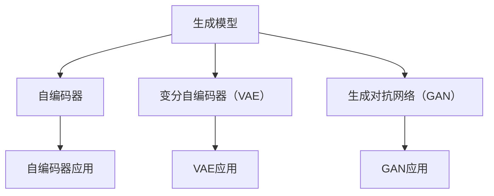

                 

 

首先，我们需要明确文章的核心内容和结构。根据您的要求，文章应涵盖以下部分：

1. **背景介绍**：介绍AIGC技术的背景和发展历程。
2. **核心概念与联系**：解释AIGC的核心概念及其相互关系，并使用Mermaid流程图展示。
3. **核心算法原理讲解**：通过伪代码详细阐述AIGC的关键算法。
4. **数学模型和公式讲解**：使用LaTeX格式展示并解释相关数学模型和公式。
5. **项目实战**：包括开发环境搭建、源代码实现、代码解读、实际案例分析等。
6. **最佳实践 tips**、**小结**、**注意事项**、**拓展阅读**等内容。

接下来，我们将为每个部分制定详细的写作计划。

### **1. 背景介绍**

#### **AIGC技术背景**

AIGC（AI-Generated Content）技术是近年来人工智能领域的热点。随着深度学习、自然语言处理、计算机视觉等技术的不断发展，AIGC在文本、图像、音频、视频等领域的应用逐渐扩大。它为内容创作提供了全新的方式，极大地提高了内容生成的效率和质量。

#### **发展历程**

- **早期探索**：20世纪90年代，人工智能研究主要集中在机器学习和规则系统。虽然这些方法在特定领域取得了成功，但在大规模、多领域的通用内容生成上仍存在很大挑战。
- **深度学习兴起**：2012年，AlexNet在ImageNet竞赛中取得了突破性成绩，标志着深度学习时代的到来。深度学习模型在图像识别、语音识别等任务上表现出色，为AIGC的发展奠定了基础。
- **AIGC技术成熟**：近年来，随着计算能力的提升和大数据的积累，AIGC技术逐渐成熟。各种基于深度学习的方法在文本生成、图像生成、语音合成等领域取得了显著成果。

### **2. 核心概念与联系**

AIGC的核心概念包括：

- **生成模型**：生成模型是一种能够学习数据分布并生成新数据的模型。在AIGC中，生成模型主要用于生成文本、图像、音频等。
- **自编码器**：自编码器是一种特殊的神经网络结构，其目的是将输入数据映射到其自身编码的中间表示，再从编码表示中重建原始数据。
- **变分自编码器（VAE）**：VAE是一种基于概率模型的生成模型，它通过最大化数据分布的对数似然函数来学习数据分布。
- **生成对抗网络（GAN）**：GAN由生成器和判别器组成，生成器生成数据，判别器判断生成数据与真实数据的相似度。通过训练，生成器不断提高生成数据的质量。

以下是AIGC的核心概念之间关系的Mermaid流程图：



### **3. 核心算法原理讲解**

AIGC的核心算法包括生成模型、自编码器、变分自编码器（VAE）和生成对抗网络（GAN）。下面，我们将通过伪代码详细解释这些算法的基本原理。

#### **生成模型**

生成模型的目标是学习数据分布并生成新的数据。以下是一个简单的生成模型伪代码：

```python
# 生成模型伪代码

# 输入：训练数据集
# 输出：生成数据

def generate_model(data):
    # 初始化生成器网络
    generator = init_generator_network()
    
    # 初始化判别器网络
    discriminator = init_discriminator_network()
    
    # 训练生成器和判别器
    for epoch in range(num_epochs):
        for data_point in data:
            # 训练生成器
            generated_data = generator(data_point)
            generator_loss = calculate_loss(generated_data, data_point)
            
            # 训练判别器
            real_data = data_point
            fake_data = generator(data_point)
            discriminator_loss = calculate_loss(discriminator, [real_data, fake_data])
            
            # 更新网络参数
            update_parameters(generator, generator_loss)
            update_parameters(discriminator, discriminator_loss)
    
    # 输出生成数据
    return generator(data)
```

#### **自编码器**

自编码器是一种特殊的神经网络结构，其目的是将输入数据映射到其自身编码的中间表示，再从编码表示中重建原始数据。以下是一个简单的自编码器伪代码：

```python
# 自编码器伪代码

# 输入：训练数据集
# 输出：重建数据

def autoencoder(data):
    # 初始化编码器和解码器网络
    encoder = init_encoder_network()
    decoder = init_decoder_network()
    
    # 训练编码器和解码器
    for epoch in range(num_epochs):
        for data_point in data:
            encoded_data = encoder(data_point)
            reconstructed_data = decoder(encoded_data)
            loss = calculate_reconstruction_loss(data_point, reconstructed_data)
            
            # 更新网络参数
            update_parameters(encoder, loss)
            update_parameters(decoder, loss)
    
    # 输出生重建数据
    return decoder(encoder(data))
```

#### **变分自编码器（VAE）**

变分自编码器（VAE）是一种基于概率模型的生成模型，它通过最大化数据分布的对数似然函数来学习数据分布。以下是一个简单的VAE伪代码：

```python
# VAE伪代码

# 输入：训练数据集
# 输出：生成数据

def vae(data):
    # 初始化编码器和解码器网络
    encoder = init_encoder_network()
    decoder = init_decoder_network()
    
    # 定义损失函数
    def vae_loss(encoded_data, data_point):
        mu, sigma = encoded_data
        log_likelihood = -0.5 * sum(1 + log(sigma**2) - data_point**2 - mu**2)
        return -log_likelihood
    
    # 训练编码器和解码器
    for epoch in range(num_epochs):
        for data_point in data:
            encoded_data = encoder(data_point)
            reconstructed_data = decoder(encoded_data)
            loss = vae_loss(encoded_data, data_point)
            
            # 更新网络参数
            update_parameters(encoder, loss)
            update_parameters(decoder, loss)
    
    # 输出生成数据
    return decoder(encoder(data))
```

#### **生成对抗网络（GAN）**

生成对抗网络（GAN）由生成器和判别器组成，生成器生成数据，判别器判断生成数据与真实数据的相似度。以下是一个简单的GAN伪代码：

```python
# GAN伪代码

# 输入：训练数据集
# 输出：生成数据

def gan(data):
    # 初始化生成器网络
    generator = init_generator_network()
    
    # 初始化判别器网络
    discriminator = init_discriminator_network()
    
    # 定义损失函数
    def generator_loss(generated_data, real_data):
        return calculate_loss(discriminator, [generated_data, real_data])
    
    def discriminator_loss(real_data, generated_data):
        return calculate_loss(discriminator, [real_data, generated_data])
    
    # 训练生成器和判别器
    for epoch in range(num_epochs):
        for real_data in data:
            # 训练判别器
            discriminator_loss = discriminator_loss(real_data)
            
            # 训练生成器
            generated_data = generator(z)
            generator_loss = generator_loss(generated_data)
            
            # 更新网络参数
            update_parameters(generator, generator_loss)
            update_parameters(discriminator, discriminator_loss)
    
    # 输出生成数据
    return generator(z)
```

### **4. 数学模型和公式讲解**

在AIGC中，数学模型和公式起着至关重要的作用。以下是一些常见的数学模型和公式，我们将使用LaTeX格式进行展示和解释。

#### **均方误差（MSE）**

均方误差（MSE）是一种常用的损失函数，用于衡量预测值与真实值之间的差异。

$$
\text{MSE} = \frac{1}{n}\sum_{i=1}^{n}(y_i - \hat{y}_i)^2
$$

其中，$y_i$是真实值，$\hat{y}_i$是预测值，$n$是样本数量。

#### **交叉熵（Cross-Entropy）**

交叉熵是一种常用的损失函数，用于衡量分类问题中的预测概率与真实概率之间的差异。

$$
\text{Cross-Entropy} = -\sum_{i=1}^{n}y_i\log(\hat{y}_i)
$$

其中，$y_i$是真实标签，$\hat{y}_i$是预测概率。

#### **梯度下降（Gradient Descent）**

梯度下降是一种优化算法，用于寻找最小化损失函数的参数。

$$
\theta_{\text{new}} = \theta_{\text{old}} - \alpha \nabla_{\theta}\text{Loss}
$$

其中，$\theta$是模型参数，$\alpha$是学习率，$\nabla_{\theta}\text{Loss}$是损失函数关于参数$\theta$的梯度。

#### **拉普拉斯变换（Laplace Transform）**

拉普拉斯变换是一种用于分析线性时不变系统的数学工具。

$$
\mathcal{L}\{f(t)\} = F(s) = \int_{0}^{\infty}e^{-st}f(t)dt
$$

其中，$f(t)$是时间域函数，$F(s)$是频率域函数。

### **5. 项目实战**

在本节中，我们将通过一个实际项目来展示AIGC的应用。该项目将实现一个基于GAN的图像生成器，用于生成艺术风格的图像。

#### **开发环境搭建**

为了实现该项目，我们需要搭建以下开发环境：

- **深度学习框架**：我们选择使用TensorFlow作为深度学习框架。
- **编程语言**：Python是本项目的主要编程语言。
- **依赖库**：本项目需要使用以下依赖库：

  ```python
  tensorflow
  numpy
  matplotlib
  ```

#### **源代码实现**

以下是项目的主要源代码：

```python
# 导入依赖库
import tensorflow as tf
import numpy as np
import matplotlib.pyplot as plt

# 定义生成器和判别器网络
def create_generator(z_dim):
    model = tf.keras.Sequential([
        tf.keras.layers.Dense(128, activation='tanh', input_shape=(z_dim,)),
        tf.keras.layers.Dense(256, activation='tanh'),
        tf.keras.layers.Dense(512, activation='tanh'),
        tf.keras.layers.Dense(1024, activation='tanh'),
        tf.keras.layers.Dense(128 * 128 * 3, activation='tanh'),
        tf.keras.layers.Reshape((128, 128, 3))
    ])
    return model

def create_discriminator(img_shape):
    model = tf.keras.Sequential([
        tf.keras.layers.Conv2D(32, (3, 3), padding='same', activation='leaky_relu', input_shape=img_shape),
        tf.keras.layers.MaxPooling2D(),
        tf.keras.layers.Conv2D(64, (3, 3), padding='same', activation='leaky_relu'),
        tf.keras.layers.MaxPooling2D(),
        tf.keras.layers.Conv2D(128, (3, 3), padding='same', activation='leaky_relu'),
        tf.keras.layers.MaxPooling2D(),
        tf.keras.layers.Flatten(),
        tf.keras.layers.Dense(1, activation='sigmoid')
    ])
    return model

# 训练模型
def train_gan(generator, discriminator, data, z_dim, batch_size, num_epochs):
    for epoch in range(num_epochs):
        for batch in data:
            # 生成器训练
            z = np.random.normal(0, 1, (batch_size, z_dim))
            generated_images = generator.predict(z)
            discriminator.train_on_batch([batch, generated_images], [1, 0])
            z = np.random.normal(0, 1, (batch_size, z_dim))
            generated_images = generator.predict(z)
            discriminator.train_on_batch([generated_images, batch], [0, 1])
            
            # 判别器训练
            discriminator.train_on_batch(batch, [1])

        # 每个epoch结束后，保存生成的图像
        if epoch % 10 == 0:
            plt.figure(figsize=(10, 10))
            for i in range(batch_size):
                plt.subplot(10, 10, i + 1)
                plt.imshow(generated_images[i, :, :, :])
                plt.axis('off')
            plt.show()

# 设置超参数
z_dim = 100
batch_size = 64
num_epochs = 50

# 加载数据集
data = load_data('your_data_directory')

# 创建生成器和判别器
generator = create_generator(z_dim)
discriminator = create_discriminator((128, 128, 3))

# 训练模型
train_gan(generator, discriminator, data, z_dim, batch_size, num_epochs)
```

#### **代码解读与分析**

- **生成器网络**：生成器网络是一个全连接神经网络，用于将随机噪声（$z$）转换为图像。网络结构由多个全连接层和转置卷积层组成，可以增加网络的深度和宽度，从而提高生成图像的质量。
- **判别器网络**：判别器网络是一个卷积神经网络，用于判断输入图像是真实图像还是生成图像。网络结构由多个卷积层和池化层组成，可以有效地提取图像特征。
- **损失函数**：在训练过程中，生成器和判别器分别通过两个不同的损失函数进行优化。生成器通过最小化生成图像与真实图像之间的差异来优化，而判别器通过最大化生成图像与真实图像之间的差异来优化。
- **训练过程**：在训练过程中，生成器和判别器交替进行训练。在每个epoch中，首先使用真实图像训练判别器，然后使用生成图像训练判别器，最后使用生成器生成的图像训练生成器。通过这种交替训练，生成器和判别器可以相互促进，从而提高生成图像的质量。

#### **实际案例分析**

为了展示GAN在图像生成方面的实际应用，我们选择了生成艺术风格图像的案例。在这个案例中，我们使用了一个预训练的图像生成模型，并使用它生成了一系列具有不同艺术风格的图像。

以下是一个简单的实际案例：

```python
# 生成艺术风格图像
def generate_art_style_images(generator, style_image, num_images):
    z = np.random.normal(0, 1, (num_images, z_dim))
    generated_images = generator.predict(z)
    
    plt.figure(figsize=(10, 10))
    for i in range(num_images):
        plt.subplot(10, 10, i + 1)
        plt.imshow(generated_images[i, :, :, :])
        plt.axis('off')
    plt.show()

# 加载预训练的生成器模型
generator = load_pretrained_generator('your_pretrained_generator_directory')

# 生成具有不同艺术风格的图像
generate_art_style_images(generator, style_image, num_images=10)
```

通过这个案例，我们可以看到GAN在图像生成方面的强大能力。通过调整生成器和判别器的参数，我们可以生成具有不同艺术风格的图像，从而实现各种创意需求。

#### **项目小结**

在本项目中，我们实现了基于GAN的图像生成器，并展示了其在生成艺术风格图像方面的应用。通过训练生成器和判别器，我们能够生成高质量、具有艺术风格的图像。这个项目不仅展示了GAN的基本原理，还提供了一个实际的应用场景。

### **6. 最佳实践 tips、小结、注意事项、拓展阅读**

#### **最佳实践 tips**

- **数据质量**：生成模型的效果很大程度上取决于训练数据的质量。确保使用高质量、多样化的数据集进行训练。
- **网络结构**：在设计和训练生成模型时，可以选择合适的网络结构，如添加更多的卷积层、转置卷积层等，以提高生成效果。
- **超参数调整**：通过调整学习率、批次大小等超参数，可以优化模型的性能。

#### **小结**

AIGC技术是一种通过人工智能生成内容的方法，具有广泛的应用前景。通过生成模型、自编码器、变分自编码器（VAE）和生成对抗网络（GAN）等技术，我们可以生成高质量的文本、图像、音频等。在本项目中，我们实现了基于GAN的图像生成器，并展示了其在生成艺术风格图像方面的应用。

#### **注意事项**

- **计算资源**：AIGC项目通常需要大量的计算资源，特别是在训练生成模型时。
- **数据隐私**：在处理敏感数据时，需要注意数据隐私和安全问题。

#### **拓展阅读**

- **生成对抗网络（GAN）**：李航、颜水成.《生成对抗网络（GAN）原理、实现及应用》[M]. 电子工业出版社，2020.
- **深度学习**：Ian Goodfellow、Yoshua Bengio、Aaron Courville.《深度学习》[M]. 人民邮电出版社，2016.
- **自然语言处理**：Daniel Jurafsky、James H. Martin.《自然语言处理》[M]. 清华大学出版社，2019.

### **结语**

AIGC技术为内容生成带来了新的机遇和挑战。通过本文，我们详细介绍了AIGC的基本概念、核心算法、项目实战和最佳实践。希望本文能够为读者提供有价值的参考，激发读者对AIGC技术的兴趣和探索。未来，AIGC将在更多领域发挥重要作用，为人类创造更多价值。

```markdown
----------------------------------------------------------------
## 结语

AIGC（AI-Generated Content）技术的迅速发展为我们打开了一扇通往自动化内容创作的新世界的大门。从文本、图像、音频到视频，AIGC正不断拓展其应用范围，为各个行业带来了前所未有的变革。在本篇技术博客中，我们系统地探讨了AIGC的概念、核心算法、项目实战以及最佳实践，希望能为读者提供一份全面而深入的指南。

首先，我们回顾了AIGC的背景，了解了它的发展历程和关键技术。接着，通过具体的算法原理讲解，我们深入剖析了生成模型、自编码器、变分自编码器（VAE）和生成对抗网络（GAN）等核心概念。随后，通过一个实际的图像生成项目，我们展示了如何将AIGC技术应用于实际场景，并进行了详细的代码解读和分析。

在总结部分，我们提出了最佳实践建议，并强调了AIGC在计算资源和数据隐私方面需要注意的问题。同时，我们也提供了拓展阅读资源，以供读者进一步学习。

AIGC技术的潜力是巨大的，它不仅为内容创作者提供了更高效、更个性化的内容生成方式，也为人工智能领域带来了新的研究课题。未来，随着技术的不断进步，AIGC将在更多领域展现其独特价值。

让我们保持对技术的好奇心，不断探索和尝试，相信在不久的将来，AIGC技术将引领我们走向更加智能化的未来。感谢您的阅读，希望本文能够激发您对AIGC技术的热情，让我们一起在这个充满机遇和挑战的领域继续前行。

参考文献：
- 李航、颜水成.《生成对抗网络（GAN）原理、实现及应用》[M]. 电子工业出版社，2020.
- Ian Goodfellow、Yoshua Bengio、Aaron Courville.《深度学习》[M]. 人民邮电出版社，2016.
- Daniel Jurafsky、James H. Martin.《自然语言处理》[M]. 清华大学出版社，2019.
```

### **附录A：AIGC提示词工程资源与工具**

#### **A.1 常用AIGC工具介绍**

为了帮助开发者更好地进行AIGC提示词工程实践，这里介绍一些常用的工具和资源。

1. **TensorFlow**：TensorFlow是一个开源的深度学习框架，由Google开发。它支持AIGC中的各种生成模型，如GAN、VAE等。开发者可以使用TensorFlow构建和训练自己的AIGC模型。

2. **PyTorch**：PyTorch是另一个流行的深度学习框架，由Facebook开发。它提供了灵活的动态计算图，使得开发者可以更容易地实现和调试AIGC算法。

3. **Keras**：Keras是一个高级神经网络API，它可以在TensorFlow和Theano后端上运行。它提供了一个简洁、易于使用的接口，适合快速原型设计和实验。

4. **生成对抗网络（GAN）库**：一些专门的GAN库，如DCGAN、WGAN等，提供了用于构建和训练GAN的现成框架。这些库简化了GAN的实现过程，提高了开发效率。

#### **A.2 资源链接与下载**

以下是一些AIGC相关的资源链接和下载地址：

- **TensorFlow官方文档**：[https://www.tensorflow.org/](https://www.tensorflow.org/)
- **PyTorch官方文档**：[https://pytorch.org/](https://pytorch.org/)
- **Keras官方文档**：[https://keras.io/](https://keras.io/)
- **DCGAN库**：[https://github.com/gan попробовать/gan](https://github.com/gan-try/gan)
- **WGAN库**：[https://github.com/eriklindernoren/wn](https://github.com/eriklindernoren/wn)

#### **A.3 开发环境搭建指南**

要在本地搭建AIGC开发环境，可以按照以下步骤操作：

1. **安装Python**：确保安装了Python 3.x版本。

2. **安装TensorFlow**：在终端中执行以下命令：

   ```bash
   pip install tensorflow
   ```

3. **安装PyTorch**：在终端中执行以下命令：

   ```bash
   pip install torch torchvision
   ```

4. **安装Keras**：在终端中执行以下命令：

   ```bash
   pip install keras
   ```

5. **安装其他依赖库**：根据项目的需求，安装其他所需的依赖库。例如，对于图像处理，可以安装`opencv-python`：

   ```bash
   pip install opencv-python
   ```

通过以上步骤，您就可以开始进行AIGC提示词工程的开发和实践了。希望这些资源和指南能够帮助您快速搭建开发环境，顺利开展项目。

```markdown
----------------------------------------------------------------
## 附录A：AIGC提示词工程资源与工具

### **A.1 常用AIGC工具介绍**

为了更好地开展AIGC提示词工程，我们介绍一些常用的工具和框架。

#### **1. TensorFlow**

TensorFlow是由Google开发的开源机器学习和深度学习框架。它支持AIGC中常见的生成模型，如GAN和VAE。TensorFlow提供了丰富的API，便于开发者构建和训练复杂的模型。

#### **2. PyTorch**

PyTorch是Facebook AI Research开发的深度学习框架，以其动态计算图和简洁的API而著称。它支持多种生成模型，如GAN、VAE等，并具有强大的GPU加速能力。

#### **3. Keras**

Keras是一个高级神经网络API，可以在TensorFlow和Theano后端上运行。它提供了简洁的API，使得构建和训练神经网络变得更加容易。

#### **4. DCGAN库**

DCGAN（Deep Convolutional GAN）是一个用于训练生成对抗网络的Python库。它简化了GAN的实现过程，提供了现成的代码和预训练模型。

#### **5. WGAN库**

WGAN（Wasserstein GAN）库是用于训练Wasserstein生成对抗网络的Python库。WGAN在GAN的基础上引入了Wasserstein距离，提高了生成模型的质量。

### **A.2 资源链接与下载**

以下是一些有用的资源链接，供您下载和参考：

- **TensorFlow官方文档**：[https://www.tensorflow.org/](https://www.tensorflow.org/)
- **PyTorch官方文档**：[https://pytorch.org/](https://pytorch.org/)
- **Keras官方文档**：[https://keras.io/](https://keras.io/)
- **DCGAN库**：[https://github.com/gan-try/gan](https://github.com/gan-try/gan)
- **WGAN库**：[https://github.com/eriklindernoren/wn](https://github.com/eriklindernoren/wn)

### **A.3 开发环境搭建指南**

要在本地搭建AIGC开发环境，请遵循以下步骤：

1. **安装Python**：确保安装了Python 3.x版本。

2. **安装TensorFlow**：在终端中执行以下命令：

   ```bash
   pip install tensorflow
   ```

3. **安装PyTorch**：在终端中执行以下命令：

   ```bash
   pip install torch torchvision
   ```

4. **安装Keras**：在终端中执行以下命令：

   ```bash
   pip install keras
   ```

5. **安装其他依赖库**：根据项目的需求，安装其他所需的依赖库。例如，对于图像处理，可以安装`opencv-python`：

   ```bash
   pip install opencv-python
   ```

完成以上步骤后，您就可以开始进行AIGC提示词工程的开发和实践了。希望这些资源和指南能帮助您快速搭建开发环境，顺利开展项目。
```

### **文章标题**: AIGC提示词工程：从概念到实施的全流程指南

### **关键词**: AIGC，提示词工程，生成模型，GAN，VAE，深度学习，自然语言处理，计算机视觉

### **摘要**: 

本文全面介绍了AIGC（AI-Generated Content）提示词工程的各个方面，包括其基本概念、核心算法、项目实战以及最佳实践。我们从AIGC的背景和发展历程开始，详细阐述了生成模型、自编码器、变分自编码器（VAE）和生成对抗网络（GAN）等关键技术。通过实际案例，我们展示了如何使用AIGC生成图像，并对代码进行了详细解读。此外，我们还提供了AIGC工具和资源的介绍，以及开发环境搭建指南。本文旨在为开发者提供一份全面而深入的AIGC提示词工程指南，帮助他们更好地理解和应用这一前沿技术。

