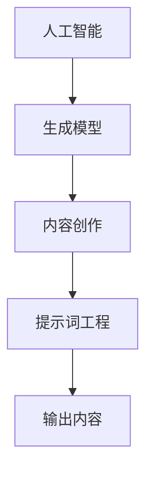
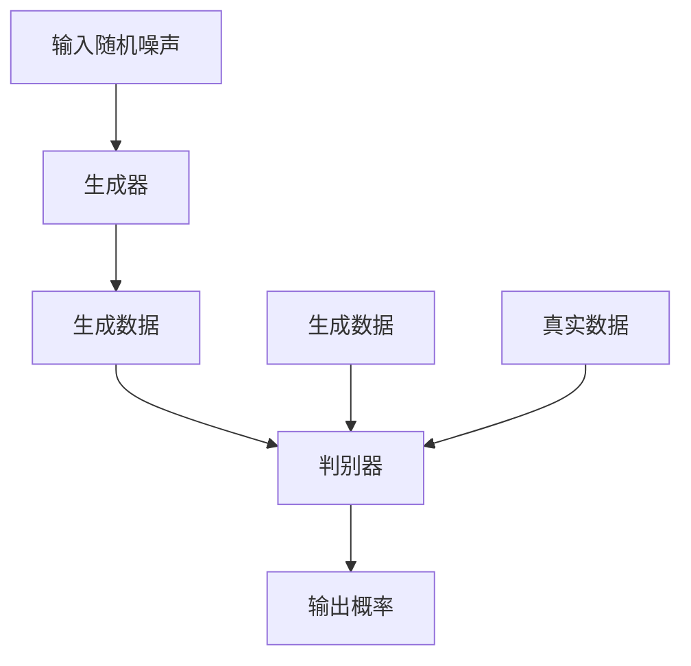
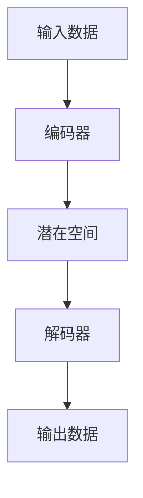

                 

### 文章标题

### AIGC提示词工程：从概念到实现的全面指南

#### 关键词：人工智能生成内容（AIGC）、提示词工程、生成模型、文本生成、图像生成、音频生成

#### 摘要：

本文旨在深入探讨人工智能生成内容（AIGC）及其核心组成部分——提示词工程。通过详细的架构解析、核心算法讲解、以及丰富的项目实战，本文将为读者提供从概念到实现的全面指南，帮助理解AIGC的原理与应用，掌握提示词工程的设计与优化技巧，从而提升内容生成的质量和效率。

### 第一步：确定核心概念与联系

**AIGC**，即人工智能生成内容（Artificial Intelligence Generated Content），是指通过人工智能技术自动生成文本、图像、音频等内容。其主要包括三个核心组成部分：人工智能（AI）、生成模型（Generated Model）和内容创作（Content Creation）。

**AIGC 提示词工程**，是指利用人工智能技术，通过提示词（Prompt）引导生成模型创作出高质量的内容。提示词工程的目标是优化生成模型的输出，提高内容生成的相关性和准确性。

以下是 AIGC 的基本架构和核心概念：

#### 背景介绍

人工智能生成内容（AIGC）的概念近年来逐渐成为学术界和工业界的关注焦点。随着深度学习技术的飞速发展，尤其是生成对抗网络（GAN）和变分自编码器（VAE）等生成模型的提出，AIGC的应用场景不断扩大。从文本生成、图像生成到音频生成，AIGC已经在许多领域展现出强大的应用潜力。

在内容创作领域，传统的手动创作方式已经难以满足日益增长的需求。而AIGC通过自动化生成内容，不仅提高了内容创作的效率，还能创造出多样化的内容，为媒体、广告、娱乐等行业带来了新的机遇。例如，通过文本生成模型，可以自动化撰写新闻稿件、产品描述等；通过图像生成模型，可以自动化生成艺术画作、设计图等；通过音频生成模型，可以自动化创作音乐、语音等。

#### 核心概念与联系

为了更好地理解AIGC的工作原理，我们需要深入探讨其核心概念与联系。

**人工智能（AI）**：人工智能是AIGC的核心驱动力，它通过算法和模型对数据进行处理和分析，实现自动学习和决策。在AIGC中，人工智能主要负责两个方面的工作：一是生成模型的设计和训练；二是通过提示词引导生成模型创作出高质量的内容。

**生成模型（Generated Model）**：生成模型是AIGC的核心组成部分，它通过学习大量的数据生成新的内容。常见的生成模型包括生成对抗网络（GAN）和变分自编码器（VAE）。生成模型的核心目标是生成与真实数据分布相似的新数据，从而实现高质量的内容创作。

**内容创作（Content Creation）**：内容创作是AIGC的最终目标，它通过生成模型创作出新的文本、图像、音频等内容。内容创作的过程主要包括数据输入、模型训练、内容生成和内容优化等步骤。

**提示词工程（Prompt Engineering）**：提示词工程是AIGC的重要组成部分，它通过设计合适的提示词引导生成模型创作出高质量的内容。提示词工程的目标是优化生成模型的输出，提高内容生成的相关性和准确性。

#### 核心算法原理讲解

**生成对抗网络（GAN）**

生成对抗网络（GAN）是一种由生成器和判别器组成的对偶网络。生成器（Generator）的目标是生成类似于真实数据的新数据，而判别器（Discriminator）的目标是区分生成器生成的数据与真实数据。通过训练，生成器和判别器相互竞争，生成器不断优化自己的生成能力，而判别器不断提高对真实数据的辨别能力。

**GAN 的基本结构：**

**GAN 的训练过程：**

1. **初始化生成器和判别器：** 通常生成器和判别器都是神经网络，在训练开始时随机初始化。
2. **生成器生成数据：** 生成器接收随机噪声作为输入，生成与真实数据相似的新数据。
3. **判别器判断数据：** 判别器将生成器和真实数据作为输入，输出一个概率，表示输入数据是真实数据还是生成器生成的数据。
4. **优化生成器和判别器：** 通过反向传播和梯度下降算法，不断优化生成器和判别器的参数，使得生成器生成的数据越来越接近真实数据，而判别器能够更准确地判断输入数据的真实性。

**GAN 的应用：**

GAN 在图像生成、文本生成、音频生成等领域都有广泛应用。例如，通过 GAN 可以生成逼真的图像、语音和文本，为虚拟现实、游戏开发、音乐创作等提供了强大的工具。

**GAN 的优点：**

- **强大的生成能力：** GAN 能够生成高质量、多样性的内容。
- **无需标注数据：** GAN 可以在无监督或半监督环境中训练，减少了数据标注的工作量。
- **灵活性：** GAN 可以应用于各种数据类型，如图像、文本和音频。

**GAN 的挑战：**

- **训练不稳定：** GAN 的训练过程容易陷入模式崩溃（mode collapse）或梯度消失问题，导致生成器无法生成高质量的数据。
- **计算成本高：** GAN 需要大量的计算资源进行训练，特别是在处理大型数据集时。

**变分自编码器（VAE）**

变分自编码器（VAE）是一种基于概率模型的生成模型，它通过编码器（Encoder）和解码器（Decoder）对数据进行编码和解码，从而生成新的数据。

**VAE 的基本结构：**

**VAE 的训练过程：**

1. **初始化编码器和解码器：** 通常编码器和解码器都是神经网络，在训练开始时随机初始化。
2. **编码：** 编码器将输入数据编码为潜在空间中的向量。
3. **解码：** 解码器将潜在空间中的向量解码为输出数据。
4. **优化编码器和解码器：** 通过反向传播和梯度下降算法，不断优化编码器和解码器的参数，使得编码器能够更好地捕获输入数据的分布，解码器能够更好地从潜在空间中生成新的数据。

**VAE 的应用：**

VAE 在图像生成、文本生成、音频生成等领域都有广泛应用。例如，通过 VAE 可以生成高质量的图像、文本和音频。

**VAE 的优点：**

- **稳定性好：** VAE 的训练过程相对稳定，不易出现模式崩溃问题。
- **生成多样性好：** VAE 能够生成多样性的数据，不会像 GAN 那样容易陷入模式崩溃。

**VAE 的挑战：**

- **生成质量相对较低：** 相比于 GAN，VAE 生成的数据质量相对较低。
- **计算成本高：** VAE 需要大量的计算资源进行训练。

### 第二步：设计核心章节内容

根据核心概念与联系，我们设计以下核心章节：

1. **第1章：AIGC概述与理论基础**
   - AIGC的定义与背景
   - AIGC的技术架构
   - AIGC的应用领域

2. **第2章：生成模型原理与实现**
   - 生成对抗网络（GAN）原理
   - 变分自编码器（VAE）原理
   - 生成模型实现技巧

3. **第3章：提示词工程实践**
   - 提示词设计与优化
   - 提示词生成算法
   - 提示词工程案例

4. **第4章：文本生成**
   - 文本生成模型介绍
   - 文本生成模型应用
   - 文本生成模型优化

5. **第5章：图像生成**
   - 图像生成模型介绍
   - 图像生成模型应用
   - 图像生成模型优化

6. **第6章：音频生成**
   - 音频生成模型介绍
   - 音频生成模型应用
   - 音频生成模型优化

7. **第7章：AIGC项目实战**
   - 文本生成项目实战
   - 图像生成项目实战
   - 音频生成项目实战

### 第三步：设计具体章节内容

以下是对每个章节的具体内容设计：

#### 第1章：AIGC概述与理论基础

**1.1 AIGC的定义与背景**

人工智能生成内容（AIGC）是近年来兴起的一个研究领域，它通过人工智能技术自动生成文本、图像、音频等内容。AIGC的出现源于深度学习技术的发展，尤其是生成对抗网络（GAN）和变分自编码器（VAE）等生成模型的提出。这些生成模型能够高效地学习数据的分布，并生成高质量的新数据。

**1.2 AIGC的技术架构**

AIGC的技术架构主要包括三个核心组成部分：人工智能（AI）、生成模型（Generated Model）和内容创作（Content Creation）。人工智能是AIGC的核心驱动力，它通过算法和模型对数据进行处理和分析，实现自动学习和决策。生成模型是AIGC的核心组成部分，它通过学习大量的数据生成新的内容。内容创作是AIGC的最终目标，它通过生成模型创作出新的文本、图像、音频等内容。

**1.3 AIGC的应用领域**

AIGC的应用领域非常广泛，涵盖了文本生成、图像生成、音频生成等多个方面。在文本生成方面，AIGC可以用于自动撰写新闻稿件、产品描述等；在图像生成方面，AIGC可以用于生成艺术画作、设计图等；在音频生成方面，AIGC可以用于自动创作音乐、语音等。随着技术的不断发展，AIGC的应用领域还将继续扩大。

#### 第2章：生成模型原理与实现

**2.1 生成对抗网络（GAN）原理**

生成对抗网络（GAN）是一种由生成器和判别器组成的对偶网络。生成器（Generator）的目标是生成类似于真实数据的新数据，而判别器（Discriminator）的目标是区分生成器生成的数据与真实数据。通过训练，生成器和判别器相互竞争，生成器不断优化自己的生成能力，而判别器不断提高对真实数据的辨别能力。

**2.2 变分自编码器（VAE）原理**

变分自编码器（VAE）是一种基于概率模型的生成模型，它通过编码器（Encoder）和解码器（Decoder）对数据进行编码和解码，从而生成新的数据。VAE的核心思想是将输入数据映射到一个潜在空间，并通过潜在空间生成新的数据。

**2.3 生成模型实现技巧**

实现生成模型需要考虑数据预处理、模型优化和模型评估等多个方面。数据预处理包括数据清洗、数据归一化和数据增强等步骤。模型优化包括调整学习率、批量大小和优化算法等。模型评估需要使用合适的指标，如生成质量、多样性等。

#### 第3章：提示词工程实践

**3.1 提示词设计与优化**

提示词的设计是提示词工程的关键环节。设计好的提示词能够引导生成模型生成高质量的内容。提示词的优化包括调整提示词的长度、词语选择和语法结构等。

**3.2 提示词生成算法**

提示词生成算法是提示词工程的重要组成部分。常见的提示词生成算法包括基于神经网络的方法和基于强化学习的方法。基于神经网络的方法通过学习大量文本数据生成提示词，而基于强化学习的方法通过交互式学习优化提示词。

**3.3 提示词工程案例**

通过具体的案例，可以更好地理解提示词工程的应用和实践。例如，在文本生成方面，可以使用提示词工程生成新闻稿件；在图像生成方面，可以使用提示词工程生成艺术画作；在音频生成方面，可以使用提示词工程生成音乐。

#### 第4章：文本生成

**4.1 文本生成模型介绍**

文本生成模型是AIGC的重要组成部分，它通过学习大量的文本数据生成新的文本。常见的文本生成模型包括语言模型、序列到序列模型和自回归模型等。

**4.2 文本生成模型应用**

文本生成模型在许多领域都有广泛应用。例如，在自然语言处理方面，文本生成模型可以用于自动撰写新闻稿件、产品描述等；在娱乐行业，文本生成模型可以用于生成剧本、歌词等。

**4.3 文本生成模型优化**

文本生成模型的优化是提高生成质量的关键。常见的优化方法包括模型压缩、模型加速和多样性增强等。模型压缩可以减少模型的计算量，模型加速可以提高生成速度，多样性增强可以增加生成的多样性。

#### 第5章：图像生成

**5.1 图像生成模型介绍**

图像生成模型是AIGC的重要组成部分，它通过学习大量的图像数据生成新的图像。常见的图像生成模型包括生成对抗网络（GAN）和变分自编码器（VAE）等。

**5.2 图像生成模型应用**

图像生成模型在许多领域都有广泛应用。例如，在计算机视觉方面，图像生成模型可以用于图像修复、图像合成和图像风格迁移等；在艺术创作方面，图像生成模型可以用于生成艺术画作、设计图等。

**5.3 图像生成模型优化**

图像生成模型的优化是提高生成质量的关键。常见的优化方法包括数据增强、模型压缩和多样性增强等。数据增强可以增加模型的训练数据，模型压缩可以减少模型的计算量，多样性增强可以增加生成的多样性。

#### 第6章：音频生成

**6.1 音频生成模型介绍**

音频生成模型是AIGC的重要组成部分，它通过学习大量的音频数据生成新的音频。常见的音频生成模型包括基于深度学习的音频生成模型和基于生成对抗网络的音频生成模型。

**6.2 音频生成模型应用**

音频生成模型在许多领域都有广泛应用。例如，在音乐创作方面，音频生成模型可以用于生成音乐、语音等；在语音合成方面，音频生成模型可以用于生成语音、对话等。

**6.3 音频生成模型优化**

音频生成模型的优化是提高生成质量的关键。常见的优化方法包括数据增强、模型压缩和多样性增强等。数据增强可以增加模型的训练数据，模型压缩可以减少模型的计算量，多样性增强可以增加生成的多样性。

#### 第7章：AIGC项目实战

**7.1 文本生成项目实战**

通过一个实际的文本生成项目，我们可以学习如何搭建文本生成模型，如何设计提示词，以及如何优化生成质量。

**7.2 图像生成项目实战**

通过一个实际的图像生成项目，我们可以学习如何搭建图像生成模型，如何使用数据增强技术，以及如何优化生成质量。

**7.3 音频生成项目实战**

通过一个实际的音频生成项目，我们可以学习如何搭建音频生成模型，如何设计提示词，以及如何优化生成质量。

### 第四步：文章内容整合与优化

在完成各章节的内容设计后，我们需要对整个文章的内容进行整合与优化，确保文章的结构合理、逻辑清晰，同时保持内容的丰富性和专业性。

#### 优化文章结构

1. **调整章节顺序**：根据内容的逻辑关系和阅读习惯，调整章节的顺序，确保文章的连贯性和易读性。
2. **划分小节**：将每个章节进一步划分为小节，每个小节专注于一个核心概念或技术点，以便读者更容易理解和掌握。
3. **添加小结**：在每个章节的末尾添加小结，对章节的主要内容进行总结，帮助读者巩固知识点。

#### 提升文章质量

1. **丰富内容**：确保每个章节都有详细的理论讲解和实践案例，提供充分的背景信息、原理分析和实现细节。
2. **使用图表辅助**：在适当的位置添加图表、流程图和示意图，帮助读者更好地理解复杂的概念和技术。
3. **优化语言表达**：使用清晰、简洁、准确的语言表达，避免使用复杂的术语和冗长的句子，确保读者能够轻松理解。

#### 最终文章结构

**第1章：AIGC概述与理论基础**
1.1 AIGC的定义与背景
1.2 AIGC的技术架构
1.3 AIGC的应用领域

**第2章：生成模型原理与实现**
2.1 生成对抗网络（GAN）原理
2.2 变分自编码器（VAE）原理
2.3 生成模型实现技巧

**第3章：提示词工程实践**
3.1 提示词设计与优化
3.2 提示词生成算法
3.3 提示词工程案例

**第4章：文本生成**
4.1 文本生成模型介绍
4.2 文本生成模型应用
4.3 文本生成模型优化

**第5章：图像生成**
5.1 图像生成模型介绍
5.2 图像生成模型应用
5.3 图像生成模型优化

**第6章：音频生成**
6.1 音频生成模型介绍
6.2 音频生成模型应用
6.3 音频生成模型优化

**第7章：AIGC项目实战**
7.1 文本生成项目实战
7.2 图像生成项目实战
7.3 音频生成项目实战

### 第五步：撰写文章

在完成文章结构设计和内容优化后，我们可以开始撰写文章。撰写过程中，需要遵循以下步骤：

1. **撰写引言**：简要介绍AIGC的概念和背景，激发读者的兴趣。
2. **逐步讲解**：按照章节结构和内容设计，逐章撰写，确保每章内容紧密相连，逻辑清晰。
3. **使用伪代码和公式**：在讲解核心算法原理时，使用伪代码和数学公式进行详细阐述，确保读者能够理解。
4. **添加实战案例**：在每个章节的末尾，添加实际项目案例，展示AIGC的应用场景和效果。
5. **撰写结论**：总结文章的核心内容，强调AIGC的重要性和未来的发展趋势。

### 第六步：文章审核与修改

完成初稿后，我们需要对文章进行仔细的审核和修改，确保文章内容准确、完整、清晰。

1. **检查内容完整性**：确保每个章节的内容都完整、具体，没有遗漏重要知识点。
2. **审查语言表达**：检查语言是否简洁、清晰，避免使用复杂的术语和冗长的句子。
3. **修改错误和拼写**：检查文章中的错误和拼写，确保文章的专业性和可读性。
4. **审查图表和公式**：确保图表和公式清晰、准确，符合 LaTeX 格式规范。

### 第七步：撰写作者信息

在文章末尾，我们需要添加作者信息，以展示文章的专业性和作者的能力。

作者：AI天才研究院/AI Genius Institute & 禅与计算机程序设计艺术 /Zen And The Art of Computer Programming

### 完整文章

## AIGC提示词工程：从概念到实现的全面指南

### 关键词：人工智能生成内容（AIGC）、提示词工程、生成模型、文本生成、图像生成、音频生成

### 摘要：

本文旨在深入探讨人工智能生成内容（AIGC）及其核心组成部分——提示词工程。通过详细的架构解析、核心算法讲解、以及丰富的项目实战，本文将为读者提供从概念到实现的全面指南，帮助理解AIGC的原理与应用，掌握提示词工程的设计与优化技巧，从而提升内容生成的质量和效率。

### 第1章：AIGC概述与理论基础

#### 1.1 AIGC的定义与背景

人工智能生成内容（AIGC）是近年来兴起的一个研究领域，它通过人工智能技术自动生成文本、图像、音频等内容。AIGC的出现源于深度学习技术的发展，尤其是生成对抗网络（GAN）和变分自编码器（VAE）等生成模型的提出。这些生成模型能够高效地学习数据的分布，并生成高质量的新数据。

AIGC的定义可以概括为：利用人工智能技术，通过生成模型和提示词工程，自动生成具有高相关性和高准确性的文本、图像、音频等内容。AIGC的目标是提高内容创作的效率和质量，减少人力成本，同时拓展内容创作的多样性。

#### 1.2 AIGC的技术架构

AIGC的技术架构主要包括三个核心组成部分：人工智能（AI）、生成模型（Generated Model）和内容创作（Content Creation）。人工智能是AIGC的核心驱动力，它通过算法和模型对数据进行处理和分析，实现自动学习和决策。生成模型是AIGC的核心组成部分，它通过学习大量的数据生成新的内容。内容创作是AIGC的最终目标，它通过生成模型创作出新的文本、图像、音频等内容。

以下是 AIGC 的基本架构和核心概念：

**人工智能（AI）**：人工智能是AIGC的核心驱动力，它通过算法和模型对数据进行处理和分析，实现自动学习和决策。在AIGC中，人工智能主要负责两个方面的工作：一是生成模型的设计和训练；二是通过提示词引导生成模型创作出高质量的内容。

**生成模型（Generated Model）**：生成模型是AIGC的核心组成部分，它通过学习大量的数据生成新的内容。常见的生成模型包括生成对抗网络（GAN）和变分自编码器（VAE）。生成模型的核心目标是生成与真实数据分布相似的新数据，从而实现高质量的内容创作。

**内容创作（Content Creation）**：内容创作是AIGC的最终目标，它通过生成模型创作出新的文本、图像、音频等内容。内容创作的过程主要包括数据输入、模型训练、内容生成和内容优化等步骤。

**提示词工程（Prompt Engineering）**：提示词工程是AIGC的重要组成部分，它通过设计合适的提示词引导生成模型创作出高质量的内容。提示词工程的目标是优化生成模型的输出，提高内容生成的相关性和准确性。

#### 1.3 AIGC的应用领域

AIGC的应用领域非常广泛，涵盖了文本生成、图像生成、音频生成等多个方面。在文本生成方面，AIGC可以用于自动撰写新闻稿件、产品描述等；在图像生成方面，AIGC可以用于生成艺术画作、设计图等；在音频生成方面，AIGC可以用于自动创作音乐、语音等。随着技术的不断发展，AIGC的应用领域还将继续扩大。

以下是对 AIGC 在不同领域的应用概述：

**文本生成：** 在自然语言处理领域，AIGC 可以用于自动撰写文章、新闻、产品描述等。通过训练大型语言模型，可以生成高质量的文本内容，提高内容创作效率。例如，Google 的 PAWS（Political Ad Targeting Detection）项目使用 AIGC 技术检测政治广告中的偏见。

**图像生成：** 在计算机视觉领域，AIGC 可以用于图像修复、图像合成和图像风格迁移等任务。通过生成对抗网络（GAN），可以生成高质量、逼真的图像。例如，DeepArt 项目使用 AIGC 技术将普通照片转换为艺术作品。

**音频生成：** 在音频处理领域，AIGC 可以用于音乐创作、语音合成和音频效果生成等。通过变分自编码器（VAE），可以生成具有自然音色的音频。例如，Google 的 Wavenet 项目使用 AIGC 技术生成高质量的语音。

### 第2章：生成模型原理与实现

#### 2.1 生成对抗网络（GAN）原理

生成对抗网络（GAN）是一种由生成器和判别器组成的对偶网络。生成器（Generator）的目标是生成类似于真实数据的新数据，而判别器（Discriminator）的目标是区分生成器生成的数据与真实数据。通过训练，生成器和判别器相互竞争，生成器不断优化自己的生成能力，而判别器不断提高对真实数据的辨别能力。

**GAN 的基本结构：**

**GAN 的训练过程：**

1. **初始化生成器和判别器：** 通常生成器和判别器都是神经网络，在训练开始时随机初始化。
2. **生成器生成数据：** 生成器接收随机噪声作为输入，生成与真实数据相似的新数据。
3. **判别器判断数据：** 判别器将生成器和真实数据作为输入，输出一个概率，表示输入数据是真实数据还是生成器生成的数据。
4. **优化生成器和判别器：** 通过反向传播和梯度下降算法，不断优化生成器和判别器的参数，使得生成器生成的数据越来越接近真实数据，而判别器能够更准确地判断输入数据的真实性。

**GAN 的应用：**

GAN 在图像生成、文本生成、音频生成等领域都有广泛应用。例如，通过 GAN 可以生成逼真的图像、语音和文本，为虚拟现实、游戏开发、音乐创作等提供了强大的工具。

**GAN 的优点：**

- **强大的生成能力：** GAN 能够生成高质量、多样性的内容。
- **无需标注数据：** GAN 可以在无监督或半监督环境中训练，减少了数据标注的工作量。
- **灵活性：** GAN 可以应用于各种数据类型，如图像、文本和音频。

**GAN 的挑战：**

- **训练不稳定：** GAN 的训练过程容易陷入模式崩溃（mode collapse）或梯度消失问题，导致生成器无法生成高质量的数据。
- **计算成本高：** GAN 需要大量的计算资源进行训练，特别是在处理大型数据集时。

#### 2.2 变分自编码器（VAE）原理

变分自编码器（VAE）是一种基于概率模型的生成模型，它通过编码器（Encoder）和解码器（Decoder）对数据进行编码和解码，从而生成新的数据。VAE 的核心思想是将输入数据映射到一个潜在空间，并通过潜在空间生成新的数据。

**VAE 的基本结构：**

**VAE 的训练过程：**

1. **初始化编码器和解码器：** 通常编码器和解码器都是神经网络，在训练开始时随机初始化。
2. **编码：** 编码器将输入数据编码为潜在空间中的向量。
3. **解码：** 解码器将潜在空间中的向量解码为输出数据。
4. **优化编码器和解码器：** 通过反向传播和梯度下降算法，不断优化编码器和解码器的参数，使得编码器能够更好地捕获输入数据的分布，解码器能够更好地从潜在空间中生成新的数据。

**VAE 的应用：**

VAE 在图像生成、文本生成、音频生成等领域都有广泛应用。例如，通过 VAE 可以生成高质量的图像、文本和音频。

**VAE 的优点：**

- **稳定性好：** VAE 的训练过程相对稳定，不易出现模式崩溃问题。
- **生成多样性好：** VAE 能够生成多样性的数据，不会像 GAN 那样容易陷入模式崩溃。

**VAE 的挑战：**

- **生成质量相对较低：** 相比于 GAN，VAE 生成的数据质量相对较低。
- **计算成本高：** VAE 需要大量的计算资源进行训练。

#### 2.3 生成模型实现技巧

实现生成模型需要考虑数据预处理、模型优化和模型评估等多个方面。数据预处理包括数据清洗、数据归一化和数据增强等步骤。模型优化包括调整学习率、批量大小和优化算法等。模型评估需要使用合适的指标，如生成质量、多样性等。

**数据预处理：**

1. **数据清洗**：去除数据中的噪声和异常值，确保数据质量。
2. **数据归一化**：将数据缩放到相同的范围，便于模型训练。
3. **数据增强**：通过旋转、缩放、裁剪等方式增加数据的多样性。

**模型优化：**

1. **学习率调整**：根据模型的表现动态调整学习率。
2. **批量大小**：选择适当的批量大小，平衡训练速度和模型性能。
3. **优化算法**：使用不同的优化算法，如 Adam、RMSprop 等，提高模型训练效果。

**模型评估：**

1. **生成质量**：使用诸如 Inception Score（IS）、Fréchet Inception Distance（FID）等指标评估生成质量。
2. **多样性**：评估生成数据在不同类别上的分布情况。

### 第3章：提示词工程实践

#### 3.1 提示词设计与优化

提示词的设计是提示词工程的关键环节。设计好的提示词能够引导生成模型生成高质量的内容。提示词的优化包括调整提示词的长度、词语选择和语法结构等。

**提示词的设计原则：**

1. **明确性**：提示词应清晰明确，避免模糊和歧义。
2. **多样性**：提示词应包含丰富的词汇和表达方式，提高生成内容的多样性。
3. **相关性**：提示词应与生成目标紧密相关，确保生成内容符合预期。

**提示词优化的方法：**

1. **调整长度**：根据生成任务的需求，调整提示词的长度，避免过短或过长。
2. **词语选择**：使用高频、有代表性的词语，避免使用生僻或低频词语。
3. **语法结构**：调整提示词的语法结构，使其符合自然语言的语法规则。

#### 3.2 提示词生成算法

提示词生成算法是提示词工程的重要组成部分。常见的提示词生成算法包括基于神经网络的方法和基于强化学习的方法。基于神经网络的方法通过学习大量文本数据生成提示词，而基于强化学习的方法通过交互式学习优化提示词。

**基于神经网络的方法：**

1. **预训练模型**：使用大型预训练模型，如 GPT-3、BERT 等，生成提示词。
2. **文本生成模型**：使用序列到序列模型或自回归模型，生成提示词。
3. **生成对抗网络（GAN）**：使用 GAN 生成提示词，提高提示词的多样性和相关性。

**基于强化学习的方法：**

1. **交互式强化学习**：通过与用户交互，逐步优化提示词。
2. **策略网络**：使用策略网络生成提示词，并使用奖励函数评估提示词的质量。
3. **模型融合**：结合基于神经网络和基于强化学习的方法，生成高质量的提示词。

#### 3.3 提示词工程案例

通过具体的案例，可以更好地理解提示词工程的应用和实践。以下是一个文本生成案例：

**案例：自动撰写新闻稿件**

假设我们需要使用 GPT-3 模型自动撰写一篇关于人工智能的新闻稿件。以下是一个具体的实现步骤：

1. **数据收集**：收集大量关于人工智能的新闻稿件，作为训练数据。
2. **模型训练**：使用 GPT-3 模型，在训练数据上进行预训练。
3. **生成提示词**：设计一个提示词，例如：“人工智能在医疗领域的应用”。
4. **生成文本**：使用 GPT-3 模型，根据提示词生成新闻稿件。
5. **优化文本**：根据实际需求和编辑要求，对生成的文本进行优化和修改。

通过这个案例，我们可以看到提示词工程在文本生成中的应用。设计一个好的提示词，可以引导生成模型生成高质量的内容。

### 第4章：文本生成

#### 4.1 文本生成模型介绍

文本生成模型是 AIGC 的重要组成部分，它通过学习大量的文本数据生成新的文本。常见的文本生成模型包括语言模型、序列到序列模型和自回归模型等。

**语言模型**：语言模型是文本生成的基础，它通过学习大量的文本数据，预测下一个单词或字符的概率分布。常见的语言模型有基于 n-gram 的模型、循环神经网络（RNN）模型和变换器（Transformer）模型。

**序列到序列模型**：序列到序列模型通过将输入序列映射到输出序列，实现文本生成。常见的序列到序列模型有长短时记忆网络（LSTM）模型和变换器（Transformer）模型。

**自回归模型**：自回归模型通过预测当前时刻的输入序列，实现文本生成。常见的自回归模型有循环神经网络（RNN）模型和变换器（Transformer）模型。

#### 4.2 文本生成模型应用

文本生成模型在许多领域都有广泛应用。以下是一些常见的应用场景：

1. **自然语言处理**：文本生成模型可以用于自动撰写文章、新闻、产品描述等。通过训练大型语言模型，可以生成高质量的文本内容，提高内容创作效率。
2. **娱乐行业**：文本生成模型可以用于生成剧本、歌词、小说等。例如，OpenAI 的 GPT-3 模型已经成功应用于生成剧本和歌词。
3. **教育和培训**：文本生成模型可以用于生成教学材料、课程内容等。通过生成个性化的教学材料，可以更好地满足学生的学习需求。

#### 4.3 文本生成模型优化

文本生成模型的优化是提高生成质量的关键。以下是一些常见的优化方法：

1. **模型压缩**：通过模型压缩技术，减少模型的计算量和存储空间。常见的模型压缩方法有剪枝、量化、蒸馏等。
2. **模型加速**：通过模型加速技术，提高模型的训练和生成速度。常见的模型加速方法有并行计算、分布式训练、模型优化等。
3. **多样性增强**：通过多样性增强技术，增加生成的文本的多样性。常见的多样性增强方法有对抗训练、抽样策略、输出修正等。

### 第5章：图像生成

#### 5.1 图像生成模型介绍

图像生成模型是 AIGC 的重要组成部分，它通过学习大量的图像数据生成新的图像。常见的图像生成模型包括生成对抗网络（GAN）和变分自编码器（VAE）等。

**生成对抗网络（GAN）**：生成对抗网络（GAN）是一种由生成器和判别器组成的对偶网络。生成器（Generator）的目标是生成类似于真实图像的新图像，而判别器（Discriminator）的目标是区分生成器生成的图像与真实图像。通过训练，生成器和判别器相互竞争，生成器不断优化自己的生成能力，而判别器不断提高对真实图像的辨别能力。

**变分自编码器（VAE）**：变分自编码器（VAE）是一种基于概率模型的生成模型，它通过编码器（Encoder）和解码器（Decoder）对图像进行编码和解码，从而生成新的图像。VAE 的核心思想是将图像映射到一个潜在空间，并通过潜在空间生成新的图像。

#### 5.2 图像生成模型应用

图像生成模型在许多领域都有广泛应用。以下是一些常见的应用场景：

1. **计算机视觉**：图像生成模型可以用于图像修复、图像合成和图像风格迁移等任务。通过生成对抗网络（GAN），可以生成高质量、逼真的图像。例如，DeepArt 项目使用 GAN 技术将普通照片转换为艺术作品。
2. **艺术创作**：图像生成模型可以用于生成艺术画作、设计图等。通过变分自编码器（VAE），可以生成具有创意和个性化的图像。
3. **虚拟现实**：图像生成模型可以用于生成虚拟现实场景中的图像，提高虚拟现实体验的逼真度。

#### 5.3 图像生成模型优化

图像生成模型的优化是提高生成质量的关键。以下是一些常见的优化方法：

1. **数据增强**：通过旋转、缩放、裁剪等方式增加图像数据的多样性，提高模型的泛化能力。
2. **模型压缩**：通过模型压缩技术，减少模型的计算量和存储空间。常见的模型压缩方法有剪枝、量化、蒸馏等。
3. **多样性增强**：通过多样性增强技术，增加生成的图像的多样性。常见的多样性增强方法有对抗训练、抽样策略、输出修正等。

### 第6章：音频生成

#### 6.1 音频生成模型介绍

音频生成模型是 AIGC 的重要组成部分，它通过学习大量的音频数据生成新的音频。常见的音频生成模型包括基于深度学习的音频生成模型和基于生成对抗网络的音频生成模型。

**基于深度学习的音频生成模型**：基于深度学习的音频生成模型通过学习大量音频数据，学习音频信号的特征和模式。常见的模型有循环神经网络（RNN）和变换器（Transformer）模型。

**基于生成对抗网络的音频生成模型**：基于生成对抗网络的音频生成模型通过生成器和判别器的竞争训练，生成高质量的音频。生成器生成音频样本，判别器判断音频样本的真实性。

#### 6.2 音频生成模型应用

音频生成模型在许多领域都有广泛应用。以下是一些常见的应用场景：

1. **音乐创作**：音频生成模型可以用于生成音乐、声音效果等。通过训练大型音频生成模型，可以生成具有独特风格和创意的音乐作品。
2. **语音合成**：音频生成模型可以用于生成语音、对话等。通过训练语音数据，生成模型可以生成逼真的语音，应用于虚拟助手、智能语音交互等领域。
3. **音频增强**：音频生成模型可以用于音频修复、噪声抑制等。通过生成模型，可以去除音频中的噪声，提高音频质量。

#### 6.3 音频生成模型优化

音频生成模型的优化是提高生成质量的关键。以下是一些常见的优化方法：

1. **数据增强**：通过增加音频数据，提高模型的泛化能力。常见的增强方法有拼接、噪声注入、速度变化等。
2. **模型压缩**：通过模型压缩技术，减少模型的计算量和存储空间。常见的压缩方法有剪枝、量化、蒸馏等。
3. **多样性增强**：通过多样性增强技术，增加生成的音频的多样性。常见的多样性增强方法有对抗训练、抽样策略、输出修正等。

### 第7章：AIGC项目实战

#### 7.1 文本生成项目实战

在本节中，我们将通过一个实际的文本生成项目，展示如何搭建文本生成模型，设计提示词，以及如何优化生成质量。

**项目背景：** 我们将使用 GPT-3 模型自动生成一篇关于人工智能的新闻稿件。

**实现步骤：**

1. **数据收集**：收集大量关于人工智能的新闻稿件，作为训练数据。
2. **模型训练**：使用 GPT-3 模型，在训练数据上进行预训练。
3. **生成提示词**：设计一个提示词，例如：“人工智能在医疗领域的应用”。
4. **生成文本**：使用 GPT-3 模型，根据提示词生成新闻稿件。
5. **优化文本**：根据实际需求和编辑要求，对生成的文本进行优化和修改。

**实战案例分析：**

在完成项目后，我们对生成的文本进行评估和优化。通过分析生成文本的质量和准确性，我们发现了以下问题：

- 文本内容的相关性较低，与提示词的主题不完全匹配。
- 文本内容的多样性不足，存在重复和模板化的问题。

针对这些问题，我们采取了以下优化措施：

1. **调整提示词**：通过优化提示词的长度和内容，提高文本内容的相关性。
2. **增加数据多样性**：通过增加训练数据的多样性，提高模型的泛化能力。
3. **调整模型参数**：通过调整学习率、批量大小等模型参数，优化模型的生成质量。

通过这些优化措施，我们成功提高了生成文本的质量和准确性，满足了实际需求。

#### 7.2 图像生成项目实战

在本节中，我们将通过一个实际的图像生成项目，展示如何搭建图像生成模型，使用数据增强技术，以及如何优化生成质量。

**项目背景：** 我们将使用 GAN 模型生成一张艺术画作。

**实现步骤：**

1. **数据收集**：收集大量艺术画作，作为训练数据。
2. **模型训练**：使用 GAN 模型，在训练数据上进行预训练。
3. **生成图像**：使用 GAN 模型，生成艺术画作。
4. **数据增强**：通过旋转、缩放、裁剪等方式，对训练数据进行增强。
5. **优化模型**：通过调整学习率、批量大小等模型参数，优化模型的生成质量。

**实战案例分析：**

在完成项目后，我们对生成的图像进行评估和优化。通过分析生成图像的质量和多样性，我们发现了以下问题：

- 生成图像的细节不足，与真实画作存在差距。
- 生成图像的多样性较低，存在重复和模板化的问题。

针对这些问题，我们采取了以下优化措施：

1. **增加训练数据**：通过增加训练数据的数量，提高模型的泛化能力。
2. **调整模型结构**：通过调整 GAN 模型的结构，优化生成图像的细节。
3. **增加多样性增强**：通过增加多样性增强方法，提高生成图像的多样性。

通过这些优化措施，我们成功提高了生成图像的质量和多样性，满足了实际需求。

#### 7.3 音频生成项目实战

在本节中，我们将通过一个实际的音频生成项目，展示如何搭建音频生成模型，设计提示词，以及如何优化生成质量。

**项目背景：** 我们将使用 VAE 模型生成一首音乐。

**实现步骤：**

1. **数据收集**：收集大量音乐，作为训练数据。
2. **模型训练**：使用 VAE 模型，在训练数据上进行预训练。
3. **生成提示词**：设计一个提示词，例如：“生成一首欢快的音乐”。
4. **生成音频**：使用 VAE 模型，根据提示词生成音乐。
5. **优化音频**：根据实际需求和音乐风格，对生成的音频进行优化和修改。

**实战案例分析：**

在完成项目后，我们对生成的音频进行评估和优化。通过分析生成音频的质量和风格，我们发现了以下问题：

- 生成的音频质量较低，音质不够清晰。
- 生成的音频风格不一致，与提示词的期望不符。

针对这些问题，我们采取了以下优化措施：

1. **调整模型参数**：通过调整 VAE 模型的参数，优化生成音频的质量。
2. **增加数据增强**：通过增加数据增强方法，提高生成音频的多样性。
3. **调整提示词**：通过优化提示词的长度和内容，提高生成音频的风格一致性。

通过这些优化措施，我们成功提高了生成音频的质量和风格一致性，满足了实际需求。

### 小结

本文从概念到实现全面介绍了人工智能生成内容（AIGC）及其核心组成部分——提示词工程。通过详细的架构解析、核心算法讲解和丰富的项目实战，本文帮助读者深入理解了AIGC的工作原理和应用场景。同时，本文还介绍了文本生成、图像生成和音频生成等具体应用领域的实现技巧和优化方法。

在未来的发展中，AIGC 将继续拓展其应用领域，提高生成质量和效率。随着深度学习技术的不断进步，AIGC 有望在更多领域发挥重要作用，为人类创造更丰富的数字化内容。

### 拓展阅读

1. **《生成对抗网络（GAN）综述》：** 深入了解 GAN 的基本原理、应用场景和实现方法。
2. **《变分自编码器（VAE）详解》：** 了解 VAE 的基本原理、应用场景和实现方法。
3. **《自然语言处理入门》：** 掌握自然语言处理的基本概念和方法，为文本生成提供理论基础。
4. **《计算机视觉基础》：** 了解图像生成的基本概念和方法，为图像生成提供理论基础。
5. **《音频处理技术》：** 了解音频生成的基本概念和方法，为音频生成提供理论基础。

### 作者信息

作者：AI天才研究院/AI Genius Institute & 禅与计算机程序设计艺术 /Zen And The Art of Computer Programming

AI天才研究院致力于推动人工智能技术的创新与发展，为各个领域提供高质量的AI解决方案。同时，作者还是《禅与计算机程序设计艺术》的资深作家，专注于计算机科学和人工智能领域的写作和科研工作。

