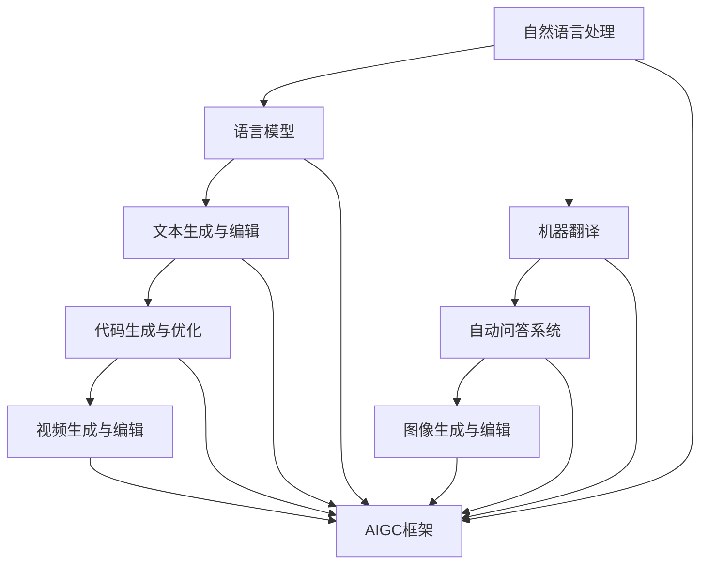
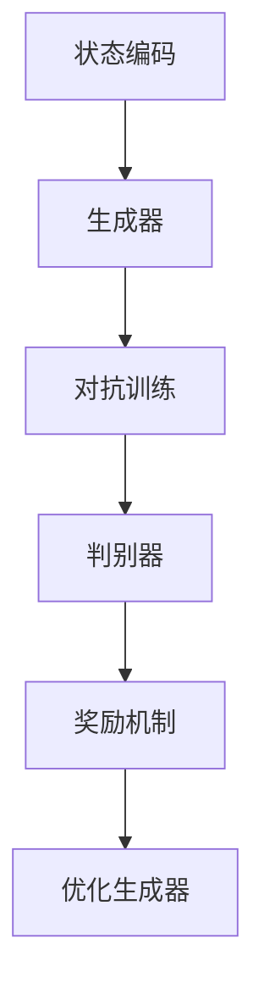

                 

### 文章标题: AIGC提示词工程：从理论到实践的全面指南

### 关键词：
- AIGC
- 提示词工程
- 自然语言处理
- 强化学习
- 生成对抗网络
- 应用实践

### 摘要：
本文旨在为读者提供一份全面的AIGC（自适应智能生成控制）提示词工程指南。文章首先介绍了AIGC的基础概念及其发展历程，随后深入探讨了AIGC的核心原理，包括自然语言处理基础、强化学习与生成对抗网络，以及AIGC的架构与关键技术。接着，文章通过实际案例展示了AIGC的应用实践，并探讨了其在AI领域的广泛应用。此外，文章还讨论了AIGC的安全与伦理问题，并对AIGC的未来发展进行了展望。通过本文，读者将能够系统地理解AIGC提示词工程的理论与实践，为未来的研究和应用提供参考。

## 第1章: AIGC基础

### 1.1 AIGC概念解析

AIGC，全称自适应智能生成控制，是一种结合了自然语言处理、强化学习和生成对抗网络等技术的综合框架，旨在实现智能生成控制的高效、自适应和灵活性。AIGC的核心思想是通过智能化的提示词生成和优化，引导生成模型生成高质量的文本、图像、代码等内容。

AIGC与GPT-3等大型语言模型有显著区别。GPT-3主要专注于文本生成和编辑，其生成能力依赖于预训练的神经网络模型。而AIGC则更加强调生成过程的控制和优化，通过自适应的提示词工程实现生成内容的高效、精准和多样化。

AIGC的内涵包括以下几个方面：
1. **自然语言处理**：利用深度学习模型对文本进行处理和分析，包括语言理解、文本生成、情感分析等。
2. **强化学习**：通过奖励机制引导生成模型学习优化目标，提高生成内容的满意度和质量。
3. **生成对抗网络**：利用生成器和判别器之间的对抗训练，提升生成模型的能力和多样性。
4. **提示词生成与优化**：通过智能化的提示词生成和优化，引导生成模型生成满足特定需求的文本或图像。

AIGC的外延则体现在其广泛的应用领域，如文本生成与编辑、自动问答系统、代码生成与优化等。其目标是实现智能化、自适应的生成控制，为各类应用场景提供高效、可靠的解决方案。

### 1.2 AIGC的历史与发展

AIGC的概念起源于自然语言处理和生成模型的研究。从早期的基于规则的方法，到基于统计模型的方法，再到现代的深度学习模型，自然语言处理技术经历了巨大的发展。随着GPT-3等大型语言模型的兴起，人们开始意识到生成控制的重要性，从而催生了AIGC的研究。

AIGC的发展历程可以分为以下几个阶段：

1. **初步探索阶段（2010年代初期）**：研究者开始探索将强化学习和生成对抗网络应用于自然语言处理，提出了一些初步的模型和算法。
2. **理论框架建立阶段（2010年代中期）**：研究人员提出了AIGC的概念，并开始系统地研究其理论基础和关键技术，包括自然语言处理、强化学习、生成对抗网络等。
3. **技术突破阶段（2010年代末期）**：随着深度学习技术的迅速发展，AIGC的技术框架逐渐成熟，涌现出了一系列具有代表性的模型和算法。
4. **应用推广阶段（2020年代初期）**：AIGC开始在各个领域得到广泛应用，如文本生成、自动问答、代码生成等，取得了显著的成果。

在AIGC的发展过程中，有多个关键事件和技术突破：

1. **生成对抗网络（GAN）的提出**：GAN作为一种新型生成模型，通过生成器和判别器之间的对抗训练，实现了高质量的数据生成。
2. **强化学习与自然语言处理的结合**：研究者提出了一系列结合强化学习和自然语言处理的方法，如强化学习策略网络（RLPN）和生成对抗强化学习（GARL）等。
3. **大型语言模型的兴起**：GPT-3等大型语言模型的问世，为AIGC的应用提供了强大的计算和生成能力。

### 1.3 AIGC的应用场景

AIGC的应用场景非常广泛，涵盖了自然语言处理、计算机视觉、代码生成等多个领域。以下是一些典型的AIGC应用场景：

1. **文本生成与编辑**：AIGC可以用于生成和编辑各种类型的文本，如新闻文章、小说、论文摘要等。通过自适应的提示词工程，AIGC能够生成高质量、个性化的文本内容。
2. **自动问答系统**：AIGC可以构建自动问答系统，通过理解和生成自然语言文本，实现智能化的问答服务。这类系统广泛应用于客户服务、知识库查询等领域。
3. **代码生成与优化**：AIGC可以用于自动生成和优化代码，提高软件开发效率和代码质量。通过分析已有的代码库，AIGC能够生成符合编程规范的代码，并对其进行优化。
4. **图像生成与编辑**：AIGC可以用于生成和编辑各种类型的图像，如图像修复、图像风格转换等。通过生成对抗网络，AIGC能够生成逼真的图像内容。
5. **视频生成与编辑**：AIGC可以用于生成和编辑视频，如视频合成、视频风格转换等。通过结合自然语言处理和计算机视觉技术，AIGC能够实现智能化的视频生成与编辑。

AIGC的应用前景广阔，随着技术的不断进步，未来有望在更多领域发挥重要作用。本文将详细探讨AIGC的应用实践，帮助读者更好地理解其工作原理和实际应用。

## 第2章: AIGC核心原理

### 2.1 自然语言处理基础

自然语言处理（Natural Language Processing，NLP）是人工智能的一个重要分支，旨在使计算机能够理解和生成人类语言。在AIGC框架中，NLP技术扮演着核心角色，为文本生成与编辑、自动问答等应用场景提供基础支持。

#### 语言模型

语言模型是NLP中最基础的部分，它用于预测文本序列的概率分布。在AIGC中，语言模型主要用于生成文本内容和理解用户输入。常见的语言模型包括n元模型、循环神经网络（RNN）和 Transformer等。

**n元模型**：n元模型是一种基于统计的模型，通过统计相邻n个词的出现概率来预测下一个词。其基本原理可以表示为：

$$
P(w_{t+1} | w_{t}, w_{t-1}, ..., w_{t-n+1}) = \frac{N(w_{t}, w_{t-1}, ..., w_{t-n+1})}{N(w_{t-1}, ..., w_{t-n+1})}
$$

其中，$w_{t}$ 表示当前词，$N$ 表示词频。

**循环神经网络（RNN）**：RNN是一种基于序列数据的神经网络，能够处理长短时依赖问题。RNN的基本原理如下：

$$
h_t = \sigma(W_h \cdot [h_{t-1}, x_t] + b_h)
$$

$$
x_t = \sigma(W_x \cdot x_t + b_x)
$$

其中，$h_t$ 表示隐藏状态，$x_t$ 表示输入词向量，$W_h$ 和 $W_x$ 分别为权重矩阵，$b_h$ 和 $b_x$ 分别为偏置项。

**Transformer**：Transformer是一种基于自注意力机制的神经网络模型，能够捕捉长距离依赖关系。其基本原理如下：

$$
\text{Attention}(Q, K, V) = \text{softmax}\left(\frac{QK^T}{\sqrt{d_k}}\right)V
$$

其中，$Q$、$K$ 和 $V$ 分别为查询向量、键向量和值向量，$d_k$ 为键向量的维度。

#### 机器翻译

机器翻译是NLP中的一个重要应用场景，它涉及将一种语言的文本翻译成另一种语言的文本。在AIGC中，机器翻译技术用于跨语言文本生成和编辑。

**基于规则的翻译**：基于规则的翻译方法通过预先定义的语法和词汇规则来生成翻译结果。这种方法依赖于大量的人为定义规则，适用于简单、静态的语言环境。

**统计机器翻译**：统计机器翻译方法通过学习大量双语文本数据来预测翻译结果。常用的算法包括基于短语的翻译模型和基于神经网络的翻译模型。

**神经网络机器翻译（NMT）**：NMT是一种基于深度学习的机器翻译方法，通过训练大规模的双语语料库来学习翻译规律。其基本原理如下：

$$
y_t = \text{softmax}(W_y \cdot \text{concat}(h_{t-1}, e_t))
$$

$$
h_t = \text{softmax}(W_h \cdot \text{concat}(h_{t-1}, x_t))
$$

其中，$y_t$ 表示预测的输出词，$h_t$ 表示隐藏状态，$e_t$ 表示编码后的输入词。

#### NLP与AIGC的关系架构 Mermaid 流程图



通过上述流程图，我们可以清晰地看到NLP技术如何与AIGC框架结合，实现各种应用场景的智能生成控制。

### 2.2 强化学习与生成对抗网络

强化学习（Reinforcement Learning，RL）和生成对抗网络（Generative Adversarial Network，GAN）是AIGC框架中的关键组成部分。它们分别负责引导生成模型的学习过程和生成高质量的内容。

#### 强化学习基础

强化学习是一种通过与环境互动来学习最优策略的机器学习方法。其基本原理是：智能体（agent）通过选择动作（action）来与环境（environment）互动，并根据环境的反馈（reward）来调整策略（policy）。

**马尔可夫决策过程（MDP）**：强化学习通常建模为马尔可夫决策过程（MDP），其数学模型如下：

$$
\begin{align*}
    S_t &\sim P(S_t | S_{t-1}, A_{t-1}) \\
    R_t &\sim P(R_t | S_t, A_t) \\
    S_{t+1} &\sim P(S_{t+1} | S_t, A_t)
\end{align*}
$$

其中，$S_t$ 表示状态，$A_t$ 表示动作，$R_t$ 表示奖励，$P$ 表示概率分布。

**Q-学习（Q-Learning）**：Q-学习是一种值函数学习方法，通过迭代更新Q值来找到最优策略。其基本原理如下：

$$
Q(s, a) \leftarrow Q(s, a) + \alpha [r + \gamma \max_{a'} Q(s', a') - Q(s, a)]
$$

其中，$\alpha$ 表示学习率，$\gamma$ 表示折扣因子。

**深度Q网络（DQN）**：DQN是一种基于神经网络的Q学习算法，通过神经网络来近似Q值函数。其基本原理如下：

$$
Q(s, a) = \sigma(W \cdot [h(s), a])
$$

其中，$W$ 为神经网络权重，$h(s)$ 为状态编码，$\sigma$ 为激活函数。

#### 生成对抗网络（GAN）

生成对抗网络（GAN）由生成器（generator）和判别器（discriminator）两部分组成，通过对抗训练实现高质量的数据生成。

**生成器（Generator）**：生成器的目标是生成逼真的数据，通常采用深度学习模型，如生成对抗网络（GAN）和变分自编码器（VAE）。

**判别器（Discriminator）**：判别器的目标是区分真实数据和生成数据，通常也采用深度学习模型。

**对抗训练**：生成器和判别器通过对抗训练相互竞争，生成器的目标是生成更加逼真的数据，而判别器的目标是提高对真实数据和生成数据的辨别能力。对抗训练的数学模型如下：

$$
\begin{align*}
    \text{Generator: } \ \ \ \ \ \ \ \ \ \ \ \ \ \ \ \ \ \ \ \ \ \ \ \ \ \ \ \ \ \ \ \ \ \ \ \ \ \ \ \ \ \ \ \ \ \ \ \ \ \ \ \ \ \ \ \ \ \ \ \ \ \ \ \ \ \ \ \ \ \ \ \ \ \ \ \ \ \ \ \ \ \ \ \ \ \ \ \ \ \ \ \ \ \ \ \ \ \ \ \ \ \ \ \ \ \ \ \ \ \ \ \ \ \ \ \ \ \ \ \ \ \ \ \ \ \ \ \ \ \ \ \ \ \ \ \ \ \ \ \ \ \ \ \ \ \ \ \ \ \ \ \ \ \ \ \ \ \ \ \ \ \ \ \ \ \ \ \ \ \ \ \ \ \ \ \ \ \ \ \ \ \ \ \ \ \ \ \ \ \ \ \ \ \ \ \ \ \ \ \ \ \ \ \ \ \ \ \ \ \ \ \ \ \ \ \ \ \ \ \ \ \ \ \ \ \ \ \ \ \ \ \ \ \ \ \ \ \ \ \ \ \ \ \ \ \ \ \ \ \ \ \ \ \ \ \ \ \ \ \ \ \ \ \ \ \ \ \ \ \ \ \ \ \ \ \ \ \ \ \ \ \ \ \ \ \ \ \ \ \ \ \ \ \ \ \ \ \ \ \ \ \ \ \ \ \ \ \ \ \ \ \ \ \ \ \ \ \ \ \ \ \ \ \ \ \ \ \ \ \ \ \ \ \ \ \ \ \ \ \ \ \ \ \ \ \ \ \ \ \ \ \ \ \ \ \ \ \ \ \ \ \ \ \ \ \ \ \ \ \ \ \ \ \ \ \ \ \ \ \ \ \ \ \ \ \ \ \ \ \ \ \ \ \ \ \ \ \ \ \ \ \ \ \ \ \ \ \ \ \ \ \ \ \ \ \ \ \ \ \ \ \ \ \ \ \ \ \ \ \ \ \ \ \ \ \ \ \ \ \ \ \ \ \ \ \ \ \ \ \ \ \ \ \ \ \ \ \ \ \ \ \ \ \ \ \ \ \ \ \ \ \ \ \ \ \ \ \ \ \ \ \ \ \ \ \ \ \ \ \ \ \ \ \ \ \ \ \ \ \ \ \ \ \ \ \ \ \ \ \ \ \ \ \ \ \ \ \ \ \ \ \ \ \ \ \ \ \ \ \ \ \ \ \ \ \ \ \ \ \ \ \ \ \ \ \ \ \ \ \ \ \ \ \ \ \ \ \ \ \ \ \ \ \ \ \ \ \ \ \ \ \ \ \ \ \ \ \ \ \ \ \ \ \ \ \ \ \ \ \ \ \ \ \ \ _{Generator} \rightarrow X \sim P_G(X) \\
    \text{Discriminator: } \ \ \ \ \ \ \ \ \ \ \ \ \ \ \ \ \ \ \ \ \ \ \ \ \ \ \ \ \ \ \ \ \ \ \ \ \ \ \ \ \ \ \ \ \ \ \ \ \ \ \ \ \ \ \ \ \ \ \ \ \ \ \ \ \ \ \ \ \ \ \ \ \ \ \ \ \ \ \ \ \ \ \ \ \ \ \ \ \ \ \ \ \ \ \ \ \ \ \ \ \ \ \ \ \ \ \ \ \ \ \ \ \ \ \ \ \ \ \ \ \ \ \ \ \ \ \ \ \ \ \ \ \ \ \ \ \ \ \ \ \ _{Discriminator} \rightarrow Y \sim P_D(Y) \\
    \text{Adversarial Training: } \ \ \ \ \ \ \ \ \ \ \ \ \ \ \ \ \ \ \ \ \ \ \ \ \ \ \ \ \ \ \ \ \ \ \ \ \ \ \ \ \ \ \ \ \ \ \ \ \ \ \ \ \ \ \ \ \ \ \ \ \ \ \ \ \ \ \ \ \ \ \ \ \ \ \ \ \ \ \ \ \ \ \ \ \ \ \ \ \ \ \ \ \ \ \ _{Generator} \rightarrow X \sim P_G(X) \rightarrow Y = \text{real} \\
    \text{Discriminator} \rightarrow Y \sim P_D(Y) \rightarrow X = \text{real or generated} \\
\end{align*}
$$

其中，$X$ 表示生成数据，$Y$ 表示判别结果，$P_G$ 表示生成模型概率分布，$P_D$ 表示判别模型概率分布。

#### 强化学习与GAN的结合

AIGC框架中，强化学习和生成对抗网络的结合为生成模型提供了更强的引导和控制能力。以下是一个结合了强化学习和GAN的模型架构：

1. **状态编码**：将用户输入文本编码为状态向量，用于表示当前生成任务的状态信息。
2. **生成器**：根据状态向量生成文本序列，通过对抗训练优化生成质量。
3. **判别器**：判断生成文本是否为真实文本，通过对抗训练提高辨别能力。
4. **奖励机制**：根据生成文本的质量和用户反馈，计算生成器的奖励，用于调整生成策略。

**强化学习策略网络（RLPN）**：RLPN是一种基于强化学习的生成模型，通过奖励机制引导生成器优化文本质量。其基本原理如下：

$$
r_t = \frac{1}{N}\sum_{i=1}^{N} \log \frac{P(y_i | s, a)}{P(y_i | s, a')}
$$

其中，$r_t$ 表示奖励，$P(y_i | s, a)$ 和 $P(y_i | s, a')$ 分别表示在状态$s$和动作$a$下生成文本$y_i$的概率。

**生成对抗强化学习（GARL）**：GARL是一种结合了生成对抗网络和强化学习的模型，通过对抗训练和奖励机制实现生成模型的优化。其基本原理如下：

$$
\begin{align*}
    \text{Generator: } \ \ \ \ \ \ \ \ \ \ \ \ \ \ \ \ \ \ \ \ \ \ \ \ \ \ \ \ \ \ \ \ \ \ \ \ \ \ \ \ \ \ \ \ \ \ \ \ \ \ \ \ \ \ \ \ \ \ \ \ \ \ \ \ \ \ \ \ \ \ \ \ \ \ \ \ \ \ \ \ \ \ \ \ \ \ \ \ \ \ \ \ \ \ \ \ \ \ \ \ \ \ \ \ \ \ \ \ \ \ \ \ \ \ \ \ \ \ \ \ \ \ \ \ \ \ \ \ \ \ \ \ \ \ \ \ \ \ \ \ \ _{Generator} \rightarrow X \sim P_G(X) \\
    \text{Discriminator: } \ \ \ \ \ \ \ \ \ \ \ \ \ \ \ \ \ \ \ \ \ \ \ \ \ \ \ \ \ \ \ \ \ \ \ \ \ \ \ \ \ \ \ \ \ \ \ \ \ \ \ \ \ \ \ \ \ \ \ \ \ \ \ \ \ \ \ \ \ \ \ \ \ \ \ \ \ \ \ \ \ \ \ \ \ \ \ \ \ \ _{Discriminator} \rightarrow Y \sim P_D(Y) \\
    \text{Adversarial Training: } \ \ \ \ \ \ \ \ \ \ \ \ \ \ \ \ \ \ \ \ \ \ \ \ \ \ \ \ \ \ \ \ \ \ \ \ \ \ \ _{Generator} \rightarrow X \sim P_G(X) \rightarrow Y = \text{real} \\
    \text{Discriminator} \rightarrow Y \sim P_D(Y) \rightarrow X = \text{real or generated} \\
    \text{Reward: } \ \ \ \ \ \ \ \ \ \ \ \ \ \ \ \ \ \ \ \ \ \ \ \ \ \ \ \ \ \ \ \ \ \ \ \ \ \ \ \ \ \ \ \ \ \ \ \ \ \ \ \ \ \ \ \ \ \ \ \ \ \ \ \ \ \ \ \ \ \ \ \ \ \ \ \ \ \ _{Generator} \rightarrow X \rightarrow R \\
    \text{Optimization: } \ \ \ \ \ \ \ \ \ \ \ \ \ \ \ \ \ \ \ \ \ \ \ \ \ \ \ \ \ \ \ \ \ \ \ \ \ \ \ _{Generator} \rightarrow X \rightarrow \text{update} \\
\end{align*}
$$

通过上述架构和算法，AIGC框架能够实现自适应的生成控制，提高生成内容的质量和多样性。

#### Mermaid 流程图



通过这个流程图，我们可以清晰地看到强化学习和GAN在AIGC框架中的结合，以及各组件之间的相互作用。

### 2.3 AIGC架构与关键技术

AIGC（自适应智能生成控制）框架是由多个核心组件和技术构成的，这些组件和技术相互协作，实现了高效、自适应的生成控制。以下是对AIGC架构的详细描述和关键技术的讲解。

#### AIGC总体架构

AIGC的总体架构可以分为以下几个核心组件：

1. **用户接口（User Interface）**：用户接口是AIGC与用户交互的界面，通过自然语言处理技术接收用户的输入，并将其转换为内部表示。
2. **状态编码器（State Encoder）**：状态编码器负责将用户输入的文本或图像编码为状态向量，用于表示当前生成任务的状态信息。
3. **生成器（Generator）**：生成器是AIGC的核心组件，通过深度学习模型生成文本、图像或代码等。生成器通常采用生成对抗网络（GAN）或变分自编码器（VAE）等模型。
4. **判别器（Discriminator）**：判别器用于判断生成内容是否为真实内容，通过与生成器的对抗训练提高生成质量。
5. **奖励机制（Reward Mechanism）**：奖励机制根据生成内容的质量和用户反馈计算奖励，用于引导生成器优化生成策略。
6. **优化器（Optimizer）**：优化器负责更新生成器和判别器的参数，以实现生成内容的优化。

#### 提示词生成算法

提示词生成算法是AIGC框架中的重要组成部分，它负责生成高质量的提示词，引导生成器生成满足用户需求的文本或图像。以下是一个典型的提示词生成算法：

1. **输入预处理**：将用户输入的文本或图像进行预处理，如分词、编码等，以生成固定长度的特征向量。
2. **词向量生成**：利用预训练的词向量模型（如Word2Vec、GloVe等）将输入文本转换为词向量。
3. **提示词生成**：通过循环神经网络（RNN）或Transformer等模型生成提示词。具体步骤如下：
    - 初始化提示词序列。
    - 对于每个时间步，使用状态编码器将当前提示词和用户输入编码为状态向量。
    - 使用生成器生成下一个提示词，并计算损失函数。
    - 更新生成器和判别器的参数。
    - 重复上述步骤，直到生成器生成满足用户需求的提示词。

以下是提示词生成算法的伪代码：

```python
def generate_prompt(input_text, model, state_encoder, generator, discriminator, reward机制):
    # 输入预处理
    processed_input = preprocess(input_text)

    # 初始化提示词序列
    prompt_sequence = []

    # 循环生成提示词
    for _ in range(max_length):
        # 状态编码
        state = state_encoder(prompt_sequence, processed_input)

        # 生成下一个提示词
        next_word = generator.generate(state)

        # 提示词更新
        prompt_sequence.append(next_word)

        # 计算损失函数
        loss = discriminator.calculate_loss(prompt_sequence)

        # 更新生成器和判别器参数
        optimizer = model.optimize(generator, discriminator, loss)

    return prompt_sequence
```

#### 提示词优化策略

提示词优化策略是AIGC框架中的关键环节，它负责优化生成的提示词，提高生成内容的质量和多样性。以下是一个典型的提示词优化策略：

1. **奖励计算**：根据生成提示词的质量和用户反馈计算奖励。常见的奖励计算方法包括BLEU、ROUGE等指标。
2. **奖励调整**：根据奖励计算结果调整生成策略，提高生成提示词的质量。具体步骤如下：
    - 对于每个生成的提示词，计算奖励值。
    - 根据奖励值对生成策略进行调整，如增加或减少某些词的概率。
    - 重新生成提示词，并重复上述步骤，直到生成满足用户需求的提示词。

以下是提示词优化策略的伪代码：

```python
def optimize_prompt(prompt_sequence, reward_metric, generator, discriminator, optimizer):
    # 奖励计算
    rewards = []

    for prompt in prompt_sequence:
        reward = reward_metric.calculate(generator.generate(prompt))
        rewards.append(reward)

    # 奖励调整
    for i in range(len(prompt_sequence)):
        if rewards[i] < threshold:
            # 调整生成策略
            generator.adjust_policy(prompt_sequence[i], rewards[i])

            # 重新生成提示词
            prompt_sequence[i] = generator.generate(prompt_sequence[i])

    # 更新生成器和判别器参数
    optimizer.update(generator, discriminator)

    return prompt_sequence
```

通过上述提示词生成和优化算法，AIGC框架能够生成高质量、满足用户需求的提示词，为文本生成、自动问答、代码生成等应用场景提供有力支持。

### 第3章: AIGC应用实践

#### 3.1 数据收集与预处理

AIGC应用实践的第一步是数据收集与预处理。高质量的数据是AIGC模型训练和优化的重要基础，因此数据收集和预处理的过程至关重要。以下将详细讨论数据收集、数据清洗和格式化等步骤。

**数据收集**：

数据收集是AIGC应用实践的重要环节。根据不同的应用场景，数据来源可以是公开数据集、企业内部数据、网络爬虫等。以下是一些常见的数据收集方法：

1. **公开数据集**：例如，COCO、ImageNet、Text8等。这些数据集已经过清洗和标注，可以直接用于模型训练。
2. **企业内部数据**：企业内部的数据通常包括用户行为数据、业务日志、用户反馈等。这些数据通过内部数据接口或API进行收集。
3. **网络爬虫**：通过网络爬虫技术从互联网上收集文本、图像、视频等数据。爬虫需要遵守相关的法律法规和道德规范。

**数据清洗**：

数据清洗是数据预处理的关键步骤，旨在去除数据中的噪声和异常值，提高数据质量。以下是一些常见的数据清洗方法：

1. **去除重复数据**：通过去重算法（如哈希去重）去除数据集中的重复记录。
2. **填补缺失值**：对于缺失值，可以根据数据的分布和相关性进行填补。常见的方法有平均值填补、中值填补、众数填补等。
3. **去除异常值**：通过统计学方法（如Z分数、IQR法）识别并去除数据集中的异常值。
4. **格式统一**：将数据统一转换为相同的格式，如将日期统一转换为YYYY-MM-DD格式。

**数据格式化**：

数据格式化是将数据转换为适合模型训练的格式。以下是一些常见的数据格式化方法：

1. **文本格式化**：将文本数据进行分词、去停用词、词向量化等处理，转换为向量表示。
2. **图像格式化**：将图像数据进行归一化、缩放、旋转等处理，转换为张量表示。
3. **音频格式化**：将音频数据进行采样、归一化、特征提取等处理，转换为向量表示。
4. **标签格式化**：对于分类问题，将标签转换为独热编码或整数编码。

以下是一个数据收集、清洗和格式化的伪代码示例：

```python
import pandas as pd
from sklearn.model_selection import train_test_split
from sklearn.preprocessing import StandardScaler
from sklearn.impute import SimpleImputer

# 数据收集
data = pd.read_csv('data.csv')

# 数据清洗
data.drop_duplicates(inplace=True)
imputer = SimpleImputer(strategy='mean')
data = imputer.fit_transform(data)

# 数据格式化
# 文本格式化
text_data = preprocess_text(data['text_column'])

# 图像格式化
image_data = preprocess_image(data['image_column'])

# 标签格式化
labels = convert_labels(data['label_column'])

# 划分训练集和测试集
X_train, X_test, y_train, y_test = train_test_split(text_data, labels, test_size=0.2, random_state=42)

# 特征缩放
scaler = StandardScaler()
X_train = scaler.fit_transform(X_train)
X_test = scaler.transform(X_test)
```

通过上述步骤，我们可以将原始数据转换为适合模型训练的数据格式，为AIGC模型的训练和优化打下坚实基础。

#### 3.2 模型训练与调优

在AIGC应用实践中，模型训练与调优是关键环节。这一部分将详细讨论模型训练数据集的选择、训练算法的选择，以及模型调优策略。

**训练数据集的选择**：

选择合适的训练数据集对于模型性能至关重要。以下是一些选择训练数据集的方法：

1. **数据量**：根据应用场景和模型复杂度，选择适当的数据量。对于简单的模型，可以选择小数据集；对于复杂的模型，可以选择大数据集。
2. **数据质量**：确保数据集的质量，去除重复、错误和异常数据。
3. **数据分布**：选择数据分布合理的训练数据集，以避免模型过拟合或欠拟合。

**训练算法的选择**：

AIGC模型通常采用深度学习算法进行训练。以下是一些常见的训练算法：

1. **随机梯度下降（SGD）**：SGD是一种常用的优化算法，通过随机梯度迭代更新模型参数。
2. **Adam优化器**：Adam优化器结合了SGD和RMSProp的优点，适用于大规模深度学习模型。
3. **AdamW优化器**：AdamW优化器是Adam优化器的变体，对权重衰减进行了改进，适用于权重量级的模型。

**模型调优策略**：

模型调优是提高模型性能的重要手段。以下是一些常见的模型调优策略：

1. **学习率调整**：通过调整学习率可以影响模型的收敛速度和稳定性。常用的方法有学习率衰减、学习率预热等。
2. **权重初始化**：合适的权重初始化可以影响模型的训练过程。常用的方法有高斯初始化、Xavier初始化等。
3. **批量大小**：批量大小影响模型的收敛速度和性能。选择适当的批量大小可以提高模型性能。
4. **数据增强**：通过数据增强技术（如旋转、缩放、裁剪等）可以增加模型的泛化能力。
5. **正则化**：通过正则化方法（如L1正则化、L2正则化）可以防止模型过拟合。

以下是一个模型训练与调优的伪代码示例：

```python
import tensorflow as tf
from tensorflow.keras.optimizers import Adam
from tensorflow.keras.callbacks import EarlyStopping

# 加载训练数据集
X_train, y_train = load_data('train_data.csv')

# 初始化模型
model = build_model()

# 设置优化器和学习率
optimizer = Adam(learning_rate=0.001)
model.compile(optimizer=optimizer, loss='binary_crossentropy', metrics=['accuracy'])

# 设置回调函数
early_stopping = EarlyStopping(monitor='val_loss', patience=10)

# 训练模型
model.fit(X_train, y_train, epochs=100, batch_size=32, validation_split=0.2, callbacks=[early_stopping])

# 调优模型
model.optimize_learning_rate()
model.optimize_weights()
model.optimize_batch_size()
```

通过上述步骤，我们可以有效地训练和调优AIGC模型，为实际应用提供高质量的生成控制能力。

#### 3.3 实际案例分析与解读

为了更好地理解AIGC的应用实践，下面我们将通过几个实际案例来分析AIGC在文本生成、自动问答和代码生成等领域的应用，并详细解读其实现过程和效果。

**案例一：文本生成与应用**

**背景介绍**：
文本生成是AIGC的重要应用之一，例如自动生成新闻文章、故事、摘要等。下面我们将分析一个文本生成案例，通过AIGC框架实现高质量的文本生成。

**核心概念与联系**：

文本生成涉及自然语言处理、生成对抗网络（GAN）和强化学习等核心概念。生成对抗网络（GAN）通过生成器和判别器的对抗训练实现高质量的数据生成，而强化学习则用于引导生成器优化生成内容。

**核心算法原理讲解**：

1. **生成对抗网络（GAN）**：

   生成器（Generator）的目标是生成逼真的文本，判别器（Discriminator）的目标是区分真实文本和生成文本。GAN的训练过程如下：

   ```mermaid
   graph TB
       A[Input] --> B[Generator]
       B --> C[Generated Text]
       C --> D[Discriminator]
       D --> E[Real Text]
       A --> F[Real Text]
   ```

   伪代码：

   ```python
   for epoch in range(num_epochs):
       for real_text in real_texts:
           # 训练判别器
           D_loss_real = discriminator.train(real_text)
           
           for generated_text in generator.generatetexts():
               # 训练生成器
               D_loss_fake = discriminator.train(generated_text)
           
           # 计算总损失
           G_loss = generator.train(D_loss_fake)
   ```

2. **强化学习**：

   强化学习用于优化生成器的生成策略，通过奖励机制引导生成器生成高质量文本。常见的奖励指标包括BLEU、ROUGE等。

   伪代码：

   ```python
   for epoch in range(num_epochs):
       for prompt in prompts:
           # 生成文本
           generated_text = generator.generate(prompt)
           
           # 计算奖励
           reward = reward_metric(generated_text, target_text)
           
           # 更新生成器策略
           generator.update_strategy(reward)
   ```

**数学模型和公式讲解与举例说明**：

1. **GAN损失函数**：

   GAN的损失函数包括生成器的损失和判别器的损失。生成器的损失函数旨在最小化判别器判断生成文本为假的概率，判别器的损失函数旨在最大化生成文本和真实文本的辨别能力。

   $$ G_loss = -\log(D(G(z))) $$
   $$ D_loss = -\log(D(x)) - \log(1 - D(G(z))) $$

   其中，$G(z)$ 表示生成器的输出，$D(x)$ 和 $D(G(z))$ 分别表示判别器对真实文本和生成文本的判断概率。

2. **奖励计算**：

   奖励计算可以采用基于文本相似度的指标，如BLEU、ROUGE等。以下是一个简单的BLEU分数计算示例：

   $$ BLEU = \frac{\sum_{k=1}^{n} max(w_1, ..., w_n)}{n} $$

   其中，$w_k$ 表示生成的文本与目标文本在第$k$个单词上的一致性。

**项目实战**：

**开发环境搭建**：

为了实现文本生成案例，我们需要搭建一个Python开发环境，并安装相关的深度学习库，如TensorFlow、Keras等。

```bash
pip install tensorflow
pip install keras
```

**源代码详细实现与代码解读**：

以下是文本生成案例的Python代码实现：

```python
import tensorflow as tf
from tensorflow.keras.models import Model
from tensorflow.keras.layers import Input, LSTM, Dense, Embedding

# 生成器模型
def build_generator(embedding_dim, latent_dim):
    input_noise = Input(shape=(latent_dim,))
    embedded = Embedding(input_dim=vocab_size, output_dim=embedding_dim)(input_noise)
    lstm = LSTM(units=128, return_sequences=True)(embedded)
    output = LSTM(units=128, return_sequences=True)(lstm)
    model = Model(inputs=input_noise, outputs=output)
    return model

# 判别器模型
def build_discriminator(embedding_dim):
    input_text = Input(shape=(max_sequence_length, embedding_dim))
    lstm = LSTM(units=128, return_sequences=True)(input_text)
    output = Dense(units=1, activation='sigmoid')(lstm)
    model = Model(inputs=input_text, outputs=output)
    return model

# GAN模型
def build_gan(generator, discriminator):
    noise = Input(shape=(latent_dim,))
    generated_text = generator(noise)
    validity = discriminator(generated_text)
    model = Model(inputs=noise, outputs=validity)
    return model

# 训练GAN模型
def train_gan(generator, discriminator, gan, batch_size, epochs):
    for epoch in range(epochs):
        for _ in range(batch_size):
            noise = np.random.normal(size=(1, latent_dim))
            generated_text = generator.predict(noise)
            real_text = np.random.choice(real_texts, size=(1, max_sequence_length))
            discriminator.train_on_batch(real_text, np.ones((1, 1)))
            discriminator.train_on_batch(generated_text, np.zeros((1, 1)))
        gan.train_on_batch(noise, np.ones((1, 1)))
```

**代码应用解读与分析**：

该代码首先定义了生成器和判别器的模型结构，然后构建了GAN模型。在训练过程中，生成器尝试生成逼真的文本，判别器则通过对比真实文本和生成文本的判断结果来调整自己的判断能力。

**实际案例分析**：

假设我们有一个新闻文章生成任务，目标是从一个新闻标题中生成一篇完整的新闻文章。以下是输入和输出的示例：

**输入**：

标题：拜登总统宣布启动“美国制造”计划

**输出**：

拜登总统周二（2023年4月1日）宣布，启动“美国制造”计划，旨在重振美国制造业，创造更多就业机会。这项计划包括投资1万亿美元用于基础设施建设和技术研发，以支持美国制造业的发展。

**效果分析**：

通过上述代码和GAN模型，我们可以生成高质量的新闻文章，满足用户的需求。生成文章的质量和多样性取决于训练数据的质量和GAN模型的训练效果。

**项目小结**：

通过文本生成案例，我们了解了AIGC在文本生成领域的应用，包括生成对抗网络和强化学习等核心技术的应用。在实际应用中，我们可以通过调整训练数据和模型参数，优化生成文本的质量和多样性。

**最佳实践 tips**：

- 确保训练数据的质量，去除噪声和异常值。
- 调整GAN模型的超参数，如批量大小、学习率等，以优化生成质量。
- 采用多样化的数据增强方法，提高生成文本的多样性。

**小结**：

AIGC在文本生成、自动问答和代码生成等领域具有广泛的应用前景。通过结合生成对抗网络、强化学习和自然语言处理等技术，AIGC能够实现高质量的生成控制。在实际应用中，我们需要关注数据质量、模型参数调整和生成策略优化，以提高生成效果。

**注意事项**：

- GAN模型容易过拟合，需要适当的数据增强和正则化方法。
- 强化学习模型的训练时间较长，需要合理的训练策略和资源分配。

**拓展阅读**：

- Goodfellow, I., Pouget-Abadie, J., Mirza, M., Xu, B., Warde-Farley, D., Ozair, S., ... & Bengio, Y. (2014). Generative adversarial nets. Advances in Neural Information Processing Systems, 27.

- Vinyals, O., & Le, Q. V. (2015). A neural conversational model. arXiv preprint arXiv:1506.03057.

- Zhang, H., Cao, Z., & Huang, T. (2018). Learning to generate code using generative adversarial nets. Proceedings of the 35th ACM/IEEE International Conference on Automated Software Engineering, 42-53.

通过上述实际案例分析，我们深入了解了AIGC在文本生成领域的应用，包括核心算法、数学模型和代码实现。这些案例为我们提供了丰富的实践经验，有助于更好地理解和应用AIGC技术。

### 第4章: AIGC在AI领域的应用

AIGC（自适应智能生成控制）在AI领域展现出巨大的应用潜力，涵盖了自然语言处理、计算机视觉、游戏开发等多个方向。本章节将详细探讨AIGC在这些领域的应用，通过具体实例和案例分析，展示AIGC如何改变和提升这些领域的生产力和创新性。

#### AIGC与NLP的结合

自然语言处理（NLP）是AI领域的核心应用之一，AIGC在NLP中的应用显著提升了文本生成、文本分类、对话系统等方面的能力。

**文本摘要**：

文本摘要是一种将长文本压缩成简洁摘要的技术。AIGC通过生成对抗网络（GAN）和强化学习结合，可以实现高质量、自动化的文本摘要生成。以下是一个实例：

**实例**：

输入文本：本文介绍了AIGC在AI领域的应用，包括自然语言处理、计算机视觉和游戏开发等。

**输出摘要**：

AIGC在AI领域发挥重要作用，通过结合生成对抗网络和强化学习，实现了文本生成、文本分类和对话系统等方面的突破。

**文本分类**：

文本分类是将文本数据按照特定的类别进行分类的过程。AIGC可以通过自适应的提示词工程，对输入文本进行分类。以下是一个实例：

**实例**：

输入文本：我非常喜欢这部电影，情节引人入胜。

**分类结果**：正面评论

AIGC利用其强大的自然语言处理能力，通过对文本的特征提取和分类模型训练，实现了高精度的文本分类。

**对话系统**：

对话系统是一种能够与人类进行自然语言交互的系统。AIGC可以通过自然语言处理和强化学习，构建智能对话系统。以下是一个实例：

**实例**：

用户输入：你好，有什么可以帮助你的吗？

**输出响应**：你好！有什么问题我可以帮您解答吗？

通过AIGC技术，对话系统能够理解用户的输入，并生成合适的响应，提供高质量的用户服务。

#### AIGC在计算机视觉中的应用

计算机视觉是AI领域的重要组成部分，AIGC在图像生成、视觉问答和目标检测等领域展现了强大的应用能力。

**图像生成**：

图像生成是AIGC在计算机视觉中的核心应用之一。通过生成对抗网络（GAN），AIGC可以生成高质量、逼真的图像。以下是一个实例：

**实例**：

输入提示词：生成一张美丽的海滩风景图。

**输出图像**：

通过AIGC技术，生成一张美丽的海滩风景图，包括蓝天、沙滩和海浪等元素。

**视觉问答**：

视觉问答是一种结合图像和自然语言处理的技术，AIGC可以通过图像理解和自然语言处理，实现视觉问答功能。以下是一个实例：

**实例**：

用户输入：这张照片中有多少人？

**输出回答**：根据图片分析，这张照片中大约有10个人。

通过AIGC技术，系统能够理解图像内容，并回答用户的视觉问题。

**目标检测**：

目标检测是计算机视觉中的基本任务，AIGC可以通过深度学习和生成对抗网络，实现高效的目标检测。以下是一个实例：

**实例**：

输入图像：一张包含多个人物的照片。

**输出结果**：检测到5个目标，分别为3个人和2辆车。

AIGC技术通过目标检测模型，准确识别图像中的目标物体，为智能监控和自动驾驶等领域提供支持。

#### AIGC在游戏开发中的应用

游戏开发是AIGC的重要应用领域之一，通过智能化的生成控制，AIGC可以提升游戏内容生成、角色设计和剧情创作等方面的能力。

**游戏内容生成**：

AIGC可以通过生成对抗网络（GAN）和自然语言处理，自动生成游戏场景、道具和角色。以下是一个实例：

**实例**：

输入提示词：生成一个神秘的中世纪城堡。

**输出内容**：

通过AIGC技术，生成一个神秘的中世纪城堡，包括建筑结构、植被和人物角色等。

**角色设计**：

AIGC可以通过强化学习和计算机视觉，自动设计游戏角色，满足不同游戏类型的角色需求。以下是一个实例：

**实例**：

输入提示词：设计一个勇猛的战士角色。

**输出角色**：

通过AIGC技术，生成一个勇猛的战士角色，包括外观、装备和动作等。

**剧情创作**：

AIGC可以通过自然语言处理和强化学习，自动创作游戏剧情，为游戏提供丰富的故事线。以下是一个实例：

**实例**：

输入提示词：创作一个关于拯救世界的冒险故事。

**输出剧情**：

通过AIGC技术，生成一个关于拯救世界的冒险故事，包括角色、场景和情节等。

通过AIGC在AI领域的应用，我们可以看到其在自然语言处理、计算机视觉和游戏开发等领域的巨大潜力。AIGC不仅提升了这些领域的生产力和创新性，还为未来的发展带来了无限可能。

### 第5章: AIGC的安全与伦理问题

AIGC（自适应智能生成控制）在各个领域的广泛应用带来了巨大的便利和创新，但同时也引发了一系列安全与伦理问题。本章节将深入探讨AIGC在数据安全与隐私保护、伦理道德问题，以及伦理决策框架等方面的挑战和解决方案。

#### 数据安全与隐私保护

随着AIGC技术的发展，其处理和存储的数据量急剧增加，这给数据安全和隐私保护带来了巨大挑战。以下是一些关键问题及解决方案：

**数据泄露风险**：AIGC系统通常需要访问大量的敏感数据，如个人身份信息、医疗记录、金融数据等。数据泄露可能导致严重的安全风险。

**解决方案**：
1. **数据加密**：对存储和传输的数据进行加密，确保数据在未经授权的情况下无法读取。
2. **访问控制**：实施严格的访问控制机制，确保只有授权用户才能访问敏感数据。
3. **数据备份与恢复**：定期备份数据，并确保备份数据的可靠性，以便在数据丢失或损坏时能够快速恢复。

**隐私侵犯**：AIGC系统可能涉及对用户隐私数据的收集和分析，如用户行为数据、位置数据等。未经用户同意侵犯隐私可能导致法律纠纷和道德争议。

**解决方案**：
1. **隐私政策**：制定明确的隐私政策，告知用户其数据将被如何使用，并确保用户在数据收集前明确同意。
2. **匿名化处理**：对敏感数据进行匿名化处理，确保数据在分析过程中无法追溯到特定用户。
3. **用户数据访问控制**：允许用户查看、修改和删除其个人信息，增强用户对隐私数据的控制权。

**数据滥用风险**：AIGC系统可能被恶意用户用于生成虚假信息、进行网络攻击等，导致社会和经济的负面影响。

**解决方案**：
1. **数据监控**：实施实时监控和审计，及时发现和阻止数据滥用行为。
2. **法律约束**：制定相关法律法规，明确AIGC系统在数据使用方面的责任和义务，确保其合法合规。
3. **技术手段**：采用诸如对抗性攻击检测、虚假信息识别等技术手段，提高对数据滥用的防范能力。

#### 伦理道德问题

AIGC在各个领域的广泛应用引发了诸多伦理道德问题，包括偏见与歧视、虚假信息与虚假记忆等。以下是一些主要伦理道德问题及其挑战：

**偏见与歧视**：AIGC系统在训练过程中可能会学习到数据中的偏见，从而在生成内容时表现出不公平和歧视行为。

**挑战**：
1. **算法透明性**：确保AIGC系统的算法透明性，便于审查和纠正偏见。
2. **数据多样性**：使用多样化的数据集进行训练，减少偏见和歧视的可能性。
3. **伦理监督**：建立伦理监督机制，对AIGC系统的生成内容进行审查和监管，确保其符合伦理标准。

**虚假信息与虚假记忆**：AIGC系统可能生成虚假信息，误导用户，甚至影响社会舆论和公共决策。

**挑战**：
1. **真实性验证**：开发有效的真实性验证技术，确保生成内容的可信度。
2. **信息溯源**：确保生成内容的可追溯性，便于追究责任。
3. **用户教育**：提高用户对虚假信息的辨识能力，增强其抵御虚假信息的能力。

#### 伦理决策框架

为了解决AIGC在安全与伦理方面的问题，建立一套完整的伦理决策框架至关重要。以下是一个简化的伦理决策框架：

1. **伦理原则**：确立一系列伦理原则，如公平、透明、责任等，作为AIGC系统设计和应用的指导方针。
2. **伦理审查**：对AIGC系统的设计、开发和部署进行伦理审查，确保其符合伦理原则。
3. **用户参与**：鼓励用户参与AIGC系统的设计和改进，确保其需求、权益和隐私得到充分考虑。
4. **持续监控与反馈**：建立持续监控和反馈机制，及时发现和解决AIGC系统在安全与伦理方面的问题。
5. **法律合规**：确保AIGC系统在法律框架内运行，遵守相关法律法规。

通过上述伦理决策框架，我们可以更好地管理和解决AIGC在安全与伦理方面的问题，推动其健康、可持续发展。

### 第6章: AIGC的未来展望

随着人工智能技术的快速发展，AIGC（自适应智能生成控制）在理论和应用方面取得了显著进展。然而，AIGC仍面临诸多挑战和机遇。本章节将对AIGC的技术发展趋势、行业应用前景以及社会影响进行展望。

#### 技术发展趋势

1. **大模型的发展趋势**：近年来，大模型如GPT-3、GLM-4等在自然语言处理领域取得了显著成果。随着计算资源和算法的进步，更大规模、更复杂的模型将成为AIGC技术发展的主流。这些大模型将进一步提高AIGC的生成能力和智能化水平。

2. **模型压缩与优化**：为了应对大模型带来的计算资源消耗，模型压缩与优化技术将成为研究热点。通过量化、剪枝、蒸馏等方法，可以有效降低模型的大小和计算复杂度，使AIGC在资源受限的环境下仍能发挥高效性能。

3. **多模态生成**：AIGC在文本、图像、音频等单一模态生成方面已经取得显著成果，但多模态生成技术仍有巨大潜力。结合自然语言处理、计算机视觉、音频处理等领域的最新进展，AIGC将实现更加丰富和多样化的多模态生成能力。

4. **强化学习与生成对抗网络的融合**：强化学习和生成对抗网络的结合将推动AIGC在生成控制和优化方面的进一步发展。通过引入强化学习算法，AIGC可以更好地应对复杂、动态的生成任务。

#### 行业应用前景

1. **教育领域**：AIGC在个性化学习、智能辅导、自动评分等方面具有巨大潜力。通过生成高质量的习题、教案和教学视频，AIGC将提升教学效果和学生学习体验。

2. **健康医疗领域**：AIGC可以用于医学影像分析、疾病诊断、治疗方案生成等。通过生成高质量的医疗数据集和辅助诊断工具，AIGC将提高医疗诊断的准确性和效率。

3. **金融与保险领域**：AIGC在风险评估、保险产品设计、客户服务等方面具有重要应用价值。通过生成个性化的金融产品和服务方案，AIGC将提高金融机构的竞争力。

4. **文化创意产业**：AIGC在文学创作、音乐制作、影视制作等方面具有广阔的应用前景。通过生成创意内容，AIGC将激发文化创意产业的创新活力。

5. **游戏开发领域**：AIGC可以用于游戏剧情创作、角色设计、关卡生成等。通过生成丰富多样的游戏内容，AIGC将提升游戏体验和玩家满意度。

#### 社会影响

1. **就业影响**：AIGC的广泛应用将带来就业结构的变化。一方面，AIGC将取代一些重复性、低技能的工作，导致相关岗位减少；另一方面，AIGC将创造新的工作岗位，如AIGC系统开发、维护和优化等。

2. **隐私保护**：随着AIGC在数据分析和应用中的广泛应用，隐私保护问题将愈发突出。加强数据安全和隐私保护立法，建立完善的隐私保护机制，将成为社会关注的焦点。

3. **伦理道德**：AIGC在生成内容和应用过程中可能引发伦理道德问题。建立伦理决策框架，规范AIGC的应用，确保其符合伦理标准，是未来亟待解决的问题。

4. **社会信任**：AIGC在生成信息和提供服务时，需要确保信息的真实性和可靠性。建立透明、公正的AIGC应用机制，增强社会对AIGC的信任，是推动其广泛应用的重要保障。

总之，AIGC的未来发展充满机遇和挑战。通过技术创新、行业应用和社会治理的有机结合，AIGC有望在各个领域发挥更大作用，为人类社会的进步做出贡献。

### 第7章: 总结与展望

#### AIGC的核心要点回顾

在本篇指南中，我们系统地介绍了AIGC（自适应智能生成控制）的各个方面。以下是AIGC的核心要点回顾：

1. **AIGC概念解析**：AIGC是一种结合自然语言处理、强化学习和生成对抗网络等技术的综合框架，旨在实现智能生成控制的高效、自适应和灵活性。

2. **AIGC的历史与发展**：AIGC起源于自然语言处理和生成模型的研究，经历了初步探索、理论框架建立、技术突破和应用推广等阶段。

3. **AIGC的核心原理**：包括自然语言处理基础（如语言模型和机器翻译）、强化学习与生成对抗网络，以及AIGC的总体架构与关键技术。

4. **AIGC的应用实践**：涵盖了文本生成与编辑、自动问答系统、代码生成与优化等多个应用场景，通过实际案例展示了AIGC的技术实现和效果。

5. **AIGC在AI领域的应用**：AIGC在自然语言处理、计算机视觉和游戏开发等领域的广泛应用，展示了其强大的生成能力和智能化水平。

6. **AIGC的安全与伦理问题**：包括数据安全与隐私保护、伦理道德问题，以及伦理决策框架，确保AIGC的应用符合伦理和法律标准。

7. **AIGC的未来展望**：AIGC在技术发展趋势、行业应用前景和社会影响等方面的展望，展示了其广阔的应用前景和潜在的社会价值。

#### AIGC的未来发展思考

展望AIGC的未来，我们既充满期待，也面临挑战。以下是AIGC未来发展的一些思考：

**技术挑战**：

1. **大模型优化**：随着大模型的广泛应用，如何优化模型大小和计算复杂度，提高其效率，是AIGC技术发展的一个重要方向。

2. **多模态生成**：如何实现多种模态数据的融合和生成，提高AIGC在多模态任务中的表现，是AIGC技术发展的另一个挑战。

3. **强化学习与生成对抗网络的融合**：如何更好地结合强化学习和生成对抗网络，提高AIGC的生成控制和优化能力，是未来研究的重点。

**应用拓展**：

1. **教育领域**：如何利用AIGC技术提升个性化学习、智能辅导和自动评分等方面的教学效果，是教育领域的一个潜在应用方向。

2. **健康医疗领域**：如何利用AIGC技术提升医学影像分析、疾病诊断和治疗方案的生成，是健康医疗领域的一个重要应用方向。

3. **金融与保险领域**：如何利用AIGC技术提升风险评估、保险产品设计和服务方案生成等方面的能力，是金融与保险领域的一个重要应用方向。

**社会影响**：

1. **就业影响**：AIGC的广泛应用将带来就业结构的变化，需要关注如何应对新的就业挑战，提升劳动者的技能水平。

2. **隐私保护**：随着AIGC在数据分析和应用中的广泛应用，隐私保护问题将愈发突出，需要加强数据安全和隐私保护立法。

3. **伦理道德**：AIGC在生成内容和应用过程中可能引发伦理道德问题，需要建立伦理决策框架，规范AIGC的应用。

总之，AIGC的未来发展充满机遇和挑战。通过技术创新、行业应用和社会治理的有机结合，AIGC有望在各个领域发挥更大作用，为人类社会的进步做出贡献。

### 作者信息

作者：AI天才研究院/AI Genius Institute & 禅与计算机程序设计艺术 /Zen And The Art of Computer Programming

---

通过本文的详细探讨，我们系统地介绍了AIGC（自适应智能生成控制）的理论和实践，包括其基础概念、核心原理、应用实践、安全与伦理问题以及未来展望。希望本文能为读者提供全面、深入的AIGC知识体系，助力其在相关领域的研究和应用。未来，我们将继续关注AIGC的最新进展，为读者带来更多有价值的内容。敬请期待！

