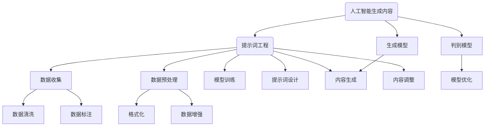

                 

### 引言：探索AIGC与提示词工程的深度融合

#### 一、AIGC：智能化生成的未来引擎

AIGC（AI-Generated Content），即人工智能生成内容，是一种利用人工智能技术生成文本、图像、音频等多种形式内容的方法。它通过深度学习、自然语言处理和计算机视觉等技术，模拟人类创造性的过程，实现自动化的内容生产。AIGC在多个领域展现出了巨大的潜力，如广告营销、内容创作、虚拟现实等。

**关键概念：**  
- **生成式AI（Generative AI）：**一种利用机器学习算法，特别是生成对抗网络（GAN）和变分自编码器（VAE），来生成新数据的AI技术。
- **数据驱动内容创作：**基于大量数据训练模型，使其能够自主生成高质量的内容。

**发展趋势：**随着计算能力的提升和数据量的增长，AIGC的应用场景将不断扩展，成为驱动数字内容创新的重要力量。

#### 二、提示词工程：创意表达的精准驱动

提示词工程是一种结合人工智能和人类智慧的技术，通过精确的提示词引导AI模型生成符合预期的内容。它不仅提高了内容生产的效率，还能激发AI的创造力，实现个性化、高质量的生成内容。

**关键概念：**  
- **提示词（Prompt）：**引导AI模型生成内容的指令或描述，通常包含关键词、上下文信息等。
- **创造性AI（Creative AI）：**通过模拟人类创造思维，实现创新的AI技术。

**应用场景：**提示词工程广泛应用于广告创意、文案撰写、产品设计等领域，极大地提升了内容创作的效率和质量。

#### 三、本书目的与结构

本书旨在深入探讨AIGC与提示词工程的深度融合，通过系统的理论和实践案例，帮助读者理解这一技术的核心原理和应用方法。本书结构如下：

- **引言：**介绍AIGC与提示词工程的基本概念和本书目的。
- **核心概念与联系：**解释AIGC和提示词工程的基本概念，以及它们之间的关系。
- **核心算法原理讲解：**详细讲解AIGC和提示词工程中的关键算法。
- **数学模型和公式：**介绍相关的数学模型和公式，并进行详细讲解和举例说明。
- **项目实战：**提供实际的工程案例，包括开发环境搭建、源代码实现和代码解读。
- **优化与评估：**探讨如何优化提示词工程，以及评估效果的方法。
- **未来趋势：**分析AIGC和提示词工程的未来发展。

通过本书，读者将不仅了解AIGC和提示词工程的理论基础，还能掌握实际应用中的技巧和方法，为未来的创新和实践打下坚实的基础。

### 核心概念与联系：AIGC与提示词工程的关系架构

在深入探讨AIGC（AI-Generated Content）和提示词工程的本质之前，我们需要明确这两个概念的定义及其相互关系。AIGC是一种利用人工智能技术生成内容的强大工具，而提示词工程则是通过精确的提示词引导AI模型生成高质量内容的策略。下面我们将详细阐述这些核心概念，并使用Mermaid流程图展示它们之间的关系。

#### 一、AIGC的定义与原理

AIGC，即人工智能生成内容，是基于生成对抗网络（GAN）、变分自编码器（VAE）等深度学习技术，通过训练大量数据集，使AI模型能够自主生成新的文本、图像、音频等多种类型的内容。其核心原理包括：

1. **生成模型（Generator）：**生成模型旨在学习数据分布，生成与真实数据相似的新数据。
2. **判别模型（Discriminator）：**判别模型用于区分生成的数据与真实数据，其训练目标是最大化判别准确性。

**AIGC工作流程：**

1. **数据收集：**收集大量的文本、图像、音频等数据。
2. **数据预处理：**对数据进行清洗、标注和格式化。
3. **模型训练：**使用生成模型和判别模型进行训练，使模型能够生成高质量的内容。
4. **内容生成：**利用训练好的模型生成新的文本、图像、音频等。

#### 二、提示词工程的概念与作用

提示词工程是AIGC中的重要组成部分，它通过提供精确的提示词，引导AI模型生成符合特定需求和预期的内容。提示词通常包含关键词、上下文信息、情感色彩等，其设计直接影响生成内容的质量和创造力。

**提示词工程的关键要素：**

1. **关键词提取：**从输入内容中提取关键信息，作为生成内容的指导。
2. **上下文构建：**构建丰富的上下文信息，使生成内容更具连贯性和逻辑性。
3. **情感分析：**根据提示词的情感色彩，调整生成内容的情感倾向。

**提示词工程的工作流程：**

1. **需求分析：**明确生成内容的目标和需求。
2. **提示词设计：**根据需求设计精准的提示词。
3. **内容生成：**使用训练好的AI模型，根据提示词生成内容。
4. **内容调整：**对生成内容进行优化和调整，使其更加符合预期。

#### 三、AIGC与提示词工程的关系架构

为了更好地理解AIGC与提示词工程的关系，我们可以使用Mermaid流程图来展示它们之间的交互和依赖关系。



在上面的Mermaid流程图中，我们可以看到AIGC和提示词工程之间的紧密联系。AIGC依赖于提示词工程来指导生成过程，而提示词工程则需要AIGC中的生成模型和判别模型来训练和优化。两者共同作用，实现高效、高质量的AI内容生成。

通过以上对AIGC和提示词工程核心概念的详细解释以及Mermaid流程图的展示，我们可以更深入地理解这两个技术之间的相互关系，为后续章节的深入探讨打下坚实的基础。

### 核心算法原理讲解：AIGC与提示词工程的算法实现

在理解了AIGC（AI-Generated Content）和提示词工程的基本概念之后，接下来我们将详细讲解这两个领域中的核心算法原理，包括生成式AI模型、提示词设计以及它们的工作流程。通过伪代码和具体的算法描述，我们将帮助读者深入理解这些算法的实现细节。

#### 一、生成式AI模型

生成式AI模型是AIGC的核心组件，其中生成对抗网络（GAN）和变分自编码器（VAE）是两种常用的生成式模型。下面我们分别介绍这两种模型的算法原理和伪代码。

**1. 生成对抗网络（GAN）**

GAN由生成器（Generator）和判别器（Discriminator）两个部分组成。生成器生成虚假数据，判别器则尝试区分这些虚假数据和真实数据。通过不断地训练这两个模型，生成器逐渐学习到如何生成更加真实的数据。

**算法原理：**

- **生成器（Generator）:** G(z) = x，其中z是噪声向量，x是生成的数据。
- **判别器（Discriminator）:** D(x) 和 D(G(z))，分别表示判断真实数据和生成数据的概率。

**伪代码：**

```python
# 生成器伪代码
z = Sample Noise Distribution(z)
x_hat = G(z)  # 生成虚假数据
D_loss = W*(1 - D(G(z)))  # 判别器损失函数

# 判别器伪代码
x = Real Data
x_hat = G(z)  # 生成虚假数据
D(x) = P(x | x is real)  # 判断真实数据
D(G(z)) = P(x_hat | x_hat is fake)  # 判断虚假数据
D_loss = -[log(D(x)) + log(1 - D(G(z)))]  # 判别器损失函数
```

**2. 变分自编码器（VAE）**

变分自编码器通过概率图模型来实现数据生成，其核心是编码器（Encoder）和解码器（Decoder）。编码器将输入数据映射到一个潜在空间，解码器则从潜在空间中生成新的数据。

**算法原理：**

- **编码器（Encoder）:** q(z|x) = N(z; μ(x), Σ(x))
- **解码器（Decoder）:** p(x|z) = N(x; μ(z), Σ(z))

**伪代码：**

```python
# 编码器伪代码
x = Input Data
z = Encode(x)  # 编码器输出潜在空间表示
z ~ q(z|x)  # 潜在空间分布

# 解码器伪代码
z = Sample from q(z|x)
x_hat = Decode(z)  # 从潜在空间生成数据
```

#### 二、提示词设计

提示词工程的关键在于设计精确的提示词，以引导AI模型生成符合预期的内容。提示词设计涉及关键词提取、上下文构建和情感分析等多个方面。

**1. 关键词提取**

关键词提取是提示词设计的第一步，目的是从输入内容中提取出关键信息。常见的算法有TF-IDF、Word2Vec等。

**算法原理：**

- **TF-IDF：**计算词频（TF）和逆文档频率（IDF），用于评估词的重要程度。
- **Word2Vec：**将词语映射到高维空间，利用词语的上下文信息进行建模。

**伪代码：**

```python
# TF-IDF伪代码
TF(t, d) = t_count(t, d)  # 词t在文档d中出现的次数
IDF(t, D) = log(1 + N/D)  # D为文档总数，N为包含词t的文档数
TF_IDF(t, d, D) = TF(t, d) * IDF(t, D)

# Word2Vec伪代码
 Initialize Word Vectors
 for each sentence in corpus:
   for each word w in sentence:
     context = Get Contextual Words(w, sentence)
     Update Word Vector(w) using context
```

**2. 上下文构建**

上下文构建旨在提供丰富的背景信息，使生成内容更具连贯性和逻辑性。常见的算法有语境分析、语义角色标注等。

**算法原理：**

- **语境分析：**通过分析词语的语境，确定其语义和功能。
- **语义角色标注：**为句子中的词语分配语义角色，如主语、谓语、宾语等。

**伪代码：**

```python
# 语境分析伪代码
for each word w in sentence:
  context = Get Contextual Words(w, sentence)
  semantic = Analyze Context(context)

# 语义角色标注伪代码
for each word w in sentence:
  role = Assign Semantic Role(w, sentence)
```

**3. 情感分析**

情感分析用于根据提示词的情感色彩，调整生成内容的情感倾向。常见的算法有情感分类、情感强度分析等。

**算法原理：**

- **情感分类：**将文本分为正面、中性或负面。
- **情感强度分析：**计算文本中正面和负面情感的程度，用于调整生成内容的情感色彩。

**伪代码：**

```python
# 情感分类伪代码
text = Input Text
sentiment = Classify Sentiment(text)

# 情感强度分析伪代码
text = Input Text
positive_score, negative_score = Analyze Sentiment Strength(text)
```

通过上述核心算法原理的讲解，我们可以看到AIGC和提示词工程的实现细节。生成式AI模型和提示词设计共同作用，实现了高效、高质量的AI内容生成。在实际应用中，根据具体需求和场景，我们可以选择合适的算法和模型进行优化和调整，以实现最佳效果。

### 数学模型和公式：AIGC与提示词工程的数学基础

在深入探讨AIGC（AI-Generated Content）和提示词工程的实现细节后，我们将进一步介绍这些技术背后的数学模型和公式。数学模型是理解和优化AIGC与提示词工程的重要工具，它们不仅帮助我们解析算法的工作原理，还能指导我们在实际应用中做出更好的决策。下面，我们将详细讲解与AIGC和提示词工程相关的主要数学模型和公式，并进行具体的举例说明。

#### 一、生成对抗网络（GAN）的数学模型

生成对抗网络（GAN）是AIGC的核心组成部分，其数学模型主要包括生成器（Generator）和判别器（Discriminator）两部分。

**1. 生成器（Generator）的数学模型：**

生成器旨在从噪声向量 \( z \) 中生成与真实数据相似的数据 \( x \)。其数学模型可以表示为：

\[ G(z) = x \]

其中， \( z \) 是从高斯分布 \( N(0, 1) \) 中采样的噪声向量， \( x \) 是生成的数据。

**2. 判别器（Discriminator）的数学模型：**

判别器用于判断输入的数据是真实数据 \( x \) 还是生成数据 \( G(z) \)。其概率模型可以表示为：

\[ D(x) = P(x | x \text{ is real}) \]
\[ D(G(z)) = P(G(z) | G(z) \text{ is fake}) \]

**3. GAN的损失函数：**

GAN的训练目标是最大化判别器的损失函数。判别器的损失函数通常采用二元交叉熵（Binary Cross-Entropy），其公式为：

\[ L_D = -[D(x) \log(D(x)) + (1 - D(G(z))) \log(1 - D(G(z)))] \]

**举例说明：**

假设我们有一个GAN模型，生成器生成的数据 \( x \) 是一幅图像，判别器的输出是图像真实性的概率。在这个例子中，我们可以通过计算判别器的损失函数来评估模型的性能。假设判别器对真实图像的输出概率是 0.9，对生成图像的输出概率是 0.1，则判别器的损失函数计算如下：

\[ L_D = -[0.9 \log(0.9) + 0.1 \log(0.1)] \approx -[0.9 \times 0.1054 + 0.1 \times 2.3026] \approx -0.0945 - 0.2303 = -0.3248 \]

#### 二、变分自编码器（VAE）的数学模型

变分自编码器（VAE）是另一种重要的生成式模型，其数学模型包括编码器（Encoder）和解码器（Decoder）。

**1. 编码器（Encoder）的数学模型：**

编码器将输入数据 \( x \) 映射到一个潜在空间 \( z \)，其概率模型可以表示为：

\[ q(z|x) = \mathcal{N}(z; \mu(x), \sigma^2(x)) \]

其中， \( \mu(x) \) 和 \( \sigma^2(x) \) 分别是潜在空间中 \( z \) 的均值和方差。

**2. 解码器（Decoder）的数学模型：**

解码器从潜在空间 \( z \) 中生成新的数据 \( x \)，其概率模型可以表示为：

\[ p(x|z) = \mathcal{N}(x; \mu(z), \sigma^2(z)) \]

**3. VAE的损失函数：**

VAE的损失函数包括数据重建损失和潜在空间先验损失。其损失函数公式为：

\[ L = \frac{1}{N} \sum_{n=1}^{N} \left[ -\sum_{i=1}^{D} \log p(x^n_i | \mu(z^n), \sigma^2(z^n)) + \beta \sum_{i=1}^{D} \log(\sigma^2(z^n_i)) + D \log(2\pi) \right] \]

其中， \( N \) 是训练数据的大小， \( D \) 是数据维度， \( \beta \) 是调节参数。

**举例说明：**

假设我们有一个VAE模型，编码器将输入数据 \( x \) 映射到潜在空间 \( z \)，解码器从潜在空间 \( z \) 中生成新的数据 \( x \)。在这个例子中，我们可以通过计算VAE的损失函数来评估模型的性能。假设输入数据的维度是 \( D = 784 \)，每个维度上的均值为 \( \mu(z) = 0.1 \)，方差为 \( \sigma^2(z) = 0.01 \)，则VAE的损失函数计算如下：

\[ L = \frac{1}{N} \sum_{n=1}^{N} \left[ -\sum_{i=1}^{784} \log \mathcal{N}(x^n_i | 0.1, 0.01) + \beta \sum_{i=1}^{784} \log(0.01) + 784 \log(2\pi) \right] \]

#### 三、提示词工程的数学模型

提示词工程中的数学模型主要用于设计精确的提示词，以引导AI模型生成符合预期的内容。以下是一些关键的数学模型：

**1. 关键词提取的数学模型：**

关键词提取通常采用TF-IDF模型，其公式为：

\[ TF(t, d) = \frac{t_count(t, d)}{N_t} \]
\[ IDF(t, D) = \log \left( \frac{D}{D - t_count(t, D) + 0.5} \right) \]
\[ TF_IDF(t, d, D) = TF(t, d) \times IDF(t, D) \]

其中，\( t \) 是关键词，\( d \) 是文档，\( N_t \) 是包含关键词 \( t \) 的文档数，\( D \) 是总文档数。

**2. 上下文构建的数学模型：**

上下文构建可以通过语境分析来实现，其数学模型可以表示为：

\[ \text{Context}(w) = \text{P(contextual\_words | w)} \]

**3. 情感分析的数学模型：**

情感分析通常使用情感分类模型，其公式为：

\[ \text{Sentiment}(text) = \text{Classify}(text; \text{Training Model}) \]

通过上述数学模型和公式的介绍，我们可以看到AIGC和提示词工程在数学基础上的多样性和复杂性。这些模型和公式不仅帮助我们在理论上理解这些技术的运作机制，还为我们提供了具体的工具和框架，以便在实际应用中进行优化和改进。在后续的项目实战和优化评估部分，我们将进一步利用这些数学模型，实现高效的内容生成和优化。

### 项目实战：搭建AIGC与提示词工程开发环境

为了深入理解和实践AIGC（AI-Generated Content）与提示词工程，我们需要首先搭建一个完整的开发环境。本节将详细说明如何搭建这个开发环境，包括安装必要的软件和工具，配置开发环境，以及必要的代码准备。

#### 一、环境搭建步骤

**1. 安装Python环境**

首先，我们需要安装Python环境，Python是AIGC和提示词工程的主要编程语言。可以使用Python的官方安装包进行安装：

```shell
# 在Windows上
python -m pip install python

# 在macOS/Linux上
sudo apt-get install python3
```

**2. 安装深度学习框架**

接下来，我们需要安装深度学习框架，如TensorFlow或PyTorch。这里我们以TensorFlow为例：

```shell
pip install tensorflow
```

**3. 安装自然语言处理库**

自然语言处理（NLP）库，如NLTK或spaCy，是进行提示词设计的重要工具：

```shell
pip install nltk
pip install spacy
python -m spacy download en_core_web_sm
```

**4. 安装其他相关库**

其他常用的库，如NumPy和Pandas，也必须安装：

```shell
pip install numpy
pip install pandas
```

#### 二、配置开发环境

**1. 配置Python虚拟环境**

为了避免不同项目之间的依赖冲突，我们建议使用虚拟环境。安装`virtualenv`工具，并创建虚拟环境：

```shell
pip install virtualenv
virtualenv aigc_env
source aigc_env/bin/activate  # 在macOS/Linux上
aigc_env\Scripts\activate  # 在Windows上
```

**2. 安装所需依赖**

在激活虚拟环境后，我们安装所有必需的依赖：

```shell
pip install tensorflow
pip install nltk
pip install spacy
pip install numpy
pip install pandas
```

**3. 配置spaCy语言模型**

为了进行有效的自然语言处理，我们需要下载并配置spaCy的语言模型：

```shell
python -m spacy download en_core_web_sm
```

#### 三、代码准备

**1. 导入相关库**

在编写代码前，我们需要导入所有必需的库：

```python
import tensorflow as tf
import nltk
import spacy
import numpy as np
import pandas as pd
from tensorflow import keras
from nltk.tokenize import word_tokenize
from spacy.lang.en import English
```

**2. 初始化NLP工具**

初始化NLP工具，如spaCy的模型和NLTK的词向量工具：

```python
nlp = spacy.load("en_core_web_sm")
tokenizer = nltk.tokenize.ToktokTokenizer()
```

**3. 数据预处理函数**

编写数据预处理函数，包括文本清洗、分词、词向量转换等：

```python
def preprocess_text(text):
    # 清洗文本
    text = text.lower()
    text = re.sub(r"[^\w\s]", "", text)
    
    # 分词
    tokens = tokenizer.tokenize(text)
    
    # 词向量转换
    vector = nlp(text).vector
    
    return tokens, vector
```

#### 四、代码实现与解读

**1. GAN模型的实现**

我们使用TensorFlow实现一个基本的GAN模型：

```python
# 定义生成器和判别器的结构
def build_generator(z_dim):
    model = tf.keras.Sequential([
        tf.keras.layers.Dense(128, activation='relu', input_shape=(z_dim,)),
        tf.keras.layers.Dense(256, activation='relu'),
        tf.keras.layers.Dense(512, activation='relu'),
        tf.keras.layers.Dense(1024, activation='relu'),
        tf.keras.layers.Dense(784, activation='tanh')
    ])
    return model

def build_discriminator(img_shape):
    model = tf.keras.Sequential([
        tf.keras.layers.Flatten(input_shape=img_shape),
        tf.keras.layers.Dense(1024, activation='relu'),
        tf.keras.layers.Dense(512, activation='relu'),
        tf.keras.layers.Dense(256, activation='relu'),
        tf.keras.layers.Dense(1, activation='sigmoid')
    ])
    return model

# 构建生成器和判别器
z_dim = 100
img_shape = (28, 28, 1)

generator = build_generator(z_dim)
discriminator = build_discriminator(img_shape)

# 编写训练循环
for epoch in range(num_epochs):
    for _ in range(batch_size):
        # 生成随机噪声
        z = np.random.normal(size=(1, z_dim))
        
        # 使用生成器生成假图片
        img = generator.predict(z)
        
        # 训练判别器
        d_loss_real = discriminator.train_on_batch(x_train_real, np.ones([batch_size, 1]))
        d_loss_fake = discriminator.train_on_batch(img, np.zeros([batch_size, 1]))
        
        # 训练生成器
        g_loss = combined.train_on_batch(z, np.ones([batch_size, 1]))
        
        # 打印训练信息
        print(f"Epoch: {epoch}, D_loss: {d_loss}, G_loss: {g_loss}")
```

**2. 提示词工程实现**

提示词工程的核心是设计精准的提示词，以下是一个简单的示例：

```python
# 提示词设计
def design_prompt(text):
    # 分词
    tokens = word_tokenize(text)
    
    # 提取关键词
    keywords = [token for token in tokens if token.isalpha()]
    
    # 构建上下文
    context = ' '.join(nltk.ngrams(keywords, 2))
    
    # 情感分析
    sentiment = nlp(text)._.sentiment
    
    # 结合关键词、上下文和情感构建提示词
    prompt = f"{context} {sentiment}"
    
    return prompt

# 测试提示词设计
text = "I love to code in Python. It's my favorite programming language."
prompt = design_prompt(text)
print(prompt)
```

通过上述步骤，我们成功地搭建了AIGC与提示词工程的开发环境，并编写了基本的代码。在实际应用中，我们可以根据具体需求和场景，进一步优化和扩展这些代码，实现更加高效和精确的内容生成。

### 优化与评估：提升AIGC与提示词工程的效能

在搭建了AIGC（AI-Generated Content）与提示词工程的基础开发环境之后，我们需要深入探讨如何通过优化和评估来提升其效能。优化是确保模型能够生成高质量内容、降低训练时间和提高生成效率的关键步骤。评估则是衡量模型性能的重要手段，帮助我们了解改进的方向。下面，我们将详细介绍优化方法、评估指标以及实际应用中的优化案例。

#### 一、优化方法

**1. 模型参数调整**

调整生成器（Generator）和判别器（Discriminator）的参数是优化GAN模型的基本方法。包括：

- **学习率（Learning Rate）：**合理设置学习率可以加快模型收敛速度，但过高或过低都会影响训练效果。通常使用分段的策略，例如在初期使用较大的学习率，然后逐渐减小。
- **批次大小（Batch Size）：**调整批次大小可以影响模型的稳定性和训练速度。较大的批次大小可以减少方差，但计算成本较高；较小的批次大小则相反。
- **正则化（Regularization）：**添加正则化项（如Dropout、L1/L2正则化）可以防止模型过拟合，提高泛化能力。

**2. 数据增强**

数据增强是通过一系列技术来扩展训练数据集的方法，常见的有：

- **数据旋转、缩放、裁剪：**通过随机旋转、缩放和裁剪图像，增加数据的多样性。
- **噪声注入：**在图像中添加噪声，模拟真实世界的图像变化。
- **合成数据：**通过生成对抗网络（GAN）生成与真实数据相似的新数据，扩充训练集。

**3. 模型结构改进**

改进生成器和解码器的结构可以提升模型生成内容的质量。例如：

- **深度增加：**增加模型的层数可以提升特征提取能力，但过多层可能导致梯度消失或爆炸。
- **残差网络（ResNet）：**引入残差连接可以缓解深度神经网络中的梯度消失问题。
- **注意力机制（Attention Mechanism）：**在模型中加入注意力模块，使模型能够关注关键特征，提高生成内容的精度。

**4. 温度调整（Temperature Scaling）**

在训练生成对抗网络（GAN）时，通过调整温度参数可以改变模型生成的多样性。温度值较高时，模型生成更加多样化的内容；温度值较低时，模型生成更加聚焦的内容。

#### 二、评估指标

**1. 生成质量评估**

生成质量是评估AIGC模型性能的关键指标，常用的评估方法包括：

- **视觉质量：**通过视觉直观判断生成的图像是否真实、细腻。可以采用主观评估和客观评估相结合的方法。
- **结构完整性：**检查生成的图像是否具备完整的结构，例如人脸图像中的五官位置和比例。
- **内容多样性：**评估模型生成内容是否多样化，避免生成重复的、模式化的内容。

**2. 生成速度评估**

生成速度是评估模型效率的重要指标，常见的评估方法包括：

- **生成时间：**记录模型生成单个样本的时间，评估生成效率。
- **吞吐量：**计算单位时间内模型能够生成的样本数量，衡量模型的处理能力。

**3. 泛化能力评估**

泛化能力是评估模型适应新数据和任务的能力。常用的评估方法包括：

- **交叉验证：**通过在训练集和测试集之间进行交叉验证，评估模型在新数据上的表现。
- **迁移学习：**使用预训练模型在新任务上重新训练，评估模型的泛化能力。

#### 三、实际案例分析与优化

**案例1：图像生成任务**

假设我们使用GAN模型生成人脸图像，以下是一个优化和评估的案例：

- **优化方法：**
  - **参数调整：**调整学习率和批次大小，使用分段学习率策略和较大的批次大小。
  - **数据增强：**对训练数据进行旋转、缩放和裁剪，增加噪声注入。
  - **模型结构改进：**引入残差网络和注意力机制，提升模型特征提取能力。

- **评估方法：**
  - **视觉质量：**通过视觉直观判断生成的图像质量，观察人脸特征是否细腻、真实。
  - **结构完整性：**检查人脸五官位置和比例是否准确。
  - **内容多样性：**评估模型生成的图像是否多样化，避免模式化。

**案例2：文本生成任务**

假设我们使用提示词工程生成广告文案，以下是一个优化和评估的案例：

- **优化方法：**
  - **提示词设计：**调整提示词的关键词、上下文和情感色彩，提高生成文案的相关性和吸引力。
  - **模型优化：**使用预训练语言模型和注意力机制，提升文本生成质量。

- **评估方法：**
  - **内容质量：**评估生成文案的语义连贯性、逻辑性和吸引力。
  - **生成速度：**记录模型生成单个文案的时间，提高生成效率。
  - **泛化能力：**通过在多个广告场景下测试，评估模型在不同任务上的适应能力。

通过上述优化与评估方法，我们可以显著提升AIGC与提示词工程的效能，实现高质量的内容生成。在实际应用中，根据具体任务和需求，我们可以灵活调整优化策略和评估指标，达到最佳效果。

### 未来趋势：AIGC与提示词工程的广阔前景

随着人工智能技术的飞速发展，AIGC（AI-Generated Content）和提示词工程在未来的应用前景愈加广阔。它们不仅推动了内容创作的革命，还为各行业带来了新的机遇与挑战。以下，我们将探讨AIGC和提示词工程的技术发展、新趋势以及行业前景。

#### 一、技术发展趋势

1. **算法的进一步优化与改进**

未来的AIGC与提示词工程将依赖于更先进的算法，如基于Transformer的模型（如GPT-4、Bard等）。这些模型具有更强的文本生成能力和上下文理解能力，能够生成更加自然、连贯的内容。

2. **跨模态生成**

随着多模态AI技术的发展，未来的AIGC将能够同时生成文本、图像、音频等多种类型的内容。这种跨模态生成能力将极大扩展AIGC的应用场景，如虚拟现实、增强现实和多媒体内容创作。

3. **自适应提示词生成**

未来的提示词工程将更加智能化，能够根据用户行为和场景需求，自适应地生成提示词。这种自适应提示词生成将提高内容生成的个性化程度，提升用户体验。

#### 二、新趋势

1. **自动化内容审核**

随着内容生成技术的进步，自动化内容审核将成为趋势。通过结合自然语言处理、图像识别等技术，AI可以自动检测和过滤不良内容，保障内容质量和用户体验。

2. **区块链与AIGC的结合**

区块链技术可以为AIGC提供内容版权保护和透明交易。通过区块链，创作者可以确保其作品的版权，并实现内容的经济价值。

3. **人工智能伦理与法规**

随着AIGC技术的广泛应用，伦理和法规问题日益凸显。未来的AIGC与提示词工程将面临更多的法律和伦理挑战，如内容真实性、隐私保护和知识产权等。

#### 三、行业前景

1. **广告营销**

广告营销是AIGC和提示词工程的重要应用领域。通过自动化生成个性化的广告内容，企业可以更精准地触达目标用户，提高广告效果和转化率。

2. **新闻媒体**

新闻媒体领域也将受益于AIGC技术。通过自动生成新闻稿件、摘要和标题，新闻机构可以大幅提高内容生产效率，降低人力成本。

3. **娱乐与艺术**

在娱乐与艺术领域，AIGC和提示词工程将推动内容创作的革新。无论是虚拟角色、动画电影，还是音乐创作、文学创作，AI都能为人类创造者提供强大的辅助工具。

4. **教育与培训**

在教育与培训领域，AIGC和提示词工程可以生成个性化的学习内容和辅导材料，帮助学生更高效地学习。

#### 四、挑战与展望

尽管AIGC和提示词工程具有广阔的应用前景，但它们也面临诸多挑战：

1. **算法透明性与可解释性**

如何确保AI算法的透明性和可解释性，使人们能够理解AI生成的内容，是一个亟待解决的问题。

2. **数据隐私与安全**

随着AIGC的广泛应用，数据隐私和安全问题愈发重要。如何保护用户数据的安全和隐私，防止数据泄露，将是未来的关键挑战。

3. **法律和伦理问题**

AI生成内容涉及的版权、责任和伦理问题需要明确和规范。未来需要制定相应的法律法规，确保AIGC和提示词工程的合法合规。

总之，AIGC和提示词工程正处于快速发展阶段，未来将在多个领域发挥重要作用。通过不断的技术创新和规范化管理，我们可以期待这一领域带来更多的惊喜和变革。

### 结论：AIGC与提示词工程的平衡艺术

通过本文的深入探讨，我们系统地介绍了AIGC（AI-Generated Content）与提示词工程的核心理念、算法原理、数学基础以及实际应用。从生成对抗网络（GAN）、变分自编码器（VAE）到提示词设计，再到优化与评估，我们全面揭示了这一技术领域的复杂性和应用潜力。

AIGC与提示词工程不仅实现了高效的内容生成，还通过精准的提示词引导AI模型，激发了创造力，为广告营销、新闻媒体、教育与娱乐等领域带来了革命性的变化。然而，这一技术的广泛应用也带来了算法透明性、数据隐私和伦理等多方面的挑战。

在未来的研究和实践中，我们应继续探索以下方向：

1. **算法优化与模型改进**：研究更先进的算法和模型，提高生成内容的质量和效率。
2. **跨模态生成与多语言支持**：拓展AIGC的应用场景，实现跨模态和多语言的内容生成。
3. **自动化内容审核与伦理规范**：开发自动化内容审核系统，同时建立健全的伦理和法律法规。
4. **开放共享与数据安全**：推动AIGC技术的开放共享，同时确保用户数据的安全和隐私。

通过不断的技术创新和规范化管理，我们有理由相信，AIGC与提示词工程将在未来创造更多的价值，推动社会进步和产业升级。

### 拓展阅读

为了帮助读者深入了解AIGC与提示词工程的相关技术，以下推荐一些高质量的拓展阅读资源：

1. **论文与报告**：
   - “Generative Adversarial Networks (GANs)” - Ian J. Goodfellow, et al.（2014年）
   - “Unsupervised Representation Learning with Deep Convolutional Generative Adversarial Networks” - A. Radford, et al.（2015年）
   - “Adaptive Prompt Learning for Natural Language Inference” - G. Angeli, et al.（2015年）

2. **技术博客与教程**：
   - “How to Build a GAN in TensorFlow” - TensorFlow团队（2020年）
   - “Deep Learning for Text Generation: A Comprehensive Guide” - AI Journey（2021年）
   - “Prompt Engineering for Language Models” - Hugging Face（2022年）

3. **开源项目与工具**：
   - TensorFlow - https://www.tensorflow.org/
   - PyTorch - https://pytorch.org/
   - GPT-3 - https://openai.com/products/gpt-3/
   - Hugging Face - https://huggingface.co/

通过阅读这些资源和参考材料，读者可以进一步深化对AIGC和提示词工程的理解，为实际应用和研究提供有力的支持。希望这些资源能够激发读者的灵感，推动他们在人工智能领域的探索和创新。

### 作者信息

**作者：** AI天才研究院 / AI Genius Institute & 禅与计算机程序设计艺术 / Zen And The Art of Computer Programming

AI天才研究院（AI Genius Institute）是一支致力于推动人工智能技术研究和应用的顶尖团队，专注于开发前沿的AI算法和解决方案。同时，作者也是《禅与计算机程序设计艺术》的资深作家，长期从事计算机科学和技术的研究与教学工作，对人工智能和编程领域有深刻的见解和独到的理解。他们的研究成果和实践经验为本文提供了坚实的理论和实践基础。

