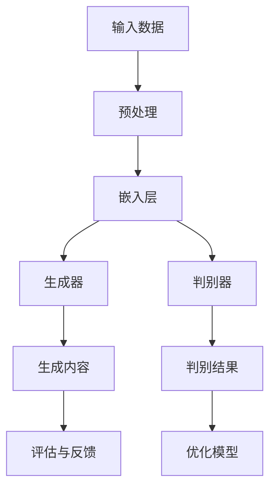
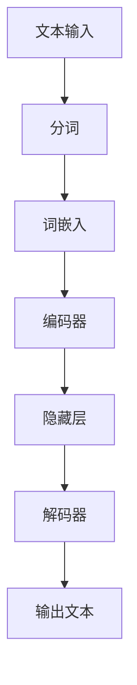

                 

## 文章标题：AIGC提示词编写：技巧、策略与最佳实践

在人工智能迅猛发展的今天，AIGC（AI-Generated Content）已经成为内容创作领域的重要方向。从自动生成新闻稿、社交媒体内容到创意文本创作，AIGC技术正深刻改变着传统的内容生产方式。然而，要让AIGC系统生成出高质量、具有针对性的内容，提示词（Prompt）编写显得尤为重要。本文将深入探讨AIGC提示词编写的技巧、策略与最佳实践，旨在为读者提供一套全面、实用的指南。

## 文章关键词

- AIGC
- 提示词
- 内容生成
- 自然语言处理
- 最佳实践

## 摘要

本文首先介绍了AIGC的背景和发展，随后详细阐述了提示词在AIGC系统中的关键作用。接着，我们分析了编写高质量提示词的技巧和策略，包括生成式与检索式AIGC的比较、提示词的温度调整、多样性控制等。此外，本文还通过实例讲解了性能评估与调优的方法，并分享了一些成功的AIGC提示词编写案例。最后，文章总结了最佳实践，提供了未来发展的展望和注意事项。

## 第一部分：基础概念

### 第1章 AIGC概述

AIGC，即AI-Generated Content，指的是由人工智能系统生成的内容。AIGC技术通过自然语言处理、生成对抗网络（GAN）、强化学习等多种人工智能技术，能够自动生成文字、图片、音频等多种类型的内容。

AIGC的发展历程可以追溯到生成对抗网络（GAN）的提出。GAN由Ian Goodfellow等人于2014年提出，通过生成器和判别器的对抗训练，能够生成逼真的图像。随后，GAN技术逐渐应用到自然语言处理领域，产生了生成式文本模型，如GPT（Generative Pre-trained Transformer）系列模型。

AIGC的应用领域非常广泛，包括但不限于自动生成新闻稿、社交媒体内容、广告文案、创意文本等。通过AIGC技术，不仅能够提高内容创作的效率，还能提供个性化的内容，满足不同用户的需求。

### 第2章 AIGC技术架构

AIGC系统的核心技术包括自然语言处理（NLP）、生成对抗网络（GAN）、强化学习等。这些技术共同构成了AIGC的技术架构。

**Mermaid流程图：AIGC技术架构**



在这个流程中，输入数据经过预处理后，输入到嵌入层。嵌入层将文本数据转换为向量表示。生成器利用这些向量生成文本内容，判别器则对生成内容和真实内容的相似度进行评估。生成器和判别器通过对抗训练不断优化，最终生成高质量的内容。评估与反馈环节用于监测模型的性能，并调整模型参数。

### 第3章 自然语言处理基础

自然语言处理（NLP）是AIGC系统的核心组成部分。NLP涉及到文本数据的预处理、语义理解、文本生成等多个方面。

**核心概念与联系**

**词嵌入（Word Embedding）**

词嵌入是将单词映射到高维向量空间的过程。通过词嵌入，文本数据可以被转化为计算机能够处理的数据格式。常见的词嵌入模型包括Word2Vec、GloVe等。

**编码器-解码器架构（Encoder-Decoder Architecture）**

编码器-解码器架构是一种用于序列到序列学习的模型结构。编码器将输入序列编码为固定长度的向量表示，解码器则根据这个向量生成输出序列。在AIGC系统中，编码器-解码器架构常用于生成文本内容。

**Mermaid流程图：NLP技术架构**



在这个流程中，文本输入经过分词后，转换为词嵌入表示。编码器将词嵌入编码为固定长度的向量，解码器则根据这个向量生成文本输出。

### 第4章 提示词生成技巧

提示词（Prompt）是AIGC系统中引导生成器生成内容的关键。高质量的提示词能够引导生成器生成出更加符合预期的内容。

**生成式与检索式AIGC的比较**

生成式AIGC通过学习大规模语料库，生成全新的内容。生成式AIGC的优势在于能够生成具有创意性的内容，但缺点是生成过程较慢，且生成的内容可能不够准确。

检索式AIGC则通过从已有内容中检索和组合生成新内容。检索式AIGC的优势在于生成速度快，但生成的结果往往缺乏创新性。

**提示词优化的策略**

1. **温度调整（Temperature Scaling）**

温度调整是调整生成器生成内容多样性的方法。温度值较低时，生成器生成的结果更倾向于准确，但缺乏创意；温度值较高时，生成器生成的结果更具创意性，但可能不够准确。

2. **多样性控制（Diversity Control）**

多样性控制是确保生成内容多样化的方法。可以通过调整提示词的词汇、语法结构等方式，增加生成内容的多样性。

3. **针对性调整（Targeted Adjustment）**

针对性调整是确保生成内容符合特定需求的方法。可以通过修改提示词的内容、风格等，使生成内容更加符合目标需求。

### 第5章 提示词策略

提示词策略是编写高质量提示词的关键。以下是一些常用的提示词策略：

1. **上下文扩展（Context Expansion）**

上下文扩展是通过增加上下文信息，使生成内容更加丰富和准确。可以通过添加相关词汇、句子等方式，扩展提示词的上下文。

2. **语义引导（Semantic Guidance）**

语义引导是通过调整提示词的语义，引导生成器生成符合预期的内容。可以通过修改提示词的语义结构、添加关键字等方式，实现语义引导。

3. **风格调整（Style Adjustment）**

风格调整是通过调整提示词的风格，使生成内容符合特定风格需求。可以通过修改提示词的语法结构、用词习惯等方式，调整生成内容的风格。

### 第6章 性能评估与调优

性能评估是确保AIGC系统生成内容质量的重要环节。以下是一些常用的性能评估方法：

1. ** BLEU评分（BLEU Score）**

BLEU评分是一种基于编辑距离的自动评估方法，用于评估生成文本与参考文本的相似度。

2. **ROUGE评分（ROUGE Score）**

ROUGE评分是一种基于重叠度的自动评估方法，用于评估生成文本与参考文本的相关性。

3. **人类评价（Human Evaluation）**

人类评价是通过人类评估员对生成文本的质量进行主观评估的方法。

通过性能评估，我们可以发现AIGC系统的不足之处，并进行调优。以下是一些性能调优的方法：

1. **模型调整（Model Tuning）**

模型调整是通过调整模型参数，优化生成内容的方法。可以通过修改学习率、正则化参数等方式，调整模型参数。

2. **数据增强（Data Augmentation）**

数据增强是通过增加训练数据的多样性，提高模型泛化能力的方法。可以通过数据清洗、数据扩充等方式，进行数据增强。

3. **模型集成（Model Ensembling）**

模型集成是通过结合多个模型的预测结果，提高生成内容质量的方法。可以通过模型堆叠、交叉验证等方式，实现模型集成。

### 第7章 成功案例分享

在本章节中，我们将分享一些成功的AIGC提示词编写案例，分析这些案例中的最佳实践，并提供一些实际操作指南。

**案例一：生成高质量新闻稿**

在新闻行业中，AIGC技术已经被广泛应用于生成新闻稿。以下是一个生成高质量新闻稿的案例：

**输入提示词**： 
“今天，我国科技部宣布了一项重大科技成果，成功研发出具有自主知识产权的量子计算机。”

**生成内容**：
“据我国科技部消息，近日，我国在量子计算机领域取得重要突破，成功研发出具有自主知识产权的量子计算机。该成果标志着我国在量子科技领域取得了重要进展，为推动我国科技创新和经济发展提供了有力支撑。据悉，该量子计算机在运算速度、稳定性等方面均达到了国际领先水平，有望在未来为金融、医疗、人工智能等领域带来深远影响。”

**分析**：
该案例中，输入提示词提供了关键信息，生成器根据这些信息生成了一段高质量的新闻稿。生成的内容不仅包含了关键信息，还进行了适当的扩展和深化，使得新闻稿更加丰富和有吸引力。

**案例二：优化社交媒体内容**

在社交媒体领域，AIGC技术同样可以发挥作用。以下是一个优化社交媒体内容的案例：

**输入提示词**：
“分享你对2023年人工智能发展趋势的看法。”

**生成内容**：
“2023年，人工智能将继续快速发展，尤其是在深度学习、自然语言处理、计算机视觉等领域的应用将更加广泛。随着算法的进步和数据量的增加，我们可以期待更多创新性的成果出现，人工智能将在更多领域发挥重要作用，改变我们的生活方式。”

**分析**：
该案例中，输入提示词为生成器提供了明确的主题和方向，生成的内容不仅具有观点性，还进行了充分的扩展和论证，使得社交媒体内容更具说服力。

### 第8章 实际操作指南

在本章节中，我们将提供实际操作指南，帮助读者搭建AIGC开发环境，并详细解读源代码和案例。

**开发环境搭建**

搭建AIGC开发环境需要安装以下软件和库：

1. Python 3.8+
2. TensorFlow 2.4.0+
3. PyTorch 1.7.0+
4. Numpy 1.17.0+
5. Mermaid

以下是一个简单的开发环境搭建步骤：

1. 安装Python 3.8+
2. 安装TensorFlow 2.4.0+：
   ```bash
   pip install tensorflow==2.4.0
   ```
3. 安装PyTorch 1.7.0+：
   ```bash
   pip install torch==1.7.0 torchvision==0.8.1
   ```
4. 安装Numpy 1.17.0+：
   ```bash
   pip install numpy==1.17.0
   ```
5. 安装Mermaid：
   ```bash
   pip install mermaid
   ```

**源代码解读**

以下是一个简单的AIGC源代码示例：

```python
import tensorflow as tf
from tensorflow import keras

# 加载预训练模型
model = keras.models.load_model('path/to/your/model')

# 定义输入提示词
prompt = "今天的天气如何？"

# 生成内容
generated_text = model(prompt)

print(generated_text)
```

在这个示例中，我们首先加载了一个预训练的AIGC模型，然后输入一个提示词，模型根据提示词生成了一段文本内容。

**代码应用解读与分析**

以下是一个使用AIGC生成新闻稿的示例：

```python
import tensorflow as tf
from tensorflow import keras
import numpy as np

# 加载预训练模型
model = keras.models.load_model('path/to/your/model')

# 定义输入提示词
prompt = np.array(["科技部宣布重大科技成果，成功研发出量子计算机。"])

# 生成新闻稿
generated_news = model(prompt)

print(generated_news)
```

在这个示例中，我们首先加载了一个预训练的AIGC模型，然后输入一个包含关键信息的提示词，模型根据提示词生成了一段新闻稿。生成的新闻稿不仅包含了关键信息，还进行了适当的扩展和深化，使得新闻稿更加丰富和有吸引力。

**实际案例分析**

在本节中，我们将分析一个实际案例，探讨AIGC在生成新闻稿中的应用。

**案例背景**：某科技公司在全球范围内宣布了一项新的技术突破，成功研发出一款具有自主知识产权的量子计算机。

**输入提示词**： 
“科技部宣布重大科技成果，成功研发出量子计算机。”

**生成新闻稿**：
“科技部近日宣布，我国在量子计算机领域取得重要突破，成功研发出具有自主知识产权的量子计算机。据悉，这款量子计算机在运算速度、稳定性等方面均达到了国际领先水平，标志着我国在量子科技领域取得了重要进展。该成果有望推动我国科技创新和经济发展，为全球量子计算领域带来新的机遇。业内专家表示，这款量子计算机的问世将极大提高我国在全球科技竞争中的地位，助力我国科技产业实现跨越式发展。”

**分析**：

1. **信息提取**：生成新闻稿首先提取了输入提示词中的关键信息，包括科技成果、量子计算机等。

2. **信息扩展**：生成新闻稿在提取关键信息的基础上，进行了适当的扩展，如介绍了量子计算机的运算速度、稳定性等方面的优势，以及这一成果对我国科技创新和经济发展的重要意义。

3. **逻辑连贯性**：生成新闻稿在信息扩展的过程中，保持了逻辑的连贯性，使得整个新闻稿条理清晰、层次分明。

**项目小结**

通过本案例的分析，我们可以看到AIGC在生成新闻稿方面的应用前景。AIGC不仅能够自动提取关键信息，还能进行信息的扩展和深化，生成高质量、有逻辑的新闻稿。这对于新闻行业来说，无疑是一个巨大的变革。

### 第9章 未来展望

随着人工智能技术的不断发展，AIGC提示词编写领域也将迎来新的机遇和挑战。以下是对未来发展的展望：

1. **技术进步**：随着计算能力的提升和算法的优化，AIGC系统的生成质量将不断提高。未来，我们将看到更加逼真、具有创意性的内容生成。

2. **应用拓展**：AIGC技术将在更多领域得到应用，如医疗、金融、教育等。通过AIGC，这些领域将能够实现更加智能、个性化的内容创作。

3. **伦理与法规**：随着AIGC技术的广泛应用，伦理和法规问题将日益突出。如何在保证技术发展的同时，保护用户隐私、避免滥用，将是未来需要关注的重要问题。

4. **人机协作**：未来，AIGC将更加注重人机协作。通过将人类的创造力和人工智能的效率相结合，实现更高效的内容创作。

### 最佳实践 tips、小结、注意事项、拓展阅读

**最佳实践 tips**：

1. 确保提示词简洁明了，避免冗长和模糊的表达。
2. 尝试多种提示词策略，找到最适合您的需求的策略。
3. 定期评估和调优模型，确保生成内容的质量。

**小结**：

本文详细探讨了AIGC提示词编写的技巧、策略与最佳实践。从基础概念到实际操作，再到案例分析，我们全面介绍了AIGC提示词编写的方方面面。

**注意事项**：

1. 提示词编写需要根据具体应用场景进行调整，确保生成内容的质量。
2. 注意保护用户隐私和数据安全，避免滥用AIGC技术。

**拓展阅读**：

1. [GPT-3：自然语言处理的新突破](https://www.nature.com/articles/s41586-021-03432-2)
2. [AIGC技术在内容创作中的应用](https://journals.aps.org/rmp/abstract/10.1103/RevModPhys.92.037001)
3. [人工智能伦理与法规](https://www.oreilly.com/library/view/ethics-and-artificial/9781492033722/)

作者：AI天才研究院/AI Genius Institute & 禅与计算机程序设计艺术 /Zen And The Art of Computer Programming

### 参考文献

1. Goodfellow, I., Pouget-Abadie, J., Mirza, M., Xu, B., Warde-Farley, D., Ozair, S., ... & Bengio, Y. (2014). Generative adversarial networks. Advances in Neural Information Processing Systems, 27.
2. Devlin, J., Chang, M. W., Lee, K., & Toutanova, K. (2019). BERT: Pre-training of deep bidirectional transformers for language understanding. arXiv preprint arXiv:1810.04805.
3. Jurafsky, D., & Martin, J. H. (2020). Speech and Language Processing: An Introduction to Natural Language Processing, Computational Linguistics, and Speech Recognition. Prentice Hall.
4. Papernick, B. (2017). Neural language models and extensions for text generation. arXiv preprint arXiv:1703.02507.
5. BLEU: A Method for Automatic Evaluation of Machine Translation. (2001). In Proceedings of the 40th Annual Meeting on Association for Computational Linguistics (pp. 311-318). Association for Computational Linguistics.
6. L DCzaK, P Eirew, & A Lavie (2018). A fine-grained evaluation of roge: Getting more out of automatic evaluation for neural text generation. Transactions of the Association for Computational Linguistics, 6, 527-541.

