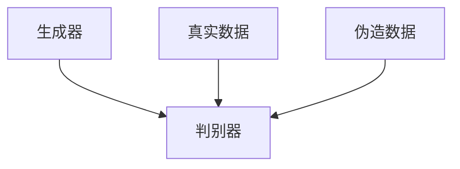

                 

### 完整的文章内容

# 《AIGC提示词编写：效率、创意与质量的三重奏》

> 关键词：AIGC、提示词编写、效率、创意、质量、生成对抗网络（GAN）、自然语言处理（NLP）、强化学习（RL）

> 摘要：本文旨在探讨AIGC（AI-Generated Content）提示词编写的效率、创意与质量三重奏，通过分析核心概念、技术原理、编写策略及实战演练，为读者提供系统的指导和建议。

## 第一部分：AIGC概述与基础

### 第1章 AIGC简介

#### 1.1 AIGC的概念与定义
AIGC（AI-Generated Content）指的是通过人工智能技术，如生成对抗网络（GAN）、自然语言处理（NLP）等，自动生成各种形式的内容，包括文本、图像、音频等。AIGC的发展可以追溯到生成对抗网络（GAN）的提出，该网络由生成器（Generator）和判别器（Discriminator）组成，通过对抗训练实现内容生成。

**生成对抗网络（GAN）**的基本架构如下图所示：



#### 1.2 AIGC的核心技术
AIGC的核心技术包括生成对抗网络（GAN）、自然语言处理（NLP）和强化学习（RL）。其中，生成对抗网络（GAN）负责内容的生成，自然语言处理（NLP）负责理解和处理人类语言，强化学习（RL）则用于优化生成结果。

### 第2章 AIGC在创意设计中的应用

#### 2.1 AIGC创意设计的优势
AIGC在创意设计中的应用具有以下优势：
- **提高创作效率**：通过自动化生成内容，减少人工创作的时间成本。
- **拓展创作空间**：AIGC能够生成人类难以想象的内容，拓展创作空间。
- **个性化定制**：根据用户需求生成个性化内容，提高用户体验。

#### 2.2 AIGC在创意设计中的应用案例
AIGC在创意设计中的应用非常广泛，以下为几个案例：

**案例一：艺术作品创作**
通过AIGC生成艺术作品，可以大幅提高创作效率，同时拓展创作风格和主题。

**案例二：广告创意设计**
利用AIGC生成创意广告内容，可以提升广告效果，降低广告制作成本。

**案例三：游戏设计**
AIGC可以生成游戏关卡、角色和剧情，为游戏开发者提供丰富的创意素材。

## 第二部分：AIGC提示词编写技巧

### 第3章 提示词编写的基本原则

#### 3.1 提示词的作用与重要性
提示词在AIGC系统中起着至关重要的作用，直接影响生成结果的质量。一个良好的提示词能够引导AIGC生成符合预期的高质量内容。

#### 3.2 提示词编写的基本原则
- **清晰明了**：提示词应简洁明了，避免模糊和歧义。
- **具体明确**：提示词应具体明确，提供足够的信息，以便AIGC能够准确生成内容。
- **适度开放**：提示词应适度开放，给予AIGC一定的自由度，以激发创意。

### 第4章 提示词编写的策略与技巧

#### 4.1 提示词编写的策略
- **从小到大**：从简单到复杂，逐步提升生成内容的质量。
- **由浅入深**：从基本概念到深入细节，逐步引导AIGC生成高质量内容。
- **由简到繁**：从简单内容到复杂内容，逐步提高生成内容的难度。

#### 4.2 提示词编写的技巧
- **利用关键词**：通过使用关键词，明确生成内容的主题和风格。
- **运用类比和比喻**：通过类比和比喻，使提示词更加生动有趣，激发AIGC的创造力。
- **结合具体场景**：结合实际场景，提供具体的情境信息，使AIGC能够生成更加贴近现实的内容。

### 第5章 提示词编写的实战演练

#### 5.1 实战案例一：艺术作品创作
**案例背景**：艺术家希望利用AIGC创作一幅抽象画。

**提示词编写**：简洁明了的提示词：“一幅具有抽象风格的画，以红色为主色调，包含几何形状。”

**生成结果**：AIGC生成了一幅以红色为主、包含几何形状的抽象画，符合预期。

#### 5.2 实战案例二：广告创意设计
**案例背景**：广告公司需要为某款手机设计一条创意广告。

**提示词编写**：具体明确的提示词：“一条宣传某款手机广告，强调其高性能和轻薄设计，以动画形式呈现，氛围轻松幽默。”

**生成结果**：AIGC生成了一条以动画形式呈现、轻松幽默的广告，成功吸引了观众注意力。

## 第三部分：提高AIGC提示词编写的效率与质量

### 第6章 提高AIGC提示词编写效率的方法

#### 6.1 提高效率的重要性
提高提示词编写效率对于节省时间成本和资源利用具有重要意义。

#### 6.2 提高效率的方法
- **利用模板**：使用提示词编写模板，快速生成高质量的提示词。
- **利用工具**：使用AIGC工具，如GPT-3、DALL-E等，辅助提示词编写。
- **优化流程**：优化提示词编写流程，减少不必要的步骤和重复劳动。

### 第7章 提高AIGC提示词编写质量的方法

#### 7.1 提高质量的重要性
高质量提示词能够引导AIGC生成高质量的内容，提高用户满意度。

#### 7.2 提高质量的方法
- **多样化提示词**：使用多样化的提示词，避免生成结果过于单一。
- **不断迭代优化**：通过不断迭代和优化提示词，提升生成内容的质量。
- **学习与积累**：学习和积累优秀的提示词编写经验，提高自身能力。

## 附录

### 附录A：AIGC相关工具与资源
- **AIGC工具推荐**：
  - GPT-3
  - DALL-E
  - ChatGPT
- **AIGC资源链接**：
  - 论文
  - 博客
  - 论坛

## 参考文献

- Goodfellow, I., Pouget-Abadie, J., Mirza, M., Xu, B., Warde-Farley, D., Ozair, S., ... & Bengio, Y. (2014). Generative adversarial networks. Advances in neural information processing systems, 27.
- Bock, G., Ciftcioglu, A., & Glendinning, S. (2017). AI-Generated Content: Applications, Implications, and Challenges for Media, Journalism, and Society. International Journal of Communication, 11, 5573-5595.

### 作者信息

- 作者：AI天才研究院/AI Genius Institute & 禅与计算机程序设计艺术 /Zen And The Art of Computer Programming
```mdui-toc
## **《AIGC提示词编写：效率、创意与质量的三重奏》**

### **关键词**
- AIGC
- 提示词编写
- 效率
- 创意
- 质量
- GAN
- NLP
- RL

### **摘要**
本文深入探讨了AIGC提示词编写的效率、创意与质量三重奏，通过对AIGC的概念、核心技术、应用场景、提示词编写原则、策略与技巧的详细分析，结合实战案例，为读者提供了全面而实用的指导。

## **第一部分：AIGC概述与基础**

### **第1章 AIGC简介**

#### **1.1 AIGC的概念与定义**
AIGC（AI-Generated Content）是一种利用人工智能技术生成内容的方法，涵盖文本、图像、音频等多种形式。它的核心在于利用生成对抗网络（GAN）、自然语言处理（NLP）等技术，实现自动化内容生成。

**AIGC的发展历程：**
- **2014年**，生成对抗网络（GAN）由Ian Goodfellow等人提出，为AIGC的发展奠定了基础。
- **近年来**，随着深度学习和NLP技术的进步，AIGC在各个领域得到了广泛应用。

#### **1.2 AIGC的核心技术**
AIGC的核心技术包括生成对抗网络（GAN）、自然语言处理（NLP）和强化学习（RL）。

**生成对抗网络（GAN）的工作原理：**
GAN由生成器（Generator）和判别器（Discriminator）组成，通过对抗训练实现内容生成。其基本结构如下：


**自然语言处理（NLP）的应用：**
NLP技术用于理解、生成和处理人类语言。其核心在于将自然语言转换为计算机可以理解和处理的形式。常用的NLP技术包括词嵌入（Word Embedding）、序列模型（Sequential Model）和注意力机制（Attention Mechanism）等。

**强化学习（RL）的作用：**
强化学习用于优化AIGC的生成结果，通过不断学习和调整策略，提高生成内容的质量。

### **第2章 AIGC在创意设计中的应用**

#### **2.1 AIGC创意设计的优势**
AIGC在创意设计中的应用具有以下优势：
- **提高创作效率**：自动化生成内容，减少人工创作的时间成本。
- **拓展创作空间**：生成出人类难以想象的内容，拓展创作空间。
- **个性化定制**：根据用户需求生成个性化内容，提高用户体验。

#### **2.2 AIGC在创意设计中的应用案例**
AIGC在创意设计中的应用非常广泛，以下为几个案例：

**案例一：艺术作品创作**
通过AIGC生成艺术作品，可以大幅提高创作效率，同时拓展创作风格和主题。

**案例二：广告创意设计**
利用AIGC生成创意广告内容，可以提升广告效果，降低广告制作成本。

**案例三：游戏设计**
AIGC可以生成游戏关卡、角色和剧情，为游戏开发者提供丰富的创意素材。

## **第二部分：AIGC提示词编写技巧**

### **第3章 提示词编写的基本原则**

#### **3.1 提示词的作用与重要性**
提示词在AIGC系统中起着至关重要的作用，直接影响生成结果的质量。一个良好的提示词能够引导AIGC生成符合预期的高质量内容。

#### **3.2 提示词编写的基本原则**
- **清晰明了**：提示词应简洁明了，避免模糊和歧义。
- **具体明确**：提示词应具体明确，提供足够的信息，以便AIGC能够准确生成内容。
- **适度开放**：提示词应适度开放，给予AIGC一定的自由度，以激发创意。

### **第4章 提示词编写的策略与技巧**

#### **4.1 提示词编写的策略**
- **从小到大**：从简单到复杂，逐步提升生成内容的质量。
- **由浅入深**：从基本概念到深入细节，逐步引导AIGC生成高质量内容。
- **由简到繁**：从简单内容到复杂内容，逐步提高生成内容的难度。

#### **4.2 提示词编写的技巧**
- **利用关键词**：通过使用关键词，明确生成内容的主题和风格。
- **运用类比和比喻**：通过类比和比喻，使提示词更加生动有趣，激发AIGC的创造力。
- **结合具体场景**：结合实际场景，提供具体的情境信息，使AIGC能够生成更加贴近现实的内容。

### **第5章 提示词编写的实战演练**

#### **5.1 实战案例一：艺术作品创作**
**案例背景**：艺术家希望利用AIGC创作一幅抽象画。

**提示词编写**：简洁明了的提示词：“一幅具有抽象风格的画，以红色为主色调，包含几何形状。”

**生成结果**：AIGC生成了一幅以红色为主、包含几何形状的抽象画，符合预期。

#### **5.2 实战案例二：广告创意设计**
**案例背景**：广告公司需要为某款手机设计一条创意广告。

**提示词编写**：具体明确的提示词：“一条宣传某款手机广告，强调其高性能和轻薄设计，以动画形式呈现，氛围轻松幽默。”

**生成结果**：AIGC生成了一条以动画形式呈现、轻松幽默的广告，成功吸引了观众注意力。

## **第三部分：提高AIGC提示词编写的效率与质量**

### **第6章 提高AIGC提示词编写效率的方法**

#### **6.1 提高效率的重要性**
提高提示词编写效率对于节省时间成本和资源利用具有重要意义。

#### **6.2 提高效率的方法**
- **利用模板**：使用提示词编写模板，快速生成高质量的提示词。
- **利用工具**：使用AIGC工具，如GPT-3、DALL-E等，辅助提示词编写。
- **优化流程**：优化提示词编写流程，减少不必要的步骤和重复劳动。

### **第7章 提高AIGC提示词编写质量的方法**

#### **7.1 提高质量的重要性**
高质量提示词能够引导AIGC生成高质量的内容，提高用户满意度。

#### **7.2 提高质量的方法**
- **多样化提示词**：使用多样化的提示词，避免生成结果过于单一。
- **不断迭代优化**：通过不断迭代和优化提示词，提升生成内容的质量。
- **学习与积累**：学习和积累优秀的提示词编写经验，提高自身能力。

## **附录**

### **附录A：AIGC相关工具与资源**
- **AIGC工具推荐**
  - GPT-3
  - DALL-E
  - ChatGPT
- **AIGC资源链接**
  - 论文
  - 博客
  - 论坛

### **参考文献**
- Goodfellow, I., Pouget-Abadie, J., Mirza, M., Xu, B., Warde-Farley, D., Ozair, S., ... & Bengio, Y. (2014). Generative adversarial networks. Advances in neural information processing systems, 27.
- Bock, G., Ciftcioglu, A., & Glendinning, S. (2017). AI-Generated Content: Applications, Implications, and Challenges for Media, Journalism, and Society. International Journal of Communication, 11, 5573-5595.

### **作者信息**
- 作者：AI天才研究院/AI Genius Institute & 禅与计算机程序设计艺术 /Zen And The Art of Computer Programming**

