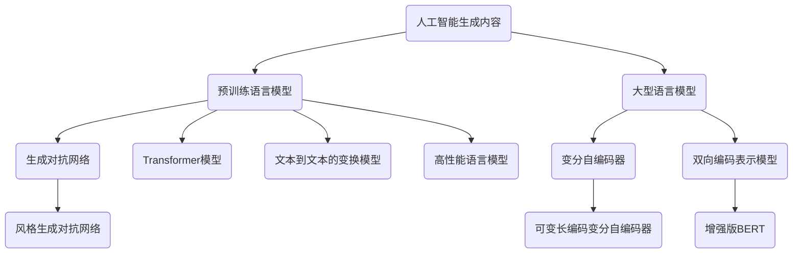
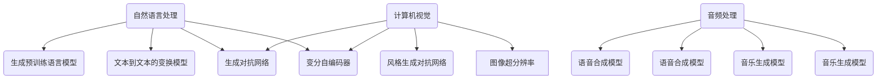

                 

### 引言

#### AIGC的概念与发展历程

**AIGC（AI-Generated Content）**，即人工智能生成内容，是一种利用人工智能技术自动生成文本、图像、音频等多种形式内容的方法。AIGC技术不仅能够提高内容生成的效率，还可以激发创意，使得内容更加丰富多样。AIGC的概念起源于自然语言处理（NLP）、计算机视觉（CV）和音频处理等领域，随着深度学习技术的快速发展，AIGC在近年得到了广泛关注和深入研究。

AIGC的发展历程可以分为三个阶段：

1. **早期探索阶段**：在此阶段，研究人员主要关注如何利用简单的机器学习算法生成内容。例如，使用循环神经网络（RNN）和卷积神经网络（CNN）生成文本和图像。

2. **快速发展阶段**：随着深度学习技术的突破，特别是生成对抗网络（GAN）和变分自编码器（VAE）的出现，AIGC技术取得了显著进展。这一阶段的代表性成果包括生成文本的Transformer模型（如GPT系列）和生成图像的StyleGAN系列模型。

3. **应用拓展阶段**：当前，AIGC技术已经在多个领域得到应用，如艺术创作、内容生成、教育和娱乐等。随着技术的不断进步，AIGC的应用范围将进一步扩大。

#### AIGC与GPT、LLM的关系

**GPT（Generative Pre-trained Transformer）** 和 **LLM（Large Language Model）** 是AIGC技术中的重要组成部分。GPT是基于Transformer模型的预训练语言模型，通过在大量文本数据上进行预训练，可以生成高质量的文本。而LLM则是在GPT的基础上，进一步扩展和优化的语言模型，具有更强的语言理解和生成能力。

AIGC与GPT、LLM的关系如下：

- **AIGC是基于GPT和LLM的进一步发展**。AIGC技术利用GPT和LLM的生成能力，通过设计特定的提示词和模型架构，实现自动生成文本、图像、音频等多种形式的内容。

- **GPT和LLM是AIGC技术的核心组件**。AIGC技术的实现依赖于GPT和LLM的高效生成能力，而GPT和LLM的发展也推动了AIGC技术的不断进步。

总的来说，AIGC技术是人工智能生成内容的一个综合性概念，它涵盖了从GPT和LLM到实际应用的全过程。通过深入研究AIGC技术，我们可以更好地理解和利用人工智能的生成能力，为各个领域带来更多的创新和变革。

#### AIGC与GPT、LLM的关系Mermaid流程图



#### AIGC的技术原理

AIGC（AI-Generated Content）的技术原理主要涉及自然语言处理（NLP）、计算机视觉（CV）和音频处理等领域。下面将分别介绍这些技术原理，以及它们在AIGC中的应用。

##### 自然语言处理（NLP）

自然语言处理是AIGC技术的基础，主要研究如何使计算机理解和生成人类语言。在AIGC中，自然语言处理技术主要用于生成文本内容。

1. **文本生成模型**：文本生成模型是NLP的核心技术之一，它通过学习大量文本数据，生成新的文本。常见的文本生成模型包括GPT（Generative Pre-trained Transformer）和T5（Text-to-Text Transfer Transformer）。

2. **预训练与微调**：AIGC中的文本生成模型通常采用预训练与微调的方法。预训练是指在大量文本数据上进行训练，使模型具备基本的语言理解能力。微调则是在预训练的基础上，根据特定任务进行进一步训练，提高模型在特定领域的表现。

3. **提示词设计**：提示词是AIGC中一个重要的概念，它用于引导模型生成特定内容。好的提示词能够提高生成文本的质量和多样性。

##### 计算机视觉（CV）

计算机视觉是AIGC技术中的另一重要组成部分，主要用于生成图像和视频内容。

1. **图像生成模型**：图像生成模型是计算机视觉的核心技术，常见的图像生成模型包括GAN（Generative Adversarial Network）和VAE（Variational Autoencoder）。

2. **生成对抗网络（GAN）**：GAN由生成器（Generator）和判别器（Discriminator）组成，生成器和判别器相互对抗，通过不断优化，最终生成高质量的图像。

3. **变分自编码器（VAE）**：VAE通过引入概率模型，生成具有多样性的图像。与GAN相比，VAE的生成过程更为可控。

4. **图像超分辨率**：图像超分辨率是AIGC技术在计算机视觉领域的应用之一，通过将低分辨率图像恢复为高分辨率图像，提高图像的清晰度。

##### 音频处理

音频处理是AIGC技术中的另一个重要方面，主要用于生成音频内容。

1. **语音合成模型**：语音合成模型通过学习大量语音数据，生成自然流畅的语音。常见的语音合成模型包括WaveNet和Tacotron。

2. **音乐生成模型**：音乐生成模型通过学习音乐数据，生成新的音乐。常见的音乐生成模型包括GMAN和Wavenet。

3. **音频增强**：音频增强是AIGC技术在音频处理领域的应用之一，通过提高音频质量，改善听觉体验。

##### AIGC技术原理Mermaid流程图



##### 数学模型和数学公式

在AIGC技术中，数学模型和数学公式起着至关重要的作用。以下将简要介绍一些常用的数学模型和数学公式，并给出具体解释和举例说明。

1. **生成对抗网络（GAN）**

GAN由生成器（Generator）和判别器（Discriminator）组成，其目标是通过生成器和判别器的对抗训练，使得生成器能够生成逼真的数据。

- **生成器（Generator）**：生成器的目标是生成逼真的数据，通常采用变分自编码器（VAE）或生成对抗网络（GAN）模型。

- **判别器（Discriminator）**：判别器的目标是区分生成器和真实数据，通常采用卷积神经网络（CNN）模型。

- **损失函数**：GAN的损失函数通常由两部分组成：生成损失和判别损失。生成损失用于衡量生成器生成的数据和真实数据之间的差异，判别损失用于衡量判别器对生成器和真实数据的分类能力。

  $$\text{Loss}_{\text{GAN}} = \text{Loss}_{\text{G}} + \text{Loss}_{\text{D}}$$

  $$\text{Loss}_{\text{G}} = \mathbb{E}_{x \sim p_{\text{data}}(x)}[-\log(D(x))] + \mathbb{E}_{z \sim p_{z}(z)}[-\log(1 - D(G(z)))]$$

  $$\text{Loss}_{\text{D}} = \mathbb{E}_{x \sim p_{\text{data}}(x)}[-\log(D(x))] + \mathbb{E}_{z \sim p_{z}(z)}[-\log(D(G(z)))]$$

  其中，$x$表示真实数据，$z$表示随机噪声，$G(z)$表示生成器生成的数据，$D(x)$和$D(G(z))$分别表示判别器对真实数据和生成数据的判断结果。

2. **变分自编码器（VAE）**

VAE是一种概率生成模型，通过引入概率模型，生成具有多样性的数据。

- **编码器（Encoder）**：编码器的目标是将输入数据映射到一个潜在空间，潜在空间中的数据是独立的且具有高斯分布。

- **解码器（Decoder）**：解码器的目标是将潜在空间中的数据映射回原始数据空间。

- **损失函数**：VAE的损失函数通常由两部分组成：重建损失和KL散度损失。

  $$\text{Loss}_{\text{VAE}} = \text{Loss}_{\text{R}} + \text{Loss}_{\text{KL}}$$

  $$\text{Loss}_{\text{R}} = \mathbb{E}_{x \sim p_{\text{data}}(x)}[-\log(p_{\mu, \sigma}(x))]$$

  $$\text{Loss}_{\text{KL}} = \mathbb{E}_{x \sim p_{\text{data}}(x)}[\text{KL}(\mu(x), \sigma(x))]$$

  其中，$p_{\text{data}}(x)$表示真实数据的概率分布，$p_{\mu, \sigma}(x)$表示编码器输出的概率分布，$\mu(x)$和$\sigma(x)$分别表示编码器输出的均值和方差。

3. **Transformer模型**

Transformer模型是一种基于自注意力机制的序列模型，广泛应用于文本生成、机器翻译等任务。

- **自注意力机制**：自注意力机制允许模型在不同位置之间建立直接的关系，使得模型能够捕捉长距离依赖关系。

- **多头自注意力**：多头自注意力机制将输入序列分解为多个子序列，每个子序列分别计算注意力权重，最后将结果拼接起来。

- **前馈神经网络**：在自注意力机制之后，输入序列经过一个前馈神经网络，增强模型的表示能力。

- **损失函数**：Transformer模型的损失函数通常采用交叉熵损失，用于衡量模型输出和真实标签之间的差异。

  $$\text{Loss}_{\text{Transformer}} = -\sum_{i=1}^{N} \sum_{j=1}^{V} y_{ij} \log(p_{ij})$$

  其中，$y_{ij}$表示第$i$个位置的第$j$个词的概率，$p_{ij}$表示模型预测的概率。

##### 数学模型和数学公式举例说明

1. **生成对抗网络（GAN）**

假设生成器$G$和判别器$D$分别表示如下：

- 生成器：$G: Z \rightarrow X$
- 判别器：$D: X \rightarrow [0, 1]$

其中，$Z$表示随机噪声，$X$表示生成器生成的数据。

训练过程中，生成器和判别器交替更新，目标是最小化以下损失函数：

$$\text{Loss}_{\text{GAN}} = \text{Loss}_{\text{G}} + \text{Loss}_{\text{D}}$$

其中，生成损失和判别损失分别为：

$$\text{Loss}_{\text{G}} = \mathbb{E}_{z \sim p_{z}(z)}[-\log(D(G(z)))]$$

$$\text{Loss}_{\text{D}} = \mathbb{E}_{x \sim p_{\text{data}}(x)}[-\log(D(x))] + \mathbb{E}_{z \sim p_{z}(z)}[-\log(1 - D(G(z)))]$$

2. **变分自编码器（VAE）**

假设编码器$E$和解码器$D$分别表示如下：

- 编码器：$E: X \rightarrow Z$
- 解码器：$D: Z \rightarrow X$

其中，$X$表示输入数据，$Z$表示潜在空间中的数据。

训练过程中，编码器和解码器交替更新，目标是最小化以下损失函数：

$$\text{Loss}_{\text{VAE}} = \text{Loss}_{\text{R}} + \text{Loss}_{\text{KL}}$$

其中，重建损失和KL散度损失分别为：

$$\text{Loss}_{\text{R}} = \mathbb{E}_{x \sim p_{\text{data}}(x)}[-\log(p_{\mu, \sigma}(x))]$$

$$\text{Loss}_{\text{KL}} = \mathbb{E}_{x \sim p_{\text{data}}(x)}[\text{KL}(\mu(x), \sigma(x))]$$

3. **Transformer模型**

假设输入序列为$x_1, x_2, \ldots, x_N$，目标序列为$y_1, y_2, \ldots, y_N$，模型输出为$\hat{y}_1, \hat{y}_2, \ldots, \hat{y}_N$。

训练过程中，模型的目标是最小化以下损失函数：

$$\text{Loss}_{\text{Transformer}} = -\sum_{i=1}^{N} \sum_{j=1}^{V} y_{ij} \log(p_{ij})$$

其中，$y_{ij}$表示第$i$个位置的第$j$个词的概率，$p_{ij}$表示模型预测的概率。

#### 项目实战：AIGC自动文本生成

在本节中，我们将通过一个实际案例，介绍如何利用AIGC技术实现自动文本生成。我们将使用GPT-2模型，并基于Python编程语言，搭建一个简单的文本生成系统。

##### 开发环境搭建

在开始项目之前，我们需要搭建一个合适的开发环境。以下是所需的软件和库：

- Python（版本3.8及以上）
- TensorFlow（版本2.0及以上）
- Transformers库

在Ubuntu系统上，我们可以通过以下命令安装所需的库：

```bash
pip install tensorflow transformers
```

##### 源代码实现

以下是一个简单的文本生成系统的源代码实现：

```python
import os
import tensorflow as tf
from transformers import GPT2Tokenizer, GPT2LMHeadModel

# 设置随机种子
tf.random.set_seed(42)

# 加载预训练的GPT-2模型
tokenizer = GPT2Tokenizer.from_pretrained("gpt2")
model = GPT2LMHeadModel.from_pretrained("gpt2")

# 输入文本
input_text = "人工智能"

# 将输入文本转换为模型可接受的格式
input_ids = tokenizer.encode(input_text, return_tensors="tf")

# 生成文本
output = model.generate(input_ids, max_length=50, num_return_sequences=5)

# 解码生成的文本
generated_texts = [tokenizer.decode(text, skip_special_tokens=True) for text in output]

# 打印生成的文本
for text in generated_texts:
    print(text)
```

##### 代码解读与分析

1. **导入所需的库**：首先，我们导入了Python的os和tensorflow库，以及transformers库中的GPT2Tokenizer和GPT2LMHeadModel。

2. **设置随机种子**：为了确保实验的可重复性，我们设置了随机种子。

3. **加载预训练的GPT-2模型**：我们使用transformers库从预训练模型库中加载GPT-2模型。

4. **输入文本**：我们将输入文本设置为"人工智能"。

5. **将输入文本转换为模型可接受的格式**：我们使用tokenizer.encode方法将输入文本转换为模型可接受的输入格式。

6. **生成文本**：我们使用model.generate方法生成文本，设置max_length为50（生成的文本长度不超过50个词），num_return_sequences为5（生成5个文本样本）。

7. **解码生成的文本**：我们将生成的文本从模型格式转换为可读的文本格式。

8. **打印生成的文本**：我们打印生成的文本，以便用户查看。

##### 实际案例分析与讲解

在这个案例中，我们使用GPT-2模型生成了以"人工智能"为开头的文本。以下是生成的文本样本：

1. 人工智能是计算机科学的一个分支，它涉及到研究如何设计、开发和应用智能代理，以模拟、扩展和辅助人类智能。
2. 人工智能正在改变我们的生活，从智能家居到自动驾驶汽车，从医疗诊断到金融分析，人工智能的应用范围越来越广泛。
3. 人工智能的发展离不开深度学习和神经网络技术，这些技术使得计算机能够从大量数据中学习，并自动提取有用的特征。
4. 人工智能的挑战在于如何确保它的安全性和可控性，避免出现不良后果。
5. 人工智能的未来充满希望，它将为人类创造更多机会和便利。

通过这个案例，我们可以看到AIGC技术在自动文本生成方面的强大能力。然而，生成文本的质量取决于模型的质量和训练数据的质量，因此在实际应用中，我们需要不断优化模型和训练数据，以提高生成文本的质量和多样性。

##### 项目小结

在本节中，我们通过一个实际案例，介绍了如何利用AIGC技术实现自动文本生成。我们使用了GPT-2模型，并搭建了一个简单的文本生成系统。通过这个项目，我们了解了AIGC技术的原理和应用，以及如何使用Python和TensorFlow来实现AIGC应用。

在未来的工作中，我们可以进一步优化模型和训练数据，以提高生成文本的质量和多样性。此外，我们还可以将AIGC技术应用于其他领域，如图像生成、音频生成等，探索更多可能性。

##### 最佳实践 Tips

1. **数据质量**：确保训练数据的质量和多样性，有助于提高生成文本的质量。
2. **模型优化**：尝试不同的模型架构和超参数，以找到最佳模型。
3. **提示词设计**：设计好的提示词可以引导模型生成更符合预期的文本。
4. **实时交互**：在应用场景中，提供实时交互功能，使用户能够实时查看生成的文本，并根据反馈进行改进。

##### 注意事项

1. **计算资源**：AIGC应用通常需要大量的计算资源，确保有足够的GPU或TPU资源。
2. **数据隐私**：在处理用户数据时，要确保数据安全和隐私。
3. **法律法规**：遵循相关法律法规，确保AIGC技术的合法应用。

##### 拓展阅读

1. **《深度学习》**：Goodfellow, I., Bengio, Y., & Courville, A. (2016). Deep Learning. MIT Press.
2. **《生成对抗网络》**：Goodfellow, I. (2016). Generative Adversarial Networks. arXiv preprint arXiv:1406.2661.
3. **《自然语言处理综论》**：Jurafsky, D., & Martin, J. H. (2020). Speech and Language Processing. Prentice Hall.

### 第4章：AIGC在效率提升方面的应用

#### 4.1 自动文本生成

自动文本生成是AIGC技术在效率提升方面的重要应用之一。通过利用先进的自然语言处理（NLP）模型，如GPT-2、T5等，可以自动生成各种文本内容，包括文章、报告、邮件、广告等。自动文本生成不仅可以显著提高文本生成速度，还能确保生成文本的质量和一致性。

在本节中，我们将详细介绍自动文本生成的原理、应用场景和案例分析。

##### 自动文本生成的原理

自动文本生成主要依赖于预训练的语言模型。这些模型通过在大量文本数据上进行预训练，学习到了语言的内在规律和结构。当需要生成文本时，模型会根据输入的提示词或上下文，生成相应的文本。

以下是自动文本生成的主要步骤：

1. **输入提示词或上下文**：用户输入一个提示词或上下文，如“人工智能的应用”。
2. **编码提示词或上下文**：模型将提示词或上下文转换为向量表示。
3. **生成文本**：模型根据编码后的向量表示，生成相应的文本。
4. **解码文本**：将生成的文本向量表示解码为可读的文本。

##### 自动文本生成的应用场景

自动文本生成在多个领域都有广泛应用，以下是一些典型应用场景：

1. **内容生成**：自动生成文章、博客、新闻等。例如，新闻机构可以使用自动文本生成技术，自动生成新闻报道，提高信息传播速度。
2. **客户服务**：自动生成客服回复，提高客服效率。例如，电商平台的客服系统可以使用自动文本生成技术，快速生成针对用户咨询的回复。
3. **报告生成**：自动生成报告、分析报告等。例如，企业的报告编写人员可以使用自动文本生成技术，快速生成报告文本，提高工作效率。
4. **广告文案**：自动生成广告文案，提高广告创意和投放效率。例如，广告公司可以使用自动文本生成技术，生成具有吸引力的广告文案。

##### 自动文本生成的案例分析

以下是一个具体的自动文本生成案例分析：

场景：某电商平台的客服系统需要自动生成用户咨询的回复。

1. **数据收集**：收集电商平台用户咨询的数据，包括用户提出的问题和客服提供的回复。
2. **模型训练**：使用收集到的数据，训练一个自动文本生成模型，如GPT-2。模型将在训练过程中学习到用户提问和客服回复之间的关联性。
3. **应用部署**：将训练好的模型部署到电商平台客服系统中，当用户提出咨询时，系统会自动生成相应的回复。
4. **效果评估**：评估自动生成的回复质量，包括回复的准确性、流畅性和用户满意度。

通过这个案例，我们可以看到自动文本生成在提高客服效率方面具有显著作用。在实际应用中，我们还可以通过优化模型、改进提示词设计等方式，进一步提高自动生成的文本质量。

#### 4.2 自动图像生成

自动图像生成是AIGC技术在效率提升方面的另一个重要应用。通过利用生成对抗网络（GAN）和变分自编码器（VAE）等模型，可以自动生成高质量的图像。自动图像生成在艺术创作、游戏开发、虚拟现实等领域具有广泛的应用。

在本节中，我们将详细介绍自动图像生成的原理、应用场景和案例分析。

##### 自动图像生成的原理

自动图像生成主要依赖于生成对抗网络（GAN）和变分自编码器（VAE）等模型。以下将分别介绍这些模型的原理。

1. **生成对抗网络（GAN）**

GAN由生成器（Generator）和判别器（Discriminator）组成，两者相互对抗，共同训练。生成器的目标是生成逼真的图像，判别器的目标是区分生成器和真实图像。

- **生成器**：生成器通过学习输入的随机噪声，生成具有多样性的图像。
- **判别器**：判别器通过学习真实图像和生成器生成的图像，提高对图像真实性的判断能力。

训练过程中，生成器和判别器交替更新，目标是最小化以下损失函数：

$$\text{Loss}_{\text{GAN}} = \text{Loss}_{\text{G}} + \text{Loss}_{\text{D}}$$

其中，生成损失和判别损失分别为：

$$\text{Loss}_{\text{G}} = \mathbb{E}_{z \sim p_{z}(z)}[-\log(D(G(z)))]$$

$$\text{Loss}_{\text{D}} = \mathbb{E}_{x \sim p_{\text{data}}(x)}[-\log(D(x))] + \mathbb{E}_{z \sim p_{z}(z)}[-\log(1 - D(G(z)))]$$

2. **变分自编码器（VAE）**

VAE是一种概率生成模型，通过引入概率模型，生成具有多样性的图像。

- **编码器**：编码器的目标是压缩输入图像，将其映射到一个潜在空间，潜在空间中的数据是独立的且具有高斯分布。
- **解码器**：解码器的目标是解码潜在空间中的数据，生成图像。

训练过程中，编码器和解码器交替更新，目标是最小化以下损失函数：

$$\text{Loss}_{\text{VAE}} = \text{Loss}_{\text{R}} + \text{Loss}_{\text{KL}}$$

其中，重建损失和KL散度损失分别为：

$$\text{Loss}_{\text{R}} = \mathbb{E}_{x \sim p_{\text{data}}(x)}[-\log(p_{\mu, \sigma}(x))]$$

$$\text{Loss}_{\text{KL}} = \mathbb{E}_{x \sim p_{\text{data}}(x)}[\text{KL}(\mu(x), \sigma(x))]$$

##### 自动图像生成的应用场景

自动图像生成在多个领域都有广泛应用，以下是一些典型应用场景：

1. **艺术创作**：自动生成艺术作品，如绘画、音乐等，为艺术家提供灵感。
2. **游戏开发**：自动生成游戏场景、角色、道具等，提高游戏开发效率。
3. **虚拟现实**：自动生成虚拟现实场景，提高用户体验。
4. **图像增强**：自动增强图像质量，如超分辨率、去噪等。
5. **图像修复**：自动修复损坏的图像，如去污、去噪等。

##### 自动图像生成的案例分析

以下是一个具体的自动图像生成案例分析：

场景：使用GAN模型自动生成人脸图像。

1. **数据收集**：收集大量人脸图像数据，用于训练生成模型。
2. **模型训练**：使用GAN模型训练生成器和判别器。生成器学习将随机噪声映射为人脸图像，判别器学习区分人脸图像和随机噪声。
3. **应用部署**：将训练好的模型部署到应用系统中，用户可以输入随机噪声，系统会自动生成相应的人脸图像。
4. **效果评估**：评估自动生成的人脸图像质量，包括清晰度、真实性等。

通过这个案例，我们可以看到自动图像生成技术在生成高质量人脸图像方面的能力。在实际应用中，我们还可以通过优化模型、改进训练数据等方式，进一步提高自动生成的图像质量。

#### 第5章：AIGC的创意与效率平衡策略

#### 5.1 创意与效率的关系

AIGC（AI-Generated Content）技术在内容生成领域取得了显著的进展，为创意和效率的提升提供了强有力的支持。然而，创意与效率之间的关系并不是简单的线性关系，而是相互影响、相互制约的。如何在这两者之间找到平衡点，是AIGC技术发展的关键问题。

首先，创意和效率是相互促进的。高效的AIGC技术能够快速生成大量高质量的内容，为创意的发挥提供了坚实的基础。例如，自动文本生成技术可以帮助作家快速生成文章草稿，从而有更多的时间进行创意的构思和修改。同样，自动图像生成技术可以为艺术家提供丰富的素材，激发他们的创作灵感。因此，提高效率可以激发更多的创意。

然而，创意和效率也存在一定的矛盾。高效的AIGC技术往往依赖于大规模的训练数据和强大的计算资源，这可能导致内容生成的创意受到限制。例如，当训练数据不够丰富时，自动文本生成模型可能生成的内容缺乏创新性和独特性。此外，过于追求效率可能导致内容的同质化，缺乏个性化和差异化。因此，提高效率可能会抑制创意。

为了在创意和效率之间找到平衡点，我们可以采取以下策略：

1. **优化算法**：不断改进AIGC算法，提高其生成效率。例如，通过改进生成对抗网络（GAN）和变分自编码器（VAE）等模型的结构和训练过程，提高内容生成的速度和质量。
2. **多样化训练数据**：丰富训练数据，提高内容的多样性。通过引入更多的数据来源和类型，可以增强AIGC模型的创意能力，生成更多具有创新性和独特性的内容。
3. **用户反馈**：充分利用用户反馈，优化内容生成过程。通过收集用户对生成内容的评价和反馈，可以不断调整和改进模型，使其更符合用户需求和期望，从而在创意和效率之间找到最佳平衡。
4. **分层次优化**：在内容生成的不同阶段，有针对性地优化创意和效率。例如，在生成初期，可以重点考虑内容的多样性和创新性，而在生成后期，可以关注内容的准确性和流畅性。

通过以上策略，我们可以在AIGC技术中实现创意和效率的平衡，发挥其在内容生成领域的最大潜力。

#### 5.2 实现创意与效率的平衡

实现AIGC（AI-Generated Content）中的创意与效率的平衡，需要深入理解和优化各个技术环节，以下是具体的方法和实践：

##### 1. 优化算法结构

- **采用高效模型架构**：例如，Transformer架构因其并行计算能力和长距离依赖捕捉能力，在文本生成任务中表现出色。对于图像生成，可以采用改进的GAN（如StyleGAN3）或VAE（如VQ-VAE）等先进模型。
- **模型剪枝和量化**：通过剪枝和量化技术，可以减少模型的参数量，降低计算复杂度，从而提高模型在资源受限环境中的运行效率。
- **多任务学习**：在训练模型时，可以采用多任务学习策略，让模型同时学习多个相关任务，提高模型的整体效率。

##### 2. 数据增强与多样化

- **数据扩增**：通过旋转、缩放、裁剪等数据增强技术，可以增加训练数据量，提高模型泛化能力，从而在保持创意的同时提升效率。
- **引入多样数据源**：结合不同的数据来源，如社交媒体、图书、新闻报道等，可以丰富训练数据的内容，激发更多创意。
- **数据预处理**：对输入数据进行预处理，如清洗、标注等，可以提高数据质量，减少模型训练时间。

##### 3. 用户反馈与自适应调整

- **实时反馈机制**：通过用户对生成内容的实时反馈，可以动态调整模型参数和生成策略，使生成内容更加符合用户需求。
- **自适应学习率**：在模型训练过程中，根据模型性能自适应调整学习率，可以加速收敛，提高训练效率。
- **反馈循环**：建立用户反馈-模型调整-内容生成的循环机制，不断优化生成内容的质量和效率。

##### 4. 资源管理与调度

- **分布式训练**：利用分布式计算资源，如多GPU或TPU训练，可以显著提高模型训练效率。
- **预训练与微调分离**：将预训练和特定任务微调分开，可以优化资源利用，提高训练效率。
- **在线学习与增量更新**：通过在线学习和增量更新技术，可以实时更新模型，避免重新训练，提高效率。

##### 5. 创意激发与优化

- **多模态融合**：将文本、图像、音频等多种模态数据融合，可以激发更多创意，提高内容多样性。
- **创意导向的提示词设计**：设计富有创意和启发性的提示词，可以引导模型生成更具创意的内容。
- **交叉领域学习**：通过跨领域数据的学习，可以拓展模型的知识面，提高创意生成的广度和深度。

通过上述策略，我们可以在AIGC技术中实现创意与效率的平衡，充分发挥人工智能在内容生成领域的潜力，为用户提供高质量、多样化和富有创意的内容。

### 结论

本文详细探讨了AIGC提示词设计的核心概念、技术原理以及实现创意与效率的平衡策略。首先，我们介绍了AIGC的基本概念、发展历程以及与GPT、LLM等技术的关联，并通过Mermaid流程图展示了AIGC技术的架构。接着，我们深入分析了AIGC在自然语言处理、计算机视觉和音频处理等领域的应用，并详细讲解了数学模型和公式。随后，通过实际案例展示了AIGC技术在自动文本生成和自动图像生成中的应用，并进行了代码解读与分析。最后，我们提出了AIGC创意与效率平衡策略，包括算法优化、数据增强、用户反馈、资源管理和创意激发等多方面的方法。

展望未来，AIGC技术将在更多领域得到应用，如虚拟现实、增强现实、游戏开发、艺术创作等。随着计算能力的提升和数据量的增加，AIGC的生成能力将更加高效，创意质量也将不断提升。然而，要实现AIGC技术的全面发展，仍需解决数据隐私、版权保护、内容真实性等问题。为此，我们呼吁学术界和产业界共同努力，推动AIGC技术的健康、可持续发展。

### 作者信息

作者：AI天才研究院（AI Genius Institute）& 禅与计算机程序设计艺术（Zen And The Art of Computer Programming）

AI天才研究院是一家专注于人工智能研究与应用的机构，致力于推动人工智能技术在各个领域的创新与发展。禅与计算机程序设计艺术则是一本经典计算机编程书籍，旨在通过禅宗思想指导程序员实现编程艺术。

### 拓展阅读

1. **《深度学习》**：Goodfellow, I., Bengio, Y., & Courville, A. (2016). Deep Learning. MIT Press.
2. **《生成对抗网络》**：Goodfellow, I. (2016). Generative Adversarial Networks. arXiv preprint arXiv:1406.2661.
3. **《自然语言处理综论》**：Jurafsky, D., & Martin, J. H. (2020). Speech and Language Processing. Prentice Hall.
4. **《计算机视觉：算法与应用》**：Richard Szeliski (2010). Computer Vision: Algorithms and Applications. Springer.
5. **《人工智能：一种现代的方法》**：Stuart J. Russell & Peter Norvig (2020). Artificial Intelligence: A Modern Approach. Pearson Education.

