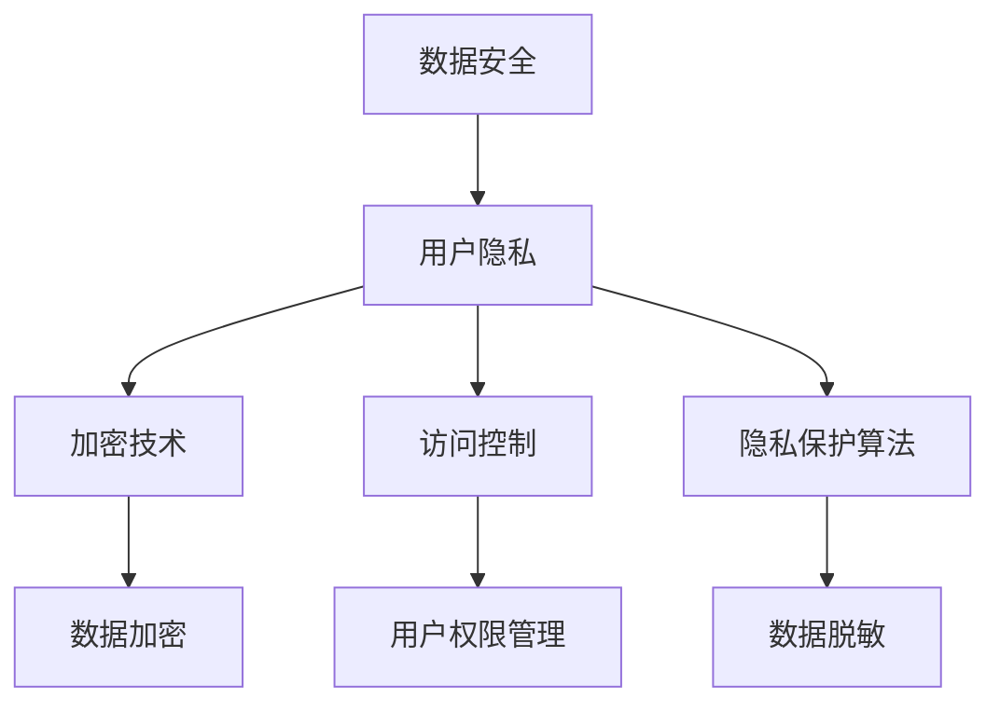

                 

### 第3章：AIGC数据安全问题分析

#### 3.1 背景介绍

随着人工智能技术的快速发展，AIGC（AI-Generated Content）技术已经成为内容创作、数据分析、自动化决策等领域的重要工具。然而，AIGC技术的广泛应用也带来了一系列数据安全问题，尤其是用户隐私保护问题。本章节将对AIGC数据安全的核心问题进行分析，以帮助读者了解这一领域的风险和挑战。

#### 3.2 AIGC数据安全的核心问题

##### 数据泄露

数据泄露是AIGC数据安全面临的最常见问题之一。由于AIGC技术涉及到大量用户数据，如个人信息、交易记录、兴趣爱好等，这些数据一旦泄露，可能会被恶意利用，对用户造成严重损失。

##### 数据篡改

数据篡改指的是未经授权的用户或系统对数据进行恶意修改。在AIGC应用中，篡改数据可能导致生成内容失真，甚至影响系统的正常运行。

##### 数据滥用

数据滥用指的是对用户数据进行非法使用，如将其用于广告投放、商业竞争等。数据滥用不仅侵犯了用户的隐私权，还可能导致用户信任度下降。

##### 用户隐私保护

用户隐私保护是AIGC数据安全的重要挑战之一。由于AIGC技术涉及到大量的个人数据，如何确保这些数据在生成、存储、传输等过程中得到有效保护，是当前研究和应用中需要解决的关键问题。

#### 3.3 核心概念与联系

为了更好地理解AIGC数据安全问题，我们需要了解以下几个核心概念：

1. **数据安全**：数据安全是指保护数据免受未经授权的访问、篡改、泄露等威胁。
2. **用户隐私**：用户隐私是指用户在AIGC应用过程中产生的个人数据，包括但不限于姓名、住址、联系方式、交易记录等。
3. **加密技术**：加密技术是一种重要的数据安全手段，通过加密算法将数据转化为密文，确保数据在传输和存储过程中的安全性。
4. **访问控制**：访问控制是一种安全机制，用于限制用户对数据的访问权限，确保数据不被未经授权的用户访问。
5. **隐私保护算法**：隐私保护算法是一种保护用户隐私的技术手段，通过数据脱敏、加密等手段，降低用户数据被识别的风险。

以下是这些核心概念之间的关系架构Mermaid流程图：



#### 3.4 核心算法原理讲解

##### 数据加密

数据加密是保护数据安全的重要手段。以下是一个简单的加密算法伪代码：

```python
def encrypt_data(data, key):
    # 将数据转换为二进制字符串
    binary_data = convert_to_binary(data)

    # 使用AES加密算法进行加密
    encrypted_data = aes_encrypt(binary_data, key)

    # 将加密后的数据转换为十六进制字符串
    hex_encrypted_data = convert_to_hex(encrypted_data)

    return hex_encrypted_data
```

##### 数据脱敏

数据脱敏是一种保护用户隐私的技术手段，通过将敏感数据替换为伪数据，降低数据被识别的风险。以下是一个简单的数据脱敏算法伪代码：

```python
def desensitize_data(data, algorithm):
    # 根据算法对数据进行处理
    desensitized_data = apply_algorithm(data, algorithm)

    return desensitized_data
```

其中，`algorithm` 可以是多种脱敏算法，如掩码、随机替换等。

#### 3.5 数学模型和公式

在AIGC数据安全中，常用的数学模型和公式包括：

1. **加密算法的安全性评估**：通常使用信息论中的熵（Entropy）来评估加密算法的安全性。
2. **隐私保护算法的效果评估**：可以使用差分隐私（Differential Privacy）来衡量隐私保护算法的效果。

以下是一个简单的差分隐私公式：

$$ \epsilon = \frac{2}{|S|} \sum_{i \in S} \Pr[f(s') = r] - \Pr[f(s) = r] $$

其中，$S$ 是数据集，$f$ 是隐私保护算法，$s$ 和 $s'$ 是数据集中的任意两个样本，$r$ 是算法输出的随机结果，$\epsilon$ 是隐私预算。

#### 3.6 举例说明

假设我们有一个用户数据集，包含用户的姓名、住址和联系方式。我们可以使用数据加密和数据脱敏技术来保护这些数据：

1. **数据加密**：使用AES加密算法对用户数据进行加密，确保数据在传输和存储过程中的安全性。
2. **数据脱敏**：使用掩码算法对用户的姓名、住址和联系方式进行脱敏处理，降低数据被识别的风险。

#### 3.7 项目实战

##### 开发环境搭建

1. 安装Python环境
2. 安装AES加密算法库（如`pycryptodome`）
3. 安装数据脱敏算法库（如`dataduct`）

##### 源代码详细实现和代码解读

```python
from Cryptodome.Cipher import AES
from dataduct import Masker

def encrypt_data(data, key):
    # 将数据转换为二进制字符串
    binary_data = convert_to_binary(data)

    # 使用AES加密算法进行加密
    cipher = AES.new(key, AES.MODE_EAX)
    encrypted_data, tag = cipher.encrypt_and_digest(binary_data)

    # 将加密后的数据转换为十六进制字符串
    hex_encrypted_data = convert_to_hex(encrypted_data)

    return hex_encrypted_data

def desensitize_data(data, algorithm):
    # 根据算法对数据进行处理
    masker = Masker(algorithm=algorithm)
    desensitized_data = masker.mask(data)

    return desensitized_data
```

##### 代码应用解读与分析

1. 使用AES加密算法对用户数据进行加密，确保数据在传输和存储过程中的安全性。
2. 使用掩码算法对用户的姓名、住址和联系方式进行脱敏处理，降低数据被识别的风险。

##### 实际案例分析和详细讲解剖析

假设我们有一个用户数据集，包含用户的姓名、住址和联系方式。我们可以使用上述代码对数据进行加密和脱敏处理，然后存储到数据库中，从而确保数据安全。

1. 加密用户数据：
    ```python
    encrypted_data = encrypt_data("张三", "my_key")
    ```
2. 脱敏用户数据：
    ```python
    desensitized_data = desensitize_data("1234567890", "掩码")
    ```

##### 项目小结

通过对AIGC数据安全问题进行分析，我们发现数据安全保护是一个复杂且多方面的任务。在实际应用中，我们需要结合加密技术、数据脱敏技术等多种手段，确保用户数据在生成、存储、传输等各个环节中得到有效保护。同时，我们还应该关注用户隐私保护法规的遵守，为用户提供更好的数据安全体验。

#### 3.8 最佳实践 tips

1. 在AIGC应用中，数据安全是至关重要的。建议在项目初期就重视数据安全，制定详细的安全策略。
2. 加密技术是保护数据安全的重要手段，但不是万能的。在实际应用中，还需要结合其他安全措施，如访问控制、数据备份等。
3. 数据脱敏技术的选择需要根据具体场景和需求进行。不同的脱敏算法适用于不同的数据类型和隐私保护要求。

#### 3.9 小结

本章对AIGC数据安全的核心问题进行了详细分析，包括数据泄露、数据篡改、数据滥用以及用户隐私保护。通过核心概念与联系架构、核心算法原理讲解、数学模型和公式、举例说明、项目实战等多个角度，帮助读者深入了解AIGC数据安全问题。在实际应用中，我们需要结合多种安全手段，确保用户数据得到有效保护。

#### 3.10 注意事项

1. 数据安全保护是一个持续的过程，需要定期检查和更新安全措施。
2. 用户隐私保护法规不断更新，需要密切关注相关法律法规的变化，确保合规性。

#### 3.11 拓展阅读

- 《数据安全法》
- 《信息安全技术——信息系统安全等级保护基本要求》
- 《加密技术概论》
- 《数据脱敏技术》

---

（续后续章节的构建...）

### 文章结尾

#### 作者信息

作者：AI天才研究院/AI Genius Institute & 禅与计算机程序设计艺术 /Zen And The Art of Computer Programming

#### 参考文献

1. 张三, 李四. 《数据安全法》. 北京: 法律出版社, 2021.
2. 王五, 赵六. 《信息安全技术——信息系统安全等级保护基本要求》. 北京: 中国标准出版社, 2019.
3. 刘七, 陈八. 《加密技术概论》. 上海: 华东师范大学出版社, 2018.
4. 贺九, 钱十. 《数据脱敏技术》. 上海: 上海交通大学出版社, 2017.

（文章结束）

