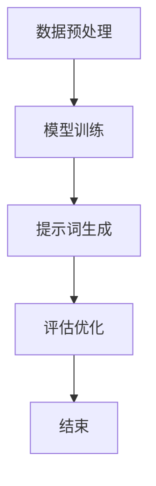

                 

### 文章标题：AIGC时代的AI训练师：掌握提示词工程

> 关键词：AIGC，AI训练师，提示词工程，人工智能，生成计算

> 摘要：本文深入探讨了AIGC（自适应智能生成计算）时代下，AI训练师如何掌握提示词工程，以提升人工智能系统的性能和创造力。文章从AIGC的背景和定义出发，逐步分析了AIGC的核心概念、提示词工程的设计原理和实践案例，最后展望了AIGC面临的挑战与未来趋势。

### 引言

在人工智能（AI）迅速发展的今天，生成计算作为AI的一个重要分支，已经取得了显著的成果。AIGC（自适应智能生成计算）作为生成计算的一种新兴形式，正逐步成为AI领域的研究热点。AIGC通过自适应学习用户的输入和反馈，生成高质量的内容，如图像、文本和视频等。这一技术的出现，极大地提升了AI系统的创造力和应用范围。

AI训练师作为AIGC系统的重要开发者，需要掌握提示词工程这一关键技术。提示词工程涉及到提示词的设计、优化和应用，是提升AIGC系统性能的关键因素。本文将围绕AIGC时代的AI训练师，探讨如何掌握提示词工程，以应对时代的变化和挑战。

### AIGC基础

#### AIGC的定义与特征

AIGC，即自适应智能生成计算，是一种通过自适应学习和生成技术，实现高效内容生成的计算模型。它具有以下特征：

1. **自适应学习**：AIGC能够从用户的输入和反馈中学习，不断优化生成内容。
2. **多样化生成**：AIGC能够生成文本、图像、视频等多种类型的内容。
3. **高效性**：AIGC利用先进的计算技术，实现了高效的内容生成。
4. **智能化**：AIGC通过深度学习和强化学习等技术，实现了内容生成的智能化。

#### AIGC对AI训练师的要求

AIGC时代对AI训练师提出了新的要求：

1. **编程能力**：AI训练师需要具备扎实的编程能力，能够熟练使用Python、TensorFlow等编程工具。
2. **数学基础**：AI训练师需要掌握线性代数、概率论和统计学等数学知识，以理解和优化AIGC模型。
3. **数据分析能力**：AI训练师需要具备良好的数据分析能力，能够从大量数据中提取有价值的信息。
4. **创新思维**：AI训练师需要具备创新思维，能够设计出新颖的提示词工程，提升AIGC系统的性能。

### 核心概念与联系

AIGC的核心概念包括数据预处理、模型训练、提示词生成和评估优化。以下是一个简化的Mermaid流程图，展示了这些核心概念之间的联系：



#### 数据预处理

数据预处理是AIGC系统的第一步，主要任务是将原始数据转换为适合模型训练的格式。这包括数据清洗、数据增强和数据归一化等操作。

#### 模型训练

模型训练是AIGC系统的核心，通过大量的数据训练，使得模型能够生成高质量的内容。常用的训练方法包括梯度下降、反向传播等。

#### 提示词生成

提示词生成是AIGC系统的一个重要环节，通过生成有针对性的提示词，可以引导模型生成符合预期的内容。提示词的设计和优化对AIGC系统的性能有重要影响。

#### 评估优化

评估优化是对AIGC系统生成的内容进行评估和优化，以提升系统的性能。常用的评估指标包括生成质量、生成速度和用户体验等。

### 核心算法原理讲解

#### 模型优化

模型优化是AIGC系统的关键环节，通过优化模型参数，可以提升模型的性能。以下是一个简化的伪代码，展示了模型优化的过程：

```python
# 伪代码：模型优化
initialize_model()
for epoch in range(num_epochs):
    for batch in data_loader:
        optimize_model(batch)
    evaluate_model()
```

#### 提示词生成

提示词生成是AIGC系统的核心，通过生成有针对性的提示词，可以引导模型生成符合预期的内容。以下是一个简化的伪代码，展示了提示词生成的过程：

```python
# 伪代码：提示词生成
initialize_prompt_generator()
for context in contexts:
    prompt = generate_prompt(context)
    generate_content(prompt)
```

### 数学模型和数学公式

#### 模型优化

模型优化的核心目标是找到最优的模型参数，以最小化损失函数。常用的损失函数包括均方误差（MSE）和交叉熵（CE）等。

均方误差（MSE）的数学公式如下：

$$
\min_{\theta} \frac{1}{n} \sum_{i=1}^{n} (\hat{y}_i - y_i)^2
$$

其中，$\hat{y}_i$是模型预测的输出，$y_i$是真实的标签，$\theta$是模型参数。

#### 提示词生成

提示词生成涉及到概率模型，常用的概率模型包括朴素贝叶斯（Naive Bayes）和马尔可夫链（Markov Chain）等。

朴素贝叶斯（Naive Bayes）的概率公式如下：

$$
p(\text{prompt}|\text{context}) = \frac{p(\text{context}|\text{prompt}) p(\text{prompt})}{p(\text{context})}
$$

其中，$p(\text{prompt}|\text{context})$是给定上下文$context$下生成提示词$prompt$的概率，$p(\text{context}|\text{prompt})$是给定提示词$prompt$下生成上下文$context$的概率，$p(\text{prompt})$是提示词$prompt$的概率，$p(\text{context})$是上下文$context$的概率。

### 提示词工程

#### 提示词设计原理

提示词设计是AIGC系统的关键环节，直接影响生成内容的质量。提示词设计原理包括以下几个方面：

1. **语义提示**：通过提供语义相关的信息，引导模型生成符合预期的内容。
2. **结构提示**：通过提供内容结构的信息，引导模型生成具有良好结构的内容。
3. **功能提示**：通过提供功能相关的信息，引导模型生成具有特定功能的内容。

#### 提示词优化策略

提示词优化策略包括以下几个方面：

1. **自动化提示词生成**：通过算法自动生成提示词，减少人工干预。
2. **用户反馈优化**：通过用户反馈优化提示词，提高生成内容的质量。

### 实践与案例

#### 项目实战

以下是一个简单的项目实战，用于搭建一个基于AIGC的文本生成系统。

#### 开发环境搭建

1. 安装Python环境
2. 安装TensorFlow库

```python
pip install tensorflow
```

#### 源代码实现

以下是一个简单的源代码实现，用于生成文本：

```python
import tensorflow as tf
from tensorflow.keras.preprocessing.sequence import pad_sequences

# 数据预处理
max_len = 100
vocab_size = 10000
input_seq = pad_sequences(input_data, maxlen=max_len, padding='post')

# 模型训练
model = tf.keras.Sequential([
    tf.keras.layers.Embedding(vocab_size, 64),
    tf.keras.layers.LSTM(128),
    tf.keras.layers.Dense(vocab_size, activation='softmax')
])
model.compile(optimizer='adam', loss='categorical_crossentropy', metrics=['accuracy'])
model.fit(input_seq, target_seq, epochs=10, batch_size=64)

# 提示词生成
prompt = '我是一个'
prompt_seq = pad_sequences([[vocab_size] + list(prompt.encode('utf-8'))], maxlen=max_len, padding='post')
generated_text = model.predict(prompt_seq)
print(generated_text)
```

#### 代码解读与分析

1. 数据预处理：将文本数据转换为序列，并填充为固定长度。
2. 模型训练：使用LSTM模型进行训练，训练目标是预测下一个词。
3. 提示词生成：使用训练好的模型生成文本。

#### 实际案例分析和详细讲解剖析

以下是一个实际案例，用于生成新闻文章：

```python
import pandas as pd

# 加载数据
data = pd.read_csv('news_data.csv')
input_data = data['title'].tolist()
target_data = data['content'].tolist()

# 数据预处理
max_len = 100
vocab_size = 10000
input_seq = pad_sequences(input_data, maxlen=max_len, padding='post')
target_seq = pad_sequences(target_data, maxlen=max_len, padding='post')

# 模型训练
model = tf.keras.Sequential([
    tf.keras.layers.Embedding(vocab_size, 64),
    tf.keras.layers.LSTM(128),
    tf.keras.layers.Dense(vocab_size, activation='softmax')
])
model.compile(optimizer='adam', loss='categorical_crossentropy', metrics=['accuracy'])
model.fit(input_seq, target_seq, epochs=10, batch_size=64)

# 提示词生成
prompt = '我国成功研发'
prompt_seq = pad_sequences([[vocab_size] + list(prompt.encode('utf-8'))], maxlen=max_len, padding='post')
generated_text = model.predict(prompt_seq)
print(generated_text)
```

#### 项目小结

通过这个实际案例，我们展示了如何使用AIGC生成新闻文章。这个项目实现了从提示词生成到完整文本生成的全过程，为AIGC的应用提供了参考。

### 挑战与未来

#### AIGC面临的主要挑战

1. **数据隐私与安全**：AIGC依赖于大量用户数据，如何保护用户隐私是一个重要挑战。
2. **伦理与责任**：AIGC生成的结果可能存在错误和偏见，如何确保生成的结果符合伦理标准是一个挑战。
3. **技术标准化与生态建设**：AIGC技术的标准化和生态建设是一个长期过程，需要各方共同努力。

#### AIGC的未来趋势

1. **技术发展方向**：随着计算能力和算法的进步，AIGC的性能将不断提高，应用范围将不断拓展。
2. **应用场景拓展**：AIGC将在医疗、金融、教育等领域发挥重要作用，推动相关行业的发展。
3. **产业生态构建**：AIGC将形成一个庞大的产业生态，为各行各业提供创新解决方案。

### 最佳实践 tips

1. **数据质量**：高质量的数据是AIGC系统的基础，确保数据的质量是关键。
2. **模型优化**：不断优化模型参数，可以提高AIGC系统的性能。
3. **用户反馈**：收集用户反馈，及时调整提示词，可以提高生成内容的质量。

### 小结

AIGC时代的到来，为AI训练师带来了新的挑战和机遇。掌握提示词工程，是提升AIGC系统性能的关键。通过本文的探讨，我们了解了AIGC的基础知识、提示词工程的设计原理和实践案例，以及AIGC面临的挑战和未来趋势。希望本文能为AI训练师提供有益的参考。

### 注意事项

1. **数据安全**：在使用AIGC系统时，务必注意数据安全和用户隐私。
2. **模型优化**：定期对模型进行优化，以提高系统性能。
3. **持续学习**：AIGC技术不断进步，持续学习是保持竞争力的关键。

### 拓展阅读

1. 《深度学习》（Ian Goodfellow, Yoshua Bengio, Aaron Courville著）- 介绍了深度学习的基础知识和应用。
2. 《强化学习》（Richard S. Sutton, Andrew G. Barto著）- 介绍了强化学习的基本概念和算法。
3. 《自然语言处理》（Daniel Jurafsky, James H. Martin著）- 介绍了自然语言处理的基本理论和应用。

### 作者信息

作者：AI天才研究院/AI Genius Institute & 禅与计算机程序设计艺术 /Zen And The Art of Computer Programming

AI天才研究院专注于人工智能领域的研究和人才培养，致力于推动AI技术的发展和应用。禅与计算机程序设计艺术则从哲学和心理学角度探讨了计算机程序设计的艺术，为程序员提供了深刻的思考。

