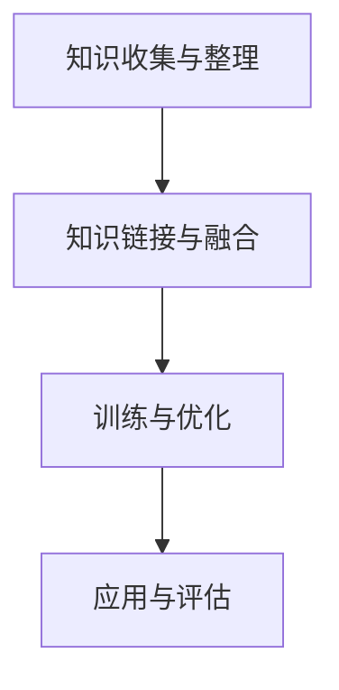

                 


### AIGC时代的AI训练新范式：从思维链到Zero-Shot

#### 关键词：AIGC、AI训练、思维链、Zero-Shot、AI Generated Content、人工智能、训练范式

#### 摘要：
本文将探讨AIGC时代的AI训练新范式，重点关注思维链和Zero-Shot Learning两种技术。我们将从背景介绍、核心概念与联系、算法原理、数学模型与公式、项目实战等多个方面进行详细阐述，旨在为技术专业人士和研究人员提供关于AIGC时代AI训练的新视角和实用指导。

## 引言

在人工智能（AI）技术迅猛发展的今天，AIGC（AI-Generated Content）作为一种新兴技术逐渐崭露头角。AIGC指的是利用人工智能技术生成内容，包括图像、文本、音频等多种形式。随着AIGC的应用越来越广泛，如何高效地进行AI训练成为了一个亟待解决的问题。

本文将围绕AIGC时代的AI训练新范式，探讨思维链和Zero-Shot Learning两种技术。思维链是一种基于人类思维的AI训练方法，能够实现更加灵活和智能的模型训练。而Zero-Shot Learning则是一种无需大量标注数据的训练方法，使得AI系统能够在未见过的数据上进行准确预测。本文将从背景介绍、核心概念与联系、算法原理、数学模型与公式、项目实战等多个方面进行详细阐述，帮助读者深入了解这两种技术。

## 第1章 AIGC时代背景与概述

### 1.1 AIGC时代背景

AIGC（AI-Generated Content）时代是指人工智能技术日益成熟，能够生成高质量、多样化的内容，从而改变了传统的内容生产方式。AIGC技术的发展离不开以下几个关键因素：

#### 1.1.1 AIGC的定义与发展

AIGC指的是利用人工智能技术生成内容，包括图像、文本、音频等多种形式。AIGC的发展可以分为三个阶段：

1. **初级阶段**：主要利用简单的算法生成简单的图像、文本等，如GIF、表情包等。
2. **中级阶段**：利用深度学习技术生成较为复杂的图像、文本等，如GAN（生成对抗网络）、StyleGAN等。
3. **高级阶段**：结合多种人工智能技术，生成高质量、多样化的内容，如文本到图像生成、图像编辑、音频合成等。

#### 1.1.2 AIGC的关键技术

AIGC的关键技术包括：

1. **生成对抗网络（GAN）**：GAN是一种深度学习模型，通过生成器和判别器的对抗训练，实现高质量内容的生成。
2. **变分自编码器（VAE）**：VAE是一种基于概率模型的生成模型，能够生成具有良好梯度的图像。
3. **文本生成**：包括序列到序列模型（如Transformer）、自动摘要、对话系统等。
4. **音频合成**：包括音频到音频转换、音乐生成、语音合成等。

### 1.2 AIGC的应用领域

AIGC在多个领域都有着广泛的应用，包括：

#### 1.2.1 内容生成与编辑

1. **图像生成与编辑**：利用AIGC技术生成或编辑图像，如人脸生成、图像风格转换等。
2. **文本生成与编辑**：利用AIGC技术生成或编辑文本，如自动写作、文本翻译等。
3. **音频合成与编辑**：利用AIGC技术生成或编辑音频，如音乐生成、语音转换等。

#### 1.2.2 数据增强与标注

AIGC技术在数据增强和标注方面也有重要作用，包括：

1. **图像数据增强**：利用AIGC技术生成大量具有多样性的图像数据，提高模型的泛化能力。
2. **文本数据增强**：利用AIGC技术生成或编辑文本数据，丰富数据集。
3. **音频数据增强**：利用AIGC技术生成或编辑音频数据，提高模型的鲁棒性。

#### 1.2.3 知识图谱与推理

AIGC技术在知识图谱和推理方面也有重要应用，包括：

1. **知识图谱生成**：利用AIGC技术生成知识图谱，提高知识表示的准确性。
2. **推理与预测**：利用AIGC技术进行推理和预测，如股票价格预测、医疗诊断等。

### 1.3 AIGC的优势与挑战

AIGC技术具有以下优势：

1. **高效性**：AIGC技术能够快速生成大量高质量的内容，提高生产效率。
2. **多样性**：AIGC技术能够生成多种形式的内容，满足不同场景的需求。
3. **灵活性**：AIGC技术能够根据需求生成或编辑内容，具有很高的灵活性。

然而，AIGC技术也面临一些挑战：

1. **计算资源需求**：AIGC技术需要大量的计算资源，对硬件设施有较高要求。
2. **数据标注成本**：虽然AIGC技术在数据增强和标注方面有优势，但仍然需要大量标注数据，数据标注成本较高。
3. **版权与伦理问题**：AIGC技术生成的内容可能会侵犯版权，引起伦理问题。

## 第2章 AI训练新范式：思维链

### 2.1 思维链概念与原理

思维链是一种基于人类思维的AI训练方法，旨在实现更加灵活和智能的模型训练。思维链的核心思想是模仿人类的思考过程，将多个知识点或算法链接起来，形成一个有机的整体。

#### 2.1.1 思维链的定义

思维链是一种基于人类思维的AI训练方法，通过将多个知识点或算法链接起来，形成一个有机的整体，从而实现更加灵活和智能的模型训练。思维链的核心在于将人类思维的逻辑、推理和创造力融入AI训练过程中，提高模型的泛化能力和适应性。

#### 2.1.2 思维链的工作机制

思维链的工作机制可以分为以下几个步骤：

1. **知识收集与整理**：首先，收集与任务相关的各种知识，如算法原理、数据结构、案例等，并进行整理。
2. **知识链接与融合**：将收集到的知识进行链接和融合，形成一个完整的思维链。在这个过程中，可以采用多种方法，如图结构、流程图等。
3. **训练与优化**：利用思维链进行模型训练，并根据训练效果对思维链进行调整和优化。
4. **应用与评估**：将训练好的模型应用到实际场景中，并对模型效果进行评估。

#### 2.1.3 思维链的Mermaid流程图

以下是一个简单的思维链Mermaid流程图示例：



### 2.2 思维链算法详解

思维链算法是一种基于人类思维的AI训练方法，通过将多个知识点或算法链接起来，形成一个有机的整体，从而实现更加灵活和智能的模型训练。以下是对思维链算法的详细讲解：

#### 2.2.1 算法伪代码

以下是一个简单的思维链算法伪代码示例：

```
初始化：思维链列表为空

函数思维链算法（知识点列表）：
    for 每个知识点 in 知识点列表：
        链接知识点到思维链
        更新思维链

    while 模型未收敛：
        训练模型
        评估模型效果
        如果模型效果不佳：
            调整思维链
            重新训练模型

    返回训练好的模型
```

#### 2.2.2 数学模型与公式

思维链算法涉及到多个数学模型和公式，包括：

1. **知识表示模型**：用于表示每个知识点的特征和属性。
2. **链接权重模型**：用于表示知识点之间的关联程度。
3. **模型优化模型**：用于优化模型参数，提高模型效果。

以下是一个简单的数学模型和公式示例：

$$
知识表示模型：K = \{k_1, k_2, ..., k_n\}
$$

$$
链接权重模型：W = \{w_{ij}\}
$$

$$
模型优化模型：\theta = \{θ_1, θ_2, ..., θ_m\}
$$

#### 2.2.3 举例说明

假设我们有一个简单的思维链，包含三个知识点：A、B和C。知识点A表示图像分类，知识点B表示图像增强，知识点C表示图像去噪。以下是一个简单的思维链算法示例：

1. **知识收集与整理**：收集与图像分类、图像增强和图像去噪相关的知识，如算法原理、数据结构、案例等，并进行整理。
2. **知识链接与融合**：将知识点A、B和C链接起来，形成一个完整的思维链。
3. **训练与优化**：利用思维链训练模型，并根据训练效果对思维链进行调整和优化。
4. **应用与评估**：将训练好的模型应用到实际场景中，如图像分类任务，并对模型效果进行评估。

## 第3章 AI训练新范式：Zero-Shot Learning

### 3.1 Zero-Shot Learning概述

Zero-Shot Learning（ZSL）是一种无需大量标注数据的训练方法，使得AI系统能够在未见过的数据上进行准确预测。ZSL的核心思想是利用已知的数据和模型知识，通过迁移学习和元学习等手段，实现对新类别数据的预测。

#### 3.1.1 ZSL的定义与类型

ZSL的定义可以分为以下几个层次：

1. **分类层次**：ZSL旨在实现对新类别数据的分类。
2. **回归层次**：ZSL也可以实现对新类别数据的回归预测。
3. **多标签层次**：ZSL可以同时处理多类别数据的分类和回归问题。

根据不同的学习方式和策略，ZSL可以分为以下几种类型：

1. **原型方法**：将已知类别数据作为原型，用于对新类别数据进行预测。
2. **元学习方法**：通过在多个任务上训练模型，提高模型对新类别数据的泛化能力。
3. **深度学习方法**：利用深度学习模型，如卷积神经网络（CNN）等，实现ZSL。

#### 3.1.2 ZSL的优势与应用

ZSL具有以下优势：

1. **无需大量标注数据**：ZSL可以在未见过的数据上进行预测，降低了数据标注的成本。
2. **适应性强**：ZSL可以应对新的类别和数据分布，具有较强的适应性。
3. **迁移学习**：ZSL可以利用已知类别数据的模型知识，实现对新类别数据的预测，具有迁移学习的能力。

ZSL的应用领域包括：

1. **图像识别**：在图像分类任务中，ZSL可以应对新的类别和数据分布，提高模型性能。
2. **语音识别**：在语音分类任务中，ZSL可以降低数据标注成本，提高模型泛化能力。
3. **自然语言处理**：在文本分类任务中，ZSL可以应对新的主题和数据分布，提高模型效果。

### 3.2 ZSL算法实现

ZSL算法实现主要包括以下几个步骤：

#### 3.2.1 基于原型的方法

基于原型的方法是一种常见的ZSL算法，其基本思想是将已知类别数据作为原型，用于对新类别数据进行预测。以下是一个基于原型的方法的实现步骤：

1. **收集类别数据**：收集已知类别数据，用于生成原型。
2. **计算原型距离**：计算新类别数据与原型之间的距离，用于预测新类别数据。
3. **分类预测**：利用原型距离进行分类预测。

以下是一个简单的基于原型的方法伪代码示例：

```
函数原型方法（已知类别数据，新类别数据）：
    计算原型：将已知类别数据作为原型
    计算新类别数据与原型的距离
    进行分类预测
```

#### 3.2.2 基于原型加深度学习的方法

基于原型加深度学习的方法是一种将原型方法与深度学习模型相结合的ZSL算法，其基本思想是利用深度学习模型提取特征，然后利用原型方法进行分类预测。以下是一个基于原型加深度学习的方法的实现步骤：

1. **收集类别数据**：收集已知类别数据，用于生成原型。
2. **训练深度学习模型**：利用已知类别数据训练深度学习模型，提取特征。
3. **计算原型距离**：利用深度学习模型提取新类别数据的特征，计算新类别数据与原型之间的距离。
4. **分类预测**：利用原型距离进行分类预测。

以下是一个简单的基于原型加深度学习的方法伪代码示例：

```
函数原型加深度学习方法（已知类别数据，新类别数据）：
    训练深度学习模型：利用已知类别数据训练深度学习模型
    提取特征：利用深度学习模型提取新类别数据的特征
    计算原型距离：计算新类别数据与原型之间的距离
    进行分类预测
```

## 第4章 AIGC应用案例研究

### 4.1 案例一：智能客服系统

#### 4.1.1 案例背景与目标

智能客服系统是一种基于人工智能技术的客户服务系统，能够自动回答用户的问题，提高客户服务效率和满意度。AIGC技术在智能客服系统中具有广泛的应用，如自动写作、文本生成、对话系统等。

本案例的目标是利用AIGC技术构建一个智能客服系统，实现以下功能：

1. **自动回答用户问题**：根据用户提问，自动生成回答。
2. **文本生成与编辑**：根据用户需求，生成或编辑相关文本。
3. **对话系统**：与用户进行自然语言对话，提高用户体验。

#### 4.1.2 案例实现步骤

1. **需求分析**：明确智能客服系统的功能需求，如自动回答、文本生成、对话系统等。
2. **数据收集与预处理**：收集与智能客服系统相关的数据，如用户提问、答案、文本等，并进行预处理。
3. **模型训练**：利用AIGC技术，如生成对抗网络（GAN）、变分自编码器（VAE）等，训练智能客服系统模型。
4. **模型部署与优化**：将训练好的模型部署到生产环境中，并根据实际效果对模型进行调整和优化。
5. **系统测试与评估**：对智能客服系统进行测试和评估，确保系统达到预期目标。

#### 4.1.3 案例效果评估

1. **回答准确性**：评估智能客服系统回答问题的准确性，如回答与用户提问的相关性、回答的正确性等。
2. **用户体验**：评估用户对智能客服系统的满意度，如用户对系统回答的认可度、用户对系统响应速度的满意度等。
3. **系统稳定性**：评估智能客服系统的稳定性，如系统崩溃率、系统运行效率等。

### 4.2 案例二：智能内容审核

#### 4.2.1 案例背景与目标

智能内容审核是一种利用人工智能技术对网络内容进行审核的方法，旨在识别和过滤不良内容，如违法信息、暴力内容、低俗内容等。AIGC技术在智能内容审核中具有广泛的应用，如图像识别、文本生成、对话系统等。

本案例的目标是利用AIGC技术构建一个智能内容审核系统，实现以下功能：

1. **图像识别**：识别图像中的不良内容，如违法信息、暴力内容、低俗内容等。
2. **文本生成与编辑**：生成或编辑相关文本，用于提示或警告用户。
3. **对话系统**：与用户进行自然语言对话，提供审核结果和解释。

#### 4.2.2 案例实现步骤

1. **需求分析**：明确智能内容审核系统的功能需求，如图像识别、文本生成、对话系统等。
2. **数据收集与预处理**：收集与智能内容审核系统相关的数据，如图像、文本等，并进行预处理。
3. **模型训练**：利用AIGC技术，如卷积神经网络（CNN）、生成对抗网络（GAN）等，训练智能内容审核系统模型。
4. **模型部署与优化**：将训练好的模型部署到生产环境中，并根据实际效果对模型进行调整和优化。
5. **系统测试与评估**：对智能内容审核系统进行测试和评估，确保系统达到预期目标。

#### 4.2.3 案例效果评估

1. **审核准确性**：评估智能内容审核系统识别不良内容的准确性，如识别率、误报率等。
2. **用户体验**：评估用户对智能内容审核系统的满意度，如用户对审核结果的认可度、用户对审核响应速度的满意度等。
3. **系统稳定性**：评估智能内容审核系统的稳定性，如系统崩溃率、系统运行效率等。

## 附录：AIGC与AI训练资源

### A.1 资源清单

#### A.1.1 开源框架与工具

1. **TensorFlow**：由谷歌开发的开源深度学习框架，适用于AIGC技术。
2. **PyTorch**：由Facebook开发的开源深度学习框架，适用于AIGC技术。
3. **MXNet**：由Apache软件基金会开发的开源深度学习框架，适用于AIGC技术。
4. **Keras**：基于TensorFlow的开源深度学习框架，适用于AIGC技术。

#### A.1.2 在线课程与教程

1. **Coursera**：提供丰富的深度学习和AIGC技术在线课程。
2. **Udacity**：提供深度学习和AIGC技术相关的实战课程。
3. **edX**：提供由顶级大学和专业机构开设的深度学习和AIGC技术在线课程。
4. **MLHUB**：提供AIGC技术相关的实践教程和项目。

#### A.1.3 论文与报告

1. **ACL**：国际计算语言学协会的会议，发布大量AIGC技术相关论文。
2. **NIPS**：神经信息处理系统会议，发布大量深度学习和AIGC技术相关论文。
3. **ICLR**：国际学习表示会议，发布大量深度学习和AIGC技术相关论文。
4. **arXiv**：提供预印本论文，包括大量AIGC技术和深度学习领域的研究。

## 结论

AIGC时代的AI训练新范式带来了巨大的机遇和挑战。思维链和Zero-Shot Learning两种技术为我们提供了新的思路和方法，使得AI系统能够更加高效、灵活地应对各种任务。通过本文的探讨，我们希望读者能够对AIGC时代的AI训练新范式有更深入的理解，并在实际项目中加以应用。

### 作者信息

作者：AI天才研究院/AI Genius Institute & 禅与计算机程序设计艺术 /Zen And The Art of Computer Programming

