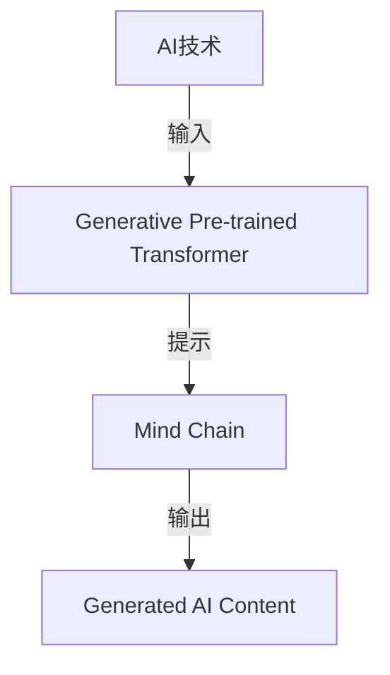

                 


# AIGC时代的prompt设计：思维链的重要性

## 关键词
- AIGC, Prompt设计, 思维链, 人工智能, GPT, 神经网络, 数学模型

## 摘要
本文深入探讨了AIGC（AI-Generated Content）时代下prompt设计的重要性，特别是思维链在其中的关键作用。文章首先介绍了AIGC和prompt设计的背景和基本概念，然后详细阐述了思维链的原理，并使用伪代码和latex公式解释了其核心算法和数学模型。通过一个实际项目案例，文章展示了思维链的应用过程，并提供了解决实际问题的代码实现和解读。最后，文章总结了思维链在AIGC时代的应用前景，并对未来发展趋势进行了展望。

## 一、引言与背景

### 1.1 AIGC时代背景

随着人工智能技术的飞速发展，AIGC（AI-Generated Content）作为一种新兴的领域，正在引起广泛关注。AIGC涵盖了利用人工智能技术自动生成文本、图像、音频等多种类型的内容，它不仅提高了内容创作的效率，还大大丰富了创意表达的方式。AIGC的应用场景广泛，包括但不限于自动写作、智能设计、视频编辑和游戏开发等。

### 1.2 Prompt设计的意义

在AIGC时代，prompt设计扮演着至关重要的角色。prompt，即输入提示，是指导人工智能模型生成特定类型内容的引导信息。一个好的prompt设计可以极大地影响AI生成内容的质量和准确性。因此，深入研究和优化prompt设计对于AIGC的发展具有重要意义。

### 1.3 思维链原理

思维链（Mind Chain）是一种用于指导AI模型生成内容的高级提示技术。它通过构建一个逻辑链条，引导AI在生成过程中保持一致性和连贯性。思维链的原理包括以下几个方面：

- **概念框架**：构建一个概念框架，明确AI需要理解和遵循的规则和标准。
- **信息流设计**：设计一条信息流，引导AI按照既定的逻辑顺序生成内容。
- **反馈机制**：建立反馈机制，使AI能够在生成过程中不断调整和优化输出。

## 二、核心概念与联系

### 2.1 AI与GPT的联系

GPT（Generative Pre-trained Transformer）是当前最先进的自然语言处理模型之一，它基于Transformer架构，通过预训练和微调，可以生成高质量的文本。GPT在AI中的应用非常广泛，它不仅可以用于自动写作，还可以用于对话系统、机器翻译和文本摘要等任务。

### 2.2 GPT与思维链的关系

思维链作为一种高级提示技术，与GPT模型有着紧密的联系。GPT模型通过大量的预训练数据学习到了语言模式，而思维链则通过精心设计的prompt引导GPT模型按照特定的逻辑链条生成内容。这种结合使得GPT模型能够更好地发挥其潜力，生成更符合人类思维逻辑的内容。

### 2.3 Mermaid流程图

为了更直观地展示AI与思维链的关系，我们可以使用Mermaid流程图来描述。以下是一个简化的流程图示例：



## 三、核心算法原理讲解

### 3.1 思维链算法原理

思维链算法的基本原理是通过构建一个逻辑链条来引导AI生成内容。以下是一个简化的伪代码描述：

```pseudo
function generate_content(prompt):
    context = initialize_context(prompt)
    content = ""
    while not end_of_content(context):
        sentence = generate_sentence(context)
        content += sentence + " "
        context = update_context(context, sentence)
    return content.strip()
```

### 3.2 Prompt设计与优化

#### 3.2.1 基本原则

一个好的prompt设计应该遵循以下基本原则：

- **明确性**：prompt应该清晰明确，避免歧义。
- **针对性**：prompt应该针对特定的任务或场景。
- **连贯性**：prompt应该设计得连贯一致，避免逻辑断裂。

#### 3.2.2 优化方法

优化prompt设计的方法包括：

- **数据驱动**：使用大量数据进行prompt训练，以提高其准确性。
- **迭代优化**：通过不断的迭代和优化，改进prompt的质量。

## 四、数学模型与公式

### 4.1 神经网络数学基础

神经网络是一种通过模拟生物神经系统的计算模型。其基本的数学模型包括：

$$
y = \sigma(\omega \cdot x + b)
$$

其中，$y$是输出，$\sigma$是激活函数，$\omega$是权重，$x$是输入，$b$是偏置。

### 4.2 思维链模型公式

思维链模型通过以下公式来指导AI生成内容：

$$
Content = f(MindChain, InputPrompt)
$$

其中，$Content$是生成的AI内容，$MindChain$是思维链，$InputPrompt$是输入prompt。

## 五、项目实战

### 5.1 思维链项目实战

以下是一个简单的思维链项目案例，用于生成一篇关于“人工智能”的文章。

#### 5.1.1 项目背景

本次项目旨在使用GPT模型和思维链技术生成一篇关于“人工智能”的文章，文章需要包含以下主题：

- 人工智能的定义和历史
- 人工智能的应用领域
- 人工智能面临的挑战和未来趋势

#### 5.1.2 项目流程

1. **数据收集**：收集与“人工智能”相关的文章和资料。
2. **模型训练**：使用收集的数据训练GPT模型。
3. **思维链设计**：设计思维链，指导GPT模型生成内容。
4. **内容生成**：使用思维链和GPT模型生成文章。
5. **评估与优化**：对生成的文章进行评估和优化。

#### 5.1.3 实战代码与解读

以下是一个简化的代码实现，用于生成文章：

```python
import openai

# 定义思维链
mind_chain = {
    "Introduction": "人工智能是一种模拟人类智能的技术，它通过机器学习、神经网络等技术实现。",
    "History": "人工智能的研究始于20世纪50年代，至今已经经历了多个发展阶段。",
    "Applications": "人工智能在各个领域都有广泛应用，如医疗、金融、教育等。",
    "Challenges": "人工智能在发展过程中面临诸多挑战，如数据隐私、伦理问题等。",
    "Trends": "未来，人工智能将继续发展，并深入影响我们的日常生活和工作方式。"
}

# 使用思维链生成文章
def generate_article(mind_chain):
    article = ""
    for topic, content in mind_chain.items():
        article += f"{topic}: {content}\n"
    return article

# 调用GPT模型生成内容
def generate_content(prompt):
    response = openai.Completion.create(
        engine="text-davinci-002",
        prompt=prompt,
        max_tokens=200
    )
    return response.choices[0].text.strip()

# 主程序
if __name__ == "__main__":
    prompt = generate_article(mind_chain)
    print(generate_content(prompt))
```

## 六、总结与展望

### 6.1 思维链的应用前景

思维链作为一种先进的prompt设计技术，在AIGC时代具有广泛的应用前景。它可以帮助AI更好地理解用户的意图，生成更高质量、更符合逻辑的内容。

### 6.2 未来发展趋势

随着AI技术的不断进步，思维链技术也将得到进一步优化和发展。未来，我们可以期待思维链与更多AI技术的融合，如自然语言处理、图像识别和语音识别等，从而实现更智能、更高效的内容生成。

## 作者

作者：AI天才研究院/AI Genius Institute & 禅与计算机程序设计艺术 /Zen And The Art of Computer Programming

本文内容仅供参考，不构成投资建议。读者在使用本文内容时，请遵循相关法律法规，谨慎评估风险。如需进一步了解相关技术，请参考拓展阅读。

## 拓展阅读

- OpenAI官方文档：[https://openai.com/docs/](https://openai.com/docs/)
- 《人工智能：一种现代方法》：[https://www.aima.org/](https://www.aima.org/)
- 《深度学习》：[https://www.deeplearningbook.org/](https://www.deeplearningbook.org/)
- 《自然语言处理综合教程》：[https://nlp.seas.harvard.edu/](https://nlp.seas.harvard.edu/)

