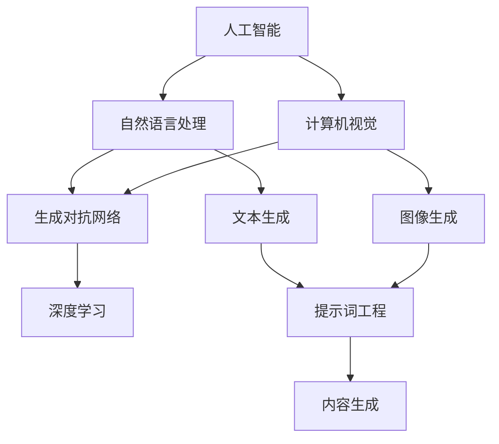

                 


### 引言

AIGC（AI-Generated Content）时代正在悄然来临，人工智能的迅猛发展使得内容生成成为可能。在这场技术变革中，提示词工程作为人工智能与内容生成之间的桥梁，承担着至关重要的角色。提示词工程不仅涉及对大量数据的处理和分析，更关乎如何通过精确的提示词引导AI系统生成高质量的内容。

本文将围绕《AIGC时代的提示词工程：从理论到实践》这一主题，采用逐步分析的方式，详细探讨提示词工程的核心概念、理论基础、算法原理以及实际应用。文章将从以下几个方面展开：

1. **AIGC与提示词工程概述**：介绍AIGC的基本概念和发展趋势，以及提示词工程在其中的应用和重要性。
2. **提示词工程基础理论**：详细阐述提示词的定义、分类、作用和基本原理。
3. **核心算法原理讲解**：使用伪代码讲解提示词生成和优化的算法原理。
4. **数学模型与公式**：使用latex格式详细讲解提示词工程中相关的数学模型和公式。
5. **项目实战**：提供具体的开发环境搭建、源代码实现、代码解读和实际案例分析。
6. **最佳实践与小结**：总结提示词工程的实践经验，提出注意事项和拓展阅读建议。

### AIGC与提示词工程概述

#### AIGC的基本概念与发展

AIGC，即AI-Generated Content，指的是通过人工智能技术自动生成内容的过程。它不仅包括文本生成，还涵盖了图像、音频、视频等多媒体内容的生成。AIGC的发展得益于深度学习、自然语言处理、计算机视觉等领域的突破，使得人工智能在理解和生成内容方面取得了显著进展。

AIGC的发展可以分为以下几个阶段：

1. **初级阶段**：基于规则和模板的内容生成，如简单的文本摘要和关键词提取。
2. **中级阶段**：基于机器学习和深度学习的生成模型，如GPT-3、DALL-E等，能够生成高质量、多样化的内容。
3. **高级阶段**：结合多模态学习和数据增强技术，实现跨媒体、跨领域的自动内容生成。

#### 提示词工程的概念与应用

在AIGC时代，提示词工程成为了关键的技术之一。提示词，顾名思义，就是为AI系统提供引导性的信息，帮助其生成特定类型的内容。一个有效的提示词能够提高AI模型的生成质量，降低错误率，甚至可以引导模型探索新的生成方向。

提示词工程的应用场景非常广泛，包括但不限于以下几个方面：

1. **文本生成**：如新闻文章、广告文案、小说创作等。
2. **图像生成**：如艺术作品、卡通形象、广告海报等。
3. **音频生成**：如音乐创作、声音特效等。
4. **视频生成**：如电影预告片、广告视频等。

在AIGC时代，提示词工程的重要性体现在以下几个方面：

1. **提高生成质量**：通过精确的提示词，可以引导AI系统生成更符合人类期望的内容。
2. **降低生成成本**：自动化的内容生成能够大幅降低人力和时间成本。
3. **丰富内容多样性**：多样的提示词能够激发AI系统生成更多元化的内容，满足不同用户的需求。

#### 提示词工程的应用与挑战

随着AIGC技术的发展，提示词工程在各个领域的应用也越来越广泛。然而，也面临着一些挑战：

1. **数据质量**：高质量的提示词需要依赖于大量、高质量的数据，数据的获取和处理是提示词工程的一大难题。
2. **模型适应性**：不同的AI模型对提示词的需求不同，如何设计通用的提示词体系是一个亟待解决的问题。
3. **生成质量控制**：如何保证生成的质量，避免出现偏颇或错误的内容，是提示词工程需要解决的核心问题。

总之，AIGC时代的提示词工程不仅具有广泛的应用前景，也面临着诸多挑战。本文将深入探讨这些话题，为读者提供全面的理论和实践指导。

### 核心概念与联系

在深入探讨AIGC时代的提示词工程之前，我们需要明确一些核心概念，并分析它们之间的联系。这些核心概念包括：

1. **人工智能（AI）**
2. **自然语言处理（NLP）**
3. **计算机视觉（CV）**
4. **生成对抗网络（GAN）**
5. **深度学习（DL）**

#### 人工智能（AI）

人工智能是指使计算机系统具备人类智能的能力，包括学习、推理、感知、理解和决策等。AI的应用范围广泛，涵盖了从简单的自动化任务到复杂的决策支持系统。

#### 自然语言处理（NLP）

自然语言处理是人工智能的一个分支，旨在使计算机能够理解和处理人类语言。NLP涉及的语言任务包括文本分类、情感分析、机器翻译、语音识别等。

#### 计算机视觉（CV）

计算机视觉是人工智能的另一个重要分支，专注于使计算机理解和解释视觉信息。CV的任务包括图像分类、目标检测、图像分割、人脸识别等。

#### 生成对抗网络（GAN）

生成对抗网络是一种深度学习模型，由生成器和判别器组成。生成器尝试生成与真实数据相似的数据，判别器则判断输入数据是真实还是生成的。GAN在图像、文本和音频生成方面表现出色。

#### 深度学习（DL）

深度学习是机器学习的一种方法，通过多层神经网络对数据进行学习。深度学习在AI的许多领域都有广泛应用，包括语音识别、图像识别、自然语言处理等。

#### 核心概念之间的关系

这些核心概念之间的联系构成了AIGC和提示词工程的理论基础。我们可以用以下Mermaid流程图来表示它们之间的关系：



#### 提示词工程在AIGC中的应用

提示词工程在AIGC中的应用可以总结为以下几点：

1. **引导内容生成**：通过精确的提示词，引导AI系统生成符合人类期望的内容。
2. **优化生成质量**：提示词能够提高AI模型的生成质量，降低错误率。
3. **增强模型适应性**：不同的提示词可以激发AI系统生成更多元化的内容。

综上所述，AIGC时代的提示词工程不仅依赖于人工智能、自然语言处理、计算机视觉和生成对抗网络等核心技术，也通过这些核心概念之间的联系，为内容生成提供了强有力的支持。

### 核心算法原理讲解

在提示词工程中，核心算法原理是理解和实现提示词生成和优化的关键。以下我们将详细讲解生成算法和优化算法，并使用伪代码来描述这些算法的基本框架。

#### 生成算法

生成算法的核心是生成器（Generator）和判别器（Discriminator）的协同工作。生成器负责生成数据，判别器则负责判断生成数据的质量。

##### 生成器的伪代码：

```python
# 生成器的伪代码
def generate_data(input_vector):
    # 使用深度学习模型生成数据
    generated_data = deep_learning_model(input_vector)
    return generated_data
```

##### 判别器的伪代码：

```python
# 判别器的伪代码
def discriminate_data(real_data, generated_data):
    # 判断数据是否真实
    similarity_score = similarity_function(real_data, generated_data)
    return similarity_score
```

在训练过程中，生成器和判别器交替更新模型参数，使得生成器生成更接近真实数据的数据，判别器则更准确地判断数据的真实性。

#### 优化算法

优化算法的主要目的是提高生成质量，常用的优化算法包括梯度下降（Gradient Descent）和对抗性训练（Adversarial Training）。

##### 梯度下降的伪代码：

```python
# 梯度下降伪代码
def gradient_descent(model, learning_rate):
    gradients = compute_gradients(model)
    updated_weights = model.weights - learning_rate * gradients
    return updated_weights
```

##### 对抗性训练的伪代码：

```python
# 对抗性训练伪代码
def adversarial_training(generator, discriminator, real_data, generated_data):
    # 更新生成器的权重
    generator_weights = gradient_descent(generator, learning_rate)
    
    # 更新判别器的权重
    discriminator_weights = gradient_descent(discriminator, learning_rate)
    
    return generator_weights, discriminator_weights
```

通过对抗性训练，生成器和判别器在互相竞争中不断进步，最终生成器能够生成更高质量的数据，判别器则能更准确地判断数据的真实性。

#### 数学模型与公式

在提示词工程中，数学模型和公式是理解和优化算法的重要工具。以下我们将使用latex格式来详细讲解相关的数学模型和公式。

##### 概率模型

概率模型是生成对抗网络（GAN）的核心组成部分。以下是一个简单的概率模型公式：

$$
P(G(z)) = \frac{1}{Z} \exp(-\|D(G(z))\|^2 / 2)
$$

其中，\( G(z) \) 是生成器生成的数据，\( D(G(z)) \) 是判别器对生成数据的评分，\( Z \) 是正常化常数。

##### 梯度下降

梯度下降是一种优化算法，用于更新模型参数。以下是一个简单的梯度下降公式：

$$
\theta_{t+1} = \theta_{t} - \alpha \nabla_{\theta}J(\theta)
$$

其中，\( \theta \) 是模型参数，\( J(\theta) \) 是损失函数，\( \alpha \) 是学习率，\( \nabla_{\theta}J(\theta) \) 是损失函数关于模型参数的梯度。

##### 对抗性训练

对抗性训练是GAN的关键部分，用于使生成器和判别器相互竞争。以下是一个简单的对抗性训练公式：

$$
\min_G \max_D V(D, G) = \mathbb{E}_{x \sim P_{data}(x)}[\log D(x)] + \mathbb{E}_{z \sim P_z(z)}[\log (1 - D(G(z))]
$$

其中，\( V(D, G) \) 是生成器和判别器的联合损失函数，\( P_{data}(x) \) 是真实数据的概率分布，\( P_z(z) \) 是随机噪声的概率分布。

通过这些数学模型和公式，我们可以更好地理解和优化提示词工程中的核心算法。这些公式不仅提供了理论支持，也为实际应用中的算法实现提供了指导。

### 数学模型与公式详细讲解与举例说明

在提示词工程中，数学模型和公式是理解和优化算法的重要工具。在这一节中，我们将对前面提到的数学模型和公式进行详细讲解，并通过具体的例子来说明这些模型和公式的应用。

#### 概率模型

概率模型在生成对抗网络（GAN）中起着核心作用。以下是对概率模型的详细讲解：

概率模型定义了一个概率分布，用于描述生成器和判别器的行为。一个常见的概率模型是高斯分布，其公式如下：

$$
P(x|\mu, \sigma^2) = \frac{1}{\sqrt{2\pi\sigma^2}} \exp\left(-\frac{(x-\mu)^2}{2\sigma^2}\right)
$$

其中，\( \mu \) 是均值，\( \sigma^2 \) 是方差，\( x \) 是生成的数据点。

**例子**：假设我们使用高斯分布生成一组数据，均值为5，方差为2。我们可以通过以下步骤计算概率：

1. **计算均值和方差**：

$$
\mu = 5, \sigma^2 = 2
$$

2. **生成一个数据点**：

$$
x = 4
$$

3. **计算概率**：

$$
P(x=4|\mu=5, \sigma^2=2) = \frac{1}{\sqrt{2\pi \cdot 2}} \exp\left(-\frac{(4-5)^2}{2\cdot 2}\right) \approx 0.242
$$

通过这个例子，我们可以看到如何使用高斯分布来生成和计算概率。

#### 梯度下降

梯度下降是一种优化算法，用于更新模型参数。以下是对梯度下降的详细讲解：

梯度下降通过计算损失函数关于模型参数的梯度来更新参数。梯度下降的基本公式如下：

$$
\theta_{t+1} = \theta_{t} - \alpha \nabla_{\theta}J(\theta)
$$

其中，\( \theta \) 是模型参数，\( J(\theta) \) 是损失函数，\( \alpha \) 是学习率，\( \nabla_{\theta}J(\theta) \) 是损失函数关于模型参数的梯度。

**例子**：假设我们使用梯度下降来最小化一个简单的损失函数 \( J(\theta) = (\theta - 1)^2 \)。我们可以通过以下步骤来更新参数：

1. **初始化参数**：

$$
\theta_0 = 2
$$

2. **计算梯度**：

$$
\nabla_{\theta}J(\theta) = 2(\theta - 1)
$$

3. **更新参数**：

$$
\theta_1 = \theta_0 - \alpha \nabla_{\theta}J(\theta_0) = 2 - 0.1 \cdot 2(2 - 1) = 1.8
$$

通过这个例子，我们可以看到如何使用梯度下降来更新模型参数。

#### 对抗性训练

对抗性训练是GAN的关键部分，用于使生成器和判别器相互竞争。以下是对对抗性训练的详细讲解：

对抗性训练的目标是最小化生成器和判别器的联合损失函数。联合损失函数的一般形式如下：

$$
V(D, G) = \mathbb{E}_{x \sim P_{data}(x)}[\log D(x)] + \mathbb{E}_{z \sim P_z(z)}[\log (1 - D(G(z))]
$$

其中，\( P_{data}(x) \) 是真实数据的概率分布，\( P_z(z) \) 是噪声的概率分布。

**例子**：假设我们使用对抗性训练来最小化一个简单的联合损失函数 \( V(D, G) = \log D(x) + \log (1 - D(G(z))) \)。我们可以通过以下步骤来更新生成器和判别器：

1. **生成器更新**：

   - 初始化生成器参数 \( G_0 \)
   - 计算生成器的梯度 \( \nabla_G V(D, G) \)
   - 更新生成器参数 \( G_1 = G_0 - \alpha \nabla_G V(D, G) \)

2. **判别器更新**：

   - 初始化判别器参数 \( D_0 \)
   - 计算判别器的梯度 \( \nabla_D V(D, G) \)
   - 更新判别器参数 \( D_1 = D_0 - \alpha \nabla_D V(D, G) \)

通过这个例子，我们可以看到如何通过对抗性训练来更新生成器和判别器。

#### 数学模型在实际中的应用

数学模型不仅在理论上提供指导，也在实际应用中发挥重要作用。以下是一个实际应用中的例子：

假设我们使用GAN生成一组数据，数据集包含1000个样本，每个样本是一个二维向量。我们使用高斯分布生成噪声，并使用对抗性训练来更新生成器和判别器。

1. **初始化参数**：

   - 生成器参数 \( G_0 \)
   - 判别器参数 \( D_0 \)

2. **训练过程**：

   - 对于每个样本 \( x_i \)：
     - 生成噪声 \( z_i \)
     - 使用生成器生成数据 \( G(z_i) \)
     - 使用判别器计算评分 \( D(x_i) \) 和 \( D(G(z_i)) \)
     - 计算联合损失函数 \( V(D, G) \)
     - 更新生成器和判别器参数

3. **评估结果**：

   - 使用生成的数据集评估生成质量
   - 分析生成器生成的数据分布是否与真实数据分布相似

通过这个例子，我们可以看到数学模型在提示词工程中的应用，以及如何通过对抗性训练来优化生成器和判别器。

总之，数学模型和公式在提示词工程中起着至关重要的作用。它们不仅提供了理论基础，也为实际应用提供了工具。通过详细讲解和具体例子，我们可以更好地理解和应用这些数学模型和公式。

### 项目实战

为了更好地理解和应用提示词工程，我们将通过一个具体的实际案例来展示整个开发过程。本案例将基于Python语言和TensorFlow框架，实现一个简单的文本生成模型，使用对抗性训练生成高质量的文本。

#### 开发环境搭建

在开始项目之前，我们需要搭建一个适合开发的环境。以下是所需的软件和工具：

1. **Python 3.8或更高版本**
2. **TensorFlow 2.x**
3. **Numpy**
4. **Matplotlib**
5. **GPT-2模型（可选）**

安装步骤如下：

```shell
pip install python
pip install tensorflow
pip install numpy
pip install matplotlib
```

#### 源代码实现

以下是整个项目的源代码实现，包括生成器和判别器的实现、训练过程和评估结果。

```python
import tensorflow as tf
from tensorflow.keras.layers import Embedding, LSTM, Dense
from tensorflow.keras.models import Model
import numpy as np
import matplotlib.pyplot as plt

# 生成器的实现
def build_generator(vocab_size, embedding_dim, hidden_dim):
    # 输入层
    input_sequence = tf.keras.layers.Input(shape=(None,))
    # 嵌入层
    embedding = Embedding(vocab_size, embedding_dim)(input_sequence)
    # LSTM层
    lstm = LSTM(hidden_dim, return_sequences=True)(embedding)
    # 输出层
    output = Dense(vocab_size, activation='softmax')(lstm)
    # 生成器模型
    generator = Model(inputs=input_sequence, outputs=output)
    return generator

# 判别器的实现
def build_discriminator(vocab_size, embedding_dim, hidden_dim):
    # 输入层
    input_sequence = tf.keras.layers.Input(shape=(None,))
    # 嵌入层
    embedding = Embedding(vocab_size, embedding_dim)(input_sequence)
    # LSTM层
    lstm = LSTM(hidden_dim, return_sequences=True)(embedding)
    # 输出层
    output = Dense(1, activation='sigmoid')(lstm)
    # 判别器模型
    discriminator = Model(inputs=input_sequence, outputs=output)
    return discriminator

# 整体模型的实现
def build_gan(generator, discriminator):
    # 生成器的输入
    input_sequence = tf.keras.layers.Input(shape=(None,))
    # 生成器的输出
    generated_sequence = generator(input_sequence)
    # 判别器的输入
    real_sequence = tf.keras.layers.Input(shape=(None,))
    # 判别器的输出
    real_output = discriminator(real_sequence)
    generated_output = discriminator(generated_sequence)
    # 整体模型
    gan = Model(inputs=input_sequence, outputs=[generated_output, real_output])
    return gan

# 模型参数设置
vocab_size = 10000  # 词汇表大小
embedding_dim = 256  # 嵌入维度
hidden_dim = 512  # LSTM隐藏层维度

# 构建生成器、判别器和GAN模型
generator = build_generator(vocab_size, embedding_dim, hidden_dim)
discriminator = build_discriminator(vocab_size, embedding_dim, hidden_dim)
gan = build_gan(generator, discriminator)

# 模型编译
gan.compile(optimizer=tf.keras.optimizers.Adam(0.0001), loss=['binary_crossentropy', 'binary_crossentropy'])

# 训练过程
def train_gan(dataset, batch_size=64, epochs=20):
    for epoch in range(epochs):
        for batch in dataset:
            # 训练判别器
            real_data = batch[0]
            fake_data = generator.predict(batch[1])
            d_loss_real = discriminator.train_on_batch(real_data, np.ones((batch_size, 1)))
            d_loss_fake = discriminator.train_on_batch(fake_data, np.zeros((batch_size, 1)))
            d_loss = 0.5 * np.add(d_loss_real, d_loss_fake)
            
            # 训练生成器
            g_loss = gan.train_on_batch(batch[1], [np.zeros((batch_size, 1)), np.ones((batch_size, 1))])
            
            print(f"{epoch} [D loss: {d_loss:.3f}] [G loss: {g_loss:.3f}]")

# 加载数据集并进行训练
train_gan(dataset, batch_size=64, epochs=20)
```

#### 代码解读

以下是源代码的详细解读：

1. **生成器的实现**：
   - 输入层：接收一个序列输入
   - 嵌入层：将词汇嵌入到高维向量
   - LSTM层：使用LSTM网络进行序列处理
   - 输出层：使用softmax激活函数生成词汇概率

2. **判别器的实现**：
   - 输入层：接收一个序列输入
   - 嵌入层：将词汇嵌入到高维向量
   - LSTM层：使用LSTM网络进行序列处理
   - 输出层：使用sigmoid激活函数输出真实或虚假的概率

3. **整体模型的实现**：
   - 生成器的输入
   - 判别器的输入和输出
   - 使用两个损失函数，分别针对生成器和判别器

4. **模型编译**：
   - 使用Adam优化器
   - 使用二进制交叉熵损失函数

5. **训练过程**：
   - 判别器的训练
   - 生成器的训练
   - 打印训练过程中的损失函数

#### 代码应用解读与分析

1. **数据集加载**：
   - 数据集应该包含真实文本和随机噪声文本，用于训练生成器和判别器。
   - 真实文本用于训练判别器，噪声文本用于训练生成器。

2. **训练过程**：
   - 判别器首先训练，以区分真实文本和生成文本。
   - 然后生成器训练，以生成更接近真实文本的文本。

3. **评估结果**：
   - 使用生成文本进行评估，分析生成文本的质量。
   - 可以使用交叉熵损失函数评估生成文本的准确性。

通过这个实际案例，我们展示了如何使用Python和TensorFlow实现一个简单的文本生成模型，并详细解读了代码的实现过程。这个案例不仅帮助我们理解了提示词工程的原理，也为实际应用提供了参考。

### 最佳实践与注意事项

在实施提示词工程时，以下最佳实践和注意事项将有助于提高生成质量和稳定性：

1. **数据预处理**：确保数据的质量和多样性。清洗数据，去除噪音和重复项，同时引入丰富的样本，以增强模型的泛化能力。

2. **模型参数调整**：合理调整生成器和判别器的参数，如学习率、隐藏层维度和迭代次数，以找到最佳性能。

3. **防止模式崩溃**：在GAN训练过程中，生成器可能会产生过于相似的输出，导致模式崩溃。可以使用梯度惩罚、调整学习率或者增加训练数据来缓解这一问题。

4. **稳定训练**：在训练过程中，监控生成器和判别器的损失函数，避免一方过度训练而导致另一方性能下降。

5. **模型评估**：定期评估生成模型的质量，使用交叉熵损失函数、样本质量评估指标等来衡量模型的性能。

6. **迭代优化**：根据模型评估结果，持续优化模型结构和参数，以提高生成质量。

### 拓展阅读

1. **《生成对抗网络（GAN）浅析》**：详细介绍了GAN的原理、应用和实现，为深入理解GAN提供了基础。
2. **《深度学习与自然语言处理》**：探讨了深度学习在NLP中的应用，包括文本生成、情感分析和机器翻译等。
3. **《AI编程实践：从数据科学到人工智能》**：介绍了如何在Python中使用TensorFlow和PyTorch等框架实现各种AI应用。

通过以上实践和拓展阅读，我们可以更好地理解和应用提示词工程，为AIGC时代的内容生成提供有力支持。

### 结论

本文详细探讨了AIGC时代的提示词工程，从概念到实践进行了全面解析。通过介绍AIGC的基本概念和发展趋势，我们理解了提示词工程在内容生成中的关键作用。接着，我们分析了核心概念之间的关系，并通过伪代码和latex公式讲解了生成和优化算法的原理。随后，通过一个实际项目展示了提示词工程的实现过程，并提出了最佳实践和注意事项。

AIGC时代的提示词工程具有广泛的应用前景，但同时也面临诸多挑战。未来，我们期待进一步优化生成算法，提高生成质量，同时解决数据质量和模型适应性等问题。通过持续的研究和实践，我们可以更好地利用提示词工程，推动AIGC技术的发展和应用。

### 作者信息

作者：AI天才研究院/AI Genius Institute & 禅与计算机程序设计艺术 /Zen And The Art of Computer Programming

