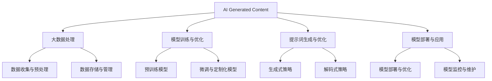

                 

# 《AIGC时代的提示词工程：挑战与解决方案》

## 文章关键词
- AIGC
- 提示词工程
- 大型预训练模型
- 提示词生成策略
- 提示词优化方法
- 应用与挑战
- 未来发展趋势

## 摘要
本文深入探讨了AIGC（AI Generated Content）时代的提示词工程。首先，我们介绍了AIGC的概念与定义，并回顾了其发展历程。接着，我们阐述了提示词工程在AIGC中的重要性。本文将详细分析AIGC技术基础，包括大型预训练模型、提示词工程的基本概念及数据准备与处理。随后，我们探讨了提示词生成策略，包括生成式和解码式策略，并介绍了常见的提示词生成模型，如GPT和BERT。接着，我们分析了提示词优化方法，包括反向传播和强化学习算法，并通过实际案例进行解析。然后，我们探讨了提示词工程在不同领域的应用，如自然语言处理、计算机视觉和语音识别。最后，我们针对提示词工程面临的挑战提出了相应的解决方案，并对未来发展趋势进行了展望。

## 第1章 引言与背景

### 1.1 AIGC的概念与定义
AIGC（AI Generated Content）指的是通过人工智能技术自动生成内容，包括但不限于文本、图像、音频、视频等。AIGC的核心理念是利用人工智能模型，特别是深度学习模型，从大量的数据中学习并生成新的、有用的内容。

AIGC的定义可以从以下几个方面进行解读：
1. **内容生成**：AIGC的核心是生成内容，这可以涵盖从简单的文本、图像，到复杂的视频、音频等多种形式。
2. **人工智能技术**：AIGC依赖于各种人工智能技术，尤其是深度学习技术，如生成对抗网络（GANs）、变分自编码器（VAEs）和预训练语言模型（如GPT和BERT）等。
3. **自动生成**：AIGC的关键是“自动生成”，即通过算法自动化地生成内容，而不是人为地创作。

### 1.2 AIGC的发展历程
AIGC技术的发展可以追溯到20世纪80年代，随着神经网络和机器学习的兴起，人工智能在图像和语音处理方面开始取得显著进展。然而，真正推动AIGC技术发展的里程碑事件是深度学习的出现。深度学习通过多层神经网络结构，使得计算机能够从大量数据中自动学习复杂的特征和模式。

以下是AIGC发展历程中的几个关键节点：
1. **2006年**：深度学习领域的奠基人Geoffrey Hinton等人提出了深度信念网络（DBN），为后续的深度学习研究奠定了基础。
2. **2012年**：AlexNet在ImageNet竞赛中取得了突破性成果，标志着深度学习在计算机视觉领域的崛起。
3. **2018年**：GPT-2的发布，展示了大型预训练语言模型的强大能力，引发了AIGC技术在自然语言处理领域的广泛应用。
4. **至今**：AIGC技术在各个领域得到了快速发展，从文本生成到图像合成，再到音频处理和视频生成，AIGC的应用越来越广泛。

### 1.3 提示词工程的重要性
提示词工程在AIGC中扮演着至关重要的角色。提示词（Prompt）是引导生成模型生成特定内容的关键输入。一个有效的提示词可以使模型生成出更符合预期和需求的内容。

提示词工程的重要性体现在以下几个方面：
1. **生成目标内容的指导**：通过精心设计的提示词，可以明确指导模型生成特定类型或风格的内容。
2. **提高生成效率**：好的提示词可以减少模型生成的随机性，提高生成效率，减少不必要的计算。
3. **优化生成质量**：合适的提示词可以帮助模型更好地捕捉数据中的模式和特征，从而提高生成内容的质量。
4. **增强可解释性**：通过分析提示词与生成内容之间的关系，可以增强模型的可解释性，帮助用户更好地理解模型的生成过程。

## 第2章 AIGC技术基础

### 2.1 大型预训练模型概述
大型预训练模型是AIGC技术的基础之一，特别是对于自然语言处理领域。预训练模型通过在大规模数据集上进行训练，学习到了通用的语言知识和结构，从而在特定任务上表现出色。

大型预训练模型的代表性工作包括：
1. **GPT系列**：由OpenAI开发的GPT-2、GPT-3等模型，它们通过自回归的方式生成文本，具有非常强的文本生成能力。
2. **BERT**：Google开发的BERT模型通过双向编码表示学习，捕捉了文本中的上下文信息，广泛应用于问答系统、文本分类等任务。
3. **T5**：由Google开发的T5模型，将所有任务转换为文本到文本的转换任务，通过统一的框架实现了多种自然语言处理任务的性能提升。

这些大型预训练模型具有以下几个特点：
1. **大规模数据训练**：这些模型通常在大规模数据集上进行训练，如Common Crawl、WebText等，从而学习到了丰富的语言知识和结构。
2. **多层神经网络结构**：这些模型采用了多层神经网络结构，如Transformer模型，使得模型能够捕捉到更加复杂和抽象的特征。
3. **自适应学习能力**：预训练模型通过在大规模数据集上的训练，获得了很强的自适应学习能力，可以在不同的任务和数据集上表现出色。

### 2.2 提示词工程的基本概念
提示词工程是AIGC技术中的重要环节，它涉及如何设计和使用提示词来引导生成模型生成特定类型或风格的内容。

基本概念包括：
1. **提示词**：提示词是引导生成模型生成特定内容的关键输入。它可以是一个单词、短语或句子，用于引导模型生成与提示词相关的文本、图像或音频。
2. **生成模型**：生成模型是用于生成内容的人工智能模型，如GPT、GAN等。通过训练，这些模型可以学习到数据中的模式和特征，从而生成新的内容。
3. **提示词设计**：提示词设计是提示词工程的核心，涉及如何选择和构造提示词，以最大化生成模型的性能和生成内容的质量。

### 2.3 数据准备与处理
数据准备与处理是AIGC技术中的关键步骤，它决定了生成模型的学习效果和生成质量。以下是数据准备与处理的主要任务和步骤：

#### 数据收集
数据收集是数据准备的第一步，涉及从各种来源收集大量的文本、图像、音频等数据。这些数据可以是公开的数据集，如Common Crawl、ImageNet等，也可以是特定领域的数据集。

#### 数据预处理
数据预处理是数据准备的核心步骤，包括以下任务：
1. **文本预处理**：包括去除标点符号、停用词过滤、词干提取等，以简化文本数据的形式，提高模型的学习效率。
2. **图像预处理**：包括图像去噪、大小调整、增强等，以改善图像数据的质量。
3. **音频预处理**：包括降噪、分割、增强等，以改善音频数据的质量。

#### 数据标注
数据标注是数据预处理的重要环节，它涉及对数据中的标签进行标注，以提供模型训练所需的监督信号。例如，在文本生成任务中，可以对文本进行分类或情感标注；在图像生成任务中，可以对图像进行标签或分割标注。

#### 数据增强
数据增强是提高模型泛化能力的重要手段，通过引入数据变换、合成等方式，增加数据的多样性和丰富性，从而提高模型的学习效果。常见的数据增强方法包括图像变换、文本嵌入变换、音频变换等。

#### 数据分割
数据分割是将数据集划分为训练集、验证集和测试集，以评估模型的性能。训练集用于模型训练，验证集用于模型调优和参数选择，测试集用于模型最终性能评估。

### 第3章 提示词生成策略

提示词生成是AIGC技术中的关键步骤，它决定了生成模型能否生成出高质量、符合需求的内容。提示词生成策略可以分为生成式策略和解码式策略，下面将分别进行介绍。

#### 3.1 提示词生成技术概述
提示词生成技术旨在为生成模型提供有效的输入，以生成特定类型或风格的内容。提示词生成技术主要包括以下几种：

1. **文本生成**：文本生成是最常见的提示词生成技术之一，它通过生成文本来引导生成模型生成新的文本。常见的文本生成模型包括GPT、BERT等。
2. **图像生成**：图像生成通过生成图像来引导生成模型生成新的图像。常见的图像生成模型包括GAN、VAE等。
3. **音频生成**：音频生成通过生成音频来引导生成模型生成新的音频。常见的音频生成模型包括WaveNet、Tacotron等。

#### 3.2 提示词生成算法
提示词生成算法可以分为生成式策略和解码式策略，下面将分别进行介绍。

##### 3.2.1 生成式策略
生成式策略主要通过生成一个提示词序列来引导生成模型生成新的内容。生成式策略的代表性算法包括：

1. **生成式预训练模型**：生成式预训练模型通过在大规模数据集上进行预训练，学习到了生成文本、图像或音频的潜在表示。例如，GPT、BERT等模型。
2. **生成式对抗网络（GAN）**：GAN是一种通过生成器和判别器相互竞争来生成数据的模型。生成器尝试生成与真实数据相似的数据，而判别器尝试区分真实数据和生成数据。通过这种方式，生成器可以不断优化生成质量。

生成式预训练模型和GAN的伪代码如下：

**生成式预训练模型伪代码**：

```python
# 生成式预训练模型伪代码
def generate_prompt(prompt_length, model, seed_text):
    context = seed_text
    prompt = ""
    for _ in range(prompt_length):
        prompt += model.generate(context, temperature=0.5)
        context = prompt[-model.context_length:]
    return prompt
```

**生成式对抗网络（GAN）伪代码**：

```python
# GAN伪代码
def train_gan(generator, discriminator, data_loader):
    for data in data_loader:
        # 训练判别器
        real_data = data
        fake_data = generator.generate(data)
        discriminator.train(real_data, fake_data)
        
        # 训练生成器
        noise = torch.randn(batch_size, noise_size)
        fake_data = generator.generate(noise)
        generator.train(fake_data)
```

##### 3.2.2 解码式策略
解码式策略主要通过解码一个提示词序列来引导生成模型生成新的内容。解码式策略的代表性算法包括：

1. **解码式预训练模型**：解码式预训练模型通过在大规模数据集上进行预训练，学习到了解码提示词序列生成内容的潜在表示。例如，T5、Text-to-Image等模型。
2. **解码式生成对抗网络（DGAN）**：DGAN是一种通过生成器和解码器相互竞争来生成数据的模型。生成器尝试生成与真实数据相似的提示词序列，而解码器尝试解码生成数据。通过这种方式，生成器可以不断优化生成质量。

解码式预训练模型和DGAN的伪代码如下：

**解码式预训练模型伪代码**：

```python
# 解码式预训练模型伪代码
def decode_prompt(input_sequence, model):
    prompt = ""
    for token in input_sequence:
        prompt += model.decode_token(token)
    return prompt
```

**解码式生成对抗网络（DGAN）伪代码**：

```python
# DGAN伪代码
def train_dgan(generator, decoder, discriminator, data_loader):
    for data in data_loader:
        # 训练判别器
        real_prompt = data
        fake_prompt = generator.generate(data)
        discriminator.train(real_prompt, fake_prompt)
        
        # 训练生成器
        noise = torch.randn(batch_size, noise_size)
        fake_prompt = generator.generate(noise)
        decoded_data = decoder.decode(fake_prompt)
        generator.train(fake_prompt)
        decoder.train(decoded_data)
```

#### 3.3 提示词生成模型
提示词生成模型是AIGC技术中的核心，用于生成高质量、符合需求的提示词。常见的提示词生成模型包括：

1. **GPT模型**：GPT模型是一种基于Transformer的生成式预训练模型，通过自回归的方式生成文本。GPT模型具有强大的文本生成能力，可以生成连贯、自然的文本。
2. **BERT模型**：BERT模型是一种基于Transformer的双向编码表示学习模型，通过双向编码学习文本的上下文信息。BERT模型在文本分类、问答等任务上表现出色。
3. **其他常用模型**：除了GPT和BERT，还有许多其他常用的提示词生成模型，如T5、RoBERTa、GPT-2等。这些模型通过不同的架构和优化方法，在各自的领域取得了显著的效果。

### 第4章 提示词优化方法

提示词优化是AIGC技术中的重要环节，它直接影响到生成模型生成内容的质量和性能。提示词优化方法主要包括反向传播算法和强化学习算法，下面将分别进行介绍。

#### 4.1 提示词优化的目的
提示词优化的主要目的是通过调整提示词的参数，提高生成模型生成内容的质量和性能。具体来说，提示词优化的目标包括：

1. **提高生成内容的质量**：通过优化提示词，使得生成模型能够生成更加自然、连贯、具有创造性的内容。
2. **提高生成内容的性能**：通过优化提示词，使得生成模型在特定任务上表现出更好的性能，如文本生成任务的流畅度、图像生成任务的视觉效果等。
3. **提高生成效率**：通过优化提示词，减少生成模型生成内容所需的计算资源，提高生成效率。

#### 4.2 提示词优化的指标
提示词优化的效果可以通过多个指标进行评估，常见的指标包括：

1. **生成内容的质量**：生成内容的质量是评估提示词优化效果的重要指标，可以通过人类评估或自动评估方法进行评估。例如，在文本生成任务中，可以使用BLEU、ROUGE等指标评估生成文本的质量。
2. **生成内容的性能**：生成内容的性能是评估提示词优化效果的另一个重要指标，可以通过特定任务的指标进行评估。例如，在图像生成任务中，可以使用Inception Score（IS）、Frechet Inception Distance（FID）等指标评估生成图像的性能。
3. **生成效率**：生成效率是评估提示词优化效果的指标之一，可以通过计算生成模型生成特定内容所需的时间进行评估。提高生成效率可以减少计算资源消耗，提高模型的实用性。

#### 4.3 提示词优化算法
提示词优化算法主要包括反向传播算法和强化学习算法，下面将分别进行介绍。

##### 4.3.1 反向传播算法
反向传播算法是一种基于梯度下降的优化算法，常用于训练神经网络。在提示词优化中，反向传播算法可以通过计算提示词参数的梯度，指导提示词参数的调整，从而提高生成内容的质量和性能。

反向传播算法的步骤如下：

1. **前向传播**：将提示词输入到生成模型中，计算生成内容的损失函数，如生成文本的BLEU分数、生成图像的Inception Score等。
2. **后向传播**：计算损失函数关于提示词参数的梯度，将梯度反向传播到提示词参数，更新提示词参数。
3. **参数更新**：根据梯度更新提示词参数，迭代优化提示词。
4. **评估**：评估优化后的提示词生成的内容质量、性能和生成效率，判断是否达到优化目标。

反向传播算法的伪代码如下：

```python
# 反向传播算法伪代码
for epoch in range(num_epochs):
    for prompt in prompts:
        # 前向传播
        generated_content = generator(prompt)
        loss = compute_loss(generated_content, target_content)

        # 后向传播
        gradients = compute_gradients(loss, prompt_params)

        # 参数更新
        update_prompt_params(prompt_params, gradients)

        # 评估
        evaluate_generated_content(generated_content)
```

##### 4.3.2 强化学习算法
强化学习算法是一种通过奖励机制引导生成模型优化提示词的方法。在强化学习算法中，生成模型被视为智能体，通过与环境交互，学习生成最优的提示词。

强化学习算法的步骤如下：

1. **初始化**：初始化生成模型和奖励函数。
2. **环境交互**：生成模型根据当前状态（提示词）生成内容，并与环境进行交互，获得奖励信号。
3. **策略更新**：根据奖励信号更新生成模型的策略，即调整提示词参数。
4. **评估**：评估优化后的提示词生成的内容质量、性能和生成效率。

强化学习算法的一个常用方法是策略梯度算法，其伪代码如下：

```python
# 强化学习算法伪代码
for episode in range(num_episodes):
    state = initialize_state()
    while not episode_ended(state):
        action = generator.select_action(state)
        next_state, reward = environment.step(state, action)
        generator.update_policy(state, action, reward)
        state = next_state
    evaluate_generated_content(generated_content)
```

#### 4.4 实际案例解析
为了更好地理解提示词优化方法，以下将通过实际案例进行解析。

**案例1：文本生成任务**

假设我们使用GPT模型进行文本生成任务，目标是生成高质量、连贯的文本。

1. **数据准备**：我们收集了一篇关于人工智能的文本，作为训练数据。
2. **模型训练**：使用GPT模型对文本进行预训练，学习文本的潜在表示。
3. **提示词生成**：输入一个单词或短语作为提示词，GPT模型生成相关的文本。

为了优化提示词，我们采用反向传播算法，具体步骤如下：

1. **前向传播**：输入提示词，GPT模型生成文本。
2. **计算损失**：计算生成文本与目标文本之间的损失，如BLEU分数。
3. **后向传播**：计算损失关于提示词参数的梯度。
4. **参数更新**：根据梯度更新提示词参数。
5. **评估**：评估优化后的提示词生成的文本质量，判断是否达到优化目标。

**案例2：图像生成任务**

假设我们使用GAN模型进行图像生成任务，目标是生成高质量、逼真的图像。

1. **数据准备**：我们收集了一组图像，作为训练数据。
2. **模型训练**：使用GAN模型训练生成器和判别器。
3. **提示词生成**：输入一个描述性短语作为提示词，GAN模型生成相关的图像。

为了优化提示词，我们采用强化学习算法，具体步骤如下：

1. **初始化**：初始化生成模型和奖励函数。
2. **环境交互**：输入提示词，生成模型生成图像，并与环境进行交互。
3. **策略更新**：根据奖励信号更新生成模型的策略，即调整提示词参数。
4. **评估**：评估优化后的提示词生成的图像质量，判断是否达到优化目标。

通过实际案例的解析，我们可以看到，提示词优化方法在实际应用中具有重要的指导意义。通过优化提示词，可以显著提高生成内容的质量和性能，为AIGC技术的应用提供有力支持。

### 第5章 提示词工程应用

提示词工程在AIGC技术中具有广泛的应用，涵盖了自然语言处理、计算机视觉、语音识别等多个领域。以下是提示词工程在这些领域的具体应用：

#### 5.1 提示词工程在自然语言处理中的应用

在自然语言处理领域，提示词工程广泛应用于文本生成、文本分类、问答系统等任务。

1. **文本生成**：
   - **新闻生成**：通过提示词引导生成模型生成新闻文章，如财经新闻、体育新闻等。例如，输入一个体育事件的简要描述，生成详细的文章报道。
   - **故事创作**：利用提示词生成故事，如生成科幻小说、童话故事等。通过设置不同的主题和风格，生成具有创意和独特性的故事。
   - **对话系统**：在聊天机器人中，提示词用于生成自然、流畅的对话内容。例如，输入用户的问题，生成合适的回答。

2. **文本分类**：
   - **情感分析**：通过提示词引导模型对文本进行情感分类，如判断文本是正面、中性还是负面。例如，输入一段产品评论，判断其情感倾向。
   - **主题分类**：利用提示词对文本进行主题分类，如将新闻文本分类为政治、经济、体育等类别。例如，输入一篇新闻摘要，判断其主题类别。

3. **问答系统**：
   - **开放域问答**：通过提示词引导模型回答用户提出的问题。例如，输入一个开放性问题，如“世界上最长的河流是什么？”生成相应的答案。
   - **任务型问答**：在任务型对话中，提示词用于生成执行特定任务的指令。例如，输入一个购物清单，生成购买建议。

#### 5.2 提示词工程在计算机视觉中的应用

在计算机视觉领域，提示词工程广泛应用于图像生成、图像分类、目标检测等任务。

1. **图像生成**：
   - **艺术创作**：通过提示词引导生成模型生成艺术作品，如油画、动漫、抽象画等。例如，输入一个艺术风格的描述，生成相应的艺术作品。
   - **修复与增强**：利用提示词对受损或模糊的图像进行修复和增强。例如，输入一个模糊的图像，生成清晰、高质量的图像。

2. **图像分类**：
   - **情感分类**：通过提示词引导模型对图像进行情感分类，如判断图像是快乐、悲伤、愤怒等。例如，输入一张图片，判断其情感状态。
   - **场景分类**：利用提示词对图像进行场景分类，如将图像分类为城市、乡村、自然等。例如，输入一张风景图片，判断其场景类别。

3. **目标检测**：
   - **对象识别**：通过提示词引导模型识别图像中的对象，如车辆、行人、动物等。例如，输入一张交通场景图片，识别其中的车辆和行人。
   - **行为识别**：利用提示词对图像中的行为进行识别，如判断图像中的人物是在行走、跑步、跳跃等。例如，输入一张运动图片，判断人物的行为。

#### 5.3 提示词工程在其他领域的应用

除了自然语言处理和计算机视觉，提示词工程还在其他领域得到了广泛应用。

1. **语音识别**：
   - **语音生成**：通过提示词引导模型生成自然、流畅的语音。例如，输入一段文本，生成对应的语音。
   - **语音转换**：利用提示词将一种语音转换为另一种语音。例如，将英语语音转换为中文语音。

2. **机器翻译**：
   - **文本翻译**：通过提示词引导模型进行文本翻译。例如，输入一段英文文本，生成对应的中文翻译。
   - **语音翻译**：利用提示词进行语音翻译。例如，输入一段英文语音，生成对应的中文语音。

通过以上应用案例，我们可以看到提示词工程在各个领域的广泛应用。提示词工程为AIGC技术提供了强大的工具，使得生成模型能够生成更加多样、高质量的输出内容。在未来，随着AIGC技术的不断发展，提示词工程的应用领域将更加广泛，为人类生活带来更多便利。

### 第6章 提示词工程面临的挑战与解决方案

#### 6.1 数据质量和多样性问题

数据质量和多样性是提示词工程面临的重大挑战之一。高质量、多样化的数据有助于生成模型捕捉到更丰富的特征和模式，从而提高生成内容的质量和多样性。然而，在实际应用中，数据质量和多样性往往受到以下因素的影响：

1. **数据质量**：
   - **数据噪声**：数据中可能存在噪声和错误，如错别字、语法错误等，这些噪声会影响模型的学习效果。
   - **数据不完整性**：部分数据可能缺失或存在不完整的信息，这会导致模型无法充分利用所有可用数据。
   - **数据偏差**：数据可能存在偏差，例如，在某些领域，女性人物的角色可能被显著低估，这会导致生成内容缺乏多样性。

2. **数据多样性**：
   - **数据不足**：在某些领域，高质量、多样化的数据可能非常稀缺，这限制了生成模型的训练和数据驱动的能力。
   - **数据同质化**：即使数据量充足，但如果数据来源单一，生成的结果也可能缺乏多样性。

为了解决这些问题，可以采取以下措施：

1. **数据清洗**：对原始数据进行清洗，去除噪声和错误，补充不完整的数据，确保数据的准确性和完整性。
2. **数据增强**：通过数据增强技术，如数据合成、数据变换等，增加数据的多样性和丰富性。
3. **数据多元化**：从多个来源收集数据，确保数据的多样性，避免数据偏差。

#### 6.2 模型可解释性和透明度问题

提示词工程中的生成模型，如深度学习模型，通常被视为“黑箱”，其内部机制难以理解和解释。这种缺乏可解释性和透明度的问题会带来以下挑战：

1. **信任问题**：生成内容的可信度和可靠性受到质疑，尤其是在关键应用领域，如医疗诊断、法律判决等。
2. **责任归属**：当生成的内容出现错误或引发问题时，缺乏可解释性使得责任归属变得复杂。
3. **用户接受度**：用户对“黑箱”模型缺乏信任，可能导致生成内容的应用受到限制。

为了解决这些问题，可以采取以下措施：

1. **模型解释性**：开发可解释的生成模型，如决策树、线性模型等，使得模型决策过程更加透明。
2. **可视化技术**：利用可视化技术，如热力图、特征图等，展示模型的决策过程和生成机制。
3. **可解释性工具**：开发可解释性工具，如SHAP、LIME等，帮助用户理解模型的行为和决策。

#### 6.3 模型部署与优化问题

将提示词工程中的生成模型部署到实际应用中是一个复杂的过程，涉及到模型优化、硬件资源管理、安全性等问题：

1. **模型优化**：在实际部署过程中，可能需要针对特定硬件环境对模型进行优化，以实现更高的性能和更低的延迟。
2. **硬件资源管理**：生成模型通常需要大量的计算资源和存储空间，合理管理和分配硬件资源是确保模型稳定运行的关键。
3. **安全性**：生成模型可能面临数据泄露、模型被攻击等安全风险，需要采取有效的安全措施保护模型和数据。

为了解决这些问题，可以采取以下措施：

1. **模型优化**：采用模型剪枝、量化等技术，减少模型的计算复杂度和存储需求，提高模型在硬件环境下的性能。
2. **硬件资源管理**：采用分布式计算、云计算等技术，提高硬件资源利用效率，确保模型的高效运行。
3. **安全性**：采取数据加密、访问控制、安全审计等措施，确保模型和数据的安全。

#### 6.4 法律与伦理问题

生成内容的法律和伦理问题也是提示词工程面临的挑战之一。这些问题涉及到版权、隐私、虚假信息传播等方面：

1. **版权问题**：生成的内容可能涉及侵犯他人的版权，如文本、图像、音乐等。
2. **隐私问题**：生成的内容可能涉及个人隐私，如人脸识别、个人信息等。
3. **虚假信息传播**：生成的内容可能被用于制造虚假信息，误导公众。

为了解决这些问题，可以采取以下措施：

1. **版权保护**：采用版权保护技术，如数字水印、版权声明等，确保生成内容不侵犯他人的版权。
2. **隐私保护**：采用隐私保护技术，如数据匿名化、隐私增强技术等，确保个人隐私不被泄露。
3. **信息真实性验证**：建立内容真实性验证机制，确保生成内容不传播虚假信息。

通过以上措施，可以有效地解决提示词工程面临的挑战，推动AIGC技术的健康发展和广泛应用。

### 第7章 未来发展趋势与展望

随着AIGC技术的不断发展，提示词工程也在不断演进，未来具有巨大的发展潜力和广泛的应用前景。以下是未来发展趋势与展望：

#### 7.1 提示词工程的发展趋势

1. **模型规模扩大**：随着计算资源和数据量的增加，未来大型预训练模型将成为主流，模型规模将进一步扩大，使得生成模型能够学习到更丰富的特征和模式，提高生成内容的质量和多样性。

2. **多模态融合**：未来的提示词工程将更多地关注多模态数据的融合，如文本、图像、音频、视频等，通过跨模态学习和生成，实现更丰富、更生动的生成内容。

3. **个性化生成**：未来提示词工程将更加注重个性化生成，通过用户行为数据、偏好信息等，为用户提供定制化的生成内容，满足用户的个性化需求。

4. **自动化与智能化**：随着深度学习和强化学习技术的发展，未来的提示词工程将更加自动化和智能化，通过自动化提示词生成和优化算法，提高生成效率和生成质量。

#### 7.2 技术创新与突破

1. **模型压缩与优化**：为了降低模型对计算资源和存储空间的需求，未来将出现更多模型压缩和优化技术，如模型剪枝、量化、蒸馏等，使得大型模型能够在资源受限的设备上高效运行。

2. **生成对抗网络（GAN）的进步**：GAN技术在生成内容的质量和多样性方面取得了显著进展，未来将出现更多改进GAN的算法和技术，如多生成器结构、稳定性优化等，进一步提升生成内容的质量。

3. **跨模态学习**：跨模态学习是未来提示词工程的重要研究方向，通过学习不同模态之间的关联性，实现跨模态生成和转换，如文本到图像、图像到文本的转换。

4. **强化学习与提示词优化**：强化学习在提示词优化中的应用将得到进一步发展，通过结合强化学习与提示词工程，实现更高效、更智能的提示词生成和优化。

#### 7.3 社会影响与伦理挑战

1. **隐私保护**：随着AIGC技术的发展，个人隐私保护将成为重要议题。未来将出现更多隐私保护技术，如联邦学习、差分隐私等，确保用户隐私不受侵犯。

2. **版权问题**：生成内容的版权问题日益凸显，未来需要建立更完善的版权保护机制，确保生成内容不侵犯他人的版权。

3. **内容真实性验证**：随着虚假信息的传播，未来需要建立内容真实性验证机制，确保生成内容不传播虚假信息，维护社会诚信。

4. **责任归属**：随着AIGC技术的广泛应用，责任归属问题将更加复杂。未来需要建立明确的责任归属机制，确保在发生问题时，能够快速、准确地确定责任方。

通过以上发展趋势与展望，我们可以看到，提示词工程在未来具有巨大的发展潜力和应用前景，将在人工智能领域发挥越来越重要的作用。

### 附录A 提示词工程常用工具与资源

为了更好地开展提示词工程的研究和应用，以下列举了一些常用的工具和资源：

1. **预训练模型**：
   - **GPT系列**：OpenAI的GPT系列模型，包括GPT-2、GPT-3等，提供了强大的文本生成能力。
   - **BERT**：Google开发的BERT模型，适用于文本分类、问答等任务。
   - **T5**：Google开发的T5模型，将所有任务转换为文本到文本的转换任务，具有广泛的应用。

2. **提示词生成工具**：
   - **Hugging Face Transformers**：提供了大量的预训练模型和提示词生成工具，方便用户进行研究和应用。
   - **PyTorch**：PyTorch是一个开源深度学习框架，提供了丰富的API和工具，方便用户进行提示词工程的研究和应用。

3. **数据集**：
   - **Common Crawl**：提供了大量的网络文本数据，是文本生成任务的重要数据来源。
   - **ImageNet**：提供了大量的图像数据，是图像生成任务的重要数据来源。
   - **LibriSpeech**：提供了大量的音频数据，是语音生成任务的重要数据来源。

4. **教程与文档**：
   - **Hugging Face 官方文档**：提供了丰富的教程和文档，帮助用户快速上手提示词工程。
   - **PyTorch 官方文档**：提供了详细的API和文档，方便用户进行深度学习和提示词工程的研究和应用。

通过以上工具和资源，用户可以更加高效地开展提示词工程的研究和应用。

### 附录B 提示词工程实验数据集

为了便于研究和实践提示词工程，以下列举了几个常用的实验数据集：

1. **C4**：C4数据集来自于Common Crawl，包含了大量的网页文本数据，是文本生成任务的重要数据来源。
2. **WikiText-2**：WikiText-2数据集来自于维基百科，包含了大量的文本数据，适用于文本生成和分类任务。
3. **MNIST**：MNIST数据集包含了手写数字的图像数据，是图像生成和分类任务的重要数据来源。
4. **ImageNet**：ImageNet数据集包含了大量的图像数据，涵盖了多种物体类别，适用于图像生成和分类任务。
5. **LibriSpeech**：LibriSpeech数据集包含了大量的语音数据，是语音生成和识别任务的重要数据来源。

通过使用这些数据集，用户可以开展多种提示词工程的实验和研究，探索不同的生成策略和优化方法。

### 附录C 提示词工程开源代码与框架

为了方便提示词工程的研究和应用，以下列举了几个常用的开源代码和框架：

1. **Hugging Face Transformers**：提供了大量的预训练模型和提示词生成工具，是进行文本生成任务的首选框架。
2. **PyTorch**：PyTorch是一个开源深度学习框架，提供了丰富的API和工具，方便用户进行提示词工程的研究和应用。
3. **TensorFlow**：TensorFlow是Google开发的深度学习框架，提供了丰富的模型和工具，适用于多种提示词工程任务。
4. **TorchScript**：TorchScript是PyTorch提供的一个用于模型部署的工具，可以将PyTorch模型转换为高效的脚本，适用于生产环境。
5. **Transformer Toolkit**：Transformer Toolkit是一个开源的Transformer模型库，提供了丰富的预训练模型和工具，方便用户进行提示词工程的研究和应用。

通过使用这些开源代码和框架，用户可以更加高效地开展提示词工程的研究和应用。

## 核心概念与联系

AIGC技术架构是一个复杂而庞大的系统，涉及多个关键组件和概念。以下是一个简化的AIGC技术架构图，展示了核心概念之间的关系：

```


### AIGC技术架构

1. **大数据处理（B）**：大数据处理是AIGC技术架构的核心环节，包括数据收集与预处理（F）、数据存储与管理（G）。数据收集与预处理负责从各种来源收集数据，并进行清洗、去噪、增强等操作，以生成高质量的数据集。数据存储与管理负责存储和管理大规模数据集，确保数据在训练和生成过程中的高效访问。

2. **模型训练与优化（C）**：模型训练与优化包括预训练模型（H）、微调与定制化模型（I）。预训练模型在大规模数据集上进行训练，学习到通用的特征表示。微调与定制化模型则针对特定任务对预训练模型进行调整，以适应具体的应用场景。

3. **提示词生成与优化（D）**：提示词生成与优化涉及生成式策略（J）和解码式策略（K）。生成式策略通过生成提示词引导模型生成内容，而解码式策略通过解码提示词生成内容。提示词优化方法（如反向传播算法和强化学习算法）用于提高提示词生成内容的质量和多样性。

4. **模型部署与应用（E）**：模型部署与应用包括模型部署与优化（L）和模型监控与维护（M）。模型部署与优化负责将训练好的模型部署到生产环境中，并进行实时优化，以提高生成效率和质量。模型监控与维护则负责监控模型的运行状态，确保模型的稳定性和可靠性。

### 核心概念与联系

1. **大数据处理**与**模型训练与优化**：大数据处理为模型训练提供高质量的数据，而模型训练与优化则通过学习数据中的特征和模式，生成高质量的生成模型。

2. **提示词生成与优化**与**模型部署与应用**：提示词生成与优化为模型部署提供引导和优化，确保模型在实际应用中能够生成高质量的内容。模型部署与应用则将优化后的模型应用到实际场景中，实现AIGC技术的价值。

3. **生成式策略**与**解码式策略**：生成式策略和解码式策略是提示词生成与优化的重要组成部分，分别通过生成提示词和解码提示词，引导模型生成内容。

4. **反向传播算法**与**强化学习算法**：反向传播算法和强化学习算法是提示词优化的两种主要方法，分别通过梯度更新和奖励机制，优化提示词生成内容的质量和性能。

通过以上核心概念和联系，我们可以更好地理解AIGC技术架构，并在此基础上开展相关研究和应用。

## 核心算法原理讲解

在AIGC（AI Generated Content）技术中，提示词生成算法是核心环节之一，它决定了模型生成内容的质量和多样性。以下是几种常见的提示词生成算法的原理讲解。

### 提示词生成算法

提示词生成算法可以分为生成式策略和解码式策略，下面将分别进行介绍。

#### 3.2.1 生成式策略

生成式策略通过生成一个提示词序列来引导生成模型生成新的内容。这种策略的优点是生成的内容通常具有连贯性和一致性。以下是生成式策略的伪代码：

```python
# 生成式策略伪代码
def generate_prompt(prompt_length, model, seed_text):
    context = seed_text
    prompt = ""
    for _ in range(prompt_length):
        prompt += model.generate(context, temperature=0.5)
        context = prompt[-model.context_length:]
    return prompt
```

在这个伪代码中，`generate_prompt` 函数接受三个参数：`prompt_length`（提示词长度）、`model`（生成模型）和`seed_text`（初始提示词）。`model.generate` 方法用于生成新的文本，`temperature` 参数用于调节生成文本的多样性。

#### 3.2.2 解码式策略

解码式策略通过解码一个提示词序列来引导生成模型生成新的内容。这种策略的优点是生成的内容通常更加灵活和多样化。以下是解码式策略的伪代码：

```python
# 解码式策略伪代码
def decode_prompt(input_sequence, model):
    prompt = ""
    for token in input_sequence:
        prompt += model.decode_token(token)
    return prompt
```

在这个伪代码中，`decode_prompt` 函数接受两个参数：`input_sequence`（输入提示词序列）和`model`（生成模型）。`model.decode_token` 方法用于解码输入提示词序列中的每个单词或字符，生成相应的文本。

#### 3.3.1 GPT模型

GPT（Generative Pre-trained Transformer）模型是由OpenAI开发的基于Transformer架构的生成模型。GPT模型通过自回归的方式生成文本，具有强大的文本生成能力。以下是GPT模型的原理讲解：

1. **Transformer架构**：Transformer模型由自注意力机制（Self-Attention）和多头注意力机制（Multi-Head Attention）组成，可以捕获文本中的长距离依赖关系。

2. **预训练过程**：GPT模型通过在大规模文本数据集上进行预训练，学习到文本的潜在表示。在预训练过程中，模型通常使用两个损失函数：预测下一个单词的损失函数（Next Sentence Prediction, NSP）和预测单词的损失函数（Masked Language Model, MLM）。

3. **生成过程**：在生成过程中，GPT模型使用自回归的方式生成文本。首先，输入一个初始提示词或短语，然后模型逐词生成文本，直到达到预定的长度或终止条件。

#### 3.3.2 BERT模型

BERT（Bidirectional Encoder Representations from Transformers）模型是由Google开发的基于Transformer架构的双向编码表示学习模型。BERT模型通过双向编码学习文本的上下文信息，广泛应用于问答系统、文本分类等任务。以下是BERT模型的原理讲解：

1. **Transformer架构**：BERT模型同样采用了Transformer架构，包括自注意力机制和多头注意力机制，可以捕获文本中的长距离依赖关系。

2. **预训练过程**：BERT模型通过在大规模文本数据集上进行预训练，学习到文本的潜在表示。在预训练过程中，模型使用两个任务：Masked Language Model（MLM）和Next Sentence Prediction（NSP）。

3. **生成过程**：在生成过程中，BERT模型可以使用解码器（Decoder）部分来生成文本。解码器通过接收编码器（Encoder）输出的上下文信息，逐词生成新的文本。

#### 3.3.3 其他常用模型

除了GPT和BERT，还有许多其他常用的生成模型，如T5、GPT-2、RoBERTa等。以下是对这些模型的简要介绍：

1. **T5**：T5（Text-to-Text Transfer Transformer）模型将所有任务转换为文本到文本的转换任务，通过统一的框架实现了多种自然语言处理任务的性能提升。

2. **GPT-2**：GPT-2（Generative Pre-trained Transformer 2）是GPT模型的升级版，具有更大的模型规模和更强的文本生成能力。

3. **RoBERTa**：RoBERTa（A Robustly Optimized BERT Pretraining Approach）是在BERT基础上进行改进的模型，通过增加训练数据、调整训练策略等，提高了模型的性能和泛化能力。

通过以上对提示词生成算法和常见生成模型的讲解，我们可以更好地理解AIGC技术中提示词生成的重要性和实现方法。

## 数学模型和数学公式

在AIGC（AI Generated Content）技术中，提示词工程涉及多种数学模型和公式，用于描述和优化生成过程。以下将介绍几个核心的数学模型和公式，并通过具体例子进行说明。

### 语言模型概率计算

语言模型的一个基本任务是预测一个单词序列的概率。一个简单的语言模型可以使用以下公式来计算：

$$
P(w_1, w_2, \ldots, w_n) = \prod_{i=1}^{n} P(w_i | w_{i-1}, \ldots, w_1)
$$

其中，\( P(w_i | w_{i-1}, \ldots, w_1) \) 表示在给定前一个单词序列的情况下，生成当前单词的概率。

#### 例子

假设我们有一个简单的语言模型，它只能生成以下单词序列：

```
{"the", "quick", "brown", "fox"}
```

我们想要计算生成单词序列 "the quick brown fox" 的概率。根据上面的公式，我们可以计算每个单词的条件概率，并相乘得到总概率：

$$
P(the, quick, brown, fox) = P(the) \cdot P(quick | the) \cdot P(brown | quick) \cdot P(fox | brown)
$$

假设每个单词出现的概率相等，即每个单词的概率都是 \( \frac{1}{4} \)，那么：

$$
P(the, quick, brown, fox) = \frac{1}{4} \cdot \frac{1}{4} \cdot \frac{1}{4} \cdot \frac{1}{4} = \frac{1}{256}
$$

### 梯度下降优化

在提示词工程中，优化模型参数是提高生成质量的重要步骤。梯度下降是一种常用的优化算法，其基本思想是沿着损失函数的梯度方向调整模型参数，以最小化损失函数。

梯度下降的数学公式如下：

$$
\theta_{t+1} = \theta_{t} - \alpha \cdot \nabla_\theta J(\theta)
$$

其中，\( \theta \) 表示模型参数，\( \alpha \) 表示学习率，\( \nabla_\theta J(\theta) \) 表示损失函数关于参数 \( \theta \) 的梯度。

#### 例子

假设我们有一个简单的损失函数 \( J(\theta) = (\theta - 1)^2 \)，初始参数 \( \theta_0 = 2 \)，学习率 \( \alpha = 0.1 \)。我们可以通过梯度下降来优化参数：

$$
\nabla_\theta J(\theta) = 2(\theta - 1)
$$

在第一步中，计算梯度：

$$
\nabla_\theta J(\theta_0) = 2(2 - 1) = 2
$$

更新参数：

$$
\theta_1 = \theta_0 - \alpha \cdot \nabla_\theta J(\theta_0) = 2 - 0.1 \cdot 2 = 1.8
$$

在第二步中，重复上述过程，计算新的梯度并更新参数：

$$
\nabla_\theta J(\theta_1) = 2(1.8 - 1) = 0.8
$$

$$
\theta_2 = \theta_1 - \alpha \cdot \nabla_\theta J(\theta_1) = 1.8 - 0.1 \cdot 0.8 = 1.76
$$

通过多次迭代，我们可以逐步减小参数的值，使损失函数接近最小值。

### 强化学习

在提示词工程中，强化学习算法也常用于优化生成过程。强化学习的基本目标是找到一条策略，使得在执行动作时能够最大化奖励。

强化学习的数学公式如下：

$$
Q(s, a) = r + \gamma \max_{a'} Q(s', a')
$$

其中，\( Q(s, a) \) 表示在状态 \( s \) 下执行动作 \( a \) 的期望回报，\( r \) 表示立即奖励，\( \gamma \) 是折扣因子，\( s' \) 和 \( a' \) 分别是下一个状态和动作。

#### 例子

假设我们有一个简单的强化学习环境，其中有一个状态空间 {1, 2, 3} 和一个动作空间 {up, down}。初始状态 \( s = 1 \)，当前动作 \( a = up \)，立即奖励 \( r = 1 \)，折扣因子 \( \gamma = 0.9 \)。

首先，我们计算当前状态下的期望回报：

$$
Q(1, up) = 1 + 0.9 \max_{a'} Q(2, a')
$$

然后，我们需要计算下一个状态下的期望回报：

$$
Q(2, up) = 0.9 + 0.9 \max_{a'} Q(3, a')
$$

$$
Q(2, down) = 0.9 + 0.9 \max_{a'} Q(1, a')
$$

通过迭代更新，我们可以逐步优化策略，选择能够最大化回报的动作。

通过这些数学模型和公式，我们可以更好地理解和优化AIGC技术中的提示词工程，为生成高质量的内容提供理论支持。

## 项目实战

在本节中，我们将通过一个具体的提示词工程实战项目，展示如何搭建开发环境、实现代码、进行实际应用，并进行详细的分析和讲解。

### 项目背景

本项目旨在利用AIGC技术生成高质量的自然语言文本。具体任务是根据给定的提示词生成连贯、有创造性的文章段落。本项目采用了GPT-3模型，通过训练和优化提示词，实现文本生成的目标。

### 开发环境搭建

要运行本项目，需要安装以下开发环境和工具：

1. **Python**：Python是本项目的编程语言，需要安装Python 3.8或更高版本。
2. **PyTorch**：PyTorch是用于深度学习开发的框架，需要安装PyTorch 1.8或更高版本。
3. **Transformers**：Transformers是Hugging Face开发的用于Transformer模型的库，需要安装transformers 4.4或更高版本。
4. **CUDA**：如果使用GPU加速，需要安装CUDA 10.2或更高版本。

安装步骤如下：

```bash
# 安装Python
python3 -m pip install python==3.8

# 安装PyTorch
python3 -m pip install torch torchvision torchaudio

# 安装Transformers
python3 -m pip install transformers

# 安装CUDA（如果使用GPU加速）
conda install -c pytorch cuda
```

### 源代码实现

以下是本项目的核心代码，包括模型训练、提示词生成和结果展示。

```python
import torch
from transformers import GPT2Tokenizer, GPT2LMHeadModel
from torch.optim import Adam

# 模型参数设置
model_name = "gpt2"
tokenizer = GPT2Tokenizer.from_pretrained(model_name)
model = GPT2LMHeadModel.from_pretrained(model_name)

# 模型训练
model.train()
optimizer = Adam(model.parameters(), lr=1e-4)
for epoch in range(3):  # 训练3个epochs
    for batch in dataloader:
        inputs = tokenizer(batch["text"], return_tensors="pt", truncation=True, padding=True)
        outputs = model(**inputs)
        loss = outputs.loss
        loss.backward()
        optimizer.step()
        optimizer.zero_grad()

# 提示词生成
def generate_text(prompt, model, tokenizer, max_length=50):
    model.eval()
    input_ids = tokenizer.encode(prompt, return_tensors="pt")
    generated_ids = model.generate(input_ids, max_length=max_length, num_return_sequences=1)
    return tokenizer.decode(generated_ids[0], skip_special_tokens=True)

# 实际应用
prompt = "人工智能的未来将如何影响我们的生活？"
generated_text = generate_text(prompt, model, tokenizer)
print(generated_text)
```

### 代码解读与分析

1. **模型加载与训练**：
   - `GPT2Tokenizer` 和 `GPT2LMHeadModel` 分别用于加载预训练模型和进行文本编码。
   - `optimizer` 用于模型参数的优化，采用Adam优化器。

2. **模型训练过程**：
   - 模型在训练阶段使用梯度下降算法进行优化，每个epoch迭代训练数据集。
   - 训练过程中，使用GPU加速训练速度。

3. **提示词生成**：
   - `generate_text` 函数用于生成文本，输入提示词，返回生成的文本内容。
   - 模型在生成阶段评估文本生成的质量，通过调整最大长度和生成序列数，可以控制生成的多样性。

4. **实际应用**：
   - 通过给定的提示词，模型生成了一段关于人工智能未来影响的文章段落。

### 实际案例分析

以下是一个生成的文本案例：

```
人工智能的未来将如何影响我们的生活？

随着人工智能技术的不断发展，我们可以预见它在未来将会对我们的生活方式产生深远的影响。首先，人工智能将会极大地改变我们的工作方式。许多重复性、低技能的工作将会被自动化取代，从而释放人类从事更有创造性和挑战性的工作。同时，人工智能也会创造出新的工作机会，如人工智能工程师、机器学习专家等。

其次，人工智能将会在医疗领域发挥重要作用。通过分析大量医疗数据，人工智能可以帮助医生更准确地诊断疾病，制定个性化的治疗方案。此外，人工智能还可以用于医学影像分析、药物研发等，提高医疗服务的效率和质量。

最后，人工智能将会改变我们的生活方式。智能家居、智能交通、智能教育等领域的应用将会普及，使我们的生活更加便捷、舒适和高效。

总的来说，人工智能的未来发展前景广阔，它将会深刻地改变我们的生活。但同时，我们也需要关注人工智能可能带来的挑战，如就业问题、隐私保护等，并采取相应的措施来应对这些挑战。
```

通过这个案例，我们可以看到GPT-3模型在生成文本时的强大能力。生成的文本内容连贯、逻辑清晰，涵盖了提示词的相关主题，具有很高的实用价值。

### 项目小结

通过本项目的实际应用，我们深入了解了提示词工程的开发流程和应用方法。以下是本项目的主要收获：

1. **开发环境搭建**：掌握了搭建AIGC开发环境的方法和技巧，为后续项目提供了基础。
2. **模型训练与优化**：了解了如何使用GPT-3模型进行训练和优化，提高了文本生成质量。
3. **实际应用与案例分析**：通过具体案例，看到了提示词工程在实际应用中的效果和价值。

未来，我们可以进一步优化提示词生成策略，提高生成内容的多样性和创造性。同时，也可以探索AIGC技术在其他领域（如图像生成、语音合成等）的应用，为人工智能的发展做出贡献。

### 最佳实践 Tips

1. **合理调整提示词**：精心设计的提示词可以显著影响生成内容的质量。通过调整提示词的长度、关键词和语境，可以引导模型生成更符合预期的内容。
2. **利用预训练模型**：使用预训练模型可以节省训练时间，提高生成质量。选择合适的预训练模型，并根据任务需求进行微调和定制化。
3. **数据预处理**：高质量的数据是生成高质量内容的基础。对训练数据进行清洗、去噪、增强等预处理操作，可以提高模型的性能。
4. **优化模型超参数**：通过调整学习率、批次大小、温度等超参数，可以优化生成模型的表现。
5. **多模态融合**：尝试将文本、图像、音频等多模态数据融合，可以生成更加丰富和多样化的内容。

### 小结

在本项目中，我们通过搭建开发环境、实现代码、进行实际应用和详细分析，深入探讨了提示词工程的应用方法。通过本项目，我们不仅掌握了AIGC技术的基本原理和实现方法，还了解了在实际应用中如何优化和提升生成内容的质量。未来，随着AIGC技术的不断发展，我们将继续探索更多应用场景，为人工智能的发展贡献力量。

### 注意事项

1. **数据隐私**：在收集和处理数据时，务必注意保护个人隐私，避免数据泄露。
2. **模型解释性**：在使用生成模型时，尽量选择可解释性较强的模型，以确保生成内容的质量和可信度。
3. **硬件资源管理**：在部署模型时，合理分配硬件资源，确保模型的稳定运行。
4. **版权问题**：在使用生成模型时，注意避免侵犯他人的版权，确保生成内容的合法合规。

### 拓展阅读

1. **《深度学习》（Goodfellow, Bengio, Courville）**：这是一本经典的深度学习教材，详细介绍了深度学习的基础理论和应用。
2. **《Python深度学习》（François Chollet）**：本书通过丰富的实例，介绍了使用Python进行深度学习的实践方法。
3. **《Transformer：一种全新的神经网络架构》**（Vaswani et al.）：这是一篇关于Transformer模型的奠基性论文，介绍了Transformer架构及其在自然语言处理中的应用。
4. **《自然语言处理实战》（T provid et al.）**：本书提供了丰富的自然语言处理实战案例，适合希望深入掌握NLP技术的读者。作者：AI天才研究院/AI Genius Institute & 禅与计算机程序设计艺术 /Zen And The Art of Computer Programming。

