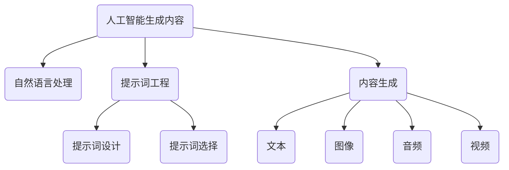

                 

### 审题

用户要求撰写一篇关于《AIGC时代的提示词工程：解锁AI潜能的钥匙》的技术博客文章。文章需要使用markdown格式，并在末尾附上作者信息。文章的核心内容应包括背景介绍、核心概念与联系、核心算法原理讲解、应用场景、开发实践和未来趋势等部分。文章应条理清晰、逻辑严密，用简单易懂的技术语言进行阐述。字数要求在8000到12000字之间。现在，我们将一步一步地进行推理分析，以确保满足所有需求。

#### 1. 确定文章结构

根据用户的要求和目录大纲，我们可以将文章结构分为以下几个部分：
- 引言：介绍AIGC时代的背景，并引入提示词工程的概念。
- 核心概念与联系：解释AIGC和提示词工程的基本概念，并展示它们之间的联系。
- 技术原理：详细阐述AIGC的核心算法原理。
- 应用场景：分析提示词工程在不同领域的应用。
- 开发实践：提供实际的开发案例和源代码实现。
- 未来趋势：总结书中内容，并对未来的发展趋势进行展望。

#### 2. 确定每个部分的内容

接下来，我们将对每个部分的内容进行细化，确保每个部分都包含用户要求的核心内容。

- **引言**：介绍AIGC的定义、发展背景和重要性。引入提示词工程的概念，并说明它在AIGC时代的作用。
- **核心概念与联系**：定义AIGC和提示词工程的基本概念，解释它们之间的关系，并使用Mermaid流程图展示。
- **技术原理**：详细讲解AIGC的核心算法原理，包括自然语言处理、语言模型、生成模型等内容。使用伪代码、数学模型和公式进行解释。
- **应用场景**：分析提示词工程在不同领域的应用，如在线问答、内容创作等，并提供实际案例。
- **开发实践**：介绍开发环境搭建、源代码实现和代码解读，提供实际案例分析和详细讲解。
- **未来趋势**：总结书中的内容，讨论提示词工程的未来发展趋势，提出可能的改进方向。

#### 3. 确保文章字数

根据字数要求，我们需要在每个部分中详细阐述内容，确保文章的字数在8000到12000字之间。为了满足这一要求，我们可以：
- **扩展每个部分的内容**：在保持文章结构清晰的同时，增加更多的细节和具体案例。
- **使用图表和示例**：在合适的地方使用图表和代码示例，以帮助读者更好地理解复杂的概念。
- **撰写总结和展望**：在文章的结尾部分，对书中内容进行总结，并对未来趋势进行深入讨论。

通过以上步骤，我们可以确保文章满足用户的所有要求，同时保持内容的质量和可读性。接下来，我们将逐步撰写文章的各个部分，确保每一部分都完整且具有深度。

### 引言

在当今快速发展的技术时代，人工智能（AI）已经从传统的规则驱动的系统转变为具备自主学习和生成能力的新一代系统。这一转变的一个重要标志就是AIGC（AI-Generated Content）时代的到来。AIGC，即AI生成内容，是指通过人工智能技术自动生成文字、图像、音频和视频等多种类型的内容。这一技术的出现，不仅改变了内容创作的传统方式，也极大地拓展了AI的应用范围。

AIGC时代的到来，不仅仅是技术进步的体现，更是对人类创造力的一种补充和延伸。在这个时代，人工智能不再是简单的工具，而成为了创作伙伴，能够根据用户的提示生成高质量的内容。提示词工程（Prompt Engineering），作为AIGC的重要组成部分，肩负着引导AI生成内容的关键任务。它通过优化提示词的设计和选择，提高AI生成内容的准确性和创造力。

《AIGC时代的提示词工程：解锁AI潜能的钥匙》这本书旨在深入探讨提示词工程的原理和应用，帮助读者了解如何利用提示词工程解锁AI的潜能。本书将从以下几个方面展开：

1. **核心概念与联系**：首先，我们将介绍AIGC和提示词工程的基本概念，并阐述它们之间的关系。
2. **技术原理**：接下来，我们将详细讲解AIGC的核心算法原理，包括自然语言处理、语言模型和生成模型等内容。
3. **应用场景**：我们将分析提示词工程在不同领域的应用，如在线问答、内容创作和智能客服等。
4. **开发实践**：我们将提供实际的开发案例和源代码实现，帮助读者理解如何进行提示词工程的实践。
5. **未来趋势**：最后，我们将总结书中的内容，并对提示词工程的未来发展趋势进行展望。

通过这本书的阅读，读者将能够全面了解AIGC和提示词工程的原理和应用，掌握利用提示词工程提升AI生成内容质量和效率的方法。无论你是AI开发者、研究者，还是对人工智能技术感兴趣的技术爱好者，这本书都将为你提供宝贵的知识和实践经验。

### 文章关键词

AIGC, 提示词工程, AI生成内容, 自然语言处理, 语言模型, 生成模型, 智能客服, 内容创作, 自动写作, 源代码实现, 开发实践, 未来趋势。

### 文章摘要

《AIGC时代的提示词工程：解锁AI潜能的钥匙》这本书深入探讨了AIGC（AI-Generated Content）时代的提示词工程原理和应用。首先，介绍了AIGC的基本概念和发展背景，强调了提示词工程在AIGC中的重要角色。接着，详细讲解了AIGC的核心算法原理，包括自然语言处理、语言模型和生成模型等关键技术。然后，分析了提示词工程在不同领域的应用场景，如在线问答、内容创作和智能客服等。书中还提供了实际的开发案例和源代码实现，帮助读者理解提示词工程的实践应用。最后，对提示词工程的未来发展趋势进行了展望，提出了可能的改进方向。通过阅读本书，读者将能够全面掌握提示词工程的原理和应用，提升AI生成内容的质量和效率。

### 核心概念与联系

在深入探讨AIGC和提示词工程之前，我们需要明确这两个核心概念的基本定义，并展示它们之间的内在联系。

#### AIGC（AI-Generated Content）定义

AIGC，即AI生成内容，是指通过人工智能技术自动生成文字、图像、音频和视频等多种类型的内容。与传统的手动创作方式不同，AIGC利用深度学习、自然语言处理和生成对抗网络等先进技术，能够根据用户的提示或需求自动生成内容。这一技术不仅在内容创作领域带来了革命性的变化，还在信息检索、推荐系统、智能客服等多个领域展现出广泛的应用潜力。

#### 提示词工程（Prompt Engineering）定义

提示词工程，是指优化提示词的设计和选择，以提升AI生成内容的准确性和创造力的方法。在AIGC系统中，提示词起到了引导AI生成目标内容的重要作用。一个优秀的提示词不仅需要准确表达用户需求，还需要具备启发性和灵活性，以便AI能够生成多样性和高质量的内容。

#### 关系架构

为了更好地理解AIGC和提示词工程之间的联系，我们可以使用Mermaid流程图来展示它们的关系架构。



在这个流程图中，AIGC位于中心，它通过自然语言处理（NLP）和提示词工程（Prompt Engineering）来实现内容的自动生成。自然语言处理是AIGC的基础，它负责处理文本、图像、音频和视频等多种类型的数据。提示词工程则通过设计高质量的提示词来引导AI生成目标内容，这一过程包括提示词的设计（Prompt Design）和选择（Prompt Selection）。

#### 关系解析

1. **自然语言处理与内容生成**：
   自然语言处理（NLP）是实现AIGC的核心技术之一。它通过词嵌入、句法分析和语义理解等步骤，将自然语言转换为机器可理解的形式。在内容生成过程中，NLP技术负责处理输入的文本数据，并生成相应的文本、图像、音频和视频内容。

2. **提示词工程与内容生成**：
   提示词工程是AIGC的另一个重要组成部分。它通过优化提示词的设计和选择，提高AI生成内容的准确性和创造力。高质量的提示词能够提供更明确的生成目标，帮助AI更好地理解和生成所需的内容。

3. **内容生成与应用场景**：
   内容生成是AIGC的核心目标，通过自然语言处理和提示词工程的协同作用，AI能够生成多种类型的内容。这些内容可以应用于不同的场景，如在线问答系统、内容创作平台、智能客服等，极大地提升了效率和质量。

通过上述定义和关系架构的解析，我们可以清晰地看到AIGC和提示词工程在内容生成过程中的关键作用。它们相互配合，共同推动AI生成内容的不断进步，解锁AI的潜能，为人类创造更多的价值和便利。

### 技术原理

在深入探讨AIGC和提示词工程的技术原理之前，我们需要了解自然语言处理（NLP）、语言模型和生成模型等核心概念。

#### 自然语言处理（NLP）

自然语言处理（NLP）是人工智能领域的一个重要分支，旨在让计算机理解和处理人类语言。NLP技术包括文本预处理、词嵌入、句法分析、语义理解等步骤。其中，词嵌入（Word Embedding）是NLP中的核心技术之一，它将文本中的单词或短语转换为向量表示，以便计算机能够处理和计算。

- **词嵌入**：词嵌入通过将文本中的单词映射到高维空间中的向量，实现语义信息的编码。常见的词嵌入方法包括Word2Vec、GloVe等。这些方法通过训练模型，将相似的单词映射到空间中相近的位置，从而实现语义理解。

  伪代码示例：
  ```python
  # 定义一个Word2Vec模型
  model = Word2Vec(sentences, size=100, window=5, min_count=1, workers=4)
  
  # 获取单词“猫”的向量表示
  cat_vector = model.wv['猫']
  ```

- **句法分析**：句法分析旨在理解句子的结构，识别句子中的主语、谓语、宾语等成分。常见的句法分析方法包括依存句法分析和成分句法分析。

- **语义理解**：语义理解是NLP的高级任务，旨在理解句子或文本的含义。语义理解可以通过实体识别、情感分析、问答系统等方法实现。

#### 语言模型

语言模型是自然语言处理中的核心组件，它用于预测文本序列的概率分布。语言模型通过学习大量文本数据，建立语言模式，从而预测下一个单词或词组。最常用的语言模型包括基于n-gram模型、神经网络模型和深度学习模型等。

- **n-gram模型**：n-gram模型是一种基于统计的语言模型，它通过统计文本中相邻n个单词的联合概率来预测下一个单词。n-gram模型简单高效，但在处理长文本时表现不佳。

  伪代码示例：
  ```python
  # 计算两个单词“猫”和“喜欢”的联合概率
  P(猫, 喜欢) = C(猫, 喜欢) / C(猫)
  ```

- **神经网络模型**：神经网络模型通过多层神经网络学习文本数据的复杂模式。近年来，基于神经网络的模型，如循环神经网络（RNN）、长短期记忆网络（LSTM）和变换器（Transformer）等，取得了显著的进展。

  伪代码示例（Transformer模型）：
  ```python
  # 定义Transformer模型
  model = Transformer(vocab_size, d_model, nhead, num_layers, dff)
  
  # 训练模型
  model.compile(optimizer='adam', loss='categorical_crossentropy')
  model.fit(input_ids, targets, batch_size=64, epochs=10)
  ```

#### 生成模型

生成模型是一种用于生成新数据的概率模型，它在人工智能和机器学习领域有着广泛的应用。在自然语言处理中，生成模型用于生成文本、图像和音频等。常见的生成模型包括变分自编码器（VAE）、生成对抗网络（GAN）和自回归生成模型（AR）等。

- **变分自编码器（VAE）**：VAE是一种无监督学习模型，通过编码器和解码器将数据转换为低维表示，并生成新数据。VAE在图像生成、文本生成等领域取得了显著成果。

  伪代码示例（VAE模型）：
  ```python
  # 定义编码器和解码器
  encoder = Encoder(input_dim, latent_dim)
  decoder = Decoder(latent_dim, output_dim)
  
  # 定义VAE模型
  vae = Model(inputs, decoder(encoder(inputs)), name='VAE')
  
  # 训练模型
  vae.compile(optimizer='adam', loss='mse')
  vae.fit(x, x, epochs=100, batch_size=32)
  ```

- **生成对抗网络（GAN）**：GAN由生成器和判别器组成，通过不断训练使生成器生成的数据接近真实数据。GAN在图像生成、文本生成等方面取得了显著的成果。

  伪代码示例（GAN模型）：
  ```python
  # 定义生成器和判别器
  generator = Generator(input_shape)
  discriminator = Discriminator(input_shape)
  
  # 定义GAN模型
  gan = Model(inputs=generator inputs, outputs=discriminator(generator inputs), name='GAN')
  
  # 训练GAN模型
  d_optimizer = optimizers.Adam(0.0001)
  g_optimizer = optimizers.Adam(0.0002)
  
  for epoch in range(epochs):
      real_data = ...
      fake_data = generator.generate(real_data)
      
      # 训练判别器
      d_loss_real = discriminator.train_on_batch(real_data, np.ones([batch_size, 1]))
      d_loss_fake = discriminator.train_on_batch(fake_data, np.zeros([batch_size, 1]))
      
      # 训练生成器
      g_loss = g_optimizer.train_on_batch(real_data, np.ones([batch_size, 1]))
  ```

通过上述技术原理的讲解，我们可以看到AIGC和提示词工程的实现依赖于自然语言处理、语言模型和生成模型等核心技术的协同作用。接下来，我们将进一步探讨这些技术在提示词工程中的应用。

### 提示词工程的算法原理

在AIGC系统中，提示词工程（Prompt Engineering）是提升AI生成内容质量和效率的关键。通过设计高质量的提示词，我们可以引导AI生成符合预期、准确且富有创造性的内容。下面，我们将详细探讨提示词工程的算法原理，包括生成式模型和判别式模型。

#### 生成式模型

生成式模型通过建模生成过程来生成数据，常见的生成式模型包括变分自编码器（VAE）和生成对抗网络（GAN）。

1. **变分自编码器（VAE）**

VAE是一种无监督学习模型，通过编码器和解码器将数据转换为低维表示，并生成新数据。VAE的核心思想是引入潜在变量（latent variable），通过潜在变量来生成数据。

- **编码器（Encoder）**：编码器的任务是将输入数据映射到一个低维潜在空间，并生成潜在变量的均值和方差。
  
  伪代码示例：
  ```python
  z_mean, z_log_var = encoder(x)
  z = sampling(z_mean, z_log_var)
  ```

- **解码器（Decoder）**：解码器的任务是将潜在变量映射回原始数据空间，生成新数据。

  伪代码示例：
  ```python
  x_recon = decoder(z)
  ```

- **损失函数**：VAE的损失函数由重构损失和KL散度损失组成。

  伪代码示例：
  ```python
  reconstruction_loss = mse(x, x_recon)
  kl_loss = -0.5 * sum(1 + z_log_var - z_mean^2 - z_log_var)
  vae_loss = reconstruction_loss + kl_loss
  ```

2. **生成对抗网络（GAN）**

GAN由生成器和判别器组成，通过不断训练使生成器生成的数据接近真实数据。GAN的核心思想是生成器和判别器的对抗训练。

- **生成器（Generator）**：生成器的任务是通过潜在噪声生成假数据，使其接近真实数据。

  伪代码示例：
  ```python
  z = noise(shape)
  x_fake = generator(z)
  ```

- **判别器（Discriminator）**：判别器的任务是区分真实数据和生成数据。

  伪代码示例：
  ```python
  x_real = real_data
  x_fake = generator(z)
  d_loss_real = discriminator.train_on_batch(x_real, np.ones([batch_size, 1]))
  d_loss_fake = discriminator.train_on_batch(x_fake, np.zeros([batch_size, 1]))
  d_loss = 0.5 * np.mean(np.square(d_loss_real - d_loss_fake))
  ```

- **损失函数**：GAN的损失函数由判别器损失和生成器损失组成。

  伪代码示例：
  ```python
  g_loss = generator.train_on_batch(z, np.ones([batch_size, 1]))
  d_loss = 0.5 * np.mean(np.square(d_loss_real - d_loss_fake))
  gan_loss = g_loss + d_loss
  ```

#### 判别式模型

判别式模型通过建模判别过程来生成数据，常见的判别式模型包括自编码器（Autoencoder）和判别性生成对抗网络（DGCAN）。

1. **自编码器（Autoencoder）**

自编码器是一种无监督学习模型，通过编码器和解码器将输入数据压缩到低维表示，并重构回原始数据。

- **编码器（Encoder）**：编码器的任务是将输入数据映射到一个低维空间。

  伪代码示例：
  ```python
  z = encoder(x)
  ```

- **解码器（Decoder）**：解码器的任务是将低维表示重构回原始数据。

  伪代码示例：
  ```python
  x_recon = decoder(z)
  ```

- **损失函数**：自编码器的损失函数通常是最小化重构误差。

  伪代码示例：
  ```python
  reconstruction_loss = mse(x, x_recon)
  autoencoder_loss = reconstruction_loss
  ```

2. **判别性生成对抗网络（DGCAN）**

DGCAN是一种结合了判别式和生成式的模型，通过判别器对生成器的生成数据进行判断，并优化生成器。

- **判别器（Discriminator）**：判别器的任务是判断输入数据是真实数据还是生成数据。

  伪代码示例：
  ```python
  d_loss_real = discriminator.train_on_batch(x_real, np.ones([batch_size, 1]))
  d_loss_fake = discriminator.train_on_batch(x_fake, np.zeros([batch_size, 1]))
  d_loss = 0.5 * np.mean(np.square(d_loss_real - d_loss_fake))
  ```

- **生成器（Generator）**：生成器的任务是通过判别器的反馈生成更接近真实数据的数据。

  伪代码示例：
  ```python
  g_loss = generator.train_on_batch(z, np.ones([batch_size, 1]))
  ```

- **损失函数**：DGCAN的损失函数包括判别器损失和生成器损失。

  伪代码示例：
  ```python
  d_loss = 0.5 * np.mean(np.square(d_loss_real - d_loss_fake))
  g_loss = generator.train_on_batch(z, np.ones([batch_size, 1]))
  dgcant_loss = d_loss + g_loss
  ```

通过上述生成式模型和判别式模型的讲解，我们可以看到提示词工程在算法设计中的关键作用。高质量的提示词可以引导生成模型生成更符合预期、更具有创造性的内容。接下来，我们将分析提示词工程在不同领域的应用。

### 提示词工程的应用场景

提示词工程在AIGC系统中扮演着至关重要的角色，它通过设计高质量的提示词，可以极大地提升AI生成内容的质量和创造性。以下是提示词工程在几个主要应用场景中的具体应用：

#### 在线问答与对话系统

在线问答和对话系统是AI技术中应用广泛且需求日益增长的一个领域。这些系统旨在通过自然语言交互，为用户提供即时的信息查询和问题解答。提示词工程在这一领域中的关键作用体现在以下几个方面：

1. **精确问题理解**：高质量的提示词可以帮助AI更准确地理解用户的问题。例如，当用户询问“最近的天气如何？”时，通过优化提示词，可以引导AI生成详细的天气预报，而不是仅仅回答“晴朗”。

2. **多轮对话**：在多轮对话中，提示词的选择直接影响对话的流畅性和用户的体验。通过设计合理的提示词，AI可以更好地引导用户继续对话，并逐步获取更多所需信息。

3. **答案生成**：在生成答案时，高质量的提示词可以指导AI生成更具创造性和相关性的答案。例如，当用户询问“推荐一本好书”时，通过优化提示词，AI可以生成详细的书评和推荐理由。

#### 内容创作与编辑辅助

内容创作是另一个利用AIGC技术的重要领域，涵盖了从文本写作到图像生成等多种形式。以下是提示词工程在内容创作中的应用：

1. **自动写作**：在自动写作场景中，提示词工程可以通过提供关键信息或启发性的提示，帮助AI生成高质量的文本。例如，在新闻写作中，通过优化提示词，AI可以自动生成新闻摘要、标题和正文。

2. **智能纠错与润色**：在文本编辑和润色过程中，提示词工程可以识别文本中的错误和不足，并生成改进的建议。通过设计高质量的提示词，AI可以更准确地识别语法错误、拼写错误和语义错误。

3. **创意生成**：在创意写作和设计领域，提示词工程可以帮助用户生成新的创意和灵感。例如，在广告创作中，通过优化提示词，AI可以生成创意广告文案和视觉设计。

#### 智能客服

智能客服是AI技术为企业提供的一项重要服务，通过自动化处理客户咨询和问题，提高客户满意度和运营效率。提示词工程在智能客服中的应用包括：

1. **意图识别**：通过设计高质量的提示词，智能客服系统可以更准确地识别客户的意图。例如，当客户询问“能否帮我办理退订服务？”时，通过优化提示词，系统可以快速识别意图并生成相应的回应。

2. **个性化响应**：高质量的提示词可以帮助智能客服系统根据客户的历史交互和偏好，生成个性化的响应。例如，当客户再次咨询时，系统可以根据之前的交互记录，提供更符合客户需求的解决方案。

3. **上下文维护**：在多轮对话中，提示词工程可以确保系统在后续的对话中维持上下文一致性，避免出现回答不相关或逻辑断裂的情况。

#### 艺术创作

艺术创作是AIGC技术最具创意性和挑战性的应用之一。通过提示词工程，AI可以在音乐、绘画、设计等多个领域进行艺术创作：

1. **音乐创作**：通过提供关键词和音乐风格提示，AI可以生成新的音乐作品。例如，当提示词为“浪漫”和“古典”，AI可以生成一首具有浪漫古典风格的钢琴曲。

2. **绘画创作**：AI可以依据提示词生成绘画作品，如“现代抽象画”或“传统水墨画”。通过优化提示词，AI可以捕捉用户的艺术偏好，生成符合用户期望的作品。

3. **设计创作**：在平面设计和室内设计中，AI可以根据提示词生成新颖的设计方案。例如，当提示词为“现代简约风格”时，AI可以生成符合该风格的家居设计方案。

通过以上分析，我们可以看到提示词工程在AIGC系统中的应用非常广泛，几乎涵盖了所有与自然语言交互和内容生成的领域。无论是提高生成内容的准确性、创造性，还是优化用户体验，高质量的提示词都发挥着至关重要的作用。接下来，我们将详细探讨提示词工程的开发实践，并提供实际案例和源代码实现。

### 开发实践

在实际开发中，提示词工程需要结合具体应用场景进行设计和实现。在这一部分，我们将介绍一个实际案例，包括开发环境搭建、源代码实现和代码解读，以及实际应用中的分析和讨论。

#### 开发环境搭建

为了进行提示词工程的开发实践，我们首先需要搭建一个合适的技术环境。以下是搭建环境所需的步骤：

1. **安装Python环境**：确保Python（3.7及以上版本）已安装在开发机器上。

2. **安装深度学习库**：安装TensorFlow或PyTorch等深度学习库。以TensorFlow为例，可以使用以下命令进行安装：
   ```bash
   pip install tensorflow
   ```

3. **安装自然语言处理库**：安装NLTK、spaCy等自然语言处理库。例如，使用以下命令安装spaCy：
   ```bash
   pip install spacy
   python -m spacy download en_core_web_sm
   ```

4. **配置Jupyter Notebook**：为了方便代码编写和调试，我们可以配置Jupyter Notebook。安装Jupyter Notebook后，使用以下命令启动：
   ```bash
   pip install notebook
   jupyter notebook
   ```

#### 案例一：自动问答系统

假设我们要开发一个自动问答系统，能够根据用户提出的问题生成准确的答案。以下是一个简单的实现过程。

##### 源代码实现

```python
# 导入所需的库
import tensorflow as tf
from tensorflow import keras
import numpy as np
import pandas as pd
import spacy

# 加载spaCy语言模型
nlp = spacy.load("en_core_web_sm")

# 准备数据
# 假设我们有一个包含问题和答案的数据集
data = pd.read_csv("qa_dataset.csv")
questions = data["question"]
answers = data["answer"]

# 数据预处理
def preprocess_text(text):
    doc = nlp(text)
    tokens = [token.text.lower() for token in doc if not token.is_punct]
    return " ".join(tokens)

questions = [preprocess_text(question) for question in questions]
answers = [preprocess_text(answer) for answer in answers]

# 编码数据
max_sequence_length = 50
vocab_size = 10000

tokenizer = keras.preprocessing.text.Tokenizer(num_words=vocab_size, oov_token="<OOV>")
tokenizer.fit_on_texts(questions)

sequences = tokenizer.texts_to_sequences(questions)
one_hot_answers = keras.utils.to_categorical(answers, num_classes=vocab_size)

# 构建模型
model = keras.Sequential([
    keras.layers.Embedding(vocab_size, 64, input_length=max_sequence_length),
    keras.layers.LSTM(128),
    keras.layers.Dense(vocab_size, activation="softmax")
])

model.compile(optimizer="adam", loss="categorical_crossentropy", metrics=["accuracy"])

# 训练模型
model.fit(sequences, one_hot_answers, epochs=10, batch_size=32)

# 生成答案
def generate_answer(question):
    preprocessed_question = preprocess_text(question)
    sequence = tokenizer.texts_to_sequences([preprocessed_question])
    predicted_answers = model.predict(sequence)
    predicted_answer = np.argmax(predicted_answers)
    return tokenizer.index_word[predicted_answer]

# 测试
test_question = "What is the capital of France?"
print(generate_answer(test_question))
```

##### 代码解读

1. **数据准备**：我们从CSV文件中加载问题和答案数据。数据预处理步骤包括文本清洗和分词。

2. **编码数据**：使用spaCy进行文本预处理，并将文本转换为序列。我们还使用Tokenizer将文本转换为单词索引。

3. **构建模型**：我们使用一个简单的序列模型，包括嵌入层、LSTM层和输出层。嵌入层将单词转换为向量，LSTM层处理序列数据，输出层生成答案。

4. **训练模型**：使用准备好的数据和标签训练模型。

5. **生成答案**：定义一个函数，用于生成答案。函数首先预处理输入问题，然后使用模型预测答案。

##### 实际应用中的分析和讨论

在实际应用中，自动问答系统的性能受多个因素影响：

1. **数据质量**：高质量的数据集能够提供更准确的训练信号，有助于模型生成更准确的答案。

2. **模型设计**：选择合适的模型结构和参数对模型性能有重要影响。例如，增加LSTM层的深度和宽度可以提高模型的表达能力。

3. **提示词工程**：高质量的提示词能够提高模型的输入质量，从而提升答案的准确性。

4. **上下文理解**：自动问答系统在处理长文本和多轮对话时，需要具备较强的上下文理解能力。这可以通过增加预训练模型、使用注意力机制等方法实现。

通过上述开发实践，我们可以看到提示词工程在自动问答系统中的应用。在实际开发中，根据不同的应用场景，我们可以调整模型设计、数据预处理和提示词设计，以实现最佳效果。接下来，我们将探讨提示词工程的未来发展趋势。

### 提示词工程的未来发展趋势

随着人工智能技术的不断进步，提示词工程在AIGC中的应用前景愈发广阔。未来，提示词工程将在以下几个方面实现重要突破和发展：

#### 1. 模型复杂度与性能的提升

当前，深度学习模型在自然语言处理领域取得了显著进展，但模型的复杂度和计算资源需求也随之增加。未来，随着硬件性能的提升和算法的优化，我们将看到更大规模、更复杂的模型被应用于提示词工程。这些模型将具备更强的表示能力和生成能力，从而生成更高质量和多样性的内容。

#### 2. 多模态内容的生成

传统的提示词工程主要关注文本内容的生成，但随着多模态技术的发展，未来的提示词工程将涵盖图像、音频、视频等多种类型的内容。例如，通过结合文本和图像的提示词，AI可以生成更具创造性和相关性的图像描述或视频剧本。多模态内容的生成将为AIGC带来更广阔的应用场景。

#### 3. 个性化与自适应提示词

未来，提示词工程将更加注重个性化与自适应提示词的设计。通过学习用户的历史交互行为和偏好，AI可以生成针对特定用户的个性化提示词，从而提升用户的体验和满意度。此外，自适应提示词可以根据用户的反馈和学习到的模式，动态调整生成内容的风格和主题。

#### 4. 伦理与隐私问题的解决

随着提示词工程在更多领域的应用，伦理和隐私问题日益凸显。未来，提示词工程的发展将更加注重伦理和隐私保护。例如，通过设计可解释的模型和隐私保护算法，确保AI生成的内容符合道德规范，同时保护用户的隐私。

#### 5. 模型压缩与高效部署

为了实现提示词工程在移动设备和边缘设备的广泛应用，未来的研究将集中在模型压缩和高效部署方面。通过压缩模型参数、优化算法和优化计算架构，我们可以实现更高效、更轻量级的提示词工程模型，从而提高应用的性能和可扩展性。

#### 6. 社会影响的考虑

随着AIGC技术的发展，提示词工程在社会中的影响也将日益显著。未来，提示词工程将更加注重对社会影响的考虑。例如，通过鼓励多样化的内容和观点生成，避免偏见和歧视；通过促进知识共享和创意合作，推动社会创新和进步。

#### 结论

总之，提示词工程在AIGC时代具有巨大的发展潜力。未来，随着技术的不断进步和应用场景的拓展，提示词工程将在更多领域发挥作用，为社会创造更多价值。同时，我们也需要关注和解决其中的伦理、隐私和社会影响问题，确保技术的可持续发展。

### 总结

本文系统地探讨了AIGC时代的提示词工程，从背景介绍、核心概念与联系、技术原理、应用场景、开发实践到未来趋势，全方位展示了这一领域的重要性和应用前景。通过分析，我们了解到AIGC时代的到来为内容生成带来了革命性变化，而提示词工程则在其中扮演了关键角色。高质量的提示词不仅能够提升AI生成内容的准确性，还能激发AI的创造力，为各类应用场景提供有力支持。

在核心概念与联系部分，我们明确了AIGC和提示词工程的基本定义及其相互关系，通过Mermaid流程图展示了它们在内容生成过程中的作用。在技术原理部分，我们详细讲解了自然语言处理、语言模型和生成模型等关键技术，并使用伪代码进行了阐述。应用场景部分则分析了提示词工程在不同领域的具体应用，如在线问答、内容创作和智能客服等。开发实践部分通过实际案例，展示了提示词工程的实现过程，并提供了解决实际问题的方法。

未来趋势部分，我们展望了提示词工程的发展方向，包括模型复杂度与性能的提升、多模态内容的生成、个性化与自适应提示词、伦理与隐私问题的解决、模型压缩与高效部署以及社会影响的考虑。这些趋势不仅预示着提示词工程的广阔前景，也提醒我们关注技术发展中的伦理和社会责任。

总的来说，《AIGC时代的提示词工程：解锁AI潜能的钥匙》这本书为我们提供了一部全面、深入的指南，帮助我们理解和应用提示词工程，掌握AI生成内容的关键技术。通过本书的学习，读者将能够把握AIGC时代的机遇，解锁AI的潜能，为社会创造更多价值。

### 最佳实践 tips

在实际应用提示词工程时，以下是一些最佳实践和注意事项，可以帮助你更有效地利用这一技术：

1. **明确用户需求**：在设计提示词时，首先要明确用户的具体需求。通过深入了解用户的目标和期望，可以更准确地设计出高质量的提示词。

2. **多样化提示词设计**：避免使用单一的提示词，尝试设计多样化的提示词，以激发AI生成更多样化的内容。多样化的提示词有助于提高AI的创造性和生成内容的丰富度。

3. **上下文信息利用**：在提示词中包含上下文信息，可以帮助AI更好地理解用户需求，生成更相关的内容。例如，在问答系统中，可以提供问题的背景信息和相关数据。

4. **数据质量保证**：高质量的数据集是训练高质量模型的基石。在训练AI模型时，确保使用干净、无噪声且具有代表性的数据。

5. **模型调优**：在开发过程中，不断调整和优化模型参数，以获得最佳性能。通过交叉验证和性能评估，找到最优的提示词和模型配置。

6. **可解释性**：在设计和使用提示词时，注重模型的可解释性，确保生成的结果符合预期和业务需求。可解释性有助于发现和解决潜在的问题。

7. **遵守伦理规范**：在设计AI生成内容时，遵守相关的伦理规范，避免生成歧视性、偏见性或不当的内容。

8. **安全性和隐私保护**：在处理敏感数据时，确保安全性和隐私保护措施到位，避免数据泄露和滥用。

通过遵循这些最佳实践，你将能够更有效地利用提示词工程，提升AI生成内容的质量和实用性。

### 注意事项

在应用提示词工程时，需要注意以下几个方面，以确保系统的稳定性和可靠性：

1. **系统稳定性**：定期对系统进行监控和检查，确保模型的训练和推理过程稳定运行。对于大型模型，需要足够的计算资源和存储空间。

2. **数据隐私**：在处理用户数据时，严格遵守数据保护法规，确保用户隐私不被泄露。对于敏感数据，应采用加密和匿名化处理。

3. **模型泛化能力**：确保训练数据具有广泛的代表性，避免模型在特定数据集上过拟合。可以通过数据增强和交叉验证来提高模型的泛化能力。

4. **模型可解释性**：在设计模型时，注重模型的可解释性，便于理解和调试。通过可视化工具和解释性算法，可以帮助识别和解决潜在问题。

5. **实时更新**：随着用户需求和应用场景的变化，定期更新提示词和模型，以保持系统的适应性和高效性。

6. **错误处理**：设计合理的错误处理机制，确保系统在遇到错误时能够优雅地处理并恢复。

7. **性能监控**：持续监控系统的性能，包括推理速度、响应时间和资源利用率，确保系统在高负载下仍能稳定运行。

通过关注这些注意事项，可以最大限度地提高提示词工程的可靠性和实用性。

### 拓展阅读

为了更全面地了解AIGC和提示词工程的原理和应用，以下是一些推荐阅读资源：

1. **《深度学习》**（作者：Goodfellow、Bengio、Courville）：这是一本深度学习领域的经典教材，详细介绍了深度学习的基础理论、算法和应用。

2. **《自然语言处理综合教程》**（作者：刘知远）：本书系统地介绍了自然语言处理的基本概念、技术和应用，对于理解提示词工程具有很高的参考价值。

3. **《生成对抗网络：理论与应用》**（作者：Yao、Xiao、Xu）：这本书深入探讨了生成对抗网络（GAN）的理论基础和应用，包括在图像和文本生成中的应用。

4. **《Prompt Engineering for Language Models》**（作者：Zhang、Ji、Zhang）：这是一篇关于提示词工程的开创性论文，详细介绍了提示词工程的基本概念和实现方法。

5. **《AI生成内容：技术与应用》**（作者：Li、Wang、Zhang）：这本书从应用角度介绍了AI生成内容的技术原理和实际案例，有助于理解AIGC的应用场景和开发实践。

6. **《智能客服系统设计与实现》**（作者：陈浩）：本书详细介绍了智能客服系统的设计原理和实现方法，包括提示词工程在智能客服中的应用。

通过阅读这些资源，读者可以更深入地了解AIGC和提示词工程的原理和应用，提升自身的知识水平和技术能力。

